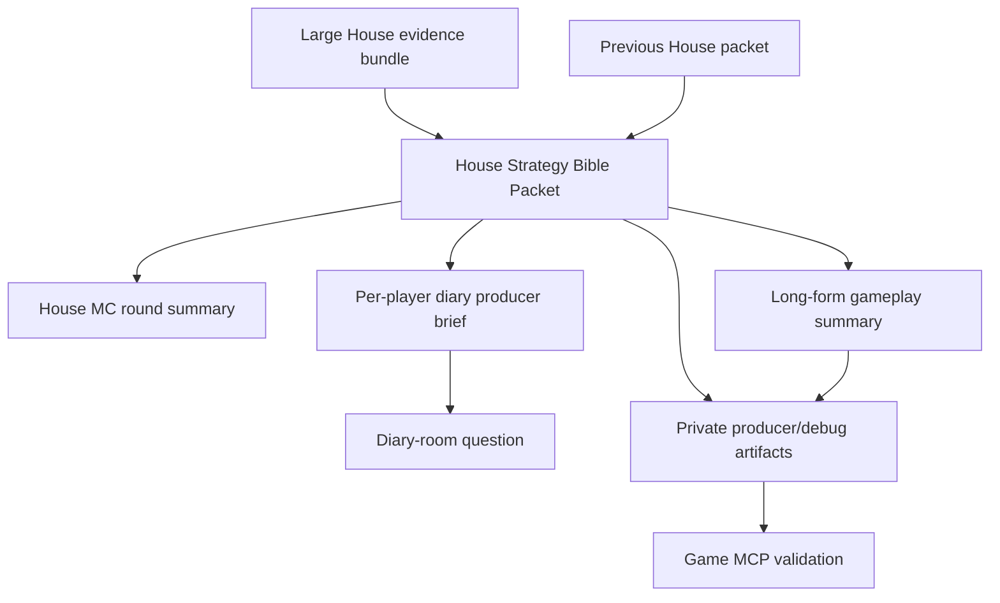

# House Strategy Bible Packet Requirements

## Summary

Add a private House Strategy Bible Packet that The House updates between rounds and uses as the shared source for House MC summaries, long-form gameplay catch-up summaries, and diary-room producer briefs. The packet should identify and name alliance hypotheses, track tensions and story arcs, remember dropped threads, and make The House feel like it has continuous producer intelligence rather than a short transcript tail.

---

## Problem Frame

The current House voice is strong, but its memory surface is thin. Diary questions are generated from compact per-player context, and House MC summaries are generated from recent transcript slices. That makes The House sound omniscient while being structurally prone to forget alliances, unresolved promises, room discoveries, and story threads from earlier rounds.

The agent-side Strategy Thread work gives individual agents multi-round private continuity. The House needs a parallel producer-owned memory: not agent knowledge, not canonical game truth, and not a public transcript fact. It should let the audience-facing narrator, long-form catch-up summaries, and the diary-room interviewer speak from the same strategic read of the game.

This first slice should prove House carry-forward and validation without turning The House into a full relationship graph, dashboard, or resume-safe persistence system.

---

## Key Decisions

- **Structured packet, not prose-only recap.** Carry-forward needs typed private evidence that can be searched, compared, and reused by multiple House surfaces.
- **Producer hypothesis, not canonical truth.** House reads can be confident, dramatic, and evidence-backed, but they remain fallible producer analysis.
- **Shared source for summaries and diary briefs.** V1 drives House MC summaries, long-form catch-up summaries, and diary-room producer briefs so the House voices do not drift.
- **Large House context is acceptable.** V1 should favor enough evidence for strong producer intelligence; cost control belongs in explicit simulator/config modes rather than aggressive prompt trimming.
- **Named alliances are House language.** Alliance names are for producer/debug artifacts and audience narration unless a future feature designs public broadcast reveals.
- **Full simulation logging is part of validation.** Rich producer runs should log the House packet, long-form summaries, producer briefs, summary-window metadata, and enough source pointers for MCP review.

---

## Actors

- A1. **The House** maintains producer-level strategic memory and turns it into narration and diary pressure.
- A2. **Agent player** receives diary questions shaped by The House's producer read, but does not receive the hidden packet or alliance analysis.
- A3. **Viewer / producer** reads MC summaries, long-form catch-up summaries, diary exchanges, and private artifacts to understand the game as a produced social-strategy show.
- A4. **Maintainer / analyst** validates whether House carry-forward worked by inspecting structured simulation artifacts and the game MCP.

---

## Requirements

**Packet lifecycle and content**

- R1. The House must maintain one private Strategy Bible Packet for the live game run.
- R2. The packet must carry forward from one House update to the next instead of being rebuilt only from the most recent transcript tail.
- R3. The packet must track named alliance hypotheses, active tensions, broken or pending promises, vote blocs, notable Mingle discoveries, player trajectory reads, dramatic story arcs, dropped threads, and open uncertainties.
- R4. Each alliance hypothesis must carry enough evidence and confidence language for a reviewer to distinguish a strong read from a speculative story beat.
- R5. The packet must be revised when eliminations, votes, room behavior, diary answers, or later evidence contradict prior House reads.
- R6. A failed packet update must be non-fatal and must not emit a misleading successful packet record.

**House summaries and gameplay catch-up**

- R7. House MC summaries must use the current packet as strategic context, not only a recent transcript slice.
- R8. House MC summaries must reference concrete current dynamics such as named alliances, fractures, leverage, betrayals, or unresolved promises when evidence supports them.
- R9. Round-level House MC summaries must be available in persisted simulation artifacts independent of live `--chatty` terminal output.
- R10. Rich producer runs must emit a long-form House gameplay summary between packet updates so a reviewer can catch up on the game without reading every raw transcript line.
- R11. Long-form summaries must describe teams forming, teams weakening, leverage shifts, unresolved promises, and current strategic pressure when evidence supports those reads.
- R12. Long-form summaries must include House-tracked open questions, phrased as questions about the game state and likely next moves.
- R13. Summary output must not reveal hidden producer reasoning in a way that would become player knowledge during an active game.

**Diary-room producer briefs**

- R14. Before a diary question is generated, The House must derive a private producer brief for that player from the packet and current game context.
- R15. A producer brief must identify the player's current story role, pressure points, relevant alliance hypotheses, contradictions, and one or more question angles.
- R16. Diary questions must be allowed to needle the player with producer awareness without directly exposing hidden facts The House should not reveal.
- R17. Diary question generation must preserve the existing standard that questions reference specific player names, quotes, or events.
- R18. Producer briefs must be inspectable as private artifacts when diary sessions run.

**Observability and validation**

- R19. Packet updates, diary producer briefs, House MC summaries, and long-form gameplay summaries must be represented in structured producer/debug artifacts.
- R20. Rich producer simulation logging must capture House output type, packet revision linkage, covered round or phase window, referenced alliance hypotheses, and source pointers where available.
- R21. The game MCP or existing log search must be able to find packet updates, named alliance hypotheses, producer briefs, MC summaries, and long-form summaries in a completed simulation.
- R22. MCP-facing summary records must make long-form House catch-up content easy to discover as a first-class gameplay artifact, not only as raw transcript text.
- R23. Validation must support tracing a House read across at least two packet revisions or from a packet into a later summary or diary question.
- R24. Simulator output must make the rich producer mode discoverable, including how to run with House packets, long-form summaries, diary sessions, and strategic reflections when desired.
- R25. Token and latency cost must be visible in simulation metadata or logs enough for maintainers to compare rich producer runs against fast validation runs.

**Privacy and separation of truth tiers**

- R26. The House packet must not become agent prompt context for player agents.
- R27. The House packet must not become canonical game state or a canonical event payload.
- R28. Public player speech, Mingle messages, and player-visible game state must not include hidden House packet content unless The House intentionally converts a safe subset into audience narration.
- R29. The packet may use private producer/debug evidence, including agent turns, Mingle intent, strategy packets, diary answers, votes, and reasoning metadata, subject to the existing visibility rules for simulation artifacts.

---

## Key Flows

- F1. **House packet update between rounds**
  - **Trigger:** A round boundary or meaningful producer-summary boundary is reached.
  - **Actors:** A1, A4
  - **Steps:** The House receives a large evidence bundle and the previous packet; updates alliance hypotheses, story arcs, tensions, and uncertainties; emits a private packet artifact.
  - **Outcome:** The next summary and diary questions can use producer memory from prior rounds.
  - **Covered by:** R1, R2, R3, R4, R5, R19

- F2. **House summary from packet**
  - **Trigger:** The simulation reaches a round summary point.
  - **Actors:** A1, A3, A4
  - **Steps:** The House uses the packet and current events to produce either a concise MC summary or a long-form gameplay catch-up summary; the summary is written to persisted artifacts and optionally printed live.
  - **Outcome:** Reviewers can see continuity in House narration, teams forming, and open strategic questions without relying on `--chatty`.
  - **Covered by:** R7, R8, R9, R10, R11, R12, R13, R23

- F3. **Diary producer brief into question**
  - **Trigger:** A diary-room interview is about to ask a player a question.
  - **Actors:** A1, A2, A4
  - **Steps:** The House derives a private brief for that player, then asks a sharp question that references a specific player, quote, or event.
  - **Outcome:** Diary questions feel informed by ongoing story and strategy, while hidden producer analysis stays private.
  - **Covered by:** R14, R15, R16, R17, R18

- F4. **House read revision**
  - **Trigger:** Later evidence weakens or contradicts a prior alliance or story read.
  - **Actors:** A1, A4
  - **Steps:** The House revises confidence, marks a hypothesis fractured or stale, and carries the reason into the next packet.
  - **Outcome:** The packet shows development instead of silently forgetting or repeating stale reads.
  - **Covered by:** R4, R5, R23

- F5. **MCP validation pass**
  - **Trigger:** A maintainer reviews a completed local simulation.
  - **Actors:** A4
  - **Steps:** The maintainer searches for House packet records, named alliances, producer briefs, MC summaries, and long-form summaries; compares packet revisions and checks whether later House outputs used the packet.
  - **Outcome:** House carry-forward can be evaluated from structured artifacts rather than from recap vibes alone.
  - **Covered by:** R19, R20, R21, R22, R23, R24, R25

---

## Acceptance Examples

- AE1. **Covers R1, R2, R3, R19.**
  - **Given:** A game has completed a round with Mingle, rumor, voting, and council.
  - **When:** The House updates its Strategy Bible Packet.
  - **Then:** The new private packet includes updated alliance hypotheses, tensions, story arcs, dropped threads, and uncertainties while retaining relevant context from the previous packet.

- AE2. **Covers R4, R5, R23.**
  - **Given:** The previous packet named a three-player alliance with medium confidence.
  - **When:** One member exposes another or privately contradicts the alliance posture.
  - **Then:** The next packet lowers confidence, marks a fracture, or retires the alliance with an evidence-based reason.

- AE3. **Covers R7, R8, R9, R13.**
  - **Given:** A simulation run is not printing live chatty output.
  - **When:** A round summary point is reached.
  - **Then:** A persisted House MC summary exists and uses packet-backed dynamics without exposing hidden reasoning as player knowledge.

- AE4. **Covers R10, R11, R12, R20, R22.**
  - **Given:** A rich producer simulation has generated a packet revision and additional gameplay has happened before the next packet update.
  - **When:** The House emits a long-form gameplay summary.
  - **Then:** The summary explains teams forming or weakening, names current pressure points, poses House-tracked open questions, and appears as a discoverable MCP/search result with packet linkage.

- AE5. **Covers R14, R15, R16, R17, R18.**
  - **Given:** The packet says Mira and Finn may be protecting each other while Atlas is testing the pair.
  - **When:** The House prepares Mira's diary question.
  - **Then:** The private producer brief names Mira's pressure points and the question probes a specific event or player without revealing the full producer read.

- AE6. **Covers R21, R22, R23, R24.**
  - **Given:** A maintainer runs a rich producer simulation.
  - **When:** They search the game MCP for a named alliance or packet record.
  - **Then:** They can find the packet revision, long-form summary, any related producer brief, and a later summary or diary question that used the read.

- AE7. **Covers R26, R27, R28, R29.**
  - **Given:** A packet update uses private agent-turn evidence and reasoning metadata.
  - **When:** Player agents receive later prompts or public transcript entries are emitted.
  - **Then:** Agents do not receive House packet content, canonical game events do not store House reads as facts, and player-visible speech stays within existing visibility rules.

---

## Success Criteria

- House summaries show continuity across rounds by reusing or revising named dynamics instead of restating generic shifting-alliance language.
- Long-form House catch-up summaries help a reviewer follow teams forming, pressure changes, and open strategic questions without reading every transcript line.
- Diary questions become more pointed because they are driven by player-specific producer briefs.
- Reviewers can trace at least one named alliance hypothesis or story arc across multiple House outputs in a simulation.
- MCP or raw JSONL review can distinguish packet creation, packet revision, diary brief, concise MC summary, and long-form summary output.
- Rich producer runs are discoverable and debuggable without making every fast validation run pay the same cost.
- Hidden House strategy does not leak into agent knowledge, public player speech, or canonical game facts.

---

## Scope Boundaries

In scope:

- Live-run House Strategy Bible Packet.
- Named alliance hypotheses and story arcs as producer/debug state.
- House MC summaries driven by the packet.
- Long-form House gameplay summaries between packet updates.
- Diary-room producer briefs driven by the packet.
- Full rich-producer simulation logging and MCP/search validation for House carry-forward.
- Discoverable simulation mode or configuration for rich producer runs.

Deferred for later:

- Crash-safe persistence and hydration of House packets after process restart.
- Full relationship graph, commitment ledger, dashboard, or scoring system.
- Public broadcast reveal mechanics for House alliance names.
- Aggregate batch analytics for House packet quality across many simulations.

Outside this slice:

- Sharing House packet content with player agents.
- Treating House alliance reads as canonical game events.
- Rewriting agent Strategy Thread packets from House analysis.
- Requiring every House summary or diary question to name an alliance when the evidence is weak.

---

## Dependencies and Assumptions

- The House can use large producer-only context in v1.
- Existing visibility tiers remain authoritative: public transcript, private producer/debug records, and canonical game events stay separate.
- The game MCP and simulation JSONL artifacts remain the primary validation surface for local model behavior.
- Long-form summary cadence is tied to the space between House packet updates, but planning may choose the exact round or phase boundary.
- Diary sessions may stay controlled by simulator/config modes, but when diary runs, producer briefs should drive the questions.
- Planning will decide exact field names, storage location, and update triggers while preserving the product requirements above.

---

## Sources

- `AGENTS.md`
- `CONCEPTS.md`
- `docs/ideation/2026-06-13-house-mc-strategy-carry-forward-ideation.html`
- `docs/solutions/architecture-patterns/agent-strategy-observability-spine.md`
- `docs/brainstorms/2026-06-12-strategy-thread-carry-forward-packet-requirements.md`
- `packages/engine/src/house-interviewer.ts`
- `packages/engine/src/diary-room.ts`
- `packages/engine/src/game-runner.ts`
- `packages/engine/src/simulate.ts`
- `packages/engine/src/game-mcp/read-model.ts`
- `packages/engine/src/game-mcp/server.ts`
