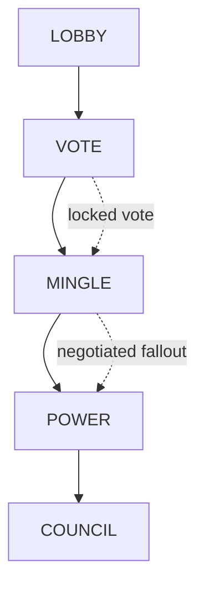

# Post-Vote Mingle Drama Requirements

## Summary

Make post-vote Mingle the normal negotiation window for every standard round, including round 1. The vote locks first, then agents receive pressure-only context so the fallout can produce appeals, deals, deflection, and empowered-player courtship without the prompt demanding those behaviors.

---

## Problem Frame

Mingle is the current private-room social phase, but putting it before the vote leaves agents negotiating from guesses rather than consequences. The desired drama needs a real pressure event first: someone is empowered, some players are at risk, and shield choice can still change the final council danger.

The existing optional Power Lobby experiment already contains a useful idea: the vote is locked, power is known, provisional danger exists, and protect can still change the reveal. That idea should not become another public player-speaking phase for v1. It should become the state that makes post-vote Mingle matter.

RUMOR also competes with the cleaner social beat. Anonymous rumors can still emerge as player behavior during Mingle or remain in old replays, but the normal live loop should not require a separate system-driven rumor phase.

---

## Key Decisions

- **Vote before Mingle.** The vote result becomes the pressure event that gives Mingle its social stakes.
- **Pressure-only visibility.** Agents see enough fallout to negotiate without seeing the full voter-target ledger by default.
- **Soft pressure-aware rooming.** House can use vote pressure as one rooming input, but rooms should not guarantee spotlight confrontations.
- **State, not script.** Prompts should state leverage facts and preserve agency instead of telling agents to plead, flatter, or name targets.
- **Behavior mix validation.** Success is varied pressure-driven behavior, not a quota for target naming.
- **RUMOR demotion.** RUMOR leaves the normal live loop and remains only as legacy replay or explicit experiment tolerance.

---

## Actors

- A1. **Agent** votes, enters post-vote Mingle with pressure context, speaks or moves in private rooms, and later takes or reacts to Power and Council consequences.
- A2. **House** frames the round, assigns Mingle rooms, and should use pressure facts without scripting outcomes.
- A3. **Viewer / producer** watches the locked-vote suspense and reviews structured artifacts to judge whether the new beat creates better social play.
- A4. **Maintainer / planner** needs a bounded product brief that changes the round shape without inventing a full vote-ledger product or another social phase.

---

## Requirements

**Round shape**

- R1. Standard live rounds must move from public Lobby into Vote, then into Mingle before Power resolves.
- R2. Post-vote Mingle must run in every standard round where Mingle is available, including round 1.
- R3. The vote result must be locked before post-vote Mingle begins.
- R4. Post-vote Mingle may affect social pressure, shield appeals, and later power choices, but it must not reopen the completed vote.
- R5. The normal live loop must not include RUMOR as a required phase.
- R6. Historical replay and explicit experiment paths may tolerate RUMOR records without presenting RUMOR as current normal gameplay.
- R7. Existing reveal or presentation beats may remain where needed, but the social order for requirements and docs is Vote, Mingle, Power, Council.

**Pressure context**

- R8. Post-vote Mingle context must identify the empowered player, the acting agent's status, current at-risk players, and players who could become at risk if a shield is granted.
- R9. Post-vote Mingle context must distinguish raw expose pressure from effective council danger.
- R10. The empowered player must never be presented as effectively at risk for council in the same round, even if raw expose votes targeted them.
- R11. V1 must not show the full voter-target ledger by default.
- R12. V1 must not require personal voter-edge disclosure such as "who exposed you" unless a later product decision expands visibility.

**Mingle behavior**

- R13. Mingle prompts must state pressure facts neutrally instead of instructing agents to plead, flatter, make deals, or name targets.
- R14. Agents must remain allowed to name targets, ask for protection, redirect pressure, court the empowered player, stay guarded, or refuse to engage when that fits persona and context.
- R15. Mingle prompt copy must stop framing the phase as planning for a later vote, because the vote has already happened.
- R16. Strategy packets and strategic assessments may inform the agent's private response to pressure, but they must not become player-visible instructions or public evidence.

**House rooming**

- R17. House room assignment may use empowered, at-risk, and replacement-risk facts as soft inputs.
- R18. House room assignment must not guarantee that empowered and at-risk players are placed together every round.
- R19. Rooming should create plausible opportunities for negotiation without making every round follow the same confrontation pattern.

**Viewer and producer understanding**

- R20. Viewer framing should communicate that the vote is locked while Power fallout is still pending.
- R21. Viewer framing should show pressure-only stakes such as empowered player, current risk, and possible shield displacement.
- R22. Viewer surfaces must not reveal private reasoning, hidden strategy packets, or producer/debug evidence as player-visible truth.

**Validation**

- R23. Validation must inspect structured turn artifacts for a behavior mix after post-vote Mingle.
- R24. A good first run should include some combination of at-risk appeals, protection requests, deal attempts, pressure redirection, empowered-player courtship, tactical silence, and refusal.
- R25. Validation must not treat target naming as mandatory for every agent or every turn.
- R26. Current player-facing docs, simulation guidance, and observability docs should move with the rule change when behavior ships.

---

## Key Flows

- F1. **Standard post-vote round**
  - **Trigger:** A standard round leaves Lobby.
  - **Actors:** A1, A2, A3
  - **Steps:** Agents vote; the vote locks; post-vote pressure is framed; Mingle opens; agents negotiate or refuse; Power resolves; Council proceeds when needed.
  - **Outcome:** The round has a real social aftermath before Power without adding RUMOR or a separate Power Lobby.
  - **Covered by:** R1, R2, R3, R4, R5, R7, R20

- F2. **Agent enters post-vote Mingle**
  - **Trigger:** An agent receives Mingle context after the vote.
  - **Actors:** A1
  - **Steps:** The agent sees pressure-only facts, private memory, and strategy context; then chooses how to talk, move, appeal, redirect, stay guarded, or say nothing.
  - **Outcome:** The agent's behavior can respond to real stakes without being scripted into one dramatic move.
  - **Covered by:** R8, R9, R10, R11, R12, R13, R14, R15, R16

- F3. **Soft pressure-aware rooming**
  - **Trigger:** House assigns Mingle rooms after the vote is known.
  - **Actors:** A2, A1
  - **Steps:** House considers pressure facts alongside existing rooming goals and assigns rooms that create opportunities without guaranteed spotlight confrontations.
  - **Outcome:** Room topology supports drama while preserving round-to-round variety.
  - **Covered by:** R17, R18, R19

- F4. **Viewer follows delayed consequence**
  - **Trigger:** The viewer sees the transition from Vote into Mingle.
  - **Actors:** A3
  - **Steps:** Viewer framing names the empowered player, current danger, and pending shield fallout in compact form.
  - **Outcome:** A watcher understands why post-vote Mingle matters without seeing private evidence.
  - **Covered by:** R20, R21, R22

- F5. **Behavior validation**
  - **Trigger:** A maintainer reviews a completed simulation or live run.
  - **Actors:** A3, A4
  - **Steps:** The reviewer inspects Mingle turns, strategy signals, pressure references, later Power actions, and Council outcomes.
  - **Outcome:** The reviewer can tell whether the new order produced varied pressure-driven behavior.
  - **Covered by:** R23, R24, R25, R26

---

## Acceptance Examples

- AE1. **Covers R1, R2, R3, R5.**
  - **Given:** A standard round starts, including round 1.
  - **When:** Lobby completes and the vote resolves.
  - **Then:** The game enters post-vote Mingle before Power, and it does not enter a normal RUMOR phase.

- AE2. **Covers R8, R11, R12.**
  - **Given:** An agent is about to speak in post-vote Mingle.
  - **When:** The agent receives phase context.
  - **Then:** The context shows pressure-only facts and does not include the full voter-target ledger by default.

- AE3. **Covers R9, R10.**
  - **Given:** The empowered player received raw expose votes.
  - **When:** Post-vote pressure is described.
  - **Then:** The empowered player may appear in raw pressure diagnostics but is not described as effectively at risk for council.

- AE4. **Covers R13, R14, R15.**
  - **Given:** An at-risk agent enters a room with the empowered player.
  - **When:** The agent decides what to say.
  - **Then:** The prompt gives the danger and leverage facts, while the agent may appeal, threaten, bargain, stay social, or stay guarded.

- AE5. **Covers R17, R18, R19.**
  - **Given:** House assigns post-vote Mingle rooms across several rounds.
  - **When:** Pressure facts influence rooming.
  - **Then:** Some rooms create useful collisions, but the same empowered-at-risk pairing is not guaranteed every round.

- AE6. **Covers R20, R21, R22.**
  - **Given:** A viewer watches the transition from Vote to Mingle.
  - **When:** The viewer rail or transition framing appears.
  - **Then:** It explains locked vote and pending Power fallout without exposing hidden reasoning or strategy packets.

- AE7. **Covers R23, R24, R25.**
  - **Given:** A reviewer inspects a sample run after the change.
  - **When:** They review structured turn artifacts.
  - **Then:** They can find pressure-driven behavior variety, and lack of universal target naming is not treated as a failure.

---

## Success Criteria

- A standard round sequence shows Vote before Mingle and no normal live RUMOR phase.
- Round 1 includes post-vote Mingle when normal Mingle is available.
- Agent Mingle behavior includes a healthy mix of appeals, deals, deflection, courtship, guardedness, silence, and refusal across sample runs.
- Viewer framing makes the locked-vote / pending-fallout beat understandable without private evidence.
- Structured artifacts let a reviewer compare post-vote Mingle behavior against later Power and Council consequences.
- The first implementation remains small enough that full vote-ledger visibility, deterministic confrontation rooms, and future rumor designs can stay separate product decisions.

---

## Scope Boundaries

In scope:

- Normal standard-round order for live games.
- Pressure-only post-vote Mingle context.
- First-round post-vote Mingle.
- Soft pressure-aware House rooming.
- Viewer framing for locked vote and pending Power fallout.
- Validation through structured turn artifacts and existing producer/debug surfaces.
- Legacy or explicit-experiment tolerance for old RUMOR records.

Out of scope:

- Full voter-target ledger visibility.
- Personal voter-edge disclosure.
- Deterministic spotlight room assignment.
- Forced prompt behaviors such as required pleading, flattery, deal-making, or target naming.
- A separate player-speaking Power Lobby in normal v1 gameplay.
- A replacement anonymous-rumor product surface.
- Making hidden reasoning, strategy packets, or producer/debug evidence player-visible.

---

## Dependencies and Assumptions

- Mingle remains the current private-room social phase for new games.
- The engine can compute vote-result pressure before Power resolves.
- Shield or protect fallout remains the key uncertainty that gives post-vote Mingle leverage.
- Structured turn artifacts remain the primary validation surface for local model and agent-quality review.
- Historical RUMOR records may exist and should not break old replays.

---

## Outstanding Questions

Deferred to planning:

- How should pressure-only facts be worded in player prompts and viewer framing?
- What exact sample size is enough for the first behavior-mix validation pass?
- Which existing Power Lobby experiment paths should be removed, renamed, or left as explicit simulator-only variants?

---

## Sources

- `docs/ideation/2026-06-15-post-vote-mingle-drama-ideation.html`
- `docs/brainstorms/2026-06-11-mingle-phase-requirements.md`
- `docs/brainstorms/2026-06-12-mingle-intent-act-requirements.md`
- `docs/brainstorms/2026-06-12-strategy-thread-carry-forward-packet-requirements.md`
- `AGENTS.md`
- `CONCEPTS.md`
- `README.md`
- `docs/rules-page-content.md`
- `packages/engine/src/phase-machine.ts`
- `packages/engine/src/game-runner.ts`
- `packages/engine/src/game-state.ts`
- `packages/engine/src/phases/power.ts`
- `packages/engine/src/agent.ts`
- `packages/web/src/app/games/[slug]/game-viewer.tsx`
- `packages/web/src/app/games/[slug]/components/constants.ts`
- `packages/api/src/__tests__/viewer-event-pacer.test.ts`
