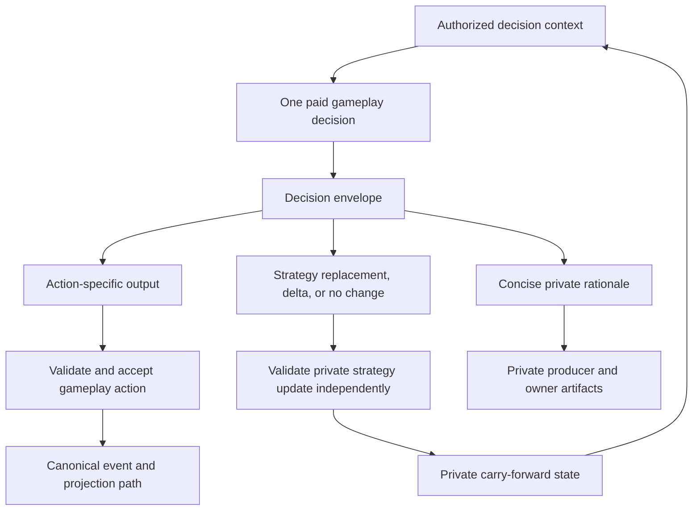

# Compact Decision Envelope Requirements

## Summary

Replace standalone strategic-reflection inference with compact strategy data returned by gameplay calls the product already needs. Normal decisions carry an action, a concise private rationale, and an optional shared strategy delta. Before the first diary, deltas extend an implicit opening posture derived from authored character strategy and available game evidence. After each eviction, the first valid diary answer receives the prior active strategy and establishes a concise-but-complete new baseline; diary follow-ups and later gameplay actions use the same optional delta envelope. If the diary closes without a valid baseline, the next eligible paid decision must repair it without adding a strategy-only call. Completion requires one fresh current-meta twelve-player game run through the local API lifecycle against hosted `gpt-5.6-luna` to produce a human-accepted replacement lab scenario and directional evidence that the game looks cheaper without making a population-wide quality or savings claim.

---

## Problem Frame

The production admin cost snapshot for `mild-olive-ghost` on 2026-08-14 estimated a $1.82 game across 1,225 calls. Strategic reflection accounted for an estimated $0.39 across 184 calls, or about 21% of estimated spend. These are stored static estimates, not provider-native billing.

The runtime currently buys separate reflection calls after introductions, before and after later-round votes, and after diary sessions. Those calls rebuild agent context to produce private fields that overlap with thinking and decisions already produced by adjacent gameplay calls. The resulting artifacts are detailed, but the extra inference cadence is not justified for a zero-revenue product.

The post-eviction diary is already a multi-turn exchange. Survivors need to reconcile the resolved eviction before stale plans can influence the next round, but a separate post-diary reflection repays for context after the diary answers have already supplied a natural strategy handoff.

The cost problem is not solved by splitting reflection into more small calls. The useful agent-review pattern is one paid decision that hands forward compact state, not repeated requests that repay prompt overhead.

The existing prompt-scenario fixture predates the current format-meta ordering and offers no meaningful strategic choice. Equivalent weak options make its assertions vacuous, so it must be replaced by a human-accepted current-meta case before this slice is complete. That scenario-replacement gate qualifies one useful deterministic fixture; it does not prove broad model or game quality.

This slice does not seek a statistical cost model. The `$1.82` production snapshot is a directional reference workload, and one fresh local game is enough for a human to judge whether the agents still appear strategically competent and whether the call, token, and estimated-cost profile looks meaningfully cheaper.

---

## Key Decisions

- **Decision envelope over standalone reflection.** Strategy updates ride the gameplay decision already being purchased; production play has no model call whose sole purpose is reflection.
- **One shared delta contract.** Diary follow-ups and ordinary gameplay actions use the same optional strategy-delta envelope; only the full-update operation allowed on the first post-eviction diary answer is boundary-specific.
- **Implicit opening posture.** Before the first diary, authored character strategy, personality, and available game evidence form the opening baseline; normal gameplay deltas may refine it without buying an initial strategy-only call.
- **Post-eviction replacement before refinement.** A survivor's first diary answer receives the latest baseline (the implicit opening baseline for the first diary) and every mechanically accepted delta since it, reconciles the resolved eviction, and establishes a new strategy baseline. Later answers may append the same shared delta available on other actions.
- **One active strategy epoch.** The current strategy is the latest full baseline plus its accepted deltas in order. A new diary baseline compacts that epoch; earlier baselines and round delta lists may remain private history but are not active prompt state.
- **Repair replacement only without a baseline.** A follow-up may return a full packet only when the first diary packet was mechanically unusable and no valid post-eviction baseline exists.
- **Compact state over field-by-field cognition.** The new packet and its deltas replace the prior granular certainties, suspicions, allies, threats, plan, lens, and packet-update output surface.
- **Concise but complete strategy.** Baselines preserve material live commitments and current coalition and target posture, including intentional uncertainty or no target, without a fixed sentence cap or a return to field-heavy cognition.
- **Action-specific envelopes over a universal action union.** Every action keeps the fields required to execute its mechanic and shares only the compact private rationale and strategy-update contract.
- **Mechanical strategy acceptance only.** A valid gameplay action survives a missing, malformed, oversized, boundary-invalid, or obsolete-revision strategy operation. The engine records the mechanically unusable operation without buying a retry; it does not judge whether natural-language strategy is smart.
- **Frontier-hosted quality target.** Smaller local models do not justify retaining paid reflection calls or the obsolete reflection schema.
- **Private strategy is not game authority.** Canonical events and projections remain authoritative for game facts and accepted actions; private rationale and strategy state remain fallible agent cognition.
- **One-game scenario-replacement gate.** Run exactly one current-meta twelve-player game through the local API lifecycle against hosted `gpt-5.6-luna`, mine its best qualifying survivor chain, and present the candidate and provenance to a human. Human acceptance replaces the weak lab fixture; rejection leaves the gate closed and does not automatically authorize another game.
- **Directional business validation.** Compare the `$1.82` reference workload with the one fresh local game, then make a practical human judgment: do the agents look competent enough, and does the game look meaningfully cheaper? No multi-game sampling or statistical claim is required.

---

## Actors

- A1. Agent chooses a gameplay action and records only the private rationale and strategy change needed for later continuity.
- A2. Game engine validates the gameplay action and private strategy update without allowing cognition to become canonical game truth.
- A3. Maintainer operates the local simulation lane, mines a qualifying lab fixture, and reviews cost and decision quality before production rollout.

---

## Requirements

**Inference cadence**

- R1. Standard production games must not make standalone strategic-reflection model calls.
- R2. Before the first diary, the implicit opening baseline must derive from authored character strategy and personality plus currently available game evidence; introduction, vote, Mingle, alliance, format, and endgame calls may append the same optional strategy delta used after later diary updates.
- R3. A normal decision that does not change strategy must preserve the current carry-forward state without manufacturing filler.
- R4. The product must remove the production reflection cadence rather than hide it behind a disabled feature flag or compatibility path.

**Post-eviction diary reconciliation**

- R5. An accepted elimination must invalidate every survivor's materialized strategy as current before the post-eviction diary begins while retaining the immediately prior full baseline and its accepted deltas as historical input to reconciliation.
- R6. Each survivor's first post-eviction diary answer must receive that prior baseline, its accepted deltas in chronological order, the canonical resolved eviction, and the living roster, then return a concise-but-complete strategy baseline grounded in the new board.
- R7. An accepted first-answer packet must become the new strategy baseline and reset the active delta list; earlier epochs may remain private history but must not be merged automatically into current strategy.
- R8. A later answer in the same diary may omit a strategy change or return the same optional strategy delta envelope available to other gameplay actions.
- R9. A strategy delta must contain only material changes introduced by that answer or action and applies in order against the latest valid baseline plus accepted deltas.
- R10. A mechanically unusable follow-up delta must be ignored without discarding the latest valid session strategy.
- R11. When no valid baseline exists because the first packet was mechanically unusable, an optional House follow-up, if one occurs, may return a complete repair packet instead of a delta.
- R12. If the diary ends without a valid baseline, the next eligible paid decision must request a complete repair packet without blocking its gameplay action or adding a strategy-only call.
- R13. Closing the diary must not trigger a summarization or reflection call; the final active strategy is the accepted baseline plus mechanically accepted deltas in order.

**Decision envelope**

- R14. Each strategic action surface must return one strict action-specific decision envelope.
- R15. The envelope must contain the fields required to execute the current action, one concise private rationale, and the strategy operation allowed at that decision boundary.
- R16. The private rationale must explain the current choice without reproducing raw reasoning, a second decision log, or a full strategic assessment.
- R17. A full strategy packet must be concise but complete enough to preserve material live commitments and the current coalition and target posture, including intentional uncertainty or no target; no fixed sentence limit is required.
- R18. The envelope must not require the former separate certainties, suspicions, allies, threats, plan, strategic-lens rationale, or field-heavy Strategy Thread packet surface.
- R19. Provider-native reasoning context or reasoning summaries may remain an out-of-band observability artifact but must not be required envelope output.

**Validation and authority**

- R20. The engine must validate the gameplay action and mechanically validate the strategy operation as independent lanes from the same response.
- R21. A legal action or diary answer must continue when its strategy operation is missing or mechanically unusable because it is malformed, oversized, not allowed at that decision boundary, or tied to an obsolete baseline revision when revision identifiers are used.
- R22. A mechanically unusable strategy operation must produce an understandable private diagnostic, preserve the prior valid strategy, and must not trigger a strategy-only provider retry.
- R23. Canonical current-board facts must override private cognition when strategy is later used. Structured player references, when the envelope uses them, must target living players, but the engine must not semantically reject natural-language strategy merely because it appears poor, inconsistent, or mistaken.
- R24. Private rationale and strategy state must stay out of player-visible dialogue and canonical game events.

**Continuity and observability**

- R25. Later eligible decisions must receive the latest active baseline plus its mechanically accepted deltas through the protected private context lane, or the implicit opening posture before the first diary. After an eviction, when no replacement or repair baseline exists, they must receive a repair-required marker while the prior epoch remains historical evidence rather than current strategy.
- R26. Phase-boundary recovery must restore the implicit opening posture, the latest accepted active baseline and ordered deltas, or the post-eviction repair-required marker without depending on obsolete reflection-summary or field-heavy packet output.
- R27. Private decision artifacts must preserve the action, rationale, strategy-operation acceptance result, and rejection reason when applicable.
- R28. Owner-authorized reasoning surfaces may expose the compact rationale and accepted strategy state without exposing provider request envelopes or billing metadata.

**Cost and quality**

- R29. Provider-free modeling must compare the `$1.82` reference workload's removed reflection requests against the additional output tokens introduced on retained gameplay and diary calls.
- R30. The model and the one fresh local game must show a meaningfully lower call, token, and estimated-cost profile than the reference workload while a human judges the resulting play strategically competent enough to continue. This is directional business validation, not a multi-game statistical savings or quality claim.
- R31. Provider-free savings projections must price mutually exclusive uncached-input, cached-read, cache-write, and total-output buckets under explicit cache assumptions, must not double-count reasoning tokens included in output, and must remain labeled as estimates.

**Fresh strategic scenario gate**

- R32. Before the scenario-replacement gate can pass, a maintainer must start the local API, then use the API-backed simulation launcher to complete exactly one fresh twelve-player game against hosted `gpt-5.6-luna` using the current format meta with diary and full-fidelity private decision artifacts enabled. No local model backend participates in this gate.
- R33. The mined case must use model-authored non-fallback turns and span one canonical elimination, one survivor's first post-eviction diary answer, any House follow-ups, and that survivor's next eligible strategic decision.
- R34. The next decision must offer at least two legal, materially different choices and include a commitment, alliance, target, or betrayal that could reasonably change the best action.
- R35. The maintainer must select the best qualifying candidate from that game and present its hosted model, local API run configuration, game identity, source turns and events, candidate choices, and reason it has strategic headroom to a human reviewer.
- R36. The human reviewer must explicitly accept or reject the presented candidate. Acceptance opens the gate; rejection leaves it closed and does not automatically trigger or authorize another simulation.
- R37. The human-accepted chain must replace the older weak fixture in the deterministic lab and pass provider-free contracts for legal-action preservation, living-player targeting, commitment availability, post-eviction replacement and repair, and final-strategy carry-forward. Passing these contracts qualifies the fixture and does not prove broad model or game quality.
- R38. A paid-provider simulation must require separate explicit approval; ordinary post-deployment games may supply production evidence without a special paid experiment.

**Scenario gate result — accepted 2026-08-15**

- The authorized gate run completed through the local API lifecycle as the twelve-player game `calm-cyan-frost` (`c8c891fe-9ef1-4019-8e43-d61a26735c33`) using hosted `openai:gpt-5.6-luna`, Flex service, action-policy reasoning, and the current four-format manifest.
- The selected source chain is **Sage Round 2**: Lyra's canonical elimination at event 221, Sage's first post-eviction diary replacement, the optional House follow-up delta, Sage's immediate Round 3 lobby turn, and Sage's nine-choice empower vote for Zara.
- The human explicitly accepted that candidate on 2026-08-15. Its exact roster, source decision/manifests, dialogue, strategy operations, and configuration are frozen in `packages/engine/src/__tests__/fixtures/prompt-scenarios/sage-round-2.ts`.
- This acceptance qualifies one deterministic lab case only. The run's cost and play evidence remains directional and does not become a broad quality or savings claim.

**Removal and documentation**

- R39. The implementation must remove obsolete reflection-only runtime paths, configuration, prompt classes, and current-behavior documentation rather than retaining compatibility fallbacks.
- R40. Historical artifacts and fixtures may describe legacy strategic-reflection records only when clearly identified as historical evidence.
- R41. Documentation for simulation, reasoning observability, local-model evaluation, development, and agent-call behavior must describe decision envelopes, post-eviction replacement, and compact carry-forward state as the current contract.

---

## Key Flows

- F1. Strategic action updates carry-forward state
  - **Trigger:** An agent reaches an eligible gameplay decision.
  - **Actors:** A1, A2
  - **Steps:** The agent returns one decision envelope; the engine validates the action; the engine independently accepts the optional shared strategy delta or preserves the previous state.
  - **Outcome:** The game receives its action and later decisions receive current private strategy without a reflection call.
  - **Covered by:** R1, R2, R3, R14, R15, R20, R25

- F2. Valid action survives a mechanically unusable strategy operation
  - **Trigger:** A normal gameplay envelope contains a legal action and a mechanically unusable strategy operation.
  - **Actors:** A1, A2
  - **Steps:** The engine accepts the action, rejects only a mechanically unusable strategy operation, retains the previous strategy state, and emits a private diagnostic without retrying the provider. It does not score the strategy's natural-language quality.
  - **Outcome:** Cognitive metadata cannot block gameplay or recreate reflection cost through retries.
  - **Covered by:** R21, R22, R23, R27

- F3. Strategy remains unchanged
  - **Trigger:** A gameplay decision does not materially change future posture.
  - **Actors:** A1, A2
  - **Steps:** The envelope signals no strategy change; the engine keeps the latest accepted state; the artifact records no invented update.
  - **Outcome:** Carry-forward stays compact and low-noise.
  - **Covered by:** R3, R18, R25

- F4. Post-eviction diary resets and refines strategy
  - **Trigger:** A canonical elimination resolves before the survivors enter the diary.
  - **Actors:** A1, A2
  - **Steps:** The immediately prior baseline and accepted deltas become historical input; the first answer compacts them with the resolved board into a new baseline; follow-ups may apply the shared delta or repair a mechanically unusable first packet; the diary closes without another call.
  - **Outcome:** The next round receives strategy reconciled to the living board or an explicit repair-required state without standalone reflection inference.
  - **Covered by:** R5, R6, R7, R8, R9, R10, R11, R12, R13, R17

- F5. Phase-boundary recovery restores compact strategy
  - **Trigger:** A game resumes from a supported durable boundary.
  - **Actors:** A2
  - **Steps:** Recovery restores the implicit opening posture, the current full baseline and ordered accepted deltas, or the post-eviction repair marker, then resumes normal decision-envelope behavior.
  - **Outcome:** Removing reflection fields does not erase strategic continuity after restart.
  - **Covered by:** R26, R39

- F6. Maintainer replaces the weak lab scenario
  - **Trigger:** The implementation reaches scenario-replacement validation.
  - **Actors:** A3
  - **Steps:** The maintainer starts the local API, completes exactly one current-meta twelve-player game against hosted `gpt-5.6-luna` through the API-backed launcher, and inspects canonical events and full-fidelity private turn artifacts. The maintainer selects the best qualifying eviction-to-next-decision chain and presents it with provenance to a human. Acceptance freezes it in the deterministic lab; rejection leaves the gate closed without automatically running another game.
  - **Outcome:** The lab receives a human-accepted current-meta fixture with strategic headroom, without treating one game as broad quality proof.
  - **Covered by:** R32, R33, R34, R35, R36, R37

- F7. Maintainer makes a directional cost-and-play judgment
  - **Trigger:** The implementation is ready for cost and quality validation.
  - **Actors:** A3
  - **Steps:** Deterministic models compare removed calls with added output against the `$1.82` reference; the maintainer inspects the one fresh local game's call, token, estimated-cost, and strategic-play profile; projections remain labeled as estimates.
  - **Outcome:** The team can decide whether the game looks cheaper and competent enough to continue without pretending to have population statistics or requiring a special hosted-provider experiment.
  - **Covered by:** R29, R30, R31, R37, R38

---

## Acceptance Examples

- AE1. Covers R1, R14, R15, R25.
  - **Given:** A living agent reaches a later-round vote with prior compact strategy state.
  - **When:** The agent chooses its vote.
  - **Then:** One provider response supplies the vote, private rationale, and optional compact strategy update, and no pre-vote or post-vote reflection call runs.

- AE2. Covers R20, R21, R22, R23, R27.
  - **Given:** An alliance-action envelope proposes a legal alliance but its strategy operation is malformed or uses a full-update operation that is not allowed at that boundary.
  - **When:** The engine validates the envelope.
  - **Then:** The alliance action proceeds, the mechanically unusable strategy operation is ignored with a private diagnostic, the prior state remains, and no provider retry is purchased.

- AE3. Covers R5, R6, R7, R8, R9, R13.
  - **Given:** A survivor enters a post-eviction diary that may include a House follow-up.
  - **When:** The first answer receives the prior active epoch and supplies a valid full baseline, then the follow-up returns the same shared delta envelope available on another action.
  - **Then:** The first packet compacts the prior epoch into the new baseline, the delta is appended in order, and closing the diary buys no further agent call.

- AE4. Covers R19, R24, R28.
  - **Given:** A provider returns a native reasoning summary with a valid decision envelope.
  - **When:** private artifacts are written and public dialogue is emitted.
  - **Then:** authorized private surfaces may retain the reasoning summary while public and canonical surfaces receive neither rationale nor strategy state.

- AE5. Covers R26, R39.
  - **Given:** A game checkpoint follows an accepted strategy update.
  - **When:** the game resumes at a supported phase boundary.
  - **Then:** the agent receives the compact strategy state without hydrating or generating an obsolete strategic-reflection record.

- AE6. Covers R29, R30, R31, R38.
  - **Given:** deterministic cost fixtures represent the `$1.82` reference workload and exactly one fresh local game has completed.
  - **When:** removed reflection requests and added decision-envelope output are priced under explicit cache assumptions and the maintainer reviews the fresh game's play and cost profile.
  - **Then:** the game looks meaningfully cheaper and strategically competent enough to continue, with the result recorded as a directional human judgment rather than a statistical claim or mandatory paid-validation gate.

- AE7. Covers R32, R33, R34, R35, R36, R37.
  - **Given:** The local API completes a fresh current-meta twelve-player `gpt-5.6-luna` game with diary and private decision artifacts enabled.
  - **When:** A non-fallback survivor chain spans an eviction, diary reconciliation, and a next decision with at least two materially different legal choices.
  - **Then:** The run provenance and strategic headroom are presented to a human, and only explicit acceptance lets the chain replace the deterministic lab fixture.

- AE8. Covers R10, R11, R21, R22.
  - **Given:** A survivor's first post-eviction strategy packet is mechanically unusable and the House asks a follow-up.
  - **When:** The follow-up returns a valid complete repair packet alongside its diary answer.
  - **Then:** The answer remains visible, the repair packet becomes the session baseline, and no strategy-only retry is purchased.

- AE9. Covers R34, R35, R36.
  - **Given:** Exactly one fresh twelve-player local-API game completes and the maintainer presents its best candidate to a human.
  - **When:** The human rejects the candidate because its next decision is forced, strategically equivalent, or otherwise unsuitable for the lab.
  - **Then:** The run may remain local evidence, but the replacement gate stays closed and no additional simulation starts automatically.

---

## Success Criteria

- Standard daily games emit zero dedicated strategic-reflection provider calls.
- Deterministic modeling and one fresh local game show a meaningfully cheaper call, token, and estimated-cost profile than the `$1.82` reference workload, and a human judges the play competent enough to continue; the result is explicitly directional rather than statistical.
- Exactly one fresh current-meta twelve-player local-API game is run against hosted `gpt-5.6-luna`, its best qualifying non-fallback eviction-to-diary-to-next-decision chain is presented with provenance, and a human explicitly accepts it for the lab.
- The accepted chain replaces the older weak fixture and preserves legal actions, living-player targeting, remembered commitments, and coherent next-turn posture in provider-free tests without claiming broad game quality.
- Before the first diary, the agent carries an implicit opening posture plus accepted deltas; after each eviction, every survivor either establishes a concise-but-complete replacement baseline grounded in the resolved living board or is marked as requiring repair on the next paid decision.
- Mechanically unusable strategy updates never block a valid action or cause a strategy-only provider retry, and the engine does not reject merely poor natural-language strategy.
- Current documentation has one decision-envelope contract and no active guidance that assigns strategy updates to standalone reflection or a post-diary closing call.

---

## Scope Boundaries

In scope:

- Replacing standalone strategic-reflection inference with compact strategy updates on retained gameplay calls.
- Collapsing model-authored cognitive output to a concise private rationale and compact strategy state.
- Carrying an implicit opening posture until the first diary, replacing strategy on the first post-eviction diary answer, and refining it through the shared optional delta used by other actions.
- Independent action validation and mechanical strategy validation, private observability, durable one-epoch carry-forward, and directional provider-free cost modeling.
- Running exactly one current-meta twelve-player local-API game against hosted `gpt-5.6-luna`, mining its best qualifying post-eviction chain, presenting it to a human, and freezing it into the deterministic lab only after acceptance.
- Removing obsolete production reflection paths instead of keeping a disabled fallback.

Deferred for later:

- Incremental House-summary state and elimination of full-history recap replay.
- Average, percentile, maximum, and per-round cost views in the admin panel.
- Additional prompt-prefix restructuring to convert structural reuse estimates into provider cache hits.
- A broad multi-scenario strategy tournament or permanent scenario-mining pipeline.
- Multi-game sampling or a statistical savings and quality study.

Outside this slice:

- A universal schema shared by unrelated game actions.
- Full field-by-field strategic assessments on every action.
- A separate reflection path for smaller local models.
- Player-visible private rationale, strategy state, or provider reasoning.
- Treating private strategy as canonical game state.

---

## Dependencies and Assumptions

- Frontier hosted models can reliably return strict action-specific envelopes; frozen evals remain responsible for semantic coherence.
- Existing action validation and deterministic fallbacks remain responsible for gameplay legality.
- Canonical current-board facts override every private rationale and strategy state.
- In the current standard format, the first diary follows the first resolved elimination; a post-eviction diary has at least one survivor answer, while any follow-up remains optional.
- The active carry-forward state remains bounded to one full baseline plus its mechanically accepted deltas. The next full diary update compacts that epoch rather than accumulating earlier baselines and delta lists in active prompt state.
- Full-fidelity local simulation source packs may retain real producer-visible context and private decision artifacts; public or committed structural reports preserve their existing redaction boundary without degrading engineering inputs.
- Structural prompt-reuse estimates are observability signals, not provider cache billing or guaranteed savings.
- The configured local API can complete the single bounded twelve-player game against hosted `gpt-5.6-luna` with observable diary and private decision artifacts.

---

## Outstanding Questions

### Deferred to Planning

- Choose the shortest shared envelope vocabulary that preserves action execution, private rationale, no-change signaling, a shared optional delta, and full replacement or repair only at allowed diary boundaries.
- Identify which existing strategic action surfaces already have sufficient structured output and which need the shared envelope added.
- Define deterministic mechanical checks for strategy-operation shape, size, boundary permission, optional baseline revision, and ordered delta application without introducing model retries; leave natural-language strategy quality to lab and human evaluation.
- Select the one-game current-meta local run recipe and candidate-presentation workflow while preserving the human acceptance gate above.

---

## Sources

- User-provided production admin cost snapshot for `mild-olive-ghost`, observed 2026-08-14.
- `packages/engine/src/game-runner.ts`
- `packages/engine/src/diary-room.ts`
- `packages/engine/src/agent.ts`
- `packages/engine/src/game-runner.types.ts`
- `packages/engine/src/context-recall-plan.ts`
- `packages/engine/src/player-continuity.ts`
- `packages/engine/src/__tests__/daily-cost-savings-model.test.ts`
- `packages/engine/src/prompt-scenario-lab.ts`
- `packages/engine/src/__tests__/prompt-scenario-lab.test.ts`
- `packages/web/src/app/admin/admin-cost-view.tsx`
- `docs/reasoning-transcript-observability.md`
- `docs/local-model-evaluation.md`
- `docs/brainstorms/2026-06-12-strategy-thread-carry-forward-packet-requirements.md`
- [OpenAI Structured Outputs](https://developers.openai.com/api/docs/guides/structured-outputs)
- [OpenAI model comparison](https://developers.openai.com/api/docs/models/compare)
