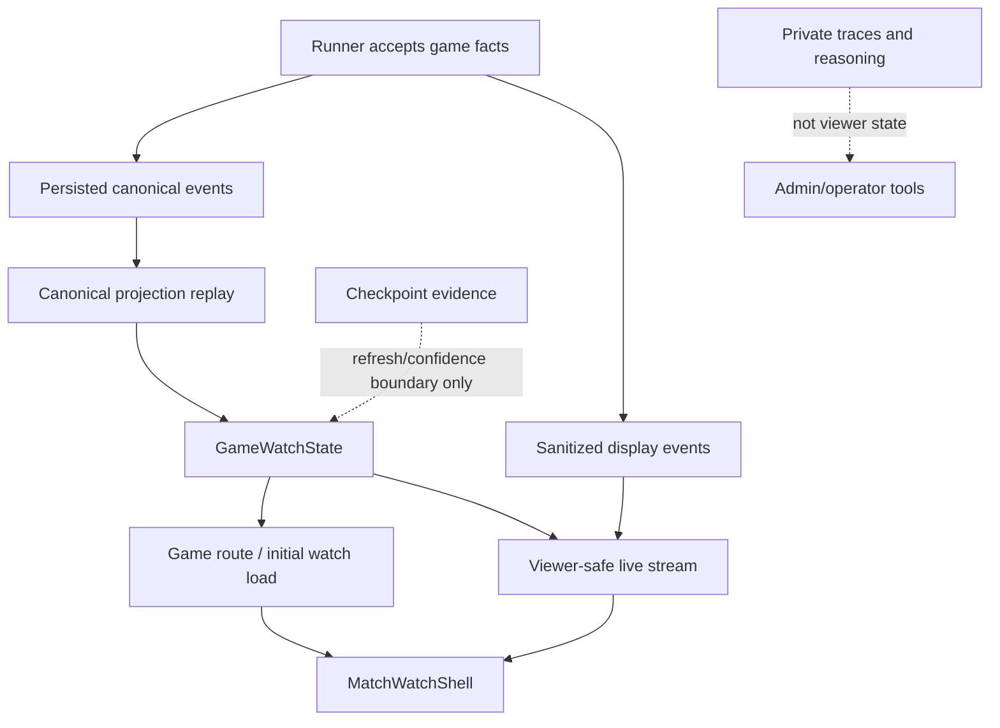

# GameWatchState Requirements

## Summary

Influence should introduce `GameWatchState` as the viewer-safe web read model for live and completed games, derived from persisted canonical events and canonical projection. This slice updates game round, phase, alive/out, winner state, and live watch delivery during the game while replacing the current admin-only runtime snapshot watch interface.

---

## Problem Frame

The current web game detail path still behaves like final-result data with a live veneer. In-progress games report terminal-derived round state, default to `INIT`, and mark every player alive until `game_results` exists. The completed transcript route is also terminal-only.

The system has moved beyond that model. API-backed games can persist ordered canonical events and checkpoint evidence during execution, and the API already has services that validate persisted events and replay them into canonical projection summaries. Production Game MCP proves those persisted projections can be read from database state, but the normal web route and live watch stream still do not consume that truth.

The result is a split-brain watch surface: admins see process-local websocket snapshots, while ordinary game reads remain stale until the end. `GameWatchState` closes that gap without making checkpoint hydration or crash-safe resume claims.

---

## Key Decisions

- **Projection is watch truth.** Shell-level game state should come from persisted canonical events replayed into projection, not from transcript prose or runtime snapshots.
- **State plus stream in the first slice.** Fixing the stale read model without replacing the live delivery path would preserve the bad admin-only split.
- **Persisted catch-up over process catch-up.** Reload and reconnect should start from the latest persisted watch state and event head, even while the runner remains in memory.
- **Viewer-safe by default.** Producer diagnostics, raw checkpoints, private traces, `thinking`, and `reasoningContext` stay out of the watch contract.
- **Display events are not state authority.** Sanitized live transcript or theater events may drive the center view, but they do not define round, phase, alive/out, or winner truth.
- **Checkpoint evidence is not the viewer model.** Checkpoints may define refresh boundaries or confidence metadata, but raw checkpoint payloads are not sent to viewers.
- **Replacement over legacy fallback.** The old admin live-watch socket is not a second watch experience once `GameWatchState` and the viewer-safe stream cover the live route.

---

## Actors

- A1. **Viewer** opens a live or completed game through normal product navigation.
- A2. **MatchWatchShell / game route** needs stable match identity, phase, cast, and final-state facts.
- A3. **GameWatchState read model** turns persisted canonical event/projection truth into a viewer-safe contract.
- A4. **Durable event/projection reader** validates event integrity and rebuilds projection summaries.
- A5. **Viewer-safe live stream** delivers ordered watch-state updates and sanitized display events.
- A6. **Runner / lifecycle code** continues to emit and persist canonical events during execution.
- A7. **Admin/operator tooling** keeps diagnostics and private evidence separate from the viewer watch path.

---

## Requirements

**Watch State Contract**

- R1. The API must provide `GameWatchState` for in-progress and completed games.
- R2. `GameWatchState` must derive shell-level state from persisted canonical events and canonical projection when durable events are present.
- R3. `GameWatchState` must expose match identity, game status, current round, current phase, player alive/eliminated status, shield state when known, max rounds, final/winner state when present, event head, and projection availability.
- R4. The normal game detail or watch load must stop presenting in-progress games as round `0`, phase `INIT`, and all players alive when a durable projection says otherwise.
- R5. Empty, pre-kernel, incomplete, or invalid event logs must produce honest availability/degraded state instead of fabricated game facts.

**Viewer-Safe Live Stream**

- R6. The live watch stream must be available to any viewer with the game URL, not only to admin or `view_admin` subjects.
- R7. Opening or reconnecting to the live watch stream must send the latest persisted `GameWatchState` before incremental live events.
- R8. Live watch updates must be ordered by a persisted event head or equivalent cursor so clients can ignore stale or duplicate updates.
- R9. Live watch-state updates must be emitted only after the underlying canonical facts are durably accepted or after a persisted projection refresh reaches that event head.
- R10. The stream may deliver sanitized transcript or theater events for live display, but those events must not become the source of shell-level game state.
- R11. The replacement live watch path must not send product catch-up state from the active runner's raw `GameStateSnapshot`.
- R12. Removing the old socket must not regress non-watch operational flows such as slot filling or admin diagnostics; those flows should move to a separate operational path or an explicit refresh strategy.

**Route and Viewer Integration**

- R13. In-progress game routes must render the watch surface publicly instead of showing the admin-only "game in progress" placeholder.
- R14. `MatchWatchShell` must consume `GameWatchState` for persistent header, phasebar, cast rail, alive/out count, selected-player status, and final-state indicators.
- R15. Existing phase theaters may continue to render sanitized messages and scene data while the shell reads authoritative state from `GameWatchState`.
- R16. Completed replay routes must use the same watch-state source for final round, phase, alive/out, finalists, and winner state when durable projection is available.
- R17. Older completed games without durable events may use best-available terminal result data, but the watch state must label that source as less authoritative than durable projection.

**Privacy and Visibility**

- R18. `GameWatchState` and the viewer-safe stream must not include raw `thinking`, `reasoningContext`, private traces, checkpoint snapshots, continuity capsules, source-pointer internals, or producer evidence.
- R19. Basic game watching remains public-by-URL; list visibility may affect discovery, but watch access itself does not require auth.
- R20. Admin/operator diagnostics must remain on separate privileged surfaces rather than expanding the viewer watch contract.
- R21. Future thought, strategy, relationship, and receipt surfaces may attach to the watch experience, but they are not part of this first watch-state slice.

**Validation and Migration**

- R22. Tests must cover `GameWatchState` for in-progress games with persisted canonical events, completed games with final projection, empty/pre-kernel games, and invalid event logs.
- R23. Tests must prove live stream reconnect starts from persisted watch state rather than an in-memory runner snapshot.
- R24. Tests must prove the viewer-safe stream strips private reasoning and producer evidence from transcript/display events.
- R25. Tests must prove unauthenticated viewers can watch live games while operational/admin/private-evidence surfaces remain blocked when unauthorized.
- R26. The old admin-only live watch interface must be removed or made unreachable from normal watch routing after the replacement stream covers live viewing.
- R27. Documentation must explain that `GameWatchState` is a watch/read model and does not imply checkpoint hydration, crash-safe resume, or complete transcript persistence during the run.

---

## Source of Truth Shape

`GameWatchState` is the viewer contract. Canonical events and projection define its state, display events explain what the viewer sees, and checkpoint/private evidence stay outside the viewer payload.

---

## Key Flows

- F1. Live game initial load
  - **Trigger:** A viewer opens an in-progress game by URL.
  - **Actors:** A1, A2, A3, A4
  - **Steps:** The route resolves the game, reads persisted canonical events, replays projection, builds `GameWatchState`, and renders the watch surface.
  - **Outcome:** The viewer sees current round, phase, and alive/out state from durable projection instead of stale terminal defaults.
  - **Covered by:** R1-R6, R13-R15, R18-R20

- F2. Live watch update
  - **Trigger:** A running game durably accepts new canonical facts.
  - **Actors:** A3, A4, A5, A6
  - **Steps:** The watch read model refreshes to the new event head, emits an ordered watch-state update, and may include sanitized display events for the theater.
  - **Outcome:** The shell updates current state without trusting transcript prose or raw runner snapshots.
  - **Covered by:** R7-R11, R14, R15, R18

- F3. Reconnect or refresh
  - **Trigger:** A viewer reloads the page or reconnects to the live stream.
  - **Actors:** A1, A3, A4, A5
  - **Steps:** The stream starts by sending the latest persisted `GameWatchState` and cursor, then resumes incremental updates from that boundary.
  - **Outcome:** Viewer catch-up works from database truth rather than from process-local `activeGames` state.
  - **Covered by:** R7, R8, R11, R23

- F4. Completed replay opens
  - **Trigger:** A viewer opens a completed game with durable events and replay transcript data.
  - **Actors:** A1, A2, A3, A4
  - **Steps:** The route builds final `GameWatchState` from persisted projection and renders replay content through the watch surface.
  - **Outcome:** Final round, alive/out, finalists, and winner state come from the same watch-state contract used by live games.
  - **Covered by:** R1-R4, R16, R17

- F5. Durable state unavailable or degraded
  - **Trigger:** A game has no durable events or has an invalid persisted event log.
  - **Actors:** A2, A3, A4
  - **Steps:** The read model returns availability and diagnostics appropriate for the viewer surface, and the route avoids fake state.
  - **Outcome:** The UI can show best-available or unavailable state without pretending durable truth exists.
  - **Covered by:** R5, R17, R22

- F6. Admin diagnostics stay separate
  - **Trigger:** An operator needs private evidence, checkpoint details, or durable-run diagnostics.
  - **Actors:** A7
  - **Steps:** The operator uses privileged diagnostic surfaces instead of the viewer watch stream.
  - **Outcome:** Replacing the admin watch socket does not leak producer data into the product viewer.
  - **Covered by:** R18-R21

---

## Acceptance Examples

- AE1. Covers R1-R5, R13-R15.
  - **Given:** An in-progress game has persisted canonical events through round 2.
  - **When:** any viewer loads the game route.
  - **Then:** the watch surface shows round 2, the projected phase, and the projected alive/out list instead of round 0, `INIT`, and all players alive.

- AE2. Covers R6-R8, R18-R20, R25.
  - **Given:** an in-progress game is watchable by URL.
  - **When:** an unauthenticated viewer opens the live watch stream.
  - **Then:** the stream connects, sends current `GameWatchState`, and excludes private reasoning and producer evidence.

- AE3. Covers R7, R8, R11, R23.
  - **Given:** a viewer reconnects while a game is still running.
  - **When:** the stream opens.
  - **Then:** catch-up starts from persisted watch state and cursor, not from the runner's raw state snapshot.

- AE4. Covers R9, R10, R14, R15.
  - **Given:** a live transcript event arrives before any new canonical state boundary changes.
  - **When:** the theater renders the message.
  - **Then:** shell-level round, phase, alive/out, and winner facts remain tied to `GameWatchState`.

- AE5. Covers R5, R17, R22.
  - **Given:** an older completed game has no durable canonical event log.
  - **When:** the completed replay opens.
  - **Then:** the watch state may use terminal result data and labels it as best available rather than durable projection truth.

- AE6. Covers R18, R20, R24.
  - **Given:** an agent message has `thinking`, `reasoningContext`, or private trace pointers.
  - **When:** the viewer-safe stream emits display data.
  - **Then:** those private fields are absent from the payload.

- AE7. Covers R12, R26.
  - **Given:** old websocket traffic handled both watch snapshots and operational player-fill updates.
  - **When:** the old admin watch socket is removed from normal watch routing.
  - **Then:** slot-fill and admin diagnostic workflows still have an intentional replacement path.

---

## Success Criteria

- In-progress game detail no longer reports stale round, phase, and all-alive state when durable projection exists.
- Any viewer can watch live games without admin privileges or an app session.
- Live reconnect uses persisted watch state and cursor rather than process-local runner state.
- The old admin-only live watch surface is no longer the product watch path.
- Private reasoning, raw checkpoints, private traces, and producer evidence remain outside viewer payloads.
- Completed replay and live watch share one watch-state contract for shell-level facts.
- Degraded or missing durable state is visible as degraded or best-available, not silently fabricated.

---

## Scope Boundaries

In scope:

- `GameWatchState` as a viewer-safe web read model over persisted canonical events and projection.
- In-progress and completed game watch loads using `GameWatchState`.
- A viewer-safe live stream for watch-state updates and sanitized display events.
- Replacement of the current admin-only runtime snapshot watch interface.
- Public-by-URL watch behavior and separation from operational/admin/private-evidence authorization.
- Privacy tests and degraded-state handling.
- Documentation of the watch-state boundary.

Out of scope:

- Checkpoint hydration, `GameRunner.fromCheckpoint()`, or crash-safe resume.
- Treating checkpoints as the viewer model.
- Raw canonical event envelopes as the browser contract.
- Raw `thinking`, `reasoningContext`, private traces, checkpoint payloads, source-pointer internals, or producer evidence in viewer payloads.
- Relationship edges, deal receipts, thought/strategy summaries, and finale narrative awards.
- Materialized projection storage unless planning proves on-demand replay is insufficient for the first slice.
- A full redesign of replay theaters or the selected-player inspector.

---

## Dependencies and Assumptions

- The durable game-run kernel continues to persist canonical events during owner-backed API games.
- The canonical projection reducer remains the authority for deriving board state from canonical events.
- Existing production MCP projection behavior is useful precedent but not the browser contract itself.
- Basic watching remains public-by-URL; auth decisions belong to operational/admin/private-evidence surfaces.
- Some older games will not have durable event logs and must remain best-available rather than fully durable.
- Planning will choose the exact route, response, and live transport details.

---

## Outstanding Questions

Resolve before planning:

- None.

Deferred to planning:

- Exact response field names and whether `GameWatchState` is embedded in game detail or loaded as a dedicated watch resource.
- Exact live transport mechanism for the viewer-safe stream.
- Whether V0 computes projection on read or materializes watch state after event append/checkpoint boundaries.
- Replacement path for non-watch websocket traffic such as fill updates and admin diagnostics.

---

## Sources

- `AGENTS.md`
- `STRATEGY.md`
- `CONCEPTS.md`
- `docs/brainstorms/2026-06-11-canonical-game-event-spine-requirements.md`
- `docs/brainstorms/2026-06-13-durable-game-run-kernel-requirements.md`
- `docs/brainstorms/2026-06-14-durable-event-read-model-requirements.md`
- `docs/brainstorms/2026-06-20-match-watch-shell-route-owner-requirements.md`
- `docs/plans/2026-06-20-001-feat-match-watch-shell-v0-plan.md`
- `packages/api/src/routes/games.ts`
- `packages/api/src/index.ts`
- `packages/api/src/services/game-lifecycle.ts`
- `packages/api/src/services/game-events.ts`
- `packages/api/src/services/game-checkpoints.ts`
- `packages/api/src/services/game-event-read-model.ts`
- `packages/api/src/services/game-projection-read-model.ts`
- `packages/api/src/services/ws-manager.ts`
- `packages/api/src/game-mcp/read-model.ts`
- `packages/api/src/__tests__/production-game-mcp-read-model.test.ts`
- `packages/web/src/lib/api.ts`
- `packages/web/src/app/games/[slug]/game-viewer.tsx`
- `packages/engine/src/game-runner.types.ts`
