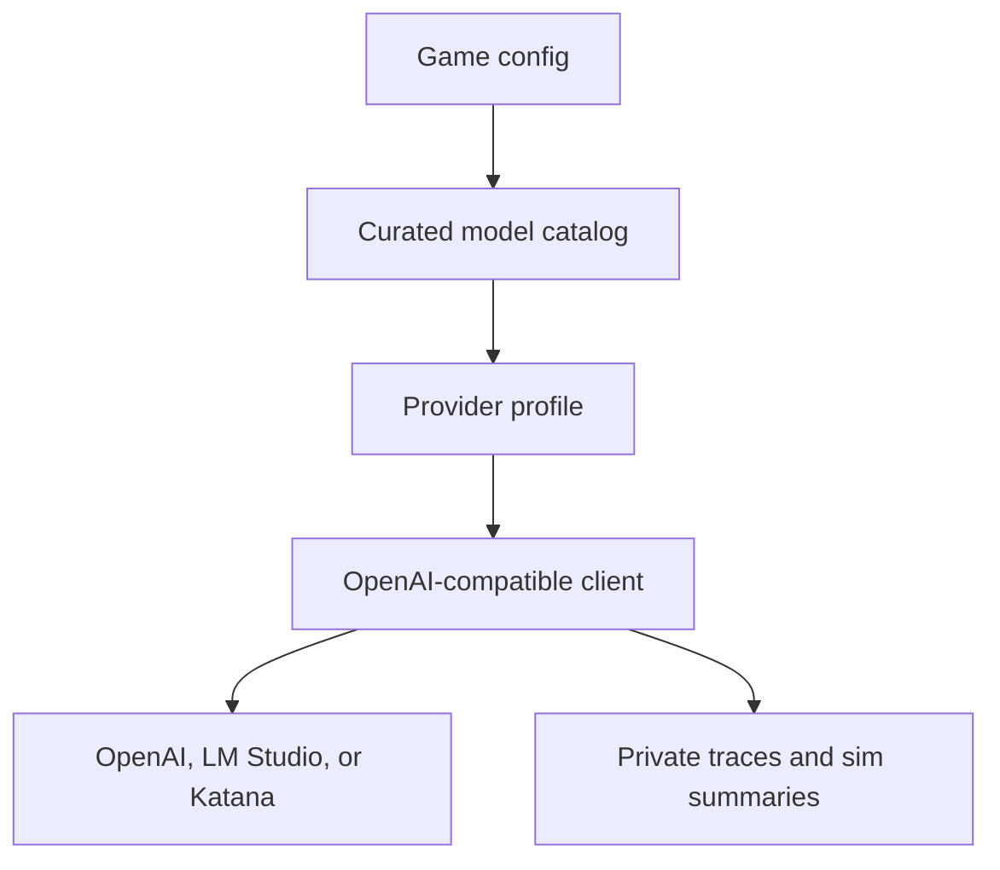

# Katana Model Router Requirements

## Summary

Influence should add a narrow OpenAI-compatible provider-profile and model-catalog layer so a game can run against curated router models, starting with Katana `grok-4-3`. The first slice stays per-game, keeps simulator evaluation first-class, supports Grok reasoning efforts `low`, `medium`, and `high`, and defers native xAI, per-agent model selection, and broader marketplace behavior.

---

## Problem Frame

Influence agent quality depends on strategic reasoning that is visible to producer/debug tooling and useful for improving agents after watching a game. The current code already supports hosted OpenAI and OpenAI-compatible local servers, including LM Studio, but it treats provider setup mostly as a base URL and API key. That is enough for local experiments, but not enough to compare router models by capability, reasoning behavior, billing, and watchability.

Katana is a practical first router because the dev account already has usable credits, its text API is OpenAI-compatible, and `grok-4-3` exposes configurable reasoning. The work should prove that one router-backed model can run cheaply and observably before Influence widens into native provider APIs, model marketplaces, or per-agent customization.

---

## Key Decisions

- **OpenAI-compatible lane first.** The near-term provider shape should work through the existing OpenAI SDK-compatible calling style rather than adding native xAI this turn.
- **Catalog over raw router discovery.** Influence should expose curated game-ready records, not every model a router lists.
- **Per-game selection only.** Model/provider choice belongs to the game config for now; per-agent model mixing stays deferred.
- **Reasoning stays enabled for Grok.** `grok-4-3` may use `low`, `medium`, or `high`, but `none` should not be offered for Influence game agents.
- **Simulation parity before product confidence.** Router models should prove completion, cost, and watchable strategy through simulator artifacts before they are treated as product-ready.
- **Provider observability is part of the feature.** Model support is not done unless traces or summaries can show provider, model, reasoning effort, and router billing where available.

---

## Actors

- A1. **Game creator or maintainer** chooses a curated per-game model option for an evaluation or run.
- A2. **Influence game agent** uses the resolved model for structured decisions, visible speech, and private reasoning capture.
- A3. **Simulation evaluator** runs bounded local games and judges completion, strategy quality, cost, and reasoning evidence.
- A4. **Provider profile resolver** maps a catalog model to auth, base URL, tool mode, reasoning support, and observability labels.
- A5. **Private trace and simulation artifact reader** inspects provider/model/reasoning metadata without exposing it as player-visible dialogue.

---

## Requirements

**Provider Profiles**

- R1. The system must represent OpenAI-compatible provider profiles for hosted OpenAI, LM Studio or local servers, Katana, and a custom OpenAI-compatible provider.
- R2. A provider profile must carry enough information to resolve base URL, credential source, provider label, structured-output or tool-choice behavior, reasoning capability, and provider-specific usage metadata.
- R3. The first Katana profile must use `https://kat.imgnai.com/v1` and credentials from `API_KAT_IMGNAI_KEY` plus `API_KAT_IMGNAI_SECRET`.
- R4. The Katana credential shape must support Katana's combined bearer token while avoiding user-facing exposure of key or secret values.
- R5. The provider-profile layer must leave room for future native providers, but native xAI must not be required or implemented for this slice.

**Model Catalog**

- R6. The model catalog must be curated and allowlisted rather than populated directly from a live router model list.
- R7. The initial active Katana test model must be `grok-4-3`.
- R8. The initial Katana back-burner records must be `grok-4-20-multi-agent`, `q-naifu-a3b`, and `glm-5-2`.
- R9. Back-burner records must be clearly marked as not approved for normal game-agent runs until separate evidence proves they are suitable.
- R10. The catalog must support model ID, display label, provider profile, capability tags, default reasoning policy, evaluation status, and notes about intended lane.
- R11. `grok-build-0-1` must not be included in the initial Katana back-burner set for game-agent evaluation.

**Per-Game Selection**

- R12. Game creation and game execution must resolve one model choice per game.
- R13. The first slice must not support per-agent model selection.
- R14. The selection surface must not imply an arbitrary model marketplace or unrestricted router browsing.
- R15. Existing model-tier behavior must remain compatible unless planning deliberately replaces it with an equivalent migration path.

**Reasoning Policy**

- R16. `grok-4-3` must be treated as reasoning-capable even though its model ID does not match the current OpenAI reasoning-model naming heuristic.
- R17. Grok game-agent configuration must support `low`, `medium`, and `high` reasoning effort.
- R18. Grok game-agent configuration must not offer `none` as a normal selectable reasoning effort.
- R19. The system should support either a per-game fixed reasoning effort or the existing action-policy mapping that varies effort by decision type.
- R20. Reasoning configuration must preserve the separation between model-side reasoning evidence and player-visible speech.

**Katana Smoke and Cost Safety**

- R21. Katana evaluation must include a cheap smoke path before long simulations.
- R22. The smoke path should verify usable credits, model availability, and one bounded deterministic completion.
- R23. Katana responses should capture router usage metadata, including `usage.imgnai` when supplied, in private debug or simulation output.
- R24. A failed smoke check must stop the long run and explain whether the failure is auth, credit balance, model availability, or completion behavior.

**Simulator and API Parity**

- R25. The simulator must be able to use the same catalog/profile/reasoning configuration shape as API-backed games.
- R26. The simulator must remain runnable as a separate local workflow with explicit model/provider inputs.
- R27. A future API-backed simulation lane may reuse the same model config, but this brainstorm does not require routing every simulation through the API lifecycle.
- R28. LM Studio must remain a first-class local development provider and must not regress while adding Katana.

**Telemetry and Privacy**

- R29. Player-private reasoning lanes must remain in scope for owner-accessible reasoning and strategy, including reasoning artifacts and strategy reflections available through authorized game/MCP contexts for the user's own agents.
- R30. Producer private trace data must include full prompt requests, raw model responses, provider profile, model ID, requested reasoning effort, observed reasoning metadata, token or usage counts, and router billing fields when available.
- R31. Provider reasoning metadata such as `reasoning_content` may feed player-private reasoning artifacts when access policy permits it, but provider metadata, full prompts, raw responses, usage counts, router billing fields, and trace storage details must remain producer private trace data unless separately sanitized.
- R32. Public game viewers must not see provider credentials, private trace payloads, raw model reasoning, or cost metadata.
- R33. Evaluation artifacts should make model comparisons possible across completion rate, latency, cost, reasoning usefulness, and watchable social-strategy quality.

---

## Key Flows

- F1. Katana smoke test
  - **Trigger:** A maintainer wants to evaluate `grok-4-3` through Katana.
  - **Actors:** A3, A4
  - **Steps:** The evaluator selects the Katana profile, verifies credits, confirms `grok-4-3` is available, and runs one tiny deterministic completion.
  - **Outcome:** Long simulation starts only when credentials, credits, model access, and basic completion behavior are proven.
  - **Covered by:** R1-R5, R21-R24

- F2. Per-game router model resolution
  - **Trigger:** A game is created with a curated router model choice.
  - **Actors:** A1, A2, A4
  - **Steps:** The game stores one model choice, resolves it through the catalog, loads the provider profile, and constructs an OpenAI-compatible client with the right reasoning and tool behavior.
  - **Outcome:** All agents in that game use the same selected model/provider configuration.
  - **Covered by:** R6-R20

- F3. Grok reasoning ladder simulation
  - **Trigger:** The evaluator compares `grok-4-3` across `low`, `medium`, and `high`.
  - **Actors:** A2, A3, A5
  - **Steps:** The evaluator runs comparable bounded simulations, records private reasoning evidence and router billing, and reviews Mingle, vote, power, and Council decisions for strategic quality.
  - **Outcome:** Influence can pick a default Grok reasoning posture from evidence rather than assumption.
  - **Covered by:** R16-R24, R29-R33

- F4. Local LM Studio parity check
  - **Trigger:** A local model is evaluated through LM Studio after the profile/catalog layer exists.
  - **Actors:** A3, A4, A5
  - **Steps:** The evaluator selects a local OpenAI-compatible profile, runs the existing simulator workflow, and confirms reasoning metadata and structured decision behavior still work.
  - **Outcome:** Router support does not weaken the local development lane.
  - **Covered by:** R1-R2, R25-R33

---

## Acceptance Examples

- AE1. Covers R7, R16-R18, R29-R33.
  - **Given:** a game is configured with Katana `grok-4-3` and reasoning effort `medium`.
  - **When:** an agent makes a structured vote decision.
  - **Then:** the request is sent through the Katana OpenAI-compatible profile, the decision uses `medium` reasoning effort when supported, model-side reasoning can feed owner-accessible reasoning artifacts when allowed, and full prompt/provider/billing metadata remains producer private trace data.

- AE2. Covers R6-R11, R14.
  - **Given:** Katana lists many model IDs.
  - **When:** the game model catalog is rendered or read by the app.
  - **Then:** only curated records are available, with `grok-4-3` active and `grok-4-20-multi-agent`, `q-naifu-a3b`, and `glm-5-2` marked back-burner.

- AE3. Covers R12-R15.
  - **Given:** a game contains multiple agents.
  - **When:** the game starts.
  - **Then:** all agents resolve to the same per-game model/provider choice, and no agent receives a separate model override.

- AE4. Covers R21-R24.
  - **Given:** Katana credentials are missing, invalid, out of credits, or unable to complete a tiny request.
  - **When:** the evaluator starts a Katana long-run workflow.
  - **Then:** the smoke step fails before the long simulation and reports the failure category.

- AE5. Covers R25-R28.
  - **Given:** LM Studio is running locally with an OpenAI-compatible model.
  - **When:** the evaluator runs a simulator game through the local provider profile.
  - **Then:** the simulator can still run without API lifecycle dependency, and local reasoning metadata continues to appear in debug artifacts when the model supplies it.

---

## Success Criteria

- A maintainer can run a cheap Katana `grok-4-3` smoke check before spending credits on a full game.
- A bounded `grok-4-3` simulation can be run at `low`, `medium`, and `high` reasoning effort with comparable artifacts.
- Simulation output or producer private traces make provider, model, reasoning effort, full prompt request, and Katana billing visible to producer/debug readers.
- Game creation remains per-game and does not expose per-agent model selection.
- LM Studio evaluation remains documented and functional after provider-profile changes.

---

## Scope Boundaries

**Deferred for later**

- Native xAI Responses or streaming integration.
- Direct support for Grok multi-agent endpoints as game-player turn execution.
- API-backed simulation as the required execution path for all simulator runs.
- Bankr, Venice, imgn, OpenRouter-style provider rollout beyond the profile shape needed to support them later.
- UI polish for a broad model marketplace.

**Out of scope for this slice**

- Per-agent model selection.
- Reasoning effort `none` for Grok game agents.
- x402 payment integration.
- Raw `/v1/models` router browsing as a game creator surface.
- Public exposure of cost, raw reasoning, provider credentials, or private trace payloads.

---

## Dependencies and Assumptions

- Katana remains OpenAI-compatible enough for the initial chat-completion path.
- The existing Doppler dev secrets `API_KAT_IMGNAI_KEY` and `API_KAT_IMGNAI_SECRET` remain the credential source for local development.
- Router billing metadata is available in non-streaming responses often enough to capture useful cost evidence.
- The current simulator remains the fastest path for repeated model-quality evaluation.
- Catalog records can begin in code or checked-in config; persistence and admin UI can wait until planning proves they are needed.

---

## Outstanding Questions

**Deferred to Planning**

- OQ1. Should the first implementation keep `modelTier` as the stored game config field and map selected catalog models through it, or add a more explicit per-game model identifier?
- OQ2. Which exact request field does Katana honor for `grok-4-3` reasoning effort through the OpenAI-compatible chat-completions path?
- OQ3. Should fixed reasoning effort and action-policy reasoning be separate catalog settings, game settings, or simulator-only flags in the first slice?
- OQ4. Where should Katana smoke checks live so they are easy to run through Doppler without becoming part of normal app startup?
- OQ5. What minimum simulation sample is enough before marking a model as game-agent-ready?

---

## Sources / Research

- `STRATEGY.md` for product framing, reasoning access, and near-term scope discipline.
- `CONCEPTS.md` for private reasoning, `reasoningContext`, cognitive artifact, and trace privacy vocabulary.
- `docs/local-model-evaluation.md` for LM Studio, simulator evaluation, chatty reasoning inspection, and what to record.
- `packages/engine/src/llm-client.ts` for the current OpenAI-compatible client helper and model tier resolver.
- `packages/engine/src/agent.ts` for action-level reasoning effort and reasoning metadata capture.
- `packages/api/src/routes/games.ts` for current per-game `modelTier` storage.
- `packages/engine/src/simulate.ts` for standalone simulator model selection.
- `docs/ideation/2026-06-27-multi-model-provider-grok-router-ideation.md` for the precursor idea set and live Katana probe notes.
- Katana compact model/API docs: https://kat.imgnai.com/llms.txt
- xAI reasoning docs, future reference only: https://docs.x.ai/docs/guides/reasoning
