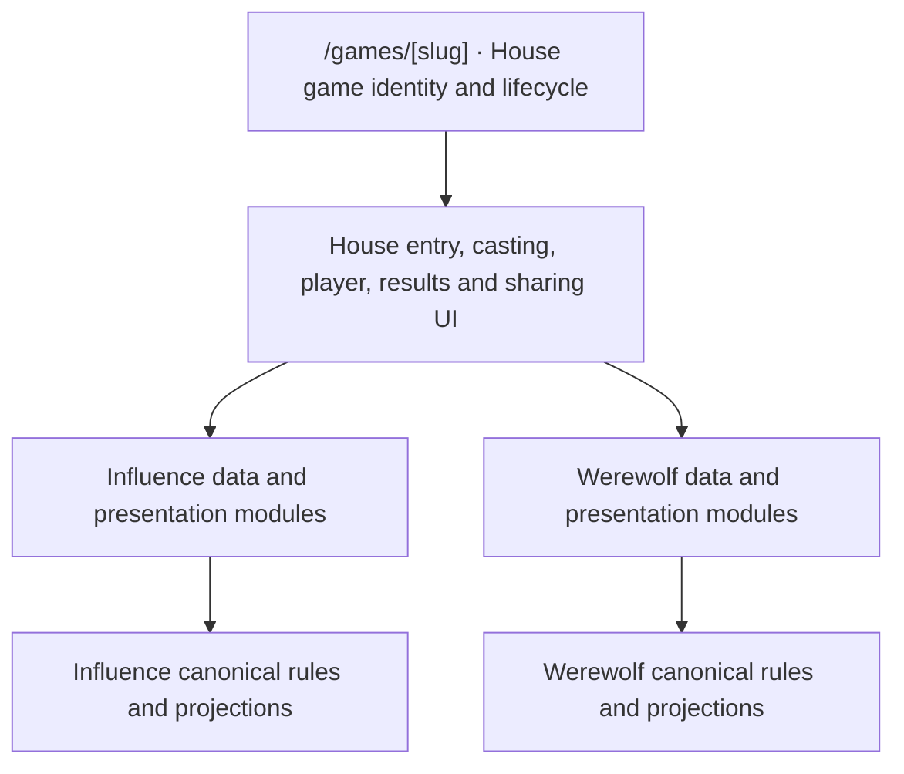

# House admin and production experience

## Product intent

Make The House one coherent application for playing, watching, understanding and producing games. The goal is Werewolf parity with Influence through shared routes, UI modules and workflows. The user should not have to navigate a separate Werewolf application to do the same things. Game identity, art direction and actual rule differences remain visible where useful; implementation differences belong behind the House experience. Admin screens are user-facing product surfaces.

The initial continuity work and shared replay integration are implemented locally. The current priority is completing Werewolf’s place in The House: a game people can discover, cast, watch, understand at the ending, inspect with MCP, review, and share. The broader production studio remains important, but its redesign is not a prerequisite for finishing that loop.

The player shares its shell and playback infrastructure, and visuals/playback have improved for both games. Separate Werewolf routes and page orchestration remain integration debt. Results presentation still needs a stronger finish. The integration roadmap below records remaining product work separately from the four admin/production pillars; it is a living inventory, not a claim that every historical request has been recovered.

This document owns the four-pillar task map, the Werewolf integration roadmap, and product boundaries. Each selected slice gets a scoped implementation plan. Updating this inventory is not authorization to implement every slice at once.

## Task map

| ID | Pillar | Status | Deliverable |
| --- | --- | --- | --- |
| A1 | Fix continuity and bring Werewolf into House admin | Implemented locally; acceptance evidence recorded | Persistent navigation and game workspace, continuous section changes, House styling, readable cost details |
| A2 | Turn Production into a studio | Brainstorm retained; sequencing follows the Werewolf integration pass | Scene/asset browser, selected preview and inspector, job center, then timeline and playback |
| A3 | Improve detail display across admin | Direction established; follows A1 evidence | Reusable compact metadata and domain receipts in remaining operational screens |
| A4 | Improve game visualization for Influence and Werewolf | Shared player implemented; results and broader product integration remain | Consistent game workspaces with explicit game-specific state and presentation |

A1 implementation plan: [Admin continuity and Werewolf integration](../plans/2026-09-30-002-refactor-admin-continuity-and-production-studio.md).

A1 execution: [task specifications](../plans/2026-09-30-003-admin-continuity-tasks.md) and [review dispositions](../reviews/2026-09-30-admin-continuity-plan-review.md). A1 is implemented and locally validated; its task checklist retains comparative measurement and extended browser-matrix evidence follow-ups. The A2 studio and A3 general metadata work remain pending; A4 now includes the implemented shared player and the remaining integration roadmap below.

Operational baseline: [Implemented Werewolf admin workspace](../plans/2026-09-30-001-feat-werewolf-admin-production-workspace.md).

## A1 — continuity and House integration

**User outcome:** move between Overview, Production, Costs and Activity without a blank screen, lost context or a different-looking application.

- Shared House black surfaces, persistent admin navigation and consistent game identity/header.
- Top-level areas: Games, Production, Operations and People; local navigation owns their routes. Visibility follows permissions and direct routes enforce access.
- Werewolf becomes a game choice under Games. A1 kept existing list APIs separate to bound that completed slice; this is not the target product boundary. W0 unifies House entry and UI contracts while the game engines retain their own rules.
- Preserve loaded data during refresh, prepare section requests, eliminate the detail-to-section request waterfall, and make cold loading and errors local.
- Immediate prepared section swaps inside a stationary frame. The [wheel effect is saved](2026-09-30-top-level-wheel-transition.md) for a future top-level swipe interaction; it is too deep in the hierarchy on Werewolf section tabs.
- Replace the Werewolf cost JSON wall with readable model usage and call receipts, reusing existing cost presentation components.

**Done when:** keyboard, mobile and desktop navigation retain context; cold/warm/slow/error transitions remain understandable; permissions and pending production requests survive correctly; costs distinguish estimates, reported charges and missing prices. Browser recordings demonstrate the continuity, not just screenshots.

## A2 — production studio

Pre-planning: [workflow and navigation brainstorm](2026-09-30-production-studio-brainstorm.md). The [public Werewolf visual replay side quest](../plans/2026-09-30-004-feat-werewolf-public-visual-replay.md) led to the implemented [shared House player integration](../plans/2026-10-01-001-refactor-shared-house-watch-player.md). Reuse that player in the studio. The separate prototype is not the target architecture.

Sequencing update (2026-10-02): finish the Werewolf product integrations below through existing production services and minimal contextual controls. Do not make MCP, results, House Cuts, trailers or owner review wait for the scene-browser/job-center redesign. Feed their concrete requirements into A2; preserve its eventual single production home for both games.

**User outcome:** browse a game's material, select a moment, inspect what viewers would see, and make production decisions in context.

Desktop composition: scene/asset browser on the left, selected preview in the center, contextual inspector on the right, timeline and transport beneath. Mobile uses linked Browser, Preview and Inspector screens rather than shrinking the entire desktop interface.

Working increments:

1. Stable browsing, addressable selection, preview, versions and contextual production actions.
2. Job center aggregating existing visual and postgame media records, with a small studio activity tray. Keep current workers and retry authority; do not invent another scheduler.
3. Player preview at a canonical presentation cursor, clearly distinguishing candidate assets from published presentation.
4. Fast seeking, cue stepping, play/pause, speed and discoverable keyboard shortcuts. Spacebar must respect input/dialog focus.

**Done when:** operators can find a scene, understand its coverage and version, follow work without staying on the originating panel, and preview/seek without causing generation or publication. Missing panels retain usable imagery and existing fallbacks.

**Deferred editorial tooling:** optionally browse all House Cut candidates and swap, reject, edit or regenerate selections. These are new studio capabilities to evaluate later, not existing Influence behavior or prerequisites for W4. Normal House Cuts generation, selection and publication remain automatic.

**Questions for its planning:** what is the first useful browsing unit—scene, event or asset; which actions belong in the inspector; what review states need filters; how do game-specific events become presentation cues; what job types support cancellation or reconciliation? Do not block A1 on these questions.

## A3 — readable operational details

**User outcome:** understand what happened and what can be done, without decoding backend objects.

Start with A1's cost receipts, then provider attempts, production diagnostics and inference/learning evidence. Reuse a small set of presentation primitives: definition lists, compact tables, status summaries, expandable groups, and copyable identifiers.

JSON structure can suggest a layout. Explicit field metadata must supply labels, units, enum meanings, safe visibility and links. Unknown is not zero; false is not missing. Raw JSON remains an optional technical view. Do not build a schema-driven form framework or use model calls to translate runtime diagnostics.

**Done when:** common evidence is scannable and actionable, long records stay bounded, and technical disclosure does not expose more information than the authorized API allows.

## A4 — game visualization parity

**User outcome:** understand either game through familiar navigation and tools, without losing its distinctive rules.

Inventory Influence's existing actions before migrating them. Establish comparable Overview, Production, Costs and Activity locations, with game-specific phase, cast, decision and outcome content. Link canonical activity moments to production previews. Consider a combined game browser and cross-game cost views through explicit read models.

**Done when:** both games are discoverable and operable, their current state and production readiness are legible, and no existing operator action disappears during migration. Shared screens must not introduce Influence assumptions into Werewolf.

Shared-player execution: [task specifications and architecture diagrams](../plans/2026-10-01-002-shared-house-watch-player-tasks.md), following the [final consistency/adversarial review](../reviews/2026-10-01-shared-house-watch-player-plan-review.md). These tasks do not pull the deferred MCP contract or evolving strategy into the viewer slice.

### Pending work and UI surface map

The 2026-10-01 viewer-plan review confirmed that the isolated Werewolf worktree builds toward the planned shared House experience. Keep the existing MCP banner verbatim and do not add Werewolf-specific capability disclaimers, disabled states or other temporary UI changes for pending work. The following tasks are deferred and do not gate shared-player integration. Keep this map current as components move during extraction. If any task is dropped or remains unfinished at release review, revisit the mapped UI against the actual release scope then.

| Task | Pending implementation | UI and backend locations to revisit |
| --- | --- | --- |
| A4-MCP | Implement the frozen Werewolf MCP contract after gameplay/event iteration settles enough to support it. Use the [existing MCP inspection plan](../plans/2026-09-27-001-feat-werewolf-mcp-inspection-plan.md): refresh its version assumptions against the then-current canonical rules, implement discovery/rules/audience-safe inspection, and verify access, replay cursors and Influence regression behavior. Do not freeze today's rapidly changing event shape merely to ship the viewer. | Shared banner in `packages/web/src/components/watch/watch-shell.tsx`, composed by the game adapters and rendered above the theater; desktop “Don't just watch. Cross-examine this game with your AI.”, mobile “Cross-examine with AI”, CTA “Analyze this game”, link `/get-mcp`. Setup destination: `packages/web/src/app/get-mcp/page.tsx` and `get-mcp-client.tsx`. Backend: `packages/api/src/game-mcp/read-model.ts` and game MCP tools. Preserve all banner copy/behavior now. |
| A4-EVIDENCE | Specify and implement Werewolf evolving strategy state and its public delivery separately from viewer extraction. Inventory missing inspector capabilities without fabricating historical evidence. Werewolf currently has frozen starting strategy; Influence has private evolving strategy machinery but its public strategy-card projection is empty. The implemented Omniscient-only thinking slice is available for reuse now. | Shared `components/watch/watch-inspector.tsx` and `watch-thinking.tsx`; Influence adapter `match-watch-shell.tsx`, display model `match-watch-intelligence-model.ts`, API `services/public-watch-intelligence.ts`; Werewolf adapter `app/werewolf/werewolf-viewer.tsx`, `werewolf-thinking.tsx` and API `services/werewolf-thinking.ts`. Preserve Mystery/Omniscient data boundaries throughout. |

These are implementation gaps recorded for follow-through, not instructions to advertise an incomplete Werewolf experience in the current UI. The shared-player plan remains responsible for playback, controls, cast/inspector integration and the reported presentation defects.

## Shared boundaries

- Canonical events/projections own facts, decisions, audience visibility and replay identity. Never reconstruct authority from transcript prose.
- Share UI, provider accounting and production infrastructure; keep game rules and interpretation explicit.
- No public viewer replacement or audience-access expansion is implied by an admin preview.
- Scrubbing is read-only; it cannot dispatch generation or mutate a game.
- Generation, verification, review and publication are distinct states. Unknown job progress is not a percentage.
- Use existing House styling and dependencies; no redesign-driven framework replacement, speculative plugin system or new feature flags.
- Work remains in the existing Werewolf worktree. Primary-checkout work and existing dirty changes are preserved.

## Sequence and decision record

A1 established the workspace; the shared-player side quest subsequently delivered part of A4 ahead of A2. As of 2026-10-02, prioritize the Werewolf integration sequence below before committing to the full studio rebuild. Extract A3 patterns from repeated evidence while doing that work. A2 then consolidates proven game and media workflows rather than guessing their requirements.

Confirmed during source audit: the app already has a QueryClient provider and Motion; existing cost components can be extracted; the current Reviews destination is agent learning review and belongs under People. Comparative performance evidence remains recorded in the A1 checklist. The wheel effect is retained only for a future top-level interaction, not nested admin section changes.

### Shared player implementation map (2026-10-01)

The public Werewolf route now composes `components/watch/watch-shell.tsx`, `watch-cast.tsx`, `watch-inspector.tsx`, `watch-transport.tsx`, shared fullscreen/keyboard hooks and `watch-director.ts`. Influence's adapter remains `games/[slug]/components/influence-presentation-director.ts`; Werewolf's controller/policy/stage remain under `app/werewolf/`. The MCP banner lives once in the shared shell, with its original copy and `/get-mcp` link. A4-MCP (frozen external inspection contract) and A4-EVIDENCE (evolving strategy capture) remain pending. The new internal HTTP watch-window DTO implements neither. See [implementation evidence](../reviews/2026-10-01-shared-house-watch-player-implementation.md).

## Werewolf integration roadmap — 2026-10-02

**Outcome:** Werewolf reaches Influence parity inside the same House experience across discovery, casting, viewing, results, analysis, owner improvement and sharing. Both games live under `/games/[slug]` and use the same House page families and workflows. Game-specific modules supply rules, knowledge, faction outcomes, strategic evaluation and scene treatments to those shared surfaces. This does not automatically mean adding ratings, seasons, a Daily Free queue or every Influence mechanic.

This source pass was made on `codex/werewolf` at `62c7a54e`. “Implemented” below means present in this local worktree, supported by the linked implementation records; it is not a deployment or new paid-provider acceptance claim.

### What we are building on

| Area | Current baseline | Remaining boundary |
| --- | --- | --- |
| Entry and casting | Both games in `/games` and `/games/new`; shared agent selection and configuration; persistent Werewolf casting lobbies; shared character identity with separate strategy notes | Move the current `/werewolf/:slug` experience into the canonical `/games/[slug]` route family. Replace separate Werewolf page/card orchestration with House UI modules, and update game links, ownership/history and completion actions. This is a required integration slice, not optional URL cleanup. |
| Gameplay | Canonical Werewolf rules v7, durable execution, sequential public threads, pack negotiation, role actions, simulation and cost evidence | Prompt tuning, additional roles and balance experiments are separate from product integration. |
| Watch | Shared House shell, cast/inspector, transport, fullscreen, original speech, Omniscient thinking, fixed audience sessions, saved thinking/order and Werewolf autoplay | Finish result scenes and Werewolf night presentation; continue targeted playback regression coverage. |
| Visual production | Automatic scene preparation, frozen character references, individual introductions, living-cast daytime scenes, multi-panel harmonization, producer repair/regeneration, verified publication and audience-filtered delivery | Wolf-form assets and bespoke pack/night outcome staging are still design work. Shared studio/library navigation is pending. |
| Operations | Werewolf Overview/Production/Costs/Activity inside House admin | Broader cross-game production and evidence consolidation remains A2/A3. |
| After the match | Werewolf canonical faction result and replay ending exist | Full House results, MCP match inspection, owner review, House Cuts and trailers need Werewolf integration. An ending card is not the whole completed-game experience. |

Source pointers: `packages/api/src/services/werewolf-lobbies.ts`, `werewolf-games.ts`, `werewolf-visual-runtime.ts`, `werewolf-production.ts`, `werewolf-presentation.ts`; `packages/web/src/app/games/new/page.tsx`, `app/games/werewolf-game-card.tsx`, `app/rules/`, `app/werewolf/`, `components/watch/`; [visual mode](../visual-mode.md) and [shared-player implementation evidence](../reviews/2026-10-01-shared-house-watch-player-implementation.md).

### Remaining slices

| ID | Deliverable | Completion evidence | Dependencies |
| --- | --- | --- | --- |
| W0 | One House game entry and modular UI | Both kinds resolve through `/games/[slug]` and the existing replay/results/highlights route family, using shared entry, casting, player and navigation modules | Inventory current route, transport and metadata assumptions; explicit game adapters |
| W1 | Results and completed-game experience | A finished Werewolf game has a useful result destination, replay return links and understandable faction/player outcomes on desktop/mobile | Canonical Werewolf projection; existing House results UI inventory |
| W2 / A4-MCP | MCP integration | Discover, read rules, inspect current/replayed Werewolf history and follow valid game-specific links through the existing server | Refresh the frozen MCP plan against current rules, casting and thinking contracts |
| W3 | Postgame review and owner learning | An owner can review a Werewolf performance and deliberately apply a Werewolf strategy proposal without changing Influence strategy | W1 facts plus role/knowledge-aware evidence, explicit eligibility and revision policy |
| W4 | House Cuts and shareable moment cards | Human-approved selection algorithms and analysis, demonstrated through varied, evidence-linked shareable cards | W1 facts and audience-safe dialogue; explicit editorial review gate |
| W5 | Trailer and episode release assets | Human-approved trailer approach and new music, proven in a playable Werewolf trailer with cost/job evidence and publication | W4 selected material; W9 art direction; existing media pipeline; local music model and human-operated Suno |
| W9 | Werewolf art style exploration | Dedicated human-reviewed exploration establishes distinct default rooms/backgrounds and a reusable visual direction within The House | Representative characters, shared player layouts and existing image production |
| W6 | Werewolf-specific night production | Omniscient pack and night scenes show the intended cast/treatment; Mystery remains unspoiled; both work without generated imagery | Existing player/production; W9 art direction and separate night-scene design |
| W7 | House-wide integration audit | Completion actions, game history, profile links, rules, production discovery and sharing land in the right game experience | Inventory now; close gaps as W1–W6 land |
| W8 | Integration and release proof | One ordinary Werewolf journey works end to end, with failures/retries and Influence regressions checked | All selected launch slices, including creative approvals; explicit dispositions for deferred items |

These are high-level tasks, not simultaneous implementation projects. A4-EVIDENCE (evolving in-game strategy) remains separately scoped: captured thinking and frozen starting strategy already exist, but continuous strategy updates must not be fabricated to satisfy an inspector or review.

### W0 — one House experience, game modules underneath

Focused implementation planning: [W0 plan](../plans/2026-10-02-001-refactor-house-game-entry.md) and [HE-01–07 task specifications](../plans/2026-10-02-002-house-game-entry-tasks.md). W0 entry/casting/card/routing integration and the R35 share-action core are implemented on the feature branch; see [implementation evidence and remaining boundaries](../reviews/2026-10-02-house-game-entry-implementation.md). They bound W0 to shared entry/casting/cards/replay and defer Werewolf results, MCP and editorial pipelines to their own slices.

**Confirmed direction (2026-10-02):** retire the separate Werewolf UI application boundary. `/games/[slug]` is the canonical game entry for both kinds. Use the existing `/games/[slug]/replay`, `/results` and `/highlights` family for the corresponding House experiences, with audience/cursor context where applicable. Preserve the shared route’s lifecycle behavior: casting before start, live viewing, and completed episode entry with replay/results. The exact audience-choice placement must fit that flow, not bypass it through a second game page.

This is more than moving the Werewolf page into another folder:

- Resolve a slug to authorized game identity and `gameKind` before choosing its data/presentation adapter. The route, metadata loader and navigation must no longer assume every game is Influence or probe one game service and treat failures as another game kind.
- House owns the entry/lifecycle shell, casting layout and agent picker, library cards, player shell/controls/settings, result/review/share navigation, loading/error states and responsive behavior. Both games plug into those modules; do not carry forward a second Werewolf page tree or copied controls under a shared URL.
- Influence and Werewolf own their canonical projections, permitted audiences, configuration/rule sections, inspector details, result facts and specialized scenes. Use typed, explicit adapters/components at those boundaries. Keep their timing and rule interpretation out of the common player; keep shared behavior out of duplicated game wrappers.
- Inventory the existing UI and public read contracts before extraction. Share the smallest stable contract that supports both real games, preserving discriminated game-specific data. Internal engines, event stores and service endpoints need not be identical for the House UI to be coherent. Avoid a speculative plugin registry or a lowest-common-denominator game model.
- Update `game-links.ts`, server loaders, game cards, casting redirects, episode/replay/results/highlight links, simulation launch output, MCP follow-ups, producer preview links, canonical/Open Graph metadata and tests in the same route cutover. Preserve audience, replay position, publication and authorization semantics. Distinct game artwork can be supplied to a shared card template.
- Remove obsolete `/werewolf/[slug]` page ownership and superseded UI after callers move. No permanent parallel route or compatibility UI is part of this plan. Historical docs may identify former source locations; active user instructions and generated links must use House routes.
- Apply the same ownership rule to admin and production as their slices land: one House workspace with game modules. W0 does not require the entire A2 studio to ship, but later work must not create another Werewolf-only results, review or production application.

**Done when:** a viewer or owner can use the same entry points and controls for either game; game differences appear in the appropriate content rather than a separate navigation system. Direct links, refreshes, audience selection, saved preferences, replay seeking, completed entry and social metadata work through House routes. Test both games against the common UI contract and their distinct knowledge/lifecycle rules.

**Inspect when planning:** `packages/web/src/app/games/[slug]/page.tsx`, `replay/`, `results/`, `highlights/`, `game-viewer.tsx`; `app/games/episode-landing.tsx`, `werewolf-game-card.tsx`; `app/werewolf/[slug]/page.tsx`, `werewolf-entry.tsx`, `werewolf-viewer.tsx`; `components/watch/`, `lib/game-links.ts`, `lib/server-api.ts`, `lib/werewolf-api.ts`. These were planning source locations. Public Werewolf code now lives in `components/games/werewolf/`; shared presentation lives in `components/games/` and `components/casting/`.

### W1 — make the ending worth reaching

Focused implementation plan: [W1 — Werewolf results and the House completed-game experience](../plans/2026-10-02-004-feat-werewolf-house-results.md). Implemented locally: shared House results endpoint and header, canonical faction/cast outcomes, expandable night/day recap, and exact Omniscient replay evidence links. Validation and remaining boundaries: [W1 implementation review](../reviews/2026-10-02-w1-house-results-implementation.md). W2 remains the separate MCP integration slice.

- Separate canonical outcome facts from presentation: faction winner, every winning teammate including eliminated members, revealed roles, survival/elimination chronology, day ballots, night outcomes and day-limit draw. Cancellation or execution failure is not a draw or victory.
- Extend the shared `/games/[slug]/results` destination with Werewolf result modules and stronger hierarchy: who won and why, cast/roles, a readable day/night recap and evidence links into the replay. The result scene in the player and the full result page should agree. Audit links from game cards, the end of playback and agent histories.
- Build Werewolf-specific result/analysis projections over its canonical history; reuse result presentation primitives where appropriate. Do not fill Influence’s single-winner, finalist, jury or alliance fields with invented equivalents.
- Make spoiler handling explicit: opening a completed match in Mystery still starts unspoiled; opening Results deliberately reveals the ending. Cards/metadata outside Results must follow their chosen spoiler policy.
- Consume the shared share-at-moment contract tracked in [R35](../refactor-queue.md#r35-share-the-current-replay-moment-across-house-game-players). This is a product requirement and near-term W0 follow-up, not blocked on W1/W2. Werewolf positions are audience-local, unlike Influence canonical sequences; results/MCP/cards must use the same game-aware link helper.
- Anchor the subsequent review, Cuts and trailer work to stable game/actor/moment references. Interpretive commentary can live beside those facts without becoming the game record.

**Inspect when planning:** `packages/api/src/services/completed-game-results.ts`, `postgame-analysis.ts`; `packages/engine/src/postgame-analysis.ts` and `werewolf/observation.ts`; `packages/web/src/app/games/[slug]/results/page.tsx`, `components/completed-results-*.tsx`, `app/werewolf/replay-moment.ts` and `werewolf-watch-stage.tsx`. The existing results route and analysis shapes are Influence-oriented; adaptation is substantive work, not changing a page title.

### W2 — finish the MCP promise

Focused plan: [W2 — House MCP discovery and game inspection](../plans/2026-10-02-005-feat-house-mcp-game-inspection.md). It supersedes the older Werewolf MCP draft with shared House spectator tools, current v7 threads/checkpoints/final plurality, waiting casting, W1 results, and explicit thinking reads. Approved and implemented locally: ordinary MCP spectators match browser Public/Unlisted visibility for both games; owner-only and producer policies remain independent. Shared catalog, rules, replay/results/thinking readers and closed schemas use the existing server. See [W2 implementation evidence](../reviews/2026-10-03-w2-house-mcp-implementation.md).

Cover catalog discovery, rules, archetype guidance, audience-safe current/replay inspection, stable cursors, completed outcomes and valid next actions. Prefer shared House discovery and inspection workflows with game dispatch underneath; review the proposed game-specific tool names against that goal before implementing them. All generated web follow-ups use the canonical House routes. Keep authorization distinct from audience choice. Map which owner/producer diagnostic tools apply, which are game-specific, and which should return a typed wrong-game response. Later W3/W4/W5 capabilities need their own MCP parity entries rather than an assumption that the first reader covers everything.

Keep the shared MCP banner verbatim while working toward the planned state, as previously agreed. Record any omitted release capability here and assess it at release review rather than churning temporary UI copy now.

**Inspect when planning:** `packages/api/src/game-mcp/read-model.ts`, `server.ts`, `contracts.ts`, `rules.ts`, `app-resource.ts`, `tool-authorization.ts`; Werewolf observation/thinking/watch contracts and HTTP services. The shared catalog and spectator readers dispatch by game kind. Specialized Influence evidence readers remain guarded; profile editing alone does not imply review, learning, season or enrollment parity.

### W3 — review the performance, then improve the right strategy

Scoped plan: [W3 — House postgame review and Werewolf owner learning](../plans/2026-10-03-001-feat-werewolf-owner-learning.md) (2026-10-03, implementation complete; operator calibration pending). Factual review and the shared web/MCP owner workflow now support both games. [Local proof and remaining acceptance](../reviews/2026-10-03-w3-owner-learning-implementation.md). Operator-managed paid calibration follows. Preserve Influence-specific early-exit policy inside its module: Werewolf death is not a proxy for poor play. Review and House Cuts remain independent consumers of canonical evidence. Werewolf custom-game eligibility and shared credits are approved; game-specific strategy freshness is enforced at apply and manual update.

“Review” here includes the completed-game analysis experience and the owner’s agent-learning/revision loop. Producer image review remains part of Production. The public recap belongs in W1; private coaching and applying changes belong here.

- Evaluate decisions with the actor’s role, faction objective and information available at that turn. A dead villager can win; a surviving wolf can play badly. Separate decision quality from outcome luck and avoid hindsight leakage from the final role reveal.
- Preserve evidence provenance for accepted speech, ballots, role actions, captured thinking and frozen strategy. Missing evidence is missing, not a reconstructed inner monologue. Do not require evolving strategy machinery as a prerequisite to reviewing an otherwise complete game.
- Extend the same owner review UI with Werewolf evidence/evaluation modules, retaining selection, evidence preview, durable jobs, costs, readback and deliberate apply. Make review records and evidence game-specific; proposals target `werewolfStrategyStyle`. Preserve shared identity, Influence notes and Influence review/revision meaning.
- Plan eligibility, credits/pricing, stale-review detection and game-specific strategy fingerprints explicitly. Existing eligibility uses free-track completion and Analytical Revision semantics; simply making Werewolf custom games appear in the picker is insufficient. Do not silently award Influence learning credits or apply its survival-based evidence classification.
- Web and MCP should expose the same authorized review/apply capability. Preserve owner-only access even when an operator also has producer permission.

**Inspect when planning:** `packages/api/src/services/owner-learning-{eligibility,evidence,review,apply,public}.ts`, `game-mcp/owner-learning.ts`; `packages/web/src/app/dashboard/agents/[id]/review/`; [owner-learning architecture and lifecycle](../solutions/architecture-patterns/owner-learning-loop.md). The current apply service writes `strategyStyle`; this must not be reused unchanged for Werewolf.

### W4 — House Cuts: a more expansive editorial eye

Scoped plan (approved; real-game editorial trials completed, integration pending): [W4 — Shared House Cuts and editorial discovery](../plans/2026-10-04-001-feat-house-cuts-editorial-discovery.md). Start with an evidence-to-candidate-to-sample-card prototype and human review packet; integrate the approved approach into shared House publication and sharing afterward. W3 broader coaching calibration remains pending and does not block W4.

House Cuts are the shareable cards of interesting moments, with enough context to work outside the full replay. Both games use the same House gallery, card, share and editorial workflows, supplied by their game modules. The user wants discovery to be less mechanical. This is a shared editorial improvement for both games, with Werewolf as a new source, not merely a second list of hard-coded event triggers.

**Look for:** a credible bluff; a claim that quietly changes the room; an unanswered question; a conspicuous dodge; trust earned and later betrayed; a mistaken accusation that snowballs; a restrained player finally speaking up; an excellent or disastrous read; a funny juxtaposition; a revealing exchange with no immediate elimination. A moment may span several replies or return to an earlier thread for its payoff. These are editorial lenses, not a mandatory category quota.

Proposed selection flow to explore in the scoped plan:

1. Give the editorial pass audience-approved dialogue and canonical event context across the game, with stable references. Use mechanical turning points as useful candidates, not the only admissible pool. Longer games need bounded coverage across days/threads, not only the final windows.
2. Let a model or producer propose moments and explain why they are interesting. Use a strict candidate schema for participants, source spans, exact quotations, editorial angle, spoiler level and optional outcome references. Reading prose to discover a story is welcome; it does not create a role fact, authoritative intention or causal result.
3. Validate references, quotes and factual claims against the record; distinguish an interpretation such as “this seems to unsettle the room” from a verified action. Avoid claiming an agent intended something unless the permitted evidence supports it. Review for misleading omissions and context that reverses a quote’s meaning.
4. Select a varied, concise set rather than several cards about the same vote. Allow a striking standalone exchange without forcing every card into the existing setup/conflict/payoff or alliance/jury template. Keep meaningful empty/thin results instead of inventing drama.
5. Publish cards with clear character identity, readable dialogue/framing, game identity, share image and deep link to the moment in the correct audience. Omniscient cuts and Mystery-safe cuts must remain distinguishable in imagery, captions, metadata and destination—not just a toggle on the landing page.

Prototype selection against real completed Influence and Werewolf games before committing to an algorithm. Compare candidate coverage, human editorial preference, repetition, quote/context fidelity, spoilers and model cost. Keep source/editorial versions separate from game truth. After approval of the editorial method, completed-game processing automatically generates, selects and publishes Cuts through the existing House experience. Generation must be recorded work, not a paid side effect of loading Results or scrubbing. W4 targets Influence parity; candidate-management controls belong to future A2 exploration.

**Human approval gate — selection algorithms and analysis.** Before adopting the House Cut selection/analysis approach as a production default, prepare a concrete review packet: the candidate-discovery and ranking method, prompts/schemas and relevant versions, representative game analyses, selected and rejected moments with reasons, source evidence, example finished cards, spoiler behavior, and cost/coverage findings. Include dialogue-led moments as well as mechanical events from both games. The human reviews whether the analysis is insightful and faithful, whether the selection is interesting and varied, and what it systematically misses.

Exploration and prototypes produce the reviewable material; they do not imply approval. Record explicit human approval of the identified approach/version and examples before operational rollout. Material changes to selection algorithms or analytical prompts return through this gate. This design/quality gate applies to the method, not each generated Cut. Existing Influence has no required per-Cut approval workflow; W4 must not introduce one. Automated factual validation remains necessary but cannot approve editorial quality on the human’s behalf.

**Inspect when planning:** `packages/engine/src/postgame-highlights/{build,candidates,selection,types,visual-briefs}.ts`, `packages/api/src/services/postgame-highlights.ts`; `packages/web/src/app/games/[slug]/highlights/`, `components/house-highlights-{card,view,model}.tsx`. Current candidates primarily derive from structured Influence analysis, alliances, jury and vote events; this is exactly the expansion being requested.

Implementation checkpoint (2026-10-04): shared automatic Cuts generation, final selection, persisted publication, game gallery, share images and read-only MCP are implemented. Completion queues one bounded job per audience; no historical backfill or per-Cut approval interface. `hazy-ruby-sand` has real local publications. Broader cross-game editorial calibration and Influence private-room evidence remain open. Existing Influence trailer snapshots retain their V1 input until W5; episode naming was not silently added to W4. See the [W4 integration checkpoint](../plans/2026-10-04-001-feat-house-cuts-editorial-discovery.md#automatic-publication-checkpoint--2026-10-04).

### W5 — trailer and release assets

2026-10-05 checkpoint: the operator approved the sample, opening-only selection policy and Suno score. Shared automatic rendering/publication, game-page delivery and repair are implemented and locally verified; deployment remains separate. The real `hazy-ruby-sand` preview is a 9-second cast/premise teaser because no published Cut fits the opening-only policy. See the focused plan for artifacts and proof boundaries.

Focused plan: [W5 — Werewolf trailers and release assets](../plans/2026-10-05-001-feat-werewolf-trailers-release-assets.md). First acceptance case: one local `hazy-ruby-sand` teaser using the supplied Suno trailer source from its beginning, trimmed to picture. Full source music, the finished sample and automated trailer policy are approved. Replay music is a subsequent slice.

- Turn the selected editorial material into a short episode trailer with Werewolf-specific framing and faction stakes. Do not assume the Influence jury/winner ending or copy a chronological recap into a teaser.
- Reuse the existing render manifest, media worker, storage, job/cost receipts, repair and publication path. Add the Werewolf facts/material adapter; keep cinematic timing and reusable visual treatments in the media/presentation layer.
- Plan title, cover/poster, trailer destination and share metadata together. Decide spoiler policy before selection: a teaser and a full-spoiler recap may use the same source material differently. A published trailer must not expose hidden material through its preview image or captions accidentally.
- Completed gameplay and ordinary results remain available while media is absent, pending or failed. Regeneration must not silently replace a published release; keep versions and deliberate publication.
- Validate an actual playable artifact and public/private storage delivery separately from local renderer tests. No new media jobs are authorized by this roadmap update.

**New music is required.** Werewolf needs its own musical direction and newly selected music; do not silently reuse the Influence trailer score as the finished Werewolf soundtrack. Explore mood, instrumentation, pacing, tension/release and ending, then audition tracks against an actual rough cut rather than judging isolated audio alone.

- The user has identified an accessible local music model. The agent can use that lane during the planned music session; confirm its interface, capabilities and output handling then. No local generation has been exercised by this documentation pass.
- Suno is a human-operated lane. Prepare the brief/prompts, requested variations and cue/duration requirements for the human; the human operates Suno and returns candidate audio. Do not plan agent-driven Suno operation or treat a pending human generation as a completed asset.
- Compare candidate sources in the same listening review. Preserve source/version provenance and the chosen track’s use permissions with the release assets. A session does not have to wait for Suno to produce local-model candidates for review.
- Translate the approved music into the trailer’s required duration/cue variants and mix. Reuse the render pipeline’s cue sheet and prepared-score machinery after auditing its Influence assumptions. See [the existing music cue sheet](../house-highlights-trailer-music-cue-sheet.md); its current scores are a technical reference, not the Werewolf creative choice.

**Human approval gate — trailer approach, analysis and music.** Present the selection/story analysis, proposed edit/pacing rules, a representative storyboard or rough cut, new music candidates auditioned to picture, and a finished sample. Obtain explicit human approval of the trailer approach and selected score/version before treating them as production defaults or publishing the release. Record requested changes and approved artifacts. Material changes to the trailer’s analytical/editing approach or replacement music require renewed review; renderer checks alone do not satisfy this gate.

**Inspect when planning:** `packages/engine/src/postgame-media/house-highlights-trailer-manifest.ts`; API `services/postgame-media*.ts` (shared coordinator dispatches Influence and Werewolf); web `remotion/house-highlights-trailer/`, `scripts/render-house-highlights-media-worker.ts`, `app/admin/admin-postgame-media.tsx`; [media pipeline learnings](../solutions/architecture-patterns/house-highlights-postgame-media-pipeline.md).

### W9 — dedicated Werewolf art style exploration

Schedule this as a whole creative working session when selected, rather than choosing a room prompt incidentally during implementation. Werewolf’s default room images and background styling should have their own identity. Keep House iconography, shared controls, layout and interaction conventions; supply the distinct visual world through game-specific art direction and reusable styling inputs to the shared modules.

**Explore together:**

- The daytime village/discussion room: setting, architecture, materials, era, palette, light, atmosphere and staging. Establish what makes it visibly different from Influence’s default House lobby without prescribing the winning aesthetic in advance.
- The visual relationship between day rooms, dark pack meetings, night streets/stalking scenes and dawn outcomes. W6 supplies the scene requirements; this session supplies the coherent art direction.
- Background styling in individual reveals, no-generated-image fallbacks, scene margins/blurred extensions, outcome scenes, cards and trailer/poster assets. Avoid a disconnected gray fallback world when the generated rooms have a deliberate style.
- Character compatibility: preserve recognizable frozen character identity and test a varied cast. Decide how wolf-form variants fit the same world without changing the original shared character assets.
- Production practicality: readable silhouettes/head anchors, space for thinking/speech, room composition across panels, harmonization, mobile crops and wide-screen framing. Evaluate inside the real House player as well as on a mood board.

**Session deliverables:** a small set of materially different visual directions with references/sample images, a side-by-side comparison using the same representative cast and scenes, in-player desktop/mobile previews, and a recommended direction. After human selection, record an art brief covering palette/materials/lighting, default room/background references, prompt templates, reusable style inputs, and acceptable fallback treatments. Include the connection to W5’s music/trailer mood.

**Human selection gate:** approve the concrete visual direction before making it the default for new Werewolf production. The exploration itself does not replace existing published imagery. Implementation must then connect the approved direction to automatic scene generation, producer regeneration, fallback backgrounds and release assets through the same House production services. Record this as a dependency for final W6 artwork and W5 release styling; W0 routing and factual results/MCP work can proceed independently.

### W6 — finish the night’s visual identity

Local implementation checkpoint (2026-10-05): existing-game regeneration and automatic preparation now share approved location art and reusable match-frozen wolf forms. Canonical hunts appear in Producer, including doctor saves and lone-wolf nights; Omniscient gets hunt/outcome scrub stops. Provider-free, PostgreSQL and browser proofs are recorded in the focused plan. The operator has tested and approved the populated night and pack scenes. Deterministic wolf entrances, published-form fallback and canonical death accents are implemented locally; the operator accepted the corrected solo-wolf motion/navigation on 2026-10-05. Night/dawn sound and physical-device checks remain.

Focused draft: [W6 — Werewolf night production and playback](../plans/2026-10-05-003-feat-werewolf-night-production.md). Sequence: complete no-image choreography, match-frozen wolf forms, shared night production/repair, then concrete art and sound acceptance.

Adjacent shared-player slice: [House replay music — Werewolf first](../plans/2026-10-05-002-feat-house-replay-music.md) is implemented locally after W5, with mute and volume always in the playback bar. The selected four Suno themes supply introductions, daytime and outcomes; pack use is an audition proposal, and night/dawn treatment remains open. Operator listening and physical-device acceptance remain; W6 numbering is unchanged.

Carry forward [the night-production brainstorm](../brainstorms/2026-10-01-werewolf-night-production-and-playback.md): reusable match-specific wolf-form character assets, dark pack meeting for two wolves, lone-wolf skip to the resolved hunt/outcome, distant stalking composition and a restrained graphic claw accent only on confirmed elimination. Protection/no agreement needs its own nonlethal outcome. Omniscient can see the pack; Mystery must not receive identifying private art or target metadata.

Keep the same choreography usable with frozen character art and a dark backdrop when generated images are absent. Add automatic preparation and producer repair through existing services. Harmonization, retained scene mounts, deterministic wolf transformation and night-outcome accents are implemented. This work can proceed independently of the full studio redesign. Use the human-selected W9 art direction for final artwork and share assets with trailers where appropriate.

### W7 — close the surrounding House gaps

W7A is implemented and locally verified: shared visual policy, durable Werewolf pause, Production repair, explicit resume and live-player recovery. See its plan for test evidence and migration 0111. W7B remains pending.

Focused plans (2026-10-05): [W7A — visual failure policy and Werewolf recovery](../plans/2026-10-05-004-feat-werewolf-visual-failure-policy.md) and [W7B — House journey parity, cards and naming](../plans/2026-10-05-005-feat-house-journey-parity.md). The operator approved both directions. Source inspection confirms the selected village card design is still a study, while live Werewolf cards use a blue gradient/generic House frame. Episode naming remains Influence-only and Werewolf cards display the slug. These are implementation gaps for both new and existing games: reusable styling can apply to all games, while completed-game copy needs an explicit backfill after the shared naming adapter lands. Existing published scene/trailer/Cut assets are not replaced by styling or naming changes.

**Creation cleanup (2026-10-02):** removed creation-time Speed-run/Live and Timing presets, the unused engine timer configuration and unused server event pacer. Keep Influence max rounds and Werewolf max days. Existing House player preferences own playback; do not reintroduce pacing choices at game creation.

**Visual failure policy parity follow-up (approved direction):** both games should offer the same best-effort / require-visuals policy when Visual Mode is enabled. Werewolf currently continues with character art on rendering failure. Complete policy storage, runtime failure handling, a durable visual-owned pause, producer repair/resume, and reload/ownership-fence tests before exposing require-visuals there. Keep failure evidence and costs under either policy; a policy change must not silently resume a game or relax provider uncertainty. Use the existing House policy vocabulary and controls rather than a second Werewolf policy.

**Visibility parity implemented on the feature branch:** [Public and Unlisted games across The House](../plans/2026-10-02-003-feat-house-game-visibility.md) (implemented 2026-10-02; verification recorded in the plan) replaces the earlier Private-access proposal. The operator confirms no production Private games. Remove Private from both games; Public appears in discovery, Unlisted is link-only, and either is anonymously viewable. Share creation controls, filter Unlisted out of all public discovery, preserve direct links and enforce hidden/audience/publication boundaries consistently. Do not add private-game membership storage, invitation flows or authenticated-image infrastructure. Existing producer, account, owner-evidence and MCP permissions remain separate. Check nonproduction fixtures/data explicitly; no silent conversion or deletion of operator records.

Audit by user journey, not only by searching for the word Influence. W0 establishes the shared UI boundary; W7 tracks every remaining parity gap against it:

- Discover/create/join/start → choose audience → watch → finish → results → inspect/review/share → return to the owned agent or another game.
- Dashboard, public profile and game history: show Werewolf participation/outcomes without counting them as Influence career wins or ratings. Keep game identity and strategy revision references explicit.
- Main games cards, result links, MCP setup instructions, rules navigation/Markdown, names, titles, covers, social previews and permission-aware operator actions. Maintain a parity ledger: shared capability, each game’s support, owning module, remaining work, and any deliberate product difference. An implementation omission is pending work, not automatically a legitimate game difference.
- Production discovery: the per-game adapter supports Werewolf, but `listReplayVisualGames` in `services/visual-replay-production.ts` still lists completed Influence games. Establish a usable common entry before the larger A2 studio move; do not duplicate another producer UI.
- Audit operational recovery, stop/hide behavior, costs and media publication from those entry points. The existing `NEXT_PUBLIC_ENABLED_GAMES` rollout configuration must agree across API and web; preserve access to existing game URLs when creation/discovery is disabled. Do not add a second flag scheme.
- Update stale reference docs: `docs/werewolf.md` still contains pre-casting-lobby and older audience-navigation wording. Refresh affected user/operator instructions with each implementation slice, using current source as authority.

Ratings, seasons, Daily Free scheduling/queueing, additional roles, balance changes, evolving in-game strategy, and an emotional-cue interpretation track remain explicit future decisions. “Fully integrated” does not silently enroll Werewolf in those systems; release planning should mark each supported, intentionally distinct, or deferred.

### W8 — proof and the eventual new-game checklist

For each selected slice, record the user-visible surface, canonical source/adapter, permission/audience policy, jobs/costs (if any), tests, browser evidence and remaining limitations. The release pass should demonstrate a complete ordinary game journey plus draw/cancellation, thin evidence, hidden games, missing/failed media, stale review proposals and retry/publication boundaries. Verify Influence regressions wherever shared code changes.

Use this session and the implementation documents to refine a reusable new-game checklist: **House route/UI integration; art and music direction; human editorial approval; availability and discovery; casting/configuration; shared character + game strategy; execution/recovery; rules; viewer/knowledge boundaries; results/history; MCP; owner review; Cuts/shares; trailers/release assets; production/repair; costs/operations; release proof**. Treat it as a checklist with explicit game-specific decisions, not a new generic game/plugin framework. This inventory is the starting point for mining the full session, not a declaration that the extraction is complete.

### Recommended sequence and decisions still open

1. Specify and implement W0’s shared routes/UI boundary first; inventory W1/W2 dependencies during that work. Then specify W1 facts/results and refresh W2’s MCP contract together; they can then be implemented in separate coherent slices.
2. Plan W3 owner review and prototype W4 editorial selection against that evidence. They can proceed independently; continuous strategy memory is not a prerequisite. Put W4’s algorithms and sample analyses through the human review gate before adopting them.
3. Hold the dedicated W9 art exploration session and select a visual direction. Deliver shareable Cuts, then develop W5 trailers and new music from approved material. Local music generation and human-operated Suno provide candidates; obtain the trailer/music approvals. W6 choreography can progress alongside these, with final artwork using the approved direction, without blocking text-based analysis or basic cards.
4. Close W7 omissions throughout and perform W8 before release. Return to A2 with proven scene, Cut, trailer and review workflows; extract A3 detail primitives where repetition warrants them.

Before those implementation plans: settle the results information hierarchy, review eligibility/revision semantics, Cuts/trailer spoiler policies and editorial cost budget, the concrete human approval checkpoints, the art/music exploration brief, and which W6 treatments belong in the first release. This update authorizes documentation only; it does not schedule model calls, change gameplay, publish artifacts or commit to the whole studio rebuild.
