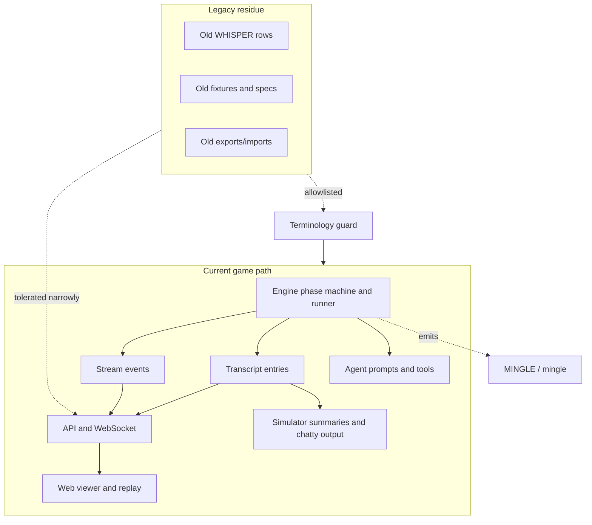

# feat: Cut over current games to Mingle phase

## Summary

Cut over the active private-room social phase from Whisper to Mingle for new Influence games. The work moves current engine state, events, persisted rows, prompts, simulator output, frontend types, and docs to Mingle while leaving old Whisper artifacts as historical residue, not as a supported current synonym.

---

## Problem Frame

The repo already contains the Mingle/open-room experiment, but current code still treats `WHISPER` and `whisper` as the active phase and transcript scope. That leaks old semantics into prompts and reasoning context, which makes agents reason as if they are in a narrow private whisper mode instead of a room-movement phase.

The origin requirements choose a forward cutover: new games emit Mingle, old games are not purged, and old Whisper display is not guaranteed as part of the rename.

---

## Requirements Trace

**Current phase identity**

- R1. New game execution emits `MINGLE` in phase changes, current game state, stream events, transcript rows, simulator output, and frontend phase types. Covers origin R1, R2, R8, AE1.
- R2. The active room-phase state machine and runner use Mingle names and do not route current execution through Whisper. Covers origin R2, R3, F1.
- R3. New private-room transcript entries use current Mingle scope vocabulary, while old Whisper rows can remain historical. Covers origin R8, R9, AE3.

**Agent and viewer behavior**

- R4. Agent prompts, tool schemas, phase guidelines, system transcript text, and reasoning context use Mingle and room-occupant language. Covers origin R5, R6, AE2.
- R5. Current web views, replay scenes, CSS phase state, and labels recognize `MINGLE` as the current phase. Covers origin R1, R10, F1.
- R6. Simulator variants, chatty output, summaries, and instrumentation use Mingle vocabulary. Covers origin R7, F3.

**Legacy and validation**

- R7. Remaining Whisper references are limited to historical specs, legacy fixtures, import tolerance, and explicit compatibility tests. Covers origin R9, R11, R14, AE4.
- R8. Docs define Mingle as the current phase and Whisper as legacy vocabulary. Covers origin R12.
- R9. Validation proves new games write and display Mingle, and current-facing prompt/render surfaces do not regress to Whisper. Covers origin R13.

---

## Key Technical Decisions

- **Cut over current identity, not display labels:** Add and use current Mingle phase/scope names end-to-end. A UI label on top of `WHISPER` does not satisfy the origin requirements.
- **Keep legacy handling narrow:** Old Whisper rows, fixtures, and specs can remain, but code should not advertise Whisper as an equal current phase. Any tolerance exists to avoid pointless crashes, not to provide polished historical replay support.
- **Rename agent-visible APIs before broad cleanup:** Prompt/tool vocabulary is the bug surface. Model-visible names and phase guidelines should move to Mingle in the same unit as the runner cutover.
- **Preserve local reasoning observability:** The `--chatty` and `reasoningContext` paths remain first-class during the rename. Mingle output should keep thinking/reasoning visibility intact.
- **Use characterization tests around state and persistence:** The current phase contract crosses engine, API, and web. Add or update focused tests before deleting old assumptions so failures identify contract drift.

---

## High-Level Technical Design

The current path should converge on `MINGLE` / Mingle terminology. Legacy Whisper values stay outside the current path and are either left untouched or tolerated at import/read seams where removing them would create noise.

---

## Implementation Units

### U1. Establish current Mingle engine contract

- **Goal:** Make Mingle the current engine phase and private-room message contract for new games.
- **Requirements:** R1, R2, R3, R7; origin R1, R2, R8, R9, AE1, AE3.
- **Dependencies:** None.
- **Files:**
  - `packages/engine/src/types.ts`
  - `packages/engine/src/game-runner.types.ts`
  - `packages/engine/src/phase-machine.ts`
  - `packages/engine/src/game-runner.ts`
  - `packages/engine/src/game-state.ts`
  - `packages/engine/src/__tests__/game-engine.test.ts`
  - `packages/engine/src/__tests__/extracted-modules.test.ts`
  - `packages/engine/src/__tests__/stream-listener.test.ts`
- **Approach:** Introduce `MINGLE` as the current phase and current private-room transcript scope. Move the normal round and Reckoning state IDs away from `whisper` / `reckoning_whisper`, and ensure current phase-change events emit Mingle. Keep any Whisper type support narrow and explicitly legacy if old fixtures still need it.
- **Execution note:** Start with engine characterization expectations for new phase changes and transcript rows before replacing current `Phase.WHISPER` usage.
- **Patterns to follow:** Existing `Phase` enum and `GameStreamEvent` contracts in `packages/engine/src/types.ts` and `packages/engine/src/game-runner.types.ts`; existing phase-machine transition tests in `packages/engine/src/__tests__/game-engine.test.ts`.
- **Test scenarios:**
  - Covers AE1. Given a normal round advances from lobby into the room phase, the phase machine emits `MINGLE` and then proceeds to rumor.
  - Covers AE1. Given Reckoning reaches its room phase, it emits `MINGLE` and then proceeds to plea.
  - Given a new room message is logged during the current room phase, the transcript entry phase is `MINGLE` and the scope is the current Mingle scope.
  - Covers AE3. Given an old fixture or legacy helper still references Whisper, the test names that use as historical or compatibility-only.
- **Verification:** New game-state and stream tests assert Mingle as the current phase without depending on `WHISPER` for active execution.

### U2. Rename room runner, prompts, and agent-facing APIs

- **Goal:** Make the active room phase implementation and model-facing language say Mingle.
- **Requirements:** R2, R4, R9; origin R3, R5, R6, F1, AE2.
- **Dependencies:** U1.
- **Files:**
  - `packages/engine/src/phases/whisper.ts`
  - `packages/engine/src/phases/index.ts`
  - `packages/engine/src/phases/phase-runner-context.ts`
  - `packages/engine/src/context-builder.ts`
  - `packages/engine/src/transcript-logger.ts`
  - `packages/engine/src/agent.ts`
  - `packages/engine/src/__tests__/mock-agent.ts`
  - `packages/engine/src/__tests__/game-engine.test.ts`
  - `packages/engine/src/__tests__/goodbye-message.test.ts`
  - `packages/engine/src/__tests__/agent-structured-output.test.ts`
- **Approach:** Rename the active runner and support types from Whisper to Mingle, including inbox/context naming, room diagnostics, log methods, and current agent interface methods. Replace model-visible `choose_whisper_room` and Whisper phase guidelines with Mingle equivalents. Keep removed/legacy methods only if an explicit legacy test still needs them.
- **Execution note:** Treat prompt rendering as behavior. Add no-Whisper assertions around Mingle prompt/tool surfaces early in this unit.
- **Patterns to follow:** Existing `takeMingleTurn` flow in `packages/engine/src/phases/whisper.ts`; existing prompt/tool schema shape in `packages/engine/src/agent.ts`.
- **Test scenarios:**
  - Covers AE2. Given an agent is asked to choose a room, the rendered prompt and tool schema use Mingle vocabulary and do not contain `whisper` or `WHISPER`.
  - Covers AE2. Given an agent is asked to take a Mingle turn, the prompt states that messages are private to current room occupants.
  - Given a room allocation is logged, the system transcript text says Mingle and preserves room metadata.
  - Given an agent receives prior room messages in later phases, the context labels them as Mingle/private-room messages rather than whispers.
- **Verification:** Prompt and runner tests pass with Mingle current names, and current transcript text has no Whisper phase banner.

### U3. Cut API, persistence, and live-event seams to Mingle

- **Goal:** Ensure new persisted rows, API payloads, WebSocket events, timer config, and live pacing use current Mingle vocabulary.
- **Requirements:** R1, R3, R7, R9; origin R1, R8, R9, R11, AE1, AE3.
- **Dependencies:** U1, U2.
- **Files:**
  - `packages/api/src/db/schema.ts`
  - `packages/api/src/services/game-lifecycle.ts`
  - `packages/api/src/services/viewer-event-pacer.ts`
  - `packages/api/src/services/ws-manager.ts`
  - `packages/api/src/routes/games.ts`
  - `packages/api/src/routes/free-queue.ts`
  - `packages/api/src/routes/admin.ts`
  - `packages/api/src/db/seed.ts`
  - `packages/api/src/__tests__/game-lifecycle.test.ts`
  - `packages/api/src/__tests__/viewer-event-pacer.test.ts`
  - `packages/api/src/__tests__/websocket.test.ts`
  - `packages/api/src/__tests__/games-api.test.ts`
  - `packages/api/src/__tests__/db.test.ts`
- **Approach:** Update current API types, default game config, free-game presets, seed data, live holds, and transcript serialization expectations to Mingle. Do not add a broad public normalization layer that maps Whisper to Mingle everywhere. Keep admin import or old-row parsing tolerant only where needed to avoid rejecting historical exports.
- **Patterns to follow:** Existing `serializeTranscriptEntry` in `packages/api/src/services/game-lifecycle.ts`; existing event pacing hold logic in `packages/api/src/services/viewer-event-pacer.ts`; existing transcript parsing tests in `packages/api/src/__tests__/games-api.test.ts`.
- **Test scenarios:**
  - Covers AE1. Given a new current transcript entry is serialized, the inserted row uses Mingle phase/scope values.
  - Covers AE1. Given live mode transitions away from Mingle, the viewer pacer applies the room-phase end hold formerly used for Whisper.
  - Covers AE3. Given admin import receives an old Whisper transcript row, it can store or pass through the historical value without redefining it as current Mingle behavior.
  - Given a free-game config is created, timer presets use the current Mingle timer key.
- **Verification:** API unit and route tests prove new writes/events are Mingle and old import tolerance remains intentionally narrow.

### U4. Cut frontend phase types and current viewer surfaces to Mingle

- **Goal:** Make the web app understand `MINGLE` as the current phase and display current games with Mingle component/type vocabulary.
- **Requirements:** R1, R5, R7, R9; origin R1, R10, R13, F1.
- **Dependencies:** U1, U3.
- **Files:**
  - `packages/web/src/lib/api.ts`
  - `packages/web/src/app/globals.css`
  - `packages/web/src/app/games/[slug]/game-viewer.tsx`
  - `packages/web/src/app/games/[slug]/components/constants.ts`
  - `packages/web/src/app/games/[slug]/components/types.ts`
  - `packages/web/src/app/games/[slug]/components/message-parsing.ts`
  - `packages/web/src/app/games/[slug]/components/whisper-phase.tsx`
  - `packages/web/src/app/games/[slug]/components/dramatic-replay-viewer.tsx`
  - `packages/web/src/app/games/[slug]/components/spectacle-viewer.tsx`
  - `packages/web/src/app/games/[slug]/components/message-bubble.tsx`
  - `packages/web/src/__tests__/constants.test.ts`
  - `packages/web/src/__tests__/message-parsing.test.ts`
  - `packages/web/src/__tests__/whisper-phase.test.tsx`
- **Approach:** Update `PhaseKey`, transcript scope types, phase constants, CSS attributes, dedicated-view routing, message filters, and current room components to use Mingle. Rename component exports/tests where practical, but prioritize current behavior over perfect mechanical file renames. Historical Whisper replay polish remains out of scope.
- **Patterns to follow:** Existing Mingle display copy in `packages/web/src/app/games/[slug]/components/whisper-phase.tsx`; existing phase constant tests in `packages/web/src/__tests__/constants.test.ts`.
- **Test scenarios:**
  - Given a current live event with phase `MINGLE`, the web message parser preserves the phase and Mingle scope.
  - Given the current game phase is `MINGLE`, the dedicated room view renders Mingle map/feed labels.
  - Given phase constants are enumerated, `MINGLE` has labels, room type mapping, and CSS data-phase support.
  - Covers AE3. Given an old test fixture still references `WHISPER`, it is either explicitly legacy or removed from the current-view test suite.
- **Verification:** Web tests pass with `MINGLE` as the current phase and no current-facing UI assertions depend on `WHISPER`.

### U5. Rename simulator, diagnostics, and local-model observability

- **Goal:** Make simulation variants, instrumentation, summaries, progress logs, and chatty transcript output use Mingle vocabulary.
- **Requirements:** R1, R6, R9; origin R7, F3.
- **Dependencies:** U1, U2.
- **Files:**
  - `packages/engine/src/simulate.ts`
  - `packages/engine/src/simulation-instrumentation.ts`
  - `packages/engine/src/__tests__/simulate-config.test.ts`
  - `packages/engine/src/__tests__/simulation-instrumentation.test.ts`
  - `docs/local-model-evaluation.md`
  - `docs/reasoning-transcript-observability.md`
- **Approach:** Rename current simulator variants from `open-whisper` style names to Mingle names, update summary/instrumentation field names where they describe current output, and print `[mingle->...]` for current private-room messages. Keep local reasoning and `--chatty` visibility unchanged.
- **Patterns to follow:** Existing variant detection helpers in `packages/engine/src/simulate.ts`; existing instrumentation aggregation in `packages/engine/src/simulation-instrumentation.ts`; local-model guidance in `docs/local-model-evaluation.md`.
- **Test scenarios:**
  - Given the `mingle` simulator variant is selected, config enables the current Mingle room settings and pair cooldown.
  - Given a power-lobby Mingle variant is selected, both power lobby and Mingle settings are active.
  - Given chatty output formats a current room transcript entry, the scope tag uses Mingle vocabulary.
  - Given instrumentation aggregates room sessions, output fields and markdown labels use Mingle names.
- **Verification:** Simulator config and instrumentation tests assert current Mingle variant names and current Mingle labels.

### U6. Update current docs and product vocabulary

- **Goal:** Align current docs with Mingle as the active phase and Whisper as legacy vocabulary.
- **Requirements:** R8, R9; origin R4, R12, R14.
- **Dependencies:** U1 through U5.
- **Files:**
  - `README.md`
  - `DEVELOPMENT.md`
  - `CONCEPTS.md`
  - `AGENTS.md`
  - `docs/rules-page-content.md`
  - `docs/reasoning-transcript-observability.md`
  - `docs/local-model-evaluation.md`
  - `docs/replay-experience-spec.md`
  - `docs/viewer-experience-spec.md`
  - `docs/visual-design-language.md`
  - `docs/whisper-rooms-and-anonymous-rumors-spec.md`
  - `docs/test-audit.md`
  - `packages/engine/src/simulate.ts`
- **Approach:** Update current-facing docs, commands, examples, and vocabulary to Mingle. Mark old Whisper specs as historical where they remain valuable. Keep old analysis docs unchanged unless they are presented as current rules or current setup instructions.
- **Patterns to follow:** Existing `CONCEPTS.md` glossary format; existing docs note pattern in `docs/whisper-rooms-and-anonymous-rumors-spec.md`.
- **Test scenarios:** Test expectation: none -- documentation-only unit, covered by terminology guard in U7 and repo checks.
- **Verification:** Current setup docs, local-model examples, and rules docs no longer instruct current work to use Whisper.

### U7. Add terminology guard and final validation coverage

- **Goal:** Prevent current-facing Whisper vocabulary from creeping back into Mingle execution, prompts, and docs.
- **Requirements:** R4, R7, R8, R9; origin R5, R12, R13, R14, AE4.
- **Dependencies:** U1 through U6.
- **Files:**
  - `packages/engine/src/__tests__/mingle-terminology.test.ts`
  - `packages/web/src/__tests__/constants.test.ts`
  - `packages/web/src/__tests__/message-parsing.test.ts`
  - `packages/api/src/__tests__/game-lifecycle.test.ts`
  - `docs/test-audit.md`
  - `package.json`
  - package-level `package.json` files if a new test script is warranted
- **Approach:** Add focused tests that render or inspect current Mingle prompt/tool/schema surfaces and fail on current-facing Whisper terms. Add an allowlist for historical specs, legacy fixtures, and explicit compatibility tests. Prefer a test that runs under the existing Bun mock baseline over a standalone shell-only check.
- **Patterns to follow:** Existing Bun test organization in `packages/engine/src/__tests__`, `packages/api/src/__tests__`, and `packages/web/src/__tests__`; existing root `bun run test` mock baseline.
- **Test scenarios:**
  - Covers AE2. Current Mingle prompts and tool schemas contain `Mingle` / `mingle` and do not contain `WHISPER`, `whisper phase`, or `choose_whisper_room`.
  - Covers AE4. A repository terminology scan allows Whisper only in historical specs, legacy fixtures, migration/import tolerance, or explicit legacy tests.
  - Covers AE1. An end-to-end mock game transcript includes `MINGLE` for current room-phase entries.
  - Covers AE3. A historical fixture containing `WHISPER` remains allowed only when tagged as legacy.
- **Verification:** The root mock test baseline and broader check path catch current-facing Whisper regressions.

---

## Scope Boundaries

In scope:

- Current game engine, prompts, events, persistence, API, web types, simulator output, and current docs move to Mingle.
- Historical Whisper artifacts stay if deleting or migrating them adds cost without current-product value.
- Narrow tolerance can remain for old imports, fixtures, and explicitly legacy tests.

Out of scope:

- Purging old games.
- Backfilling every historical transcript row or export.
- Guaranteeing polished rendering of old Whisper games.
- Reopening Mingle room allocation rules unless implementation exposes a direct contradiction.
- Building a permanent compatibility layer that treats Whisper as a supported current phase.

Deferred to follow-up work:

- A later database backfill or export rewrite, if old data becomes a real maintenance burden.
- A broader replay redesign for historical Whisper games.
- Renaming media asset filenames that are not loaded by current Mingle execution.

---

## System-Wide Impact

- **Engine:** Active phase identity, room runner, transcript logger, agent context, and state-machine transition tests change together.
- **API:** New transcript rows and live events carry Mingle names; old imports may still contain historical Whisper values.
- **Web:** Current viewer and replay code must recognize `MINGLE` as a current phase; historical Whisper display is best-effort only.
- **Simulator:** Local model evaluation output changes names but should preserve reasoning and `--chatty` observability.
- **Docs:** Current docs must stop teaching Whisper as the active phase.

---

## Risks & Dependencies

- **Wide rename regression:** Many tests currently assert `WHISPER` and `scope === "whisper"`. Mitigate by changing behavior tests in dependency order and adding a terminology guard at the end.
- **Prompt leakage:** Agent confusion can persist if only state/events change. Mitigate by testing rendered prompt/tool text directly in U2 and U7.
- **Active run corruption:** The repo is not crash-safe for active game execution. Drain or cancel active runs before deploying a phase identity change.
- **Historical artifact ambiguity:** Old fixtures can look like current expectations. Mitigate by tagging remaining Whisper references as legacy or moving them into explicit compatibility tests.
- **Local model observability drift:** Simulator renames can accidentally hide reasoning output. Mitigate by keeping `thinking` and `reasoningContext` assertions in simulator/agent tests.

---

## Operational Notes

- Deploy after active game runs are drained or cancelled; do not rely on checkpoint/resume during the phase identity cutover.
- Do not run a destructive DB cleanup as part of this work.
- Treat staging as the first real QA surface after local checks because live phase events and viewer behavior cross package boundaries.

---

## Documentation Plan

- Update current setup and simulation examples in `README.md`, `DEVELOPMENT.md`, `docs/local-model-evaluation.md`, and `docs/reasoning-transcript-observability.md`.
- Update player/rules language in `docs/rules-page-content.md` and current viewer/replay specs that still describe Whisper as live behavior.
- Mark `docs/whisper-rooms-and-anonymous-rumors-spec.md` as historical for Whisper-phase mechanics while preserving any anonymous rumor guidance that still applies.
- Keep `CONCEPTS.md` as the glossary source for Mingle and legacy Whisper.

---

## Sources & Research

- Origin requirements: `docs/brainstorms/2026-06-11-mingle-phase-requirements.md`
- Prior ideation: `docs/ideation/2026-06-11-whisper-to-mingle-rename-ideation.html`
- Repo instructions: `AGENTS.md`
- Vocabulary: `CONCEPTS.md`
- Engine seams: `packages/engine/src/types.ts`, `packages/engine/src/phase-machine.ts`, `packages/engine/src/phases/whisper.ts`, `packages/engine/src/agent.ts`, `packages/engine/src/transcript-logger.ts`, `packages/engine/src/context-builder.ts`, `packages/engine/src/game-runner.types.ts`, `packages/engine/src/simulate.ts`, `packages/engine/src/simulation-instrumentation.ts`
- API seams: `packages/api/src/db/schema.ts`, `packages/api/src/services/game-lifecycle.ts`, `packages/api/src/services/viewer-event-pacer.ts`, `packages/api/src/routes/games.ts`, `packages/api/src/routes/free-queue.ts`, `packages/api/src/routes/admin.ts`
- Web seams: `packages/web/src/lib/api.ts`, `packages/web/src/app/games/[slug]/game-viewer.tsx`, `packages/web/src/app/games/[slug]/components/constants.ts`, `packages/web/src/app/games/[slug]/components/message-parsing.ts`, `packages/web/src/app/games/[slug]/components/dramatic-replay-viewer.tsx`, `packages/web/src/app/games/[slug]/components/whisper-phase.tsx`

External research was skipped because the plan is governed by repo-internal contracts and the origin requirements, not by an unsettled framework or third-party API choice.
