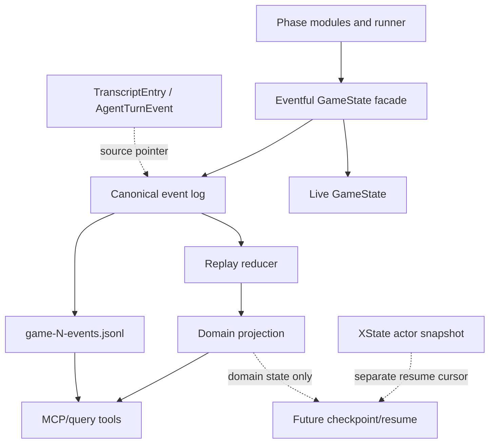
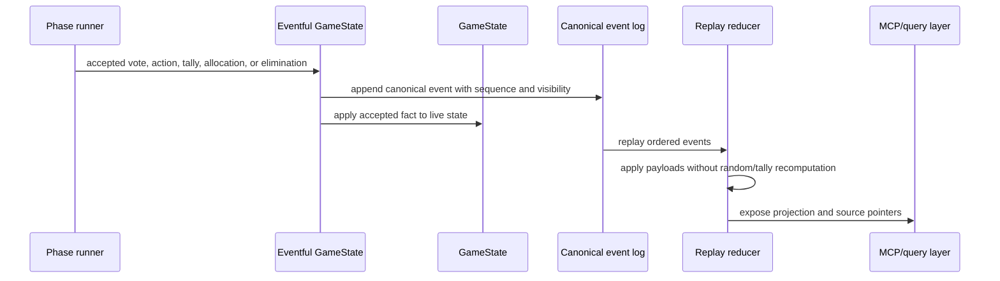

# feat: Add canonical game event spine

## Summary

Add a canonical domain event spine under `GameState` so accepted game facts can be replayed into a domain projection. The plan proves replay parity locally, writes simulator-side canonical event JSONL, and exposes a small read-only MCP/query surface over projections while keeping XState responsible for phase position and future resume cursors.

---

## Problem Frame

The simulator already writes rich observability artifacts: transcripts, progress JSONL, and per-agent turn JSONL. Those artifacts explain what happened, but they do not currently rebuild the game because important facts are stored through direct `GameState` mutation, tally methods, fallback choices, and random tie-breakers.

The broader statefulness plan already identifies XState snapshots and `GameState` checkpoints as future resume inputs. This plan narrows the prerequisite: accepted domain facts should be emitted once, replayed deterministically, and consumed by projections. API crash-safe resume remains a later milestone until the event log can prove parity against live state.

The current Mingle cutover is also relevant. Residual current-path `Whisper` names are allowed cleanup when they would leak into canonical event names, projection fields, MCP output, simulator docs, or current runtime terminology. Historical Whisper rows, fixtures, and specs can remain legacy-only.

---

## Requirements Trace

**Canonical event authority**

- R1. The engine defines a canonical event envelope for accepted domain facts needed to rebuild board state. Covers origin R1, R3, R6.
- R2. Replay-relevant state changes append canonical events at the accepted mutation path rather than deriving them from transcript prose. Covers origin R2, F1.
- R3. Canonical events stay distinct from `TranscriptEntry`, `GameStreamEvent`, and `AgentTurnEvent`; those observability records are linked by source pointers when useful. Covers origin R3, R8.
- R4. Event payloads record accepted outcomes for random, fallback, wheel, and tie-break decisions so replay never re-rolls them. Covers origin R7, R12, AE2.
- R5. Current-domain event names and payload fields use Mingle vocabulary where the current runtime uses the room phase; Whisper remains legacy-only. Carries the user's confirmed scope correction.

**Reducer and projection**

- R6. A replay reducer rebuilds board/domain state without deciding legal phases or next transitions. Covers origin R4, R10, R11.
- R7. XState actor snapshots remain a separate resume input; the reducer does not infer phase cursor state. Covers origin R5, R19.
- R8. The replay projection covers players, statuses, round, shields, votes, empowered player, power action, council candidates, room allocations, jury/endgame state, finalists, winner state, and round results where those fields exist today. Covers origin R10.
- R9. Event schema evolution uses explicit payload version handling or migration notes before old event logs are treated as supported. Covers origin R13.

**Validation and artifacts**

- R10. Tests compare replay projections against an expanded live domain snapshot at phase boundaries and game completion. Covers origin R14, AE1, AE4.
- R11. Tests cover deterministic replay for ties, wheel/fallback outcomes, shields, auto-elimination, council votes, jury/endgame transitions, and Mingle room allocations. Covers origin R15.
- R12. Tests prevent replay-relevant direct mutation paths from bypassing canonical event append. Covers origin R16.
- R13. Simulator runs write `game-N-events.jsonl` alongside existing progress, turns, transcript, and JSON artifacts. Covers origin R17, AE5.
- R14. The event JSONL preserves source pointers back to canonical event sequence IDs and linked observability records. Covers origin R8, R18.

**MCP and migration boundary**

- R15. A local read-only MCP/query surface lists runs, reads projections, and returns source-cited answers derived from canonical events. Covers origin R18, F3.
- R16. MCP tools cannot drive gameplay or mutate game state. Covers origin scope boundaries.
- R17. API games do not depend on the event spine for crash-safe resume in this plan. Covers origin R19.
- R18. The plan leaves a clear later path for Postgres event storage, checkpoints, and XState persisted snapshots without implementing that runtime persistence now. Covers origin R20, F4.

---

## Key Technical Decisions

- **Append-then-apply facade under `GameState`:** Route replay-relevant mutation through an eventful facade that appends a canonical event before applying it to the live `GameState`. This keeps the event log at the mutation source and avoids a parallel state machine built from after-the-fact observers.
- **Reducer is a projection, not an engine:** Replay rebuilds domain state only. It does not call XState, does not select the next phase, and does not re-run tally or candidate-selection logic that could produce a different accepted outcome.
- **Accepted outcomes are the payload:** Events store what the game accepted, including random or fallback choices. Agent proposals, hidden reasoning, and transcript text explain the outcome but are not the canonical payload.
- **Mingle cleanup is scoped to current event surfaces:** Rename residual current-path Whisper diagnostics and field names when they would become part of canonical events, projections, simulator artifacts, or MCP responses. Leave historical docs, old rows, fixtures, and import tolerance as legacy-only.
- **Simulator JSONL first, API persistence later:** The first durable event store is local simulator JSONL. API Postgres persistence, ownership locks, and crash-safe resume wait until parity proves the log can rebuild state.
- **MCP reads projections with citations:** The MCP starts as a real local read-only server over event logs and derived projections. SQLite FTS can follow once the projection vocabulary stabilizes; the first MCP should not require a separate indexed database to answer basic state and timeline questions.
- **Visibility is in the envelope:** Every event carries a visibility tier so producer, audience, and player-visible query modes can filter without guessing from transcript scope.
- **Source pointers need stable local addresses:** Canonical events should cite observability records through event sequence IDs, transcript/turn sequence IDs, or JSONL file positions. Timestamps and display text are not stable enough to serve as the only join key.

---

## Alternative Approaches Considered

- **Post-hoc events from transcript or stream listeners:** Rejected because the current observability stream explains behavior but does not contain every accepted board-state mutation or deterministic fallback result.
- **Replace XState with event replay:** Rejected because XState already owns phase legality and resume cursor semantics. The event reducer should rebuild domain projection state only.
- **Start with API Postgres persistence:** Deferred because API resume would consume unproven events and could weaken the existing crash-safety warning. Simulator JSONL gives faster parity evidence with lower operational risk.
- **SQLite FTS as the first milestone:** Deferred because search indexes should be rebuildable projections over canonical events. Building FTS first would optimize queries before the event vocabulary proves it can model the game.

---

## High-Level Technical Design

The current game loop continues to execute through phase modules and XState. Replayable facts flow through the eventful `GameState` path, then into JSONL and projection builders. Observability records can cite or be cited by canonical events, but they do not become the source of board state.

The important invariant is temporal: the accepted domain event exists before the live state mutation is considered complete. Replay should therefore prove the event stream has enough information to reconstruct the same domain state.

---

## Implementation Units

### U1. Define canonical event envelope and domain projection contracts

- **Goal:** Establish the typed event envelope, visibility model, source pointer shape, payload versioning convention, and projection snapshot shape.
- **Requirements:** R1, R3, R6, R8, R9, R15; origin R1, R3, R6, R8, R9, R10, R13, AE3.
- **Dependencies:** None.
- **Files:**
  - `packages/engine/src/canonical-events.ts`
  - `packages/engine/src/game-projection.ts`
  - `packages/engine/src/game-runner.types.ts`
  - `packages/engine/src/types.ts`
  - `packages/engine/src/index.ts`
  - `packages/engine/src/__tests__/canonical-events.test.ts`
  - `CONCEPTS.md`
- **Approach:** Define a canonical event envelope with sequence, game identity, round, phase, event type, timestamp, source, visibility, payload version, source pointers, and payload. Define source pointer types that can address canonical events, transcript entries, agent turns, and simulator JSONL records without relying only on timestamps. Define a domain projection shape that is richer than `GameStateSnapshot` because replay must cover hidden board facts, not only observer catch-up data.
- **Patterns to follow:** Existing exported type structure in `packages/engine/src/game-runner.types.ts`; glossary style in `CONCEPTS.md`; no `as any` discipline from reasoning observability docs.
- **Test scenarios:**
  - Given a sample event with minimal required envelope fields, type-level and runtime validation accepts it.
  - Given an event missing sequence, game ID, visibility, or payload version, validation rejects it.
  - Given an event with a linked `agent_turn` source pointer, the pointer preserves event type, actor, phase, and sequence metadata without copying hidden reasoning into player-visible payload.
  - Given a linked transcript or turn record has no persisted database ID, the source pointer can still address it by per-game sequence or JSONL position.
  - Given a player-visible query mode, a producer-only event is excluded by the visibility helper.
- **Verification:** Event envelope and projection types export from the engine package and tests prove required metadata is present before implementation units start appending events.

### U2. Clean current Mingle terminology on event-facing surfaces

- **Goal:** Remove residual current-path Whisper names from the runtime types and diagnostics that will become canonical event payload or projection vocabulary.
- **Requirements:** R5, R14; carries the user's confirmed Mingle cleanup allowance.
- **Dependencies:** U1.
- **Files:**
  - `packages/engine/src/types.ts`
  - `packages/engine/src/game-runner.types.ts`
  - `packages/engine/src/transcript-logger.ts`
  - `packages/engine/src/phases/mingle.ts`
  - `packages/engine/src/simulation-instrumentation.ts`
  - `packages/engine/src/simulate.ts`
  - `packages/engine/src/__tests__/mingle-terminology.test.ts`
  - `packages/engine/src/__tests__/simulation-instrumentation.test.ts`
- **Approach:** Rename current room diagnostic types and instrumentation fields from Whisper to Mingle where they describe active Mingle behavior. Keep `Phase.WHISPER`, `scope: "whisper"`, and deprecated whisper agent methods only for legacy compatibility until a separate cleanup can delete them safely.
- **Patterns to follow:** Existing Mingle glossary entries in `CONCEPTS.md`; existing terminology guard in `packages/engine/src/__tests__/mingle-terminology.test.ts`.
- **Test scenarios:**
  - Given Mingle room diagnostics are serialized into a canonical event payload, the field names use Mingle vocabulary.
  - Given simulation instrumentation aggregates room sessions, current summary labels use Mingle names.
  - Given a legacy transcript scope or old row contains `whisper`, the compatibility path is still explicitly legacy and not emitted by new Mingle events.
  - Given the terminology guard scans current event-facing files, it allows Whisper only for legacy compatibility, old docs, or deprecated methods.
- **Verification:** Current runtime diagnostics and simulator summaries do not introduce Whisper names into canonical event schemas or projection-facing output.

### U3. Introduce append-then-apply mutation integration

- **Goal:** Route replay-relevant `GameState` mutation through an eventful path that appends canonical events before live state changes.
- **Requirements:** R1, R2, R4, R12; origin R1, R2, R6, R7, R16, F1.
- **Dependencies:** U1, U2.
- **Files:**
  - `packages/engine/src/game-state.ts`
  - `packages/engine/src/canonical-event-log.ts`
  - `packages/engine/src/phases/phase-runner-context.ts`
  - `packages/engine/src/game-runner.ts`
  - `packages/engine/src/__tests__/canonical-event-log.test.ts`
  - `packages/engine/src/__tests__/game-engine.test.ts`
- **Approach:** Add an eventful `GameState` facade for mutating methods such as round start, shield expiry, vote recording, empowered assignment, power action, candidate determination, council vote, last message, elimination, endgame stage, endgame votes, jury votes, winner determination, round result, and Mingle room allocation. Phase runners should receive the facade at replay-critical seams so the mutation contract is visibly append first, then apply.
- **Execution note:** Add characterization coverage around the current direct mutation methods before moving phase runners to the eventful path.
- **Patterns to follow:** Existing phase-runner dependency injection through `PhaseRunnerContext`; existing `GameRunner.getStateSnapshot()` catch-up pattern; existing tests in `packages/engine/src/__tests__/game-engine.test.ts`.
- **Test scenarios:**
  - Given a vote is recorded through the eventful path, the canonical log contains the vote event before the live tally is visible.
  - Given a protect power action grants a shield, the log records both accepted power action and shield outcome before the shield appears in live state.
  - Given a direct replay-relevant mutator is called outside the eventful path in a tested seam, the bypass guard fails or the method is marked replay-internal.
  - Given a non-replay read helper is called, it does not append an event.
- **Verification:** Mutating phase code can no longer update replay-critical board state without producing canonical events in tests.

### U4. Cover accepted outcome event vocabulary across phases

- **Goal:** Emit the smallest event vocabulary that covers normal rounds, Mingle, Reckoning, Tribunal, Judgment, and all deterministic outcome boundaries.
- **Requirements:** R1, R2, R4, R5, R8, R11; origin R1, R2, R7, R10, R12, R15, AE1, AE2.
- **Dependencies:** U3.
- **Files:**
  - `packages/engine/src/phases/lobby.ts`
  - `packages/engine/src/phases/mingle.ts`
  - `packages/engine/src/phases/vote.ts`
  - `packages/engine/src/phases/power.ts`
  - `packages/engine/src/phases/council.ts`
  - `packages/engine/src/phases/elimination.ts`
  - `packages/engine/src/phases/endgame.ts`
  - `packages/engine/src/game-state.ts`
  - `packages/engine/src/__tests__/canonical-event-log.test.ts`
  - `packages/engine/src/__tests__/game-engine.test.ts`
  - `packages/engine/src/__tests__/goodbye-message.test.ts`
- **Approach:** Add events for roster initialization, round start, shield expiry, Mingle room allocation and movement outcome, vote cast, empower tally resolution, empower re-vote resolution, power action, shield grant, council candidate resolution, auto-elimination, council vote, player last message, player eliminated, endgame stage set, endgame elimination vote, tribunal jury tiebreaker vote, jury vote, winner determined, and round result. Tally events store resolved counts and accepted IDs so replay does not rerun choice logic.
- **Patterns to follow:** Existing `AgentTurnEvent` emission near accepted decisions; existing `handleElimination` centralization; existing tally and fallback branches in `GameState`.
- **Test scenarios:**
  - Covers AE1. Given a normal vote phase accepts empower/expose votes, the log contains vote events and an empower-resolution event whose empowered ID matches live state.
  - Covers AE2. Given an empower re-vote remains tied, the event records the wheel winner and replay uses that winner without randomness.
  - Given `determineCandidates` uses protect, auto-eliminate, shield filtering, or fallback candidate fill, the canonical event records accepted candidates, shield grant, or auto-elimination exactly once.
  - Given a council vote ties and the empowered vote resolves it, the elimination event records the accepted eliminated player.
  - Given Reckoning, Tribunal, or Judgment reaches a fallback or tie-break path, the accepted eliminated player or winner is recorded in a replay-stable event.
  - Given Mingle allocates rooms across beats, room allocation and movement events use Mingle vocabulary and enough payload to rebuild round allocations.
- **Verification:** Phase tests show every accepted domain outcome has one canonical event and no replay path depends on parsing system transcript text.

### U5. Build replay reducer and parity harness

- **Goal:** Rebuild a domain projection from canonical events and compare it against live state at phase boundaries and game completion.
- **Requirements:** R6, R7, R8, R9, R10, R11, R12; origin R4, R5, R10, R11, R12, R13, R14, R15, R16, F2, AE1, AE2, AE4.
- **Dependencies:** U3, U4.
- **Files:**
  - `packages/engine/src/game-projection.ts`
  - `packages/engine/src/game-state.ts`
  - `packages/engine/src/game-runner.ts`
  - `packages/engine/src/__tests__/canonical-event-replay.test.ts`
  - `packages/engine/src/__tests__/stream-listener.test.ts`
  - `packages/engine/src/__tests__/full-game.test.ts`
- **Approach:** Implement a reducer that applies canonical events into a domain projection. Add an expanded live domain snapshot separate from public observer snapshots, then compare replay output against it at known boundaries. The comparison should exclude XState cursor data and transcript text while covering hidden domain state.
- **Execution note:** Start with deterministic reducer fixtures before full-run parity so failures distinguish schema gaps from runner integration gaps.
- **Patterns to follow:** Existing snapshot catch-up tests in `packages/engine/src/__tests__/stream-listener.test.ts`; existing no-LLM game-state tests in `packages/engine/src/__tests__/game-engine.test.ts`.
- **Test scenarios:**
  - Covers AE1. Given a hand-authored vote/power/council event fixture, replay produces the expected empowered player, candidates, shields, elimination, and round result.
  - Covers AE2. Given two replay runs over the same random/fallback event fixture, both projections produce identical accepted outcomes.
  - Covers AE4. Given a domain projection rebuilds to a round and board state, the test asserts no XState phase transition was inferred by the reducer.
  - Given replay starts from a roster initialization event with a fixed game ID and player IDs, the projection keeps those identities rather than generating a fresh game ID.
  - Given a mock full game reaches multiple phase boundaries, replay projection matches live domain snapshot for fields in R8.
  - Given an unknown future event version is encountered, replay fails with a migration/version error rather than silently ignoring it.
- **Verification:** Replay parity fails when an in-scope mutation bypasses event append or an event lacks data needed to rebuild the domain projection.

### U6. Write canonical event JSONL from simulations

- **Goal:** Add simulator-side `game-N-events.jsonl` output and keep existing simulation artifacts unchanged.
- **Requirements:** R13, R14; origin R17, R18, F1, F2, AE5.
- **Dependencies:** U5.
- **Files:**
  - `packages/engine/src/simulate.ts`
  - `packages/engine/src/game-runner.ts`
  - `packages/engine/src/__tests__/simulate-config.test.ts`
  - `docs/reasoning-transcript-observability.md`
  - `docs/local-model-evaluation.md`
  - `DEVELOPMENT.md`
  - `README.md`
- **Approach:** Expose canonical events from `GameRunner` through a listener or accessor, serialize them as clean JSONL records beside `game-N-turns.jsonl` and `game-N-progress.jsonl`, and include the new path in batch summaries. Add stable per-game sequence or JSONL-position metadata to linked observability records when needed so canonical events and MCP answers can cite them. Preserve existing artifacts so local model workflows continue to work.
- **Patterns to follow:** Existing `serializeAgentTurnEvent`, `writeAgentTurn`, and `attachProgressLogger` flow in `packages/engine/src/simulate.ts`; existing simulation artifact docs.
- **Test scenarios:**
  - Covers AE5. Given a serialized canonical event, the JSONL record includes timestamp, elapsed time, game number, event sequence, event type, visibility, and payload version.
  - Given an event has linked `agent_turn` or transcript source pointers, the JSONL record preserves those pointers without ANSI formatting.
  - Given a simulation batch starts, `game-N-events.jsonl` is initialized and listed in progress or summary metadata.
  - Given existing turn/progress JSONL tests run, their output shape remains unchanged except for additive path metadata where intended.
- **Verification:** A completed local simulation has transcript, full JSON, progress JSONL, turns JSONL, and canonical events JSONL artifacts.

### U7. Add local read-only MCP server over event projections

- **Goal:** Provide a small local MCP server that another agent can connect to for game-state and evidence queries.
- **Requirements:** R7, R15, R16; origin R8, R9, R18, F3, AE3, AE5.
- **Dependencies:** U5, U6.
- **Files:**
  - `packages/engine/src/game-mcp/read-model.ts`
  - `packages/engine/src/game-mcp/server.ts`
  - `packages/engine/src/game-mcp/index.ts`
  - `packages/engine/src/__tests__/game-mcp.test.ts`
  - `packages/engine/package.json`
  - `README.md`
  - `docs/local-model-evaluation.md`
- **Approach:** Start with stdio and local files. The server command accepts a simulation batch directory, including one that is still being appended during a running game. Expose resources for sessions, event logs, projections, and linked transcript/turn records. Add narrow tools for listing games, reading a player timeline, filtering events by type/phase/actor/visibility, reading current projection state, and finding linked observability records. Responses must include event sequence IDs and source pointers. The server must be read-only and local by default.
- **Patterns to follow:** Existing simulator artifact layout under `packages/engine/docs/simulations/`; MCP resources and tools model from official docs; local-only safety posture from MCP transport guidance.
- **Test scenarios:**
  - Covers AE5. Given a completed simulation batch, the MCP read model lists games and returns a projection rebuilt from `game-N-events.jsonl`.
  - Given a simulation is still running and appending `game-N-events.jsonl`, the MCP server reads the latest complete JSONL records without corrupting partial writes.
  - Given a producer-level query asks for linked reasoning-adjacent evidence, the response can cite event IDs and linked turn records.
  - Covers AE3. Given a player-visible query mode, hidden reasoning and producer-only events are excluded.
  - Given a tool receives a mutation-shaped request, the server rejects it because gameplay writes are out of scope.
  - Given the event log is incomplete or has an unsupported version, the MCP reports a projection error rather than inventing state from transcripts.
- **Verification:** Another local MCP client can connect to the server, list a simulation game, read its projection, and receive cited query results without mutating gameplay state.

### U8. Document API migration boundary and future persistence path

- **Goal:** Keep the API/stateless-backend story accurate without implementing crash-safe runtime persistence prematurely.
- **Requirements:** R7, R17, R18; origin R5, R19, R20, F4.
- **Dependencies:** U5, U6, U7.
- **Files:**
  - `docs/statefulness-plan.md`
  - `docs/reasoning-transcript-observability.md`
  - `docs/local-model-evaluation.md`
  - `DEVELOPMENT.md`
- **Approach:** Update docs to name canonical events as the domain replay prerequisite for future API persistence. Do not add a production database event table in this plan. Keep `activeGames` and crash-safety warnings intact until Postgres event persistence, XState persisted snapshots, ownership locks, and checkpoint/resume are built.
- **Patterns to follow:** Existing warning in `DEVELOPMENT.md`; existing statefulness plan structure; current API lifecycle service comments around `activeGames`.
- **Test scenarios:** Test expectation: none -- documentation-only unit that preserves the existing API runtime boundary.
- **Verification:** Docs explain that canonical events are a springboard toward stateless app servers, not a shipped crash-safe backend.

---

## Scope Boundaries

In scope:

- Canonical event envelope, event log, eventful mutation integration, reducer projection, parity tests, simulator JSONL output, and local read-only MCP/query access.
- Expanded domain snapshot support for replay parity, separate from public observer snapshots.
- Current-path Mingle cleanup where residual Whisper names would enter canonical events, projections, simulator outputs, MCP responses, or current docs.

Out of scope:

- Replacing XState or moving phase legality into the reducer.
- Making MCP tools drive gameplay.
- Treating `AgentTurnEvent`, `TranscriptEntry`, or transcript prose as the domain source of truth.
- Claiming API crash-safe resume or stateless backend support before checkpoint, XState persisted snapshot, ownership, and persistence work lands.
- Capturing every prompt-context snapshot as canonical game state.
- Backfilling historical Whisper rows or guaranteeing polished historical Whisper replay.

### Deferred to Follow-Up Work

- SQLite FTS indexes over events, transcripts, turns, thinking, and reasoning once the projection vocabulary stabilizes.
- Postgres canonical event tables and migrations for API games.
- XState persisted snapshot storage and `GameRunner` hydration from checkpoints.
- Distributed ownership locks and multi-instance WebSocket/event delivery.
- Cross-session model evaluation dashboards over many simulation batches.

---

## System-Wide Impact

- **Engine:** The mutation path becomes eventful, tests need richer domain snapshots, and current Mingle terminology must be clean on event-facing types.
- **Simulator:** A fifth per-game artifact, `game-N-events.jsonl`, appears beside existing transcript, full JSON, progress, and turns outputs.
- **MCP/query:** A local read-only query surface becomes available for House MC experiments and external agents.
- **API:** No runtime persistence behavior changes in this plan, but docs and type boundaries should make the future Postgres event-store path clearer.
- **Docs:** Local model and statefulness docs need to describe canonical events without weakening the existing crash-safety warning.

---

## Risks & Dependencies

- **Parallel state machine risk:** A reducer can accidentally become a second engine. Mitigate by storing accepted outcomes, excluding XState cursor decisions, and comparing against live domain snapshots rather than re-running phase logic.
- **Mutation bypass risk:** Existing phase modules call `GameState` directly. Mitigate with an append-then-apply facade, bypass tests, and focused migration of replay-critical mutators.
- **Event vocabulary creep:** Too many event types make the first implementation harder to finish. Mitigate by covering only fields needed for parity and adding versions for future expansion.
- **Replay nondeterminism:** Random/fallback code paths currently live in tally methods and phase modules. Mitigate by event payloads that record accepted IDs and by repeated replay tests.
- **Source pointer instability:** Existing observability records are rich but not all are addressable by durable IDs. Mitigate by adding per-game sequence or JSONL-position pointers where the canonical log needs citations.
- **Visibility leaks:** Hidden `thinking` and `reasoningContext` are valuable for producer queries but unsafe for player-visible modes. Mitigate with envelope visibility and MCP query-mode tests.
- **Dependency addition:** A real MCP server likely requires adding the official TypeScript SDK or a small local JSON-RPC wrapper. Keep the server local and stdio-first, and avoid adding SQLite until query needs justify it.
- **Mingle cleanup blast radius:** Renaming current diagnostics can touch many tests. Keep cleanup limited to event-facing current surfaces and preserve explicit legacy allowances.

---

## Acceptance Examples

- AE1. Given a vote phase accepts player votes and resolves an empowered player, replaying canonical events produces the same vote ledger and empowered player as the live domain snapshot.
- AE2. Given an empower, council, endgame, or jury tie uses a wheel, fallback, or accepted tiebreak, repeated replay uses the recorded accepted result and never calls randomness.
- AE3. Given hidden reasoning exists on linked agent turns, producer queries can follow source pointers while player-visible projection queries exclude privileged reasoning.
- AE4. Given domain state is rebuilt from events, XState actor state is still treated as a separate resume cursor and the reducer does not infer phase transitions.
- AE5. Given a simulator run completes, `game-N-events.jsonl` can rebuild the projection and MCP query results can cite canonical event sequence IDs.

---

## Documentation and Operational Notes

- Update `docs/reasoning-transcript-observability.md`, `docs/local-model-evaluation.md`, `DEVELOPMENT.md`, and `README.md` when simulator output changes.
- Update `docs/statefulness-plan.md` to position canonical events as the domain-event prerequisite for future checkpoint/resume, while preserving the warning that active games are not crash-safe.
- Keep the simulator artifact list synchronized across docs and JSDoc in `packages/engine/src/simulate.ts`.
- Do not deploy this as a crash-safety feature. The operational behavior remains process-local until the future persistence units land.

---

## Sources & Research

- Origin requirements: `docs/brainstorms/2026-06-11-canonical-game-event-spine-requirements.md`
- Ideation artifact: `docs/ideation/2026-06-11-game-mcp-house-mc-ideation.html`
- Statefulness context: `docs/statefulness-plan.md`
- Observability context: `docs/reasoning-transcript-observability.md`
- Existing Mingle cutover plan: `docs/plans/2026-06-11-001-feat-mingle-phase-cutover-plan.md`
- Engine mutation seams: `packages/engine/src/game-state.ts`, `packages/engine/src/game-runner.ts`, `packages/engine/src/phases/lobby.ts`, `packages/engine/src/phases/mingle.ts`, `packages/engine/src/phases/vote.ts`, `packages/engine/src/phases/power.ts`, `packages/engine/src/phases/council.ts`, `packages/engine/src/phases/elimination.ts`, `packages/engine/src/phases/endgame.ts`
- Simulation seams: `packages/engine/src/simulate.ts`, `packages/engine/src/simulation-instrumentation.ts`
- API boundary: `packages/api/src/services/game-lifecycle.ts`, `packages/api/src/db/schema.ts`, `packages/api/src/services/ws-manager.ts`
- XState persistence docs: https://stately.ai/docs/persistence
- MCP Resources specification: https://modelcontextprotocol.io/specification/2025-06-18/server/resources
- MCP Tools specification: https://modelcontextprotocol.io/specification/2025-06-18/server/tools
- MCP Transports specification: https://modelcontextprotocol.io/specification/2025-06-18/basic/transports
- SQLite FTS5 docs for deferred indexing: https://www.sqlite.org/fts5.html
- Martin Fowler on Event Sourcing: https://martinfowler.com/eaaDev/EventSourcing.html
