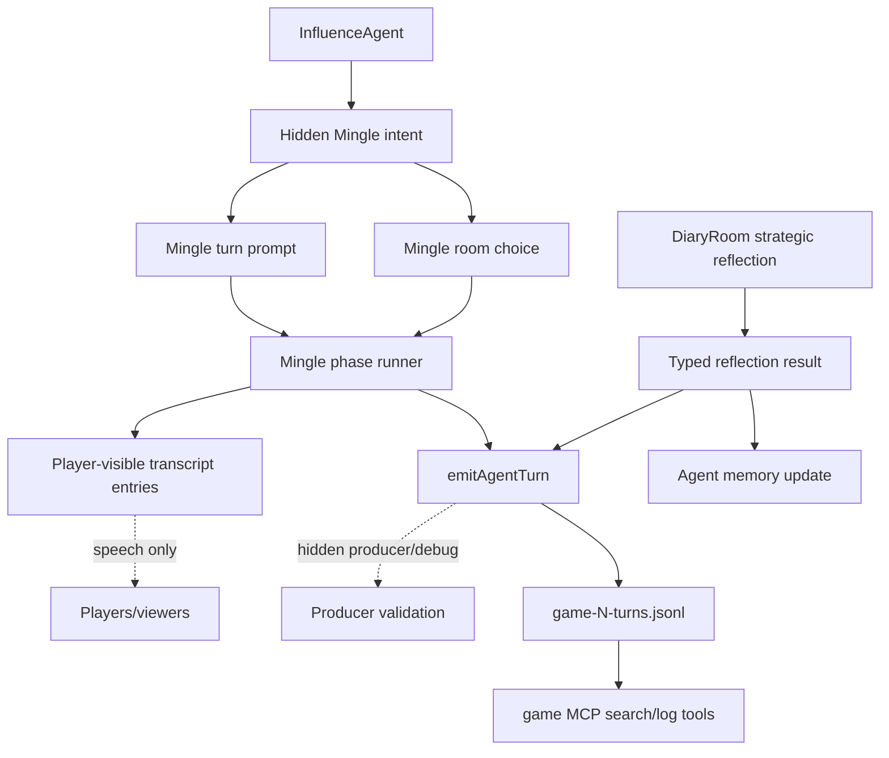
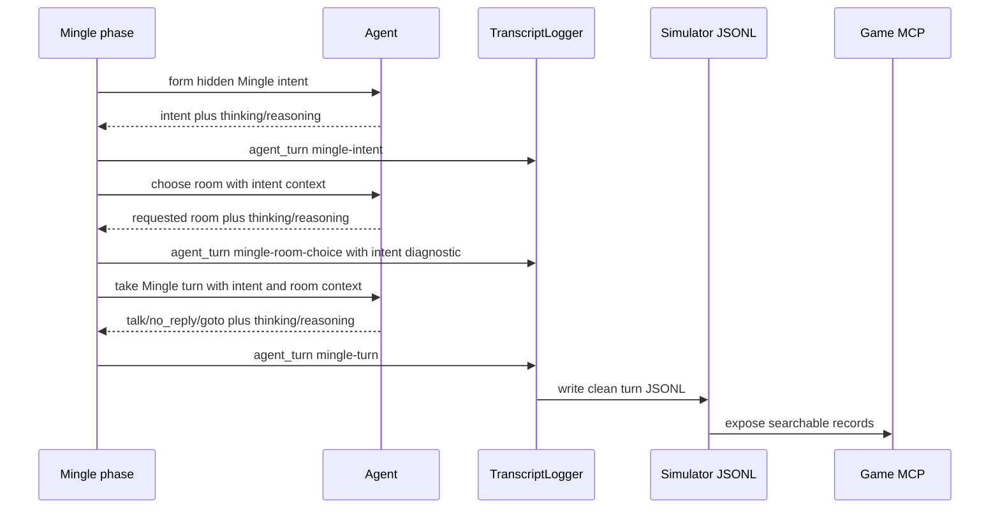

# feat: Add Mingle strategy intent and reflection observability

## Summary

Add a hidden Mingle intent before room choice, thread that intent into room-choice and room-turn behavior, and record strategic reflection artifacts in the same producer/debug validation flow as existing agent turns. The plan keeps target naming optional, preserves player-visible privacy boundaries, and makes simulation plus game MCP review able to compare private-room behavior against later strategic thinking.

---

## Problem Frame

Mingle is the private strategy bridge between lobby performance and later public consequences. The current implementation can still produce lobby-shaped behavior because initial room choice asks for a neutral room number, Mingle turns encourage strategy without giving agents a private purpose, and failed choices can collapse into fixed fallback behavior.

The observability gap is separate but related. The simulator already writes `agent_turn` records to `game-N-turns.jsonl`, and the game MCP can search those records. Recent local corpus inspection shows Mingle room allocations and `mingle-room-choice` turns are queryable, but strategic reflections are not present in the same artifacts. Code research explains why: `DiaryRoom.runStrategicReflections` calls `agent.getStrategicReflection`, `InfluenceAgent` updates in-memory and optional persistent memory, and no structured turn record is emitted for local simulation review.

This plan treats Mingle intent and strategic reflections as hidden producer/debug evidence. They should help validate agent quality and strategy carryover without becoming player-visible dialogue or canonical board facts.

---

## Requirements Trace

**Mingle intent**

- R1. Each agent forms a hidden Mingle intent before initial room choice, including seek/avoid preferences, preferred room size, purpose, provisional target or no-name rationale, and opening ask. Covers origin R1, R3, R4, F1, AE1.
- R2. Mingle intent informs the agent's room choice and early Mingle turn rather than living only as a disconnected log entry. Covers origin R2, R5, F1, F2.
- R3. Room-choice diagnostics preserve the intent summary with requested room, assigned room, room count, choice status, thinking, and reasoning context. Covers origin R6, R13, AE1, AE3.
- R4. Missing or invalid room choices choose a valid alternate without systematically sending every failure to the same fixed room when another valid room is available. Covers origin R7.

**Strategy spectrum behavior**

- R5. Non-solo Mingle turns allow named targets, allies, commitments, information trades, protection offers, doubt planting, public-story coordination, guarded probes, and social check-ins without requiring any one action type every turn. Covers origin R8, R9, R10, R11, AE2.
- R6. TALK plus movement remains a valid bridge move, with diagnostics showing whether the message was delivered, whether movement was requested, and whether the destination was valid. Covers origin R12, F2, F3, AE4.
- R7. Solo-room behavior treats TALK as audience-less and favors intentional silence or movement without forcing empty strategy theater. Covers origin R11, F3, AE4.
- R8. Lobby behavior remains public-social and does not inherit Mingle's private-room strategy permission. Covers origin R15.

**Observability and validation**

- R9. Hidden Mingle intent, Mingle strategy signals when present, movement choice, thinking, and reasoning context remain available in structured producer/debug artifacts without leaking to player-visible messages. Covers origin R4, R13, AE3.
- R10. Strategic reflections emit structured producer/debug records when reflections are enabled, including certainties, suspicions, allies, threats, plan, thinking, and reasoning context when available. Covers origin R17, R18, F5, AE6.
- R11. Local validation can compare Mingle behavior, strategic reflections, later rumors, and votes through raw JSONL artifacts and game MCP searches. Covers origin R14, R19, F4, AE5, AE6.
- R12. Reflection capture is available for Mingle validation runs without making every fast release-validation simulation pay the extra hidden-call cost. Covers origin dependencies and success criteria.

**Documentation and terminology**

- R13. Docs and JSDoc affected by agent decision surfaces or simulation artifact shape are updated when this ships. Covers origin R16.
- R14. Current docs, prompts, tests, and validation language use Mingle as the current phase and do not reintroduce Whisper as a current fallback. Covers origin key decisions and scope boundaries.

---

## Key Technical Decisions

- **Use `agent_turn` for hidden strategy evidence:** Mingle intent and strategic reflection records are producer/debug observability, not canonical game events. They should flow through `TranscriptLogger.emitAgentTurn`, `game-N-turns.jsonl`, and game MCP log search rather than the canonical event spine.
- **Add typed returns before phase orchestration:** Define typed Mingle intent and strategic reflection return shapes at the agent interface boundary, then let phase modules decide how to log and route them. This keeps LLM tool normalization in `InfluenceAgent` and avoids ad hoc parsing in Mingle or Diary Room orchestration.
- **Prompt for a strategy spectrum, not a quota:** The implementation should make private strategy available by examples, intent, and diagnostics. It should not reject, retry, or mark a turn failed merely because the agent stayed guarded or did not name a target.
- **Keep local validation independent of memory storage:** API games can continue to use `PgMemoryStore`, but local simulations must not depend on a memory store to validate strategic reflections. Returning and emitting reflection records closes that gap.
- **Make reflection cost explicit for simulation validation:** Default bounded simulator configs currently disable strategic reflections. Add an explicit Mingle validation path that enables reflection records while preserving fast baseline behavior.
- **Preserve hidden-reasoning privacy:** `thinking` and `reasoningContext` remain producer/debug fields. They may appear in chatty output, transcript artifacts, turn JSONL, and MCP results, but not in player-visible speech.

---

## High-Level Technical Design

The Mingle phase collects intent before room choice and carries it into the agent's room decision and early room turn. Mingle speech still enters the transcript only when a message is delivered to room occupants. Hidden intent, diagnostics, reflection records, thinking, and reasoning context stay in the structured turn stream for simulation analysis.

The same artifact path should handle strategic reflections. The only difference is the caller: Diary Room asks for the hidden assessment after decision phases and emits a non-dialogue producer/debug turn record.

---

## Implementation Units

### U1. Define typed intent and reflection contracts

- **Goal:** Add typed agent-facing contracts for Mingle intent and strategic reflection records.
- **Requirements:** R1, R2, R9, R10, R14.
- **Dependencies:** None.
- **Files:**
  - `packages/engine/src/game-runner.types.ts`
  - `packages/engine/src/agent.ts`
  - `packages/engine/src/index.ts`
  - `packages/engine/src/__tests__/agent-structured-output.test.ts`
  - `packages/engine/src/__tests__/mock-agent.ts`
- **Approach:** Add typed action shapes for hidden Mingle intent and strategic reflection. Update `InfluenceAgent` to produce normalized values from structured tool calls, including `thinking` and `reasoningContext`. Change `getStrategicReflection` from a side-effect-only call into a method that returns the normalized reflection while still updating agent memory and optional persistent memory. Update mock agents to return deterministic test-friendly values.
- **Execution note:** Implement the new return-shape tests first so contract drift is visible before orchestration changes.
- **Patterns to follow:** Existing `MingleRoomChoiceAction`, `MingleTurnAction`, `TargetDecision`, and `callTool` reasoning augmentation patterns.
- **Test scenarios:**
  - Covers AE1. Given the intent tool returns a named player, a purpose, and an opening ask, `InfluenceAgent` returns a normalized intent with hidden thinking and reasoning context.
  - Given the intent tool avoids naming a target and explains why, the return preserves the no-name rationale rather than forcing a target.
  - Covers AE6. Given the reflection tool returns certainties, suspicions, allies, threats, and plan, `InfluenceAgent` returns the normalized reflection and updates `lastReflection`.
  - Given a local model returns native reasoning metadata, both intent and reflection preserve it as `reasoningContext` and do not merge it into emitted `thinking`.
  - Given a reflection call fails, the method returns a skipped/null result and does not throw through phase orchestration.
- **Verification:** Agent methods expose intent and reflection as typed data with hidden reasoning metadata, and existing tests that mock `IAgent` compile without unrelated behavior changes.

### U2. Thread Mingle intent through room choice diagnostics

- **Goal:** Collect hidden Mingle intent before initial room choice and make room-choice diagnostics explain the choice.
- **Requirements:** R1, R2, R3, R4, R9, R14.
- **Dependencies:** U1.
- **Files:**
  - `packages/engine/src/phases/mingle.ts`
  - `packages/engine/src/types.ts`
  - `packages/engine/src/game-runner.types.ts`
  - `packages/engine/src/__tests__/game-engine.test.ts`
  - `packages/engine/src/__tests__/stream-listener.test.ts`
- **Approach:** In the first Mingle beat, collect each alive agent's hidden intent before calling room choice. Pass the intent into the room-choice context so the agent chooses a room for a purpose. Emit a private/producer-debug `agent_turn` for the intent and attach an intent summary to the later room-choice record. Extend Mingle diagnostics so room allocation metadata can explain intent, requested room, assigned room, and status together.
- **Patterns to follow:** Current `runMinglePhase` room-choice collection, `MingleSessionDiagnostics`, `logger.emitAgentTurn` calls for `mingle-room-choice`, and existing Mingle room metadata tests.
- **Test scenarios:**
  - Covers AE1. Given a five-player Mingle phase, each alive agent emits a hidden intent record before its room-choice record.
  - Covers AE3. Given a hidden intent with thinking and reasoning context, no player-visible transcript entry contains the intent text or hidden reasoning.
  - Given room choice succeeds, the `mingle-room-choice` record includes the requested room, assigned room, status, and intent summary.
  - Given room choice is missing or invalid, allocation assigns a valid room and diagnostics preserve the invalid/missing requested value.
  - Given multiple agents fail room choice and multiple rooms exist, fallback assignment avoids collapsing every failure to the same room when a balanced valid alternate is available.
- **Verification:** Simulation turn logs can explain why an agent entered a room without showing that explanation as dialogue to other players.

### U3. Open Mingle turns to a strategy spectrum

- **Goal:** Update Mingle turn prompting and diagnostics so agents can range from guarded social probing to explicit private strategy.
- **Requirements:** R5, R6, R7, R8, R9, R14.
- **Dependencies:** U1, U2.
- **Files:**
  - `packages/engine/src/agent.ts`
  - `packages/engine/src/phases/mingle.ts`
  - `packages/engine/src/__tests__/agent-structured-output.test.ts`
  - `packages/engine/src/__tests__/game-engine.test.ts`
  - `packages/engine/src/__tests__/mingle-terminology.test.ts`
- **Approach:** Revise Mingle phase guidance, room-choice prompt text, and `takeMingleTurn` instructions to use the hidden intent and room context. The prompt should offer strategy examples without turning them into required outputs. Preserve `NO_REPLY` and guarded replies as valid when they fit intent or persona. Keep TALK plus GOTO behavior and diagnostics intact, and add enough response detail to identify purposeful movement when present.
- **Patterns to follow:** Existing Mingle prompt vocabulary guard, `MingleTurnActionRecord`, `normalizeGotoRoomId`, and current tests for movement between Mingle turns.
- **Test scenarios:**
  - Covers AE2. Given a non-solo room, the captured Mingle turn prompt permits explicit target naming, commitment asks, information trades, or guarded social probing without requiring a target.
  - Given a solo room, the prompt says TALK has no audience and permits silence or movement.
  - Covers AE4. Given TALK plus GOTO, the delivered message remains scoped to current occupants and the turn record shows the movement request and status.
  - Given current Mingle prompt surfaces, tests continue to reject current-path Whisper vocabulary.
  - Given a guarded/no-reply turn, phase orchestration accepts it without retrying for a target name or game move.
- **Verification:** Mingle messages are less lobby-shaped because agents have private permission and context for strategy, while tests prove no hard target gate was introduced.

### U4. Emit strategic reflection records after decision phases

- **Goal:** Make hidden strategic reflections inspectable as structured producer/debug turn records when reflections are enabled.
- **Requirements:** R10, R11, R12, R13, R14.
- **Dependencies:** U1.
- **Files:**
  - `packages/engine/src/diary-room.ts`
  - `packages/engine/src/transcript-logger.ts`
  - `packages/engine/src/game-runner.types.ts`
  - `packages/engine/src/__tests__/stream-listener.test.ts`
  - `packages/engine/src/__tests__/game-engine.test.ts`
  - `packages/engine/src/__tests__/mock-agent.ts`
- **Approach:** Have `DiaryRoom.runStrategicReflections` use the returned reflection value to emit a non-dialogue `agent_turn` record for each alive agent. The response should carry the structured assessment and the phase that triggered it. Reflection failures should remain non-fatal and should not emit misleading successful records. Player-visible transcript entries should remain unchanged.
- **Patterns to follow:** Diary answer logging in `DiaryRoom.runDiaryInterview`, vote/power/council `agent_turn` records, and the existing `enableStrategicReflections` guard in `GameConfig`.
- **Test scenarios:**
  - Covers AE6. Given strategic reflections are enabled, the stream contains `strategic-reflection` records with certainties, suspicions, allies, threats, and plan.
  - Given a reflection includes thinking and reasoning context, the emitted turn record preserves both fields.
  - Given reflections are disabled, no reflection calls or records occur.
  - Given one agent's reflection call fails, the phase continues for the other agents and does not create a successful record for the failed call.
  - Covers AE3. Given reflection records are emitted, they are absent from player-visible public or Mingle speech.
- **Verification:** Local simulation artifacts can answer what each agent believed after a decision phase when reflection capture is enabled.

### U5. Expose validation through simulation artifacts and game MCP

- **Goal:** Make Mingle intent and strategic reflection records queryable in the same validation workflow as Mingle turns, rumors, and votes.
- **Requirements:** R9, R10, R11, R12, R13.
- **Dependencies:** U2, U3, U4.
- **Files:**
  - `packages/engine/src/simulate.ts`
  - `packages/engine/src/game-mcp/read-model.ts`
  - `packages/engine/src/__tests__/simulate-config.test.ts`
  - `packages/engine/src/__tests__/game-mcp.test.ts`
  - `packages/engine/src/__tests__/simulation-instrumentation.test.ts`
- **Approach:** Keep `serializeAgentTurnEvent` as the common artifact writer for new intent and reflection actions. Add an explicit simulator validation mode or option that enables strategic reflection records for Mingle analysis without changing the fast default unexpectedly. Add MCP read-model fixtures that prove intent and reflection records are searchable from turn logs; only extend MCP code if generic log search is not enough for the validation questions.
- **Patterns to follow:** Existing `attachProgressLogger` behavior for `agent_turn`, `serializeAgentTurnEvent`, and game MCP `searchLogs` tests over `turns`, `transcript`, and `game_json`.
- **Test scenarios:**
  - Given an intent or reflection turn record contains ANSI-colored hidden text, `serializeAgentTurnEvent` strips ANSI while preserving structured fields.
  - Given default simulation config, fast release-validation behavior remains bounded and does not silently enable extra reflection calls.
  - Given the Mingle validation mode is selected, simulation config enables strategic reflections and writes reflection records to `game-N-turns.jsonl`.
  - Covers AE5 and AE6. Given a fixture turn log contains Mingle intent, Mingle turn, strategic reflection, and vote records, game MCP search finds the strategy terms across the turn log.
  - Given an event has linked turn pointers, existing linked-record behavior is not broken by the new action names.
- **Verification:** A maintainer can use raw JSONL or game MCP search to inspect intent, room behavior, reflection, and later decisions for the same game.

### U6. Update documentation and validation guidance

- **Goal:** Document the new Mingle validation path and keep reasoning/transcript observability rules current.
- **Requirements:** R11, R12, R13, R14.
- **Dependencies:** U1, U2, U3, U4, U5.
- **Files:**
  - `docs/reasoning-transcript-observability.md`
  - `docs/local-model-evaluation.md`
  - `DEVELOPMENT.md`
  - `README.md`
  - `CONCEPTS.md`
  - `packages/engine/src/simulate.ts`
- **Approach:** Update the observability doc to include Mingle intent and strategic reflection records as first-class structured artifacts. Update local-model evaluation guidance to show how to validate strategy spectrum behavior with chatty output, turn JSONL, and the game MCP. Update README and DEVELOPMENT references to describe what `game-N-turns.jsonl` now includes. Keep `CONCEPTS.md` aligned only if implementation changes the already-defined terms.
- **Patterns to follow:** Existing docs for `chatty mode`, `reasoningContext`, `Mingle intent`, `Strategy signal`, and `Strategic reflection record`.
- **Test scenarios:**
  - Test expectation: none - documentation-only updates are validated by reviewer inspection and markdown consistency checks.
- **Verification:** A future maintainer can run or inspect a Mingle validation simulation and know where to find intent, strategy signals, reflection records, and later carryover evidence.

---

## Scope Boundaries

In scope:

- Hidden Mingle intent before initial room choice.
- Prompt and context changes that let room choice and Mingle turns use the intent.
- Strategy-spectrum guidance that permits explicit game talk without forcing it.
- Structured producer/debug turn records for intent, Mingle diagnostics, and strategic reflections.
- Simulation and game MCP validation of those records.
- Docs and tests for the new observability contract.

### Deferred to Follow-Up Work

- Preference-matched room allocation as the primary subgroup formation mechanism.
- End-of-Mingle debrief memory extraction beyond the reflection records in this slice.
- Aggregate scoring dashboards for strategy quality across many batches.
- SQLite or indexed MCP search specialized for strategic-reflection fields if generic log search is not enough after the first slice.

Out of scope:

- A hard requirement that every Mingle turn names a target or performs a game move.
- Making Mingle intent, strategic reflections, thinking, or reasoning context player-visible.
- A broader personality-system rewrite.
- UI work beyond preserving current player/privacy boundaries.
- Any current-path Whisper alias, fallback, or legacy framing.
- API crash-safe resume or canonical event changes.

---

## Acceptance Examples

- AE1. **Hidden intent grounds room choice**
  - **Given:** A new Mingle phase starts with open rooms available.
  - **When:** An agent chooses an initial room.
  - **Then:** A hidden producer/debug intent record exists, and the room-choice record explains requested room, assigned room, status, and intent summary.

- AE2. **Strategy spectrum remains open**
  - **Given:** An early-round agent is in a room with two other players.
  - **When:** The agent talks.
  - **Then:** The prompt permits target naming, commitment asks, alliance testing, information trading, or guarded social probing without forcing a target.

- AE3. **Hidden evidence does not leak**
  - **Given:** A Mingle turn has hidden intent, thinking, and reasoning context.
  - **When:** Room speech is recorded.
  - **Then:** Other players see only delivered room speech, while producer/debug artifacts retain hidden diagnostics.

- AE4. **Solo and movement behavior stays coherent**
  - **Given:** An agent is alone in a Mingle room.
  - **When:** The agent takes a turn.
  - **Then:** It may intentionally say nothing or move toward a better room, and movement diagnostics explain the requested destination and status.

- AE5. **Simulation review can compare behavior**
  - **Given:** A maintainer reviews a Mingle-focused simulation.
  - **When:** They inspect structured turn logs.
  - **Then:** They can see room spread, named players or guarded probes, explicit asks or deals when present, purposeful movement, and later decision carryover.

- AE6. **Strategic reflection is queryable**
  - **Given:** Strategic reflections are enabled for a Mingle validation run.
  - **When:** The maintainer searches raw JSONL or the game MCP.
  - **Then:** They can find structured reflection records with certainties, suspicions, allies, threats, plan, and hidden reasoning metadata when available.

---

## System-Wide Impact

- **Agent contracts:** `IAgent` gains hidden strategy artifacts that production agents and test agents must support.
- **Simulation artifacts:** `game-N-turns.jsonl` becomes the validation spine for Mingle intent and strategic reflections in addition to existing decision turns.
- **MCP analysis:** The read-only game MCP gains a stronger role in local model evaluation because it can answer strategy-change questions from producer/debug logs.
- **Privacy model:** Hidden fields remain available to producer/debug surfaces. Tests and docs must keep the distinction from player-visible speech clear.
- **Cost profile:** Enabling strategic reflections adds hidden LLM calls. The simulator should make that choice visible for validation runs rather than silently changing all fast runs.

---

## Risks & Dependencies

- **Prompt over-correction:** Agents might become unnaturally target-heavy if examples read like requirements. Mitigation: tests and docs should assert permission, not gating; validation should look for a spectrum.
- **Hidden information leak:** Intent or reflection content could accidentally enter transcript speech or public UI surfaces. Mitigation: keep records on `agent_turn`, add privacy assertions, and avoid transcript writes for hidden records.
- **LLM cost and time:** Strategic reflections are extra calls for every alive agent. Mitigation: keep fast simulation defaults bounded and add an explicit validation path.
- **Interface churn:** Adding new agent methods can break tests and custom mock agents. Mitigation: update `MockAgent` first and keep new contracts narrow.
- **Validation false confidence:** Searchable records prove capture, not quality. Mitigation: documentation should require comparing room behavior, reflection, and later votes or rumors rather than checking for record existence only.

---

## Documentation / Operational Notes

- Update `docs/reasoning-transcript-observability.md` whenever a new structured decision surface emits `thinking` or `reasoningContext`.
- Update `docs/local-model-evaluation.md` so local LM Studio runs know when to enable strategic reflections and how to inspect the artifacts.
- Update `DEVELOPMENT.md` and `README.md` to reflect the expanded `game-N-turns.jsonl` contents and game MCP validation flow.
- Keep `packages/engine/src/simulate.ts` header/JSDoc accurate because it is the fastest discoverable reference for simulator artifact shape.
- Do not publish or surface producer/debug reasoning artifacts as player-visible game content.

---

## Sources & Research

- `docs/brainstorms/2026-06-12-mingle-intent-act-requirements.md`
- `docs/ideation/2026-06-12-mingle-prompt-unblocking-ideation.html`
- `CONCEPTS.md`
- `packages/engine/src/agent.ts`
- `packages/engine/src/phases/mingle.ts`
- `packages/engine/src/diary-room.ts`
- `packages/engine/src/game-runner.types.ts`
- `packages/engine/src/transcript-logger.ts`
- `packages/engine/src/simulate.ts`
- `packages/engine/src/game-mcp/read-model.ts`
- `packages/api/src/services/game-lifecycle.ts`
- `packages/api/src/db/memory-store.ts`
- `packages/engine/src/__tests__/agent-structured-output.test.ts`
- `packages/engine/src/__tests__/game-engine.test.ts`
- `packages/engine/src/__tests__/stream-listener.test.ts`
- `packages/engine/src/__tests__/simulate-config.test.ts`
- `packages/engine/src/__tests__/game-mcp.test.ts`
- Local game MCP corpus check: recent completed sessions expose `mingle-room-choice` records in turn logs, while searching for strategic reflection records returns no current matches.
