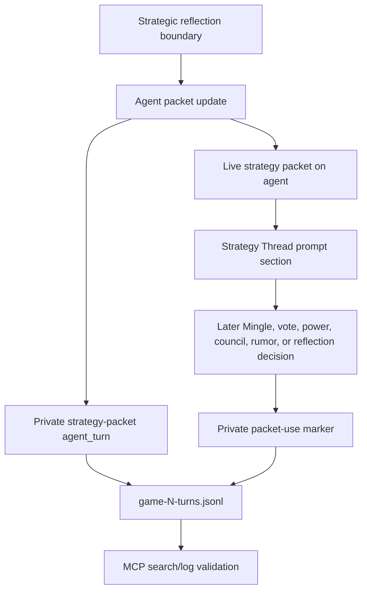
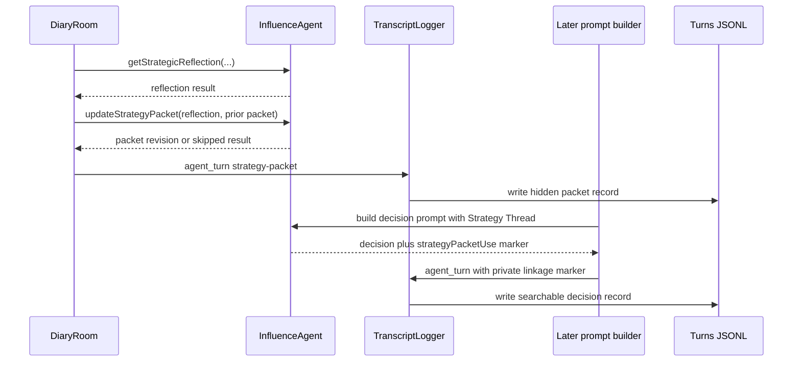

# feat: Add strategy thread carry-forward packets

## Summary

Add a private Strategy Thread / Carry-Forward Packet to each live agent so strategy can persist across rounds inside an uninterrupted game run. The packet is compact prompt context, not a command: it helps agents remember objectives, social probes, uncertainty, and revise triggers while preserving the full spectrum from guarded social play to explicit strategy.

The v1 implementation stores packet state only on the live agent, updates it at strategic-reflection boundaries when that path is enabled, emits hidden producer/debug records through the existing `agent_turn` and turns JSONL observability spine, and adds private validation markers on later decisions so carry-forward can be proven without exposing strategy to players.

---

## Problem Frame

Mingle intent gives agents a useful private purpose for the current private-room phase, and strategic reflection captures hidden assessment after decision phases. The missing layer is continuity: agents can form a strategy in one round, make a social move, then later behave as though that plan was only a one-off prompt artifact.

The product goal is an enjoyable-to-watch social game where agents seem to remember what they were testing, who mattered, what would change their mind, and when they are deliberately pivoting. That requires prompt-visible strategy state, but it should not become a target-naming quota, relationship graph, commitment ledger, or crash-safe memory system in the first slice.

This plan narrows the work to a simulation-first packet that survives while the live runner and live agent instances remain alive. API games remain compatible, but process-reset hydration through `MemoryStore` stays explicitly deferred.

---

## Requirements Trace

**Packet shape and lifecycle**

- R1. Define a typed private strategy packet with current objective, target posture, coalition posture, next social probe, important uncertainty, abandon-or-revise trigger, revision ID, and updated-at context. Covers origin R1, R2, R3, F1, AE1.
- R2. Store the packet on the live agent for the duration of the current uninterrupted game run. Covers origin R4, R19.
- R3. Keep packet content compact, sanitized, and free of raw hidden `thinking` or native `reasoningContext`. Covers origin R2, R13, AE5.
- R4. Remove, suppress, or revise stale packet references when eliminated players or contradicted evidence make the prior plan impossible. Covers origin R5, F4, AE4.

**Prompt behavior**

- R5. Render the packet in future prompts as a distinct private `Strategy Thread` section separate from memory notes, vote history, and strategic reflection. Covers origin R6, F2, F3.
- R6. Phrase packet guidance as revisable context rather than orders the agent must obey. Covers origin R3, R7, F2, AE2.
- R7. Make the packet available to Mingle intent, Mingle room choice, Mingle turns, votes, power decisions, council decisions, rumors, and later reflections when those prompts are built through the agent prompt path. Covers origin R8, R9.

**Packet updates and validation**

- R8. Initialize or refresh packets only at meaningful strategy/reflection boundaries in v1, using the existing strategic-reflection enablement path rather than adding a new always-on model call. Covers origin R10, dependencies, success criteria.
- R9. A packet update records what is being carried forward, what changed, and what would make the agent revise course. Covers origin R11, AE3.
- R10. Packet update failures remain non-fatal, keep the previous packet, and do not emit a misleading successful packet record. Covers origin R12.
- R11. Emit packet creation and update records as private producer/debug `agent_turn` records in structured turn artifacts. Covers origin R14, R15, AE1, AE6.
- R12. Add a private packet-use marker to later private decision records when a packet exists so validation can distinguish followed strategy, revised strategy, and ignored/deferred strategy. Covers origin R16, R17, F5, AE3, AE6.

**Privacy, compatibility, and docs**

- R13. Strategy packets and packet-use markers never become player-visible dialogue, room metadata, public transcript copy, websocket-visible UI state, or canonical board facts. Covers origin R18.
- R14. v1 does not write packet state to `MemoryStore` or hydrate it after process reset. Covers origin R19, R20.
- R15. Simulation, MCP, and docs explain how to validate carry-forward and justified pivots using structured turn logs. Covers origin R14, R15, R16, R20.

---

## Key Technical Decisions

- **Live-agent memory only for v1:** Add packet state beside the agent's existing private memory fields, but do not persist or hydrate it through `MemoryStore`. This keeps the first slice honest about the current statefulness risk.
- **Use `agent_turn`, not canonical events:** Strategy packets are hidden producer/debug evidence, not accepted board facts. They should flow through `TranscriptLogger.emitAgentTurn`, turns JSONL, chatty output, and MCP log search.
- **Update via strategic-reflection enablement:** Packet generation should ride the existing `enableStrategicReflections` and `--strategic-reflections` validation path. Fast simulator defaults stay fast, while explicit validation runs get packet records.
- **Prompt as context, not control:** The packet should help agents remember their current strategic posture without forcing named targets, overt game talk, or a concrete strategic act every turn.
- **Validate with linkage markers, not quotas:** A private `strategyPacketUse` marker on later decision records proves whether the agent followed, revised, ignored, or deferred the carried packet. It should not score the agent or punish pivots.
- **Sanitize before carry-forward:** Raw hidden thinking and native reasoning context remain artifact metadata only. The packet summary itself is a compact, safe strategy state that can be reinserted into future private prompts.
- **Stale-player handling is prompt-safety critical:** If a packet references eliminated players, later prompts should not keep injecting impossible plans. v1 should suppress or scrub stale names immediately and let the next update produce a revised packet.

---

## Alternative Approaches Considered

- **Persist packet state through `MemoryStore` immediately:** Deferred because API crash-safe resume is a larger statefulness problem. Writing packet data without a tested hydration contract would make the feature sound more durable than it is.
- **Update after every agent action:** Rejected for v1 because it adds model cost, creates noisy strategy churn, and can make agents over-optimize every utterance. Reflection boundaries are a better first cadence.
- **Require explicit target naming or a strategic act:** Rejected because the desired behavior is a spectrum. Guarded probes, social trust-building, and intentional deferral can be strategic.
- **Infer carry-forward only by reading transcripts:** Rejected because it makes validation too subjective. Private packet-use markers give reviewers a structured trail while keeping player-visible dialogue natural.
- **Store packets as canonical events:** Rejected because packets are private agent state, not board facts that replay should use to rebuild the game.

---

## High-Level Technical Design

The packet update path starts after successful strategy assessment when reflection capture is enabled. The agent receives current game state, recent memory, any reflection output, and its previous packet. It returns a sanitized packet summary with a revision ID and revision rationale. The engine stores that packet on the live agent and emits a hidden `strategy-packet` turn record.

Later decision prompts render the current packet under a dedicated private section. The prompt text says the agent may follow, test, revise, or abandon the packet when current evidence warrants it. Private decision records include a small marker describing how the current packet was used, giving reviewers a traceable link between strategy state and later behavior.

---

## Implementation Units

### U1. Define packet contracts and live agent state

- **Goal:** Add typed strategy packet shapes and store the active packet on each live agent.
- **Requirements:** R1, R2, R3, R14.
- **Dependencies:** None.
- **Files:**
  - `packages/engine/src/game-runner.types.ts`
  - `packages/engine/src/types.ts`
  - `packages/engine/src/agent.ts`
  - `packages/engine/src/__tests__/agent-structured-output.test.ts`
  - `packages/engine/src/__tests__/mock-agent.ts`
- **Approach:** Define `StrategyPacket`, `StrategyPacketUpdateAction`, and a compact `StrategyPacketSummary` or equivalent shared type. Extend the agent interface with packet access/update support without requiring non-engine callers to know about model internals. Add live packet state beside existing private agent memory fields such as `lastReflection`.
- **Execution notes:**
  - Keep packet fields optional enough for exploratory play. `targetPosture` may explicitly say there is no named target yet.
  - Store revision metadata separately from raw hidden reasoning.
  - Do not add `MemoryStore.save` or `MemoryStore.recall` wiring in this unit.
- **Test scenarios:**
  - Given a packet update includes objective, uncertainty, social probe, and revise trigger, the normalized packet stores those fields compactly.
  - Given the update has no named target, the packet remains valid and records exploratory posture.
  - Given hidden thinking or native reasoning context is returned by the model, the packet summary excludes it while the surrounding debug record can still preserve it.
  - Given a new mock agent is used in phase tests, it compiles with a deterministic empty or preset packet.
- **Verification:** Packet types export cleanly from the engine boundary, and the live agent can hold a packet without changing API memory persistence.

### U2. Add packet updates at strategic-reflection boundaries

- **Goal:** Refresh strategy packets when strategic reflection is enabled and emit private update records.
- **Requirements:** R8, R9, R10, R11, R13.
- **Dependencies:** U1.
- **Files:**
  - `packages/engine/src/agent.ts`
  - `packages/engine/src/diary-room.ts`
  - `packages/engine/src/transcript-logger.ts`
  - `packages/engine/src/game-runner.types.ts`
  - `packages/engine/src/__tests__/stream-listener.test.ts`
  - `packages/engine/src/__tests__/game-engine.test.ts`
- **Approach:** After `getStrategicReflection` succeeds, call a packet-update method with the current game state, reflection result, prior packet, and recent context. If the update succeeds, store the packet on the agent and emit a private `agent_turn` record named `strategy-packet`. If the update fails, keep the prior packet, continue the phase, and emit no successful packet record.
- **Execution notes:**
  - Respect the existing `enableStrategicReflections === false` guard. No reflection call means no packet update in v1.
  - The packet update call should be treated as hidden producer/debug work, not player-visible speech.
  - Include enough event metadata to tie the packet to round, phase, agent, prior revision, and new revision.
- **Test scenarios:**
  - Given strategic reflections are enabled, each alive agent that produces a reflection can emit a `strategy-packet` private turn record.
  - Given reflections are disabled, no packet update call or packet record occurs.
  - Given one agent's packet update fails, the game continues, other agents still update, and the failed agent keeps its previous packet.
  - Given a packet record is emitted, it is absent from player-visible transcript and websocket-visible public events.
- **Verification:** A local simulation with strategic reflections enabled writes packet records to turns JSONL, and fast default configs do not gain extra packet calls.

### U3. Render packet context in future prompts and scrub stale refs

- **Goal:** Make later decision prompts see the packet as private, revisable strategy context while preventing stale eliminated-player plans from leaking forward.
- **Requirements:** R4, R5, R6, R7, R13.
- **Dependencies:** U1, U2.
- **Files:**
  - `packages/engine/src/agent.ts`
  - `packages/engine/src/phases/mingle.ts`
  - `packages/engine/src/__tests__/agent-structured-output.test.ts`
  - `packages/engine/src/__tests__/game-engine.test.ts`
- **Approach:** Add a `Strategy Thread` section in the shared private prompt builder when a packet exists. Phrase it as current strategic context the agent may follow, test, revise, or abandon. Before rendering, sanitize the packet against current player status so eliminated-player references are suppressed or marked stale; the next packet update can then produce the full revision.
- **Execution notes:**
  - Keep the section short and below game state priority.
  - Do not merge packet text into long-term memory notes or vote history.
  - Use the same prompt path for Mingle intent, room choice, Mingle turns, vote, power, council, rumor, and reflection prompts where those calls already use shared agent context.
- **Test scenarios:**
  - Given an active packet, the Mingle intent prompt includes a separate `Strategy Thread` section.
  - Given an active packet, vote or power prompts include the same context without duplicating it in memory notes.
  - Given a packet references an eliminated player, the next prompt does not inject that player as an active target.
  - Given no packet exists, prompts do not render an empty strategy section.
  - Given the packet contains exploratory posture, prompt text does not demand a named target.
- **Verification:** Prompt snapshots show continuity context without forcing overt strategy or impossible plans.

### U4. Add private packet-use markers to later decisions

- **Goal:** Make validation able to tell whether later choices used, revised, ignored, or deferred the carried packet.
- **Requirements:** R7, R12, R13, R15.
- **Dependencies:** U1, U3.
- **Files:**
  - `packages/engine/src/game-runner.types.ts`
  - `packages/engine/src/agent.ts`
  - `packages/engine/src/phases/mingle.ts`
  - `packages/engine/src/phases/vote.ts`
  - `packages/engine/src/phases/power.ts`
  - `packages/engine/src/phases/council.ts`
  - `packages/engine/src/phases/rumor.ts`
  - `packages/engine/src/diary-room.ts`
  - `packages/engine/src/__tests__/agent-structured-output.test.ts`
  - `packages/engine/src/__tests__/stream-listener.test.ts`
  - `packages/engine/src/__tests__/game-engine.test.ts`
- **Approach:** Add an optional private marker to decision action records where packet context was present. A minimal v1 shape can include `strategyPacketRevision` and `strategyPacketUse`, with values such as `followed`, `revised`, `ignored`, `deferred`, or `not_applicable`, plus a compact rationale when useful. Emit the marker only in private producer/debug turn records, not in player-visible speech or canonical board state.
- **Execution notes:**
  - Start with decisions that already emit private `agent_turn` records so the marker rides existing observability.
  - The marker is evidence for review, not a scoring system.
  - If implementation breadth becomes too high, prioritize Mingle intent, Mingle turn, vote, power, council, and strategic reflection records before lower-frequency surfaces.
- **Test scenarios:**
  - Given a packet exists during a later Mingle turn, the private `mingle-turn` record includes the packet revision and a packet-use classification.
  - Given a vote pivots away from the packet because new evidence contradicts it, the private vote record can mark `revised` instead of appearing as amnesia.
  - Given no packet exists, private records omit packet-use markers.
  - Given a player-visible transcript entry is generated from the same decision, it does not include the packet marker or rationale.
- **Verification:** MCP searches over turns JSONL can link at least one packet revision to a later decision record and tell whether the decision followed or pivoted.

### U5. Update simulation, MCP validation, and docs

- **Goal:** Make the feature reviewable through the existing local simulation plus influence-game MCP workflow.
- **Requirements:** R11, R12, R13, R15.
- **Dependencies:** U2, U3, U4.
- **Files:**
  - `packages/engine/src/simulate.ts`
  - `packages/engine/src/game-mcp/read-model.ts`
  - `packages/engine/src/__tests__/simulate-config.test.ts`
  - `packages/engine/src/__tests__/game-mcp.test.ts`
  - `packages/api/src/__tests__/websocket.test.ts`
  - `docs/reasoning-transcript-observability.md`
  - `docs/local-model-evaluation.md`
  - `README.md`
  - `DEVELOPMENT.md`
  - `CONCEPTS.md`
- **Approach:** Keep the existing serialized `agent_turn` artifacts as the source of truth for packet validation. Add tests or fixtures showing that `strategy-packet` records and packet-use markers are searchable by the MCP read model. Update simulator JSDoc and docs to show the explicit strategic-reflection validation path, expected record names, and example review questions.
- **Execution notes:**
  - Add a new MCP tool only if generic log search cannot answer the validation questions.
  - Document that packet validation requires strategic reflections to be enabled in v1.
  - Preserve the websocket privacy boundary with an API test if the event type crosses service code.
- **Test scenarios:**
  - Given a turns JSONL fixture contains `strategy-packet`, MCP search can find it with agent, round, phase, and revision metadata.
  - Given a later decision fixture contains `strategyPacketUse`, MCP search can connect it to the packet revision.
  - Given API websocket event filtering sees private `agent_turn` records, packet content and packet-use markers are not broadcast to clients.
  - Given docs mention strategy packet validation, they also state that resume-safe hydration, commitment ledgers, relationship graphs, and scoring dashboards are deferred.
- **Verification:** `bun run test` passes, `bun run check` passes before merge, and a fresh local simulation with strategic reflections enabled yields at least one inspectable carry-forward or justified-pivot example.

---

## Acceptance Matrix

- **AE1 - Packet creation:** After an enabled strategic-reflection boundary, structured turns include a private `strategy-packet` record with compact objective, uncertainty, social probe, revise trigger, and revision metadata.
- **AE2 - Spectrum of play:** A later Mingle prompt can use the packet to continue, test, or abandon a plan without requiring a named target or overt strategy talk.
- **AE3 - Justified pivot:** A later vote, power, council, or Mingle decision can mark the packet as revised when new evidence invalidates it.
- **AE4 - Stale player scrub:** If a packet references an eliminated player, later prompts do not present that eliminated player as an active target.
- **AE5 - Privacy:** Player-visible transcript and websocket output never include packet content, packet-use markers, hidden thinking, or reasoning context.
- **AE6 - MCP validation:** A maintainer can search structured turn artifacts through the game MCP and find a packet revision plus at least one later followed, revised, ignored, or deferred decision marker.

---

## System-Wide Impact

- **Engine:** Adds new private agent state, structured packet action types, packet update orchestration, prompt rendering, and private turn metadata.
- **Simulation artifacts:** Extends turns JSONL with `strategy-packet` records and optional packet-use metadata on later private decision records.
- **MCP read model:** Should continue to rely on generic log search unless fixtures prove a dedicated helper is needed.
- **API:** Runtime-compatible when the live runner remains uninterrupted. No resume-safety claim changes. Websocket filtering should remain explicit for packet privacy.
- **Docs:** Updates the observability, local model evaluation, simulator, README, and development docs because the agent decision surface and artifact shape change.

---

## Risks and Mitigations

- **Agents over-obey stale strategy:** Mitigate with prompt wording that frames the packet as revisable and with stale-player scrub before prompt rendering.
- **Validation marker becomes a hidden quota:** Mitigate by documenting marker values as descriptive evidence, not quality scoring.
- **Prompt bloat crowds out current context:** Mitigate by keeping packet summaries compact and using a single dedicated section.
- **Extra model calls slow default simulations:** Mitigate by gating packet updates behind strategic-reflection enablement in v1.
- **Private state leaks to UI or transcript:** Mitigate with tests around transcript entries, websocket event filtering, and MCP/public read paths.
- **Local model timeouts during validation:** Mitigate by keeping validation examples small and reporting timeout behavior separately from feature correctness.
- **Resume expectations drift:** Mitigate by keeping docs explicit that live-agent packet state is not hydrated after API process reset in v1.

---

## Validation Plan

- Run targeted unit tests while implementing each unit:
  - `bun test packages/engine/src/__tests__/agent-structured-output.test.ts`
  - `bun test packages/engine/src/__tests__/stream-listener.test.ts`
  - `bun test packages/engine/src/__tests__/game-engine.test.ts`
  - `bun test packages/engine/src/__tests__/game-mcp.test.ts`
  - `bun test packages/api/src/__tests__/websocket.test.ts`
- Run the repo baseline before handoff:
  - `bun run test`
  - `bun run check`
- Run at least one fresh local simulation with strategic reflections enabled and inspect:
  - a `strategy-packet` record,
  - a later private decision with `strategyPacketUse`,
  - no packet content in player-visible transcript output,
  - MCP search results that link the two records.

---

## Scope Boundaries

In scope:

- Private packet state on live agent instances.
- Prompt rendering as revisable private strategy context.
- Packet update records and packet-use markers in hidden producer/debug artifacts.
- Simulation and MCP validation of carry-forward or justified pivots.
- Docs and glossary updates for the Strategy Thread / Carry-Forward Packet concept.

Deferred:

- Persisting or hydrating packets through `MemoryStore` after API process reset.
- Commitment ledgers, social-debt models, relationship graphs, or alliance scoring.
- Aggregate dashboards or batch scoring for strategy quality.
- End-of-Mingle debrief extraction beyond strategic reflection and packet updates.
- Preference-matched room allocation or broader Mingle room-formation redesign.

Out of scope:

- Mandatory target naming.
- Hard requirements that every turn perform a concrete strategic act.
- Player-visible display of packet state, hidden thinking, native reasoning context, or packet-use markers.
- Treating private strategy packets as canonical board events.

---

## Sources and Research

- Origin requirements: `docs/brainstorms/2026-06-12-strategy-thread-carry-forward-packet-requirements.md`
- Related ideation: `docs/ideation/2026-06-12-multi-round-strategy-propagation-ideation.html`
- Prior observability plan: `docs/plans/2026-06-12-001-feat-mingle-strategy-observability-plan.md`
- Statefulness boundary: `docs/statefulness-plan.md`
- Current agent implementation: `packages/engine/src/agent.ts`
- Agent and turn contracts: `packages/engine/src/game-runner.types.ts`
- Strategic reflection orchestration: `packages/engine/src/diary-room.ts`
- Mingle orchestration: `packages/engine/src/phases/mingle.ts`
- Turn artifact writer: `packages/engine/src/simulate.ts`
- MCP read model: `packages/engine/src/game-mcp/read-model.ts`
- API lifecycle and memory store: `packages/api/src/services/game-lifecycle.ts`, `packages/api/src/db/memory-store.ts`
- Validation docs: `docs/reasoning-transcript-observability.md`, `docs/local-model-evaluation.md`, `DEVELOPMENT.md`, `README.md`
