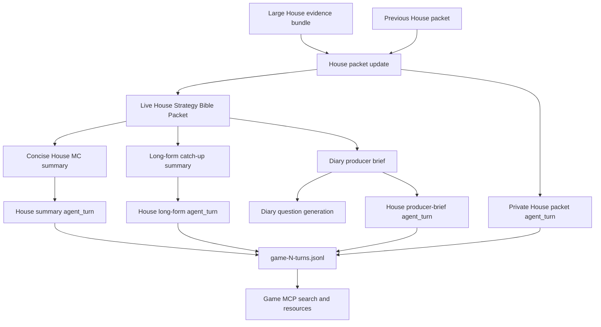
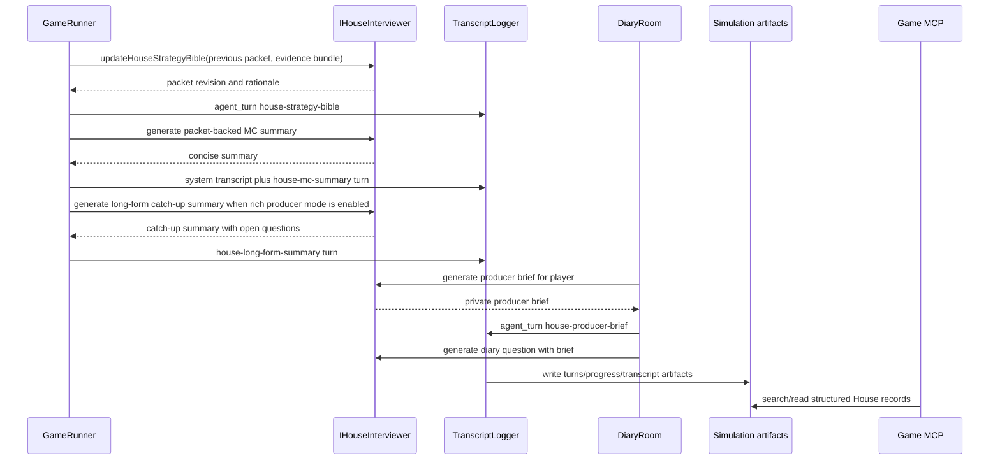

# feat: Add House Strategy Bible Packet

## Summary

Add a private House Strategy Bible Packet that The House carries across a live game run. The packet is producer/debug state: it tracks alliance hypotheses, tensions, vote blocs, promises, Mingle discoveries, player trajectories, story arcs, dropped threads, and open questions. It then drives round-interstitial House MC summaries, long-form gameplay catch-up summaries, and diary-room producer briefs from one shared strategic read.

The first implementation extends the existing private `agent_turn` and simulation artifact spine instead of inventing a separate House memory store. Packet updates, summaries, and producer briefs become structured House-authored artifacts that are searchable through the local game MCP, while player agents, canonical game state, and public player speech remain insulated from hidden House analysis.

---

## Problem Frame

The current House voice can summarize recent play, but its memory surface is shallow. `GameRunner` calls the House after Mingle and Council with recent transcript slices; diary questions are generated from compact per-player context. That makes the House sound like a narrator with a short attention span: it can react to the last few beats, but it has no structured way to carry forward named alliances, unresolved promises, contradictions, or producer questions.

Agent Strategy Thread packets solve a parallel problem for individual player agents. The House needs its own producer-level continuity, but the truth tier is different. House reads should be dramatic, evidence-backed, and revisable; they are not canonical facts, and they should not become player-agent prompt context.

This plan focuses on a simulation-first slice: live-run House carry-forward, richer House narration, diary-room prep, and MCP validation. Crash-safe packet hydration, relationship dashboards, public reveal mechanics, and cross-game analytics stay out of this slice.

---

## Requirements Trace

**House packet lifecycle and content**

- R1. Maintain one private House Strategy Bible Packet for the live game run. Covers origin R1, R2, F1, AE1.
- R2. Carry prior packet state into each House update instead of rebuilding only from a recent transcript tail. Covers origin R2, R5, F1, F4, AE1, AE2.
- R3. Track named alliance hypotheses, confidence/evidence, tensions, promises, vote blocs, Mingle discoveries, player trajectories, story arcs, dropped threads, and open uncertainties. Covers origin R3, R4, R5, AE1, AE2.
- R4. Treat failed packet updates as non-fatal and do not emit a successful packet artifact when an update fails. Covers origin R6.

**House summaries and catch-up**

- R5. Generate at least one concise House MC summary between every completed round from current packet context plus current game evidence, not only transcript slices. Covers origin R7, R8, R9, F2, AE3.
- R6. Persist House MC summary artifacts independently of `--chatty`; chatty only controls live console echo. Covers origin R9, AE3.
- R7. In rich producer runs, emit long-form gameplay catch-up summaries for the interval since the previous packet update. Covers origin R10, R11, R12, R20, R22, AE4.
- R8. Long-form summaries include teams forming or weakening, leverage shifts, unresolved promises, pressure points, and House open questions when evidence supports them. Covers origin R11, R12, AE4.

**Diary-room producer intelligence**

- R9. Before a diary question, derive a private producer brief for the player from the current packet and current game context. Covers origin R14, R15, F3, AE5.
- R10. Use producer briefs to sharpen diary questions without revealing hidden House analysis or private producer evidence as player knowledge. Covers origin R16, R17, R18, AE5.
- R11. Add an explicit simulator path for optional diary sessions so rich producer validation can exercise diary briefs without making every fast sim pay the cost. Covers origin R14, R18, R24.

**Observability, MCP, and validation**

- R12. Emit packet updates, concise MC summaries, long-form summaries, and diary producer briefs as structured House-authored producer/debug artifacts. Covers origin R19, R20, AE3, AE4, AE5.
- R13. Make those records searchable through the local game MCP by action/type, packet revision, named alliance, player, round, and phase where available. Covers origin R21, R22, R23, AE6.
- R14. Record House token usage and action usage for packet, summary, and brief calls so rich producer cost is visible in simulation output. Covers origin R25.
- R15. Update simulator JSDoc, local-model docs, observability docs, README, DEVELOPMENT, and glossary entries for the new House artifacts and validation workflow. Covers origin R24.

**Privacy and truth tiers**

- R16. Do not pass the House packet to player-agent prompts. Covers origin R26, AE7.
- R17. Do not write House packet content into canonical game events or projection state. Covers origin R27, AE7.
- R18. Keep public player speech, Mingle messages, and player-visible game state free of hidden House packet content unless a safe subset is intentionally transformed into audience narration. Covers origin R13, R28, R29, AE7.

---

## Key Technical Decisions

- **House artifacts ride `agent_turn`:** Use the existing private producer/debug stream event and turns JSONL path for House packet updates, summary records, and producer briefs. These are not canonical events.
- **Live-run packet state only:** Store the active House packet on the live `GameRunner`/House orchestration path for this slice. Do not claim crash-safe resume until the broader statefulness work exists.
- **Structured packet, prose outputs:** The packet is typed and revisioned; MC summaries, long-form summaries, and diary questions are prose generated from it.
- **Large producer context is allowed:** The House evidence bundle should favor enough context to make good reads. Cost control comes from explicit rich producer config, not aggressive prompt trimming.
- **Rich producer mode is opt-in:** Fast simulator defaults remain bounded. Rich producer mode enables House packet updates, long-form summaries, and diary validation surfaces in one discoverable preset.
- **Generic MCP first:** Make the new records first-class through clean action names, structured fields, resources, and tests over existing log search. Add a new MCP tool only if the implementation proves generic search cannot make House artifacts discoverable.
- **Hypotheses are fallible:** Alliance names and story arcs carry confidence/evidence and can be lowered, fractured, retired, or revised. They are House reads, not game facts.
- **Diary is producer-prepped, not House-spoiled:** Producer briefs can needle a player using current story pressure, but the visible question should not disclose hidden packet internals or private reasoning.

---

## Alternative Approaches Considered

- **Make House packet state canonical:** Rejected because House reads are producer hypotheses, not accepted board facts. Canonical events should remain replayable game truth.
- **Share House packet with player agents:** Rejected because it would collapse producer knowledge into player knowledge and override the agent-side Strategy Thread work.
- **Only improve the House summary prompt:** Rejected because recent transcript prompts cannot guarantee carry-forward, revision, or MCP validation across rounds.
- **Always run rich House calls in every sim:** Rejected because the feature is deliberately expensive and analysis-oriented. Fast validation should stay fast.
- **Build a bespoke House MCP tool first:** Deferred until generic structured log search proves insufficient. The existing read-only MCP already scans turns, progress, transcript, events, and game JSON.
- **Persist packet state through API memory immediately:** Deferred because active game resume is a broader operational risk, and a partial persistence story would overstate durability.

---

## High-Level Technical Design

The runner owns the current House packet. At configured House summary boundaries, it builds a producer-only evidence bundle from current game state, public transcript, room allocations, Mingle intent/assignment records, strategic-reflection records, vote/power/council outcomes, diary answers, and prior House packet state. The House updates the packet and returns structured revision metadata plus optional hidden thinking/reasoning context for debug artifacts.

Concise House MC summaries and long-form catch-up summaries then use the latest packet as strategic context. The concise summary is the watchable interstitial narration emitted between completed rounds; additional phase-level summaries can remain where useful, but they do not replace the between-round summary requirement. The long-form summary is the richer producer/audience catch-up for local validation runs.

Diary interviews gain an extra private step: before the House asks a player a question, it derives a producer brief for that player from the packet and current evidence. The question generator receives that brief, but the player receives only the final question.

---

## Implementation Units

### U1. Define House packet and artifact contracts

- **Goal:** Add typed contracts for House packet state, revision metadata, alliance hypotheses, summary records, and producer briefs.
- **Requirements:** R1, R2, R3, R12, R16, R17, R18.
- **Dependencies:** None.
- **Files:**
  - `packages/engine/src/game-runner.types.ts`
  - `packages/engine/src/types.ts`
  - `packages/engine/src/house-interviewer.ts`
  - `packages/engine/src/__tests__/mock-agent.ts`
- **Approach:** Define packet and artifact types beside existing engine turn contracts. Add House-authored action names for `house-strategy-bible`, `house-mc-summary`, `house-long-form-summary`, and `house-producer-brief`. Packet records include revision ID, previous revision ID, covered round/phase window, alliance hypotheses, story arcs, dropped threads, open questions, and confidence/evidence fields. Summary and brief records link back to packet revision when one exists.
- **Execution notes:**
  - Keep raw `thinking` and native `reasoningContext` as artifact metadata only, not packet fields.
  - Model the packet as producer/debug state, not as `GameConfig`, canonical payload, or player prompt context.
  - Keep `TemplateHouseInterviewer` deterministic so tests and no-LLM runs still work.
- **Test scenarios:**
  - Given a packet revision, its typed structure can represent a speculative alliance, a retired/fractured alliance, and an open question.
  - Given a House summary record, it links to a packet revision without carrying raw hidden reasoning.
  - Given a producer brief, it names player-specific pressure points while remaining private producer/debug data.
- **Verification:** Engine type exports compile without widening hidden House artifacts into public transcript or canonical event contracts.

### U2. Extend the House interviewer API and prompts

- **Goal:** Add House calls for packet update, packet-backed summaries, long-form catch-up, and diary producer briefs.
- **Requirements:** R1, R2, R3, R4, R5, R7, R8, R9, R10, R14.
- **Dependencies:** U1.
- **Files:**
  - `packages/engine/src/house-interviewer.ts`
  - `packages/engine/src/token-tracker.ts`
  - `packages/engine/src/__tests__/agent-structured-output.test.ts`
  - `packages/engine/src/__tests__/game-engine.test.ts`
- **Approach:** Extend `IHouseInterviewer` with explicit methods for updating the packet, generating packet-backed concise summaries, generating long-form catch-up summaries, and generating per-player producer briefs. `LLMHouseInterviewer` prompts should ask The House to identify named alliance hypotheses, confidence, evidence, contradictions, story arcs, and open questions. `TemplateHouseInterviewer` should return deterministic fallback packets, summaries, and briefs.
- **Execution notes:**
  - Keep direct House method calls; avoid optional dynamic method guards and `as any`.
  - Record token usage under distinct House sources so simulation cost tables can separate packet, summary, long-form, and brief calls.
  - Packet prompts may consume large context. Do not over-optimize context size in this slice.
  - Summary prompts should remind The House that hypotheses are producer reads and that hidden evidence should not be exposed as player knowledge.
- **Test scenarios:**
  - Given valid structured House output, the parser normalizes a packet revision with named alliances, evidence, confidence, and open questions.
  - Given malformed or empty LLM output, the packet update fails non-fatally and no successful packet record is emitted.
  - Given `TemplateHouseInterviewer`, packet-backed summary and producer brief calls return stable deterministic results.
  - Given token tracking is attached, each new House call records under a distinct source.
- **Verification:** Structured-output tests cover successful, fallback, and malformed House responses without introducing untyped casts.

### U3. Add live House packet orchestration in the runner

- **Goal:** Store and update the live House Strategy Bible Packet at producer summary boundaries.
- **Requirements:** R1, R2, R3, R4, R5, R6, R7, R12, R14, R16, R17, R18.
- **Dependencies:** U1, U2.
- **Files:**
  - `packages/engine/src/game-runner.ts`
  - `packages/engine/src/context-builder.ts`
  - `packages/engine/src/transcript-logger.ts`
  - `packages/engine/src/phases/phase-runner-context.ts`
  - `packages/engine/src/__tests__/stream-listener.test.ts`
  - `packages/engine/src/__tests__/game-engine.test.ts`
- **Approach:** Add a live packet field to the runner and a House evidence builder that can gather current state, transcript slices, room diagnostics, private producer/debug turn records already emitted in the stream, vote/power/council outcomes, diary answers, and previous packet state. At configured boundaries, ask The House for a packet update, store the successful revision, and emit a private House `agent_turn` record. Existing Mingle/Council House MC calls should become packet-backed summary calls and emit structured summary records in addition to safe transcript system text.
- **Execution notes:**
  - Packet update failures should preserve the previous packet and continue the game.
  - Summary failures should remain non-fatal, matching the current House MC posture.
  - Packet records should not be written as canonical events or injected into player-agent contexts.
  - If no packet exists yet, summaries can fall back to current evidence and note that no revision was available.
- **Test scenarios:**
  - Given a completed round boundary, the runner emits a `house-strategy-bible` private turn and stores the packet revision.
  - Given a later summary boundary, the summary record references the current packet revision.
  - Given packet update failure, the runner continues and later summaries either use the previous packet or mark no packet revision.
  - Given a public transcript is inspected, hidden packet content is absent while safe House MC text remains present.
  - Given canonical events are replayed, House packet state is not part of the projection.
- **Verification:** Stream listener tests see House-authored private turn records, while canonical replay tests stay unchanged.

### U4. Add packet-backed concise and long-form House summaries

- **Goal:** Make House summaries continuous between rounds, persisted, and useful for review even without live chatty output.
- **Requirements:** R5, R6, R7, R8, R12, R13, R14, R15, R18.
- **Dependencies:** U1, U2, U3.
- **Files:**
  - `packages/engine/src/game-runner.ts`
  - `packages/engine/src/transcript-logger.ts`
  - `packages/engine/src/simulation-instrumentation.ts`
  - `packages/engine/src/simulate.ts`
  - `packages/engine/src/__tests__/stream-listener.test.ts`
  - `packages/engine/src/__tests__/simulation-instrumentation.test.ts`
- **Approach:** Replace the current recent-transcript-only House MC calls with packet-aware summary calls. Emit a concise round-interstitial summary after each completed round before the next round begins; phase-level summaries may remain as extra watchable beats, but they are secondary. Emit long-form catch-up summaries in rich producer mode for the covered interval since the previous packet revision. Both summary types should write structured House turn records; concise MC text can also continue to appear as safe `House` system transcript entries.
- **Execution notes:**
  - `--chatty` should only decide whether transcript entries print live to the terminal.
  - Long-form summaries should pose House open questions explicitly and name current alliances or fractures only when the packet evidence supports them.
  - Summary records should include enough linkage for MCP search: packet revision, covered window, referenced alliance names, and text.
- **Test scenarios:**
  - Given a normal round completes, exactly one round-interstitial House MC summary record is emitted for that completed round.
  - Given chatty is false, persisted artifacts still contain a House MC summary record.
  - Given rich producer mode is enabled, a long-form summary record is emitted and includes open questions.
  - Given rich producer mode is disabled, fast simulations do not make long-form summary calls.
  - Given a named alliance appears in a packet and later summary, MCP/searchable record text can find both.
- **Verification:** A non-chatty simulation artifact contains summary records; a rich producer artifact contains both concise and long-form House records.

### U5. Add diary producer briefs and optional diary simulation controls

- **Goal:** Let diary questions use House producer intelligence while keeping briefs private and simulations configurable.
- **Requirements:** R9, R10, R11, R12, R13, R15, R16, R18.
- **Dependencies:** U1, U2, U3.
- **Files:**
  - `packages/engine/src/diary-room.ts`
  - `packages/engine/src/game-runner.ts`
  - `packages/engine/src/house-interviewer.ts`
  - `packages/engine/src/types.ts`
  - `packages/engine/src/simulate.ts`
  - `packages/engine/src/__tests__/stream-listener.test.ts`
  - `packages/engine/src/__tests__/simulate-config.test.ts`
  - `packages/engine/src/__tests__/game-engine.test.ts`
- **Approach:** Before `generateQuestion`, ask The House for a private producer brief when House packet support is enabled and diary rooms are running. Pass the brief into question generation as producer context. Emit a private `house-producer-brief` turn record. Add simulator controls that make diary sessions discoverable: a rich producer preset should enable a bounded diary schedule, and a diary-specific flag should allow diary validation without all rich producer extras.
- **Execution notes:**
  - The current runner only calls diary rooms at a small number of phase boundaries. This unit should add explicit, config-controlled diary checkpoints for simulation validation rather than relying on the existing disabled simulator config.
  - Producer briefs are private artifacts. Diary questions are player-facing prompts and must be safe on their own.
  - A no-packet run can still ask diary questions with the existing context.
  - Keep follow-ups bounded by existing `maxDiaryFollowUps`.
- **Test scenarios:**
  - Given diary mode and House packet mode are enabled, a diary interview emits a `house-producer-brief` record before the diary question.
  - Given the producer brief references hidden House analysis, the final question does not quote or dump the hidden packet.
  - Given diary mode is disabled, no diary question or producer brief call occurs in fast simulations.
  - Given diary mode is enabled without House packet mode, diary questions continue to work through existing context.
  - Given rich producer mode is parsed, simulation config enables the selected diary schedule and bounded follow-ups.
- **Verification:** A rich producer simulation can be inspected for producer brief records and diary answers linked by round/player.

### U6. Add rich producer simulation mode and full House logging

- **Goal:** Make rich House validation easy to run and easy to compare against fast simulations.
- **Requirements:** R6, R7, R11, R12, R14, R15.
- **Dependencies:** U3, U4, U5.
- **Files:**
  - `packages/engine/src/types.ts`
  - `packages/engine/src/simulate.ts`
  - `packages/engine/src/simulation-instrumentation.ts`
  - `packages/engine/src/__tests__/simulate-config.test.ts`
  - `packages/engine/src/__tests__/simulation-instrumentation.test.ts`
- **Approach:** Add explicit config for House producer features: packet updates, long-form summaries, producer briefs, and diary scheduling. Add CLI flags or a preset such as rich producer mode that enables the full validation stack: House packet, long-form summaries, diary sessions, and strategic reflections. Include House artifact counts and House token usage in simulation metadata or instrumentation.
- **Execution notes:**
  - Preserve the existing fast baseline behavior unless the new mode or flags are provided.
  - Start progress logs with the selected producer mode and House feature toggles.
  - Keep `game-N-turns.jsonl` as the authoritative structured House artifact log.
  - The summary markdown should report House packet, summary, long-form, producer-brief counts, and House action token usage when present.
- **Test scenarios:**
  - Given default simulation args, House rich producer flags are disabled or minimal and diary remains bounded/off.
  - Given rich producer mode args, config enables House packet updates, long-form summaries, diary validation, and strategic reflections.
  - Given a game emits House artifacts, instrumentation counts packet, summary, long-form, and producer-brief records.
  - Given token usage includes new House sources, the action usage summary includes them.
- **Verification:** `parseArgs`, `buildSimulationConfig`, and summary rendering tests describe the new mode without changing unrelated variants.

### U7. Make MCP and read-model validation concrete

- **Goal:** Ensure maintainers can inspect House carry-forward through existing MCP workflows.
- **Requirements:** R12, R13, R15.
- **Dependencies:** U4, U5, U6.
- **Files:**
  - `packages/engine/src/game-mcp/read-model.ts`
  - `packages/engine/src/game-mcp/server.ts`
  - `packages/engine/src/__tests__/game-mcp.test.ts`
- **Approach:** Add fixture coverage showing `search_logs` finds `house-strategy-bible`, named alliance hypotheses, `house-mc-summary`, `house-long-form-summary`, and `house-producer-brief` records from turns JSONL. If generic search cannot return clear enough cited records, add a narrow read-model helper for House artifacts and expose it read-only through the MCP server.
- **Execution notes:**
  - Do not expose mutation tools.
  - Keep producer/debug warning language intact because House artifacts may include hidden reasoning metadata.
  - Prefer improving record shape and docs before adding a new tool.
- **Test scenarios:**
  - Given a turns fixture with two packet revisions, MCP search finds both and their shared alliance hypothesis.
  - Given a later summary or diary brief references a packet revision, MCP search can trace the read across records.
  - Given a completed session is listed, the turns resource remains readable and includes House records.
  - Given a query targets only public/canonical events, House private packet records do not appear as canonical facts.
- **Verification:** MCP tests demonstrate end-to-end discovery using cited source paths and line numbers.

### U8. Update documentation and project vocabulary

- **Goal:** Document how to run, inspect, and reason about House Strategy Bible validation.
- **Requirements:** R15, R16, R17, R18.
- **Dependencies:** U1 through U7.
- **Files:**
  - `CONCEPTS.md`
  - `docs/reasoning-transcript-observability.md`
  - `docs/local-model-evaluation.md`
  - `DEVELOPMENT.md`
  - `README.md`
  - `packages/engine/src/simulate.ts`
- **Approach:** Update docs to explain the House Strategy Bible Packet, House Producer Brief, House Long-Form Summary, rich producer mode, diary controls, and MCP validation queries. The simulator JSDoc should show a rich producer command and explain the expected House records in `game-N-turns.jsonl`.
- **Execution notes:**
  - Be explicit that House packet state is live-run only and not crash-safe.
  - Be explicit that House packet content is not player-agent prompt context.
  - Keep the local-model evaluation workflow centered on simulation artifacts plus MCP search, not terminal transcript parsing.
  - Keep the "no `as any`" and direct-House-call disciplines visible where agent decision surfaces are discussed.
- **Test scenarios:**
  - Docs name the new House record actions and where to search for them.
  - Docs explain that rich producer mode is the right path for validating House carry-forward and diary briefs.
  - Docs preserve the distinction between canonical events, public transcript, and private producer/debug turns.
- **Verification:** Documentation review confirms the runbook can be followed without prior conversation context.

---

## Acceptance Matrix

- **Packet creation:** After a round summary boundary, turns JSONL includes a private `house-strategy-bible` record with packet revision metadata, alliance hypotheses, tensions, story arcs, dropped threads, and open questions.
- **Packet revision:** If later evidence contradicts a House alliance read, a later packet lowers confidence, marks a fracture, or retires the hypothesis with evidence.
- **Persisted MC summary:** A non-chatty simulation still writes a packet-backed `house-mc-summary` record between completed rounds.
- **Long-form catch-up:** A rich producer simulation writes a `house-long-form-summary` record that describes teams forming or weakening, pressure points, unresolved promises, and House open questions.
- **Diary producer brief:** When diary runs with House packet support, a private `house-producer-brief` record appears before the diary question and the visible question stays safe.
- **MCP validation:** A maintainer can search the game MCP for a named alliance and find packet revision, summary, long-form summary, and producer brief records that reference it.
- **Privacy:** Player-agent prompts, canonical events, public player speech, and player-visible state do not receive raw House packet content.
- **Cost visibility:** Simulation output reports House producer action usage and token usage so rich producer runs can be compared to fast runs.

---

## System-Wide Impact

- **Engine:** Adds live House packet state, packet update orchestration, packet-backed summary generation, diary producer briefs, and House-authored private turn records.
- **House interviewer:** Gains new structured producer calls and token accounting for packet, summary, long-form, and brief work.
- **Simulation artifacts:** Extends turns JSONL with House Strategy Bible, House summary, long-form summary, and producer-brief records; progress/summary output gains rich producer metadata.
- **MCP:** Existing read-only search should discover the new records; a small House-specific helper is allowed only if generic search is not adequate.
- **Diary room:** Can run in bounded simulation modes and can use private producer briefs before asking player-visible questions.
- **Docs:** Observability and local-model documentation must describe the rich producer validation path and House truth boundary.
- **API/UI:** No player-visible feature changes are required for this slice. Websocket filtering and canonical projection behavior should remain consistent with private producer/debug event boundaries.

---

## Risks and Mitigations

- **House over-stories weak evidence:** Require confidence/evidence on alliance hypotheses and include open questions rather than forcing every summary to name a team.
- **Samey House narration returns:** Ask the packet to track concrete dynamics, contradictions, and retired threads so summaries have multiple narrative lenses beyond one repeated motif.
- **Prompt bloat and latency:** Gate expensive House calls behind rich producer config and record cost clearly. Do not optimize away useful context in the first validation slice.
- **Packet update failure hides bad state:** Treat failures as non-fatal, keep the previous packet, and avoid emitting successful revision artifacts.
- **Private House reads leak to agents:** Keep House packet state out of `PhaseContext` and agent prompt builders. Add tests around player prompts where feasible.
- **Private House reads leak to canonical state:** Keep records in `agent_turn`/turns JSONL, not canonical events. Canonical replay tests should not change.
- **Diary questions reveal too much:** Briefs are private; visible questions must probe safely using player-known events or carefully framed producer pressure.
- **MCP discovery stays too raw:** Start with structured action names and fields; add a read-only House artifact helper only if search fixtures show generic search is not enough.
- **Resume expectations drift:** Docs must state that House packet state is live-run only until broader checkpoint/resume work lands.

---

## Validation Plan

Run focused tests during implementation:

- `bun test packages/engine/src/__tests__/agent-structured-output.test.ts`
- `bun test packages/engine/src/__tests__/stream-listener.test.ts`
- `bun test packages/engine/src/__tests__/game-engine.test.ts`
- `bun test packages/engine/src/__tests__/simulate-config.test.ts`
- `bun test packages/engine/src/__tests__/simulation-instrumentation.test.ts`
- `bun test packages/engine/src/__tests__/game-mcp.test.ts`

Run repo baselines before handoff:

- `bun run test`
- `bun run check`

Run one fresh local rich producer simulation and inspect it through the game MCP:

- Confirm non-chatty persisted artifacts contain House MC summary records.
- Confirm each completed normal round has a round-interstitial House MC summary record.
- Confirm rich producer mode emits House packet, long-form summary, producer brief, and diary records.
- Search for at least one named alliance and trace it from packet revision to summary or diary brief.
- Confirm canonical event search/projection does not include House packet reads as board facts.
- Confirm token/action usage reports House producer calls.

---

## Scope Boundaries

In scope:

- Live-run House Strategy Bible Packet.
- Packet-backed House MC summaries.
- Long-form House gameplay catch-up summaries for rich producer validation.
- Diary producer briefs and optional diary simulation controls.
- Structured House artifacts in turns JSONL.
- MCP/search validation for House carry-forward.
- Simulation instrumentation and docs for rich producer runs.

Deferred:

- Crash-safe House packet persistence and hydration after process restart.
- Full relationship graph, commitment ledger, alliance scoring, or visual dashboard.
- Public broadcast mechanics for House alliance names.
- Aggregate batch analytics for House packet quality.
- House-to-agent strategy injection or player-facing House reads.

Out of scope:

- Treating House alliance hypotheses as canonical game facts.
- Sharing raw House packet content with player agents.
- Rewriting agent Strategy Thread packets from House analysis.
- Forcing every House summary or diary question to name an alliance when evidence is weak.
- Replacing the read-only game MCP with a mutation-capable producer tool.

---

## Sources and Research

- Origin requirements: `docs/brainstorms/2026-06-13-house-strategy-bible-packet-requirements.md`
- Related ideation: `docs/ideation/2026-06-13-house-mc-strategy-carry-forward-ideation.html`
- Strategy observability pattern: `docs/solutions/architecture-patterns/agent-strategy-observability-spine.md`
- Existing House MC hooks: `packages/engine/src/game-runner.ts`
- House interviewer implementation: `packages/engine/src/house-interviewer.ts`
- Diary orchestration: `packages/engine/src/diary-room.ts`
- Engine contracts and stream events: `packages/engine/src/game-runner.types.ts`
- Game config and Mingle diagnostics types: `packages/engine/src/types.ts`
- Simulation CLI and artifact writers: `packages/engine/src/simulate.ts`
- Simulation instrumentation: `packages/engine/src/simulation-instrumentation.ts`
- MCP read model and server: `packages/engine/src/game-mcp/read-model.ts`, `packages/engine/src/game-mcp/server.ts`
- Validation docs to update: `docs/reasoning-transcript-observability.md`, `docs/local-model-evaluation.md`, `DEVELOPMENT.md`, `README.md`, `CONCEPTS.md`
