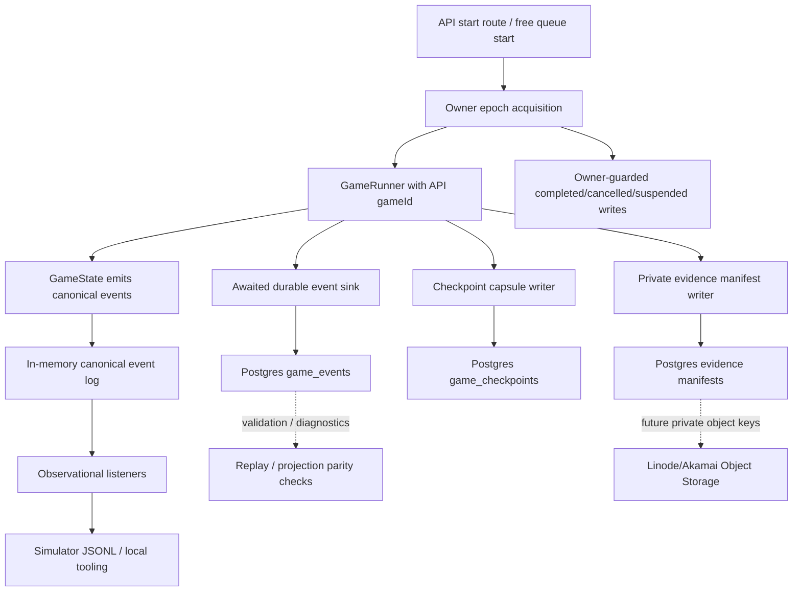
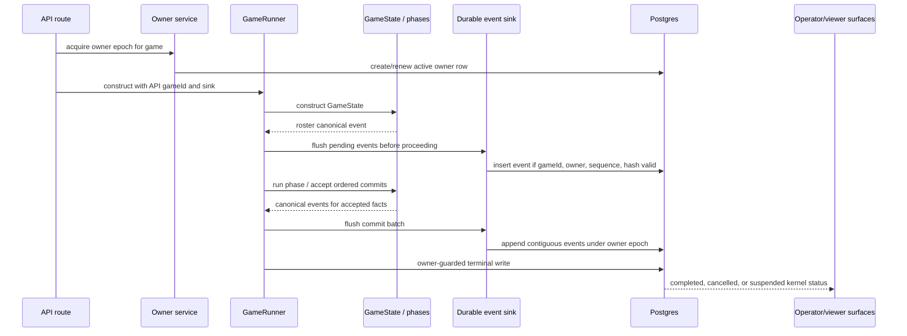
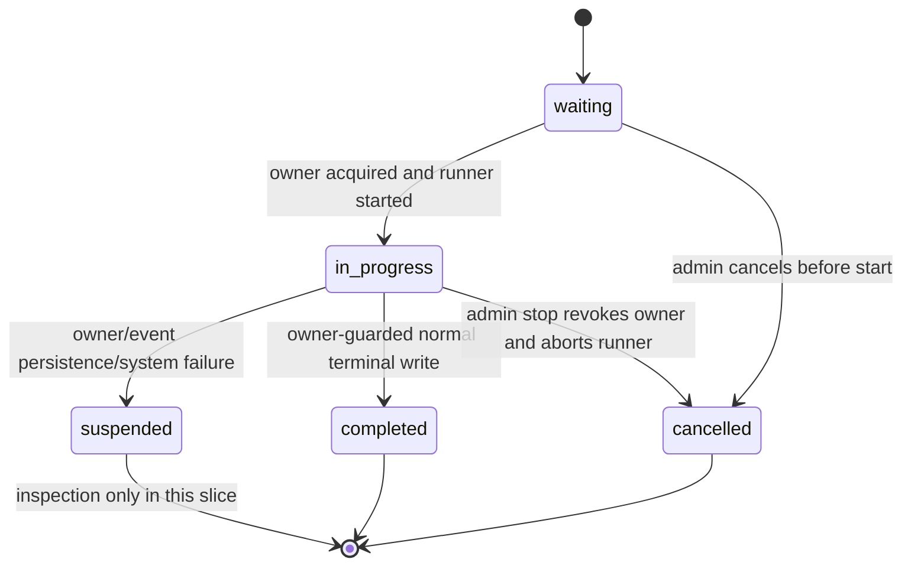

# feat: Add durable game-run kernel

## Summary

Add a durable game-run kernel for API-backed Influence games. API runs should bind the database game ID into the engine before the first canonical event, persist ordered canonical events in Postgres during execution, and allow only one durable owner epoch to commit accepted game mutations or terminal writes.

This is a durability foundation, not crash-safe resume. The first slice adds checkpoint capsules and private evidence manifests so later resume and Linode Object Storage raw logs have a clean place to land, while stopped or orphaned games are marked honestly as suspended/needs inspection instead of cancelled, completed, duplicated, or silently resumed.

CLI simulations remain a separate execution path in this slice, but not a separate event model. They continue to write JSONL through the simulator path, using the same canonical event envelope and replay/projection expectations. The plan leaves schema/provenance room for a future simulation-import path that can load a completed CLI run into Postgres for viewer replay, but it does not implement that import or make CLI simulations depend on the API.

---

## Problem Frame

The engine now has a canonical event spine and simulator JSONL artifacts, but API-backed games still run mostly out of process memory. `startGame()` creates a `GameRunner`, stores it in the process-local `activeGames` map, streams viewer events, and writes transcripts/results only after `runner.run()` returns. Startup cleanup cancels stale `in_progress` games because there is no durable owner, no event stream, no checkpoint boundary, and no supported resume path.

The most important identity seam is early: `GameState` already accepts a `gameId`, but it emits the roster event in its constructor, and `GameRunner` currently constructs `GameState` without the API database ID. A later listener or setter cannot repair the first event. API identity has to be present at runner construction.

The most important durability seam is not the existing canonical listener. `CanonicalEventLog.append()` notifies listeners for observability and catches listener errors. That behavior is correct for simulator logging and local tooling, but it is not authoritative enough for API persistence: a failed async DB write through that listener would not safely stop the game. The API path needs an awaited, fail-closed durability contract whose success is part of accepting a commit boundary.

This plan therefore treats Postgres as the workflow kernel for ordered game events, owner epochs, checkpoints, and evidence manifests. Object storage is reserved for bulky private evidence later, not for ordered domain events or resume truth.

---

## Requirements Trace

**Identity and canonical event order**

- R1. API game execution passes the API database game ID into the engine before `GameState` emits `game.roster_initialized`. Covers origin R1, F1, AE1.
- R2. Canonical events emitted during API execution must carry the API game ID, not a generated engine-only ID. Covers origin R1, R2.
- R3. API persistence rejects events whose `gameId` differs from the owning database game. Covers origin R2, AE1.
- R4. API persistence enforces contiguous per-game event sequence and rejects gaps or conflicting duplicate sequences. Covers origin R3, AE2.
- R5. Simulator JSONL and API persistence consume the same `CanonicalGameEvent` envelope and replay/projection expectations. Covers origin R5, F2.
- R6. CLI simulation import into the API database remains a future-compatible lane, not part of this slice. Carries the confirmed planning clarification.

**Single writer and lifecycle truth**

- R7. A game run has at most one active durable owner epoch that may append canonical events, write checkpoints, or complete/cancel/suspend the run. Covers origin R6, R7, F3, AE3.
- R8. Parallel LLM calls may run inside one owner, but accepted game commits remain sequential and owner-checked. Covers origin R8.
- R9. Stale workers cannot commit returned LLM results after their owner epoch is revoked or expired. Covers origin R7, R9, AE3.
- R10. Admin stop revokes the owner, aborts the active runner, and prevents late completion/result writes. Covers origin R9.
- R11. When the database is reachable, system, owner, or event-persistence failures move the game to `suspended`/needs-inspection rather than `cancelled` or `completed`. Covers origin R9, R18, F4, AE4.
- R12. Startup cleanup marks orphaned `in_progress` API games as suspended when resume is out of scope. Covers origin R9, R18, AE4.

**Checkpoint capsules**

- R13. Checkpoint capsules are keyed to the last persisted canonical event sequence they cover. Covers origin R10.
- R14. Checkpoint capsules distinguish replayable facts from non-replayable runtime context and missing hydration inputs. Covers origin R11, R12, R13.
- R15. The first checkpoint implementation is forensic and boundary-setting; it must not expose or imply `GameRunner.fromCheckpoint()` or crash-safe resume. Covers origin R12, AE4.

**Private evidence manifests**

- R16. Private evidence manifests address raw/debug artifacts such as prompts, model responses, hidden reasoning, normalized agent-turn records, and source pointers without copying them into canonical game state. Covers origin R14, R15, F5, AE5.
- R17. New canonical events, evidence manifests, player-visible WebSocket messages, and kernel status responses do not gain hidden reasoning exposure from this work; existing public REST transcript behavior is named separately and not silently reclassified. Covers origin R16, AE5.
- R18. The profile-picture upload helper's public-read S3 policy is not reused for private raw evidence. Covers origin R17, AE5.
- R19. Checkpoint and evidence auxiliary-write failures are tracked as degraded kernel health unless the failed artifact is required for a specific event or safe boundary; event persistence and owner failure remain suspend-level failures. Covers origin R14, R19.

**Compatibility and operator visibility**

- R20. Existing terminal transcript/result persistence remains compatible with the kernel and is owner-guarded. Covers origin R20.
- R21. API and web surfaces can distinguish waiting, running, completed, cancelled, and suspended/needs-inspection games. Covers origin R18, R19.
- R22. Kernel status metadata tells operators whether a game has durable events, checkpoint capsules, and evidence manifests. Covers origin R19.

---

## Key Technical Decisions

- **API identity is constructor-time:** Add a `GameRunner` option for an external game ID and require the API lifecycle to provide it. The simulator can omit it and keep generating local game IDs.
- **Postgres is the workflow kernel:** Store ordered canonical events, owner epochs, checkpoint capsules, evidence manifests, and kernel health in Postgres. This follows the repo's current DB-backed API deployment and keeps the ordered event stream queryable by game.
- **Object storage is private evidence storage only:** Linode/Akamai Object Storage can later hold large raw prompts, model responses, and reasoning blobs behind private bucket policy/ACLs. It is not the ordered event store and not the source of resume truth.
- **Authoritative persistence is not the canonical listener:** Keep `setCanonicalEventListener()` as an observational consumer for simulator JSONL and tooling. API persistence uses an awaited durable sink/flush path whose failure aborts the current run path and moves the game to suspended when the DB is reachable.
- **Accepted facts publish only after durable flush:** Live WebSocket messages, public snapshots, terminal outputs, and other viewer-facing accepted facts are buffered until the durable append succeeds. If the sink fails, the API publishes only the suspended/error state, not the unflushed accepted fact.
- **Accepted commits are single-writer, even when work is parallel:** The owner may launch multiple LLM calls in parallel, but returned results must re-check owner epoch and sequence before they mutate accepted state or append events.
- **Durable append serializes by game head:** Event append transactions must serialize per game by locking the owner/head row or equivalent, insert event batches all-or-nothing, and advance the recorded event head atomically with the appended rows. Unique constraints are a backstop, not the primary concurrency plan.
- **Event hashes are deterministic over the canonical envelope:** Idempotency depends on a stable canonicalization scope chosen before implementation. Hashes should cover the validated canonical event envelope and payload version after deterministic key ordering, while excluding storage-only metadata such as DB row ID, insertion timestamp, and owner bookkeeping that are not part of the engine event.
- **Durable owner row plus optional database locks:** Use a durable owner/lease row with owner epoch as the source of truth for stale-worker rejection. PostgreSQL advisory locks can be used as a short-lived helper inside acquisition/commit transactions, but not as the only ownership record because the epoch has to be persisted and auditable.
- **Owner loss is not takeover:** If an already-running game loses or expires its owner, this slice suspends the game unless the same live owner renews in time. A new owner may not continue execution from the persisted event head until future resume/hydration work exists.
- **Terminal writes are atomic with event head validation:** Completed/cancelled/suspended transitions, result writes, and owner closure happen in one owner-guarded transaction that verifies the final persisted event head. A runner cannot mark completed if its final canonical events did not persist.
- **Suspended is a first-class lifecycle state:** `cancelled` means intentional/user/admin stop. `suspended` means the system could not safely continue or recover under this slice's rules and requires operator inspection.
- **Checkpoint capsules are forensic first:** Store what is needed to inspect and later measure hydration readiness: last event sequence, owner epoch, phase/round context, projection snapshot or reference, transcript cursor, token/cost cursor, and explicit missing hydration categories. Do not implement resume.
- **Evidence manifests are producer/admin indexes, not public payloads:** Manifest internals and object keys require an explicit private-evidence permission boundary. Public game/detail/viewer surfaces may expose redacted kernel health such as booleans or counts, but not private keys, dereferenceable manifest IDs, local paths, raw source pointers, prompts, responses, thinking, or reasoning context.
- **Privacy surfaces are named separately:** Player-visible WebSocket, public REST transcript, admin export, producer/debug evidence, and canonical events are different exposure tiers. This plan prevents new canonical/evidence leakage; it does not silently reclassify the existing public transcript behavior unless an implementation unit explicitly changes it.
- **Simulation import remains a future lane:** Add run provenance where it helps avoid painting the schema into a corner, but do not add an import command, admin import workflow, or viewer replay bridge in this delivery.

---

## Alternative Approaches Considered

- **Persist through the existing canonical event listener:** Rejected because listener errors are caught and treated as non-fatal. That is right for JSONL/debug consumers but unsafe for API durability.
- **Use object storage as the full event log:** Rejected because Postgres is better suited to per-game ordering, sequence constraints, owner checks, status queries, and transactional terminal writes. Object storage remains useful for bulky private evidence.
- **Rely only on PostgreSQL advisory locks:** Rejected as the sole mechanism because owner epochs must survive process boundaries and be checked by stale workers after long LLM calls. Advisory locks remain useful as an implementation helper.
- **Implement full checkpoint resume now:** Rejected because canonical events rebuild domain projection, not XState cursor, in-flight phase accumulators, pending LLM work, agent strategy state, memory-store lifecycle, or token/cost state.
- **Make CLI simulations API-backed immediately:** Deferred. It would make local simulation depend on API/DB availability and expand this slice into viewer import semantics. The first win is event-contract parity and future-compatible provenance.
- **Treat system failure as cancellation:** Rejected because cancellation reads as intentional stop and can destroy useful forensic context. Suspended communicates "safe continuation is not available yet."

---

## High-Level Technical Design

The simulator and API share the canonical event envelope and replay/projection rules, but they do not have to share storage in this slice. Simulator JSONL can remain an observational consumer. API persistence is authoritative and awaited. Projection parity is a validation and diagnostic contract, not part of the append critical path unless a later plan introduces a runtime projection service.

Admin stop and owner loss are explicit paths:

---

## Implementation Units

### U1. Add durable kernel schema and status foundation

- **Goal:** Add the Postgres schema needed for ordered events, owner epochs, checkpoint capsules, evidence manifests, kernel health, and the `suspended` lifecycle state.
- **Requirements:** R3, R4, R7, R11, R12, R13, R16, R18, R19, R21, R22.
- **Dependencies:** None.
- **Files:**
  - `packages/api/src/db/schema.ts`
  - `packages/api/drizzle/0008_*_durable_game_run_kernel.sql`
  - `packages/api/drizzle/meta/_journal.json`
  - `packages/api/src/__tests__/db.test.ts`
  - `packages/api/src/__tests__/test-utils.ts`
- **Approach:** Extend `GameStatus` with `suspended`. Add `game_events`, `game_run_owners`, `game_checkpoints`, and `game_evidence_manifests` tables. Store canonical event envelopes in JSONB with metadata columns for game ID, sequence, event type, event hash, owner epoch, visibility, payload version, and source pointers. Required DB invariants include foreign keys to `games`, non-null game/sequence/type/hash/owner fields, positive contiguous sequence expectation enforced by the append service, unique `(game_id, sequence)`, and explicit rejection when envelope metadata disagrees with stored metadata. Add a per-game event-head field on the owner/kernel row or equivalent so append transactions can serialize by locking that head. Add provenance/run-source metadata where it helps future simulation imports without adding an importer. Production foreign keys should preserve durable audit records unless an explicit purge workflow is invoked; tests can delete child rows first during cleanup.
- **Patterns to follow:** Existing Drizzle schema/migration layout; current test DB cleanup list; event envelope fields from `packages/engine/src/canonical-events.ts`.
- **Test scenarios:**
  - Given a game row, it can be marked `suspended` and read through the typed schema.
  - Given events for one game, inserting contiguous sequences succeeds.
  - Given a duplicate sequence with a different hash, the schema/service layer can detect a conflict.
  - Given envelope `gameId`, sequence, event type, or owner metadata disagrees with metadata columns, persistence rejects it.
  - Given checkpoint and evidence manifest rows, each references a game and last covered event sequence or source pointer.
  - Given test cleanup runs, new durable tables are cleaned in dependency-safe order.
- **Verification:** API DB tests prove the new tables and status type round-trip without relying on in-memory lifecycle state.

### U2. Bind API game identity into the engine at construction

- **Goal:** Ensure API games emit canonical events under the API database game ID starting with the roster event.
- **Requirements:** R1, R2, R3, R5.
- **Dependencies:** U1 is not technically required for engine tests, but should land first so API and engine work can integrate against stable schema.
- **Files:**
  - `packages/engine/src/game-runner.ts`
  - `packages/engine/src/game-runner.types.ts`
  - `packages/engine/src/game-state.ts`
  - `packages/engine/src/simulate.ts`
  - `packages/engine/src/__tests__/canonical-event-replay.test.ts`
  - `packages/engine/src/__tests__/canonical-events.test.ts`
- **Approach:** Add runner options that can carry an external `gameId`. Pass the ID into `GameState` before it emits `game.roster_initialized`. Keep the option optional for CLI simulations. Make API lifecycle construction responsible for providing it. Durable sink and owner metadata are introduced by U3/U5 rather than hidden in this identity-only unit.
- **Patterns to follow:** Existing `GameStateOptions` support for `gameId`; existing simulator construction path; existing canonical replay tests.
- **Test scenarios:**
  - Given a `GameRunner` is constructed with game ID `G`, its first roster event has `gameId=G`.
  - Given a simulator runner omits a game ID, it still generates a local UUID and writes valid event JSONL.
  - Given a runner notifies agents of game start, the game ID used by agents matches the canonical event game ID.
  - Given projection replay receives API-bound events, wrong-game events are rejected by the existing projection invariant.
- **Verification:** Engine tests prove identity is correct before API persistence is wired in.

### U3. Add an awaited durable event sink contract

- **Goal:** Make API canonical event persistence fail closed while preserving the existing observational listener behavior for simulator JSONL and local tooling.
- **Requirements:** R4, R5, R7, R8, R9, R11, R20.
- **Dependencies:** U2.
- **Files:**
  - `packages/engine/src/game-runner.ts`
  - `packages/engine/src/game-runner.types.ts`
  - `packages/engine/src/canonical-event-log.ts`
  - `packages/engine/src/phases/phase-runner-context.ts`
  - `packages/engine/src/phases/`
  - `packages/engine/src/__tests__/canonical-events.test.ts`
  - `packages/engine/src/__tests__/canonical-event-replay.test.ts`
  - `packages/engine/src/__tests__/game-engine.test.ts`
- **Approach:** Introduce an explicit durable sink/flush contract owned by `GameRunner`, separate from `setCanonicalEventListener()`. The runner tracks the canonical event sequence cursor already flushed to durable storage and awaits the sink at safe accepted-commit boundaries: immediately after construction emits roster, after accepted phase/action batches, before checkpoint writes, and before terminal writes. Add a pre-accepted-commit hook on `GameRunner`/`PhaseRunnerContext` so API execution can assert the owner is still active before post-LLM results mutate `GameState`, create viewer-facing logs, or broadcast accepted facts. Because current `GameState` mutation is synchronous, rollback is not promised after an in-memory mutation emits an event; instead, external side effects that present accepted facts as durable, such as live WebSocket accepted-fact messages, public snapshots, viewer completion, terminal results, checkpoints, and later phase progression, must wait for the durable flush. A sink failure stops normal progression and surfaces a kernel failure to API lifecycle.
- **Patterns to follow:** Existing canonical event log sequencing; existing `GameRunner.getCanonicalEvents()` and `getDomainProjection()` parity helpers.
- **Test scenarios:**
  - Given the durable sink accepts events, the runner advances past the commit boundary.
  - Given the durable sink throws, the runner does not continue to a later accepted commit or terminal completion path.
  - Given an observational listener throws, the existing listener warning behavior remains non-fatal and does not masquerade as durability.
  - Given multiple events are emitted in one phase batch, the durable sink sees them in sequence order and advances its cursor only after success.
  - Given a sink failure after an in-memory event exists, no later phase progression, checkpoint, terminal result, or `game_over`-style completion broadcast claims that event as durably accepted.
  - Given a stale owner is detected before a returned LLM result is accepted, the result does not mutate `GameState`, create viewer-facing logs, or broadcast accepted facts.
  - Given the sink fails after an accepted-fact message is buffered, the buffered public message is dropped and clients receive only the suspended/error-state signal.
- **Verification:** Engine tests distinguish observational listener failures from authoritative sink failures.

### U5. Enforce owner epochs across start, stop, startup, and terminal writes

- **Goal:** Replace process-local singleton safety with durable ownership while keeping `activeGames` as an in-process cache only.
- **Requirements:** R7, R8, R9, R10, R11, R12, R20, R21.
- **Dependencies:** U1. This unit is intentionally implemented before U4 even though U-IDs are preserved after deepening; U4's owner-gated append depends on the owner acquisition/check interface here.
- **Files:**
  - `packages/api/src/services/game-ownership.ts`
  - `packages/api/src/services/game-lifecycle.ts`
  - `packages/api/src/routes/games.ts`
  - `packages/api/src/routes/free-queue.ts`
  - `packages/api/src/index.ts`
  - `packages/engine/src/game-runner.ts`
  - `packages/engine/src/phases/phase-runner-context.ts`
  - `packages/api/src/__tests__/game-ownership.test.ts`
  - `packages/api/src/__tests__/game-lifecycle.test.ts`
- **Approach:** Acquire an owner epoch before constructing the runner. Normal start and free-queue start claim ownership and transition `waiting -> in_progress` in one transaction/conditional update; losing starters return a conflict and cannot revert status unless they created the transition. Heartbeat or renew ownership while the same live owner is active; an expired or revoked owner for an already-running game transitions to suspended unless that same live owner renews before accepting more work. Owner renewal runs independently of in-flight LLM calls, with timeout/backoff values chosen from measured model-call duration bounds during implementation. Re-check ownership before accepting post-LLM mutations, appending events, writing checkpoints, updating transcript/result terminal state, or completing/cancelling/suspending the game. Terminal writes happen in one owner-guarded transaction that validates the final persisted event head, writes transcript inserts, game results, agent profile/stat updates, account/free-track rating updates, game status/config/ended-at fields, and closes the owner epoch. Admin stop has precedence over late runner completion: it revokes the owner, aborts the active runner, and wins as `cancelled`. Sink failure, system owner loss, or owner expiry win as `suspended`; a late successful runner return cannot overwrite either state. Startup cleanup no longer converts orphaned `in_progress` games to `cancelled`; it marks them suspended with inspectable kernel metadata.
- **Terminal precedence:** Admin stop writes `cancelled` if it wins the owner transaction. Owner loss, sink failure, or system failure before a verified terminal write moves to `suspended` when the DB is reachable. Normal runner return writes `completed` only when the owner is still active and the final persisted event head matches. Stale runner return writes nothing.
- **Patterns to follow:** Existing `startGame()`, `stop` route, and startup cleanup flow; PostgreSQL application-level locking as a helper, with the durable owner row as source of truth.
- **Test scenarios:**
  - Given two workers try to start the same game, exactly one acquires the active owner epoch and transitions `waiting -> in_progress`.
  - Given a losing start races a winning start, it returns a conflict and does not revert the winner's status or owner.
  - Given a stale worker returns from an LLM call after owner loss, its commit is rejected.
  - Given owner renewal fails before a returned LLM result is accepted, the runner aborts before further accepted mutation.
  - Given renewal happens just before expiry, the same live owner can continue accepting commits.
  - Given renewal happens after expiry or while the DB is unreachable, the next accepted mutation is rejected and the run is suspended or left in an inspectable startup-recovery state.
  - Given admin stop occurs during a run, the owner is revoked, runner aborts, and late completion/result writes are blocked.
  - Given admin stop, sink failure, owner expiry, and runner return race, terminal status follows the precedence matrix and cannot be overwritten by a stale runner.
  - Given terminal completion writes transcripts, results, stats, ratings, and game status, the whole terminal transaction succeeds or none of those side effects are committed.
  - Given the free queue start path starts a game, it uses the same owner acquisition and durable lifecycle as the normal game start path.
  - Given startup sees an old `in_progress` game without a live owner and resume is out of scope, it marks the game suspended rather than cancelled or restarted.
  - Given a run is suspended, operational memory needed for future resume is not eagerly cleared as if the game were safely terminal.
- **Verification:** Lifecycle tests exercise owner races and stop/startup behavior rather than only direct DB status updates.

### U4. Implement API durable event persistence

- **Goal:** Persist API canonical events in Postgres with game identity, owner epoch, sequence, hash, and idempotency checks.
- **Requirements:** R3, R4, R5, R7, R8, R9, R11, R19, R20.
- **Dependencies:** U1, U2, U3, and the owner acquisition/check interface from U5.
- **Files:**
  - `packages/api/src/services/game-events.ts`
  - `packages/api/src/services/game-lifecycle.ts`
  - `packages/api/src/db/schema.ts`
  - `packages/api/src/__tests__/game-events.test.ts`
  - `packages/api/src/__tests__/game-lifecycle.test.ts`
- **Approach:** Add a service that appends canonical events inside a per-game serialized transaction. It locks the durable owner/head row or equivalent, verifies `event.gameId`, active owner epoch, expected next sequence, deterministic event hash, and metadata/envelope agreement, inserts the whole event batch all-or-nothing, and advances the recorded event head atomically. Duplicate sequence plus identical hash under the same owner epoch can be treated as idempotent; duplicate sequence with a different hash is a conflict that suspends the run. Persist enough event metadata outside the JSONB envelope to support status screens, health checks, and future projection queries.
- **Patterns to follow:** Existing Drizzle service style in API tests; engine projection's wrong-game and non-contiguous replay errors; deterministic JSON/event canonicalization before hashing.
- **Test scenarios:**
  - Given the last persisted sequence is 12, event 13 inserts and event 14 without 13 rejects.
  - Given two append transactions both observe the same event head, one serializes first and the loser re-checks head before inserting.
  - Given an event carries a different game ID than the API game, append rejects.
  - Given envelope metadata disagrees with metadata columns, append rejects.
  - Given an identical duplicate event arrives under the same owner epoch, append is idempotent.
  - Given the same sequence arrives with a different hash, append rejects and marks kernel status for suspension.
  - Given deterministic hashing runs in two processes over the same canonical envelope, the hash is identical.
  - Given the owner epoch is stale, append rejects and no game state terminal write follows.
- **Verification:** API service tests prove ordered append behavior, concurrency handling, and idempotency without needing a real long-running game.

### U6. Make suspended/needs-inspection visible across API and web

- **Goal:** Treat suspended as a real product/operator state instead of a hidden database value.
- **Requirements:** R11, R12, R21, R22.
- **Dependencies:** U1, U5.
- **Files:**
  - `packages/api/src/routes/games.ts`
  - `packages/api/src/routes/admin.ts`
  - `packages/api/src/routes/free-queue.ts`
  - `packages/api/src/services/ws-manager.ts`
  - `packages/web/src/lib/api.ts`
  - `packages/web/src/app/admin/admin-panel.tsx`
  - `packages/web/src/app/admin/games/game-history-browser.tsx`
  - `packages/web/src/app/admin/import-game-panel.tsx`
  - `packages/web/src/app/games/[slug]/page.tsx`
  - `packages/web/src/app/games/[slug]/game-viewer.tsx`
  - `packages/web/src/app/games/free/free-game-content.tsx`
  - `packages/web/src/app/games/games-browser.tsx`
- **Approach:** Extend API response typing and web status handling so suspended games do not accidentally appear as normal replay, joinable waiting games, or completed games. Add a minimal suspended notification/detail contract for live clients so failure paths do not broadcast `game_over` as if the run completed. Admin/history/free-game views and `/api/admin/games` should show a needs-inspection state with redacted kernel health context. Viewer routing can show a clear suspended state rather than attempting live WebSocket continuation or completed replay.
- **Patterns to follow:** Existing status badge maps and admin error-info display.
- **Test scenarios:**
  - Given an API game is suspended, list/detail responses include suspended status and kernel health metadata.
  - Given `/api/admin/games` returns a suspended game, it includes redacted durable-event/checkpoint/evidence health fields without private evidence internals.
  - Given a live run suspends, WebSocket/viewer clients receive a suspended/error-state signal rather than a completion signal.
  - Given the admin panel lists games, suspended games have a distinct status badge and do not appear in completed/cancelled history as if terminal.
  - Given a viewer opens a suspended game, it sees an inspection/unavailable state rather than live or completed replay behavior.
  - Given home/free-game/games-browser filters run, suspended is neither joinable nor live.
- **Verification:** Typecheck catches all `GameStatus` exhaustiveness updates, and focused UI tests or component coverage prove suspended is not silently treated as completed/cancelled.

### U7. Add checkpoint capsule boundaries

- **Goal:** Persist forensic checkpoint capsules keyed to canonical event sequence without claiming resume support.
- **Requirements:** R13, R14, R15, R19, R22.
- **Dependencies:** U3, U4, U5.
- **Files:**
  - `packages/engine/src/game-runner.ts`
  - `packages/engine/src/game-runner.types.ts`
  - `packages/api/src/services/game-checkpoints.ts`
  - `packages/api/src/services/game-lifecycle.ts`
  - `packages/api/src/db/schema.ts`
  - `packages/engine/src/__tests__/canonical-event-replay.test.ts`
  - `packages/api/src/__tests__/game-checkpoints.test.ts`
- **Approach:** Add a checkpoint capsule writer that records `lastEventSequence`, owner epoch, phase/round/cursor summary, projection snapshot or projection hash, event-head hash, transcript cursor, token/cost cursor, and explicit hydration readiness flags. Checkpoint writes verify the active owner epoch, reference an existing persisted event boundary, and prove that the projection snapshot/hash was derived from events through that boundary. First cadence should be simple and inspectable: after roster/initialization, at phase or accepted-batch boundaries where the durable sink has flushed events, and before terminal writes. Mark capsules as forensic/not hydrateable until future work persists full XState snapshot, in-flight phase accumulators, agent strategy/memory state, and other runtime-only data.
- **Patterns to follow:** `GameRunner.getStateSnapshot()`, `getDomainProjection()`, token tracker summary output, statefulness plan checkpoint inventory.
- **Test scenarios:**
  - Given events are persisted through sequence 20, a checkpoint capsule for that boundary records `lastEventSequence=20`.
  - Given a checkpoint claims sequence 20 but its projection/event-head hash reflects an older or mismatched event stream, checkpoint persistence rejects it instead of recording degraded health.
  - Given a checkpoint is read, it distinguishes replayable domain projection from non-replayable runtime context.
  - Given tests inspect public API or engine exports, no `fromCheckpoint()`/resume entry point exists in this slice.
  - Given checkpoint writing fails after event persistence succeeds, the game records degraded kernel health unless the failure prevents safe continuation by owner policy.
- **Verification:** Checkpoint tests prove capsules are useful for inspection and impossible to mistake for supported resume.

### U8. Add private evidence manifest boundaries

- **Goal:** Create the private evidence index that later raw prompts, model responses, hidden reasoning, and normalized agent-turn records can use without entering canonical/public state.
- **Requirements:** R16, R17, R18, R19, R22.
- **Dependencies:** U1, U4, U5.
- **Files:**
  - `packages/api/src/services/game-evidence.ts`
  - `packages/api/src/services/evidence-access.ts`
  - `packages/api/src/lib/storage.ts`
  - `packages/api/src/routes/upload.ts`
  - `packages/api/src/db/schema.ts`
  - `packages/api/src/__tests__/evidence-access.test.ts`
  - `packages/api/src/__tests__/game-evidence.test.ts`
  - `packages/api/src/__tests__/storage.test.ts`
  - `packages/api/src/services/ws-manager.ts`
  - `packages/api/src/routes/games.ts`
- **Approach:** Add a private evidence service, producer/admin access boundary, and manifest writer. This slice is manifest-first: it can record private evidence metadata and future object-key placeholders, but it should not add broad raw blob capture unless a concrete in-scope producer writes those blobs under the new policy. Manifest rows carry minimal access/retention controls now: retention class, optional expiration/redaction timestamps, access scope, redaction status, and append-only read-audit metadata. Exact retention durations and purge automation remain deferred, but expired/redacted manifests must be non-dereferenceable from the first implementation. Manifest internals and object keys are producer/admin-only; public game/detail/viewer responses expose only redacted kernel health such as counts or booleans. Application logs must not emit raw prompts, model responses, thinking, `reasoningContext`, manifest internals, object keys, local paths, or raw source pointers; log only correlation IDs, counts, event IDs, and redacted error classes. Do not route evidence through the current profile-picture upload helper's public-read path or local public upload route. If common S3 client construction is factored out, the public profile upload and private evidence APIs must use distinct bucket/prefix/config validation, distinct access policies, no public URL return shape for evidence, no client direct-read path, and tests that evidence storage cannot point at the public profile-picture bucket/prefix.
- **Patterns to follow:** Reasoning/transcript observability docs; existing WebSocket hidden-reasoning stripping; current storage tests as a warning about public-read behavior.
- **Test scenarios:**
  - Given an evidence manifest references a future raw prompt/object key, only producer/admin-authorized code can read the manifest internals.
  - Given public game/detail routes include kernel health, they expose redacted counts/booleans and not manifest keys, dereferenceable IDs, actor/action labels for private evidence, or raw source pointers.
  - Given profile-picture storage uses public-read behavior, evidence storage does not inherit that ACL or response contract.
  - Given a canonical event references private evidence, public-safe pointers do not include private object keys, local file paths, raw manifest internals, private actor/action labels, or dereferenceable producer-only IDs.
  - Given player-visible WebSocket events are serialized, hidden reasoning and evidence manifest internals are not broadcast.
  - Given transcript export still has existing thinking fields, this plan does not claim that pre-existing surface has been fully privatized; it only prevents new canonical/public-event leakage.
  - Given an evidence manifest is expired or redacted, producer/admin reads return non-dereferenceable metadata and append a read-audit record rather than exposing raw pointers.
  - Given evidence code logs errors, raw prompts, responses, thinking, `reasoningContext`, object keys, local paths, and manifest internals are absent from logs.
- **Verification:** Evidence and storage tests prove private evidence paths are isolated from public upload behavior.

### U9. Validate simulator/API parity and document the new kernel boundary

- **Goal:** Prove the new API persistence path and existing simulator JSONL path share the event contract, while documenting exactly what is and is not durable.
- **Requirements:** R5, R6, R15, R17, R20, R21, R22.
- **Dependencies:** U2, U3, U4, U5, U6, U7, U8.
- **Files:**
  - `packages/engine/src/simulate.ts`
  - `packages/engine/src/__tests__/canonical-event-replay.test.ts`
  - `packages/api/src/__tests__/game-lifecycle.test.ts`
  - `docs/statefulness-plan.md`
  - `docs/reasoning-transcript-observability.md`
  - `docs/local-model-evaluation.md`
  - `DEVELOPMENT.md`
  - `README.md`
  - `CONCEPTS.md`
- **Approach:** Add tests that parse simulator JSONL and API-persisted envelopes through the same replay/projection expectations. Update docs to explain the durable kernel, owner epochs, suspended state, checkpoint capsule limitations, private evidence manifest posture, and simulation import as a future viewer bridge rather than a current feature.
- **Patterns to follow:** Existing canonical event replay tests; local model/simulation docs for artifact descriptions; AGENTS warning not to call active games crash-safe.
- **Test scenarios:**
  - Given a simulator JSONL event file and API-persisted event rows with the same event envelopes, both can feed the projection layer.
  - Given a CLI simulation completes, no API database rows are created unless a future import path is explicitly invoked.
  - Given docs describe checkpoints, they state that resume is not supported in this slice.
  - Given docs describe evidence, they keep raw reasoning/private prompts outside canonical and public viewer state.
- **Verification:** Documentation and tests make it hard for a future maintainer to mistake this kernel for full stateless resume or simulation import.

---

## System-Wide Impact

- **Engine:** `GameRunner` gains optional external identity and durable sink plumbing. `GameState` remains the source of canonical event creation, but API execution now treats durable sink success as part of commit acceptance.
- **API lifecycle:** `activeGames` becomes a local cache over a durable owner epoch instead of the only singleton guard. Start, stop, free-queue start, startup cleanup, transcript/result persistence, and terminal updates all need owner-aware behavior.
- **Database:** New durable tables and a new `suspended` game status affect migrations, test cleanup, admin filtering, and all typed status consumers.
- **Web:** Status badges, game detail routing, admin history, free-game surfaces, and browser filters need explicit suspended handling.
- **Storage/privacy:** Existing public profile-image storage cannot be treated as a raw evidence store. Private evidence needs separate APIs and tests.
- **Operations:** Suspended games become expected inspection artifacts. Operators need enough kernel health metadata to know whether durable events, checkpoints, and evidence manifests exist.
- **Simulation:** CLI simulations stay local/JSONL but are event-contract peers. Future simulation import can be built as a separate bridge over provenance and canonical events.

---

## Kernel Health Failure Policy

| Failure class | First-slice outcome |
| --- | --- |
| Event append identity, owner, sequence, or hash failure | Suspend the run when the DB is reachable; do not publish the unflushed accepted fact. |
| Durable sink failure after in-memory event emission | Stop progression, drop buffered accepted-fact messages, and write suspended/error state if the DB is reachable. |
| Owner acquisition race | One starter wins; losing starters return conflict and do not mutate terminal or lifecycle state. |
| Owner renewal loss or stale owner before accepted mutation | Reject the mutation; suspend if the DB can record it, otherwise leave startup recovery to classify the orphan. |
| Admin stop during active run | Revoke owner and write `cancelled`; late runner completion cannot overwrite it. |
| Terminal transaction validation failure | Do not partially write transcripts/results/stats/ratings/status; suspend or leave inspectable failure metadata. |
| Checkpoint write failure after event persistence | Mark degraded kernel health unless the checkpoint is required for a declared safe boundary. |
| Checkpoint projection/event-head mismatch | Reject the checkpoint and mark degraded or suspended depending on whether safe continuation depends on that boundary. |
| Optional evidence manifest write failure | Mark degraded kernel health and continue if the canonical event does not require that manifest. |
| Required evidence manifest write failure | Suspend or reject the event boundary because public/canonical pointers would otherwise be misleading. |
| Runtime projection parity diagnostic mismatch | Treat as validation failure in tests; at runtime, mark degraded unless it proves persisted event corruption. |

---

## Rollout And Migration Notes

- Additive kernel tables can land before the API starts writing to them. Existing games and transcripts should remain readable during the expand step.
- Deploy status consumers before writing `suspended` in production paths. Gate production suspended writes from owner/startup paths behind a rollout flag or staged enablement until API/web/admin consumers have been deployed and verified. Rollback must not leave older API/web code receiving an unknown lifecycle state.
- Pre-kernel `in_progress` games found at startup should be classified explicitly: recent live-looking games can remain protected by the current grace window; old orphaned games become suspended once consumers understand the status.
- Production FKs should preserve durable audit history by default. Hard-delete/purge behavior for games, events, checkpoints, evidence manifests, and future raw objects needs an explicit operator workflow rather than implicit cascade from normal cleanup.
- Evidence manifests need minimal retention/access/audit fields from the first schema slice, and expired/redacted manifests must be non-dereferenceable. Exact retention durations, object ACL policy, credential rotation, and purge workflows remain deferred before broad raw prompt/response/reasoning capture expands.
- Test cleanup may delete durable child tables first, but that is a test-only affordance and not the production retention model.

---

## Risks & Mitigations

- **Risk: durable sink timing is too coarse and loses mid-phase progress.** Mitigation: flush after roster and after accepted event batches/phase boundaries in the first slice, then tighten cadence where tests reveal long gaps. Event append remains more granular than terminal-only persistence.
- **Risk: async persistence is bolted onto sync mutation and fails open.** Mitigation: keep observational listeners separate and make the runner's durable sink awaited before the next accepted commit or terminal state.
- **Risk: migration changes break existing status consumers.** Mitigation: add `suspended` exhaustiveness updates across API/web in the same slice and include focused status tests.
- **Risk: owner lease expires while LLM calls are in flight.** Mitigation: every returned result re-checks owner epoch before mutating state or appending events; stale results fail closed and cannot commit accepted mutations.
- **Risk: terminal writes outrun event persistence.** Mitigation: terminal writes validate active owner and final persisted event head in one transaction with result/status/owner closure; failed terminal persistence suspends instead of completing.
- **Risk: checkpoint capsules look like resume support.** Mitigation: store explicit `hydrateable=false`/missing-input metadata and avoid any `fromCheckpoint()` entry point.
- **Risk: evidence manifests leak private reasoning or side channels.** Mitigation: manifests are producer/admin-only, public surfaces expose only redacted health, and public-safe pointers exclude private object keys, local paths, raw manifest internals, and private actor/action labels.
- **Risk: event store growth affects the always-on Linode DB.** Mitigation: store compact metadata columns plus JSONB envelope, index by game/sequence, and leave bulky raw evidence to private object storage later.
- **Risk: startup suspension strands games with no recovery UI.** Mitigation: admin/operator surfaces show suspended games with kernel health, making inspection explicit until resume is implemented.

---

## Open Questions

### Resolved During Planning

- **What happens on append or owner failure?** Event append, identity, ordering, and owner failures suspend the game for inspection. Admin/user stop remains cancellation.
- **What replaces startup cancellation of orphaned `in_progress` games?** Startup should mark old orphaned runs as suspended because resume is not implemented yet.
- **What does the first checkpoint contain?** A forensic capsule keyed to last persisted event sequence, with replayable projection data separated from missing runtime hydration inputs.
- **How much raw evidence is in the first slice?** Manifests and private storage boundaries are in scope; comprehensive raw prompt/response capture can land later.
- **Will the first slice write raw object blobs?** Not by default. It is manifest-first and may only write raw blobs if a concrete in-scope producer uses the new private policy.
- **Can simulations be watched in the API viewer after this?** Not automatically. The schema should leave room for future import, but this slice does not implement DB import or viewer replay for CLI simulations.
- **Can event hash canonicalization be deferred?** No. Hash scope and deterministic key ordering are part of the first schema/service contract because idempotency depends on them.
- **Can raw evidence retention be deferred entirely?** No. Even manifest-first storage needs retention class, redaction/expiration status, access scope, and read-audit fields before raw capture expands.

### Deferred to Implementation

- Exact owner heartbeat interval, lease timeout, and retry/backoff numeric values. The policy constraints and tests are in scope; the final numbers are implementation choices.
- Exact checkpoint cadence after the first safe boundaries prove useful.
- Whether checkpoint/evidence degraded health should be exposed on an existing admin response or a new kernel-status field.
- Exact producer/admin RBAC role names for private evidence manifest access.
- Exact retention durations, purge automation, future object-storage credential management, and rotation policy for raw evidence.
- Whether existing admin export/import should include durable events/checkpoints/evidence rows, redact kernel health, or intentionally reset kernel metadata.
- The later design for simulation import into Postgres and viewer replay.

---

## Sources & References

- `docs/brainstorms/2026-06-13-durable-game-run-kernel-requirements.md`
- `docs/statefulness-plan.md`
- `docs/brainstorms/2026-06-11-canonical-game-event-spine-requirements.md`
- `docs/plans/2026-06-11-002-feat-canonical-game-event-spine-plan.md`
- `docs/reasoning-transcript-observability.md`
- `docs/solutions/architecture-patterns/agent-strategy-observability-spine.md`
- `packages/engine/src/canonical-events.ts`
- `packages/engine/src/canonical-event-log.ts`
- `packages/engine/src/game-runner.types.ts`
- `packages/api/src/services/game-lifecycle.ts`
- `packages/api/src/services/ws-manager.ts`
- `packages/api/src/routes/games.ts`
- `packages/api/src/routes/upload.ts`
- `packages/api/src/lib/storage.ts`
- `packages/web/src/app/games/[slug]/game-viewer.tsx`
- [PostgreSQL advisory locks documentation](https://www.postgresql.org/docs/current/explicit-locking.html#ADVISORY-LOCKS)
- [Drizzle migrations documentation](https://orm.drizzle.team/docs/migrations)
- [XState persistence documentation](https://stately.ai/docs/persistence)
- [Microsoft Event Sourcing pattern](https://learn.microsoft.com/en-us/azure/architecture/patterns/event-sourcing)
- [Akamai/Linode Object Storage bucket policies](https://techdocs.akamai.com/cloud-computing/docs/define-access-and-permissions-using-bucket-policies)
- [Akamai/Linode Object Storage ACLs](https://techdocs.akamai.com/cloud-computing/docs/define-access-and-permissions-using-acls-access-control-lists)
