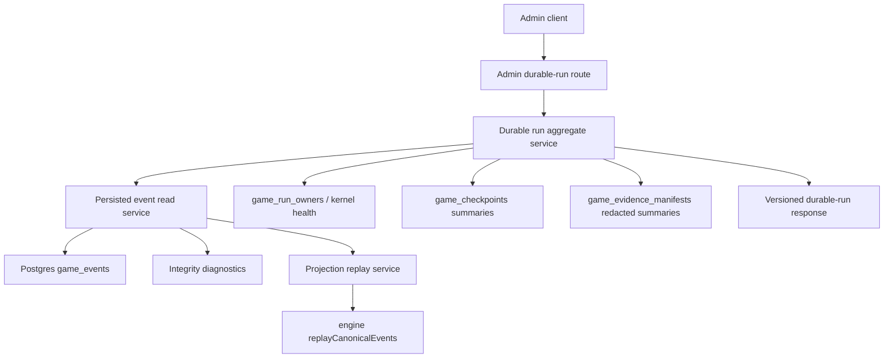
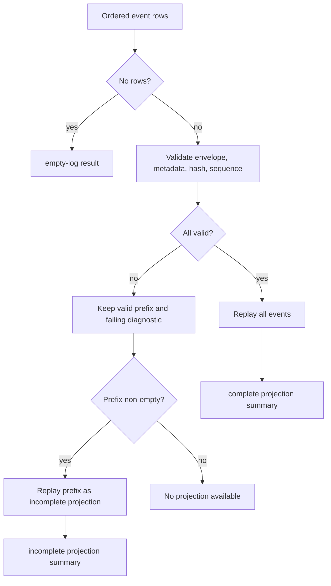

# feat: Add durable event read model

## Summary

Add an API-only durable truth read model for API-backed Influence games. The implementation reads persisted Postgres kernel rows, validates canonical event integrity, replays the valid event prefix through the engine projection reducer, and exposes an admin-only durable-run inspection endpoint with checkpoint and evidence readiness summaries.

---

## Problem Frame

The durable game-run kernel now writes owner epochs, ordered canonical event rows, checkpoint capsules, and private evidence manifests. Those rows make interrupted API games inspectable in principle, but the API still only exposes redacted counts through kernel health. An operator can see that durable rows exist, but cannot ask what the ordered log proves about a suspended or completed run.

The next safe step before checkpoint hydration is to read the event store back as a system of record. This plan validates row/envelope agreement, makes projection replay failures diagnosable, and keeps resume out of scope so canonical events are not overclaimed as full runtime state.

---

## Requirements Trace

**Event Retrieval and Integrity**

- R1. The API exposes a service that loads persisted `game_events` rows for one game ordered by sequence. Covers origin R1, F1.
- R2. The read service validates row metadata, canonical envelope validation, payload version, and deterministic event hash agreement. Covers origin R2, R3, AE2.
- R3. Integrity failures are returned as diagnostics with sequence context rather than hidden behind generic server errors. Covers origin R3, R6, F3.
- R4. A game with no durable event rows returns an inspectable empty/pre-kernel response. Covers origin R4, F2, AE3.

**Projection Replay**

- R5. Valid persisted event envelopes replay through the engine's canonical projection reducer. Covers origin R5, R19, AE1, AE6.
- R6. Corrupt-log replay returns a valid-prefix boundary and failing sequence without presenting the failed suffix as trustworthy projection state. Covers origin R6, F3.
- R7. Projection output is summarized as board truth and does not infer XState, in-flight phase accumulators, LLM context, or resume eligibility. Covers origin R7, R8.

**Admin Durable-Run Inspection**

- R8. The API exposes an admin-only durable-run inspection endpoint for one game by ID or slug. Covers origin R9, R12, F1.
- R9. The response is versioned and aggregate-first: identity/status, owner/kernel health, event head, replay status, projection summary, diagnostics, checkpoint summaries, and evidence summaries. Covers origin R10, R11.
- R10. This slice does not add a paginated event browser, public RPC surface, or frontend panel. Covers origin Scope Boundaries.

**Checkpoint and Evidence Readiness**

- R11. Checkpoint summaries preserve event boundary, kind, phase, round, hashes, hydrateable status, hydration status, cursor presence, and degraded reason. Covers origin R13, R14, AE4.
- R12. Checkpoint output cannot be mistaken for resume support. Covers origin R15.
- R13. Evidence summaries expose redacted coverage and counts only: evidence type, event-sequence coverage, retention class, redaction status, and storage-provider presence. Covers origin R16, AE5.
- R14. The durable-run endpoint never returns raw prompts, raw model responses, `thinking`, `reasoningContext`, storage buckets, storage keys, manifest IDs, source pointers, or dereferenceable private evidence handles. Covers origin R17.
- R15. Evidence summary failures become diagnostics without blocking otherwise valid event replay. Covers origin R18.

**Validation**

- R16. Automated tests cover valid logs, empty/pre-kernel games, corrupted logs, admin auth gating, redacted evidence summaries, and non-hydrateable checkpoint summaries. Covers origin R20.
- R17. Validation proves persisted API envelopes and simulator JSONL envelopes continue to share the canonical projection contract. Covers origin R19.
- R18. Implementation verification includes a local Postgres-backed API smoke path that inspects durable events/checkpoints written through the live kernel path. Local Postgres runs in Docker; sandboxed agents usually need elevated sandbox access for DB-backed commands against `127.0.0.1:54320`. Covers origin R21, F4, AE6.

---

## Key Technical Decisions

- **Aggregate durable-run endpoint first:** The first API surface returns inspection truth for one game, not a paginated event browser. This satisfies operator debugging while avoiding a public or UI-shaped contract before the response proves itself.
- **Read model extends kernel services, not lifecycle execution:** New read services sit beside `game-events.ts`, `game-checkpoints.ts`, `game-evidence.ts`, and `game-kernel-health.ts`. They do not modify runner ownership, event append semantics, checkpoint writing, or evidence storage policy.
- **Diagnostics are structured and non-throwing at the service boundary:** Row-level validation can use helpers that throw internally, but public service results should carry diagnostic codes, sequence, event type when safe, and a short redacted message.
- **Replay uses valid-prefix semantics:** If event integrity fails at sequence `N`, the service may summarize the valid prefix before `N`, but the response must mark replay incomplete and identify the failure boundary. It must not merge prefix projection with untrusted suffix facts.
- **Projection is summarized for operations:** Return a durable board summary rather than the full reducer object by default. The summary should include last sequence, round, phase, player status counts, eliminated/alive IDs or names as already public/admin-safe, vote/council state, accepted outcomes, and winner state when present.
- **No resume signal in response shape:** The endpoint reports checkpoint `hydrateable` and missing hydration inputs, but does not return a `resumeAvailable`, `resumeUrl`, or action-like field.
- **Evidence summaries are privacy-minimized:** Evidence output groups by coverage and status. It may say storage is present by provider category, but it must not expose bucket/key, source pointers, manifest IDs, actor/action private labels, prompts, responses, thinking, or reasoning context.
- **Admin read permission is the boundary:** Reuse the existing `requirePermission("view_admin", "manage_roles")` path in admin routes. Producer-private evidence dereference remains governed by `evidence-access.ts`; this endpoint never dereferences it.
- **Simulator parity remains a contract test, not import:** Reuse existing engine replay tests and add API-side persisted-row replay tests. Do not add database import for CLI simulations.

---

## High-Level Technical Design

---

## Implementation Units

### U1. Persisted Event Read Service

**Goal:** Load and validate a game's persisted canonical event rows without trusting DB metadata blindly.

**Requirements:** R1, R2, R3, R4.

**Dependencies:** Existing durable kernel schema and `appendGameEvents`.

**Files:**

- `packages/api/src/services/game-event-read-model.ts`
- `packages/api/src/services/game-events.ts`
- `packages/api/src/__tests__/game-event-read-model.test.ts`
- `packages/api/src/__tests__/test-utils.ts`

**Approach:** Create a read service that selects `game_events` for a game ordered by sequence and converts rows into validated canonical event records plus diagnostics. Reuse `validateCanonicalGameEvent` and `hashCanonicalEvent` so readback validation matches append-time hashing. Detect wrong game ID, sequence gaps, duplicate rows from any future import path, unsupported payload version, row/envelope metadata disagreement, and hash mismatch. Treat no rows as a successful empty-log status with no projection input.

**Patterns to follow:** `packages/api/src/services/game-events.ts` for canonical envelope validation and stable hashing; `packages/api/src/__tests__/db.test.ts` durable kernel fixture setup; `packages/engine/src/canonical-events.ts` validation helpers.

**Test scenarios:**

- Covers AE1. Given contiguous persisted events with matching row metadata and hash, the service returns ordered canonical events and no diagnostics.
- Covers AE2. Given a stored row whose `eventHash` differs from the recomputed hash, the service returns a hash-mismatch diagnostic tied to that sequence.
- Covers AE3. Given a game with no `game_events`, the service returns an empty-log result rather than throwing.
- Given row `gameId`, `sequence`, `eventType`, or `payloadVersion` disagrees with the envelope, the service reports a metadata diagnostic and excludes that row from the trusted suffix.
- Given sequence one is missing, or a later sequence skips ahead, the service reports the expected and actual sequence.
- Given duplicate rows are passed through the validation helper, identical duplicates are not silently merged and conflicting duplicates report a duplicate diagnostic.

**Verification:** The service can explain whether a persisted event log is complete, empty, or corrupt without requiring manual SQL.

### U2. Projection Replay Summary

**Goal:** Replay trusted persisted events into the canonical projection and return an operator-safe board summary.

**Requirements:** R5, R6, R7, R17.

**Dependencies:** U1.

**Files:**

- `packages/api/src/services/game-projection-read-model.ts`
- `packages/api/src/services/game-event-read-model.ts`
- `packages/api/src/__tests__/game-projection-read-model.test.ts`
- `packages/engine/src/__tests__/simulate-config.test.ts`

**Approach:** Wrap `replayCanonicalEvents` in an API-side projection service that handles empty logs and corrupt suffixes deliberately. A complete valid log returns replay status `complete`. An invalid log returns replay status `incomplete` or `failed`, records the valid-prefix boundary, and only summarizes prefix replay when the prefix itself is contiguous and non-empty. The projection summary should avoid XState or runner fields and should not call any future checkpoint hydrate path.

**Patterns to follow:** `packages/engine/src/game-projection.ts` replay invariants; `packages/engine/src/__tests__/canonical-event-replay.test.ts` sequence and payload-version coverage; `packages/engine/src/__tests__/simulate-config.test.ts` simulator/API envelope parity test.

**Test scenarios:**

- Covers AE1. Given valid persisted envelopes, replay summary last sequence equals event head and board fields match the engine projection.
- Given no trusted events, the service returns no projection and replay status `empty`.
- Covers AE2. Given a hash mismatch after a valid prefix, the response marks replay incomplete and includes a prefix summary only through the last trusted sequence.
- Given the engine reducer throws on an unsupported event type or payload version, the service converts the error to a diagnostic with sequence context.
- Given API-persisted envelopes and simulator JSONL envelopes represent the same events, both replay through the same projection contract.
- Given projection output is inspected, it contains board-summary fields and no resume/XState/LLM-context fields.

**Verification:** Projection tests prove durable readback uses the same reducer contract as simulator JSONL while making corrupt logs visibly incomplete.

### U3. Durable Run Aggregate Service

**Goal:** Combine game identity, owner/kernel health, event head, projection replay, checkpoint summaries, and redacted evidence summaries into one reusable service response.

**Requirements:** R8, R9, R11, R12, R13, R14, R15, R16.

**Dependencies:** U1, U2.

**Files:**

- `packages/api/src/services/game-durable-run.ts`
- `packages/api/src/services/game-kernel-health.ts`
- `packages/api/src/services/game-checkpoints.ts`
- `packages/api/src/services/game-evidence.ts`
- `packages/api/src/services/evidence-access.ts`
- `packages/api/src/__tests__/game-durable-run.test.ts`

**Approach:** Create a service that resolves a game by ID or slug, loads latest owner/kernel health, calls the event read and projection services, and queries checkpoints/evidence manifests in redacted form. Checkpoint summaries should list event boundary, kind, phase, round, event-head hash, projection hash, hydrateable flag, hydration status, cursor presence, and degraded reason. Evidence summaries should group by type, retention class, redaction status, event-sequence coverage, and storage-provider presence only. Evidence query failures should add diagnostics while preserving valid event/projection results.

**Patterns to follow:** `getRedactedKernelHealthByGameId` for count-style safe exposure; `readEvidenceManifest` for the private dereference boundary; existing admin game summary assembly in `packages/api/src/routes/admin.ts`.

**Test scenarios:**

- Covers AE4. Given checkpoints at durable event boundaries, summaries preserve `hydrateable=false`, boundary sequence, hashes, hydration status, and degraded reason.
- Covers AE5. Given evidence manifests with bucket/key/source pointers, durable-run evidence output excludes manifest IDs, bucket, key, source pointers, raw content fields, and private dereference handles.
- Given expired or redacted manifests exist, evidence summary counts include their redaction status without exposing private internals.
- Given owner/kernel rows exist with degraded or suspended health, the response includes the latest safe owner/kernel summary.
- Given evidence summary loading fails, the response includes an evidence diagnostic and still returns event/projection results when those are valid.
- Given a game cannot be found by ID or slug, the service returns a not-found result for the route to map.

**Verification:** Aggregate tests prove the response can explain a durable run while preserving private evidence boundaries.

### U4. Admin Durable-Run Endpoint

**Goal:** Expose durable run inspection through the existing admin read boundary.

**Requirements:** R8, R9, R10, R14, R16.

**Dependencies:** U3.

**Files:**

- `packages/api/src/routes/admin.ts`
- `packages/api/src/__tests__/admin-routes.test.ts`
- `packages/web/src/lib/api.ts`

**Approach:** Add an admin-only route under the existing admin game namespace for one game by ID or slug. The route should call the aggregate service and return a versioned response. It should not add frontend navigation, a viewer/admin panel, or a client-side fetch path. Add TypeScript API response types only if useful for future UI/RPC reuse.

**Patterns to follow:** `requireAdminRead` in `packages/api/src/routes/admin.ts`; admin route RBAC tests in `packages/api/src/__tests__/admin-routes.test.ts`; existing `export-game` lookup by ID or slug.

**Test scenarios:**

- Covers F1. Given an admin token with `view_admin`, requesting durable-run inspection returns the versioned durable-run response.
- Given a gamer/non-admin token, the durable-run route returns the existing admin-read denial behavior.
- Given no token, the durable-run route requires authentication.
- Given an unknown game ID or slug, the route returns a not-found response.
- Given a suspended game with durable rows, the route returns event head, replay status, checkpoint summaries, and redacted evidence summaries.
- Given the response is serialized, it contains no private evidence keys, source pointers, raw prompts, raw responses, `thinking`, or `reasoningContext`.

**Verification:** Admin route tests prove auth gating and response redaction at the HTTP boundary.

### U5. Live-Kernel Smoke and Documentation Updates

**Goal:** Prove the read model against rows written by the live durable kernel path and document the inspection boundary.

**Requirements:** R16, R17, R18.

**Dependencies:** U1, U2, U3, U4.

**Files:**

- `packages/api/src/__tests__/game-lifecycle.test.ts`
- `packages/api/src/__tests__/games-api.test.ts`
- `docs/statefulness-plan.md`
- `DEVELOPMENT.md`
- `README.md`
- `CONCEPTS.md`

**Approach:** Add an integration test or smoke fixture that starts an API-backed game through the existing lifecycle path, lets the durable sink write events/checkpoints, and then inspects it through the read model or admin route. Update docs that describe the durable kernel so they name the durable truth read model, the API-only inspection surface, and the fact that this still does not support resume, simulation import, or raw evidence browsing.

**Patterns to follow:** Existing mock-runner API tests with `INFLUENCE_API_TEST_MOCK_RUNNER`; `GameRunner` durable sink tests in `canonical-event-replay.test.ts`; `docs/statefulness-plan.md` warning language around non-resumable checkpoints.

**Test scenarios:**

- Covers AE6. Given an API-backed game writes durable events through `appendGameEvents`, durable-run inspection replays those rows with no happy-path diagnostics.
- Given checkpoint capsules are written during the run, durable-run inspection reports non-hydrateable checkpoint readiness.
- Given the existing simulator/API parity test runs, persisted API envelopes still match simulator JSONL projection expectations.
- Given docs describe the new endpoint, they avoid promising `GameRunner.fromCheckpoint()`, simulation import, public RPC, or raw S3 evidence browsing.

**Verification:** The slice is complete only after unit tests prove service behavior and a local Postgres-backed smoke path proves the endpoint can inspect real kernel-written rows. Local Postgres runs in Docker; sandboxed agents usually need elevated sandbox access for DB-backed commands against `127.0.0.1:54320`.

---

## Scope Boundaries

In scope:

- API read services for persisted durable kernel rows.
- Admin-only durable-run inspection endpoint.
- Event integrity diagnostics and valid-prefix replay handling.
- Projection summaries from canonical event replay.
- Checkpoint readiness summaries.
- Redacted evidence manifest summaries.
- Automated tests and one local Postgres-backed API smoke verification. Local Postgres runs in Docker; sandboxed agents usually need elevated sandbox access for DB-backed commands against `127.0.0.1:54320`.

Deferred to Follow-Up Work:

- Admin UI panel for durable-run inspection.
- Production RPC publishing and external client auth.
- Paginated durable event browser.
- Public replay APIs.
- Raw Linode Object Storage evidence browsing.
- Simulation import into Postgres for viewer replay.
- Materialized projection tables.
- Redis/pubsub or horizontal scaling.
- `GameRunner.fromCheckpoint()` and hydrateable resume.

---

## System-Wide Impact

- **API services:** Adds read-model services over durable kernel tables without changing write-side ownership or append semantics.
- **Admin API:** Adds a new authenticated inspection surface that must preserve evidence privacy and future response compatibility.
- **Engine contract:** Reuses existing canonical projection replay and simulator/API parity tests; no engine runtime behavior changes are required unless a small export is needed for summary typing.
- **Database:** No migration is expected for the first read model because required tables already exist. Query patterns should stay indexed by game ID and event sequence.
- **Web:** No visible UI changes are planned. Optional API types may be added to preserve future frontend/RPC reuse.
- **Operations:** Suspended/completed games become inspectable by API instead of manual SQL, while resume remains unsupported.

---

## Risks and Mitigations

- **Risk: projection summary looks like resume state.** Mitigation: omit XState, runner, LLM, and action fields; show checkpoint `hydrateable` status and missing inputs plainly.
- **Risk: corrupt logs produce misleading partial truth.** Mitigation: return explicit replay status, diagnostics, and valid-prefix boundary whenever any suffix is invalid.
- **Risk: evidence summaries leak private handles.** Mitigation: group evidence by safe categories only and test that bucket, key, manifest ID, source pointers, raw prompt/response, `thinking`, and `reasoningContext` never appear.
- **Risk: route shape becomes a premature public contract.** Mitigation: keep it under admin auth with a versioned response and aggregate-first semantics.
- **Risk: on-demand replay becomes expensive for long games.** Mitigation: keep this slice on-demand and defer materialized projections until real replay cost justifies them.
- **Risk: tests overfit inserted fixtures.** Mitigation: include one lifecycle/API smoke path that inspects rows produced by the live durable sink/checkpoint code.

---

## Acceptance Examples

- AE1. Given a game has contiguous persisted canonical events, when the admin durable-run endpoint is requested, then the response reports complete replay and a projection summary whose last sequence matches the event head.
- AE2. Given a persisted event row's stored hash differs from the recomputed canonical event hash, when durable-run inspection runs, then the response includes a hash-mismatch diagnostic tied to the event sequence.
- AE3. Given a pre-kernel game has no durable events, when durable-run inspection runs, then the response succeeds with empty-log status and no durable projection.
- AE4. Given a game has checkpoint capsules, when durable-run inspection returns checkpoint summaries, then each summary reports its event boundary and `hydrateable=false` status without a resume action.
- AE5. Given private evidence manifests include storage pointers, when durable-run inspection returns evidence summaries, then storage bucket/key, raw prompt/response, `thinking`, `reasoningContext`, manifest IDs, and source pointers are absent.
- AE6. Given a local API-backed smoke game writes durable events and checkpoints, when the endpoint inspects that game, then replay succeeds, checkpoint readiness is visible, evidence is redacted, and no happy-path diagnostics are returned.

---

## Documentation and Operational Notes

- Update `docs/statefulness-plan.md` to describe the durable truth read model as an inspection layer, not a resume layer.
- Update `DEVELOPMENT.md` or `README.md` only where local API smoke verification expectations are already described.
- Keep `CONCEPTS.md` glossary language aligned with the existing `Durable truth read model` entry if implementation names evolve.
- Do not document raw S3 evidence browsing or simulation import as available features in this slice.

---

## Sources and Research

- `docs/brainstorms/2026-06-14-durable-event-read-model-requirements.md`
- `docs/brainstorms/2026-06-13-durable-game-run-kernel-requirements.md`
- `docs/plans/2026-06-13-002-feat-durable-game-run-kernel-plan.md`
- `docs/statefulness-plan.md`
- `CONCEPTS.md`
- `AGENTS.md`
- `packages/api/src/db/schema.ts`
- `packages/api/src/services/game-events.ts`
- `packages/api/src/services/game-kernel-health.ts`
- `packages/api/src/services/game-checkpoints.ts`
- `packages/api/src/services/game-evidence.ts`
- `packages/api/src/services/evidence-access.ts`
- `packages/api/src/services/game-lifecycle.ts`
- `packages/api/src/routes/admin.ts`
- `packages/api/src/routes/games.ts`
- `packages/api/src/__tests__/admin-routes.test.ts`
- `packages/api/src/__tests__/db.test.ts`
- `packages/api/src/__tests__/game-lifecycle.test.ts`
- `packages/engine/src/game-projection.ts`
- `packages/engine/src/__tests__/canonical-event-replay.test.ts`
- `packages/engine/src/__tests__/simulate-config.test.ts`
- `docs/solutions/architecture-patterns/agent-strategy-observability-spine.md`
