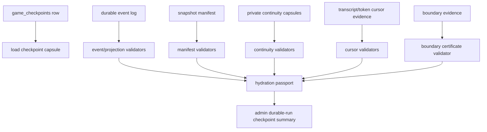
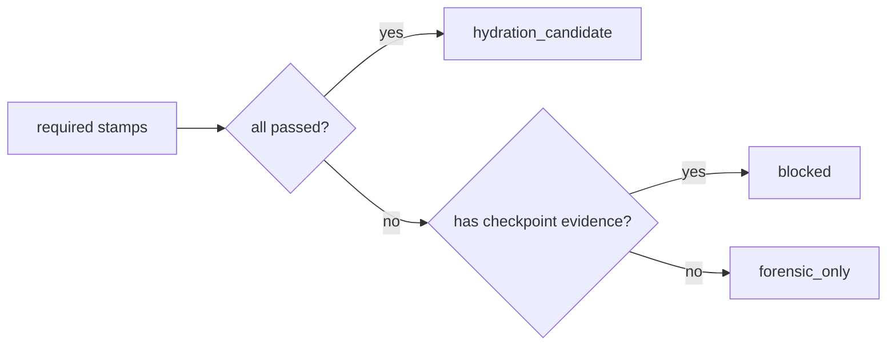
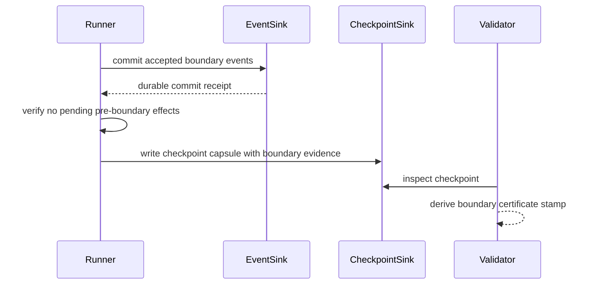

# feat: Add checkpoint hydration passport

## Summary

Add a validator-derived hydration passport for durable checkpoints. The passport is the top-level readiness record that explains whether a checkpoint is `forensic_only`, `blocked`, or a `hydration_candidate`.

This slice does not resume a game from a checkpoint. It makes readiness inspectable, testable, and fail-closed by validating required stamps: event log replay, projection replay, boundary safety, snapshot manifest completeness, transcript cursor, token cursor, and private agent/House continuity capsules.

The intended product result is that admin inspection can say, with evidence, "this checkpoint is still forensic only" or "this checkpoint is a hydration candidate." A positive candidate verdict is allowed in v1 when all available validators pass, but it must not imply that `GameRunner.fromCheckpoint()` exists.

---

## Problem Frame

Durable checkpoints currently exist as forensic capsules. They are useful for inspection, but the system intentionally marks them `hydrateable: false` and reports missing inputs such as XState actor state, phase accumulators, agent memory, transcript cursor, and token cursor.

The next useful checkpoint slice is not runtime resume. It is a readiness layer that prevents "snapshot" from becoming an ambiguous JSON blob and prevents "hydrateable" from hiding unsafe boundaries, missing private continuity, or missing cost/transcript cursors.

This plan implements the terms introduced in the requirements:

- Hydration passport: the complete readiness record for a checkpoint.
- Boundary certificate: the required stamp proving the checkpoint was taken at a safe boundary.
- Snapshot manifest: the structured packing list of what a runtime snapshot contains.
- Continuity capsule: the private agent/House portion of the snapshot manifest.

---

## Requirements Trace

### Passport Verdict And Inspection

Covered requirements: R1-R5, R29-R32.

The passport validator derives a verdict from checkpoint evidence instead of trusting an existing boolean. The verdict is one of:

- `forensic_only`: useful for audit, not a candidate for hydration.
- `blocked`: readiness is attempted but one or more required stamps fail or are missing.
- `hydration_candidate`: all v1 required validators pass.

Admin inspection exposes the passport summary and diagnostics without exposing raw private manifests, strategy packets, or reasoning artifacts.

### Required Stamps And Candidate Gate

Covered requirements: R6-R14, R33-R37.

The candidate verdict requires every v1 required stamp to pass. Missing, malformed, unknown, or validator-error stamps fail closed. A checkpoint may be a positive candidate in tests or fixture-backed validation if all required stamps pass, even before runtime resume exists.

### Boundary, Manifest, And Cursors

Covered requirements: R15-R22.

The boundary certificate answers whether the checkpoint was taken at a safe boundary for the checkpoint being saved. It does not mean a later checkpoint blocks an earlier one, and it does not create global serialization across checkpoints. It means no pre-boundary LLM/effect work can still commit after this checkpoint and boundary side effects will not double-run.

The snapshot manifest names the runtime inputs required for future hydration and validates their presence, version, and integrity. Transcript and token cursors are explicit stamps, not implied by in-memory counters.

### Continuity Capsules

Covered requirements: R23-R28.

Continuity is active scope in this slice. The runner captures structured private continuity capsules for players and House rather than treating raw reasoning evidence as sufficient.

Player content is per-agent subjective state: strategy packet, reflection summary, commitments, notes, relationships, power-action memory, and round history needed to continue that player's behavior.

House content is global producer state: House strategy bible revision, social graph summaries, story arcs, dropped threads, open questions, and production-level continuity needed to continue narration, audits, and future orchestration.

Neither capsule makes private reasoning canonical or public. Public truth remains the event log and replayed projection.

---

## Key Technical Decisions

### 1. Passport Is A Derived Read Model

Do not make `game_checkpoints.hydrateable` the source of truth for readiness. Existing rows and future rows should be evaluated by a passport validator that looks at persisted checkpoint evidence, durable event/projection state, cursor evidence, and capsule manifests.

The API can continue storing compatibility fields, but admin inspection should prefer the passport verdict and stamp diagnostics.

### 2. Candidate Is Not Resume

`hydration_candidate` means "the checkpoint has the required evidence for a future hydration attempt." It does not mean the runtime can actually restart from it.

This distinction must be visible in type names, diagnostics, route tests, and docs. Avoid user-facing or admin copy that says "resume ready" in this slice.

### 3. Boundary Certificate Is A Required Stamp

The boundary certificate is not just the fact that a checkpoint row exists. It must encode evidence that the checkpoint belongs to a safe runtime boundary and that effects before that boundary cannot commit later.

For v1, the certificate can be conservative and tied to known phase-boundary checkpoint writes after accepted durable event commits. If the runtime cannot prove a safety condition, the stamp is `missing` or `failed`, not "best effort."

### 4. Snapshot Manifest Is A Schema, Not A Blob

The manifest should be versioned and broken into named components:

- Projection truth.
- XState actor snapshot.
- Phase accumulators.
- Agent continuity capsules.
- House continuity capsule.
- Transcript cursor.
- Token cursor.
- Owner epoch / boundary identity.

Each component gets a presence and validation status. The top-level verdict is derived from these statuses.

### 5. Continuity Capsules Are Structured Private State

Skipping agent and House continuity must not require odd carve-outs. If the capsule is missing, the validator says that directly and blocks candidate status.

Player capsules and the House capsule are different kinds of continuity and should be modeled separately. Raw private evidence from admin inspection does not count as a continuity capsule unless it is normalized into the capsule schema.

### 6. Unknown Future Fields Fail Closed

The validator should tolerate older checkpoints by reporting them as blocked/forensic, but it should not silently treat unknown manifest versions, unknown required stamps, or malformed evidence as passing.

---

## High-Level Technical Design

### Passport Derivation Flow

### Verdict Gate

### Safe Boundary Scope

The "no pending effects" check is local to the checkpoint being saved. It does not imply that an in-progress later checkpoint can block a prior checkpoint's validity.

---

## Implementation Units

### Unit 1: Passport Contract And Validator Skeleton

Goal: Introduce the durable API passport model and a validator service that derives a fail-closed verdict from existing checkpoint rows.

Files:

- `packages/api/src/services/checkpoint-hydration-passport.ts`
- `packages/api/src/services/game-durable-run.ts`
- `packages/api/src/__tests__/checkpoint-hydration-passport.test.ts`
- `packages/api/src/__tests__/game-durable-run.test.ts`
- `packages/api/src/__tests__/durable-run-test-utils.ts`

Design:

- Add explicit passport, stamp, verdict, and diagnostic types.
- Include required stamp ids for event log, projection, boundary certificate, snapshot manifest, transcript cursor, token cursor, player continuity, and House continuity.
- Derive current checkpoint summaries through the passport validator.
- Treat current forensic capsules as blocked/forensic with direct missing-stamp diagnostics.
- Keep existing compatibility summary fields where needed, but make passport the richer admin shape.

Tests:

- Existing forensic checkpoint rows report missing required stamps.
- Malformed hydration status fails closed.
- Unknown stamp or manifest versions fail closed.
- Admin durable-run inspection includes passport verdict and stamp diagnostics.

Verification:

- `bun test packages/api/src/__tests__/checkpoint-hydration-passport.test.ts`
- `bun test packages/api/src/__tests__/game-durable-run.test.ts`

### Unit 2: Snapshot Manifest Shape In Engine Checkpoints

Goal: Replace the vague `snapshot` placeholder with a versioned manifest shape that names the runtime components needed for future hydration.

Files:

- `packages/engine/src/game-runner.types.ts`
- `packages/engine/src/game-runner.ts`
- `packages/api/src/__tests__/durable-run-test-utils.ts`
- `packages/api/src/__tests__/checkpoint-hydration-passport.test.ts`

Design:

- Add a versioned snapshot manifest type to the checkpoint capsule contract.
- Include component entries for projection truth, XState actor state, phase accumulators, player continuity, House continuity, transcript cursor, token cursor, and owner epoch.
- Persist component metadata and status instead of a loosely typed blob.
- Older checkpoint rows should still inspect cleanly but receive blocked diagnostics.

Tests:

- A new engine checkpoint capsule contains a manifest with all expected component ids.
- Missing or malformed component entries block candidate status.
- Older fixture checkpoints are classified without throwing.

Verification:

- `bun test packages/api/src/__tests__/checkpoint-hydration-passport.test.ts`
- `bun test packages/api/src/__tests__/game-durable-run.test.ts`

### Unit 3: Boundary Certificate Evidence

Goal: Capture and validate a boundary certificate for phase-boundary checkpoints.

Files:

- `packages/engine/src/game-runner.types.ts`
- `packages/engine/src/game-runner.ts`
- `packages/api/src/services/checkpoint-hydration-passport.ts`
- `packages/api/src/__tests__/checkpoint-hydration-passport.test.ts`
- `packages/api/src/__tests__/game-durable-run.test.ts`

Design:

- Add boundary evidence to the checkpoint capsule: game id, owner epoch, boundary sequence, checkpoint reason, event commit receipt, and runtime assertions about pending effects.
- Validate that boundary sequence aligns with the event boundary and replayed projection sequence.
- Validate that the checkpoint is taken after accepted durable commits for that boundary.
- Report missing pending-effect proof as a failed boundary stamp, not as a warning.

Tests:

- Valid fixture boundary certificate passes.
- Boundary sequence mismatch fails.
- Missing event commit receipt fails.
- Missing no-pending-effect assertion fails.
- Duplicate checkpoint inspection remains deterministic and does not double-run side effects.

Verification:

- `bun test packages/api/src/__tests__/checkpoint-hydration-passport.test.ts`
- `bun test packages/api/src/__tests__/game-durable-run.test.ts`

### Unit 4: Transcript And Token Cursor Stamps

Goal: Make transcript and token continuity explicit passport stamps.

Files:

- `packages/engine/src/game-runner.types.ts`
- `packages/engine/src/game-runner.ts`
- `packages/engine/src/token-tracker.ts`
- `packages/api/src/services/checkpoint-hydration-passport.ts`
- `packages/api/src/__tests__/checkpoint-hydration-passport.test.ts`
- `packages/api/src/__tests__/game-durable-run.test.ts`

Design:

- Add a serializable token cursor to the checkpoint evidence using the existing token tracker data model.
- Add transcript cursor evidence that identifies a durable transcript boundary rather than only an in-memory entry count.
- Validate cursor presence, version, and relationship to the checkpoint boundary.
- If a cursor cannot be made durable in this slice without widening into a new transcript store, represent it as a required failed stamp and keep candidate fixtures positive only when they provide durable cursor evidence. Do not silently waive it.

Tests:

- Token cursor serializes and validates round-trip data.
- Transcript cursor missing blocks candidate status.
- Token cursor missing blocks candidate status.
- Positive fixture with both durable cursors passes the cursor stamps.

Verification:

- `bun test packages/api/src/__tests__/checkpoint-hydration-passport.test.ts`
- `bun test packages/api/src/__tests__/game-durable-run.test.ts`

### Unit 5: Player And House Continuity Capsules

Goal: Capture structured private continuity for players and House as required manifest components.

Files:

- `packages/engine/src/agent.ts`
- `packages/engine/src/game-runner.types.ts`
- `packages/engine/src/game-runner.ts`
- `packages/api/src/services/checkpoint-hydration-passport.ts`
- `packages/api/src/services/game-durable-run.ts`
- `packages/api/src/__tests__/checkpoint-hydration-passport.test.ts`
- `packages/api/src/__tests__/game-durable-run.test.ts`

Design:

- Add a player continuity capsule schema derived from public-safe identifiers plus private agent state: strategy packet, reflection summary, notes, commitments, relationships, power-action memory, and round history.
- Add a House continuity capsule schema derived from House strategy bible state: revision id, prior revision, social graph summaries, story arcs, dropped threads, open questions, and changed-since-previous summary.
- Keep reasoning text, raw thinking, and provider-specific reasoning context out of public/admin summaries.
- Validate that every active player expected at the checkpoint has a player capsule.
- Validate that the House capsule exists and matches the current House bible revision.

Tests:

- Missing player capsule blocks candidate status.
- Missing House capsule blocks candidate status.
- Raw private evidence without normalized capsules does not pass continuity validation.
- Admin summaries expose capsule status and redacted metadata only.
- Positive fixture with complete player and House capsules passes continuity stamps.

Verification:

- `bun test packages/api/src/__tests__/checkpoint-hydration-passport.test.ts`
- `bun test packages/api/src/__tests__/game-durable-run.test.ts`

### Unit 6: Admin Route Integration And Live Inspection Smoke

Goal: Make the passport visible through the existing durable-run inspection route and prove the live behavior is honest.

Files:

- `packages/api/src/routes/admin-routes.ts`
- `packages/api/src/services/game-durable-run.ts`
- `packages/api/src/__tests__/admin-routes.test.ts`
- `packages/api/src/__tests__/game-durable-run.test.ts`

Design:

- Add passport fields to checkpoint summaries returned by the admin durable-run endpoint.
- Keep private capsule payloads out of route responses.
- Include concise diagnostics: stamp id, status, reason, and blocking flag.
- Preserve existing inspection behavior for event logs, private evidence summaries, and replay diagnostics.

Tests:

- Admin route returns passport verdict and stamps.
- Admin route does not expose raw capsule contents or private reasoning.
- Live API lifecycle runner checkpoints remain blocked unless they actually include all required evidence.
- Positive fixture can produce `hydration_candidate` when validators pass.

Verification:

- `bun test packages/api/src/__tests__/admin-routes.test.ts`
- `bun test packages/api/src/__tests__/game-durable-run.test.ts`
- Optional local smoke: start a game, inspect `/api/admin/games/:gameId/durable-run`, and confirm checkpoint passport diagnostics match persisted evidence.

### Unit 7: Docs And Operational Vocabulary

Goal: Keep the statefulness docs aligned with the new readiness model and prevent future code from treating candidate status as resume support.

Files:

- `CONCEPTS.md`
- `docs/statefulness-plan.md`
- `docs/brainstorms/2026-06-14-checkpoint-hydration-passport-requirements.md`
- `docs/plans/2026-06-14-002-feat-checkpoint-hydration-passport-plan.md`

Design:

- Document the distinction between `hydration_candidate`, `hydrateable`, and actual runtime resume.
- Document the boundary certificate's local safe-boundary meaning.
- Document the difference between player continuity and House continuity.
- Keep known-risk language clear: active game execution is not crash-safe until checkpoint/resume work lands.

Tests:

- Documentation-only unit; no automated test required beyond markdown/style checks used by the repo.

Verification:

- `git diff --check`

---

## System-Wide Impact

### API

The admin durable-run response gains passport verdicts, stamp summaries, and diagnostics. Existing durable inspection clients should continue to work if existing fields are preserved, but tests should assert the new passport shape directly.

### Engine

The engine checkpoint capsule evolves from a forensic-only record to a structured readiness artifact. It still does not hydrate or resume. It only captures evidence and manifests needed for future resume work.

### Persistence

The existing `game_checkpoints` table can store the initial passport evidence in JSON fields. A migration is only needed if the implementation decides to materialize passport verdicts or add indexed columns. Default plan: derive on read first, persist source evidence only.

### Privacy

Private continuity capsules are persisted as private checkpoint evidence. Admin route responses should expose statuses and redacted metadata, not raw strategy packets, notes, thinking, or provider reasoning context.

### Validation

The validator becomes the authoritative gate for readiness. Any missing or malformed evidence should produce a blocking diagnostic instead of a partial success.

---

## Risks And Mitigations

Risk: `hydration_candidate` is mistaken for resume support.

Mitigation: Keep candidate naming explicit, do not set `hydrateable: true` from this slice, and document that runtime resume remains out of scope.

Risk: Boundary certificate becomes a vague assertion.

Mitigation: Validate concrete evidence: boundary sequence, commit receipt, owner epoch, checkpoint reason, and no-pending-effect proof. Missing proof blocks candidate status.

Risk: Continuity capture leaks private reasoning.

Mitigation: Separate private persisted capsule data from public/admin summaries. Redact route responses and test against raw reasoning exposure.

Risk: Transcript cursor durability expands the slice.

Mitigation: Treat transcript cursor as a required stamp. If durable transcript cursoring is not implemented in this slice, keep live checkpoints blocked and allow only explicit positive fixtures to pass. Do not add a carve-out.

Risk: Existing checkpoints become noisy or broken in inspection.

Mitigation: Backward-compatible validator parsing. Older checkpoints should inspect as blocked/forensic with clear missing-stamp diagnostics.

Risk: Validator and engine schemas drift.

Mitigation: Keep shared literals/types close to the checkpoint capsule contract, and make fixture builders use the same required stamp ids as the validator.

---

## Acceptance Examples

### AE1: Current Forensic Checkpoint

Given a current checkpoint capsule with event/projection evidence but missing actor state, phase accumulators, cursors, and continuity capsules, admin inspection returns a passport with a non-candidate verdict and blocking diagnostics for the missing stamps.

### AE2: Complete Candidate Fixture

Given a checkpoint fixture with valid event/projection replay, boundary certificate, snapshot manifest, transcript cursor, token cursor, player continuity capsules, and House continuity capsule, the passport verdict is `hydration_candidate`.

### AE3: Boundary Failure

Given a checkpoint whose event boundary does not match the replayed projection sequence or lacks a commit receipt, the boundary certificate stamp fails and the passport cannot be a candidate.

### AE4: Continuity Privacy

Given a checkpoint with complete continuity capsules, the admin route exposes capsule status and redacted metadata without exposing raw reasoning text, provider reasoning context, or full private notes.

### AE5: Missing House Continuity

Given a checkpoint with player capsules but no House capsule, the passport is blocked with a House continuity diagnostic. Player continuity does not satisfy producer continuity.

---

## Validation Plan

Run focused tests while building each unit:

- `bun test packages/api/src/__tests__/checkpoint-hydration-passport.test.ts`
- `bun test packages/api/src/__tests__/game-durable-run.test.ts`
- `bun test packages/api/src/__tests__/admin-routes.test.ts`

Run broader validation before merging:

- `bun run test`
- `bun run check`
- `git diff --check`

Optional live smoke after route integration:

- Start a local game through the admin API.
- Inspect `/api/admin/games/:gameId/durable-run`.
- Confirm checkpoint passport verdicts and diagnostics match the actual persisted evidence.

---

## Out Of Scope

- `GameRunner.fromCheckpoint()`.
- Mid-phase resume.
- Crash-safe active game execution claims.
- Public player-facing UI for checkpoint readiness.
- Making private reasoning canonical or public.
- Treating raw private evidence summaries as continuity capsules.
- Marking existing live checkpoints `hydrateable: true` without all required validators passing.

---

## Research Sources

- `docs/brainstorms/2026-06-14-checkpoint-hydration-passport-requirements.md`
- `docs/statefulness-plan.md`
- `docs/brainstorms/2026-06-14-durable-event-read-model-requirements.md`
- `CONCEPTS.md`
- `packages/engine/src/game-runner.ts`
- `packages/engine/src/game-runner.types.ts`
- `packages/engine/src/agent.ts`
- `packages/engine/src/token-tracker.ts`
- `packages/api/src/db/schema.ts`
- `packages/api/src/services/game-checkpoints.ts`
- `packages/api/src/services/game-durable-run.ts`
- `packages/api/src/services/ws-manager.ts`
- `packages/api/src/__tests__/game-durable-run.test.ts`
- `packages/api/src/__tests__/admin-routes.test.ts`
- `packages/api/src/__tests__/durable-run-test-utils.ts`

