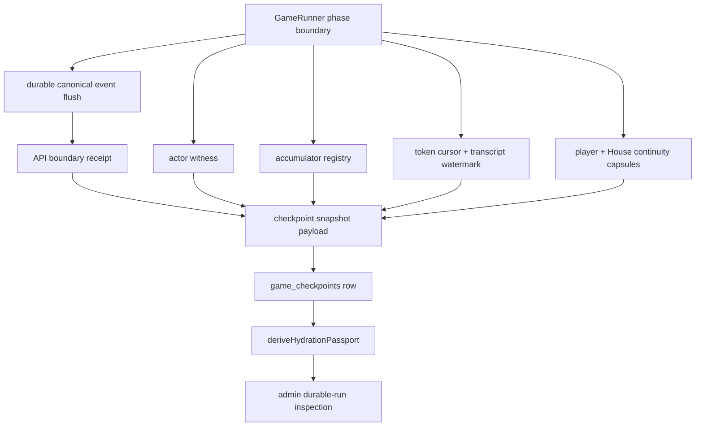
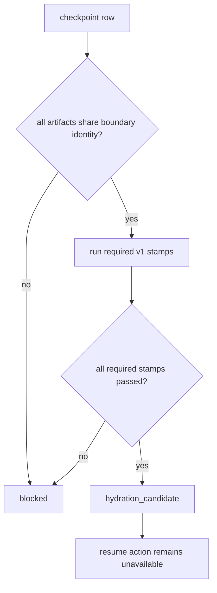
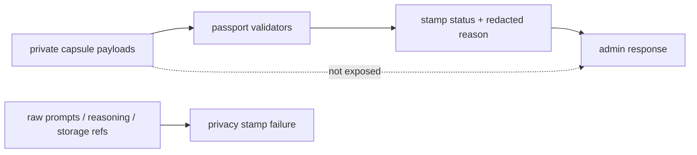

# feat: Add phase-boundary runtime snapshot

## Summary

Add Phase-Boundary Runtime Snapshot v1 to the existing durable checkpoint capsule and hydration passport path. A real checkpoint written through the durable API path should be able to earn `hydration_candidate` when its persisted runtime evidence passes every v1 validator.

This plan does not implement production resume. It makes checkpoint hydration validation honest enough that a future resume harness can consume a typed checkpoint input instead of a vague JSON blob.

---

## Problem Frame

The current durable run kernel can persist canonical events, write checkpoint rows, derive hydration passports, and expose admin durable-run inspection. That is useful forensic infrastructure, but the checkpoint payload is still too thin to justify a positive checkpoint verdict in a live path without hand-built fixture data.

The requirements establish the next slice: enrich the checkpoint capsule at safe phase boundaries with minimal runtime evidence, bind every artifact to the same boundary, validate that evidence semantically, and keep raw private evidence out of the checkpoint truth path. The result is DB-local checkpoint candidacy, not live-game restart.

---

## Requirements Trace

### Candidate Verdict and Truth Source

- R1. A real phase-boundary checkpoint can receive `hydration_candidate` when every required Runtime Snapshot v1 validator passes. Covers origin R1-R6 and AE1.
- R2. The passport verdict remains the only readiness truth source; duplicate readiness fields such as `hydrateable`, `hydrationStatus`, and `degradedReason` are removed from active checkpoint/read-model contracts. Covers origin R3-R4 and F4.
- R3. A candidate checkpoint is sufficient to construct a typed future-hydration input, while executing that input remains out of scope. Covers origin R2, R6, and AE7.

### Boundary Identity and Safety

- R4. Every snapshot artifact binds to the same owner epoch, event boundary sequence, event head hash, projection hash, checkpoint kind, phase, and round. Covers origin R7-R11 and AE6.
- R5. Boundary validation proves durable event flush completion and quiet-barrier evidence for the checkpoint being saved. Covers origin R8-R10 and F2.
- R6. A later failed checkpoint does not invalidate an earlier checkpoint whose own boundary identity and receipt passed. Covers origin R11.

### Runtime Evidence

- R7. The checkpoint payload includes a boundary actor witness with phase-machine coordinate, machine/version metadata, and typed future-hydration input metadata. Covers origin R12-R13 and AE2.
- R8. The checkpoint payload includes a closed, versioned accumulator registry for the phase-boundary class, with every v1-judged accumulator named. Covers origin R14-R20 and AE3.
- R9. Token cursor and transcript watermark validators require durable, content-free boundary evidence tied to the same checkpoint identity. Covers origin R21-R24 and AE4.
- R10. Player and House continuity capsules are required structured evidence, not optional raw private evidence. Covers origin R25-R30 and AE5.

### Read Model, Privacy, and Proof

- R11. Checkpoint payloads, validator inputs, diagnostics, logs, and admin responses do not expose raw prompts, responses, hidden reasoning, private storage references, raw continuity capsules, or captured accumulator payloads. Covers origin R31-R40.
- R12. Runtime Snapshot and passport details stay on authenticated admin/operator inspection paths, not public player or game read endpoints. Covers origin R41-R42.
- R13. Automated coverage includes positive fixtures, corrupt/mismatched evidence, privacy failures, and at least one live DB durable-run inspection proof. Covers origin R43-R47.

---

## Key Technical Decisions

- **Extend the existing checkpoint capsule path.** Runtime Snapshot v1 is a versioned payload inside the existing `game_checkpoints` JSONB-backed row and passport validator path. This avoids a parallel snapshot store and preserves durable-run inspection as the operator surface.
- **Passport owns readiness.** `hydration_candidate` comes from `deriveHydrationPassport`, not from writer-provided readiness booleans or duplicated missing-input hints.
- **Use boundary identity as the join key across evidence.** Actor witness, accumulator registry, boundary receipt, transcript watermark, token cursor, and continuity capsule metadata must all bind to the same checkpoint boundary tuple. Mixed-boundary artifacts fail closed.
- **Actor witness is restore-shape evidence, not live resume.** V1 captures the phase-machine coordinate and enough structured actor metadata to build typed future-hydration input. It does not call or implement `GameRunner.fromCheckpoint()`.
- **Accumulator registry is closed for v1.** The registry defines every v1-judged runner accumulator for each boundary class and requires proof for `empty`, `drained`, and `not_v1_hydratable`. It deliberately avoids serializing full runner internals when a proof is enough.
- **Transcript watermark stays content-free.** The transcript stamp is satisfied by durable boundary metadata such as sequence, digest, offset, or outbox marker. Entry counts alone remain diagnostic.
- **Continuity capsules are required but redacted.** Player and House capsules are persisted as private checkpoint evidence for validation, while admin/read-model responses expose only status and redacted reasons.

---

## High-Level Technical Design

### Runtime Snapshot Packing

### Candidate Gate

### Privacy Boundary

---

## Implementation Units

### U1. Runtime Snapshot Type Contract

- **Goal:** Define the v1 runtime snapshot payload and boundary identity contract shared by engine checkpoint writers and API validators.
- **Requirements:** R1, R3-R4, R7-R10.
- **Dependencies:** None.
- **Files:**
  - `packages/engine/src/game-runner.types.ts`
  - `packages/api/src/services/checkpoint-hydration-passport.ts`
  - `packages/api/src/__tests__/checkpoint-hydration-passport.test.ts`
  - `packages/api/src/__tests__/durable-run-test-utils.ts`
- **Approach:** Replace the loose manifest comments and partial component assumptions with explicit v1 types for boundary identity, actor witness, accumulator registry, transcript watermark, and continuity metadata. Keep the payload serializable as existing checkpoint JSONB and make unsupported versions fail closed.
- **Patterns to follow:** Existing `BoundaryCertificate`, `TokenCostCursor`, and `GameCheckpointCapsule` type surfaces; current fail-closed `unknown_version` behavior in `deriveHydrationPassport`.
- **Test scenarios:**
  - A v1 fixture with every required artifact and shared boundary identity produces only recognized component and stamp ids.
  - A fixture with an unsupported runtime snapshot version returns a blocking `unknown_version` or malformed stamp.
  - A fixture missing a required artifact id is blocked even when other artifacts are present.
  - A legacy/forensic fixture still inspects without throwing and remains non-candidate.
- **Verification:** The typed fixture surface is reusable by validator and DB tests without `as any`, and old checkpoint fixtures remain readable.

### U2. Boundary Receipt and Identity Validation

- **Goal:** Make the checkpoint writer persist API-sealed boundary identity and quiet-barrier evidence, then validate every artifact against that identity.
- **Requirements:** R4-R6, R11-R13. Covers origin F2 and AE6.
- **Dependencies:** U1.
- **Files:**
  - `packages/api/src/services/game-checkpoints.ts`
  - `packages/api/src/services/checkpoint-hydration-passport.ts`
  - `packages/api/src/__tests__/checkpoint-hydration-passport.test.ts`
  - `packages/api/src/__tests__/game-durable-run.test.ts`
  - `packages/api/src/__tests__/durable-run-test-utils.ts`
- **Approach:** Let `writeGameCheckpoint` seal the checkpoint boundary after it verifies owner epoch, persisted event head, projection sequence, and projection hash. The validator should reject mismatches between checkpoint row fields and any embedded actor, accumulator, cursor, continuity, or boundary receipt metadata.
- **Patterns to follow:** Existing transaction and event-head checks in `writeGameCheckpoint`; existing durable-run repeatable-read inspection in `getDurableRunInspection`.
- **Test scenarios:**
  - Covers AE6. Actor witness or cursor evidence bound to a different event sequence fails the boundary stamp.
  - Owner epoch mismatch between the checkpoint row and boundary receipt fails validation.
  - Event head hash or projection hash mismatch fails validation.
  - A later malformed checkpoint does not change an earlier checkpoint's passed boundary stamp.
- **Verification:** Boundary validation is row-local, deterministic, and independent of checkpoint insertion order.

### U3. Actor Witness and Accumulator Registry

- **Goal:** Capture and validate the phase-machine witness and closed accumulator registry needed for v1 candidate readiness.
- **Requirements:** R7-R8, R13. Covers origin F2, AE2, and AE3.
- **Dependencies:** U1, U2.
- **Files:**
  - `packages/engine/src/game-runner.ts`
  - `packages/engine/src/game-runner.types.ts`
  - `packages/engine/src/phase-machine.ts`
  - `packages/engine/src/phases/phase-runner-context.ts`
  - `packages/api/src/services/checkpoint-hydration-passport.ts`
  - `packages/api/src/__tests__/checkpoint-hydration-passport.test.ts`
  - `packages/api/src/__tests__/game-durable-run.test.ts`
- **Approach:** Pass the phase actor's boundary coordinate into checkpoint construction and add a compact actor witness: phase, round, checkpoint kind, machine/schema version, and actor coordinate sufficient to construct future hydration input. Add a closed accumulator registry keyed by boundary class. For v1, entries can be `empty`, `drained`, `blocked`, `malformed`, or `not_v1_hydratable`; passing statuses need proof, and non-empty unserialized runner-owned accumulators block candidacy.
- **Patterns to follow:** Current `writeCheckpoint` phase-boundary hook, `GameCheckpointProjectionSummary`, and passport component validation helpers.
- **Test scenarios:**
  - Covers AE2. Actor phase or round mismatch against projection facts fails the actor stamp.
  - Missing actor witness blocks candidacy even when manifest status claims captured.
  - Covers AE3. `not_v1_hydratable` without proof fails the accumulator stamp.
  - Unknown accumulator registry version or omitted required accumulator id blocks candidacy.
  - Empty or drained accumulator with valid proof may pass without full runner payload.
- **Verification:** The validator can distinguish absent, malformed, mismatched, and intentionally empty accumulator state.

### U4. Token Cursor and Transcript Watermark

- **Goal:** Wire durable cursor evidence so token usage and transcript progress can pass validators without storing transcript text in the checkpoint payload.
- **Requirements:** R9, R11, R13. Covers origin F3 and AE4.
- **Dependencies:** U1, U2.
- **Files:**
  - `packages/engine/src/game-runner.ts`
  - `packages/engine/src/game-runner.types.ts`
  - `packages/engine/src/transcript-logger.ts`
  - `packages/engine/src/token-tracker.ts`
  - `packages/api/src/services/checkpoint-hydration-passport.ts`
  - `packages/api/src/__tests__/checkpoint-hydration-passport.test.ts`
  - `packages/api/src/__tests__/game-durable-run.test.ts`
- **Approach:** Use the existing `TokenTracker.toCursor()` shape for token cursor evidence. Replace transcript entry-count-only readiness with a content-free boundary watermark tied to the checkpoint identity. The watermark should prove durable transcript progress or an explicitly empty durable transcript boundary without carrying transcript content.
- **Patterns to follow:** `TokenCostCursor` in `token-tracker.ts`; current transcript cursor negative test behavior in `checkpoint-hydration-passport.test.ts`.
- **Test scenarios:**
  - Covers AE4. Token cursor passes while entry-count-only transcript evidence fails.
  - Content-free transcript watermark tied to the correct boundary passes.
  - Transcript watermark carrying text, prompt, reasoning, or private storage reference fails privacy validation.
  - Malformed token cursor fails the token stamp without throwing.
- **Verification:** Cursor stamps are satisfied by durable metadata, not in-memory counters or raw content.

### U5. Player and House Continuity Capsules

- **Goal:** Persist and validate structured player and House continuity as required private runtime evidence.
- **Requirements:** R10-R13. Covers origin AE5.
- **Dependencies:** U1, U2.
- **Files:**
  - `packages/engine/src/game-runner.ts`
  - `packages/engine/src/game-runner.types.ts`
  - `packages/api/src/services/game-checkpoints.ts`
  - `packages/api/src/services/checkpoint-hydration-passport.ts`
  - `packages/api/src/__tests__/checkpoint-hydration-passport.test.ts`
  - `packages/api/src/__tests__/admin-routes.test.ts`
- **Approach:** Treat the declared expected player set as part of checkpoint evidence. Each expected active player must have a structured continuity capsule or an explicit non-required reason. House continuity remains a separate game-level capsule. Validators should accept structured private state but reject raw prompts, responses, `thinking`, `reasoningContext`, storage pointers, or raw private evidence as substitutes.
- **Patterns to follow:** Existing `getContinuityCapsule` hook, House Strategy Bible packet shape, admin-route privacy sentinel tests, and `docs/solutions/architecture-patterns/agent-strategy-observability-spine.md`.
- **Test scenarios:**
  - Covers AE5. Missing player capsule for an expected active player blocks candidacy.
  - An omitted player with no explicit non-required reason blocks candidacy.
  - Missing or malformed House continuity blocks candidacy.
  - Raw private evidence present without structured capsules still blocks candidacy.
  - Continuity payloads containing hidden reasoning or storage references fail the privacy stamp.
- **Verification:** Candidate status requires continuity quality without exposing continuity internals in durable-run inspection.

### U6. Passport Read Model and Compatibility Cleanup

- **Goal:** Make durable-run inspection passport-first, sanitized, and unambiguous about candidate-not-resume semantics.
- **Requirements:** R1-R3, R11-R13. Covers origin F1, F4, AE1, and AE7.
- **Dependencies:** U1-U5.
- **Files:**
  - `packages/api/src/services/game-durable-run.ts`
  - `packages/api/src/services/checkpoint-hydration-passport.ts`
  - `packages/api/src/routes/admin.ts`
  - `packages/api/src/__tests__/game-durable-run.test.ts`
  - `packages/api/src/__tests__/admin-routes.test.ts`
- **Approach:** Keep the response centered on passport verdict, stamp statuses, and redacted reasons. Remove duplicate readiness fields from checkpoint/read-model output so they cannot conflict with the passport. Preserve route authorization through `view_admin` or `manage_roles` and keep public endpoints out of scope.
- **Patterns to follow:** Current redacted evidence summary in `game-durable-run.ts`; existing admin RBAC tests for durable-run inspection.
- **Test scenarios:**
  - Covers AE1. Positive checkpoint inspection returns `hydration_candidate` and no resume action.
  - Covers AE7. Live DB durable-run inspection sees a checkpoint written through `writeGameCheckpoint` and reports the passport candidate verdict.
  - Admin response does not include owner epoch, raw capsules, storage keys, prompts, responses, `thinking`, or `reasoningContext`.
  - Gamer/public access to durable-run inspection remains denied.
  - A false legacy readiness boolean cannot produce candidate status when passport stamps fail.
- **Verification:** Operators can read readiness from the passport alone, and the response cannot be mistaken for production resume.

### U7. End-to-End Fixture and Live Durable Inspection Proof

- **Goal:** Prove the full v1 contract through focused validator tests and a live DB checkpoint path.
- **Requirements:** R13. Covers all origin acceptance examples, especially AE7.
- **Dependencies:** U1-U6.
- **Files:**
  - `packages/api/src/__tests__/checkpoint-hydration-passport.test.ts`
  - `packages/api/src/__tests__/game-durable-run.test.ts`
  - `packages/api/src/__tests__/admin-routes.test.ts`
  - `packages/api/src/__tests__/durable-run-test-utils.ts`
  - `docs/statefulness-plan.md`
- **Approach:** Consolidate positive fixture construction so validator tests, service tests, and admin-route tests use the same v1 artifact vocabulary. Update the statefulness doc to note that Runtime Snapshot v1 enables hydration candidacy, not crash-safe resume.
- **Patterns to follow:** Existing `createCheckpointCapsule` helper and admin privacy sentinel tests.
- **Test scenarios:**
  - A single positive fixture passes every required stamp and returns `hydration_candidate`.
  - Corrupt actor, accumulator, boundary, cursor, and continuity artifacts each fail their specific stamp.
  - Live DB write plus durable-run inspection returns candidate without S3 object storage.
  - Diagnostics distinguish missing, malformed, semantic mismatch, and deferred resume conditions.
  - Privacy sentinels remain absent from serialized admin responses.
- **Verification:** The focused API DB suite demonstrates both unit-level validator behavior and one operator-visible durable-run candidate proof.

---

## Scope Boundaries

### In Scope

- Versioned Runtime Snapshot v1 payload inside existing checkpoint storage.
- Boundary identity, boundary receipt, actor witness, accumulator registry, token cursor, transcript watermark, and continuity capsule validators.
- Passport-first durable-run inspection with sanitized diagnostics.
- Admin/operator-only inspection access.
- Fixture-level and DB-backed proof that a checkpoint can earn `hydration_candidate`.

### Deferred to Follow-Up Work

- `GameRunner.fromCheckpoint()` and production resume controls.
- Owner reclaim, restart orchestration, and live-game continuation.
- S3-compatible storage for bulky private/debug evidence.
- Full mid-game transcript persistence.
- Mid-phase or arbitrary in-flight LLM/effect recovery.
- Full uninterrupted-run versus resumed-run equivalence testing.

### Out of Scope

- Treating raw prompts, responses, `thinking`, or `reasoningContext` as canonical hydration state.
- Exposing Runtime Snapshot or passport details through public player/game endpoints.
- Introducing a second readiness flag that competes with the passport verdict.

---

## System-Wide Impact

- **Engine checkpoint contract:** `GameRunner` emits more structured checkpoint evidence at phase boundaries, but still writes through the existing durable checkpoint sink.
- **API persistence:** The current `game_checkpoints` row remains the storage surface. The work primarily changes JSONB payload shape and validation, not the relational table contract.
- **Admin inspection:** Operators get a stronger readiness summary while raw private evidence remains hidden.
- **Privacy posture:** Strategy Thread and House continuity become hydration evidence, but not public transcript or canonical board truth.
- **Future resume:** A later resume harness can target a typed candidate input without retroactively redefining what the v1 checkpoint meant.

---

## Risks and Mitigations

| Risk | Mitigation |
|---|---|
| A checkpoint appears candidate because manifest labels say captured while payloads are absent or mismatched. | Validators cross-check semantic evidence against boundary identity and projection facts; presence alone is insufficient. |
| Continuity evidence leaks hidden strategy, reasoning, prompts, or storage references through admin inspection. | Keep admin responses status-only and preserve privacy sentinel tests in both service and route layers. |
| Accumulator registry becomes a vague escape hatch for hard state. | Use a closed registry and require proof for empty, drained, or not-v1-hydratable statuses. |
| Transcript validation accidentally becomes a transcript persistence project. | Limit v1 to a content-free boundary watermark and keep full transcript persistence deferred. |
| Candidate wording gets mistaken for resume readiness. | Preserve candidate-not-resume copy in read model, docs, and tests; do not expose resume controls. |
| JSONB payload grows without schema discipline. | Version the runtime snapshot payload and fail closed on unknown or malformed versions. |

---

## Resolved Planning Decisions

- **Actor witness encoding:** Capture boundary coordinate and restore-shape metadata now; exact future resume execution remains deferred.
- **Accumulator inventory:** Define a closed v1 registry during implementation and treat unknown or omitted required ids as blocking.
- **Transcript cursor:** Use content-free durable watermark evidence; entry counts remain diagnostics only.
- **Readiness boolean:** Remove `hydrateable` in favor of the passport verdict rather than introducing a new readiness field.
- **Storage:** Keep hydration-critical state in Postgres JSONB; S3-compatible object storage is not a prerequisite for candidacy.

---

## Documentation and Operational Notes

- Update `docs/statefulness-plan.md` after implementation to record that Runtime Snapshot v1 can produce a candidate checkpoint while production resume remains unimplemented.
- Keep `CONCEPTS.md` glossary terms aligned if implementation renames Runtime Snapshot, actor witness, accumulator registry, transcript watermark, or continuity capsule concepts.
- Durable-run inspection remains the manual/operator proof surface for this slice.

---

## Sources and Research

- `docs/brainstorms/2026-06-14-phase-boundary-runtime-snapshot-requirements.md` — origin requirements and captured-data inventory.
- `docs/statefulness-plan.md` — current statefulness posture and explicit candidate-not-resume boundary.
- `docs/plans/2026-06-14-002-feat-checkpoint-hydration-passport-plan.md` — prior passport implementation plan and vocabulary.
- `CONCEPTS.md` — glossary definitions for Runtime Snapshot, hydration passport, boundary certificate, continuity capsule, owner epoch, and private evidence manifest.
- `packages/engine/src/game-runner.ts` — current phase-boundary checkpoint emission and continuity collection seam.
- `packages/engine/src/game-runner.types.ts` — checkpoint capsule, Runtime Snapshot, boundary certificate, and continuity capsule type surfaces.
- `packages/engine/src/token-tracker.ts` — existing serializable token cursor shape.
- `packages/api/src/services/game-checkpoints.ts` — checkpoint row write and API boundary sealing.
- `packages/api/src/services/checkpoint-hydration-passport.ts` — current passport validator and fail-closed stamp behavior.
- `packages/api/src/services/game-durable-run.ts` — admin durable-run inspection read model.
- `packages/api/src/__tests__/checkpoint-hydration-passport.test.ts` — focused passport fixture coverage.
- `packages/api/src/__tests__/game-durable-run.test.ts` — DB-backed durable-run inspection coverage.
- `packages/api/src/__tests__/admin-routes.test.ts` — admin RBAC and privacy sentinel coverage.
- `docs/solutions/architecture-patterns/agent-strategy-observability-spine.md` — private strategy and continuity must remain producer/debug evidence, not public or canonical board state.
