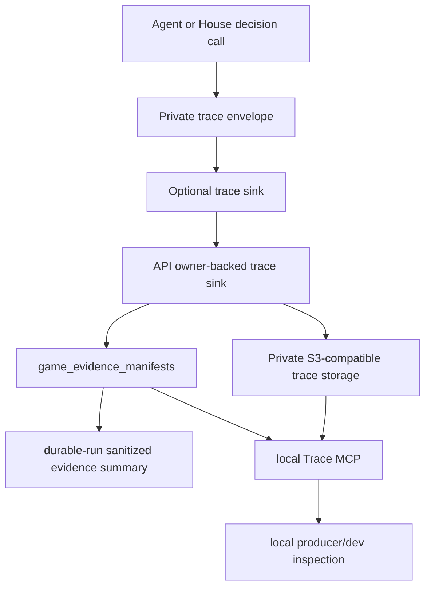
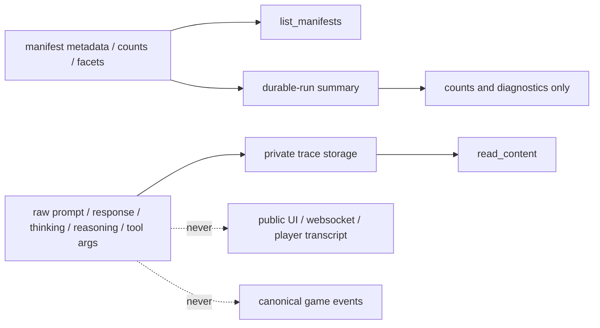
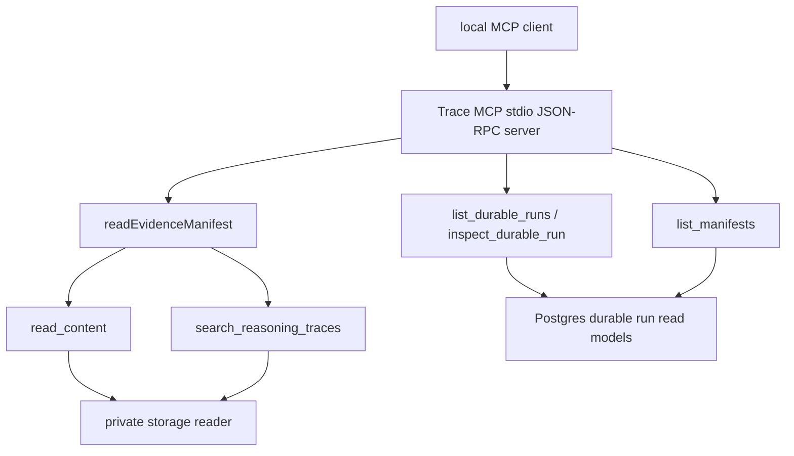

# feat: Add private trace writer and local Trace MCP

## Summary

Add the first API-backed private trace slice for Influence. Owner-backed API games will capture private decision-call traces, write the raw JSON/JSONL content to configured private storage, store only manifests and searchable counts in Postgres, and expose a local-dev Trace MCP for one-run inspection.

This is a producer/debug workflow for local model and game-quality work. It does not add product/admin MCP auth, releasable MCP packaging, a web admin UI, durable viewer catch-up, cross-run trace search, or enterprise storage parity.

---

## Problem Frame

Influence already separates public player dialogue, accepted canonical board facts, and private producer/debug artifacts. Simulations can expose `agent_turn` records, hidden `thinking`, native `reasoningContext`, Strategy Thread packet use, and House producer records through local JSONL plus the existing game MCP. API-backed durable runs now have owner epochs, canonical events, checkpoints, private evidence manifests, summary-only durable-run inspection, and an audited manifest-read path.

The missing shipping slice is raw trace persistence for API games. The current API can summarize that evidence manifests exist, but it does not write full prompts, raw model responses, tool arguments, emitted thinking, native reasoning context, or House/player decision metadata to private storage. The current local MCP reads simulation files, not Postgres durable runs or private trace content.

This plan adds that bridge without overbuilding the security or product surface. The private writer makes one weird API-backed run inspectable in local development, and the local Trace MCP makes that run easy to query from another local agent.

---

## Requirements Trace

**Private Trace Capture**

- R1. API-backed owner runs capture private trace content for decision calls that produce player, House, or producer decision artifacts. Covers origin R1, F1, AE1.
- R2. Captured traces include prompt input, raw provider response, emitted `thinking`, native `reasoningContext`, tool arguments or parsed JSON output, action name, actor, phase, round, owner epoch, model metadata, and canonical boundary metadata when known. Covers origin R2, AE1.
- R3. Strategy packet references and packet-use summaries are trace metadata only; they do not become public transcript, canonical game truth, or checkpoint resume authority. Covers origin R3, AE2.
- R4. Raw trace payloads are written as bounded JSON or JSONL content in configured private trace storage. Covers origin R4, AE1.
- R5. Postgres stores manifest rows, private storage pointers, integrity/count metadata, source pointers, and searchable facets only. Covers origin R5, F1.
- R6. Public, player-visible, websocket, and durable-run summary surfaces do not expose raw prompts, raw responses, `thinking`, `reasoningContext`, tool arguments, private storage keys, or private source-pointer internals. Covers origin R6, F4, AE5.
- R7. Trace write failures mark evidence diagnostics/degraded state without corrupting canonical event progress. Covers origin R7, AE6.

**Local Trace MCP**

- R8. The v1 Trace MCP is local-dev-only and runs from local repo/env access; it does not claim production MCP auth, product/admin API readiness, or packaged distribution. Covers origin R8, F2.
- R9. Local Trace MCP tools support `list_durable_runs`, `inspect_durable_run`, `list_manifests`, `read_content`, and `search_reasoning_traces` for one-run inspection. Covers origin R9-R13, F2, F3, AE3, AE4.
- R10. `list_manifests` returns a bounded manifest index with actor, action, phase, round, boundary, counts, timing, and integrity metadata sufficient to choose content. Covers origin R10, AE3.
- R11. `read_content` returns raw JSON/JSONL trace content for a selected manifest through the existing producer-only manifest access path. Covers origin R11, AE3.
- R12. `search_reasoning_traces` narrows by manifest metadata, reads matching trace content, and returns bounded matching records with manifest identity and content position. Covers origin R12, R13, AE4.
- R13. The existing simulation MCP remains usable; the local Trace MCP adds API durable-run inspection rather than replacing simulation-corpus workflows. Covers origin R16.

**Boundaries and Validation**

- R14. Durable viewer catch-up cursors, websocket client catch-up, public observable cursor APIs, cross-run search, product/admin web UI, MCP auth login, and releasable MCP packaging stay out of scope. Covers origin R14 and Scope Boundaries.
- R15. Phase-boundary packets, XState/runtime snapshots, checkpoint hydration inputs, and resume behavior stay out of scope unless a minimal current-head index is needed for trace navigation. Covers origin R15.
- R16. Local development must provide a local S3-compatible private evidence endpoint for trace validation, while staging/prod use Linode Object Storage through the same writer path; v1 validation is a small local writer/read smoke, not a broad parity harness. Covers origin R17, AE6.

---

## Key Technical Decisions

- **Trace at the decision-call boundary:** Capture where prompt and raw provider response still exist. `agent_turn` events are useful indexes, but they no longer have the full prompt/raw response and cannot satisfy the trace requirement alone.
- **Decision calls mean producer decision artifacts, not every LLM helper:** V1 includes calls that produce player or House decision records already logged as private/public/anonymous/diary/system `agent_turn` artifacts or canonical source pointers. Helper calls such as pre-lobby intent and ordinary House diary follow-up generation remain out until a later slice intentionally promotes them into producer decision records.
- **Use a trace sink contract, not API imports in engine code:** Engine agents and House interviewer code emit typed private trace records to an optional sink. API lifecycle supplies the sink for owner-backed runs and writes storage/manifests. The sink must never throw into gameplay; it reports degradation through API evidence health instead.
- **One decision trace per content object in v1:** Prefer a simple bounded JSON object per decision call, with `recordCount=1`, byte count, hash, and search facets in the manifest metadata. Segmenting many calls into phase-level JSONL files can follow when the corpus is large enough to justify batching.
- **Boundary metadata is honest when the final event is not known yet:** The trace envelope records the current canonical head at call time and source pointers when the phase runner provides them. It may attach a final event sequence only when that sequence is already known and persisted.
- **Trace persistence is awaited for observability, not for canonical acceptance:** The sink can await the private write so the caller knows whether a trace degraded, but trace failure resolves as a diagnostic. Canonical event acceptance, terminal writes, and suspension rules remain owned by the durable event/owner paths.
- **Private trace storage is a sibling to public upload storage:** Reuse S3-compatible SDK patterns where useful, but do not extend the profile-picture presigned upload helper or public-read ACL path. The writer must address private storage directly from API/server code.
- **Manifest reads remain the policy seam:** Local MCP content reads call the existing `readEvidenceManifest` path with a local producer accessor and a purpose label. This preserves existing RBAC/audit behavior without adding a chain-of-custody program, Object Lock, or new enterprise controls in v1.
- **Search is run-scoped and manifest-guided:** `search_reasoning_traces` first filters manifest metadata for one run, then opens only candidate content files. No cross-run index or global trace warehouse is introduced.
- **MCP is stdio/local-env first:** The server follows the existing local game MCP's JSON-RPC/stdio shape. Official MCP authorization guidance treats stdio differently from HTTP auth, which supports deferring login/package design until a real product/admin MCP exists.
- **Docs must keep the product posture clear:** This feature supports fun local model and strategy debugging for user/friends game quality. It should not read like an enterprise evidence retention program.

---

## High-Level Technical Design

### Capture and Storage Flow

### Visibility Boundaries

### Local Trace MCP Tools

The MCP server is local-only in this plan. It can load API DB/private-storage configuration from the developer's environment and call API service modules directly. It should not require a browser login, issue long-lived tokens, or create a production HTTP MCP endpoint.

---

## Implementation Units

### U1. Define Private Trace Envelope and Engine Sink

- **Goal:** Add a typed trace envelope and optional sink that can capture decision-call prompts and raw responses before they are reduced into agent-turn events.
- **Requirements:** R1, R2, R3, R5, R13, R15.
- **Dependencies:** Existing reasoning observability types and local model decision-call paths.
- **Files:**
  - `packages/engine/src/game-runner.types.ts`
  - `packages/engine/src/agent.ts`
  - `packages/engine/src/house-interviewer.ts`
  - `packages/engine/src/game-runner.ts`
  - `packages/engine/src/phases/phase-runner-context.ts`
  - `packages/engine/src/__tests__/agent-structured-output.test.ts`
  - `packages/engine/src/__tests__/game-engine.test.ts`
- **Approach:** Introduce a `PrivateDecisionTrace` envelope and a `privateTraceSink` option that agents and House interviewer code can call without importing API modules. The envelope should carry format version, game ID, owner epoch when supplied by the API sink context, actor, action, phase, round, model, prompt messages, raw provider response payload, parsed tool arguments or JSON output, emitted `thinking`, native `reasoningContext`, strategy packet use/reference metadata, current canonical head, source pointers, and timestamp. Hook the sink in the low-level decision helpers that still have full prompt/response access, while passing trace context from public decision methods so helper-only calls do not get captured accidentally. The sink result should be observable to tests but should not be required by public message logging or canonical event mutation.
- **Patterns to follow:** `callTool<T>` reasoning augmentation, `LLMHouseInterviewer` direct House calls, `AgentTurnEvent`, `agentTurnSourcePointer`, and the no `as any` discipline in `docs/reasoning-transcript-observability.md`.
- **Test scenarios:**
  - Covers AE1. Given `getVotes` receives a tool-call response with `thinking` and `reasoning_content`, the sink receives prompt messages, raw response content/tool-call arguments, emitted `thinking`, and `reasoningContext`.
  - Covers AE2. Given a live Strategy Thread packet exists and the model reports packet use, the trace includes the packet revision and use summary without adding packet content to canonical events.
  - Given `getMingleIntent`, `takeMingleTurn`, power action, council vote, endgame vote, strategic reflection, House room assignment, and House summary paths run, each eligible decision path can emit a trace with actor/action/phase/round.
  - Given a helper call such as pre-lobby planning is not configured as a producer decision artifact, the sink is not called for it.
  - Given no sink is provided, simulation and engine tests continue to pass and current JSONL artifacts remain unchanged.
  - Given a local provider uses JSON schema fallback, the trace still records the fallback prompt, parsed output, and native reasoning context when present.
- **Verification:** Engine tests prove trace capture is optional, typed, and positioned at the model-call boundary where prompt/raw response data exists.

### U2. Add Private Trace Storage Writer

- **Goal:** Write bounded private trace payloads to configured private S3-compatible storage and create manifests with integrity/count/search metadata.
- **Requirements:** R4, R5, R7, R16.
- **Dependencies:** U1 envelope shape; existing `game_evidence_manifests` schema and manifest validation.
- **Files:**
  - `packages/api/src/services/private-trace-storage.ts`
  - `packages/api/src/services/private-trace-writer.ts`
  - `packages/api/src/services/game-evidence.ts`
  - `packages/api/src/lib/storage.ts`
  - `packages/api/src/__tests__/private-trace-writer.test.ts`
  - `packages/api/src/__tests__/storage.test.ts`
- **Approach:** Add a private trace writer service that serializes one decision trace to JSON, enforces size limits, computes byte count, record count, and SHA-256 hash, writes the payload to the configured private bucket/key, and then calls `createEvidenceManifest`. The storage adapter should use S3-compatible Put/Get/Head calls with configurable endpoint and force path style so a repo-bootstrapped local S3 endpoint and Linode Object Storage share the same code path. Unit tests can use a fake adapter, but local validation must also include a small smoke against the real local object-store daemon. Manifest metadata should include only safe facets: format version, actor/action/phase/round, model name, prompt/message/tool byte counts, record count, trace hash, trace content type, current canonical head, and searchable strategy packet reference metadata.
- **Patterns to follow:** `validateEvidenceStoragePointer` for private bucket/key rules, `hashCanonicalEvent`/`sha256StableJson` style hashing, and `storage.test.ts` separation between public profile bucket and private evidence bucket.
- **Test scenarios:**
  - Covers AE1. Given a trace payload under the configured limit, the writer stores JSON content and creates a manifest with storage pointer, byte count, record count, and hash metadata.
  - Covers AE6. Given storage write fails, the result is a writer error/degraded evidence state and no partial manifest points at missing content.
  - Given manifest creation fails after storage succeeds, the run is marked evidence-degraded and the error is returned without throwing away canonical event state.
  - Given the public profile-picture bucket is configured, private trace writes reject that bucket and do not set public ACLs.
  - Given a key attempts path traversal, URL storage, or the wrong game prefix, pointer validation rejects it.
  - Given a trace exceeds the size budget, the writer records a bounded diagnostic rather than writing unbounded content.
- **Verification:** API tests prove private trace content writes are separate from public uploads and manifests contain enough integrity/count metadata for local inspection.

### U3. Wire API Owner-Backed Trace Capture

- **Goal:** Attach the private trace writer to API-backed durable runs while keeping canonical progress and public surfaces safe.
- **Requirements:** R1-R7, R15, R16.
- **Dependencies:** U1, U2.
- **Files:**
  - `packages/api/src/services/game-lifecycle.ts`
  - `packages/api/src/services/game-durable-run.ts`
  - `packages/api/src/services/game-ownership.ts`
  - `packages/api/src/__tests__/game-durable-run.test.ts`
  - `packages/api/src/__tests__/game-lifecycle.test.ts`
  - `packages/api/src/__tests__/websocket.test.ts`
- **Approach:** When an owner epoch is supplied, construct agents and the House interviewer with a trace sink bound to game ID, owner epoch, the private trace writer, and a bounded error handler. The sink may await the private writer so trace success/degradation is known near the decision call, but it must catch writer failures, mark evidence/kernel health degraded through existing owner health paths, and resolve without throwing into gameplay. Durable-run summaries should continue to expose counts and diagnostics only. Websocket and snapshot sanitizers should continue to strip hidden reasoning, and `agent_turn` events should remain ignored for live viewers.
- **Patterns to follow:** `durableEventSink`, `durableCheckpointSink`, `createEvidenceManifest` degradation behavior, `getDurableRunInspection` evidence summary, and `ws-manager.ts` sanitization tests.
- **Test scenarios:**
  - Covers AE1. Given an API mock-runner/trace fixture emits a decision trace, a private evidence manifest appears and durable-run inspection increments evidence counts without exposing raw content.
  - Covers AE6. Given the trace writer fails, game execution can still complete or suspend according to canonical durability rules, while kernel/evidence diagnostics name trace degradation.
  - Covers AE5. Given private traces exist, websocket message events and snapshots do not include raw prompt, raw response, `thinking`, `reasoningContext`, tool arguments, storage bucket, or storage key.
  - Given an owner epoch expires before trace manifest creation, the writer records a degraded result and does not create an active manifest for a stale owner.
  - Given a trace has only a current canonical head and no final event sequence yet, the manifest remains valid with nullable event boundary and source pointer metadata.
  - Given a decision later has an agent-turn source pointer, the manifest metadata includes that pointer without exposing it through public durable-run summaries.
- **Verification:** API lifecycle and durable-run tests prove trace capture is additive producer evidence, not a new canonical dependency or public data leak.

### U4. Add Trace Manifest, Content, and Search Services

- **Goal:** Provide API-side services that list run manifests, authorize manifest reads, read private trace content, and search trace records inside one run.
- **Requirements:** R8-R12, R16.
- **Dependencies:** U2, U3.
- **Files:**
  - `packages/api/src/services/private-trace-read-model.ts`
  - `packages/api/src/services/evidence-access.ts`
  - `packages/api/src/services/game-durable-run.ts`
  - `packages/api/src/__tests__/private-trace-read-model.test.ts`
  - `packages/api/src/__tests__/game-durable-run.test.ts`
- **Approach:** Add a read model over `game_evidence_manifests` that can list durable runs with trace counts, inspect one durable run by reusing `getDurableRunInspection`, list manifests by game ID/slug, read content for one manifest, and search reasoning traces. `read_content` should call `readEvidenceManifest` with a local producer accessor and purpose label, then fetch the private storage object and check recorded byte/hash metadata when present. `search_reasoning_traces` should filter manifests by safe facets before opening content, parse JSON/JSONL records, search selected fields, and return bounded matches with manifest ID, game ID, content offset or record index, actor/action/phase/round, and a short match preview.
- **Patterns to follow:** `readEvidenceManifest` authorization/audit path, `getDurableRunInspection` summary-only output, `GameMcpReadModel.searchLogs` bounded search shape, and JSONL trailing-partial tolerance from the simulation MCP.
- **Test scenarios:**
  - Covers AE3. Given a producer accessor lists manifests for a run, the response contains actor/action/phase/round/count/timing/facet metadata and no raw prompt/response content.
  - Given `read_content` is called by an accessor without producer/admin assumptions, the service returns the existing denied result and writes the existing read audit row.
  - Given a manifest is expired or redacted, `read_content` returns the existing expired/redacted result and does not read storage.
  - Given storage content byte count or hash mismatches manifest metadata, `read_content` returns an integrity diagnostic instead of raw content.
  - Covers AE4. Given multiple trace manifests exist for one run, `search_reasoning_traces` returns bounded matches with manifest identity and record position.
  - Given a query would require cross-run search, the service rejects or requires an explicit run ID/slug.
- **Verification:** Service tests prove the manifest/content split and local search behavior before MCP JSON-RPC is added.

### U5. Add Local Trace MCP Server

- **Goal:** Expose the API durable-run trace read model as a read-only local MCP server.
- **Requirements:** R8-R13.
- **Dependencies:** U4.
- **Files:**
  - `packages/api/src/trace-mcp/server.ts`
  - `packages/api/src/trace-mcp/read-model.ts`
  - `packages/api/src/__tests__/trace-mcp.test.ts`
  - `packages/api/package.json`
  - `README.md`
  - `DEVELOPMENT.md`
- **Approach:** Implement a small stdio JSON-RPC MCP server following the existing game MCP server shape. The server should advertise local-producer instructions, support `tools/list` and `tools/call`, validate inputs, and return bounded `content` JSON. Tools are `list_durable_runs`, `inspect_durable_run`, `list_manifests`, `read_content`, and `search_reasoning_traces`. The server should load DB/private-storage config from the local environment and call service modules directly rather than introducing a product/admin HTTP route. Add a package script such as `mcp:trace` in the API package. Keep the existing engine `mcp:game` untouched.
- **Patterns to follow:** `packages/engine/src/game-mcp/server.ts`, `packages/engine/src/game-mcp/read-model.ts`, `packages/engine/src/__tests__/game-mcp.test.ts`, and official MCP tools/stdio guidance.
- **Test scenarios:**
  - Covers AE3. Given MCP `tools/list`, the five trace tools are advertised with input schemas and local-producer descriptions.
  - Given `inspect_durable_run` is called with a known game ID or slug, the response returns the durable-run inspection summary from the API service.
  - Given `list_manifests` is called for a run, the response is bounded and excludes raw trace content.
  - Given `read_content` is called for an active trace manifest, the response returns raw JSON/JSONL content through the content-read service.
  - Given `search_reasoning_traces` is called with actor/action/phase/query filters, the response returns bounded cited matches.
  - Given an unknown tool, malformed input, or mutation-shaped request, the server returns a JSON-RPC error and performs no writes.
  - Given the existing engine game MCP tests run, the simulation MCP still lists/searches simulation artifacts as before.
- **Verification:** MCP tests demonstrate a local client can inspect one API durable run and read trace content without changing gameplay or adding production auth claims.

### U6. Update Privacy Guards, Docs, and Local Smoke Guidance

- **Goal:** Keep public surfaces private-safe and document the new local API trace workflow alongside existing simulation workflows.
- **Requirements:** R6, R13-R16.
- **Dependencies:** U1-U5.
- **Files:**
  - `packages/api/src/__tests__/admin-routes.test.ts`
  - `packages/api/src/__tests__/websocket.test.ts`
  - `docs/reasoning-transcript-observability.md`
  - `docs/local-model-evaluation.md`
  - `DEVELOPMENT.md`
  - `README.md`
  - `CONCEPTS.md`
- **Approach:** Add or extend privacy sentinel tests around durable-run summaries, websocket output, and MCP list/search responses so raw trace content is only returned through `read_content`. Update docs to explain when to use simulation `mcp:game` versus API `mcp:trace`, how local S3-compatible private storage is configured and bootstrapped, which trace fields are expected, and why production MCP auth/package distribution is deferred. Keep validation guidance lightweight: service/unit tests plus a small local writer/read smoke with a local S3-compatible endpoint, not a local/staging/prod parity harness.
- **Patterns to follow:** `docs/reasoning-transcript-observability.md` review checklist, `docs/local-model-evaluation.md` local provider workflow, and current README/DEVELOPMENT MCP sections.
- **Test scenarios:**
  - Covers AE5. Given private traces exist, admin durable-run inspection still serializes only sanitized evidence counts and diagnostics.
  - Given local Trace MCP `list_manifests` or `search_reasoning_traces` runs, responses include match previews/facets but not full raw payload unless `read_content` is explicitly called.
  - Given docs are searched for product/admin MCP claims, they describe the server as local-dev-only and defer auth login/packaging.
  - Given docs describe storage validation, they call for a small local writer/read smoke and do not reintroduce a parity harness or Object Lock as v1 requirements.
  - Given `CONCEPTS.md` already defines Private trace content and Local Trace MCP, implementation docs link to those terms without turning the glossary into a spec.
- **Verification:** Documentation and sentinel tests make the intended producer/debug boundary visible to implementers and reviewers.

---

## Scope Boundaries

### In Scope

- Decision-call private trace envelopes for API-backed owner runs.
- Direct private storage writes for bounded JSON/JSONL trace payloads.
- Manifest metadata, integrity/count metadata, source pointers, and searchable facets in Postgres.
- Strategy packet references or compact usage summaries as linked private evidence.
- Local stdio Trace MCP tools for one-run durable-run inspection, manifest listing, raw content reads, and run-scoped trace search.
- Focused writer/read, MCP, authorization/audit, privacy, and local smoke tests.

### Deferred for Later

- Capturing every model call.
- Cross-run trace search.
- Durable viewer catch-up cursors and websocket client catch-up.
- Product/admin web UI.
- MCP auth login and releasable MCP packaging.
- Phase-boundary packets, XState/runtime snapshots, checkpoint hydration inputs, and resume behavior.
- Phase-level JSONL batching or a trace warehouse if one-decision objects become too many.

### Outside This Slice

- Object Lock, legal-hold workflow, or chain-of-custody program.
- Local/staging/production storage parity harness beyond a small writer/read smoke.
- Making MCP tools drive gameplay or mutate game state.

---

## System-Wide Impact

- **Engine/API boundary:** The engine gains an optional producer trace sink, but API storage stays in API services.
- **Storage:** Private trace content uses server-side S3-compatible storage, not presigned public upload URLs.
- **Read models:** Durable-run summaries remain aggregate/sanitized while the local Trace MCP gets explicit content reads.
- **Local workflows:** Local model evaluation gains an API-backed trace path alongside simulation JSONL/MCP inspection.
- **Privacy posture:** Raw hidden reasoning becomes more durable for API runs, so sentinel tests around public surfaces become more important.

---

## Risks and Dependencies

- **Capture can become too broad:** Hook only producer decision artifacts in v1. Test that helper calls stay out unless intentionally promoted.
- **Boundary metadata may look more precise than it is:** Store current canonical head and source pointers honestly; only attach final event sequence when known.
- **Trace writes can slow games:** Keep payloads bounded and treat write failure as evidence degradation, not canonical event failure.
- **Unawaited trace writes can be lost:** Keep the sink result observable and drained enough for tests and terminal completion, while still making failures non-fatal for canonical progress.
- **Object storage config can drift:** Use one S3-compatible writer path with fake-adapter tests and one small local smoke. Avoid a full parity harness in this slice.
- **MCP output can overwhelm model context:** Default `limit`, `maxBytes`, and preview sizes on list/search/read tools, with explicit opt-in parameters for larger reads.
- **Auth story can be overclaimed:** Keep the MCP local stdio/local-env only and document production auth/package work as deferred.

---

## Acceptance Examples

- AE1. Given an API-backed decision call produces prompt, raw response, emitted `thinking`, native `reasoningContext`, tool arguments, action, actor, phase, and round, when the writer records it, then raw content lands in private storage and durable-run summaries expose only manifest/count metadata.
- AE2. Given a decision used a Strategy Thread packet, when `read_content` returns the trace, then the trace identifies the packet revision/use summary without turning the packet into public transcript or canonical truth.
- AE3. Given a local durable run has private trace manifests, when a producer uses the Trace MCP, then they can inspect the run, list manifests, and read selected trace content.
- AE4. Given a run has many trace manifests, when the producer searches reasoning traces for one actor/action/query, then the MCP returns bounded matches with manifest identity and content position.
- AE5. Given public viewer, websocket, or durable-run summary paths read a game with private traces, when responses serialize, then raw prompts, responses, `thinking`, `reasoningContext`, tool arguments, storage keys, and source-pointer internals are absent.
- AE6. Given the private storage write path fails during local smoke or runtime capture, when a trace write is attempted, then evidence diagnostics are degraded without treating trace storage as canonical gameplay failure.

---

## Documentation and Operational Notes

- Add a local API Trace MCP section beside the simulation MCP docs, with clear "simulation corpus" versus "API durable run" selection guidance.
- Document local S3-compatible private storage as required local validation setup: private bucket, custom endpoint, bootstrap script, local smoke command, and no public ACL path.
- Keep docs explicit that this is not production MCP auth or a web admin UI.
- Update the reasoning observability checklist so API-backed traces join `--chatty`, turns JSONL, and simulation MCP as producer debugging surfaces.
- Keep `CONCEPTS.md` glossary-only; it already has `Private trace content` and `Local Trace MCP`.

---

## Sources and Research

- Origin requirements: `docs/brainstorms/2026-06-15-private-trace-writer-mcp-requirements.md`
- Ideation artifact: `docs/ideation/2026-06-15-private-evidence-mcp-catchup-ideation.html`
- Prior durable run plan: `docs/plans/2026-06-13-002-feat-durable-game-run-kernel-plan.md`
- Prior durable read model plan: `docs/plans/2026-06-14-001-feat-durable-event-read-model-plan.md`
- Strategy observability learning: `docs/solutions/architecture-patterns/agent-strategy-observability-spine.md`
- Reasoning observability docs: `docs/reasoning-transcript-observability.md`
- Local model docs: `docs/local-model-evaluation.md`
- Existing API evidence schema: `packages/api/src/db/schema.ts`
- Existing manifest writer/access path: `packages/api/src/services/game-evidence.ts`, `packages/api/src/services/evidence-access.ts`
- Durable-run summary path: `packages/api/src/services/game-durable-run.ts`
- API lifecycle runner: `packages/api/src/services/game-lifecycle.ts`
- Public websocket sanitizer: `packages/api/src/services/ws-manager.ts`
- Public upload storage helper: `packages/api/src/lib/storage.ts`
- Engine decision boundary: `packages/engine/src/agent.ts`, `packages/engine/src/house-interviewer.ts`
- Existing simulation MCP: `packages/engine/src/game-mcp/server.ts`, `packages/engine/src/game-mcp/read-model.ts`
- MCP Tools specification: https://modelcontextprotocol.io/specification/2025-06-18/server/tools
- MCP Authorization specification: https://modelcontextprotocol.io/specification/2025-06-18/basic/authorization
- Akamai/Linode Object Storage overview: https://techdocs.akamai.com/cloud-computing/docs/object-storage
- Akamai/Linode bucket policy docs: https://techdocs.akamai.com/cloud-computing/docs/define-access-and-permissions-using-bucket-policies
