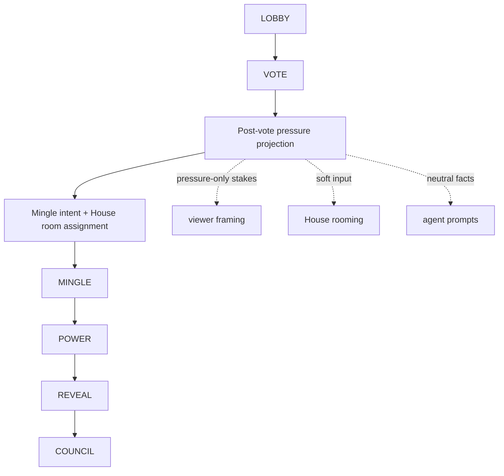
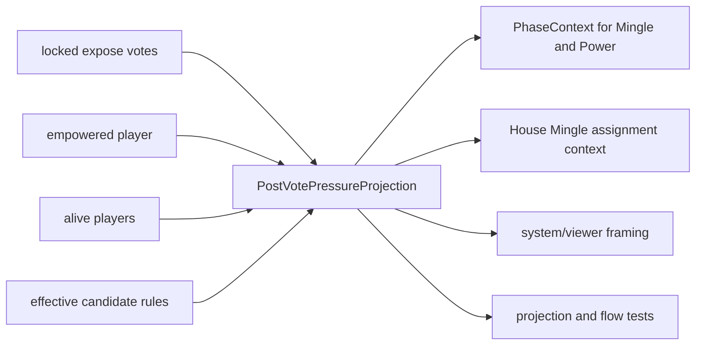
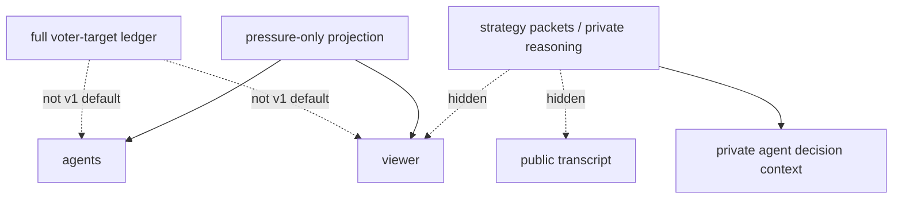

# feat: Add post-vote Mingle drama loop

## Summary

Move the standard Influence round into a vote-locked social shape: Lobby, Vote, Mingle, Power, Reveal, Council. The implementation should derive one post-vote pressure projection and feed it to agent Mingle context, House rooming, and viewer framing while keeping RUMOR and Power Lobby out of the normal live loop.

This is a product gameplay change, not a new evidence/admin system. It preserves agent agency by giving leverage facts without scripting pleading, flattery, target naming, or confrontation rooms.

---

## Problem Frame

The current normal loop puts Mingle before Vote, so private-room conversations happen before the game has created hard pressure. Agents can speculate, but they are not reacting to a locked power winner, effective at-risk players, or the shield uncertainty that makes Power socially interesting.

The old optional Power Lobby experiment proves that locked-vote pressure is useful, but it expresses the idea as another public-speaking phase with much stronger prompt pressure than the product direction wants. The better v1 shape is to move that state into Mingle: the vote is locked, agents know enough about fallout to negotiate, and Power still decides whether the final danger shifts.

RUMOR competes with that cleaner beat. Anonymous rumors can remain a legacy replay and explicit experiment concern, but the normal live game should not require a separate system-driven rumor phase between social play and the vote.

---

## Requirements Trace

**Round Shape**

- R1. Standard live rounds transition from Lobby to Vote, then Mingle, then Power, Reveal, and Council. Covers origin R1, R3, R7, F1, AE1.
- R2. Post-vote Mingle runs in every standard round where Mingle is available, including round 1. Covers origin R2, F1, AE1.
- R3. Vote results are locked before post-vote Mingle starts, and post-vote Mingle never reopens or mutates the completed vote. Covers origin R3, R4, AE1.
- R4. The normal live loop does not enter RUMOR as a required phase. Covers origin R5, AE1.
- R5. Historical replay and explicit experiment paths tolerate RUMOR records without presenting RUMOR as current normal gameplay. Covers origin R6.
- R6. Reveal remains a presentation beat after Power, not a replacement social phase. Covers origin R7, F4.

**Post-Vote Pressure Context**

- R7. The engine derives a typed post-vote pressure projection after Vote and before Mingle. Covers origin R8-R12, F2, AE2, AE3.
- R8. The projection names the empowered player, each agent's own pressure status, current effective at-risk players, and plausible replacement-risk players if a shield is granted. Covers origin R8, AE2.
- R9. The projection distinguishes raw expose pressure from effective council danger. Covers origin R9, AE3.
- R10. The empowered player is never presented as effectively at risk for council in the same round, even if raw expose votes targeted them. Covers origin R10, AE3.
- R11. V1 does not expose the full voter-target ledger or personal voter edges by default. Covers origin R11, R12, AE2.

**Mingle Behavior**

- R12. Mingle prompts render pressure facts neutrally and do not command agents to plead, flatter, bargain, or name targets. Covers origin R13, R14, F2, AE4.
- R13. Agents remain free to appeal, ask for protection, redirect pressure, court the empowered player, stay social, stay guarded, stay silent, or refuse to engage. Covers origin R14, R24, R25, AE4, AE7.
- R14. Current Mingle prompt copy no longer frames Mingle as planning for a later vote. Covers origin R15.
- R15. Strategy packets and strategic assessments can inform private agent response to pressure, but they do not become player-visible instructions or public evidence. Covers origin R16.

**House Rooming**

- R16. House Mingle room assignment may use empowered, at-risk, and replacement-risk facts as soft inputs. Covers origin R17, F3, AE5.
- R17. Room assignment does not guarantee that empowered and at-risk players are paired every round. Covers origin R18, R19, AE5.
- R18. Existing deterministic room repair and fallback behavior remains valid when House output is missing or invalid. Covers origin R19.

**Viewer and Validation**

- R19. Viewer framing communicates that the vote is locked while Power fallout is still pending. Covers origin R20, F4, AE6.
- R20. Viewer surfaces show pressure-only stakes without revealing hidden reasoning, strategy packets, or private producer/debug evidence. Covers origin R21, R22, AE6.
- R21. Validation checks phase flow, pressure projection correctness, prompt neutrality, rooming inputs, viewer pacing, and behavior variety. Covers origin R23-R26, F5, AE7.
- R22. Target naming is never treated as mandatory success for every agent or every turn. Covers origin R25, AE7.
- R23. Player-facing web copy, rules pages, docs, simulation guidance, and observability docs move with the rule change. Covers origin R26.
- R24. Simulation outputs, canonical event projection replay, durable read models, and checkpoint hydration-passport evidence remain compatible with Vote -> Mingle -> Power ordering. Covers F5 and implementation-risk fallout from recent durability work.

---

## Key Technical Decisions

- **Use one post-vote pressure projection:** Derive a single typed projection after Vote and pass it through engine context, House rooming, transcript/viewer framing, and tests. This avoids prompt-only summaries drifting from the candidate logic used later in Power.
- **Compute pressure without mutating Power:** The projection should mirror effective candidate rules, including empowered-player exclusion and shield displacement, but it must not set the power action, shield state, council candidates, or canonical Power outcome.
- **Move the normal phase machine, not just prompts:** The engine's standard state machine should become Lobby -> Vote -> Mingle -> Power -> Reveal -> Council. Tests and docs should stop implying RUMOR is still the normal social step.
- **Extend Mingle instead of adding a drama subsystem:** Existing Mingle intent, room assignment, room-turn, and strategy packet surfaces are the right place for the new pressure facts. No separate "drama mode" or Power Lobby replacement phase is introduced.
- **Treat House rooming as soft pressure-aware:** House gets enough context to create plausible negotiation opportunities, but deterministic repair/fallback remains responsible for valid assignments and there is no hard pairing algorithm for confrontations.
- **Quarantine Power Lobby as an explicit experiment only:** The normal path should not call `getPowerLobbyMessage`. Simulator variants may remain explicit if they are still useful for comparison, but docs and default configs should not present Power Lobby as product behavior.
- **Keep RUMOR legacy-tolerant:** The `Phase.RUMOR` enum, replay labels, and old transcript handling can stay where needed for compatibility, but normal game flow, player-facing rules, and current validation should not depend on RUMOR.
- **Validate behavior mix qualitatively with structured artifacts:** Tests should prove the flow and context are right; sample-run review should inspect whether pressure creates varied behavior. The plan avoids a brittle numerical drama score or target-naming quota.

---

## High-Level Technical Design

### Standard Round Flow

### Pressure Projection Inputs and Consumers

### Visibility Boundary

---

## Implementation Units

### U1. Reorder the Standard Phase Machine

- **Goal:** Make Vote the pressure event before Mingle in normal live rounds and remove RUMOR from the normal transition path.
- **Requirements:** R1-R6, R21, R23.
- **Dependencies:** Current `MINGLE` terminology and phase-machine tests.
- **Files:**
  - `packages/engine/src/phase-machine.ts`
  - `packages/engine/src/game-runner.ts`
  - `packages/engine/src/__tests__/game-engine.test.ts`
  - `packages/engine/src/__tests__/full-game.test.ts`
  - `packages/engine/src/__tests__/canonical-events.test.ts`
- **Approach:** Update the standard XState transitions so Lobby completes to Vote, Vote completes to Mingle after `VOTES_TALLIED`, and Mingle completes to Power. Keep RUMOR as a known enum/state only if an explicit experiment or legacy replay path still needs it; it should not be reached by the normal live loop. Ensure the runner dispatch order follows the machine rather than relying on stale phase assumptions, and preserve existing endgame/diary transitions after Council.
- **Patterns to follow:** Current phase-machine event guards, `emitPhaseStarted`/`emitPhaseEnded`, canonical phase boundary tests, and the current `MINGLE` over `WHISPER` discipline.
- **Test scenarios:**
  - Covers AE1. A full normal round emits Lobby, Vote, Mingle, Power, Reveal, Council without emitting RUMOR.
  - Round 1 follows the same post-vote Mingle shape when enough players are alive for Mingle.
  - Vote tally still sets the empowered player before Mingle context is built.
  - Mingle skip behavior for too few alive players still proceeds to Power without re-entering RUMOR.
  - Existing endgame transitions still fire after Council and are not accidentally delayed by the reordered normal loop.
  - Historical or explicit experiment RUMOR fixtures remain parseable if RUMOR compatibility is retained.
- **Verification:** Engine phase tests prove the normal gameplay order changed at the state-machine level, not only in prompt text.

### U2. Add Post-Vote Pressure Projection

- **Goal:** Derive pressure-only post-vote facts that match council candidate rules without mutating the Power outcome.
- **Requirements:** R7-R11, R19-R21.
- **Dependencies:** U1 vote-before-Mingle ordering.
- **Files:**
  - `packages/engine/src/post-vote-pressure.ts`
  - `packages/engine/src/game-state.ts`
  - `packages/engine/src/game-runner.types.ts`
  - `packages/engine/src/context-builder.ts`
  - `packages/engine/src/__tests__/post-vote-pressure.test.ts`
  - `packages/engine/src/__tests__/game-engine.test.ts`
- **Approach:** Introduce a pure helper that takes locked expose scores, alive players, empowered ID, and current round state, then returns raw expose pressure plus effective danger. The projection should include current provisional candidates, per-player status summaries, and replacement-risk candidates that could become exposed if the empowered player grants a shield. It should mirror `determineCandidates` semantics for empowered exclusion, shield replacement, and fallback candidates, but it must not call `setPowerAction`, grant a shield, mutate `councilCandidates`, or emit canonical events. `ContextBuilder` should carry the projection into Mingle and Power contexts when available.
- **Patterns to follow:** `gameState.getExposeScores`, the non-empowered candidate-pool logic in Power, `determineCandidates`, and existing `PhaseContext` typed optional fields.
- **Test scenarios:**
  - Covers AE2. A Mingle context after Vote includes empowered player, own status, current at-risk players, and replacement-risk players.
  - Covers AE3. Raw expose votes against the empowered player appear only as raw pressure and never as effective council danger.
  - Given a protect action could shield one current candidate, the projection identifies plausible replacement risk without applying the shield.
  - Given expose votes are tied, the projection uses the same deterministic ordering or tie policy as the Power candidate path.
  - Given fewer than two non-empowered players remain, projection behavior matches existing candidate fallback/endgame assumptions.
  - Given no vote has been tallied, the projection is absent rather than partially fabricated.
- **Verification:** Projection tests prove that the pressure facts agents see are consistent with later Power/council mechanics.

### U3. Feed Pressure into Mingle Agent Context and Prompts

- **Goal:** Make agents understand the locked-vote stakes during Mingle without scripting their emotional or strategic response.
- **Requirements:** R12-R15, R21, R22.
- **Dependencies:** U2 projection and U1 phase order.
- **Files:**
  - `packages/engine/src/agent.ts`
  - `packages/engine/src/context-builder.ts`
  - `packages/engine/src/game-runner.types.ts`
  - `packages/engine/src/__tests__/agent-structured-output.test.ts`
  - `packages/engine/src/__tests__/mingle-terminology.test.ts`
- **Approach:** Render a compact post-vote pressure block in Mingle-specific user prompts and strategy context. The block should state the vote is locked, name the empowered player, describe the agent's own status, list current effective danger, and mention shield-displacement uncertainty. Update Mingle intent and turn prompts so seeking players, avoiding players, room purpose, opening asks, and optional target naming can naturally respond to pressure. Remove stale wording that says Mingle is preparation for a later vote. Keep strategy packet use private and keep the full voter-target ledger out of default prompt context.
- **Patterns to follow:** `buildUserPrompt`, `getMingleIntent`, `takeMingleTurn`, `sendRoomMessage`, `strategyPacketUseResponse`, and existing Mingle intent schema.
- **Test scenarios:**
  - Covers AE4. An at-risk agent's Mingle prompt contains pressure facts but does not require pleading, flattery, bargaining, or target naming.
  - An empowered agent's Mingle prompt identifies power responsibility and pending shield leverage without telling them whom to protect.
  - A replacement-risk agent can see that they may become at risk if a shield is granted.
  - No Mingle prompt includes the full voter-target ledger or "who exposed you" by default.
  - Mingle prompts no longer describe the phase as planning for a future vote.
  - Strategy packet use remains an internal/private signal and does not become public transcript copy.
- **Verification:** Prompt and structured-output tests prove pressure is visible as state, not command language.

### U4. Make House Rooming Softly Pressure-Aware

- **Goal:** Let House use post-vote pressure when assigning Mingle rooms without making every round a forced confrontation pattern.
- **Requirements:** R16-R18, R21.
- **Dependencies:** U2 projection and U3 Mingle intent context.
- **Files:**
  - `packages/engine/src/house-interviewer.ts`
  - `packages/engine/src/phases/mingle.ts`
  - `packages/engine/src/types.ts`
  - `packages/engine/src/__tests__/game-engine.test.ts`
  - `packages/engine/src/__tests__/mingle-terminology.test.ts`
- **Approach:** Extend House Mingle assignment context with pressure summaries for empowered, current at-risk, replacement-risk, and each player's hidden Mingle intent. Update the House prompt to treat pressure as one rooming input alongside seek/avoid/preferred-size/purpose signals. Preserve validator/repair behavior so House cannot duplicate players, omit players, or assign invalid rooms. Avoid any deterministic rule that always pairs the empowered player with at-risk players.
- **Patterns to follow:** `HouseMingleAssignmentContext`, `assignMingleRooms`, `allocateRooms`, assignment diagnostics, and repair notes.
- **Test scenarios:**
  - Covers AE5. House assignment prompt receives pressure context after Vote and before Mingle.
  - Invalid House output is repaired exactly as before, including duplicates, omitted players, and invalid room IDs.
  - When House is unavailable or returns no assignment, deterministic fallback still creates valid rooms using Mingle intents.
  - Repeated seeded room assignment tests do not guarantee the same empowered-at-risk pairing every round.
  - Room allocation diagnostics can explain pressure-informed assignments without exposing hidden strategy packets.
- **Verification:** Rooming tests prove pressure is an input to House, not a fragile placement algorithm.

### U5. Update Viewer Framing and Pacing for Vote -> Mingle -> Power

- **Goal:** Make the live viewer and replay surfaces understand the new pressure beat without exposing private evidence.
- **Requirements:** R19-R21, R23.
- **Dependencies:** U1 normal phase order and U2 pressure projection.
- **Files:**
  - `packages/api/src/services/viewer-event-pacer.ts`
  - `packages/api/src/__tests__/viewer-event-pacer.test.ts`
  - `packages/web/src/app/games/[slug]/game-viewer.tsx`
  - `packages/web/src/app/games/[slug]/components/constants.ts`
  - `packages/web/src/app/games/[slug]/components/vote-display.tsx`
  - `packages/web/src/app/games/[slug]/components/dramatic-replay-viewer.tsx`
  - `packages/web/src/__tests__/constants.test.ts`
- **Approach:** Update live pacing assumptions from the old Mingle -> RUMOR -> Vote -> Power rhythm to Vote -> Mingle -> Power. Add or reuse a system transcript/framing event that summarizes pressure-only stakes for viewers: vote locked, empowered player known, current danger known, shield fallout pending. Adjust phase labels/flavors and overlay timing so Mingle after Vote feels like the negotiation window rather than a generic private-room prelude. Keep RUMOR display constants and replay tolerance for historical transcripts, but remove RUMOR from current-path copy and paced-order expectations.
- **Patterns to follow:** `ViewerEventPacer` hold config, phase transition overlay flavor selection, `HOUSE_INTROS`, `PHASE_TO_ROOM`, and existing transcript sanitization boundaries.
- **Test scenarios:**
  - Covers AE6. A live paced order preserves Lobby, Vote, Mingle, Power, Reveal, Council in that order.
  - The vote-end hold no longer assumes Power is the immediate next phase when Mingle is the next visible beat.
  - Leaving Mingle before Power still gives viewers time to read room messages.
  - Viewer framing names locked vote and pending Power fallout without showing full voter-target ledger, private reasoning, or strategy packet content.
  - RUMOR-labeled historical entries still render without crashing replay or constants tests.
  - Vote display and dramatic replay do not depend on normal RUMOR messages to explain current vote fallout.
- **Verification:** API and web tests prove the watcher sees the new round shape coherently while legacy RUMOR data remains tolerated.

### U6. Quarantine Power Lobby and Simulator Variants

- **Goal:** Prevent the old Power Lobby experiment from competing with post-vote Mingle in default runs while keeping explicit comparison paths honest.
- **Requirements:** R1, R4-R6, R12-R15, R21, R23.
- **Dependencies:** U1-U5.
- **Files:**
  - `packages/engine/src/phases/power.ts`
  - `packages/engine/src/agent.ts`
  - `packages/engine/src/simulate.ts`
  - `packages/engine/src/__tests__/simulate-config.test.ts`
  - `packages/engine/src/__tests__/game-engine.test.ts`
- **Approach:** Ensure `powerLobbyAfterVote` is false for normal configs and is only enabled by explicit simulator variants, if those variants remain. If keeping the variants creates confusing overlap, rename or document them as legacy comparison experiments rather than product recommendations. The empowered action prompt can still receive post-vote pressure context, but public Power Lobby messages should not run in standard games. Remove or soften prompt copy that commands hard public target naming in paths now superseded by post-vote Mingle.
- **Patterns to follow:** Existing simulation variant registry, `POWER_LOBBY_VARIANTS`, `MINGLE_VARIANTS`, and `getPowerLobbyMessage` optional interface.
- **Test scenarios:**
  - Normal simulation config does not enable public Power Lobby.
  - Explicit legacy/comparison variants still set `powerLobbyAfterVote` only when deliberately selected, or tests are removed if the variants are retired.
  - Standard game-engine tests never log `POWER LOBBY` in the normal path.
  - Empowered Power action still receives enough candidate/pressure context after Mingle to choose protect or eliminate.
  - Documentation and help output do not recommend Power Lobby as the normal way to get post-vote drama.
- **Verification:** Variant tests keep the experimental seam intentional instead of letting it shadow the new product loop.

### U7. Update Docs, Rules, and Behavior Validation Guidance

- **Goal:** Make the rule change understandable to players in the shipped web app, maintainers, local model evaluators, and future implementation agents.
- **Requirements:** R21-R23.
- **Dependencies:** U1-U6.
- **Files:**
  - `packages/web/src/app/rules/page.tsx`
  - `packages/web/src/components/home/homepage-hero.tsx`
  - `packages/web/src/app/about/page.tsx`
  - `packages/web/src/app/globals.css`
  - `README.md`
  - `DEVELOPMENT.md`
  - `docs/rules-page-content.md`
  - `docs/reasoning-transcript-observability.md`
  - `docs/local-model-evaluation.md`
  - `CONCEPTS.md`
  - `packages/engine/src/simulate.ts`
- **Approach:** Update the actual web-facing rules and marketing copy first, then the markdown docs. The shipped `/rules` page should describe Lobby, Vote, Mingle, Power, Reveal, Council and explain that Mingle happens after the vote locks while Power fallout is still pending. The homepage/about copy should stop advertising Rumor as a normal live phase and should use current Mingle terminology. Keep RUMOR styling and type support only where needed for old replay/legacy data. Add concise vocabulary for post-vote pressure projection if needed, linking it to current Mingle and strategy observability terms rather than introducing a heavy new subsystem. Update local model evaluation guidance so sample-run review looks at behavior variety: appeals, protection requests, deal attempts, redirection, empowered-player courtship, tactical silence, and refusal. Keep validation qualitative and artifact-driven, not a numeric drama score.
- **Patterns to follow:** `CONCEPTS.md` glossary style, `docs/reasoning-transcript-observability.md` observability checklist, and `docs/local-model-evaluation.md` simulation examples.
- **Test scenarios:**
  - The web `/rules` page no longer describes RUMOR as a normal live-loop phase.
  - The homepage/about web copy no longer advertises Whisper/Rumor as the current normal round order.
  - Web rules explain that vote is locked before Mingle and Power fallout remains pending.
  - Markdown docs no longer describe RUMOR as a normal live-loop phase.
  - Local model guidance says target naming is optional and behavior mix matters more than a quota.
  - Simulation docs clarify which variants are current product paths versus legacy/experiment paths.
  - If `CONCEPTS.md` is updated, it stays glossary-level rather than becoming a second spec.
- **Verification:** Web page tests or static copy assertions plus targeted search for stale RUMOR/Power Lobby product wording keep shipped player-facing rules and developer guidance aligned.

### U8. Verify Simulation, Reducer, and Hydration Compatibility

- **Goal:** Make sure the new phase order works in simulation artifacts and recent durable event/checkpoint read paths.
- **Requirements:** R1-R7, R19-R24.
- **Dependencies:** U1-U7.
- **Files:**
  - `packages/engine/src/simulate.ts`
  - `packages/engine/src/game-mcp/read-model.ts`
  - `packages/engine/src/game-projection.ts`
  - `packages/engine/src/__tests__/simulation-instrumentation.test.ts`
  - `packages/engine/src/__tests__/canonical-event-replay.test.ts`
  - `packages/api/src/services/game-event-read-model.ts`
  - `packages/api/src/services/game-projection-read-model.ts`
  - `packages/api/src/services/checkpoint-hydration-passport.ts`
  - `packages/api/src/__tests__/game-event-read-model.test.ts`
  - `packages/api/src/__tests__/game-projection-read-model.test.ts`
  - `packages/api/src/__tests__/checkpoint-hydration-passport.test.ts`
- **Approach:** Treat the canonical reducer and hydration passport as compatibility surfaces, not as places to add drama state. The existing canonical projection should accept vote events before `mingle.rooms_allocated`, preserve vote tally and empowered state while room allocations arrive, then accept Power and Council events normally. Simulation progress logs, turns JSONL, canonical event logs, and the local game MCP should continue to use phase labels as emitted; variant naming and docs should be updated only where they imply the old social order. Checkpoint/hydration tests should cover a real runner phase-boundary capsule under the new order so runtime snapshot actor witness, projection summary, transcript watermark, and event-log replay still agree.
- **Patterns to follow:** `applyCanonicalEvent`, `getPersistedGameProjection`, `validatePersistedGameEventRows`, `deriveHydrationPassport`, simulation JSONL source pointers, and the current no-resume hydration-passport boundary.
- **Test scenarios:**
  - A simulation run writes progress, turns, and canonical event logs in Lobby, Vote, Mingle, Power order without breaking the local game MCP read model.
  - Canonical projection replay accepts `vote.cast` and `vote.empowered_set` before `mingle.rooms_allocated`, then later accepts `power.action_set` and `power.candidates_resolved`.
  - Durable projection summaries after a post-vote Mingle boundary still include vote state, empowered player, room allocations, and the correct latest canonical phase.
  - A real GameRunner checkpoint after the reordered boundary can still earn the same hydration-passport stamps when event log, projection, runtime snapshot, transcript cursor, and token cursor evidence are valid.
  - Hydration-passport tests fail closed if checkpoint phase/projection phase diverge after the reorder.
  - No pressure projection, strategy packet, or private reasoning content is promoted into canonical events or hydration-passport public summaries.
- **Verification:** Reducer, MCP, simulation, and passport tests prove the new order is replayable and inspectable without changing the canonical truth model.

---

## Scope Boundaries

### In Scope

- Normal live-round order: Lobby, Vote, Mingle, Power, Reveal, Council.
- Post-vote pressure projection after locked vote and before Mingle.
- Round-1 post-vote Mingle when Mingle is otherwise available.
- Neutral Mingle prompts that expose pressure facts without scripting drama.
- Soft pressure-aware House rooming.
- Viewer/pacer updates for Vote -> Mingle -> Power.
- Explicit legacy or experiment tolerance for RUMOR and Power Lobby artifacts.
- Simulation, canonical reducer, durable read-model, and hydration-passport compatibility checks.
- User-facing web rules/home/about copy updates.
- Focused engine/API/web tests and sample-run validation guidance.

### Deferred for Later

- Full voter-target ledger visibility.
- Personal voter-edge disclosure such as "who exposed you".
- A replacement anonymous-rumor product surface.
- Deterministic confrontation rooms or mandatory empowered-at-risk pairings.
- A formal behavior-scoring model for "drama".
- Reworking all historical replay UX beyond making old RUMOR records tolerated.
- Redesigning every simulator experiment variant after the normal path changes.

### Outside This Slice

- Making hidden reasoning, strategy packets, or producer/debug evidence player-visible.
- Adding a new player-speaking Power Lobby to normal gameplay.
- Changing Council voting rules, shield rules, or elimination math beyond pure pressure projection.
- Durable run, private trace, MCP, or storage work.

---

## System-Wide Impact

- **Engine phase order:** Normal phase progression changes, and tests that manually advance phases must follow the new sequence.
- **Agent prompts:** Mingle becomes post-vote pressure negotiation, so stale "prepare for the vote" language must be removed.
- **House rooming:** House receives richer context for room assignment, but output validation and repair remain the trust boundary.
- **Viewer pacing:** Live viewers need a suspense beat between locked Vote and pending Power, not a direct Vote -> Power pause.
- **Simulation variants:** Default/recommended variants should represent the product loop. Legacy comparison variants need clearer names or docs.
- **Durable reducers and hydration:** Canonical replay should accept the new event order without adding pressure as canonical truth; checkpoint/passport evidence should still validate phase-boundary coherence.
- **Web/docs and rules:** The shipped web rules/home/about surfaces, local model workflows, and observability docs must all describe the same order.

---

## Risks and Dependencies

- **Projection can drift from Power mechanics:** Keep the projection helper pure but tested against candidate-selection edge cases, especially empowered exclusion and shield displacement.
- **Prompts can over-script the drama:** Test for neutral pressure facts and avoid imperative language that makes agents all plead or all name targets.
- **House rooming can become repetitive:** Treat pressure as soft input and preserve seek/avoid/preferred-size variety.
- **Viewer can feel temporally confused:** Update pacing, overlays, and flavor text together so Vote -> Mingle reads as intentional delayed fallout.
- **Legacy RUMOR removal can break replay:** Keep rendering tolerance for old transcript entries and explicit experiments.
- **Power Lobby can shadow the new loop:** Make standard configs and tests prove Power Lobby is off unless explicitly selected.
- **Durable checkpoints can silently encode stale order assumptions:** Add reducer/passport tests around the new Vote -> Mingle boundary rather than relying only on live game tests.
- **Web copy can lag the mechanics:** Include the shipped rules/home/about surfaces in the implementation slice, since stale player-facing rules will make the feature look forced or broken.

---

## Acceptance Examples

- AE1. Given a standard round starts, including round 1, when Lobby completes and the vote resolves, then the game enters post-vote Mingle before Power and does not enter a normal RUMOR phase.
- AE2. Given an agent is about to speak in post-vote Mingle, when the agent receives phase context, then the context shows pressure-only facts and does not include the full voter-target ledger by default.
- AE3. Given the empowered player received raw expose votes, when post-vote pressure is described, then the empowered player may appear in raw pressure diagnostics but is not described as effectively at risk for council.
- AE4. Given an at-risk agent enters a room with the empowered player, when the agent decides what to say, then the prompt gives danger and leverage facts while allowing appeal, threat, bargain, ordinary social play, guardedness, or silence.
- AE5. Given House assigns post-vote Mingle rooms across several rounds, when pressure facts influence rooming, then some rooms create useful collisions but the same empowered-at-risk pairing is not guaranteed every round.
- AE6. Given a viewer watches the transition from Vote to Mingle, when the viewer rail or transition framing appears, then it explains locked vote and pending Power fallout without exposing hidden reasoning or strategy packets.
- AE7. Given a reviewer inspects a sample run after the change, when they review structured turn artifacts, then they can find pressure-driven behavior variety and lack of universal target naming is not treated as failure.

---

## Validation Plan

- Run targeted engine tests for phase order, pressure projection, Mingle prompts, House rooming, simulation config, and full-game flow.
- Run canonical replay, durable read-model, game MCP, and hydration-passport tests that exercise vote events before Mingle room allocation.
- Run API/web tests that cover viewer pacing and phase constants affected by Vote -> Mingle -> Power.
- Run the repo baseline required for merge, normally `bun run test` first and `bun run check` before shipping if the implementation touches shared surfaces.
- Produce or inspect at least one local sample run after implementation and review structured artifacts for behavior mix rather than a numeric drama score.
- Search web copy, docs, and UI constants for stale normal-path RUMOR/Power Lobby wording before handoff.

---

## Documentation and Operational Notes

- Update the shipped `/rules` page so players understand that the vote locks before Mingle and Power fallout is still pending.
- Update homepage/about copy so the first impression does not advertise Rumor as a normal current phase.
- Update local model docs to explain why post-vote Mingle is the right place to inspect strategy quality.
- Keep RUMOR language framed as historical/legacy/experiment where it remains.
- Keep Power Lobby language framed as legacy comparison if explicit variants remain.
- Do not add storage, MCP, admin, or private trace requirements to this gameplay plan.

---

## Sources and Research

- Origin requirements: `docs/brainstorms/2026-06-15-post-vote-mingle-drama-requirements.md`
- Ideation artifact: `docs/ideation/2026-06-15-post-vote-mingle-drama-ideation.html`
- Current phase machine: `packages/engine/src/phase-machine.ts`
- Current runner dispatch: `packages/engine/src/game-runner.ts`
- Current context builder: `packages/engine/src/context-builder.ts`
- Current game state candidate rules: `packages/engine/src/game-state.ts`
- Current Vote phase: `packages/engine/src/phases/vote.ts`
- Current Mingle phase: `packages/engine/src/phases/mingle.ts`
- Current Power and Power Lobby experiment: `packages/engine/src/phases/power.ts`
- Current agent prompts: `packages/engine/src/agent.ts`
- Current House room assignment: `packages/engine/src/house-interviewer.ts`
- Current simulation variants: `packages/engine/src/simulate.ts`
- Current simulation MCP/read model: `packages/engine/src/game-mcp/read-model.ts`
- Current canonical projection reducer: `packages/engine/src/game-projection.ts`
- Current durable event read model: `packages/api/src/services/game-event-read-model.ts`
- Current durable projection read model: `packages/api/src/services/game-projection-read-model.ts`
- Current hydration-passport validator: `packages/api/src/services/checkpoint-hydration-passport.ts`
- Current viewer pacing: `packages/api/src/services/viewer-event-pacer.ts`
- Current viewer UI: `packages/web/src/app/games/[slug]/game-viewer.tsx`
- Current phase constants: `packages/web/src/app/games/[slug]/components/constants.ts`
- Current web rules page: `packages/web/src/app/rules/page.tsx`
- Current homepage hero copy: `packages/web/src/components/home/homepage-hero.tsx`
- Current web about page: `packages/web/src/app/about/page.tsx`
- Current web phase styling: `packages/web/src/app/globals.css`
- Current docs/rules: `README.md`, `DEVELOPMENT.md`, `docs/rules-page-content.md`, `docs/reasoning-transcript-observability.md`, `docs/local-model-evaluation.md`, `CONCEPTS.md`
