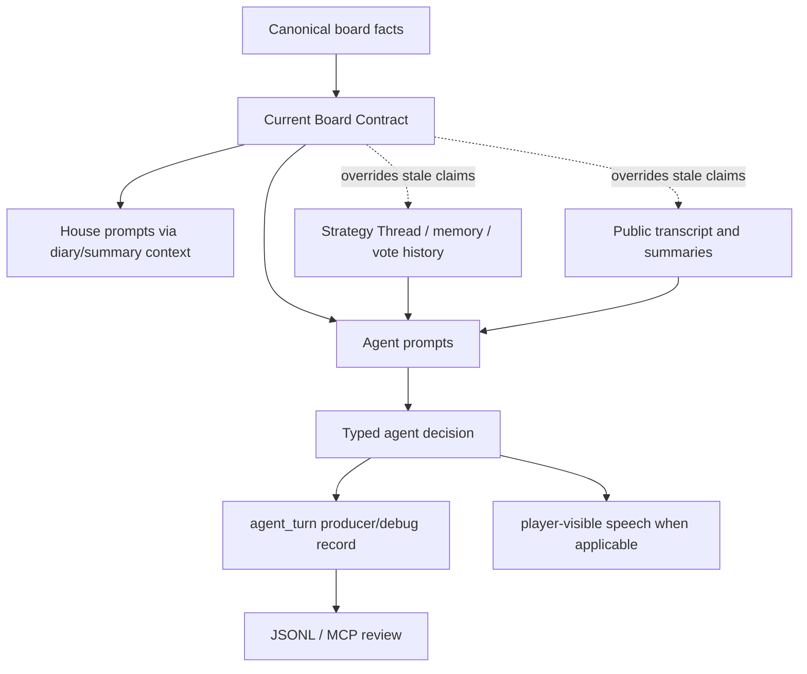
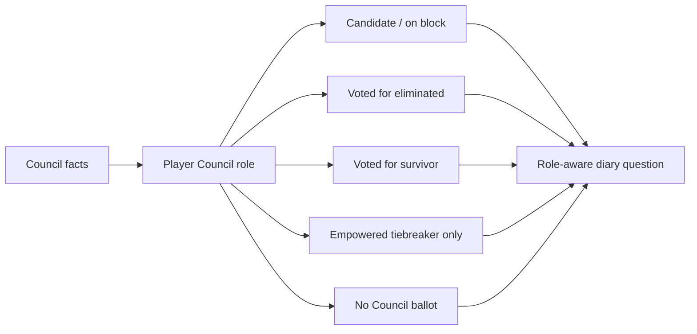
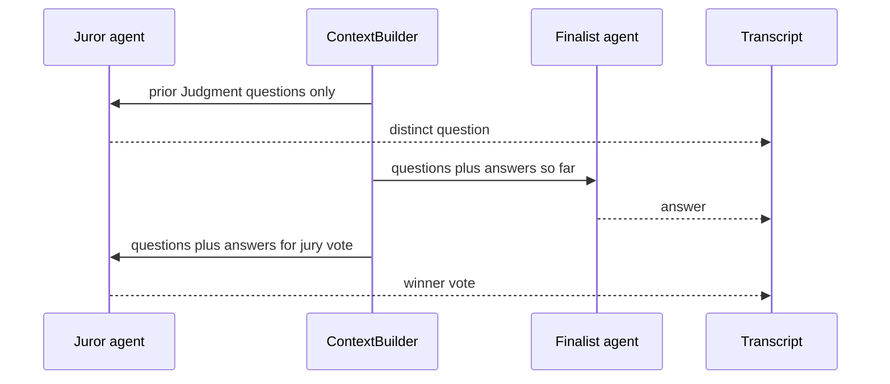

# feat: Tighten current-state prompt continuity

## Summary

Tighten the agent and House prompt surfaces so players can use more history without confusing history for live board state. The next iteration should centralize a current-board contract, add phase-specific vote vocabulary, make House diary questions role-aware, prune stale hidden Mingle intent, improve House MC recap voice, add a non-binding strategy menu, and make Judgment jury questions build on prior questions without copying them.

This is a prompt/state-continuity pass, not a rules change. It preserves the recent improvements: later-round pre-vote strategic reflections, vote immunity wording, direct Mingle pressure opportunities, Strategy Thread update timing, post-vote Mingle, and rich producer observability.

---

## Problem Frame

The latest completed rich run shows the board engine is mostly correct, but several freeform and private-decision surfaces still blur current facts with old strategy language. The most visible pattern is that agents treat social centrality as mechanical power: official Round 6 state says Vera is empowered, but lobby, Mingle, and diary language still says Nyx is empowered or wears the crown. The same pattern appears with eliminated players: old targets can be discussed productively as accusations or history, but hidden Mingle intent and public speech sometimes keep them alive as hinges, targets, or current leverage.

Council has a separate clarity problem. The game has standard empower/expose votes, empower revotes, Power decisions, Council votes, endgame direct elimination votes, and jury votes. Prompts currently make some of those distinctions, but normal Game Rules are still globally rendered in contexts where Council-specific accountability is being discussed. Agents then answer diary questions about Council votes by citing their normal empower/expose ballot.

Endgame is mechanically cleaner than before, but the Judgment jury repeats the same question because later jurors do not get a questions-only history tailored to question generation. The active jury is known, but finale prompts should more explicitly separate active jurors from players eliminated too early for jury so finalists do not pander to a vote that does not exist.

---

## Research Findings

- **Already in place and should be preserved:** `GameRunner` runs pre-vote strategic reflections only after Round 1; the pre-vote prompt tells agents to prune eliminated players and reset stale empowerment/immune assumptions; the vote prompt already says no one has won the current vote's empowerment yet; Mingle already includes at-risk opportunity wording; Strategy Thread rendering already tells agents when it was last updated.
- **Current-board facts are present but too easy to ignore:** `buildUserPrompt` lists alive/eliminated players and current stakes, but fresh Lobby with no empowered player only omits an empowered line instead of explicitly saying no current empowerment exists yet.
- **Hidden stale targets are still possible:** the completed run includes Mingle intent/assignment metadata naming Rex as a live seek/target after Rex was eliminated in Round 1. That means prompt copy alone is not enough; Mingle intent normalization and House assignment inputs also need alive-list filtering.
- **Council vs normal Vote is a prompt and memory contract issue:** `getCouncilVote()` asks for a direct elimination choice, but the generic Game Rules section still starts with empower/expose rules. Agent memory also tracks normal `myVotes` but not Council votes with the same structured weight.
- **House diary questions need role awareness:** `buildGameStatePrompt()` currently suggests asking, "did they vote for latest eliminated?" after any Council. That is wrong for Council candidates and for empowered tie-breakers who did not cast a live Council ballot.
- **House MC summaries need a positive style target:** fact contracts already prevent active stale shields, but the model often translates correctness into "historical artifact" narration. The fix should teach showrunner recap energy, not ban useful history.
- **Mingle pressure improved but collapsed stylistically:** at-risk players now trade leverage and signals, but many responses converge on "tiny non-binding micro-signals." The strategy surface needs a broader menu of legitimate plays without forcing aggression.
- **Judgment question repetition is addressable with context split:** `ContextBuilder` already reconstructs Judgment Q&A, and agent prompts already render it. Juror question generation should receive prior questions only and be explicitly asked for a different angle; finalist answers, closing, and jury votes can still receive answers.

---

## Requirements Trace

**Current-State Contract**

- R1. Render one authoritative current-board contract in agent prompts that explicitly states alive players, eliminated players, current phase, active shields, current empowered player, current Council status, latest resolved elimination, and negative current facts such as "no current empowered player yet" when true.
- R2. Current-board facts override Strategy Thread, strategic assessment, House summaries, vote history, and public transcript only for live-state interpretation inside prompts. This does not rewrite history, mutate transcripts, or make private producer records player-visible.
- R3. Eliminated players may be cited as history, evidence, motive, jury members, betrayed allies, or accusations, but never as live targets, active allies, active shields, current room targets, or players who can still vote in normal rounds.
- R4. Hidden Mingle intent and House assignment inputs must validate player-name fields against the current alive list before they can influence rooming or later prompts.

**Vote-Type Clarity**

- R5. Standard Vote, empower revote, Power action, Council vote, endgame elimination vote, Judgment question, Judgment answer, and jury vote prompts each name their decision type and explicitly separate it from other vote types.
- R6. Council prompts say this is not empower/expose and the only choice is between the two current Council candidates; empowered participation is tiebreaker-only when applicable.
- R7. Agent private memory or prompt context includes recent non-standard decisions with structured labels, especially "Your Council vote this round: X" and "You were a Council candidate and did not cast a Council vote" when true.

**House Diary and MC**

- R8. House diary question generation uses authoritative Council role facts before asking responsibility questions: candidate, actual voter against eliminated, voter for survivor, empowered tiebreaker, or non-voter.
- R9. House diary questions avoid asking a Council candidate whether they voted out their opponent unless the game actually recorded that vote.
- R10. House MC summary prompts translate stale mechanics into current dramatic consequence rather than robotic "historical artifact" bookkeeping, while still respecting round facts.
- R11. House Strategy Bible and MC summaries can keep alliance names like "Nyx bloc" only when framed as social history or current social influence, not as proof of current mechanical empowerment.

**Strategy Variety**

- R12. Add a non-binding strategy menu to agent prompts that names legitimate offensive, defensive, social, information, power, and jury-management plays.
- R13. The strategy menu must say agents should apply options through personality, current intent, and evidence; it must not require target naming, pleading, bargaining, or a concrete play every turn.
- R14. At-risk Mingle prompts keep the direct opportunity language, but add variety guidance so an at-risk player can ask protection, offer a deal, name a replacement target, recruit an advocate, threaten jury consequences, expose a betrayal, or explicitly stay guarded for a reason.
- R15. Endgame prompts include jury-management as a valid strategic frame, and distinguish active jurors from eliminated players who do not vote.

**Judgment Question Variety**

- R16. Juror question prompts receive prior Judgment questions, but not prior answers, and ask for a distinct angle from the questions already asked.
- R17. Finalist answers, closing arguments, and jury votes may still receive prior questions and answers so they can respond to the full public Judgment record.
- R18. Judgment prompts explicitly list active jurors and non-jury eliminated players when both exist.

**Validation and Docs**

- R19. Add prompt and engine tests for current-board negative facts, alive-list filtering, vote-type separation, role-aware diary questions, and Judgment question history split.
- R20. Update reasoning/simulation docs where prompt-state review expectations changed, especially around current-board contracts, hidden intent pruning, Council-vs-Vote evidence, and jury question review.
- R21. Validate with a cheap rich-producer simulation and inspect `game-N-turns.jsonl`, `game-N-events.jsonl`, progress logs, and MCP search for the regression examples.

---

## Key Technical Decisions

- **Centralize current facts before adding more prompt patches:** Create a reusable current-board contract renderer instead of duplicating alive/eliminated/current-power wording across prompt methods. This should be the first text in the evidence hierarchy beneath `Game State`.
- **Say negative facts explicitly:** When Lobby or pre-vote has no current empowered player, render "Current empowered player: none yet this round" rather than leaving a blank. Silence lets older Strategy Thread and public transcript language fill the gap.
- **Sanitize hidden Mingle intent, not only visible speech:** Mingle intent fields such as `seekPlayers`, `avoidPlayers`, `provisionalTarget`, and House assignment prompt inputs must be filtered or annotated before rooming. Otherwise stale hidden metadata can keep reviving eliminated players.
- **Keep history usable:** Do not restore the old "do not speak about eliminated players" overcorrection. The intended rule is "use eliminated players as evidence, never as live board actors."
- **Add decision history with vote type:** Normal `roundHistory.myVotes` is too narrow. Add or render a current "Your Recent Decisions" section that records standard votes, revotes, Power actions, Council votes, endgame votes, and jury actions with distinct labels.
- **Make House questions role-aware from data:** Extend `HouseRoundFacts` or derived diary context enough for House to know whether the interviewee was a candidate, voter, tiebreaker, or non-voter in the latest Council.
- **Style prompts should provide a better target, not only restrictions:** For House MC summaries, replace "historical artifact" style incentives with showrunner recap guidance: name the fresh consequence, current danger, and next tension; use past shields only as why someone survived or why a debt exists.
- **Jury question generation gets questions-only:** Later jurors can collude in the realistic sense by seeing prior questions, but they should not optimize around prior answers until answer/jury-vote phases.
- **Do not persist new private strategy state in this slice:** This remains live-agent prompt quality and producer/debug observability. No crash-safe Strategy Thread hydration or durable resume claim is introduced.

---

## Alternative Approaches Considered

- **Ban eliminated-player names in speech:** Rejected. Eliminated players should remain usable as history, betrayal evidence, jury pressure, and accusation material. The issue is live-status confusion, not historical mention.
- **Force at-risk players to plead directly every time:** Rejected. It would make agents obey a script rather than play. The better rule is to make direct survival options legible and encourage an accountable ask or an in-character guarded stance when a player is actually at risk, then validate variety across runs rather than force a per-turn script.
- **Only tweak House MC wording:** Rejected. The stale-power issue appears in agent prompts, hidden intent metadata, diary answers, and House summaries. A voice-only fix would leave private stale inputs alive.
- **Give jurors all prior answers while drafting questions:** Deferred. It may be useful later, but questions-only gives variety without letting later jurors overfit to answers or collapse into meta-cross-examination.
- **Build deterministic personality strategy tags now:** Deferred. A general strategy menu should improve variety immediately; personality-tagged deterministic strategy loadouts can be a later design pass once the prompt contract is stable.

---

## High-Level Technical Design

---

## Implementation Units

### U1. Add the Current Board Contract renderer

- **Goal:** Give every normal and endgame prompt an explicit current-state scoreboard with negative facts when relevant.
- **Requirements:** R1-R3, R15, R18.
- **Files:**
  - `packages/engine/src/agent.ts`
  - `packages/engine/src/context-builder.ts`
  - `packages/engine/src/game-runner.types.ts`
  - `packages/engine/src/house-interviewer.ts`
  - `packages/engine/src/diary-room.ts`
  - `packages/engine/src/__tests__/agent-structured-output.test.ts`
- **Approach:** Replace scattered alive/eliminated/current-stakes wording with one renderer used by the agent prompt path. Include explicit lines for no current empowered player, no active shield, no live Council, resolved Council candidates, current endgame stage, active jury, and non-jury eliminated players when known. Keep Strategy Thread and strategic assessment below the contract with canonical override language.
- **Test scenarios:**
  - Fresh Lobby after `startRound()` renders "current empowered player: none yet this round" and does not render a stale empowered player.
  - Post-vote Mingle renders the current empowered player from `ctx.empoweredId` and the post-vote pressure projection.
  - Diary after Council renders resolved Council candidates, not a live Council.
  - Judgment renders active jurors separately from eliminated players who do not vote.
  - Strategy Thread text that names an eliminated player is overridden by the current-board contract.

### U2. Validate and prune hidden Mingle intent against the alive list

- **Goal:** Stop eliminated names from influencing Mingle rooming, strategy metadata, or later prompt context.
- **Requirements:** R3, R4, R19, R21.
- **Files:**
  - `packages/engine/src/agent.ts`
  - `packages/engine/src/phases/mingle.ts`
  - `packages/engine/src/house-interviewer.ts`
  - `packages/engine/src/game-runner.types.ts`
  - `packages/engine/src/__tests__/agent-structured-output.test.ts`
  - `packages/engine/src/__tests__/game-engine.test.ts`
- **Approach:** Normalize Mingle intent player fields through the current alive list. Drop or annotate eliminated names in `seekPlayers`, `avoidPlayers`, and `provisionalTarget`; require a living replacement or `null` for active target posture. When House receives intents for assignment, include only validated living seek/avoid targets and a producer/debug repair note for stale names.
- **Test scenarios:**
  - A Mingle intent that returns eliminated Rex as a provisional target stores `null` or a stale-note, not a live target.
  - House assignment prompt after Rex is eliminated does not list Rex as a seek/avoid target from hidden intent.
  - Public Mingle speech may say "Rex's exit changed the room" but cannot target Rex as a room occupant or live vote actor.
  - Strategy packet use markers remain private after intent pruning.

### U3. Split vote-type rules and add typed recent-decision history

- **Goal:** Prevent agents from answering Council or endgame accountability questions with standard empower/expose ballots.
- **Requirements:** R5-R7, R19, R21.
- **Files:**
  - `packages/engine/src/agent.ts`
  - `packages/engine/src/phases/vote.ts`
  - `packages/engine/src/phases/council.ts`
  - `packages/engine/src/phases/endgame.ts`
  - `packages/engine/src/context-builder.ts`
  - `packages/engine/src/game-runner.types.ts`
  - `packages/engine/src/__tests__/agent-structured-output.test.ts`
  - `packages/engine/src/__tests__/game-engine.test.ts`
- **Approach:** Make `buildGameRulesSection` phase-aware, or split it into decision-specific rule blocks. Add a private "Your Recent Decisions" prompt section backed by agent memory or context-derived records. It should label standard votes, empower revotes, Power actions, Council votes, endgame elimination votes, Judgment questions, answers, and jury votes distinctly.
- **Test scenarios:**
  - Council vote prompt contains "not a normal Vote" and "no empower/expose split."
  - Diary prompt after a Council includes "Your Council vote this round: Jace" for a player who cast that vote.
  - A Council candidate gets "you were on the block and did not cast a Council vote" when that is true.
  - Endgame direct elimination vote prompt does not render standard empower/expose rules.
  - Standard Vote prompt keeps the current empowerment immunity wording.

### U4. Make House diary questions role-aware

- **Goal:** Ask sharper questions without inventing vote participation.
- **Requirements:** R8, R9, R19.
- **Files:**
  - `packages/engine/src/house-interviewer.ts`
  - `packages/engine/src/diary-room.ts`
  - `packages/engine/src/game-runner.ts`
  - `packages/engine/src/game-runner.types.ts`
  - `packages/engine/src/__tests__/game-engine.test.ts`
  - `packages/engine/src/__tests__/agent-structured-output.test.ts`
- **Approach:** Extend `HouseRoundFacts` or `DiaryRoomContext` with enough role data to answer: was this agent a Council candidate, an actual Council voter, a voter for the eliminated player, a voter for the surviving candidate, empowered tiebreaker only, or not involved? Use that role to build the situation angle before the LLM question call.
- **Test scenarios:**
  - Surviving Council candidate Wren is asked about surviving the block, not whether she voted for Lyra.
  - Vex, if recorded voting to eliminate Lyra or Jace, is asked about that Council vote using Council wording.
  - Nyx, if on the block, is not asked whether she cast a Council vote she could not cast.
  - House can still ask about empower/expose ballots after Vote, but labels them as standard Vote ballots.
  - Previous diary entries are still used to avoid repetition.

### U5. Retune House MC summary voice around consequence

- **Goal:** Keep summaries accurate but less robotic and less prone to stale mechanical phrasing.
- **Requirements:** R10, R11, R19, R21.
- **Files:**
  - `packages/engine/src/house-interviewer.ts`
  - `packages/engine/src/simulation-instrumentation.ts`
  - `packages/engine/src/__tests__/agent-structured-output.test.ts`
  - `packages/engine/src/__tests__/game-engine.test.ts`
- **Approach:** Update summary prompt rules and template fallback to ask for showrunner recap prose: fresh consequence, current social leverage, who is under heat, and what decision is next. Describe expired shields and prior empowerment only through their consequence, not as "historical artifact" bookkeeping. Add examples or style constraints that distinguish "Nyx remains socially central" from "Nyx is currently empowered."
- **Test scenarios:**
  - Fallback summary avoids "X players remain. The House sees..." robotic copy.
  - A summary with no active shields does not call any shield current.
  - A summary after Vera wins empowerment can say Nyx is socially central, but cannot say Nyx is empowered.
  - A past shield is described as why someone survived or who owes whom, not as an active protection state.

### U6. Add a non-binding strategy menu with jury management

- **Goal:** Broaden agent play beyond low-commitment "micro-signal" texture without forcing one style.
- **Requirements:** R12-R15, R19, R20.
- **Files:**
  - `packages/engine/src/agent.ts`
  - `packages/engine/src/__tests__/agent-structured-output.test.ts`
  - `docs/reasoning-transcript-observability.md`
  - `docs/local-model-evaluation.md`
- **Approach:** Add a compact strategy menu section to agent prompts. Suggested categories: offensive pressure, defensive survival, coalition building, information trade, power leverage, jury management, relationship repair, deception/misdirection, and strategic restraint. Phrase it as "choose based on personality and current evidence." Add endgame-specific language that active jurors matter for jury votes; non-jury eliminated players can matter as story evidence but not votes.
- **Test scenarios:**
  - Prompt contains strategy menu categories without requiring a target every turn.
  - At-risk Mingle prompt offers direct options and permits an accountable guarded stance.
  - Judgment prompt includes jury-management framing and active juror list.
  - Public output tests still show no private strategy packet or hidden reasoning leakage.

### U7. Split Judgment question history for juror variety

- **Goal:** Let later jurors avoid repeated questions without letting question generation optimize around prior answers.
- **Requirements:** R16-R18, R19, R21.
- **Files:**
  - `packages/engine/src/context-builder.ts`
  - `packages/engine/src/agent.ts`
  - `packages/engine/src/phases/endgame.ts`
  - `packages/engine/src/game-runner.types.ts`
  - `packages/engine/src/__tests__/agent-structured-output.test.ts`
  - `packages/engine/src/__tests__/game-engine.test.ts`
- **Approach:** Add a questions-only rendering path for `getJuryQuestion()` while preserving questions-plus-answers for `getJuryAnswer()`, `getClosingArgument()`, and `getJuryVote()`. Prompt jurors to ask a different kind of question from those already asked, using their personality and game evidence. Keep prior answers out of the juror-question prompt.
- **Test scenarios:**
  - Juror question prompt contains prior question text and does not contain prior answer text.
  - Finalist answer prompt contains prior question and prior answer text.
  - Later juror prompt says to ask a distinct angle rather than repeating a contingency already asked.
  - Active jury and non-jury eliminated lists are both visible in Judgment context when applicable.

### U8. Documentation and simulation review checklist

- **Goal:** Make the new quality bar reviewable in cheap runs and producer artifacts.
- **Requirements:** R20, R21.
- **Files:**
  - `docs/reasoning-transcript-observability.md`
  - `docs/local-model-evaluation.md`
  - `DEVELOPMENT.md`
  - `README.md`
  - `packages/engine/src/simulate.ts`
- **Approach:** Update the observability docs and simulate JSDoc with the current-state regression checklist: stale empowerment, eliminated-player status, Council-vs-standard-vote, at-risk Mingle directness, House MC consequence style, active jury separation, and jury question variety.
- **Test scenarios:**
  - Docs mention `--strategic-reflections`, `--rich-producer`, `game-N-turns.jsonl`, `game-N-events.jsonl`, progress logs, and MCP search as the validation path.
  - New review checklist uses producer-visible artifacts without exposing hidden reasoning as player-visible truth.

---

## Suggested Implementation Order

1. U1 and U3 together: current-board contract plus phase-specific decision history. These are the biggest correctness levers for stale power and vote-type confusion.
2. U4: House diary role awareness. This fixes the visible Wren/Nyx candidate edge cases.
3. U2: hidden Mingle intent pruning. This closes the private stale-target loop.
4. U7: Judgment question split. It is isolated and high-impact for finale watchability.
5. U5 and U6: House recap voice plus strategy menu. These improve flavor and behavior variety after the fact contract is safer.
6. U8: docs and checklist.

---

## Validation Plan

- Run focused prompt/unit tests with `bun run test packages/engine/src/__tests__/agent-structured-output.test.ts` if supported by the repo test runner; otherwise run the nearest Bun test filter.
- Run `bun run test` after the implementation slice.
- For merge-ready work, run `bun run check`.
- Run one cheap rich-producer simulation with strategic reflections enabled.
- Inspect artifacts for these regressions:
  - No fresh Lobby or pre-vote prompt implies a current empowered player before the vote resolves.
  - R6-style case: if Vera is empowered, no prompt/speech says Nyx is mechanically empowered.
  - Eliminated players can be named as history but do not appear as live Mingle targets, seek/avoid rooming inputs, active targets, or current shields.
  - Diary questions use Council role facts before asking "did you vote for X?"
  - Across the reviewed run, at-risk Mingle produces some direct survival asks, concrete deals, replacement-target arguments, advocacy asks, or clearly motivated guarded stances, not only generic micro-signals.
  - Judgment jurors see prior questions and ask varied questions.
  - Finalists and jurors distinguish active jury from non-jury eliminated players.

---

## Sources

- `CONCEPTS.md`
- `docs/solutions/architecture-patterns/agent-strategy-observability-spine.md`
- `docs/brainstorms/2026-06-12-mingle-intent-act-requirements.md`
- `docs/brainstorms/2026-06-12-strategy-thread-carry-forward-packet-requirements.md`
- `docs/brainstorms/2026-06-15-post-vote-mingle-drama-requirements.md`
- `docs/plans/2026-06-12-001-feat-mingle-strategy-observability-plan.md`
- `docs/plans/2026-06-12-002-feat-strategy-thread-packet-plan.md`
- `docs/plans/2026-06-13-001-feat-house-strategy-bible-packet-plan.md`
- `docs/plans/2026-06-15-002-feat-post-vote-mingle-drama-plan.md`
- `packages/engine/src/agent.ts`
- `packages/engine/src/context-builder.ts`
- `packages/engine/src/diary-room.ts`
- `packages/engine/src/game-runner.ts`
- `packages/engine/src/house-interviewer.ts`
- `packages/engine/src/phases/endgame.ts`
- `packages/engine/docs/simulations/batch-2026-06-16T17-48-13/game-1-progress.jsonl`
- `packages/engine/docs/simulations/batch-2026-06-16T17-48-13/game-1-turns.jsonl`
- `packages/engine/docs/simulations/batch-2026-06-16T17-48-13/game-1-events.jsonl`
