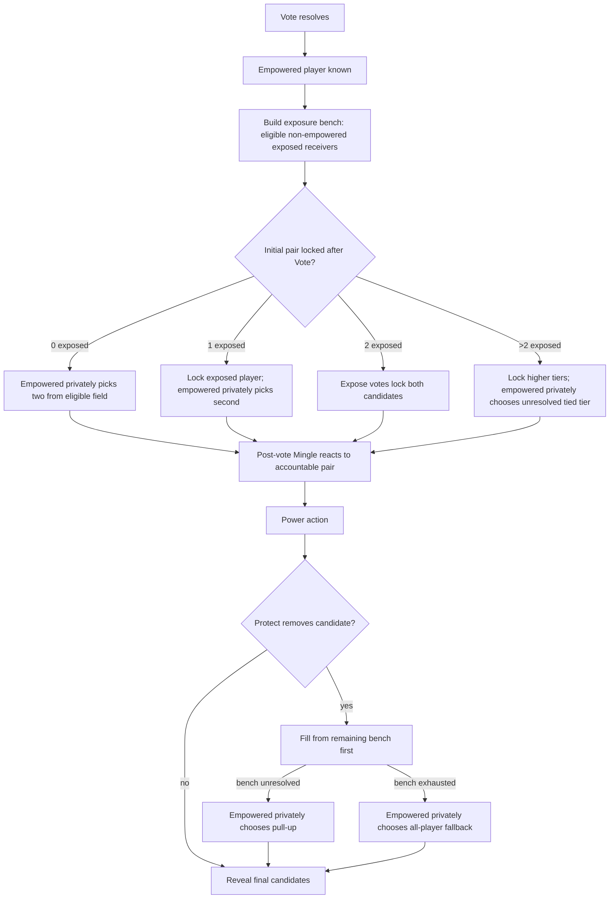
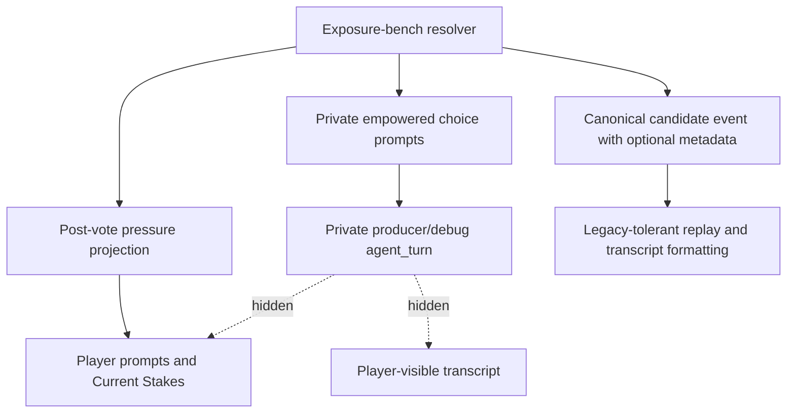

# feat: Add accountable exposure bench resolution

## Summary

Replace opaque exposed-candidate fill with an exposure-bench rule that lets expose votes bind the Council pair when they can, then asks the empowered player to resolve only remaining ambiguity immediately after Vote. The same rule must drive post-vote pressure prompts, Power shield replacement, private debug records, player-facing rules copy, and simulation validation.

---

## Problem Frame

Post-vote Mingle now gives agents a locked vote record to argue over, but the Council candidate path still has moments where the engine silently fills candidates or resolves exposed ties. That undercuts the social debt the rule is meant to create.

The product shape is vote-first and choice-second. Expose votes should still matter, the empowered player should not get a broad free pick unless the exposure bench is too small or exhausted, and every discretionary pick should become inspectable producer/debug evidence without leaking hidden reasoning to players.

---

## Requirements

**Exposure bench and candidate resolution**

- R1. Build the exposure bench after empowered resolution from eligible live non-empowered players with at least one expose vote.
- R2. Preserve raw expose votes against the empowered player as public ledger pressure while excluding the empowered player from the same round's Council candidate pair.
- R3. Resolve zero, one, exactly two, and more-than-two exposure-bench sizes according to the origin rules.
- R4. Apply higher-votes-first selection when the exposure bench has more than two eligible players, locking strictly higher tiers before empowered choice.
- R5. Use deterministic fallback for invalid or unavailable empowered selections while preserving higher-votes-first constraints.

**Power shield replacement**

- R6. When Protect shields a current Council candidate, remove the protected player and fill the open slot from remaining exposure-bench players before all-player fallback.
- R7. Apply higher-votes-first ordering to remaining bench replacement choices.
- R8. Explain all-player fallback replacements as fallback risk, not as vote-derived exposed risk.

**Empowered choice prompts and producer records**

- R9. After Vote, request a private structured empowered selection only when the initial Council pair is not fully locked by expose votes.
- R10. During Power, request a private structured shield pull-up selection only when Protect creates an unresolved replacement slot.
- R11. For those two selection points, prompt the empowered player with locked candidates, eligible choices, and the reason for choosing.
- R12. Emit private producer/debug agent-turn records for post-Vote candidate choices and Power pull-up choices, including eligible sets, selections, fallback status, and hidden reasoning fields.

**Legibility and compatibility**

- R13. Extend post-vote pressure statuses so agents can distinguish empowered, locked-at-risk, selectable exposed, replacement risk, fallback risk, and safe positions.
- R14. Update Mingle, Power, Current Stakes, Post-Vote Pressure, and game-rule prompt copy so zero-vote fallback risk is clear and not overstated.
- R15. Grow candidate-resolution metadata as optional payload fields so existing saves and minimal historical events remain readable.
- R16. Keep hidden reasoning, strategy packets, and producer/debug traces out of player-visible transcript and player-facing UI.

**Validation and documentation**

- R17. Cover the exposure-bench size matrix, tied tiers, raw expose votes against empowered, shield replacement, all-player fallback, invalid selections, and legacy payload tolerance in focused tests.
- R18. Update player-facing `/rules` documentation for gameplay mechanics only, and update developer docs, simulation guidance, reasoning transcript docs, and simulator JSDoc for validation and private-record inspection.
- R19. Validate at least one real simulation for whether candidate and shield choices become later social evidence in Mingle, Power, Council, or House summaries.

---

## Key Technical Decisions

- **Centralize exposure-bench resolution:** Put initial pair and shield replacement selection in one pure rules module so post-vote projection, Power prompts, and final candidate resolution cannot drift.
- **Keep empowered choice private and structured:** Initial candidate picks after Vote and pull-up decisions during Power are hidden model decisions plus private `agent_turn` records, not a new public ceremony or phase.
- **Resolve the initial pair before Mingle:** Candidate ambiguity is settled after Vote so Mingle pressure can point at the accountable pair; Power only reopens candidate selection if Protect creates a replacement slot.
- **Use choice requests only for unresolved slots:** The empowered player chooses from all eligible players only when the bench has zero or one eligible receivers, or when shield replacement exhausts remaining bench options.
- **Represent detailed resolution as optional metadata:** `power.candidates_resolved` can add selection mode, locked candidates, eligible choices, picks, and fallback reasons without requiring old events to contain those fields.
- **Keep prompt risk vocabulary aligned with mechanics:** Prompt sections should describe locked-at-risk, selectable exposed, replacement risk, and fallback risk from the same resolver output used by Power.
- **Keep `/rules` separate from producer records:** The player-facing rules page explains what can happen in the game, not hidden recordkeeping. Private choice records belong in observability and simulation docs.
- **Treat simulation review as part of acceptance:** Tests can prove mechanics and prompt text, but a chatty run is needed to judge whether the new accountable choices become playable social receipts.

---

## High-Level Technical Design

### Exposure Bench Flow

### Visibility Boundary

---

## Implementation Units

### U1. Extract Exposure-Bench Resolution Rules

- **Goal:** Create a pure resolver that computes locked candidates, eligible choice sets, higher-votes-first tiers, and deterministic fallbacks without mutating game state.
- **Requirements:** R1-R8, R17. Covers origin F1-F4 and AE1-AE8.
- **Dependencies:** Existing `getExposeScores` and empowered-player exclusion behavior.
- **Files:**
  - `packages/engine/src/exposure-bench.ts`
  - `packages/engine/src/post-vote-pressure.ts`
  - `packages/engine/src/game-state.ts`
  - `packages/engine/src/types.ts`
  - `packages/engine/src/__tests__/exposure-bench.test.ts`
  - `packages/engine/src/__tests__/post-vote-pressure.test.ts`
- **Approach:** Model the exposure bench as eligible player refs plus expose scores. Return a resolution object that names locked candidates, unresolved slots, eligible choice sets, selection mode, fallback reason, and shield-replacement context. The resolver should not call agents, mutate shields, emit events, or decide public copy.
- **Execution note:** Implement the resolver test-first because it becomes the shared contract for Power, projection, and prompts.
- **Patterns to follow:** Existing score sorting in `game-state.ts`, projection purity in `post-vote-pressure.ts`, and the glossary term in `CONCEPTS.md`.
- **Test scenarios:**
  - Covers AE1. Zero eligible exposed receivers returns two unresolved all-player slots with deterministic fallback candidates.
  - Covers AE2. One eligible exposed receiver locks that player and leaves one all-player choice outside the locked candidate.
  - Covers AE3. Exactly two eligible exposed receivers locks the pair without choice.
  - Covers AE4. Counts `4, 2, 2` lock the 4-vote player and expose only the 2-vote tier for the second slot.
  - Covers AE5. Three players tied at the top expose only that top tier for two choices.
  - Covers AE6. Raw expose votes against empowered remain in pressure data but never enter eligible bench output.
  - Covers AE7. Protecting a candidate pulls from remaining bench before all-player fallback.
  - Covers AE8. Exhausted bench replacement returns an all-player fallback choice and fallback-risk reason.
- **Verification:** Resolver tests demonstrate every branch of the rule matrix before any agent prompt or Power integration depends on it.

### U2. Add Empowered Candidate and Pull-Up Choice Contracts

- **Goal:** Give the empowered player structured private decisions for unresolved initial candidates after Vote and shield pull-ups during Power.
- **Requirements:** R5, R9-R12, R16-R17. Covers origin F1, F3, F4, AE1, AE2, AE4, AE5, AE8, AE10.
- **Dependencies:** U1 resolver output.
- **Files:**
  - `packages/engine/src/agent.ts`
  - `packages/engine/src/game-runner.types.ts`
  - `packages/engine/src/phases/power.ts`
  - `packages/engine/src/__tests__/agent-structured-output.test.ts`
  - `packages/engine/src/__tests__/mock-agent.ts`
  - `packages/api/src/services/game-lifecycle.ts`
  - `packages/api/src/__tests__/checkpoint-hydration-passport.test.ts`
- **Approach:** Add optional `IAgent` methods for candidate selection and shield pull-up selection, with tool schemas that return selected names, hidden thinking, `reasoningContext`, and `strategyPacketUse`. Vote/Post-Vote phase code should call the initial candidate method before Mingle when the resolver reports unresolved initial slots. Power phase code should call the pull-up method only if Protect creates an unresolved replacement; mocks and API test agents can return deterministic choices.
- **Patterns to follow:** `getEmpowerRevote`, `getPowerAction`, `agentTurnSourcePointer`, `strategyPacketUseResponse`, and private `agent_turn` emission in decision phases.
- **Test scenarios:**
  - Prompt for zero-exposed initial resolution runs after Vote, lists all eligible candidates, and asks for two picks before Mingle.
  - Prompt for one-exposed resolution runs after Vote, names the locked exposed player, and asks for one second pick before Mingle.
  - Prompt for crowded tied-tier resolution runs after Vote and lists only the unresolved tied tier.
  - Shield pull-up prompt distinguishes remaining bench choices from all-player fallback choices.
  - Invalid or unavailable model names fall back deterministically and preserve the resolver's eligible-set constraints.
  - Private `agent_turn` records include selected names, eligible choices, fallback status, and hidden reasoning fields without producing player-visible speech.
- **Verification:** Structured-output tests prove the new decisions are constrained, observable, and private.

### U3. Integrate Initial Pair Resolution with Vote, Power, and Canonical Events

- **Goal:** Replace current random candidate fill with resolver-driven initial pair after Vote and resolver-driven shield replacement during Power while preserving old event readability.
- **Requirements:** R1-R8, R12, R15-R17. Covers origin F1-F4 and AE1-AE9.
- **Dependencies:** U1, U2.
- **Files:**
  - `packages/engine/src/game-state.ts`
  - `packages/engine/src/phases/vote.ts`
  - `packages/engine/src/phases/power.ts`
  - `packages/engine/src/canonical-events.ts`
  - `packages/engine/src/context-builder.ts`
  - `packages/engine/src/game-projection.ts`
  - `packages/engine/src/__tests__/game-engine.test.ts`
  - `packages/engine/src/__tests__/canonical-event-replay.test.ts`
  - `packages/engine/src/__tests__/canonical-events.test.ts`
- **Approach:** Add a post-Vote candidate-resolution step that computes and stores the accountable initial pair before Mingle. Power should consume that pair as the preliminary candidate list, then invoke replacement resolution only if Protect removes a candidate. `determineCandidates` can accept the stored initial pair plus any replacement selection instead of using `Math.random()` fill. Add optional metadata to candidate-resolution events for mode, locked candidates, choice set, selected candidates, fallback reason, and shield replacement reason; formatter and replay code must tolerate missing metadata.
- **Patterns to follow:** Existing canonical event envelopes, `power.action_set` source pointers, `formatCanonicalEvent`, and legacy replay tests.
- **Test scenarios:**
  - Vote resolution with exactly two exposed receivers stores the pair before Mingle with no empowered candidate-choice turn.
  - Vote resolution with one exposed receiver stores locked-plus-selected pair before Mingle and emits optional metadata naming the mode.
  - Protect action shields one candidate, grants shield state, and replaces from remaining bench before fallback.
  - Protect action with exhausted bench uses empowered all-player fallback and records fallback reason.
  - Auto-eliminate behavior remains a direct Power outcome and does not require candidate pull-up.
  - Existing minimal `power.candidates_resolved` fixtures replay and format without new fields.
  - No final candidate pair includes the empowered player unless an existing two-player endgame exception already requires duplicate-only behavior.
- **Verification:** Game-engine and replay tests show final board state, canonical events, and compatibility all move together.

### U4. Update Post-Vote Pressure and Agent Prompt Legibility

- **Goal:** Make agents understand why each live player is locked, selected, replacement-risk, fallback-risk, empowered, or safe after the immediate post-Vote resolution.
- **Requirements:** R2, R8, R13-R14, R16-R17. Covers origin F1-F5 and AE2, AE6, AE8, AE10.
- **Dependencies:** U1 and U3 metadata shape.
- **Files:**
  - `packages/engine/src/post-vote-pressure.ts`
  - `packages/engine/src/context-builder.ts`
  - `packages/engine/src/agent.ts`
  - `packages/engine/src/phases/vote.ts`
  - `packages/engine/src/__tests__/post-vote-pressure.test.ts`
  - `packages/engine/src/__tests__/agent-structured-output.test.ts`
  - `packages/engine/src/__tests__/game-engine.test.ts`
- **Approach:** Rebuild `PostVotePressureProjection` from the stored post-Vote resolution rather than top-two score sorting. Add statuses for locked-at-risk, empowered-selected, selectable exposed, replacement risk, fallback risk, and empowered. Update Post-Vote Pressure, Current Stakes, Mingle social opportunity, Power rules, and revealed-ledger wording so Mingle sees the actual accountable pair and zero-vote players are only described as at risk when fallback can reach them.
- **Patterns to follow:** Existing `buildPostVotePressureSection`, `buildCurrentStakesSection`, `buildGameRulesSection`, `buildMingleSocialOpportunitySection`, and revealed vote ledger copy.
- **Test scenarios:**
  - One-exposed projection marks the exposed player locked-at-risk and the empowered-selected second candidate as at risk before Mingle.
  - Exactly-two projection marks only the two exposed receivers as locked-at-risk.
  - Crowded tied-tier projection distinguishes locked higher-vote players from empowered-selected tied-tier players before Mingle.
  - Raw expose votes against empowered show in expose pressure but render empowered as immune from effective danger.
  - Prompt copy does not imply all zero-vote players are equally at risk when enough exposed receivers exist.
  - Mingle and Power prompts preserve agent agency and do not require pleading, target naming, or identical behavior.
- **Verification:** Prompt tests prove state explanations match candidate mechanics and stay neutral.

### U5. Preserve Observability and Simulation Artifacts

- **Goal:** Make candidate-choice and shield-pull-up decisions inspectable in local simulation artifacts and MCP-oriented logs.
- **Requirements:** R12, R16-R17, R19. Covers origin F5 and AE10.
- **Dependencies:** U2, U3.
- **Files:**
  - `packages/engine/src/transcript-logger.ts`
  - `packages/engine/src/simulate.ts`
  - `packages/engine/src/game-mcp/read-model.ts`
  - `packages/engine/src/__tests__/simulate-config.test.ts`
  - `packages/engine/src/__tests__/game-mcp.test.ts`
  - `docs/reasoning-transcript-observability.md`
  - `docs/local-model-evaluation.md`
  - `DEVELOPMENT.md`
  - `README.md`
- **Approach:** Ensure new private choice turns serialize cleanly to `game-N-turns.jsonl`, remain searchable by action name, and have useful chatty formatting without duplicating transcript-backed speech. Update docs so maintainers know to inspect candidate-choice and shield-pull-up records alongside Mingle, vote, Power, Council, and House MC summaries.
- **Patterns to follow:** Existing `empower-revote`, `power-action`, `mingle-intent`, `house-mc-summary`, `serializeAgentTurnEvent`, and `formatAgentTurnTrace` behavior.
- **Test scenarios:**
  - Serialized candidate-choice turns include eligible set, selections, fallback status, thinking, and `reasoningContext`.
  - Chatty formatting includes a concise trace for private candidate choices without leaking them as public transcript.
  - MCP log search can find the new action names in turns logs and link to source records where available.
  - Reasoning transcript docs list the new decision methods and privacy boundary.
- **Verification:** Simulation artifact tests and docs make the new accountability evidence discoverable.

### U6. Update Player-Facing Rules and Developer Documentation

- **Goal:** Keep player-facing and maintainer-facing explanations aligned with the new rule.
- **Requirements:** R14, R18. Covers origin F5 and AE6-AE10.
- **Dependencies:** U1-U4 for final terms and status names.
- **Files:**
  - `packages/web/src/app/rules/page.tsx`
  - `packages/web/src/__tests__/rules-page.test.tsx`
  - `docs/reasoning-transcript-observability.md`
  - `docs/local-model-evaluation.md`
  - `DEVELOPMENT.md`
  - `README.md`
  - `packages/engine/src/simulate.ts`
- **Approach:** Update `/rules` so Vote explains the exposure bench, one-exposed and exactly-two-exposed outcomes, higher-votes-first ties, empowered immunity from same-round Council danger, and Protect replacement from the remaining bench before fallback. Do not mention private choice records, hidden reasoning, or producer/debug traces in the player-facing rules page. Developer docs should focus on how to validate the behavior, not restate every rule in multiple places.
- **Patterns to follow:** Current rules-page section structure, docs' existing concise simulation guidance, and simulator JSDoc style.
- **Test scenarios:**
  - Rules page renders expose votes as creating an exposure bench rather than automatically taking the top two by score.
  - Rules page explains that exactly two eligible exposed receivers lock the pair.
  - Rules page explains that one or zero exposed receivers create empowered candidate choice.
  - Rules page explains Protect replacement uses remaining exposed receivers before fallback.
  - Rules page does not mention private choice records, hidden reasoning, or producer/debug traces.
- **Verification:** Web and docs tests confirm the public rules page and maintainer docs do not lag the engine behavior.

### U7. Run Focused and Simulation Validation

- **Goal:** Prove the rule works mechanically and produces useful social evidence in at least one real run.
- **Requirements:** R17-R19. Covers origin F5 and AE10.
- **Dependencies:** U1-U6.
- **Files:**
  - `packages/engine/docs/simulations/`
  - `packages/engine/src/__tests__/game-engine.test.ts`
  - `packages/engine/src/__tests__/agent-structured-output.test.ts`
  - `packages/engine/src/__tests__/post-vote-pressure.test.ts`
  - `packages/web/src/__tests__/rules-page.test.tsx`
- **Approach:** Run the focused test suite for resolver, Power, prompts, replay, artifacts, and rules copy, then run a bounded local simulation with chatty or turns artifacts enabled. Review whether empowered candidate choices or shield pull-ups are visible later as promises, backlash, pressure, Council framing, or House summary material.
- **Patterns to follow:** Existing local-model evaluation workflow, simulation artifact naming under `packages/engine/docs/simulations/`, and the project's preference for real simulation review of prompt/gameplay changes.
- **Test scenarios:**
  - Focused engine tests cover every acceptance example from the origin document.
  - Prompt tests prove fallback risk and vote-derived risk are not conflated.
  - Legacy candidate-resolution event fixtures remain readable.
  - Simulation artifact review identifies at least one candidate-choice or pull-up record, or records that the validation seed did not exercise the new choice path and needs a targeted rerun.
- **Verification:** The branch has passing focused checks plus a written note or simulation artifact reference that confirms whether the rule created social evidence.

---

## Scope Boundaries

In scope:

- Standard-round exposed-candidate resolution after Vote and before Power outcome reveal.
- Immediate post-Vote initial candidate resolution before Mingle.
- Private empowered selections for initial ambiguity and shield pull-up ambiguity.
- Post-vote pressure, prompt, canonical event, transcript, simulation, and `/rules` documentation updates needed for the rule to be understandable.
- Backward compatibility for old saves and minimal candidate-resolution events.

Out of scope:

- Feature flags or an experiment framework.
- A new public ceremony phase between Vote, Mingle, and Power.
- Redesigning Council voting, empowered Council tie-breaking, or endgame voting.
- New private-record requirements for empowered Council tie-breaking beyond preserving existing Council decision logging.
- Making hidden reasoning, strategy packets, or producer/debug traces player-visible.
- Reworking the broader post-vote Mingle loop beyond the pressure facts this rule requires.

### Deferred to Follow-Up Work

- Viewer UI affordances that visually distinguish locked candidates from empowered-filled candidates beyond the existing rules page and transcript/system framing.
- Broader analytics on how often each exposure-bench mode occurs across many simulations.

---

## Risks & Dependencies

- **Resolver drift:** If Power and projection do not share the same resolver, agents may argue over a pressure state that final reveal contradicts. U1 centralization is the mitigation.
- **Prompt over-commanding:** Stronger at-risk language can accidentally force pleading or target naming. Prompt tests should assert agency language as well as facts.
- **Compatibility regressions:** Optional event metadata must remain optional in readers, projection, transcript formatting, and old simulation logs.
- **Simulation coverage gap:** A random validation run may not hit candidate-choice or shield-pull-up paths. The validation plan should allow a targeted seed or scripted-agent run if the first run misses the branch.

---

## Documentation and Operational Notes

- `/rules` is player-facing and should be updated in the same implementation branch as the engine rule change.
- `docs/reasoning-transcript-observability.md`, `docs/local-model-evaluation.md`, `DEVELOPMENT.md`, `README.md`, and `packages/engine/src/simulate.ts` should mention the new private decision records only where they help validation.
- Rollout is feature-branch based: no feature flag is planned, so staging and simulations are the safety gates before merge.

---

## Sources & Research

- `docs/brainstorms/2026-06-17-accountable-exposed-candidate-resolution-requirements.md`
- `docs/ideation/2026-06-17-exposed-candidate-randomness-ideation.html`
- `docs/plans/2026-06-15-002-feat-post-vote-mingle-drama-plan.md`
- `CONCEPTS.md`
- `packages/engine/src/game-state.ts`
- `packages/engine/src/post-vote-pressure.ts`
- `packages/engine/src/phases/vote.ts`
- `packages/engine/src/phases/power.ts`
- `packages/engine/src/agent.ts`
- `packages/engine/src/canonical-events.ts`
- `packages/engine/src/context-builder.ts`
- `packages/engine/src/simulate.ts`
- `packages/web/src/app/rules/page.tsx`
- `docs/solutions/architecture-patterns/agent-strategy-observability-spine.md`
