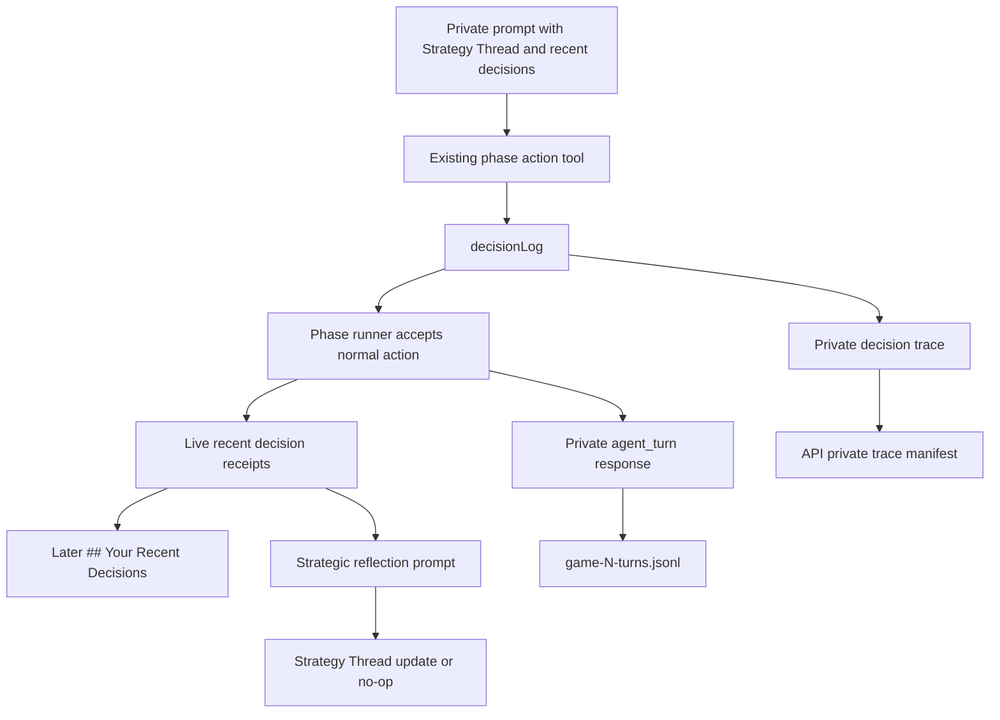

# feat: Replace packet-use markers with thin strategic decision fields

## Summary

Replace `strategyPacketUse` / `strategyPacketUseRationale` on strategic action outputs with one flat nullable private field: `decisionLog`. The new field stays on existing single action-tool calls, becomes a searchable producer/debug receipt, and feeds later prompts and strategic reflection without making strategy notes public or canonical.

---

## Problem Frame

Strategy Thread packets already give agents a compact private posture across rounds, but the current packet-use marker asks the model to classify whether it followed, revised, ignored, or deferred a packet. That produces some linkage evidence, yet it does not clearly record what the agent just decided or why.

The useful v1 upgrade is smaller than notebooks, TODOs, parallel strategy tools, or persistence. Each meaningful strategic action should be able to leave a compact private receipt, and reflection should be able to use those receipts when updating or preserving the Strategy Thread.

---

## Requirements Trace

**Action fields and schemas**

- R1. Strategic action outputs expose `decisionLog` instead of `strategyPacketUse` and `strategyPacketUseRationale`. Covers origin R1, R2, R4, F1, F4, AE1.
- R2. `decisionLog` is nullable, private, compact natural language anchored to the action that produced it. Covers origin R2, R3, R14, R21, AE1, AE5.

**Carry-forward and reflection**

- R4. Recent decision receipts are available to later prompts in `## Your Recent Decisions` with clear timing and action anchors. Covers origin R6, R7, R8, R9, F3, AE3.
- R5. Strategic reflection receives recent decision receipts as private evidence when deciding whether to revise the Strategy Thread. Covers origin R10, F2, AE2.
- R6. If strategic reflection is disabled, receipts still emit in private producer/debug records where action records already exist. Covers origin R13, F4.

**Observability, privacy, and compatibility**

- R7. Simulation turn records and private traces expose the new fields when present and stop treating packet-use markers as the primary strategic linkage signal. Covers origin R14, R15, R16, R17.
- R8. Decision logs never become player-visible transcript text, canonical board facts, public websocket state, raw hidden reasoning, or native reasoning context. Covers origin R21, AE5.
- R9. The implementation preserves the existing single-tool action-call architecture and does not add provider/model profiles, token tuning, parallel tool orchestration, task lists, notebooks, `MemoryStore` persistence, or checkpoint hydration. Covers origin R18, R19, R20, AE4.

---

## Key Technical Decisions

- **Flat action field replaces packet-use fields:** Use `decisionLog` as the shared schema fragment for strategic tools. This preserves local-model-friendly strict tool shapes while removing the low-value use classification.
- **Decision receipt is live private context, not canonical truth:** Store recent receipts on the live agent or another private runtime-only lane that prompt building and reflection can read. Do not derive them from canonical events or write them to `MemoryStore` in this slice.
- **Reflection owns Strategy Thread mutation:** Decision logs are evidence for the normal reflection cadence, not a command to interrupt the current phase.
- **Private traces move with the replacement:** Private trace metadata should summarize `decisionLog`, so API-backed evidence manifests do not preserve packet-use as the only strategic linkage summary.
- **Docs validate receipts, not compliance:** Validation should ask whether receipts are anchored, searchable, and later reflected, not whether agents obeyed a packet.

---

## High-Level Technical Design

The action result remains the only required model call during a phase. When the model returns a decision log, the phase runner logs it with the private action record and records a bounded live receipt for that agent. Later prompt construction renders those receipts separately from public transcript summaries, Strategy Thread, and Strategic Assessment. Strategic reflection receives the same receipt lane and decides whether the packet needs revision.

---

## Scope Boundaries

### In Scope

- Replace packet-use marker types, schema fragments, normalizers, phase response helpers, tests, and docs.
- Add a bounded private recent-decision receipt lane for prompt and reflection carry-forward.
- Preserve searchability in turns JSONL, game MCP generic log search, and private trace metadata.

### Deferred for Later

- Provider/model profiles, token-budget tuning, and local-model-specific schema variants.
- Parallel action-plus-strategy tool calls or any required-vs-optional parallel tool orchestration.
- Strategy notebooks, task lists, TODO lifecycles, commitment ledgers, relationship graphs, social-debt models, or scoring dashboards.
- `MemoryStore` persistence, checkpoint hydration, or crash-safe resume of decision logs.

### Outside This Slice

- Player-visible display of private decision logs, hidden `thinking`, or `reasoningContext`.
- Treating decision logs as mandatory immediate reflection commands.
- Scoring whether an agent followed, revised, ignored, or deferred a Strategy Thread.

---

## Implementation Units

### U1. Replace shared strategic action metadata contracts

- **Goal:** Define the new decision receipt types and remove packet-use marker contracts from strategic action outputs.
- **Requirements:** R1, R2, R8, R9.
- **Dependencies:** None.
- **Files:**
  - `packages/engine/src/game-runner.types.ts`
  - `packages/engine/src/game-runner.ts`
  - `packages/engine/src/index.ts`
  - `packages/engine/src/__tests__/agent-structured-output.test.ts`
  - `packages/engine/src/__tests__/mock-agent.ts`
- **Approach:** Introduce a shared strategic decision metadata shape with nullable `decisionLog`. Replace `StrategyPacketUse`, `StrategyPacketUseMarker`, and per-action `strategyPacketUse` properties on strategic action return types.
- **Patterns to follow:** Existing `StrategyPacketSummary`, `StrategicReflectionAction`, strict nullable tool fields, and engine barrel exports.
- **Test scenarios:**
  - Given a strategic action return type includes the new metadata, TypeScript accepts null fields without requiring a decision log on every action.
  - Given old packet-use marker exports are removed or deprecated inside the engine boundary, tests and mocks compile against the new metadata.
  - Given raw hidden `thinking` or `reasoningContext` exists on the same result, the decision metadata type does not include either value.
- **Verification:** Engine type exports compile, mock agents return deterministic new metadata, and no strategic action interface still requires `strategyPacketUse`.

### U2. Update InfluenceAgent schemas, normalization, and fallback parsing

- **Goal:** Make all strategic LLM action tools emit the new flat fields through the existing single-tool call path.
- **Requirements:** R1, R2, R6, R9.
- **Dependencies:** U1.
- **Files:**
  - `packages/engine/src/agent.ts`
  - `packages/engine/src/__tests__/agent-structured-output.test.ts`
  - `packages/engine/src/__tests__/goodbye-message.test.ts`
- **Approach:** Replace `STRATEGY_PACKET_USE_TOOL_PROPERTIES` and its required key list with a strategic decision metadata schema fragment. Keep the key required by strict schemas but allow a null value. Normalize natural-language logs to compact strings, and update JSON fallback parsing so local models can recover when they return partial JSON.
- **Patterns to follow:** `normalizeNullableString`, `normalizeStrategyPacketUseValue`, `AGENT_RESPONSE_FORMAT`, `callTool` JSON fallback paths, and existing strict tool definitions.
- **Test scenarios:**
  - Covers AE1. Given a Mingle turn returns a decision log, the normalized action result preserves it.
  - Given a vote returns a null decision log, the vote remains valid and emits no misleading strategy claim.
  - Given JSON fallback output contains only `decisionLog`, parsing preserves it.
  - Given an endgame message schema is inspected, it requires the new nullable key and no longer requires packet-use keys.
  - Given a model returns old packet-use keys after the migration, the normalizer does not surface them as active strategic metadata.
- **Verification:** Prompt/tool schema tests show the old keys are gone from action tools, and action methods still use `toolChoiceMode: "required"` without parallel tool calls.

### U3. Preserve decision receipts in private phase records and live carry-forward context

- **Goal:** Record decision logs on private action records and make bounded recent receipts available to later prompts.
- **Requirements:** R2, R4, R6, R7, R8.
- **Dependencies:** U1, U2.
- **Files:**
  - `packages/engine/src/phases/phase-runner-context.ts`
  - `packages/engine/src/phases/introduction.ts`
  - `packages/engine/src/phases/mingle.ts`
  - `packages/engine/src/phases/rumor.ts`
  - `packages/engine/src/phases/vote.ts`
  - `packages/engine/src/phases/power.ts`
  - `packages/engine/src/phases/council.ts`
  - `packages/engine/src/phases/endgame.ts`
  - `packages/engine/src/context-builder.ts`
  - `packages/engine/src/__tests__/stream-listener.test.ts`
  - `packages/engine/src/__tests__/agent-structured-output.test.ts`
- **Approach:** Replace `strategyPacketUseResponse` with a helper that emits decision metadata only when present. Add a bounded runtime receipt lane keyed by agent and action anchor, either on live agents or in phase/context state, so `ContextBuilder` can include recent private decision receipts without reading canonical events as if they were strategy notes.
- **Execution note:** Characterize current `## Your Recent Decisions` prompt output before changing it; this section already mixes canonical recorded decisions into memory and should stay distinct from the new private receipts.
- **Patterns to follow:** `agentTurnSourcePointer`, private `agent_turn` response composition, `ContextBuilder.buildRecentDecisionHistory`, and `InfluenceAgent.buildRecentDecisionsSection`.
- **Test scenarios:**
  - Covers AE1. Given a private vote action returns a decision log, the emitted `agent_turn` response includes `decisionLog`.
  - Covers AE3. Given recent private receipts exist, the later prompt renders them under `## Your Recent Decisions` with round, phase, action label, and clear receipt text.
  - Given canonical vote history exists without a decision log, the prompt still shows the recorded decision without inventing a private rationale.
  - Given more than the bounded number of receipts exist, only the recent window is rendered.
  - Given a player-visible transcript entry is produced from the same action, it does not include the decision log.
- **Verification:** Stream listener tests can find a private decision log in `agent_turn` events, and prompt snapshots show timing/action anchors without merging receipts into public transcript sections.

### U4. Feed receipts into strategic reflection

- **Goal:** Let strategic reflection consume recent decision receipts without interrupting phase stability.
- **Requirements:** R4, R5, R6, R8, R9.
- **Dependencies:** U3.
- **Files:**
  - `packages/engine/src/agent.ts`
  - `packages/engine/src/diary-room.ts`
  - `packages/engine/src/game-runner.types.ts`
  - `packages/engine/src/__tests__/agent-structured-output.test.ts`
  - `packages/engine/src/__tests__/stream-listener.test.ts`
- **Approach:** Include the bounded recent receipt lane in strategic reflection prompts and wording. Treat decision logs as evidence for the next scheduled reflection, not as an immediate interrupt signal.
- **Patterns to follow:** Existing `getStrategicReflection` / Strategy Thread packet update flow, `enableStrategicReflections`, and current reflection prompt warnings that it is private producer/debug strategy.
- **Test scenarios:**
  - Covers AE2. Given a vote recorded a decision log, the next reflection prompt includes the vote's decision log.
  - Covers AE4. Given an action records a decision log during an unstable phase, the runner does not perform an extra immediate action-plus-reflection model call.
  - Given strategic reflections are disabled, private action records still carry decision logs but no reflection prompt is created.
  - Given reflection updates a Strategy Thread after receipts, the emitted `strategy-packet` record remains the only packet mutation artifact.
- **Verification:** Reflection prompt tests show decision receipts are available as evidence, and stream tests show no additional phase-interrupting model call path is introduced.

### U5. Update private traces, API evidence metadata, and MCP validation fixtures

- **Goal:** Preserve the new strategic linkage fields in private traces and simulation search surfaces.
- **Requirements:** R7, R8, R9.
- **Dependencies:** U1, U2, U3.
- **Files:**
  - `packages/engine/src/game-runner.types.ts`
  - `packages/engine/src/agent.ts`
  - `packages/api/src/services/private-trace-writer.ts`
  - `packages/api/src/__tests__/private-trace-writer.test.ts`
  - `packages/engine/src/game-mcp/read-model.ts`
  - `packages/engine/src/__tests__/game-mcp.test.ts`
  - `packages/engine/src/__tests__/stream-listener.test.ts`
- **Approach:** Replace private trace `strategyPacketUse` summary extraction with decision metadata extraction. Keep generic log search as the MCP validation path unless implementation proves a dedicated tool is necessary. Update fixtures so searches find `decisionLog` and later Strategy Thread records in the same game.
- **Patterns to follow:** `PrivateDecisionTrace`, `buildTraceMetadata`, `GameMcpReadModel.searchLogs`, and existing turns JSONL fixtures for strategy-packet validation.
- **Test scenarios:**
  - Given a private decision trace includes a decision log, private trace metadata records byte-length/summary information without storing hidden reasoning in metadata.
  - Given a turns JSONL fixture contains a decision log and a later strategy-packet record, MCP search can find both.
  - Given old packet-use fixture terms are absent, MCP strategy validation tests search for decision logs instead.
  - Given API websocket filtering handles private `agent_turn` events, decision logs are not broadcast as public client state.
- **Verification:** Private trace writer tests and MCP tests pass with new fixtures, and generic search can trace a decision receipt into later reflection or packet artifacts.

### U6. Refresh documentation and run simulation-oriented validation

- **Goal:** Update project docs and validation guidance so maintainers review strategic receipts instead of packet-use classifications.
- **Requirements:** R7, R8, R9.
- **Dependencies:** U2, U3, U4, U5.
- **Files:**
  - `CONCEPTS.md`
  - `docs/reasoning-transcript-observability.md`
  - `docs/local-model-evaluation.md`
  - `README.md`
  - `DEVELOPMENT.md`
  - `docs/solutions/architecture-patterns/agent-strategy-observability-spine.md`
  - `packages/engine/src/simulate.ts`
- **Approach:** Replace packet-use validation language with decision-log language. Preserve the concept definition for `Decision log`, retire or reframe the old `Strategy packet-use marker` glossary entry, and update the strategy observability spine so future prompt work follows the new receipt pattern.
- **Patterns to follow:** Existing simulation artifact descriptions, local model evaluation runbook, and the validation checklist in `docs/solutions/architecture-patterns/agent-strategy-observability-spine.md`.
- **Test scenarios:**
  - Test expectation: none for docs-only text, but docs must name the same record fields and search terms used by tests.
  - Given simulator JSDoc describes strategic decision artifacts, it references decision logs rather than packet-use markers.
  - Given local model evaluation guidance describes validation, it asks whether later reflections incorporate prior decision logs.
- **Verification:** `bun run test` should pass after implementation. For merge-ready work, run `bun run check` and a local simulation with strategic reflections enabled to confirm at least one decision log is searchable and, when model behavior cooperates, reflected into a later Strategy Thread update.

---

## System-Wide Impact

- **Prompt quality:** Agents get a clearer private receipt trail with timing anchors, which addresses the concern that separate notes otherwise hide when a decision was made.
- **Local model reliability:** The action schema remains flat and single-tool. The new fields should reduce conceptual complexity compared with packet-use classification, while still allowing null when the model has nothing useful to record.
- **Privacy boundary:** Decision logs are private producer/debug context. The implementation must keep them out of transcript text, canonical events, and public websocket surfaces.
- **Validation posture:** Simulation review shifts from checking whether agents self-classified packet use to checking whether receipts are anchored and later strategic reflection uses them.

---

## Risks & Dependencies

- **Receipt carry-forward source is easy to overbuild:** The implementation needs enough runtime retention for later prompts and reflection, but not `MemoryStore` persistence or checkpoint hydration.
- **Prompt bloat can hurt local models:** `## Your Recent Decisions` should stay bounded and anchored. Long decision prose should be normalized or truncated before reuse.
- **Decision logs can imply stronger semantics than v1 supports:** Prompt and docs should call them evidence for the normal reflection cadence so reviewers do not expect an immediate interrupting model call.
- **Old fixtures and docs are widespread:** Packet-use appears across engine tests, API trace tests, runbooks, and solution docs. The migration should treat stale docs as failing validation, not harmless leftovers.

---

## Sources & Research

- `docs/brainstorms/2026-06-17-thin-strategic-decision-fields-requirements.md`
- `docs/ideation/2026-06-17-strategic-upgrade-slice-ideation.html`
- `docs/plans/2026-06-12-002-feat-strategy-thread-packet-plan.md`
- `docs/solutions/architecture-patterns/agent-strategy-observability-spine.md`
- `CONCEPTS.md`
- `packages/engine/src/agent.ts`
- `packages/engine/src/context-builder.ts`
- `packages/engine/src/game-runner.types.ts`
- `packages/engine/src/phases/phase-runner-context.ts`
- `packages/api/src/services/private-trace-writer.ts`
