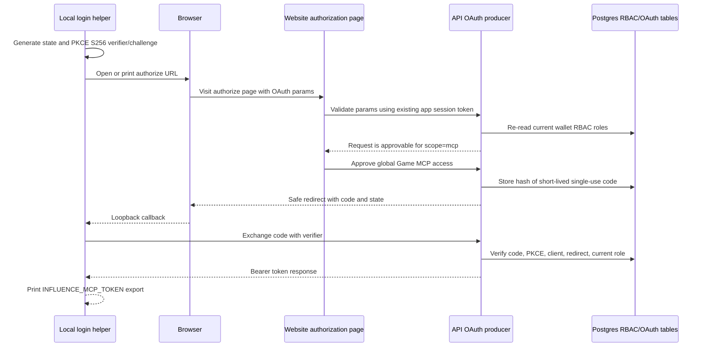
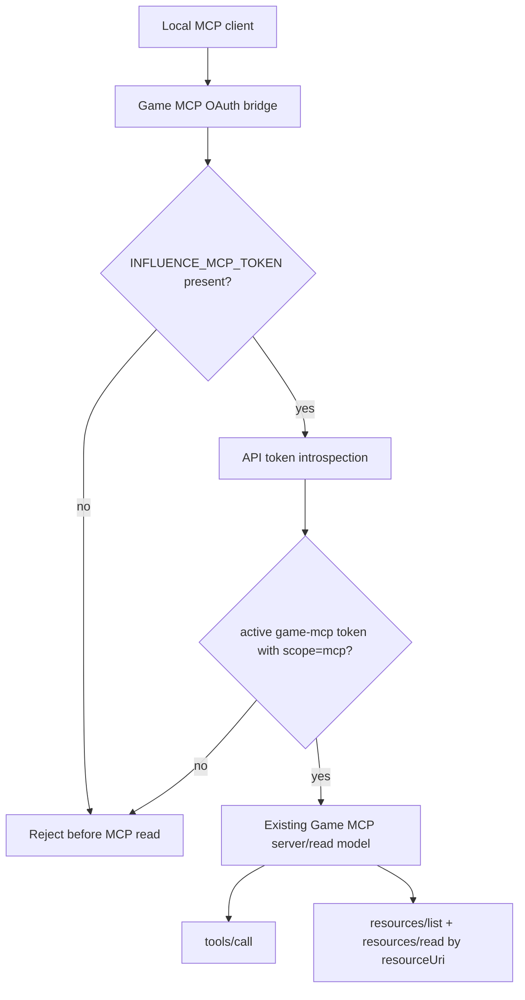
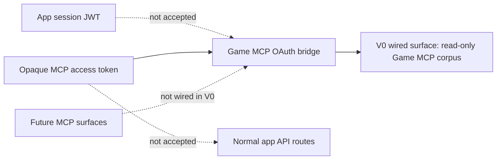

# feat: Add OAuth token producer for Game MCP bridge

## Summary

Add the V0 OAuth loop for trusted Game MCP validation. A logged-in user with the new `mcp` role can approve `scope=mcp` on the website, exchange an authorization code with PKCE through the API, and pass the resulting MCP bearer token to a local bridge that gates the existing read-only Game MCP.

This plan intentionally keeps the access model narrow by making `scope=mcp` the only post-login authorization boundary. The V0 bridge wires that global scope to Game MCP first, including the existing trusted-local producer-visible simulation artifacts that Game MCP already exposes. It does not add per-user, per-private-trace, per-agent, per-game, refresh-token, external-client, hosted HTTP MCP, app-admin, or game-mutation authorization.

---

## Problem Frame

The existing Game MCP is already the right read surface for simulation validation. It lists sessions and games, reads projections, filters events, searches logs, returns timelines and linked records, and reads artifacts through MCP `resourceUri` values.

The missing slice is not a complete public MCP authorization system. It is a working fullstack OAuth token producer and local consumer: the website handles the human authorization page because it owns the logged-in browser state, the API issues a role-bound MCP access token, and the local bridge rejects invalid requests before the existing Game MCP read model can see them.

The key implementation constraint is that current app session JWTs embed RBAC claims for up to seven days, while role assignment truth lives in wallet-address RBAC tables. OAuth issuance and token validation therefore need to re-check current role state instead of trusting only the session token's stale role claim.

---

## Requirements Trace

**Role and scope contract**

- R1. Seed an `mcp` role in the existing RBAC role model and make it assignable through the current role-assignment surface. Covers origin R1.
- R2. Define `mcp` as the only supported OAuth scope for this V0 producer. Covers origin R2, R4, R19.
- R3. Authorize `scope=mcp` only for a logged-in user whose current wallet RBAC roles include `mcp`. Covers origin R3, R11, R13, R18, AE1, AE3, AE4.
- R4. Treat `scope=mcp` as global MCP access for every MCP surface wired behind this V0 scope. The first wired surface is read-only Game MCP corpus access, including the existing producer-visible simulation artifact surface. This work does not wire app admin APIs, normal API permissions, fine-grained game/agent grants, user-scoped private-trace grants, or mutation surfaces. Covers origin R5, R6, AE6.

**OAuth token producer**

- R5. Add a website authorization page that accepts the OAuth request, requires the existing app login state, and presents approve, deny, and cancel choices for global Game MCP access. Covers origin R7, R10, F1, AE1.
- R6. Accept only the static first-party local MCP client, `response_type=code`, required `state`, `scope=mcp`, loopback redirect policy, and PKCE S256. Covers origin R8, R9, F1, AE4.
- R7. On approval, create a short-lived, single-use authorization code bound to user, client, redirect URI, scope, PKCE challenge, and current role eligibility. Covers origin R11.
- R8. Return safe OAuth redirects for approval, denial, cancellation, and errors; never redirect to an untrusted or mismatched redirect URI. Covers origin R12.
- R9. Add a token endpoint for `grant_type=authorization_code` that verifies client, redirect URI, code expiry, single-use status, PKCE verifier, scope, and current `mcp` role eligibility before issuing a token. Covers origin R13, R14, F2, AE2, AE4.
- R10. Return a bearer token response with `access_token`, `token_type`, `expires_in`, and `scope`; do not issue refresh tokens. Covers origin R15, R19, AE2.
- R11. Keep MCP access tokens distinct from app session JWTs so app routes reject MCP tokens and the bridge rejects app session tokens. Covers origin R16, R31, R32, AE2, AE7.
- R12. Use opaque, hash-stored MCP access tokens with a protected introspection endpoint that returns issuer, audience, subject, client, scope, purpose, expiry, and active state. Covers origin R17, R18, R21.

**Local bridge**

- R13. Add a local stdio Game MCP OAuth bridge that reads a bearer token from local process configuration and rejects missing or invalid tokens before delegating to Game MCP. Covers origin R20, R21, F3, F5, AE5, AE7.
- R14. After successful token validation, preserve the existing Game MCP tools, resources, read semantics, and `resourceUri`/`resources/read` behavior. Covers origin R22-R24, AE5.
- R15. Keep the bridge local developer tooling and avoid production HTTP MCP, public packaging, dynamic client registration, external client policy, DPoP, or refresh-token behavior. Covers origin R19, R25, AE6.
- R16. OAuth and bridge audit logs record user or subject, `client_id`, scope, result, denial reason, and correlation ID while redacting authorization codes, access tokens, PKCE verifiers, Authorization headers, redirect query secrets, local token handoff values, and artifact content. Covers origin R26.

**Validation and documentation**

- R17. Prove the producer happy path and maintainer end-to-end path from role assignment through website authorization, token exchange, bridge access, and at least one Game MCP projection/resource read. Covers origin R27, R28, AE1, AE2.
- R18. Prove non-role users, unsupported scopes, invalid clients, redirect mismatches, missing state, missing app session, denial/cancel, expired or reused codes, PKCE mismatch, redirect/client mismatch, and role removal before exchange do not issue usable tokens. Covers origin R29, R30, AE3, AE4.
- R19. Prove missing, invalid, expired, wrong-audience, wrong-purpose, wrong-scope, app-session, and normal API tokens cannot read through the bridge. Covers origin R31, AE7.
- R20. Update docs and glossary entries so `scope=mcp` is clearly global MCP access for wired local MCP surfaces, with Game MCP as the V0 surface, and so the local bridge workflow is discoverable without implying user-scoped private-trace authorization or hosted MCP readiness. Covers origin R33, AE6.

---

## Key Technical Decisions

- **Website page, API issuer:** The authorization UI lives in the web app because the browser already has Privy and API session state. The API owns request validation, authorization code creation, token exchange, and introspection.
- **Current RBAC is checked from the database:** The authorization and token exchange paths re-read wallet-address role assignments with the existing RBAC resolver instead of relying on roles embedded in the app session JWT.
- **No normal API permissions for `mcp`:** Seed the `mcp` role without granting app/admin permissions. It is a scope eligibility marker, not a product permission bundle.
- **Static local public client:** Use one first-party client, `influence-game-mcp-local`, with loopback IP redirect policy. The local login helper chooses a port; the producer validates scheme, host, path, and client, with loopback port flexibility only for that client.
- **PKCE S256 only:** Authorization requests must include an S256 challenge, and token exchange must verify the matching code verifier. `plain` PKCE is not accepted.
- **Opaque tokens and introspection:** Store authorization code and access token hashes, never raw values. The bridge calls a protected introspection endpoint before delegating to the read model. This keeps role removal and emergency revocation simple without introducing signed JWT key management for V0.
- **Short lifetimes, no refresh:** Authorization codes expire after five minutes and are single-use. MCP access tokens expire after one hour, have no refresh token, and become inactive if the user's current role no longer includes `mcp`.
- **Environment handoff for local token:** The login helper prints a one-time shell export for `INFLUENCE_MCP_TOKEN`; the bridge reads that value and does not write a token file in V0.
- **Bridge wraps, not rewrites, Game MCP:** The existing Game MCP server/read model remains the source of truth. The bridge is an auth gate in front of `GameMcpJsonRpcServer.handle()`.
- **Global scope, no inner user boundary:** Once OAuth issues `scope=mcp`, the bearer has global access to whatever MCP surface this V0 bridge wires. There is no per-user, per-private-trace, per-agent, or per-game filtering after the OAuth scope check. V0 wires Game MCP first; wiring Trace MCP or API private-content MCP surfaces later is separate implementation work, not a different user-ownership authorization model.
- **Bridge operators need one local resource-server secret:** Opaque token introspection requires `INFLUENCE_MCP_INTROSPECTION_SECRET` in addition to the user MCP token. V0 treats local bridge runners as trusted resource-server operators; the secret is generated per environment, stored only in existing deployment secrets or local ignored env files, never logged or committed, and rotated by replacing it in the API and local bridge environment.
- **HTTPS outside loopback:** Web and API base URLs used by the OAuth helper and producer must be HTTPS except for explicit loopback development hosts (`localhost`, `127.0.0.1`, and IPv6 loopback). Loopback redirect URIs may use `http` as part of the native-app local callback flow.
- **Expired token workflow is explicit:** When the one-hour token expires, the bridge fails closed with an auth/setup error. The user reruns the local login helper, updates `INFLUENCE_MCP_TOKEN`, and restarts the stdio MCP client or bridge; V0 has no silent refresh.

---

## High-Level Technical Design

### OAuth Producer Flow

### Bridge Validation Flow

### Token and Surface Boundaries

---

## Implementation Units

### U1. Seed the `mcp` Role and OAuth Persistence

- **Goal:** Add the role marker and persistent OAuth state needed for authorization codes and opaque access tokens.
- **Requirements:** R1-R4, R7, R11, R12, R18.
- **Dependencies:** Existing RBAC schema, seed path, and Drizzle migration runner.
- **Files:**
  - `packages/api/src/db/schema.ts`
  - `packages/api/src/db/rbac-seed.ts`
  - `packages/api/src/db/rbac.ts`
  - `packages/api/drizzle/0011_game_mcp_oauth.sql`
  - `packages/api/drizzle/meta/_journal.json`
  - `packages/api/src/__tests__/test-utils.ts`
  - `packages/api/src/__tests__/admin-routes.test.ts`
- **Approach:** Add the `mcp` role to the existing seed list without normal app permissions. Add `mcp_oauth_authorization_codes` and `mcp_oauth_access_tokens` tables with user, client, redirect, scope, challenge, expiry, used/revoked timestamps, and token/code hashes. Store only SHA-256 hashes of random code/token values. Update test truncation order so OAuth rows are cleaned before users/roles.
- **Patterns to follow:** Existing `roles`, `address_roles`, `seedRBAC`, and migration journal patterns.
- **Test scenarios:**
  - Given RBAC seed runs, the `mcp` role exists and can be assigned to a wallet address.
  - Given a user has only `mcp`, role resolution includes `mcp` but does not grant `manage_roles` or other app permissions.
  - Given tests truncate the database, OAuth tables do not leak rows across API DB tests.
- **Verification:** API DB tests prove the new role is seedable and isolated from normal app permissions.

### U2. Add API OAuth Producer and Introspection Routes

- **Goal:** Implement the authorization-code producer, token endpoint, and protected introspection endpoint.
- **Requirements:** R2-R12, R16-R18.
- **Dependencies:** U1 persistence and current RBAC role resolution.
- **Files:**
  - `packages/api/src/routes/mcp-oauth.ts`
  - `packages/api/src/services/mcp-oauth.ts`
  - `packages/api/src/middleware/auth.ts`
  - `packages/api/src/index.ts`
  - `packages/api/src/__tests__/mcp-oauth-routes.test.ts`
  - `packages/api/src/__tests__/auth.test.ts`
- **Approach:** Add a focused OAuth service with static client policy, loopback redirect validation, S256 PKCE verification, high-entropy code/token generation, hash lookup, expiry/single-use checks, current role checks, and structured redacted audit metadata. Mount API routes for authorization validation/approval, token exchange, and introspection. Token exchange must consume authorization codes atomically in one transaction or conditional update before minting an access token, so concurrent exchanges cannot both succeed. Protect introspection with `INFLUENCE_MCP_INTROSPECTION_SECRET`; require it to be high-entropy, per-environment, distributed through existing deployment-secret or local ignored-env mechanisms, and rotated by replacing both API and bridge configuration. Return active token metadata only when the introspection secret is valid and the access token hash exists, is unexpired, unrevoked, has `scope=mcp`, targets `game-mcp`, and the current user still has the `mcp` role. Reject non-HTTPS web/API base URLs outside explicit loopback development hosts. Keep MCP tokens opaque so `requireAuth` continues to reject them as normal app sessions.
- **Patterns to follow:** `createAuthRoutes`, `requireAuth`, `createSessionToken` separation, `getPermissionsForAddress`, and existing Hono route tests.
- **Test scenarios:**
  - Covers AE1 and AE2. A logged-in `mcp` role user can approve the request, receive a code redirect, and exchange it with the matching PKCE verifier for a bearer response.
  - Covers AE3 and AE4. Missing session, unsupported scope, invalid client, invalid redirect, missing state, unsupported PKCE method, denial/cancel, expired code, reused code, PKCE mismatch, client mismatch, redirect mismatch, and role removal before exchange issue no usable token.
  - Given two token exchanges race for the same authorization code, only one atomic consume path can mint a bearer token.
  - Covers AE2 and AE7. A normal app route rejects an MCP access token, and introspection rejects a normal app session token.
  - Covers R18. Role removal after token issue makes introspection inactive.
  - Given the introspection secret is missing or wrong, introspection rejects the request without revealing token metadata.
  - Given non-loopback web/API base URLs use plain HTTP, producer/helper validation rejects them before sending secrets.
  - Covers R26. Route logs and test-visible errors include user or subject, `client_id`, scope, result, denial reason, and correlation ID, while excluding raw authorization codes, access tokens, PKCE verifiers, Authorization headers, and redirect query secrets.
- **Verification:** Focused API DB tests prove the producer and token contract before any bridge code consumes it.

### U3. Add the Website Authorization Page

- **Goal:** Provide the human authorization UI that reuses existing app login state and calls the API issuer.
- **Requirements:** R5-R8, R16, R20.
- **Dependencies:** U2 API routes and current web auth sync.
- **Files:**
  - `packages/web/src/app/oauth/mcp/authorize/page.tsx`
  - `packages/web/src/lib/mcp-oauth.ts`
  - `packages/web/src/lib/api.ts`
  - `packages/web/src/lib/role-display.ts`
  - `packages/web/src/__tests__/mcp-oauth.test.ts`
  - `packages/web/src/__tests__/role-display.test.ts`
- **Approach:** Add a client-side authorization page that parses OAuth query params, preserves the original request in the URL through sign-in, waits for the existing Privy-to-API session sync, calls the API to validate the request, and presents approve, deny, and cancel actions. The page should name global Game MCP access plainly and keep the interaction operational, not marketing-styled. The page state machine covers session loading, sign-in required, request validation, ready-to-decide, submit pending, non-role denial, malformed request, API failure with retry, and redirect failure with a safe fallback. Approval calls the API with the app session token and then navigates to the returned safe redirect. Deny means the user actively refuses the grant; cancel means the user abandons the flow. Both return safe OAuth errors with preserved `state`, but audit/display reason keeps them distinguishable for the helper and logs. Update role display copy so the `mcp` role is legible in the existing admin assignment UI.
- **Patterns to follow:** `AuthSync`, `getAuthToken`, `apiFetch`, `AuthGate`, existing app route styling, and role display tests.
- **Test scenarios:**
  - Given required OAuth params are present, the page utility builds a valid API request and preserves `state`.
  - Given params are missing or malformed, the page shows a failure state and does not call approval.
  - Given the user is not logged in, the page preserves the OAuth query, surfaces the existing sign-in path, resumes validation after session sync, and does not mint a code before login.
  - Given validation or approval fails, the page leaves the user in a retryable error state without duplicate submission.
  - Given redirect navigation fails, the page shows the safe returned callback target instead of losing the OAuth result.
  - Given the user denies or cancels, the API/helper can distinguish the reason while preserving OAuth-safe error behavior.
  - Given API validation says the user lacks `mcp`, the page shows denial and no approve action mints a code.
  - Given approve, deny, or cancel succeeds, navigation uses only the API-returned safe redirect.
- **Verification:** Web utility tests cover parsing/redirect behavior, and an implementation smoke covers the page with the real app session.

### U4. Add a Local OAuth Login Helper

- **Goal:** Make the authorization-code flow usable from a local MCP setup without persisting token files.
- **Requirements:** R5-R10, R15, R17, R20.
- **Dependencies:** U2 and U3.
- **Files:**
  - `packages/engine/src/game-mcp/oauth-login.ts`
  - `packages/engine/src/game-mcp/oauth-client.ts`
  - `packages/engine/src/__tests__/game-mcp-oauth-client.test.ts`
  - `packages/engine/package.json`
- **Approach:** Add a small Bun script that starts a loopback listener on `127.0.0.1`, generates state plus PKCE S256 verifier/challenge, prints or opens the website authorization URL, validates the callback state, exchanges the code with the API, and prints a one-time `INFLUENCE_MCP_TOKEN=...` export for the user's shell. It should not write token files, log secrets, or support dynamic client registration. Default config should be local-development friendly while allowing API and web base URLs to be supplied by environment variables; the helper rejects non-HTTPS base URLs unless they are explicit loopback development URLs. When a token later expires, the helper is rerun and the MCP client/bridge is restarted with the new environment value.
- **Patterns to follow:** Existing engine CLI scripts, Bun runtime APIs, official loopback redirect guidance for native apps, and the repository's local developer documentation style.
- **Test scenarios:**
  - Given PKCE generation runs, it produces a verifier and S256 challenge accepted by the API verifier.
  - Given the loopback callback has the wrong state, the helper refuses to exchange the code.
  - Given the token endpoint returns an OAuth error, the helper reports a redacted error and prints no token export.
  - Given token exchange succeeds, the helper prints the token only in the intended shell-export output and avoids echoing code/verifier values in logs.
  - Given a configured web/API base URL is non-loopback HTTP, the helper rejects it before sending codes, verifiers, tokens, or the introspection secret.
  - Given a bridge token expires, docs and helper output make the restart/rerun path explicit instead of implying refresh.
- **Verification:** Unit tests cover helper correctness; manual/local smoke proves the browser-to-loopback path.

### U5. Add the Token-Gated Game MCP Bridge

- **Goal:** Gate the existing Game MCP JSON-RPC server behind `scope=mcp` token validation.
- **Requirements:** R13-R16, R19.
- **Dependencies:** U2 introspection and existing Game MCP server.
- **Files:**
  - `packages/engine/src/game-mcp/oauth-bridge.ts`
  - `packages/engine/src/game-mcp/server.ts`
  - `packages/engine/src/__tests__/game-mcp-oauth-bridge.test.ts`
  - `packages/engine/src/__tests__/game-mcp.test.ts`
  - `packages/engine/package.json`
- **Approach:** Add a bridge command that accepts the same simulations root argument as the current Game MCP server, reads `INFLUENCE_MCP_TOKEN`, calls the API introspection endpoint with `INFLUENCE_MCP_INTROSPECTION_SECRET`, and rejects JSON-RPC requests before delegating unless introspection returns an active `game-mcp` token with purpose `mcp_access`, `scope=mcp`, the expected client, and unexpired metadata. V0 introspects before each JSON-RPC request and does not cache active state, so role removal, expiry, or revocation take effect on the next request. Missing or wrong introspection-secret configuration fails as a setup/auth error before any Game MCP read. Once accepted, delegate to `createGameMcpServer(simulationsRoot)` so all tools and resource semantics stay unchanged.
- **Patterns to follow:** `GameMcpJsonRpcServer.handle()`, `runStdioGameMcpServer`, `GameMcpReadModel`, `resourceUri` resource reads, and game MCP tests.
- **Test scenarios:**
  - Covers AE5. A valid introspection response permits `initialize`, tool calls, resource listing, and `resources/read` by `resourceUri`.
  - Covers AE7. Missing token, inactive token, expired token, wrong audience, wrong purpose, wrong scope, wrong client, app session token, and introspection failure all reject before the Game MCP read model is invoked.
  - Given a token is valid for one request and then expires, is revoked, or loses current role eligibility, the next JSON-RPC request is rejected before delegation.
  - Given `INFLUENCE_MCP_INTROSPECTION_SECRET` is missing or wrong, the bridge reports a setup/auth error and performs no Game MCP reads.
  - Covers R14. Existing Game MCP tests still pass with the original server and the bridge delegates unchanged after validation.
  - Covers R26. Bridge audit/error logs include subject, `client_id`, scope, result, denial reason, and correlation ID when available, while excluding bearer tokens, Authorization headers, resource contents, redirect query secrets, and local token handoff values.
- **Verification:** Engine MCP tests prove the bridge is an auth wrapper and not a second implementation of Game MCP.

### U6. Documentation, Smoke Paths, and Privacy Sentinels

- **Goal:** Make the workflow discoverable and prove the global-but-contained boundary.
- **Requirements:** R16-R20.
- **Dependencies:** U1-U5.
- **Files:**
  - `README.md`
  - `DEVELOPMENT.md`
  - `docs/local-model-evaluation.md`
  - `docs/reasoning-transcript-observability.md`
  - `CONCEPTS.md`
  - `packages/api/src/__tests__/mcp-oauth-routes.test.ts`
  - `packages/engine/src/__tests__/game-mcp-oauth-bridge.test.ts`
- **Approach:** Document how to assign the `mcp` role, configure `INFLUENCE_MCP_INTROSPECTION_SECRET` through the existing secret/local ignored-env path, run the local login helper, export the token, handle token expiry by rerunning the helper, and start the token-gated Game MCP bridge. State that `scope=mcp` is global access to the MCP surfaces wired behind that scope, with Game MCP as the V0 surface, including current trusted-local producer-visible simulation artifacts. Also state that V0 does not create user-scoped private-trace access rules; later Trace MCP/API private-content wiring would need implementation work but not an implicit per-user authorization layer. Add audit-field, redaction, HTTPS/loopback, and token-separation assertions. Keep docs focused on local trusted validation rather than public OAuth platform behavior.
- **Patterns to follow:** Existing README/DEVELOPMENT MCP sections, local model evaluation docs, reasoning transcript observability docs, and current `CONCEPTS.md` terminology.
- **Test scenarios:**
  - Given docs mention `scope=mcp`, they state it is the only post-login authorization boundary and grants global access to wired MCP surfaces.
  - Given docs mention the introspection secret, they state who may receive it, where it lives locally, how rotation works, and that it must not be committed or logged.
  - Given docs mention web/API base URLs, they state HTTPS is required outside explicit loopback development URLs.
  - Given docs mention the bridge, they describe it as local developer tooling and do not claim hosted/public MCP readiness.
  - Given logs are produced during producer and bridge failures, tests or smoke review confirm required audit fields are present and secret-bearing fields are redacted.
  - Given the positive local smoke runs, it exercises role assignment, OAuth authorization, token exchange, bridge access, and at least one Game MCP projection/resource read.
- **Verification:** Full repo tests/checks plus a local end-to-end smoke demonstrate the producer, web page, helper, and bridge work together.

---

## Scope Boundaries

### In Scope

- `mcp` role seeding and role-display polish.
- App-hosted OAuth authorization page for `scope=mcp`.
- API authorization-code and token endpoints with PKCE S256.
- Static first-party public client for local MCP usage.
- Opaque hash-stored MCP bearer tokens and protected introspection.
- Per-environment local/deployment secret handling for the protected introspection endpoint.
- Local loopback login helper and environment-variable token handoff.
- Local stdio Game MCP OAuth bridge.
- Positive and negative tests for role gating, PKCE, token separation, introspection, bridge rejection, resource URI reads, required audit fields, and log redaction.
- Docs for local trusted validation workflow.

### Deferred for Later

- Production hosted HTTP MCP.
- Wiring Trace MCP/API private-content MCP surfaces into this bridge.
- Per-agent, per-game, per-session, per-player, row-level, or resource-specific grants.
- Refresh tokens, DPoP, dynamic client registration, external clients, consent dashboards, or public OAuth client onboarding.
- Token-file/keychain storage.
- New admin role-management UI beyond the existing role assignment surface.
- Adding game mutation MCP tools.
- Broad security review of app-wide auth unrelated to the Game MCP token producer.

---

## Validation Plan

- API DB tests cover RBAC seed, authorization request validation, approval/denial/cancel redirects, code creation, atomic code consumption, concurrent double-exchange rejection, token exchange, code expiry/reuse, PKCE mismatch, role removal before exchange, introspection, token separation, HTTPS outside loopback, audit fields, and redacted failures.
- Web tests cover OAuth query parsing, state preservation, login resume, malformed request handling, pending/retry/redirect-failure states, deny/cancel semantics, role display copy, and safe redirect use.
- Engine tests cover local login helper utilities, non-loopback HTTP rejection, token-gated bridge rejection, per-request introspection, expired-token restart behavior, valid delegation, and preservation of existing Game MCP tool/resource behavior.
- End-to-end local smoke covers a role-bound maintainer obtaining an MCP token through the website and using it through the bridge to read at least one projection and one `resourceUri`.
- Existing full test/check baselines pass before the work is considered ready to merge.

---

## Risks and Mitigations

- **Stale app-session roles:** The API session JWT can outlive role changes. Mitigate by re-reading current RBAC during authorization, token exchange, and introspection.
- **Redirect misuse:** OAuth error handling can become unsafe if invalid redirects are followed. Mitigate by validating client and redirect before returning redirect-based errors.
- **Token leakage in logs:** Local OAuth tools often print too much. Mitigate with hash-only storage, redaction helpers, tests for common secret-bearing fields, and a one-time intentional token export from the helper.
- **Introspection secret leakage:** Opaque-token validation adds a second local credential for trusted bridge operators. Mitigate with per-environment generation, existing secret/local ignored-env storage, rotation docs, missing/wrong-secret tests, and log/source-control redaction.
- **Scope confusion:** `mcp` sounds broad because it is broad. Mitigate by naming it global MCP access for wired surfaces everywhere, calling out Game MCP as the V0 wired surface, and avoiding language that implies hidden per-user/private-trace filters after OAuth.
- **Bridge drift:** A bridge could accidentally fork Game MCP behavior. Mitigate by delegating to the existing server/read model and keeping existing Game MCP tests as regression coverage.

---

## External References

- [OAuth 2.1 Internet-Draft](https://datatracker.ietf.org/doc/html/draft-ietf-oauth-v2-1) for authorization-code, PKCE, state, redirect, and token-endpoint shape. This is still an Internet-Draft, so use it as OAuth 2.1-style guidance rather than a final standard.
- [RFC 7636: Proof Key for Code Exchange](https://www.rfc-editor.org/rfc/rfc7636) for S256 PKCE verifier/challenge behavior.
- [RFC 8252: OAuth 2.0 for Native Apps](https://www.rfc-editor.org/rfc/rfc8252) for loopback redirect handling with IP literals and dynamic ports.
- [RFC 9700: OAuth 2.0 Security Best Current Practice](https://www.rfc-editor.org/rfc/rfc9700) for exact redirect matching, PKCE support, CSRF protections, and browser security posture.
- [RFC 7662: OAuth 2.0 Token Introspection](https://www.rfc-editor.org/rfc/rfc7662) for protected resource-server introspection of opaque tokens.
