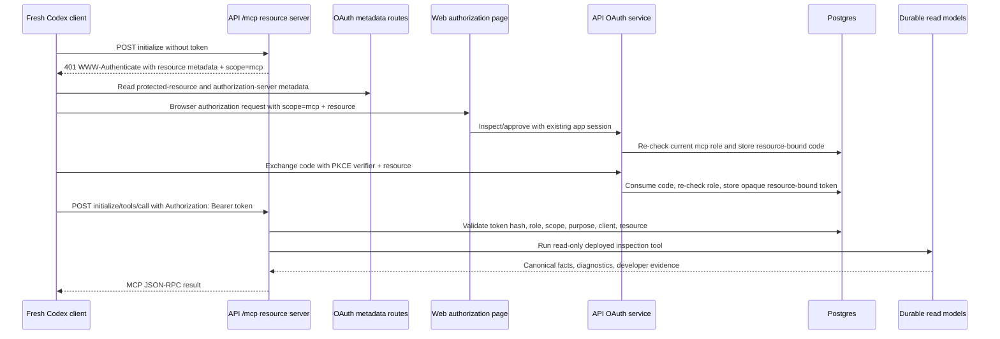
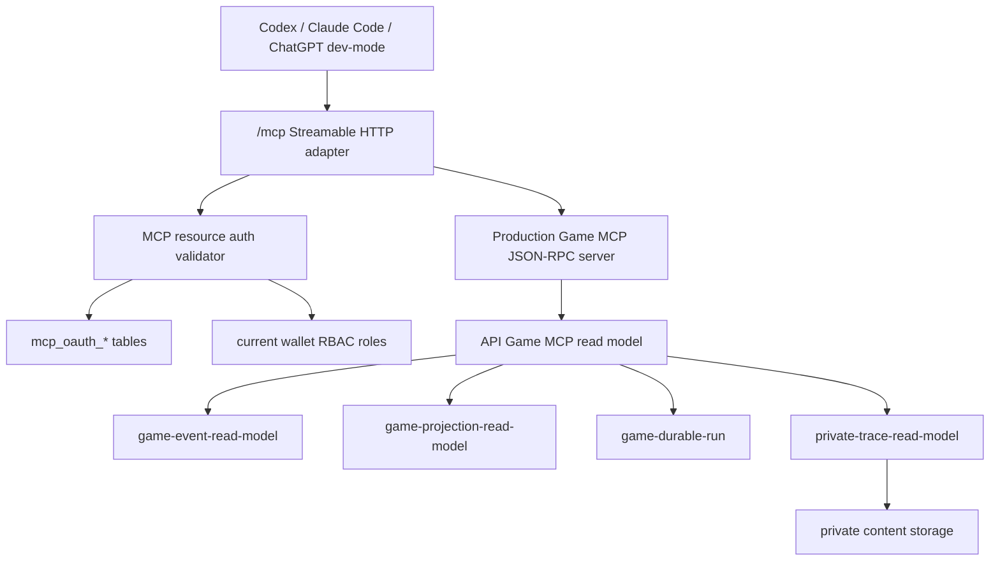
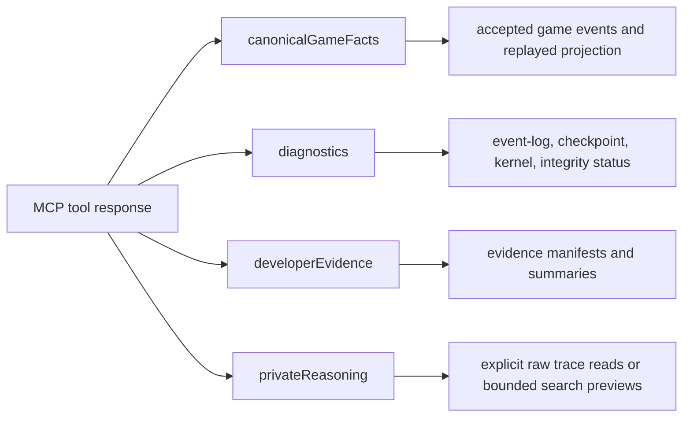

# feat: Add Production Game MCP HTTP OAuth Surface

## Summary

Add the production V0 connection surface for Influence Game MCP: a deployed Streamable HTTP MCP endpoint at `/mcp`, protected by the existing `mcp` role and `scope=mcp` OAuth boundary, with API-backed read-only tools for deployed game inspection and developer evidence. Codex is the release gate; Claude Code and ChatGPT developer-mode compatibility are documented checks.

This plan keeps the core boundary unchanged: `scope=mcp` plus a valid resource-bound OAuth token grants global access to the wired V0 MCP surface. It does not add per-user, per-game, per-agent, row-level, or private-reasoning authorization.

---

## Problem Frame

The June 18 slice proved the token-producer path for trusted local validation: the web app can authorize `scope=mcp`, the API can issue opaque MCP bearer tokens to users with the `mcp` role, and a local stdio bridge can introspect those tokens before delegating to the filesystem-backed Game MCP.

That is not the production connection shape clients expect. A fresh Codex, Claude Code, or ChatGPT-style client needs a deployed HTTP MCP server, protected-resource metadata, OAuth authorization-server metadata, resource-bound tokens, and a data source that does not depend on local simulation directories. The new work should productionalize the deployed connection and inspection surface without turning this into a finer-grained authorization or private-redaction project.

The main risk is connection safety. The deployed endpoint is network-reachable outside the local repo, and a single valid MCP token grants broad developer inspection access. The plan therefore emphasizes fail-closed auth, resource binding, audit redaction, request bounds, and staging checks while preserving the requested global access model. Bespoke app-side rate limiting is out of scope for this small-scale developer-only slice and should sit behind a real gateway in a later durable deploy pass.

---

## Requirements

- R1. Preserve the global MCP access contract: current `mcp` role, exact OAuth `scope=mcp`, valid bearer token, correct purpose, correct client identity, and correct production MCP resource equal global access to the V0 wired surface. Covers origin R1-R7, R33, F2, F4, AE3, AE5.
- R2. Publish MCP HTTP transport and OAuth discovery surfaces that current clients can use: canonical `/mcp`, protected-resource metadata, authorization-server metadata, `WWW-Authenticate` challenges, PKCE S256 metadata, and no bearer tokens in query strings. Covers origin R8-R15, F1, AE2.
- R3. Bind issued tokens to the canonical production MCP resource URI and reject tokens for the wrong resource before any read model runs. Covers origin R2-R4, R10-R13, AE3.
- R4. Serve deployed read-only inspection tools from API durable read models instead of local filesystem sessions, including game listing, projection replay, event filtering, player timelines, durable-run inspection, and developer evidence/private reasoning surfaces intentionally exposed by selected read models. Covers origin R16-R23, F3, AE4.
- R5. Prove the Codex install/auth/use path end to end, then document Claude Code and ChatGPT developer-mode/API Playground compatibility without making them V0 blockers. Covers origin R24-R28, F1, F5, AE1, AE6.
- R6. Add deployed-surface operational safety: redacted audit logs, request size/output bounds, emergency token containment through the opaque token store and role checks, explicit deferral of gateway-level rate limiting, and staging checks for metadata, callback policy, token validation, and MCP reachability. Covers origin R29-R32, AE5.

---

## Key Technical Decisions

- **API owns both authorization-server and resource-server behavior:** Keep OAuth issuance in `packages/api` and add the production MCP resource server there. Deployed clients present MCP access tokens directly to `/mcp`; they never receive or need the local introspection secret.
- **Canonical resource URI becomes first-class state:** Add a per-environment resource URI for the deployed MCP endpoint and persist it with authorization codes and access tokens. Keep the existing internal `game-mcp` audience/purpose semantics, but validate the canonical resource URI for MCP resource-indicator compliance.
- **Client identity is decided by a Codex compatibility spike:** The plan starts by proving the smallest Codex-compatible client identity path. Do not assume static client ID, Client ID Metadata Document, or Dynamic Client Registration until `codex mcp login` behavior is observed against the new metadata contract.
- **Use a thin Streamable HTTP adapter before adopting an SDK:** The repo already has JSON-RPC MCP servers. V0 should add a focused HTTP transport adapter with protocol tests. Adopt the official TypeScript MCP SDK only if the Codex/Claude compatibility spike shows client behavior that the thin adapter cannot safely satisfy.
- **Production Game MCP is API-backed, not a filesystem wrapper:** Keep `packages/engine/src/game-mcp/read-model.ts` for local simulation corpora. Add an API production read model that speaks deployed game IDs/slugs and durable read-model data instead of `sessionId + gameNumber` filesystem artifacts.
- **Private reasoning is in scope behind the global MCP gate:** V0 should not strip private reasoning or raw trace access as a security measure. It should expose developer-scoped evidence/private reasoning tools that existing read models intentionally support, label them clearly, bound their outputs, and keep them behind the same `scope=mcp` token.
- **Tool-first release surface:** V0 success is measured by tools. Resources can be omitted or kept minimal unless client compatibility or a concrete Codex workflow requires `resources/list` and `resources/read`.
- **No mutation capabilities:** Production MCP tools remain read-only. Unknown tools and mutation-shaped names fail before touching any game lifecycle or write path.
- **Staging is the proof environment:** The release gate runs against a deployed staging endpoint with real persisted game data. If ChatGPT developer-mode cannot reach tailnet-only staging, document that as a compatibility blocker for ChatGPT rather than widening the V0 release gate.

---

## Dependencies and Assumptions

- The existing `mcp` RBAC role, OAuth authorization page, authorization-code table, access-token table, and opaque token validation service remain the basis for V0.
- The deployed API and web app have stable HTTPS base URLs per environment, and the API can publish a canonical MCP resource URI that matches the installed `/mcp` URL.
- Staging has at least one deployed game with persisted canonical events, plus private trace manifests/content when validating the developer evidence tools.
- Private content storage is configured in staging before private trace content tools are treated as ready; absent storage should be documented as an operational blocker, not silently hidden by the MCP tool list.
- Codex compatibility decides the first client identity mechanism. Claude Code and ChatGPT compatibility checks may reveal follow-up client registration work, but they do not block Codex V0.

---

## High-Level Technical Design

### Remote OAuth and MCP Flow



### Component Topology



### Data Classes in Tool Output



---

## Output Structure

```text
packages/api/src/game-mcp/
  read-model.ts
  server.ts
  http-transport.ts
  auth.ts

packages/api/src/routes/
  mcp.ts
  mcp-oauth.ts
```

The exact file split may adjust during implementation, but the planned boundary is stable: API-local production MCP components should not make the engine filesystem read model responsible for deployed data.

---

## Implementation Units

### U1. OAuth Discovery, Resource Binding, and Client Identity

- **Goal:** Make the existing OAuth producer discoverable by MCP clients and bind authorization codes/tokens to the canonical production MCP resource.
- **Requirements:** R1, R2, R3, R5, R6; origin R1-R15, R24-R25, R29-R33; F1, F2, F4; AE1-AE3, AE5.
- **Dependencies:** Existing `mcp` role, opaque token tables, authorization page, token endpoint, and local bridge tests.
- **Files:**
  - `packages/api/src/services/mcp-oauth.ts`
  - `packages/api/src/routes/mcp-oauth.ts`
  - `packages/api/src/db/schema.ts`
  - `packages/api/drizzle/0012_mcp_oauth_resource.sql`
  - `packages/api/drizzle/meta/0012_snapshot.json`
  - `packages/api/drizzle/meta/_journal.json`
  - `packages/web/src/lib/mcp-oauth.ts`
  - `packages/web/src/app/oauth/mcp/authorize/authorize-client.tsx`
  - `packages/api/src/__tests__/mcp-oauth-routes.test.ts`
  - `packages/web/src/__tests__/mcp-oauth.test.ts`
  - `docs/game-mcp-production-oauth.md`
- **Approach:** Add canonical resource URI configuration for each environment, accept the OAuth `resource` parameter on authorization and token requests, persist it with codes and tokens, and validate it at token exchange and resource-server validation. Publish protected-resource metadata at a stable `/.well-known/oauth-protected-resource` URL, with a path-specific variant if needed for `/mcp`, and publish authorization-server metadata at `/.well-known/oauth-authorization-server`. Include `resource`, `authorization_servers`, `scopes_supported: ["mcp"]`, PKCE S256 support, and the selected token endpoint auth method. Start this unit with a Codex compatibility spike so the implementation chooses the smallest supported client identity mechanism and records why that mechanism is enough for V0.
- **Execution note:** Start characterization-first: add metadata/resource-parameter tests against the current OAuth service before changing the service shape.
- **Patterns to follow:** Existing `authorizeMcpOAuth`, `exchangeMcpOAuthCode`, `introspectMcpAccessToken`, `parseMcpOAuthSearchParams`, redacted OAuth audit events, and the prior local token-producer plan's static-client discipline.
- **Test scenarios:**
  - Covers AE2. An unauthenticated MCP request can point clients to protected-resource metadata that names the canonical resource URI and `scope=mcp`.
  - Covers AE3. Authorization and token exchange preserve the same `resource`; mismatched, missing, or non-canonical resource values fail without issuing a usable token.
  - Given OAuth metadata is fetched, it advertises authorization endpoint, token endpoint, supported scopes, supported PKCE methods, and the selected client identity method.
  - Given Codex initiates OAuth, the chosen client identity path works without manual bearer-token configuration.
  - Given a user loses the `mcp` role before code exchange or before token use, exchange or validation fails even if the app session still exists.
  - Given audit events serialize, they include client identity, resource, scope, result, denial reason, and correlation ID while excluding authorization codes, access tokens, PKCE verifiers, and Authorization headers.
- **Verification:** Metadata route tests, OAuth route tests, and a recorded Codex compatibility note prove clients can discover auth and request `scope=mcp` for the canonical resource.

### U2. Streamable HTTP MCP Endpoint and Auth Gate

- **Goal:** Add the deployed `/mcp` Streamable HTTP endpoint with fail-closed bearer-token validation before JSON-RPC dispatch.
- **Requirements:** R1, R2, R3, R6; origin R8-R15, R21, R29-R32; F1, F3, F4; AE2, AE5.
- **Dependencies:** U1 metadata/resource binding and token validation.
- **Files:**
  - `packages/api/src/routes/mcp.ts`
  - `packages/api/src/game-mcp/http-transport.ts`
  - `packages/api/src/game-mcp/auth.ts`
  - `packages/api/src/index.ts`
  - `packages/api/src/__tests__/mcp-http-route.test.ts`
  - `packages/api/src/__tests__/mcp-oauth-routes.test.ts`
- **Approach:** Mount `/mcp` outside the app session API namespace. Require `Authorization: Bearer <token>` on every request, reject tokens in query strings, validate `Origin` when present, enforce supported `Accept` and `Content-Type` headers, parse one JSON-RPC message per POST, return `202` for accepted notifications/responses, and return a single JSON response for normal requests. Add a GET handler that performs the same auth and header validation, then either returns a minimal SSE stream if client compatibility requires it or a spec-allowed `405 Method Not Allowed` when server-initiated streams are not supported. Do not add server-managed sessions unless Codex or Claude Code compatibility proves they are required.
- **Execution note:** Implement request/response contract tests first; the endpoint is a new external contract.
- **Patterns to follow:** Hono route factories in `packages/api/src/routes`, `parseJsonBody`, `randomUUID` correlation IDs in `mcp-oauth.ts`, and `AuthenticatedGameMcpJsonRpcServer` fail-before-read behavior.
- **Test scenarios:**
  - Covers AE2. Missing auth returns `401` with a Bearer challenge including protected-resource metadata and `scope=mcp`.
  - Covers AE5. Invalid, expired, revoked, wrong-scope, wrong-purpose, wrong-client, wrong-resource, app-session, and role-removed tokens fail before JSON-RPC dispatch.
  - Given an access token appears in the query string, the endpoint rejects the request and does not log the token value.
  - Given `Origin` is present and not allowed, the endpoint returns `403` before dispatch.
  - Given unsupported `Content-Type`, missing required `Accept`, malformed JSON, batch-shaped input if unsupported, or unsupported protocol version, the endpoint fails closed with a protocol error.
  - Given a JSON-RPC notification or response arrives, the endpoint returns `202` without invoking read-only tools as a request.
  - Given a supported request arrives with a valid token, the endpoint dispatches exactly one JSON-RPC request and audits the tool/method outcome.
- **Verification:** Route tests prove the deployed resource server never calls the MCP read model until token and transport checks pass.

### U3. API-Backed Production Game MCP Read Model

- **Goal:** Provide deployed game inspection tools backed by Postgres durable game data rather than local simulation directories.
- **Requirements:** R4, R5; origin R16-R23, R25; F3; AE1, AE4.
- **Dependencies:** U2 transport dispatch and existing durable read models.
- **Files:**
  - `packages/api/src/game-mcp/read-model.ts`
  - `packages/api/src/game-mcp/server.ts`
  - `packages/api/src/services/game-event-read-model.ts`
  - `packages/api/src/services/game-projection-read-model.ts`
  - `packages/api/src/services/game-durable-run.ts`
  - `packages/api/src/__tests__/production-game-mcp-read-model.test.ts`
  - `packages/api/src/__tests__/production-game-mcp-server.test.ts`
  - `packages/api/src/__tests__/durable-run-test-utils.ts`
- **Approach:** Add an API-local `ProductionGameMcp` read model that resolves games by ID or slug, lists recent deployed games with enough status and event/head information for Codex to choose one, filters persisted canonical events by sequence/type/phase/actor/visibility/limit, replays projections through the existing projection read model, returns player timelines from canonical events and projection player names, and exposes durable-run inspection summaries. Tool responses should separate canonical facts, diagnostics, evidence summaries, and developer metadata in predictable top-level fields.
- **Patterns to follow:** `getPersistedGameEvents`, `getPersistedGameProjection`, `getDurableRunInspection`, `TraceMcpJsonRpcServer` tool routing, and existing local `GameMcpJsonRpcServer` JSON-RPC result shape.
- **Test scenarios:**
  - Covers AE4. A game with persisted canonical events can be listed, selected by ID or slug, replayed into a projection, and inspected without any local filesystem path.
  - Given a pre-kernel game exists, `list_games` can show it and inspection reports empty event/projection state without throwing.
  - Given an invalid event log has a hash mismatch or sequence gap, projection reads return the trusted prefix and diagnostics rather than fabricated state.
  - Given `filter_events` receives sequence, event type, phase, actor, visibility, or limit inputs, it returns only matching persisted canonical events and preserves event sequence/order.
  - Given `player_timeline` receives a player ID or name, it returns canonical events that mention that player and labels whether the evidence came from canonical payloads or source pointers.
  - Given `tools/list` runs, it advertises only read-only tools and deployed-data descriptions.
  - Given an unknown or mutation-shaped tool name is called, the JSON-RPC server rejects it without touching lifecycle or write services.
- **Verification:** API DB tests prove the deployed tools return useful game inspection data from durable rows and preserve read-only behavior.

### U4. Developer Evidence and Private Reasoning Tools

- **Goal:** Wire explicit developer evidence/private reasoning inspection into Production Game MCP behind the same global `scope=mcp` gate.
- **Requirements:** R1, R4, R6; origin R1, R20, R23, R29-R33; F3, F4; AE4, AE5.
- **Dependencies:** U2 auth gate, U3 production MCP server, existing private trace read model and private content storage configuration.
- **Files:**
  - `packages/api/src/game-mcp/read-model.ts`
  - `packages/api/src/game-mcp/server.ts`
  - `packages/api/src/services/private-trace-read-model.ts`
  - `packages/api/src/services/evidence-access.ts`
  - `packages/api/src/__tests__/production-game-mcp-private-evidence.test.ts`
  - `packages/api/src/__tests__/trace-mcp.test.ts`
  - `docs/reasoning-transcript-observability.md`
  - `docs/game-mcp-production-oauth.md`
- **Approach:** Bring the selected Trace MCP capabilities into the production Game MCP surface as developer inspection tools: list private trace manifests for a game, read explicit raw trace content by manifest ID, and search reasoning traces with bounded result count and per-object byte limits. Keep the global MCP boundary: do not add per-user/private-trace/game filters once the token is valid. Preserve existing evidence-access checks that enforce retention/redaction/expiration status, but treat the MCP caller as a developer/producer accessor for this V0. Label outputs so Codex can distinguish canonical facts from developer evidence and private reasoning.
- **Execution note:** Add negative tests around accidental public/read-model leakage and positive tests that raw private reasoning remains available through explicit tools.
- **Patterns to follow:** `PrivateTraceReadModel`, `TraceMcpJsonRpcServer`, `readEvidenceManifest`, local Trace MCP docs, and `CONCEPTS.md` definitions for private trace content.
- **Test scenarios:**
  - Given a valid `scope=mcp` token and a game with trace manifests, `list_trace_manifests` returns metadata and searchable facets without requiring a per-game grant.
  - Given a valid token and a manifest ID, `read_trace_content` returns raw private trace content through the existing manifest access path, subject to retention/redaction/expiration checks and configured byte limits.
  - Given a valid token and a query, `search_reasoning_traces` returns bounded previews from matching private trace records and never searches outside the selected game.
  - Given a manifest is expired, redacted, missing storage, oversized, or fails integrity checks, the tool returns the existing failure status and logs an audit event without leaking storage secrets.
  - Given durable-run inspection is requested, it continues to return evidence summaries without accidentally embedding raw trace content unless an explicit private trace tool is called.
  - Given audit logs serialize private-evidence calls, they include tool name, game, manifest ID when safe, status, and denial/failure reason while excluding raw prompt/response/reasoning bodies and object-storage credentials.
- **Verification:** Tests prove this slice does not remove private reasoning and also does not accidentally leak raw content through non-explicit tools.

### U5. Client Install, Auth, and Compatibility Runbooks

- **Goal:** Document and prove the client paths for Codex first, then Claude Code and ChatGPT developer-mode/API Playground.
- **Requirements:** R2, R5, R6; origin R24-R28, R32-R33; F1, F2, F5; AE1, AE6.
- **Dependencies:** U1-U4 deployed endpoint, metadata, and tools.
- **Files:**
  - `docs/game-mcp-production-oauth.md`
  - `README.md`
  - `DEVELOPMENT.md`
  - `docs/reasoning-transcript-observability.md`
  - `packages/api/src/e2e/mcp-oauth-remote.e2e.test.ts`
- **Approach:** Add a fresh-client Codex runbook with the deployed endpoint URL, `~/.codex/config.toml` shape, `codex mcp login <server-name>` auth path, expected OAuth browser approval, token storage/use expectations, and smoke prompts/tool calls. Add a Claude Code section covering remote HTTP server install, `/mcp` authentication, callback-port handling, and whether the chosen client identity path works. Add a ChatGPT developer-mode/API Playground section covering protected-resource metadata, OAuth metadata, resource parameter, client registration choice, tool discovery, and first tool-call behavior; document public-reachability blockers separately from protocol blockers.
- **Patterns to follow:** Existing README/DEVELOPMENT OAuth bridge sections, local Trace MCP docs, and API e2e test-server style for end-to-end smoke paths.
- **Test scenarios:**
  - Covers AE1. A fresh Codex config can install the deployed endpoint, initiate OAuth, complete browser approval, initialize MCP, list tools, and call at least one deployed game tool.
  - Given Codex has no bearer token, it discovers auth from the protected-resource challenge and metadata instead of requiring manual token configuration.
  - Given the Codex token expires or the `mcp` role is removed, the next tool call fails closed and the docs explain the recovery path.
  - Covers AE6. Claude Code compatibility notes include install command/config, auth result, callback requirements, and known blockers.
  - Covers AE6. ChatGPT developer-mode/API Playground notes include metadata discovery result, OAuth-linking result, tool discovery result, first tool-call result, and whether public ingress or client identity support blocks progress.
- **Verification:** A checked-in runbook plus e2e/manual evidence proves Codex readiness and records non-blocking compatibility outcomes for the other clients.

### U6. Operational Safety, Rollout, and Emergency Containment

- **Goal:** Make the deployed MCP endpoint safe enough for the trusted validation use case while keeping the V0 access model global.
- **Requirements:** R1, R2, R3, R6; origin R29-R33; F4; AE5.
- **Dependencies:** U1-U5.
- **Files:**
  - `packages/api/src/routes/mcp.ts`
  - `packages/api/src/routes/mcp-oauth.ts`
  - `packages/api/src/services/mcp-oauth.ts`
  - `packages/api/src/game-mcp/auth.ts`
  - `packages/api/src/__tests__/mcp-http-route.test.ts`
  - `docs/game-mcp-production-oauth.md`
  - `DEVELOPMENT.md`
  - `.github/workflows/e2e-staging.yml`
- **Approach:** Add MCP-specific audit events for authorization failures, token validation outcomes, JSON-RPC method/tool calls, result/failure status, correlation ID, subject, client identity, resource, and scope. Add request body, response size, and private-trace byte bounds, but do not add bespoke app-side rate limiting in this slice. Define emergency containment using current primitives: revoke token rows, remove the `mcp` role, rotate OAuth/client settings if needed, and disable or firewall `/mcp` in deployment configuration. Add staging checks for resource URI, metadata URLs, callback policy, token validation, endpoint reachability, and representative tool calls.
- **Patterns to follow:** Existing `mcp-oauth` audit event structure, staging workflow docs, `e2e-staging.yml`, and Doppler/deployment notes in `DEVELOPMENT.md`.
- **Test scenarios:**
  - Given an MCP request succeeds, audit logs include safe subject/client/resource/tool metadata and no MCP response body.
  - Given any token validation failure occurs, audit logs include denial reason and no bearer token, Authorization header, code, verifier, or private trace body.
  - Given oversized request bodies, oversized private trace reads, or excessive response payloads would be produced, `/mcp` rejects or truncates before unbounded work and logs a contained denial.
  - Given a token row is revoked or the role is removed, an existing Codex token stops working on the next request.
  - Given staging deploys, the smoke checks verify protected-resource metadata, OAuth metadata, callback allowlist, a denied unauthenticated request, a valid token request, and representative canonical/private-evidence tool calls.
- **Verification:** Operational checks show the endpoint is reachable only through valid MCP OAuth tokens and can be contained quickly without changing game data.

---

## Scope Boundaries

### In Scope

- Production remote Game MCP over Streamable HTTP at a canonical deployed `/mcp` endpoint.
- OAuth protected-resource metadata, authorization-server metadata, `WWW-Authenticate` challenges, PKCE S256, resource binding, and Codex-compatible login.
- API-backed deployed game inspection from canonical events, projection replay, player timelines, durable-run inspection, and developer evidence/private reasoning tools selected from existing read models.
- Global `scope=mcp` authorization over all V0 wired MCP tools.
- Codex release-gate docs and compatibility notes for Claude Code and ChatGPT developer-mode/API Playground.
- Redacted audit logging, request/output bounds, emergency token containment, and staging checks.

### Deferred to Follow-Up Work

- Finer resource scoping for private reasoning, raw evidence, games, sessions, players, agents, or users.
- Public ChatGPT app submission, final app listing material, iframe UI, and broad external connector policy.
- Refresh tokens, DPoP, long-lived MCP sessions, machine-to-machine OAuth grants, and a general third-party OAuth client platform.
- Importing local simulation batch artifacts into deployed durable game data.
- Server-managed MCP sessions or resumable SSE streams beyond what client compatibility requires for V0.
- Gateway-level rate limiting and broader abuse controls for a real durable deploy.

### Explicitly Out of Scope

- Per-user, per-agent, private-agent, per-game, per-session, row-level, or private-content authorization after `scope=mcp`.
- Removing private reasoning, stripping raw trace tools, or redesigning the private evidence policy as part of this connection-surface slice.
- Game mutation tools or any write action through MCP.
- Treating normal app session tokens as MCP access tokens or MCP access tokens as normal app session tokens.
- Making Claude Code or ChatGPT developer-mode success block Codex V0 readiness.

---

## Risks and Mitigations

- **Global token blast radius:** A leaked token grants broad developer MCP access. Mitigate with short token lifetime, resource binding, no query-string tokens, log redaction, current-role checks on validation, and revocation. Gateway-level throttling is deferred until the deploy architecture has a real gateway.
- **Private reasoning exposure:** The V0 intentionally exposes developer evidence/private reasoning behind `scope=mcp`. Mitigate by requiring the role, labeling data classes, using explicit raw-content tools, bounding reads/searches, and redacting logs rather than removing the surface.
- **Client metadata mismatch:** Codex, Claude Code, and ChatGPT may differ on client identity and callback expectations. Mitigate with a Codex-first compatibility spike and docs that separate release-gate behavior from compatibility blockers.
- **Protocol under-implementation:** A too-small HTTP adapter could pass unit tests but fail real clients. Mitigate with spec-focused transport tests plus real Codex login/initialize/tool-call verification before release.
- **Tailnet versus public reachability:** Staging may be reachable by Codex on the maintainer's machine while ChatGPT cannot reach it. Mitigate by documenting reachability as a ChatGPT compatibility blocker instead of widening V0 scope prematurely.
- **Audit leakage:** MCP results may include private reasoning. Mitigate by never logging MCP response bodies, Authorization headers, access tokens, codes, verifiers, raw prompts, raw responses, or storage credentials.
- **Read-model confusion:** Canonical facts and private evidence can disagree or serve different purposes. Mitigate by structuring tool output into canonical facts, diagnostics, developer evidence, and private reasoning categories.

---

## Documentation and Operational Notes

- Update docs so local stdio OAuth bridge remains test/validation tooling, while Production Game MCP is the deployed HTTP/OAuth surface.
- Document `scope=mcp` as global access to all wired V0 MCP tools, including developer evidence/private reasoning tools, with resource scoping deferred.
- Add environment documentation for canonical resource URI, issuer/authorization-server base URL, allowed OAuth redirect URIs, allowed MCP origins, request/output bounds, and emergency disable/revocation steps.
- Include a staging checklist that proves metadata, auth challenge, OAuth approval, token validation, tool discovery, canonical game reads, private trace reads/searches, and denial paths.
- Keep app submission docs out of V0 except for ChatGPT developer-mode/API Playground compatibility notes.

---

## Acceptance Examples

- AE1. Fresh Codex install and login
  - **Given:** a maintainer with the `mcp` role and a fresh Codex client.
  - **When:** the maintainer adds the deployed `/mcp` URL and runs Codex OAuth login.
  - **Then:** Codex discovers metadata, completes browser approval, stores a `scope=mcp` token, initializes the server, lists tools, and calls a deployed inspection tool.

- AE2. Unauthenticated discovery
  - **Given:** an unauthenticated POST reaches `/mcp`.
  - **When:** the server rejects it.
  - **Then:** the response includes a Bearer challenge with protected-resource metadata and `scope=mcp`.

- AE3. Resource-bound token validation
  - **Given:** authorization and token requests include a resource indicator.
  - **When:** a token is presented to `/mcp`.
  - **Then:** the resource server accepts it only if it was issued for the canonical production MCP resource.

- AE4. Deployed game and private evidence inspection
  - **Given:** a valid token and a deployed game with persisted canonical events and private trace manifests.
  - **When:** Codex calls projection, event filtering, player timeline, durable-run, manifest, raw trace read, or reasoning search tools.
  - **Then:** responses come from API read models, distinguish data classes, and do not depend on local simulation files.

- AE5. Invalid auth fails before reads
  - **Given:** no token, an app session token, an expired token, a revoked token, a wrong-resource token, or a token from a user whose `mcp` role was removed.
  - **When:** the request calls any MCP method or tool.
  - **Then:** the server rejects before read-model access and logs a redacted audit event.

- AE6. Compatibility clients are documented
  - **Given:** Codex passes the release gate.
  - **When:** Claude Code and ChatGPT developer-mode/API Playground are tested.
  - **Then:** docs record discovery, auth, tool-listing, first-call outcomes, configuration requirements, and blockers.

---

## Sources and Research

- MCP Streamable HTTP transport specifies one endpoint such as `/mcp`, POST JSON-RPC requests, `Accept` handling, GET behavior for SSE or `405`, Origin validation, optional sessions, and protocol version headers: <https://modelcontextprotocol.io/specification/2025-11-25/basic/transports>
- MCP authorization requires protected-resource metadata, OAuth authorization-server metadata, resource indicators in authorization/token requests, bearer auth on every request, no query-string access tokens, and audience/resource validation: <https://modelcontextprotocol.io/specification/2025-11-25/basic/authorization>
- Codex supports Streamable HTTP MCP servers via `url`, OAuth login via `codex mcp login`, callback overrides, and preferred server-advertised scopes: <https://developers.openai.com/codex/mcp>
- OpenAI Apps SDK/ChatGPT auth guidance requires protected-resource metadata, OAuth metadata, `resource`, `authorization_servers`, scopes, authorization-code plus PKCE flow, and per-request token validation before tool execution: <https://developers.openai.com/apps-sdk/build/auth>
- Claude Code supports remote HTTP MCP OAuth, marks servers as needing auth on `401` or `403`, discovers auth from `WWW-Authenticate`, supports callback ports, preconfigured credentials, DCR, and CIMD: <https://code.claude.com/docs/en/mcp>
- Local repo grounding: `packages/api/src/routes/mcp-oauth.ts`, `packages/api/src/services/mcp-oauth.ts`, `packages/engine/src/game-mcp/server.ts`, `packages/engine/src/game-mcp/read-model.ts`, `packages/engine/src/game-mcp/oauth-bridge.ts`, `packages/api/src/services/game-event-read-model.ts`, `packages/api/src/services/game-projection-read-model.ts`, `packages/api/src/services/game-durable-run.ts`, `packages/api/src/services/private-trace-read-model.ts`, `packages/api/src/trace-mcp/server.ts`.
