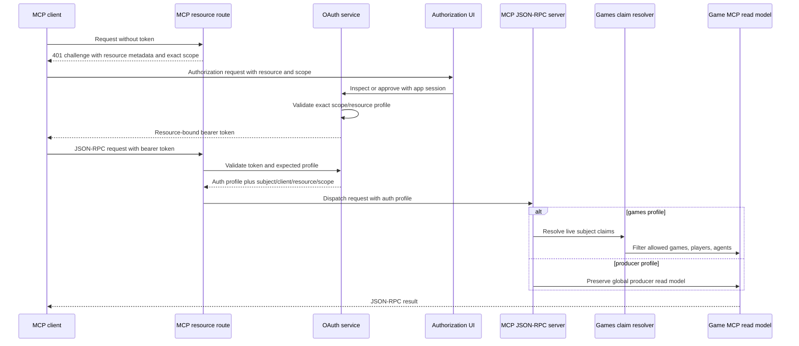
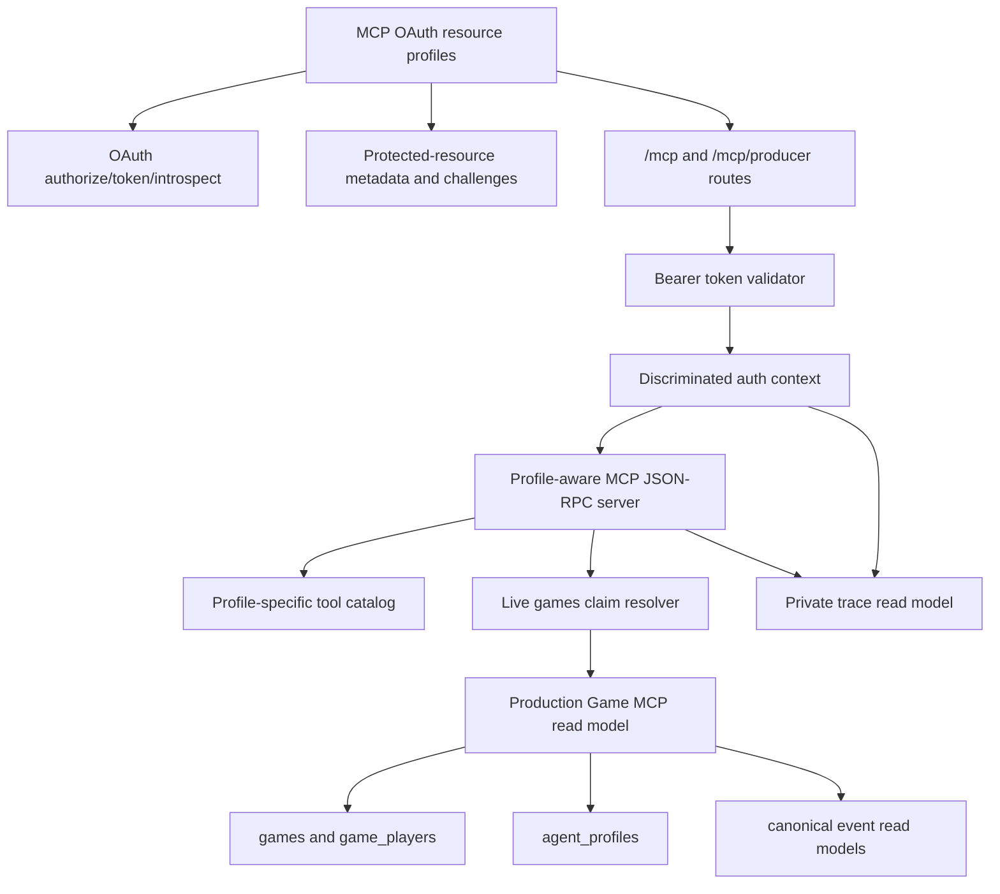

# feat: Add User-Facing Games MCP Scope

## Summary

Add a user-facing MCP OAuth boundary where `/mcp` is the `scope=games` resource for "access your games via MCP", while the existing producer/global surface moves to `/mcp/producer` with the current `scope=mcp` meaning. The implementation should propagate a discriminated auth profile into MCP dispatch, filter `games` calls by live subject-owned resources, and keep private traces producer-only.

This is an atomic cutover plan. It does not keep privileged producer access at old `/mcp`, and it does not attempt user-facing private trace representation or evidence-accessor policy upgrades.

---

## Problem Frame

Production Game MCP OAuth V0 is intentionally a privileged developer boundary: `mcp` role plus exact `scope=mcp` plus a valid resource-bound token grants global access to the wired producer MCP tools. The current code reflects that singleton model. OAuth validation only accepts `mcp`, metadata advertises only `mcp`, `/mcp` validates a bearer token before dispatch, and the MCP server/read model behaves globally after that gate.

The next product slice needs a separate user-facing scope without reinterpreting `scope=mcp`. A `games` token should authorize the authenticated subject's created or joined games and owned player/agent records, while producer evidence and private trace access remain behind `scope=mcp` on `/mcp/producer`.

The main risk is a partial split that looks correct in OAuth metadata but leaves producer defaults in the server or read model. The plan therefore treats route profiles, token validation, tool discovery, read-model filtering, consent copy, and matrix tests as one coherent boundary change.

---

## Requirements

**Scope and Resource Contract**

- R1. `/mcp` is the canonical user-facing protected MCP resource for `scope=games`, and `/mcp/producer` is the canonical producer protected MCP resource for `scope=mcp`. Covers origin R1-R5.
- R2. OAuth metadata, protected-resource metadata, challenges, authorization codes, access tokens, and resource-server validation accept only exact issued scope/resource pairings: `/mcp` with `games`, and `/mcp/producer` with `mcp`. Dynamic client registration and authorization requests may carry a supported scope set such as `games mcp`, but the resource indicator selects one exact grant scope and unsupported/missing profile scopes are rejected. Covers origin R5-R8, R28-R30.
- R3. `games` requires an authenticated app subject but not the `mcp` role; `mcp` preserves the current role-gated global producer contract. Covers origin R3-R4.
- R4. MCP bearer tokens remain distinct from app/API session tokens in both directions. Covers origin R8.

**Auth Context and Resource Claims**

- R5. The MCP route/server boundary passes a discriminated auth profile into JSON-RPC handling before any tool or read model runs. Covers origin R7, R14.
- R6. `games` resource claims are resolved from live application state instead of token rows: games created by the subject, games joined by the subject, and game player rows tied to agent profiles owned by the subject. Covers origin R9-R12.
- R7. `games` list, read, projection, event, timeline, and player/agent record responses are filtered to the subject's allowed game/player/agent resources. Covers origin R13.
- R8. `games` handling never defaults to producer visibility, and caller arguments cannot opt into producer visibility or cross-subject reads. Covers origin R15, R18.

**Tools, Traces, and Producer Preservation**

- R9. Tool discovery under `scope=games` exposes only user-facing game/player/agent read tools and no developer/global inspection wording. Covers origin R16-R17.
- R10. `/mcp/producer` preserves the existing producer inspection surface, including explicit private trace tools, behind `scope=mcp`. Covers origin R19, R21, R32.
- R11. `scope=games` exposes no private trace content, trace manifests, reasoning search, raw prompts, internal keys, or trace metadata. Covers origin R20, R31.
- R12. User-facing trace representation and evidence-accessor policy upgrades are deferred. Covers origin R22-R23.

**Consent, Audit, and Verification**

- R13. Consent copy describes `games` as "access your games via MCP", explains created/joined games plus owned player/agent records, and says it does not grant maintainer, developer evidence, or private trace access. Covers origin R24-R26.
- R14. Resource-selected OAuth and MCP audit events include subject, client, resource, issued scope, auth profile, method/tool, outcome, denial reason, and correlation ID while excluding secrets and response bodies. Dynamic client registration audit records the requested scope set without a selected auth profile. Covers origin R27.
- R15. Final-state tests cover valid `/mcp` plus `games`, valid `/mcp/producer` plus `mcp`, every wrong endpoint/scope/resource pairing, `games` trace denial, and producer trace preservation. Covers origin R30-R32.

---

## Key Technical Decisions

- **Use explicit MCP resource profiles:** Replace singleton `MCP_OAUTH_SCOPE` and resource helper usage with a small profile model for `games` and `producer`. This keeps scope/resource matching centralized instead of scattering string comparisons across OAuth, challenge, route, and tool code.
- **Make `/mcp` a hard cutover:** Do not leave a producer compatibility alias on `/mcp`. Existing producer tokens bound to old `/mcp` should fail after the cutover, and maintainers re-authorize against `/mcp/producer`.
- **Resolve user claims live:** Do not snapshot game IDs, player IDs, or agent profile IDs into OAuth tokens. Live DB reads make revoked joins, deleted profiles, or changed ownership take effect on the next call without token migration.
- **Pass auth profile into JSON-RPC dispatch:** Bearer validation should return `games_subject` or `producer_mcp`, and `server.handle` should receive that context. A global read model behind a successful gate is no longer safe enough.
- **Partition by server/tool profile, not only by read-model conditionals:** `tools/list`, `initialize` copy, security schemes, and accepted tool calls should depend on the auth profile. Producer-only tools should be unreachable by name under `games` before trace read models are invoked.
- **Use existing canonical visibility as the user ceiling:** `games` reads can use current public/player canonical visibility, never producer visibility. If future work needs per-recipient private-room filtering beyond the current canonical event model, that is a separate policy/data-model slice.
- **Keep private traces producer-only:** Do not pass `games` users into `EvidenceAccessor` and do not expose trace metadata as a placeholder. Trace representation, redaction, derived thinking, and user policy subjects remain later work.
- **Verify the final matrix in one pass:** Because scope checks, DB constraints, route paths, and tool lists must agree, the release should be tested as the final cutover state rather than described as a staged release.

---

## Dependencies and Assumptions

- The existing Production Game MCP OAuth V0 is treated as the current contract, even if this next slice intentionally moves producer access from `/mcp` to `/mcp/producer`.
- Current ownership seams are sufficient for the first `games` claim resolver: `games.createdById`, `game_players.userId`, `game_players.agentProfileId`, and `agent_profiles.userId`.
- Current canonical game facts and player-visible event filtering are enough for user-facing game reads in this phase, as long as producer visibility and trace data are excluded.
- Database check constraints that currently allow only `mcp` must be migrated in the same cutover as the service code that can issue and validate `games`.
- MCP clients are expected to follow protected-resource metadata and `WWW-Authenticate` scope challenges. Some clients also register or request every authorization-server-supported scope, so the server tolerates supported scope sets only long enough to select the exact grant scope from the resource indicator; it still fails closed for unsupported scopes, missing selected scopes, and wrong scope/resource pairings.

---

## High-Level Technical Design

### Boundary Matrix

| Resource path | Scope | Subject gate | Auth profile | Tool surface | Trace access |
| --- | --- | --- | --- | --- | --- |
| `/mcp` | `games` | Logged-in app user | `games_subject` | User-facing game/player/agent reads filtered by live claims | None |
| `/mcp/producer` | `mcp` | Current `mcp` role | `producer_mcp` | Existing global producer inspection tools | Existing private trace tools |
| Any wrong path/scope/resource pairing | N/A | N/A | None | Rejected before dispatch | None |

### Request Flow

### Component Shape

The producer path is the only branch that reaches private trace reads.

---

## Implementation Units

### U1. OAuth Resource Profiles and Schema Constraints

- **Goal:** Expand OAuth issuance and persistence from a singleton `mcp` contract into two exact resource profiles: user-facing `games` and producer `mcp`.
- **Requirements:** R1-R4, R14-R15.
- **Dependencies:** Existing V0 OAuth tables and route tests.
- **Files:**
  - `packages/api/src/services/mcp-oauth.ts`
  - `packages/api/src/routes/mcp-oauth.ts`
  - `packages/api/src/db/schema.ts`
  - `packages/api/drizzle/0014_games_scope_mcp_oauth.sql`
  - `packages/api/drizzle/meta/_journal.json`
  - `packages/api/src/__tests__/mcp-oauth-routes.test.ts`
  - `packages/web/src/lib/mcp-oauth.ts`
  - `packages/web/src/__tests__/mcp-oauth.test.ts`
- **Approach:** Introduce named OAuth/MCP resource profiles with scope, canonical resource URI, protected-resource metadata path, display name, and role requirement. Replace `scope must be exactly mcp` checks with profile-aware scope parsing. Update DB check constraints so authorization codes and access tokens allow only `games` or `mcp`, while dynamic clients can store a supported scope set such as `games mcp`. Authorization chooses the exact grant scope from the resource indicator and rejects unsupported scopes, scope sets that omit the selected resource profile's scope, or registered clients whose stored scope set does not allow the selected grant scope.
- **Execution note:** Start characterization-first with failing route tests for `games` success, `mcp` success on producer, unsupported-scope rejection, and supported scope-set collapse to one issued grant before relaxing constraints.
- **Patterns to follow:** `authorizeMcpOAuth`, `exchangeMcpOAuthCode`, `introspectMcpAccessToken`, `validateMcpOAuthClientRedirect`, and the existing DB-backed token tests in `mcp-oauth-routes.test.ts`.
- **Test scenarios:**
  - Covers AE1. A logged-in user without the `mcp` role can inspect, approve, exchange, and introspect a `games` authorization for the `/mcp` resource.
  - Covers AE3. A user with the `mcp` role can still inspect, approve, exchange, and introspect an `mcp` authorization for the `/mcp/producer` resource.
  - Covers AE4. `games` with `/mcp/producer`, `mcp` with `/mcp`, unknown resources, missing resources, expired codes, reused codes, revoked tokens, and unsupported scope sets all fail without active tokens.
  - Given a dynamic client registers `scope=games`, later authorization for `/mcp/producer` is rejected because the stored scope set does not allow `mcp`; a client registered for `games mcp` may authorize either resource, but each issued code/token contains only the selected single scope.
  - Given OAuth audit events serialize, they include safe subject/client/resource/scope/profile metadata and exclude codes, access tokens, PKCE verifiers, and auth headers.
- **Verification:** OAuth route tests prove both exact profiles issue valid tokens and all wrong scope/resource combinations are rejected before route dispatch can matter.

### U2. Route Split and Auth-Context Propagation

- **Goal:** Mount `/mcp` and `/mcp/producer` as separate MCP resources, validate each against its expected profile, and pass auth context into JSON-RPC handling.
- **Requirements:** R1-R5, R8, R10, R14-R15.
- **Dependencies:** U1 resource profiles and token validation.
- **Files:**
  - `packages/api/src/routes/mcp.ts`
  - `packages/api/src/game-mcp/auth.ts`
  - `packages/api/src/game-mcp/server.ts`
  - `packages/api/src/index.ts`
  - `packages/api/src/__tests__/mcp-http-route.test.ts`
  - `packages/api/src/__tests__/production-game-mcp-server.test.ts`
- **Approach:** Register handlers for both MCP paths with route-specific expected profiles and route-specific bearer challenges. `validateGameMcpBearerToken` should validate audience, purpose, token activity, resource URI, and scope against the route's expected profile, then return a discriminated `GameMcpAuthContext`. Change `server.handle` to accept that context, and include `scope` plus `authProfile` in route audit events.
- **Execution note:** Add dispatch-spy tests before changing the route so wrong-profile requests prove the server is not invoked.
- **Patterns to follow:** Existing `preflight` fail-closed checks, `bearerChallenge`, route audit redaction, and `mcp-http-route.test.ts` DB-backed bearer validation.
- **Test scenarios:**
  - Covers AE4. A valid `games` token sent to `/mcp/producer` fails before JSON-RPC dispatch.
  - Covers AE4. A valid `mcp` token sent to `/mcp` fails before JSON-RPC dispatch.
  - Given missing auth reaches `/mcp`, the challenge points at user-facing protected-resource metadata and `scope=games`.
  - Given missing auth reaches `/mcp/producer`, the challenge points at producer protected-resource metadata and `scope=mcp`.
  - Given a valid token reaches the correct route, the server receives an auth context with subject, client, resource, scope, expiry, and profile.
  - Given query-string bearer tokens, invalid origins, unsupported content types, unsupported protocol versions, malformed JSON, or batch requests appear, both routes preserve the existing fail-closed behavior.
- **Verification:** HTTP route tests prove the endpoint path is part of authorization and no old producer behavior remains reachable at `/mcp`.

### U3. Live Games Claim Resolver and User-Scoped Reads

- **Goal:** Add a reusable claims boundary that constrains `games` MCP reads to the authenticated subject's allowed games, player records, and agent records.
- **Requirements:** R5-R8, R11.
- **Dependencies:** U2 auth context reaches server/read-model code.
- **Files:**
  - `packages/api/src/game-mcp/claims.ts`
  - `packages/api/src/game-mcp/read-model.ts`
  - `packages/api/src/db/schema.ts`
  - `packages/api/src/routes/games.ts`
  - `packages/api/src/__tests__/game-mcp-games-claims.test.ts`
  - `packages/api/src/__tests__/production-game-mcp-read-model.test.ts`
  - `packages/api/src/__tests__/durable-run-test-utils.ts`
- **Approach:** Build a claim resolver that derives allowed game IDs from `games.createdById`, `game_players.userId`, and `game_players` joined to `agent_profiles.userId`. It should also return owned player IDs and agent profile IDs so per-player/agent details can be filtered consistently. The read model should use `requireAccessibleGame` style checks after resolving IDs/slugs, filter `listGames` at the DB query boundary, and ensure event/timeline calls use public/player visibility ceilings under `games`. Producer reads should retain the existing global behavior through the producer profile.
- **Execution note:** Add negative tests for cross-user games before changing `listGames` or `requireGame`; this is the main resource authorization seam.
- **Patterns to follow:** `/api/player/games` joined-game history, join-route agent profile ownership validation, `getPersistedGameEvents`, and `canonicalEventIsVisibleTo`.
- **Test scenarios:**
  - Covers AE1. A user who created one game, joined a second game, and has no relationship to a third sees only the first two through `games`.
  - Covers AE1. A game player row using an agent profile owned by the subject is included even if the ownership has to be resolved through `agent_profiles`.
  - Given a subject requests an allowed game by slug or ID, projection and timeline reads succeed with no producer evidence fields.
  - Given a subject requests an unrelated game by slug or ID, the read fails without returning whether private trace manifests or producer evidence exist.
  - Given `filter_events` or `player_timeline` receives `visibilityMode=producer` under `games`, the request is rejected or clamped to the user ceiling and audited.
  - Given a producer auth profile calls the same read model, current global behavior remains available.
- **Verification:** Read-model tests prove `games` authorization is resource-based, not public-list-only, while producer reads remain unchanged.

### U4. Profile-Aware Tool Catalog and Trace Partition

- **Goal:** Make MCP tool discovery and tool calls reflect the auth profile so `games` cannot discover or invoke producer evidence/private trace tools.
- **Requirements:** R8-R12, R15.
- **Dependencies:** U2 auth context and U3 user-scoped read model.
- **Files:**
  - `packages/api/src/game-mcp/server.ts`
  - `packages/api/src/game-mcp/read-model.ts`
  - `packages/api/src/services/private-trace-read-model.ts`
  - `packages/api/src/services/evidence-access.ts`
  - `packages/api/src/__tests__/production-game-mcp-server.test.ts`
  - `packages/api/src/__tests__/production-game-mcp-read-model.test.ts`
- **Approach:** Split initialization copy, security schemes, `tools/list`, and `tools/call` routing by auth profile. The `games` catalog should expose only user-facing read tools for allowed games and owned player/agent records. It should omit `inspect_durable_run`, `list_trace_manifests`, `read_trace_content`, `search_reasoning_traces`, and any developer evidence wording. The producer catalog should preserve the existing tool names and trace behavior behind `scope=mcp`. Direct calls to hidden tool names under `games` should fail as unknown or unauthorized before touching private trace services.
- **Execution note:** Treat tool discovery tests as authorization tests, not snapshot polish.
- **Patterns to follow:** Existing `productionGameMcpTools`, JSON-RPC error handling for unknown tools, and `PrivateTraceReadModel` producer access through `LOCAL_PRODUCER_ACCESSOR`.
- **Test scenarios:**
  - Covers AE2. `tools/list` under `games` returns user-facing tools with `games` security schemes and no producer evidence or trace tool names.
  - Covers AE2. A `games` caller that directly calls a trace tool by name receives a JSON-RPC error before `PrivateTraceReadModel` is invoked.
  - Covers AE2. `initialize` under `games` describes user game access and does not mention global corpus, maintainer, private reasoning, or producer evidence access.
  - Covers AE3. `tools/list` under `/mcp/producer` still returns the existing producer tools, including explicit trace tools, with `mcp` security schemes.
  - Covers AE5. `games` responses for allowed games contain no trace manifest count, trace metadata, raw prompt, internal key, private reasoning, or developer evidence fields.
  - Given unknown or mutation-shaped tool names are called under either profile, the server rejects them without touching game lifecycle write paths.
- **Verification:** Server tests prove the user-facing MCP surface cannot discover, route to, or indirectly leak trace capabilities, while producer MCP remains trace-capable.

### U5. Consent Copy, Metadata Copy, and Audit Semantics

- **Goal:** Make the OAuth and MCP user-facing surfaces explain the correct boundary and make audits distinguish user-facing `games` from producer `mcp`.
- **Requirements:** R9, R13-R14.
- **Dependencies:** U1 profiles and U2 route contexts.
- **Files:**
  - `packages/api/src/routes/mcp-oauth.ts`
  - `packages/api/src/routes/mcp.ts`
  - `packages/api/src/services/mcp-oauth.ts`
  - `packages/web/src/app/oauth/mcp/authorize/authorize-client.tsx`
  - `packages/web/src/lib/api.ts`
  - `packages/web/src/lib/mcp-oauth.ts`
  - `packages/web/src/__tests__/mcp-oauth.test.ts`
  - `docs/game-mcp-production-oauth.md`
  - `CONCEPTS.md`
- **Approach:** Publish path-specific protected-resource metadata with resource names and scopes for `/mcp` and `/mcp/producer`. The authorization server metadata can advertise both supported scopes, but protected-resource metadata and `WWW-Authenticate` challenges should name the exact scope for the requested resource. Update the authorization preview API and UI to render separate copy for `games` and `mcp`: `games` is user resource access and does not require the `mcp` role; `mcp` is producer access and still requires the role. Extend OAuth and MCP audit metadata to include auth profile and denial reasons without logging response bodies or secrets.
- **Patterns to follow:** Current authorize `inspect` flow, `ProblemState` rendering, `McpOAuthAuditEvent`, `GameMcpAuditEvent`, and glossary definitions for Games MCP scope and Producer MCP.
- **Test scenarios:**
  - Covers AE1. The `games` authorization preview says "access your games via MCP" and names created/joined games plus owned player/agent records.
  - Covers AE2. The `games` authorization preview says it does not grant maintainer access, developer evidence access, or private trace access.
  - Covers AE3. The producer authorization preview retains maintainer/global producer copy and still reports role denial for users without the `mcp` role.
  - Given a non-`mcp` user authorizes `games`, the UI does not show "MCP Role Required".
  - Given metadata is fetched for each protected-resource path, it returns the matching resource URI, resource name, and single supported scope.
  - Given audits serialize success and denial cases, they include profile/scope/resource/tool metadata and exclude bearer tokens, auth headers, response bodies, prompts, raw trace content, and storage credentials.
- **Verification:** API and web tests prove metadata, consent, denial, and audit behavior match the two-boundary model.

### U6. Final Authorization Matrix and Documentation Cutover

- **Goal:** Lock the atomic cutover with end-to-end final-state tests and update docs from the old `/mcp` producer framing to the new user/producer split.
- **Requirements:** R1-R15.
- **Dependencies:** U1-U5.
- **Files:**
  - `packages/api/src/__tests__/mcp-oauth-routes.test.ts`
  - `packages/api/src/__tests__/mcp-http-route.test.ts`
  - `packages/api/src/__tests__/production-game-mcp-server.test.ts`
  - `packages/api/src/__tests__/production-game-mcp-read-model.test.ts`
  - `packages/web/src/__tests__/mcp-oauth.test.ts`
  - `docs/game-mcp-production-oauth.md`
  - `DEVELOPMENT.md`
  - `README.md`
- **Approach:** Add a final matrix test set that exercises the deployed-state contract across OAuth issuance, route validation, tool discovery, read-model filtering, trace denial, producer trace preservation, and documentation examples. Rewrite the production OAuth doc so `/mcp` is the user-facing resource and `/mcp/producer` is the producer resource. Remove old wording that says `/mcp` plus `scope=mcp` is the production producer endpoint, except where it is clearly described as prior V0 context.
- **Execution note:** Run this unit after the earlier tests exist; it should fail if any layer still treats `/mcp` as producer.
- **Patterns to follow:** Existing production OAuth doc structure and the current route/server/read-model test grouping.
- **Test scenarios:**
  - Covers AE4. Every wrong endpoint/scope/resource pairing fails before JSON-RPC dispatch.
  - Covers AE5. A game with private trace manifests remains readable through allowed `games` game tools without exposing trace content or trace metadata.
  - Covers AE3. The same game remains trace-capable through `/mcp/producer` with `scope=mcp` and a current `mcp` role.
  - Given a legacy producer token is bound to old `/mcp`, it is rejected after the cutover instead of silently granting producer access.
  - Given docs show client setup, user clients point at `/mcp` with `games` and producer clients point at `/mcp/producer` with `mcp`.
- **Verification:** The full test suite has a final-state auth matrix, and docs no longer teach privileged producer access at `/mcp`.

---

## Scope Boundaries

### In Scope

- User-facing OAuth `scope=games` for MCP clients.
- Hard endpoint split: `/mcp` for `games`, `/mcp/producer` for `mcp`.
- Live resource authorization for created/joined games and owned player/agent records.
- Auth-context propagation into MCP JSON-RPC handling and read-model behavior.
- User/producer tool discovery and tool-call partitioning.
- Consent, metadata, audit, docs, and final-state tests for the atomic cutover.

### Deferred to Follow-Up Work

- User-facing private trace, private reasoning, thinking, strategy packet, summary, or redacted derived-resource access.
- Evidence accessor migration for user policy subjects.
- Trace storage model changes, prompt/internal-key splitting, derived thinking resources, or data minimization policy.
- Fine-grained per-recipient private-room visibility if the canonical event model needs subject-specific visibility beyond public/player/producer.
- Refresh tokens, DPoP, long-lived MCP sessions, machine-to-machine grants, or a general third-party OAuth app platform.
- Mutation tools or game lifecycle control through MCP.

### Explicitly Out of Scope

- Compatibility aliases or deprecation ceremony for privileged producer access at old `/mcp`.
- Reinterpreting `scope=mcp` as user-scoped or stripping trace capabilities from producer MCP.
- Using normal app session tokens as MCP bearer tokens or MCP bearer tokens as app/API session tokens.
- Public ChatGPT app submission, broad external connector policy, or app UI widgets.

---

## System-Wide Impact

- **Auth boundary:** This changes the public MCP trust contract. `/mcp` becomes user-facing and `/mcp/producer` becomes the only producer path.
- **Database constraints:** Existing OAuth check constraints must expand from only `mcp` to the two allowed single scopes. A code/schema mismatch would break token issuance or allow invalid state.
- **Existing tokens:** Producer tokens previously bound to `/mcp` become invalid by design. Maintainers need to authorize against `/mcp/producer`.
- **Read-model defaults:** Producer visibility is no longer a safe default for every MCP caller. User-facing reads need profile-aware defaults and tests.
- **Docs and client config:** Setup examples must split user and producer MCP URLs so clients do not accidentally request the wrong scope.

---

## Risks and Mitigations

- **Fail-open singleton leftovers:** A missed `MCP_OAUTH_SCOPE` or resource helper could let `mcp` or producer defaults survive on `/mcp`. Mitigate with a resource profile registry and matrix tests that assert wrong pairings fail before dispatch.
- **Trace metadata leak through non-trace tools:** Existing list responses and durable inspection can mention developer evidence. Mitigate by keeping durable inspection producer-only and testing `games` responses for absence of trace/developer fields.
- **Client scope confusion:** Some MCP clients may use global authorization-server `scopes_supported` differently from path challenges. Mitigate with path-specific protected-resource metadata, exact `WWW-Authenticate` scope challenges, resource-indicator selection of one grant scope, and server-side rejection of unsupported or wrong scope/resource combinations.
- **Claim resolver misses legitimate ownership:** Older or unusual game player rows might have ownership through agent profiles rather than `game_players.userId`. Mitigate by resolving through both direct player rows and owned agent profiles.
- **DB migration ordering:** Code that issues `games` before constraints expand will fail, and constraints that expand before validation is correct could allow bad rows. Mitigate by shipping schema and service validation in one cutover and testing final DB-backed flows.
- **Over-scoping into trace product policy:** Trace representation is tempting because players may eventually see their own reasoning or thinking views. Mitigate by keeping this phase to authorization/resource access and preserving producer-only trace access.

---

## Documentation and Operational Notes

- Update `docs/game-mcp-production-oauth.md` so it documents both resources, both scopes, environment configuration, and client examples.
- Prefer explicit resource URI configuration for both profiles, such as separate games and producer resource URI helpers, rather than a singleton that can ambiguously mean either path.
- Protected-resource metadata should be path-specific for both resources. Root metadata may remain user-facing for `/mcp`, but producer challenges should not depend on root metadata.
- Operational checks should include unauthenticated challenges, OAuth metadata, valid user `games` authorization, valid producer `mcp` authorization, wrong-pair rejection, `games` trace absence, producer trace presence, and audit redaction.
- `CONCEPTS.md` already has Games MCP scope and Producer MCP entries; update them only if implementation changes the vocabulary.

---

## Acceptance Examples

- AE1. User game listing
  - **Given:** a user created one game, joined a second game, and has no relationship to a third game.
  - **When:** the user authorizes `scope=games` for `/mcp` and calls a game listing tool.
  - **Then:** the response includes only the created and joined games.

- AE2. Games tool discovery and producer visibility denial
  - **Given:** a valid `games` token for `/mcp`.
  - **When:** the client lists tools or attempts to request producer visibility.
  - **Then:** producer/private trace tools are absent or rejected, and no producer-visibility data is returned.

- AE3. Producer MCP preservation
  - **Given:** a maintainer with the `mcp` role has a valid `scope=mcp` token for `/mcp/producer`.
  - **When:** the maintainer lists tools.
  - **Then:** the existing producer inspection tools remain available, including explicit private trace tools.

- AE4. Wrong boundary fails closed
  - **Given:** a `games` token is sent to `/mcp/producer` or an `mcp` token is sent to `/mcp`.
  - **When:** the request reaches the MCP resource server.
  - **Then:** the request fails before JSON-RPC dispatch and the denial is audited without leaking secrets.

- AE5. Trace data stays producer-only
  - **Given:** private trace manifests exist for a game the user can otherwise access through `games`.
  - **When:** the user calls user-facing MCP tools for that game.
  - **Then:** no private trace content, manifest metadata, reasoning search result, raw prompt, or internal key is returned.

---

## Sources and Research

- Origin requirements: `docs/brainstorms/2026-06-19-games-scope-mcp-oauth-hardening-requirements.md`.
- Current ideation: `docs/ideation/2026-06-19-games-scope-mcp-oauth-hardening-ideation.html`.
- Existing V0 docs and plan: `docs/game-mcp-production-oauth.md`, `docs/plans/2026-06-19-001-feat-production-game-mcp-http-oauth-plan.md`.
- OAuth and MCP code seams: `packages/api/src/services/mcp-oauth.ts`, `packages/api/src/routes/mcp-oauth.ts`, `packages/api/src/routes/mcp.ts`, `packages/api/src/game-mcp/auth.ts`, `packages/api/src/game-mcp/server.ts`, `packages/api/src/game-mcp/read-model.ts`.
- Trace and evidence seams: `packages/api/src/services/private-trace-read-model.ts`, `packages/api/src/services/evidence-access.ts`.
- Ownership seams: `packages/api/src/db/schema.ts`, `packages/api/src/routes/games.ts`.
- Web consent seams: `packages/web/src/app/oauth/mcp/authorize/authorize-client.tsx`, `packages/web/src/lib/mcp-oauth.ts`.
- MCP authorization spec: <https://modelcontextprotocol.io/specification/2025-11-25/basic/authorization>.
- OAuth 2.0 Resource Indicators, RFC 8707: <https://www.rfc-editor.org/rfc/rfc8707.html>.
