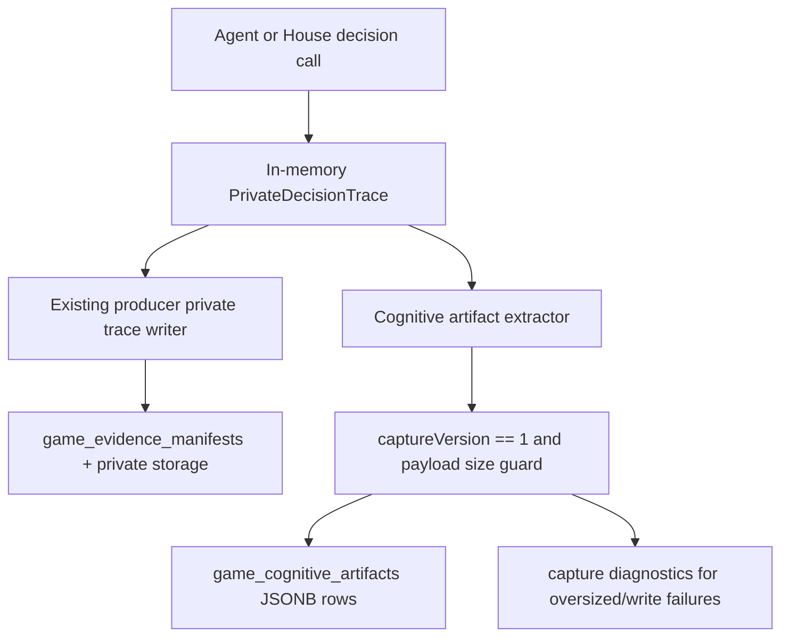
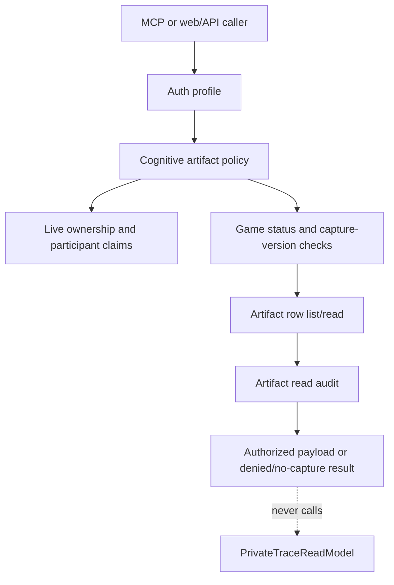

# feat: Add User Cognitive Artifact Access

## Summary

Add a new-games-only cognitive artifact boundary for `reasoning`, `thinking`, and `strategy`. New API-backed games should capture these artifacts at decision time as first-class product records, authorize them through owner, participant, and producer/admin policy, and expose them through MCP plus minimal authenticated web/API reads without reading producer private traces as fallback.

This plan covers the full brainstorm slice: schema, write-time extraction, shared authorization, MCP tools, minimal API routes, auditing, tests, rollout, and docs. It intentionally defers polished web UI, generated summaries, old-game backfill, and artifact object storage until size or product evidence justifies them.

---

## Problem Frame

Influence already writes private decision traces for producer/admin evidence. Those traces are valuable but deliberately broad: they may include prompts, raw provider responses, internal metadata, storage pointers, tool arguments, emitted `thinking`, native `reasoningContext`, source pointers, and structured strategy fields. That bundle is a poor user-facing access model because one authorized field does not imply the caller can see the entire trace envelope.

The current Games MCP split is also intentional. `/mcp` with `scope=games` is the user-facing no-trace surface for accessible games and owned player/agent records. `/mcp/producer` with `scope=mcp` preserves the producer/global inspection boundary and private trace tools. This feature should add user cognitive access without changing either scope's meaning.

The product move is to promote allowed cognitive fields into dedicated product records when a new game produces the decision, not to sanitize producer traces after the fact. Missing split artifacts should produce a clear no-capture result.

---

## Requirements Trace

The `PR#` identifiers below are plan-local requirements derived from the origin document plus the plan-time decisions confirmed during scoping. They intentionally do not reuse the origin document's `R#` namespace.

**Artifact Capture**

- PR1. New games write split cognitive artifacts for `reasoning`, `thinking`, and `strategy` from the decision-trace seam.
- PR2. `reasoning` stores provider-native/raw reasoning context only when the model produced it; it must not synthesize reasoning from emitted `thinking`.
- PR3. `thinking` stores explicit model-emitted thinking/debug text.
- PR4. `strategy` stores structured strategy data such as `decisionLog`, `strategicLens`, strategy packet summaries, and strategic reflection summaries when present.
- PR5. User artifact payloads never include raw prompts, raw provider responses, internal keys, storage pointers, full tool argument blobs, trace source-pointer internals, or private trace metadata.
- PR6. Artifact rows carry enough game, actor, owner, action, phase, round, status, and optional event-boundary metadata to authorize reads without consulting producer traces.
- PR7. House/system/producer-role cognitive artifacts are producer/admin-only in this slice.
- PR8. Juror decision artifacts are player-owned participant artifacts and follow the same owner/participant policy as player artifacts.

**Storage and New-Games-Only Behavior**

- PR9. Add an explicit capture-version marker so old, imported, and pre-deploy waiting games remain distinguishable from captured new games.
- PR10. Store V1 artifact payloads in Postgres JSONB with a hard per-artifact payload cap around 256 KiB.
- PR11. Treat artifact manifest/object storage as rejected for V1 unless size data crosses thresholds: artifact p95 above 64 KiB, more than 1 percent of artifacts hitting the 256 KiB cap, or one game commonly exceeding 5-10 MiB of cognitive artifact payload.
- PR12. Oversized or failed captures record degraded diagnostics; user-facing reads see unavailable/no-capture, while producer/admin reads can inspect diagnostics.
- PR13. Old games return `not_captured_for_game` only after the caller is authorized to know about that game/actor context, and never reconstruct artifacts by reading private trace storage.
- PR14. Artifact payloads and read-audit rows have explicit retention/redaction metadata and producer/admin-only diagnostic access.

**Authorization**

- PR15. User-facing reads are gated by participant/owner policy and capture version, not by game completion. Waiting games normally have no artifacts yet; in-progress captured games may expose authorized artifacts as they are written.
- PR16. A user can read `reasoning`, `thinking`, and `strategy` for player or juror records they own directly or through an owned agent profile.
- PR17. A same-game participant can read another participant's `thinking` and `strategy`, but not `reasoning`.
- PR18. Created-only game visibility is insufficient for other actors' cognitive artifacts.
- PR19. Nonparticipants must not list, read, infer existence of, or receive snippets from cognitive artifacts.
- PR20. Producer/admin callers can list and read all split artifacts directly without invoking raw trace tools.
- PR21. Denial checks happen before row-existence, capture-version, or no-capture checks for user callers so artifact existence and capture support do not leak.

**MCP and Web/API**

- PR22. `/mcp` with `scope=games` exposes bounded cognitive list/read capabilities for authorized split artifacts and still omits producer trace tools.
- PR23. `/mcp/producer` with `scope=mcp` exposes bounded producer cognitive list/read capabilities alongside existing producer trace tools.
- PR24. MCP list results return stable artifact URIs. User-facing direct reads must include artifact URI or explicit game context plus artifact ID so policy can authorize before fetching a row.
- PR25. Minimal authenticated web/API routes use the same read model and policy service as MCP.
- PR26. Public game detail, public transcript, websocket, replay, and canonical event surfaces do not expose cognitive artifact payloads.
- PR27. Final UX polish, LLM summaries, and artifact timeline cards are out of scope.

**Audit and Verification**

- PR28. Artifact reads are audited with subject, auth profile, game, actor, artifact type, outcome, denial reason, and purpose while excluding payload bodies.
- PR29. Writer tests prove sentinel prompt, raw response, tool argument, storage key, and source-pointer strings cannot enter user artifact payloads.
- PR30. Access tests cover owner, same-game participant, created-only nonparticipant, unrelated nonparticipant, producer MCP, and admin API callers.
- PR31. MCP tests prove `scope=games` can read authorized split artifacts while still failing to discover or call trace tools.
- PR32. No-fallback tests prove private trace storage/read models are not called for missing split artifacts, old games, or producer split-artifact reads.

---

## Key Technical Decisions

- **Use a first-class artifact table, not evidence manifests:** Add `game_cognitive_artifacts` and a dedicated read-audit table instead of extending `game_evidence_manifests`. Evidence manifests remain producer/admin forensic evidence.
- **Use an explicit capture-version column:** Add a `games.cognitiveArtifactCaptureVersion`-style column with default `0`, and enable version `1` only once the writer is deployed. This makes old/imported/waiting-game behavior queryable and fail-closed without marking games as captured before capture actually exists.
- **Capture beside private trace writing:** Add cognitive extraction as a sibling fan-out at the API trace sink. The writer may read the in-memory `PrivateDecisionTrace`, but persisted cognitive rows are independent from raw trace storage.
- **Widen the typed trace contract for strategy:** Do not read strategy from raw `trace.output`. Extend `PrivateDecisionTrace` with optional normalized strategy fields, then extract only those fields.
- **Whitelist extraction by artifact type:** Do not copy `output` or `toolArguments` wholesale. Reasoning, thinking, and strategy each get small, explicit extraction rules.
- **Keep JSONB first:** Store payloads directly in Postgres for V1. Artifact manifests are a later performance/storage slice only when measured size makes them necessary.
- **Centralize authorization:** Put owner/participant/producer/admin policy in one service used by MCP and web/API. Do not let route-specific checks drift.
- **Use joined-player claims for participant visibility:** Existing Games MCP `gameIds` includes created games; cognitive access must use joined game/player/owned-agent claims for participant and owner rules.
- **Allow live authorized reads:** User-facing reads are allowed for captured games once the caller passes the owner/participant policy. This supports live MCP inspection of a user's current game without falling back to producer traces.
- **Authorize before no-capture for user callers:** For user-facing reads, game/actor/type policy runs before row lookup or capture-version response so `denied` callers cannot infer whether artifacts or capture support exist.
- **Preserve producer trace semantics:** `/mcp/producer` keeps private trace tools unchanged. Split artifact access is an additional compact read path, not a replacement.

---

## Artifact Model

### Chosen Schema

Add a capture marker to `games` and two new tables.

`game_cognitive_artifacts` should store:

- `id`
- `gameId`
- `captureVersion`
- `artifactType`: `reasoning`, `thinking`, or `strategy`
- `actorRole`: player, juror, house, system, or producer
- `actorPlayerId` when the artifact belongs to a player
- `actorUserId` and `actorAgentProfileId` when known at capture time
- `action`, `phase`, `round`
- nullable `eventSequence` or boundary sequence
- `visibilityStatus`: active or capture_degraded
- `payloadByteLength`
- JSONB `payload`
- JSONB `diagnostics` for capture degradation, not user payload
- `retentionClass`
- `redactionStatus`
- nullable `expiresAt`
- nullable `redactedAt`
- `createdAt`

`game_cognitive_artifact_reads` should store:

- `artifactId` when known
- `gameId`
- `actorPlayerId` when known
- `artifactType` when known
- accessor user, auth profile, purpose, outcome, denial reason
- read timestamp
- no payload body or diagnostic body

The artifact table should index by game/type/actor, game/phase/round, game/action, and game/event sequence. The audit table should index by game, artifact, accessor, and timestamp.

### Payload Contract

- `reasoning` payload contains provider-native reasoning text/context plus capture metadata needed by the product.
- `thinking` payload contains emitted `thinking` text plus capture metadata.
- `strategy` payload contains whitelisted strategy receipts: `decisionLog`, `strategicLens`, `strategicLensRationale`, strategy packet summaries, strategic reflection summaries, and similar typed strategy values.

The payload contract intentionally excludes prompts, raw responses, storage keys, source-pointer internals, full tool arguments, and full raw output objects.

### Lifecycle Contract

Artifact payloads should carry retention/redaction metadata rather than living forever as unclassified JSONB. V1 should default artifacts to active debug retention, mark payloads redacted when a game, user, or agent erasure path requires it, and keep diagnostics producer/admin-only. Read-audit rows are metadata-only and should not store payload bodies or diagnostic bodies.

### Size Threshold

Artifact manifests are not part of this slice. Revisit that decision only if production or staging capture metrics show one of these conditions:

- p95 artifact payload size is above 64 KiB
- more than 1 percent of artifacts hit the 256 KiB cap
- a typical captured game stores more than 5-10 MiB of cognitive artifact payload

Until then, oversized artifacts become degraded capture diagnostics rather than object-storage pointers.

---

## Access-Control Matrix

| Caller | Captured game own actor reasoning | Captured game own actor thinking/strategy | Captured game other participant reasoning | Captured game other participant thinking/strategy | House/system artifacts | Producer traces |
| --- | --- | --- | --- | --- | --- | --- |
| Owner through `scope=games` | Allowed for player or juror actor | Allowed for player or juror actor | Denied | Allowed only if same-game participant | Denied | Denied |
| Same-game participant through `scope=games` | Allowed for owned player or juror actor only | Allowed for owned player or juror actor | Denied | Allowed | Denied | Denied |
| Created-only nonparticipant through `scope=games` | Allowed only if they own the player or juror actor | Allowed only if they own the player or juror actor | Denied | Denied | Denied | Denied |
| Unrelated nonparticipant | Denied | Denied | Denied | Denied | Denied | Denied |
| Producer MCP through `scope=mcp` | Allowed | Allowed | Allowed | Allowed | Allowed | Existing producer tools |
| Admin API session | Allowed | Allowed | Allowed | Allowed | Allowed | Existing admin/producer paths only |
| Old game without capture | `not_captured_for_game` after authorization | `not_captured_for_game` after authorization | `not_captured_for_game` after authorization | `not_captured_for_game` after authorization | Producer/admin only if split rows exist | Existing producer-only trace behavior |

For user-facing callers, authorization should validate game status, actor ownership or participation, and artifact type before checking capture version or whether a specific row exists. Nonparticipants and created-only users should get the same denial shape whether the row exists, is missing, belongs to an old game, or was guessed by URI.

---

## High-Level Technical Design

### Capture Flow

The private trace writer and cognitive artifact writer share the in-memory trace source but not storage or read policy.

### Read Flow

The no-fallback rule is part of the read-model contract, not just route behavior.

### MCP Resource Shape

Use tools first, with stable artifact URIs in results:

- `list_cognitive_artifacts`
- `read_cognitive_artifact`

List results should include URIs shaped like `influence-game://deployed/games/{gameId}/cognitive-artifacts/{artifactId}`. User-facing direct reads must provide that URI or explicit game context plus artifact ID so the policy can authorize game/actor/type context before fetching the row. Producer/admin reads may support bare artifact IDs after producer/admin auth. Avoid broad `resources/list` fanout for every artifact in V1 because one active producer account could have a large corpus.

List operations must be bounded. User-facing lists should be scoped to one authorized game and clamp `limit` with cursor pagination. Producer/admin lists should require a game filter or time-window filter and the same limit/cursor bounds.

---

## Implementation Units

### U1. Schema, Migration, and Dormant Capture Marker

- **Goal:** Add the persistent product boundary for cognitive artifacts and make new-games-only behavior queryable without enabling capture before the writer exists.
- **Requirements:** PR9-PR14, PR28.
- **Files:**
  - `packages/api/src/db/schema.ts`
  - `packages/api/drizzle/0015_user_cognitive_artifacts.sql`
  - `packages/api/drizzle/meta/_journal.json`
  - `packages/api/drizzle/meta/0015_snapshot.json`
  - `packages/api/src/routes/admin.ts`
  - `packages/api/src/db/seed.ts`
  - `packages/api/src/__tests__/test-utils.ts`
  - `packages/api/src/__tests__/db.test.ts`
  - `packages/api/src/__tests__/games-api.test.ts`
- **Approach:** Add `games.cognitive_artifact_capture_version` with default `0`, but do not set version `1` in creation paths until the writer lands. Imported games and existing rows stay `0`. Add `game_cognitive_artifacts` and `game_cognitive_artifact_reads` with check constraints for artifact type, actor role, redaction status, outcome, and positive byte/event values. Add retention/redaction fields to artifacts and keep read audits metadata-only. Add new tables to test truncation helpers.
- **Patterns to follow:** `game_evidence_manifests`, `game_evidence_manifest_reads`, `mcp_oauth_*` check constraints, and the Games MCP OAuth migration style.
- **Test scenarios:**
  - Existing rows default to capture version `0`.
  - Importing a game through admin import keeps capture version `0`.
  - No game creation path marks version `1` before U2 lands.
  - Existing fixture/seed games either set version intentionally after U2 or remain no-capture when they represent historical data.
  - Artifact type, actor role including `juror`, redaction status, read outcome, and payload byte-length constraints reject invalid rows.
  - Artifact rows can be redacted or expired without leaving payload bodies accessible.
  - Test database truncation includes both new tables in dependency-safe order.
- **Verification:** DB and route tests prove the marker exists but remains dormant until capture writing is available.

### U2. Cognitive Artifact Extractor and Writer

- **Goal:** Capture whitelisted reasoning, thinking, and strategy records from eligible new-game decision traces without weakening private trace storage.
- **Requirements:** PR1-PR14, PR29.
- **Files:**
  - `packages/api/src/services/cognitive-artifact-writer.ts`
  - `packages/api/src/services/game-lifecycle.ts`
  - `packages/api/src/routes/games.ts`
  - `packages/api/src/routes/free-queue.ts`
  - `packages/api/src/services/private-trace-writer.ts`
  - `packages/engine/src/game-runner.types.ts`
  - `packages/engine/src/agent.ts`
  - `packages/engine/src/house-interviewer.ts`
  - `packages/api/src/__tests__/cognitive-artifact-writer.test.ts`
  - `packages/api/src/__tests__/private-trace-writer.test.ts`
- **Approach:** Add a pure extraction layer that receives `PrivateDecisionTrace` plus game capture context and returns zero or more cognitive artifact writes. Extend the typed trace contract with optional normalized strategy fields such as `strategicLens`, `strategicLensRationale`, `strategyPacketSummary`, and `strategicReflectionSummary`, populated by engine emitters from normalized action outputs. Reasoning comes only from `reasoningContext`; thinking comes only from emitted thinking; strategy comes only from `decisionLog`, strategy packet revision, and the new normalized strategy trace fields. The extractor must ignore raw `trace.output` and raw `toolArguments` for payload construction. The API lifecycle should fan out to the cognitive writer beside `writePrivateDecisionTrace`, and the same deploy that installs the writer should start setting capture version `1` for new custom and free-queue games. Writer failures should resolve as degraded capture diagnostics and never throw into canonical gameplay.
- **Patterns to follow:** `writePrivateDecisionTrace`, `buildTraceMetadata`, `markEvidenceDegraded`, and the existing optional private trace sink in `game-lifecycle.ts`.
- **Test scenarios:**
  - A trace containing prompt, raw response, tool arguments, storage key, source pointers, `thinking`, `reasoningContext`, `decisionLog`, and `strategicLens` writes only the allowed cognitive fields.
  - Provider-native reasoning absence skips `reasoning` without synthesizing it from thinking.
  - Strategy extraction captures normalized strategy trace fields but not full raw tool arguments, full output blobs, or arbitrary nested output.
  - Juror traces write player-owned cognitive artifacts and follow the same owner/participant rules as player traces.
  - House/system traces either write producer-only artifacts or are skipped for user visibility; no user-visible House/system artifact is produced.
  - Oversized payloads become degraded diagnostics and do not create partial user payloads.
  - Cognitive writer failure does not prevent the existing private trace writer from running and does not corrupt game progress.
  - Creating a normal or free-track game after the writer deploy sets capture version `1`.
- **Verification:** Writer tests prove the extraction whitelist and no-leak contract before any read surface exists.

### U3. Shared Authorization and Read Model

- **Goal:** Centralize artifact list/read authorization for MCP, web/API, producer MCP, and admin API callers.
- **Requirements:** PR13-PR21, PR24-PR26, PR28, PR30, PR32.
- **Files:**
  - `packages/api/src/services/cognitive-artifact-read-model.ts`
  - `packages/api/src/services/cognitive-artifact-policy.ts`
  - `packages/api/src/game-mcp/claims.ts`
  - `packages/api/src/game-mcp/read-model.ts`
  - `packages/api/src/services/private-trace-read-model.ts`
  - `packages/api/src/__tests__/cognitive-artifact-read-model.test.ts`
  - `packages/api/src/__tests__/production-game-mcp-read-model.test.ts`
- **Approach:** Build a read model that applies user-facing policy before returning capture-version, no-capture, or row-existence information. User-facing reads should first prove the caller may access the game/actor/type context using live `joinedGameIds`, owned `playerIds`, and owned `agentProfileIds`; it should not use broad `gameIds` alone because that includes created-only games. After authorization, the read model can check capture version and rows and return `not_captured_for_game`, `not_captured`, or payload results. Producer/admin policy can read all split artifacts directly. The read model never calls private trace storage.
- **Patterns to follow:** `resolveGamesMcpClaims`, `ProductionGameMcpReadModel.requireGame`, `PrivateTraceReadModel` result metadata, and evidence-read audit redaction.
- **Test scenarios:**
  - Owner can read own captured-game reasoning, thinking, and strategy.
  - Same-game participant can read another actor's captured-game thinking and strategy but not reasoning.
  - Created-only nonparticipant can list the game through existing Games MCP claims but cannot read other actors' cognitive artifacts.
  - Unrelated nonparticipant gets the same denial shape whether an artifact exists, is missing, belongs to an old game, or is guessed by ID/URI.
  - User-facing reads for in-progress captured games obey the same owner/participant artifact policy as completed games.
  - Producer MCP can read all artifact types for any status.
  - Admin API access can read all artifact types for any status through the same service.
  - Old game with private traces returns `not_captured_for_game`; spies prove `PrivateTraceReadModel` and private trace storage are not called.
  - Oversized/degraded captures return user-unavailable results while producer/admin can inspect diagnostics.
- **Verification:** Read-model tests prove the authorization matrix and the no-fallback rule independent of transport.

### U4. MCP Cognitive Artifact Tools

- **Goal:** Expose authorized split artifacts through user and producer MCP profiles while preserving trace-tool separation.
- **Requirements:** PR22-PR24, PR31-PR32.
- **Files:**
  - `packages/api/src/game-mcp/server.ts`
  - `packages/api/src/game-mcp/read-model.ts`
  - `packages/api/src/routes/mcp.ts`
  - `packages/api/src/__tests__/production-game-mcp-server.test.ts`
  - `packages/api/src/__tests__/production-game-mcp-read-model.test.ts`
  - `packages/api/src/__tests__/mcp-http-route.test.ts`
- **Approach:** Add `list_cognitive_artifacts` and `read_cognitive_artifact` to both MCP profiles, backed by the shared read model. `/mcp` advertises user-facing descriptions and `games` security schemes. `/mcp/producer` advertises producer descriptions and `mcp` security schemes. User-facing list calls require an authorized game and bounded pagination. Producer list calls require a game or time-window filter and bounded pagination. User-facing direct reads require artifact URI or explicit game context plus artifact ID; producer/admin reads may accept bare artifact IDs after producer/admin auth. Trace tools remain producer-only, and direct trace-tool calls under `scope=games` continue to fail before trace services run.
- **Patterns to follow:** Existing profile-aware `tools/list`, JSON-RPC tool dispatch, `read_projection`, `filter_events`, `read_trace_content`, and `search_reasoning_traces`.
- **Test scenarios:**
  - `tools/list` under `scope=games` includes cognitive list/read tools and excludes `inspect_durable_run`, `list_trace_manifests`, `read_trace_content`, and `search_reasoning_traces`.
  - `tools/list` under `scope=mcp` includes cognitive tools plus existing producer trace tools.
  - A `games` caller can list authorized artifacts for a participated captured game.
  - User-facing list calls reject or clamp over-limit requests and require a game context.
  - Producer list calls reject unbounded corpus-wide requests unless a game or time-window filter is present.
  - A `games` caller cannot read another participant's reasoning by guessed artifact ID or URI.
  - A `games` caller that directly calls trace tools receives a JSON-RPC error before private trace services are invoked.
  - A producer caller can list/read split artifacts while private trace storage is unavailable.
  - Returned artifact URIs are stable and direct reads re-authorize every time.
- **Verification:** MCP tests prove split artifacts are added without blurring the no-trace `scope=games` boundary.

### U5. Minimal Authenticated Web/API Read Surface

- **Goal:** Make the same read model available to web clients and admin inspection without building final UX.
- **Requirements:** PR20, PR25-PR28, PR30.
- **Files:**
  - `packages/api/src/routes/cognitive-artifacts.ts`
  - `packages/api/src/routes/admin.ts`
  - `packages/api/src/index.ts`
  - `packages/web/src/lib/api.ts`
  - `packages/api/src/__tests__/cognitive-artifacts-api.test.ts`
  - `packages/api/src/__tests__/games-api.test.ts`
- **Approach:** Add authenticated participant endpoints for listing and reading artifacts under a game, and admin endpoints under the admin game surface for producer/admin inspection. Both should call the shared read model and apply the same bounded list controls as MCP. Web support should be typed API-client functions only; no polished UI is required. Public game detail, transcript, websocket, replay, and canonical event routes should remain unchanged.
- **Patterns to follow:** `createGameRoutes`, `createAdminRoutes`, `requireAuth`, `requirePermission("view_admin")`, and `packages/web/src/lib/api.ts` typed wrappers.
- **Test scenarios:**
  - Authenticated owner can read own captured-game artifacts through API.
  - Same-game participant can read another actor's thinking/strategy but not reasoning through API.
  - Created-only nonparticipant and unrelated nonparticipant get denial without existence leakage.
  - Admin API route can list/read all split artifacts and diagnostics.
  - User and admin list endpoints clamp limits, use cursors, and reject unscoped producer/admin corpus-wide listing.
  - Public `GET /api/games/:idOrSlug`, transcript, websocket, replay-facing routes, and canonical event surfaces do not include cognitive artifact payloads.
  - API reads audit allowed, denied, no-capture, and degraded outcomes without payload bodies.
- **Verification:** API tests prove web-ready access uses the same authorization contract as MCP and does not accidentally expose artifacts through public routes.

### U6. Documentation, Rollout, and Observability

- **Goal:** Document the new split-artifact boundary, rollout order, and operational checks.
- **Requirements:** PR9-PR14, PR22-PR32.
- **Files:**
  - `CONCEPTS.md`
  - `docs/game-mcp-production-oauth.md`
  - `docs/reasoning-transcript-observability.md`
  - `docs/solutions/runtime-errors/production-game-mcp-raw-trace-read-limit.md`
  - `docs/solutions/architecture-patterns/agent-strategy-observability-spine.md`
  - `README.md`
  - `DEVELOPMENT.md`
- **Approach:** Update docs to distinguish producer traces from cognitive artifacts, describe new-games-only behavior, document MCP cognitive tools, and record size thresholds for avoiding artifact manifests. Add rollout checks that prove old games no-capture, new games capture, `scope=games` no-trace, and producer/admin direct split reads.
- **Patterns to follow:** Existing docs for Games MCP OAuth, reasoning observability, private trace limits, and strategy observability.
- **Test scenarios:**
  - Docs state that missing split artifacts never fall back to producer trace reads.
  - Docs state that producer/admin can read split artifacts directly.
  - Docs state that user-facing reads are post-completion and House/system artifacts are producer-only.
  - Docs state that juror artifacts are player-owned participant artifacts.
  - Docs state that artifact payloads and read audits have retention/redaction handling.
  - Docs keep `scope=games` and `scope=mcp` semantics unchanged.
- **Verification:** Documentation review confirms behavior, auth, and rollout language match the implementation plan.

---

## Rollout Order

1. Land schema, migration, artifact/audit tables, and dormant capture marker with no version `1` writes.
2. Add extractor/writer with leakage tests and atomically enable version `1` for new game creation, but no public read surface.
3. Add shared read model and authorization matrix tests.
4. Add MCP list/read tools for `/mcp` and `/mcp/producer`.
5. Add minimal web/API routes and typed client helpers.
6. Update docs and run the final validation matrix.

This order keeps data capture and policy testable before any new user-facing transport can expose it, and prevents games from being marked capture-enabled before the writer is installed.

---

## Test Strategy

- **Database:** migration constraints, dormant capture-version defaults, artifact indexes, retention/redaction fields, juror actor role, and test truncation.
- **Writer:** typed strategy trace fields, whitelist extraction, sentinel leakage, payload-size degradation, nonblocking failure, juror artifacts, and House/system producer-only behavior.
- **Read model:** owner, participant, created-only, nonparticipant, producer MCP, admin API, live captured-game access, old-game no-capture after authorization, degraded capture, and no trace fallback.
- **MCP:** tool catalog split, bounded list controls, explicit game-context reads for user callers, authorized user reads, guessed-ID/URI denial, trace-tool denial under `scope=games`, producer split reads independent from raw trace storage.
- **API:** authenticated participant routes, admin routes, bounded list controls, public-route nonexposure, canonical event nonexposure, audit rows without payload bodies.
- **Regression:** existing private trace writer/read tests and Games MCP OAuth tests continue to pass unchanged.

Recommended validation sequence for implementation is focused DB/API tests first, then the repo baseline with `bun run test`; run `bun run check` before merge if the implementation touches shared types or docs broadly.

---

## Migration Recommendation

Do not migrate old games in V1.

The migration should add the capture-version column with default `0`, create artifact/audit tables, and leave existing rows unchanged. New creation paths should not set version `1` until the writer is deployed in the same change. Admin imports and pre-deploy waiting games stay no-capture unless a later explicit migration marks them.

Backfilling from private traces is rejected because it violates the product boundary this slice is introducing. A future migration can be considered only for games that already have split artifact rows or for a narrow waiting-game transition where no decisions have run yet.

---

## Rejected Ideas

- **Sanitize producer traces on read:** Rejected because trace bundles contain unrelated sensitive fields and would make user access depend on producer evidence structure.
- **Extend `game_evidence_manifests` for users:** Rejected because evidence manifests are producer/admin chain-of-evidence records with private storage pointers.
- **Add an artifact manifest/object-storage layer now:** Rejected unless size thresholds are crossed; JSONB is simpler and easier to authorize for V1.
- **Treat game creators as participants:** Rejected for this slice because current Games MCP visibility is broader than cognitive participation.
- **Allow live participant reads:** Rejected for V1 because other agents' strategy could affect an active game.
- **Expose House/system artifacts to users:** Rejected for V1 because House artifacts may include omniscient or producer-only context.
- **Backfill old games from private traces:** Rejected because it recreates the trace-fallback behavior the feature is meant to avoid.
- **Use public transcripts or canonical events as the artifact store:** Rejected because cognitive artifacts are neither player-visible speech nor canonical game truth.

---

## Sources

- `docs/brainstorms/2026-06-19-user-cognitive-artifacts-mcp-web-access-requirements.md`
- `docs/ideation/2026-06-19-user-cognitive-artifacts-mcp-web-access-ideation.html`
- `STRATEGY.md`
- `CONCEPTS.md`
- `docs/game-mcp-production-oauth.md`
- `docs/reasoning-transcript-observability.md`
- `docs/solutions/runtime-errors/production-game-mcp-raw-trace-read-limit.md`
- `docs/solutions/architecture-patterns/agent-strategy-observability-spine.md`
- `docs/plans/2026-06-19-002-feat-games-scope-mcp-oauth-plan.md`
- `docs/plans/2026-06-15-001-feat-private-trace-writer-mcp-plan.md`
- `packages/api/src/db/schema.ts`
- `packages/api/src/game-mcp/claims.ts`
- `packages/api/src/game-mcp/read-model.ts`
- `packages/api/src/game-mcp/server.ts`
- `packages/api/src/routes/mcp.ts`
- `packages/api/src/routes/games.ts`
- `packages/api/src/routes/free-queue.ts`
- `packages/api/src/routes/admin.ts`
- `packages/api/src/services/private-trace-writer.ts`
- `packages/api/src/services/private-trace-read-model.ts`
- `packages/api/src/services/private-trace-storage.ts`
- `packages/api/src/services/evidence-access.ts`
- `packages/api/src/services/game-evidence.ts`
- `packages/api/src/services/game-lifecycle.ts`
- `packages/engine/src/game-runner.types.ts`
- `packages/engine/src/agent.ts`
- `packages/engine/src/house-interviewer.ts`
