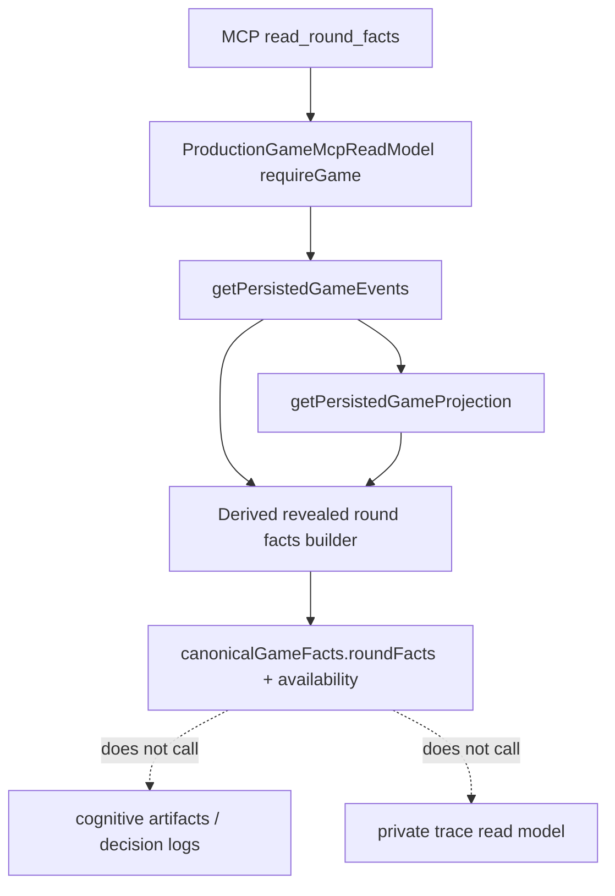

# feat: Add Games MCP Revealed Round Facts

## Summary

Add a minimal `scope=games` companion surface that returns revealed game facts for one accessible game round. The new surface derives sanitized vote, power, Council, player-status, and availability facts from persisted canonical events and projections, without changing raw event visibility or reading decision logs, cognitive artifacts, producer private traces, or source pointers.

This plan is a small follow-up to the cognitive artifact slice. It gives MCP clients authoritative gameplay facts to interpret player-visible thinking and strategy artifacts, while preserving the producer/admin raw-event and private-trace boundaries.

---

## Problem Frame

The split cognitive artifact slice exposes authorized reasoning, thinking, and strategy records for new API games. That is useful only if players can also ask for the authoritative gameplay facts those artifacts refer to. Today, `scope=games` hides most mechanics events because raw canonical envelopes such as `vote.cast`, `power.action_set`, and `council.elimination_resolved` are emitted with `visibility: "producer"`.

Changing those event visibilities would expose too much raw canonical envelope shape and would weaken the current producer/debug split. The smaller fix is a derived facts read model: read the trusted canonical event prefix internally, project the accepted game state, and return only whitelisted, player-visible facts once they are resolved.

The output must be honest when the durable event stream has not caught up. Cognitive artifacts may exist before canonical facts are persisted at a durable boundary, but this surface must not fill that gap from artifacts or traces.

---

## Requirements

**Access and Authority**

- R1. A `scope=games` caller can read revealed round facts only for games already accessible through the Games MCP created-or-joined game policy.
- R2. Producer MCP callers keep existing global access and may also call the derived facts tool, but producer raw event and private trace tools remain unchanged.
- R3. Revealed facts are derived from persisted canonical events and canonical projections only.
- R4. The read model must not read decision logs, cognitive artifacts, producer private traces, private trace manifests, or raw trace content as fallback sources.

**Facts Contract**

- R5. The response includes the selected round, game status, phase/status, alive and eliminated players, and per-section availability diagnostics.
- R6. The standard vote section includes a revealed ledger only after the standard vote is resolved: voter, empower target, expose target, and revote empower target when available.
- R7. The standard vote section includes empower tally and empowered player once resolved.
- R8. The exposure/power section includes exposure scores, exposure bench/final candidate summary when available, power action summary once set, shield/auto-elimination outcomes, and final Council candidates once resolved.
- R9. The Council section includes Council vote ledger and elimination result only once Council elimination is resolved.
- R10. Responses clearly distinguish `available`, `not_yet_resolved`, `not_yet_flushed`, and `unavailable` canonical facts, and always state that artifact-derived facts are not used.

**Sanitization**

- R11. Responses must not include raw canonical event envelopes, `sourcePointers`, event hashes, trace IDs, storage keys, private trace metadata, prompts, raw provider responses, reasoning, thinking, decision logs, or arbitrary internal metadata.
- R12. User-facing diagnostics are coarse and product-safe; detailed event-log diagnostics stay available through producer/admin inspection.
- R13. Existing games with persisted canonical events should work without a cognitive-artifact capture marker. Games without trusted persisted events return unavailable/not-yet-flushed diagnostics.

---

## Recommended Smallest Contract

Use a tool-first MCP shape:

- Tool name: `read_round_facts`
- Inputs: `gameIdOrSlug` required, `round` optional
- Default round: latest round from the trusted persisted projection, falling back to the latest trusted event round
- Output namespace: `canonicalGameFacts.roundFacts`
- Availability namespace: `canonicalGameFacts.availability`

The response should be shaped as a sanitized product object, not a raw event list:

```json
{
  "schemaVersion": 1,
  "game": {
    "id": "game-id",
    "slug": "game-slug",
    "status": "in_progress"
  },
  "canonicalGameFacts": {
    "roundFacts": {
      "round": 2,
      "phase": "COUNCIL",
      "players": {
        "alive": [{ "id": "player-id", "name": "Mira" }],
        "eliminated": [{ "id": "player-id", "name": "Atlas" }]
      },
      "standardVote": {
        "status": "available",
        "ledger": [
          {
            "voter": { "id": "player-id", "name": "Mira" },
            "empowerTarget": { "id": "player-id", "name": "Echo" },
            "exposeTarget": { "id": "player-id", "name": "Atlas" },
            "revoteEmpowerTarget": null
          }
        ],
        "empowerTally": [
          { "player": { "id": "player-id", "name": "Echo" }, "votes": 3 }
        ],
        "empowered": { "id": "player-id", "name": "Echo" },
        "method": "plurality"
      },
      "power": {
        "status": "available",
        "exposureScores": [
          { "player": { "id": "player-id", "name": "Atlas" }, "votes": 2 }
        ],
        "exposureBench": {
          "status": "available",
          "lockedCandidates": [],
          "selectedCandidates": [],
          "fallbackApplied": false,
          "fallbackReason": null
        },
        "action": { "action": "protect", "target": { "id": "player-id", "name": "Mira" } },
        "shieldGranted": { "id": "player-id", "name": "Mira" },
        "autoEliminated": null,
        "finalCouncilCandidates": [
          { "id": "player-id", "name": "Atlas" },
          { "id": "player-id", "name": "Nyx" }
        ],
        "method": "exposure_bench_protect"
      },
      "council": {
        "status": "available",
        "ledger": [
          { "voter": { "id": "player-id", "name": "Mira" }, "target": { "id": "player-id", "name": "Atlas" } }
        ],
        "eliminated": { "id": "player-id", "name": "Atlas" },
        "method": "plurality"
      }
    },
    "availability": {
      "canonicalFactsStatus": "available",
      "eventLogStatus": "complete",
      "projectionStatus": "complete",
      "artifactDerivedFacts": {
        "status": "not_used",
        "reason": "Decision logs and cognitive artifacts are not authoritative game facts."
      },
      "diagnostics": []
    }
  }
}
```

The JSON above is the contract target, not implementation code. Implementation can refine field names, but it should keep the same shape: one round, sectioned facts, section statuses, player refs, no raw event envelopes, and no source pointers.

---

## Key Technical Decisions

- **Add derived facts, do not change raw event visibility:** Keep `vote.cast`, `power.action_set`, `council.vote_cast`, and related mechanics events as producer-visible raw envelopes. `scope=games` gets a sanitized projection over those facts, not direct event access.
- **Use canonical events as the only source of truth:** The builder reads the trusted persisted canonical event prefix and projection summary. It never reads cognitive artifacts, `decisionLog`, `thinking`, `reasoningContext`, private trace manifests, or private trace content.
- **Reveal by resolution gates:** Vote ballots become visible only after the vote has a resolving empower tally or empowered-set event. Council votes become visible only after Council elimination resolves. Power action can appear once its canonical action event is persisted.
- **Treat availability as first-class:** Each section returns a status. Missing facts are not silently omitted, because MCP clients need to tell "not resolved yet" from "not persisted yet" from "unavailable because the event log is invalid."
- **Keep diagnostics user-safe:** `scope=games` diagnostics should say things like `canonical_event_log_empty`, `projection_unavailable`, or `vote_not_yet_resolved`. Producer/admin users can still inspect detailed event-log diagnostics through existing surfaces.
- **Do not remove projection redaction:** Existing `read_projection` should continue redacting `voteState` for `scope=games`; the new tool is the intentional facts surface.
- **Support existing persisted games when cheap:** Because facts come from `game_events`, no cognitive-artifact capture marker is needed. Old games with a trusted canonical event log work; old games without one report unavailable.

---

## Exact Read-Model and Tool Shape

### Production Read Model

Add a method on `ProductionGameMcpReadModel`:

- Name: `readRoundFacts`
- Params: `{ gameIdOrSlug: string; round?: number }`
- Access: `ProductionGameMcpAccess`
- Authorization: reuse the existing `requireGame(gameIdOrSlug, access)` gate, so `scope=games` keeps created-or-joined game access and producer access remains global.
- Data inputs:
  - `getPersistedGameEvents(db, game.id)`
  - `getPersistedGameProjection(persistedEvents)`
  - a pure derived-facts builder over trusted canonical events and projection output
- Response:
  - `schemaVersion: 1`
  - `game`
  - `canonicalGameFacts.roundFacts`
  - `canonicalGameFacts.availability`

### MCP Tool

Add one tool to both user-facing and producer tool discovery:

- Name: `read_round_facts`
- Description for `scope=games`: "Read sanitized revealed vote, power, Council, and player-status facts for one accessible game round."
- Description for producer: "Read sanitized revealed round facts for one deployed game without private trace content or raw canonical envelopes."
- Input schema:
  - `gameIdOrSlug`: string, required
  - `round`: number, optional
- Security scheme: same scope-specific scheme as the surrounding tool list.

### Derived Facts Builder

Add a pure helper that accepts trusted canonical events and projection state, then returns only whitelisted facts. The helper should live in the engine package if doing so remains low-lift, because the fact grammar is engine domain logic and can be tested without DB setup. If export churn is larger than expected, keep it in the API services layer for this slice and defer extraction.

Expected behavior:

- Select requested round or default latest round.
- Build player refs from the canonical projection or roster event.
- Build round-specific player status by replaying trusted events through the selected round when possible; otherwise use the latest projection and mark diagnostics.
- Derive the standard vote ledger from `vote.cast` plus `vote.empower_revote_cast`, but return it only when `vote.empower_tally_resolved` or `vote.empowered_set` exists for the round.
- Derive empower counts from `vote.empower_tally_resolved.payload.counts`.
- Derive exposure scores from `power.candidates_resolved.payload.exposeScores` when available; otherwise from the revealed standard vote ledger after vote resolution.
- Sanitize exposure bench details from the whitelisted `power.candidates_resolved.payload.initialResolution` and `shieldReplacement` fields when present.
- Derive power action from `power.action_set.payload.action`.
- Derive final Council candidates, shield grant, auto-elimination, and method from `power.candidates_resolved`.
- Derive Council vote ledger and elimination result from `council.elimination_resolved.payload.tally`, `eliminated`, and `method`.
- Never include `sourcePointers`, row hashes, raw event `envelope`, event sequence pointers, trace IDs, or arbitrary nested records.

---

## High-Level Technical Design



The derived facts builder is the only new data-shaping layer. It consumes trusted canonical facts internally and emits product-safe facts externally.

---

## Implementation Units

### U1. Derived Revealed Round Facts Builder

- **Goal:** Add a pure, testable builder that turns trusted canonical events into sanitized round facts and availability statuses.
- **Requirements:** R3-R13.
- **Dependencies:** None.
- **Files:**
  - `packages/engine/src/revealed-round-facts.ts`
  - `packages/engine/src/index.ts`
  - `packages/engine/src/__tests__/revealed-round-facts.test.ts`
  - `packages/engine/src/__tests__/game-mcp.test.ts`
- **Approach:** Prefer an engine helper exported from `@influence/engine` so API and future replay/UI code share the same fact grammar. Keep it pure: inputs are canonical events plus optional projection context; outputs are plain JSON-safe facts. If implementation discovers export churn is disproportionate, place the helper at `packages/api/src/services/game-round-facts-read-model.ts` and keep the same contract.
- **Patterns to follow:** `packages/engine/src/game-projection.ts` for replay/projection discipline, `packages/engine/src/context-builder.ts` for existing player-name and round-fact vocabulary, and `HouseRoundFacts` for the fact categories already treated as authoritative.
- **Test scenarios:**
  - A complete round with standard votes, empower tally, power action, candidates, Council votes, and elimination returns available facts with player refs and no raw event envelope fields.
  - A standard vote with an empower revote returns original empower/expose targets plus the revote empower target.
  - Vote casts before empower resolution return `standardVote.status = "not_yet_resolved"` and do not expose a partial ledger.
  - Power not yet resolved returns available standard vote facts and `power.status = "not_yet_resolved"` without trying to infer final Council candidates from private candidate-selection turns.
  - Council votes before elimination resolution return `council.status = "not_yet_resolved"` and do not expose a partial Council ledger.
  - An invalid or non-contiguous event prefix returns `canonicalFactsStatus = "unavailable"` or `not_yet_flushed` through caller-supplied event-read status, while preserving a product-safe diagnostic.
  - A fixture containing `sourcePointers`, private trace-like strings, `thinking`, and `reasoningContext` in adjacent records never includes those fields in facts output.
- **Verification:** Unit tests prove the builder exposes resolved facts, withholds unresolved ledgers, and strips internal/private fields.

### U2. Production Games MCP Read Model and Tool Wiring

- **Goal:** Expose `read_round_facts` through deployed Production Game MCP using the existing Games MCP authorization boundary.
- **Requirements:** R1-R13.
- **Dependencies:** U1.
- **Files:**
  - `packages/api/src/game-mcp/read-model.ts`
  - `packages/api/src/game-mcp/server.ts`
  - `packages/api/src/__tests__/production-game-mcp-read-model.test.ts`
  - `packages/api/src/__tests__/production-game-mcp-server.test.ts`
  - `packages/api/src/__tests__/durable-run-test-utils.ts`
- **Approach:** Add `readRoundFacts` beside `readProjection`, using `requireGame` for access and `getPersistedGameEvents` plus `getPersistedGameProjection` for source data. Add `read_round_facts` to `productionGameMcpTools` for both auth profiles. Keep existing `filter_events` and `read_projection` behavior unchanged, including the current `scope=games` rejection of producer visibility and projection vote-state redaction.
- **Patterns to follow:** Existing `listGames`, `readProjection`, and `playerTimeline` response wrappers in `ProductionGameMcpReadModel`; existing tool argument parsing and security scheme wiring in `ProductionGameMcpJsonRpcServer`.
- **Test scenarios:**
  - A `games_subject` with created-game access can call `readRoundFacts` and receive sanitized round facts for that game.
  - A `games_subject` with joined-game access can call `readRoundFacts`.
  - A `games_subject` cannot call `readRoundFacts` for an unrelated or missing game; the denial shape matches existing Games MCP access denial.
  - A producer caller can call `readRoundFacts` for any game without affecting producer trace tools.
  - Tool discovery lists `read_round_facts` for `scope=games` with `scopes: ["games"]` and for producer with `scopes: ["mcp"]`.
  - `read_round_facts` forwards `gameIdOrSlug` and optional `round` to the read model.
  - Existing `read_projection` for `scope=games` still redacts `voteState`.
  - Existing `filter_events` for `scope=games` still blocks `visibilityMode: "producer"`.
  - Direct calls to private trace tools under `scope=games` still fail.
- **Verification:** Production MCP tests prove the new tool is discoverable and callable under the correct scope, while existing no-trace and raw-event visibility boundaries remain intact.

### U3. Documentation and Contract Breadcrumbs

- **Goal:** Make the new facts surface discoverable to future MCP/API work without overstating old-game or live-flush guarantees.
- **Requirements:** R10-R13.
- **Dependencies:** U1, U2.
- **Files:**
  - `CONCEPTS.md`
  - `docs/game-mcp-production-oauth.md`
  - `docs/reasoning-transcript-observability.md`
  - `docs/local-model-evaluation.md`
- **Approach:** Document revealed game facts as a sanitized canonical-event-derived surface. Update the Production Game MCP docs to list `read_round_facts` under `scope=games` and state that it does not expose raw event envelopes or trace artifacts. Update observability docs to point users to the facts tool when cognitive artifacts need canonical gameplay context. Only update local-model docs if the implementation also wires a local simulation MCP helper; otherwise mention that local producer MCP raw event access remains separate.
- **Patterns to follow:** Existing docs language around cognitive artifacts, private traces, `scope=games`, and `scope=mcp`.
- **Test scenarios:** Test expectation: none for prose-only docs, beyond existing docs being internally consistent with the implemented tool name and response semantics.
- **Verification:** Docs explain the new companion surface and preserve the no-private-trace boundary.

---

## Test Plan

- Add pure builder tests for resolved and unresolved vote, power, and Council states.
- Add sanitization tests that fail if `sourcePointers`, trace IDs, prompts, raw responses, `thinking`, `reasoningContext`, or decision-log fields appear anywhere in user-facing facts JSON.
- Add DB/read-model tests covering created, joined, producer, unrelated, and missing-game access.
- Add MCP server tests covering tool discovery, argument forwarding, scope-specific security schemes, and continued rejection of producer-only trace tools under `scope=games`.
- Keep the full repo validation target as `bun run test`, with `bun run check` before merge because this touches an exported MCP contract and docs.

---

## Implementation Order

1. Build and test the pure derived round facts helper against canonical event fixtures.
2. Wire the helper into `ProductionGameMcpReadModel.readRoundFacts`.
3. Add `read_round_facts` to MCP tool discovery and `tools/call` routing.
4. Add access, discovery, no-trace, and projection-redaction regression tests.
5. Update docs and glossary copy.
6. Run focused API/engine tests first, then the repo baseline.

---

## Scope Boundaries

### In Scope

- One read-only `read_round_facts` tool for Production Games MCP.
- Sanitized derived facts for standard vote, empower tally, power outcome, final Council candidates, Council votes, elimination, and alive/eliminated players.
- Availability diagnostics that distinguish canonical facts available, not resolved/flushed, unavailable, and artifact-derived facts not used.
- Existing persisted canonical-event games when trusted events are available.

### Deferred to Follow-Up Work

- Changing raw canonical event `visibility` values from `producer` to `player`.
- Exposing raw canonical event envelopes to `scope=games`.
- Adding per-round MCP resources or broad `resources/list` fanout.
- Web UI/replay rendering for the new facts payload.
- Backfilling facts from transcripts, decision logs, cognitive artifacts, producer traces, or private source pointers.
- Endgame/jury revealed facts beyond the standard vote/power/Council slice.
- Producer-only detailed diagnostics inside the new user-facing facts response.

---

## System-Wide Impact

This change touches an external MCP contract and the project privacy boundary. The important invariant is that `scope=games` gains a new authoritative product read model without becoming producer mode. Existing producer/admin raw event access, private trace reads, `search_reasoning_traces`, cognitive artifact reads, and `read_projection` redaction should remain behaviorally unchanged.

The plan also supports the strategy tracks: AI app compatibility gets a more useful Games MCP surface, agent reasoning access gets canonical context, and replay/sharing gets a reusable product-safe facts grammar.

---

## Risks and Mitigations

- **Risk: accidentally leaking raw producer metadata.** Mitigate with whitelist-only output construction and JSON-level negative tests for `sourcePointers`, trace identifiers, reasoning fields, and raw envelope keys.
- **Risk: exposing unresolved vote information too early.** Mitigate with resolution gates: standard vote ledger waits for empower resolution, and Council ledger waits for elimination resolution.
- **Risk: confusing missing persistence with no facts.** Mitigate with section statuses and top-level availability diagnostics instead of empty arrays alone.
- **Risk: duplicating fact grammar away from engine rules.** Mitigate by putting the builder in the engine package if low-lift, or by explicitly deferring extraction if API-local implementation ships first.

---

## Sources and Existing Patterns

- `docs/brainstorms/2026-06-19-user-cognitive-artifacts-mcp-web-access-requirements.md`
- `docs/brainstorms/2026-06-19-games-scope-mcp-oauth-hardening-requirements.md`
- `docs/plans/2026-06-19-003-feat-user-cognitive-artifacts-plan.md`
- `CONCEPTS.md`
- `STRATEGY.md`
- `docs/solutions/architecture-patterns/agent-strategy-observability-spine.md`
- `packages/engine/src/canonical-events.ts`
- `packages/engine/src/game-state.ts`
- `packages/engine/src/game-projection.ts`
- `packages/engine/src/context-builder.ts`
- `packages/api/src/game-mcp/read-model.ts`
- `packages/api/src/game-mcp/server.ts`
- `packages/api/src/services/game-event-read-model.ts`
- `packages/api/src/services/game-projection-read-model.ts`
- `packages/api/src/services/cognitive-artifact-read-model.ts`
- `packages/api/src/__tests__/production-game-mcp-read-model.test.ts`
- `packages/api/src/__tests__/production-game-mcp-server.test.ts`
- `packages/engine/src/__tests__/game-mcp.test.ts`
