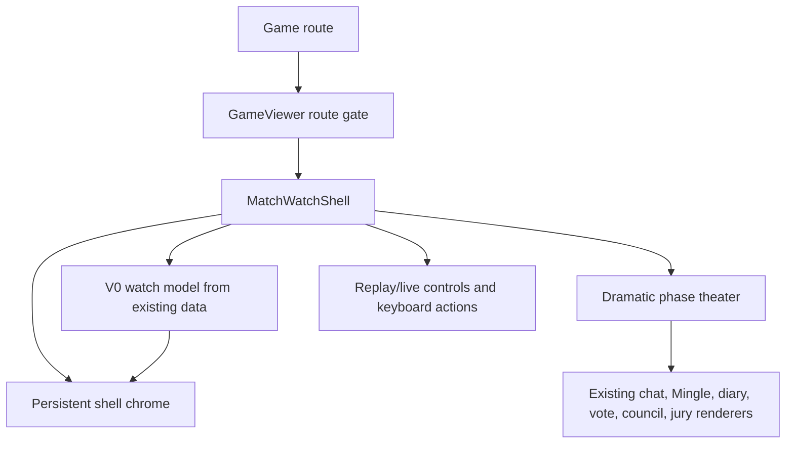

# feat: Add MatchWatchShell Shell-Only V0

## Summary

Add `MatchWatchShell` as the default watch surface for live in-progress games and completed replays, using only the data already available to the current game route and dramatic replay viewer. The plan preserves existing phase theaters and replay/live behavior while adding a persistent broadcast-style shell around them.

---

## Problem Frame

The current watch experience already has strong replay machinery: scene grouping, live catch-up, keyboard shortcuts, playback controls, phase-aware rendering, and Mingle room presentation. It still behaves like a cinematic player whose primary state and controls appear around the content instead of a persistent match room. The V0 goal is to make the new view real without pulling in the separate data-load track for durable receipts, checkpoint summaries, relationship edges, or cognitive artifacts.

---

## Requirements

**Route Ownership**

- R1. Live in-progress games render `MatchWatchShell` through the normal game route.
- R2. Completed games with replay transcript data render `MatchWatchShell` through the normal game route.
- R3. Waiting, joining, load-error, and no-replay states keep their current non-watch-shell flows.
- R4. The normal route no longer presents the old classic/admin watch view as an equivalent fallback once the shell preserves current behavior.

**Existing Data Boundary**

- R5. V0 uses existing game detail, players, transcript or live messages, replay scenes, websocket status, and existing client-side parsing.
- R6. V0 does not add a backend route, database schema, canonical projection read, checkpoint read, round-facts read, or cognitive-artifact read.
- R7. V0 omits or marks unavailable anything that would require rich relationship, receipt, checkpoint, or strategy data.
- R8. V0 does not expose raw `thinking`, `reasoningContext`, producer private traces, or checkpoint continuity payloads.

**Viewer Experience**

- R9. The shell keeps match identity, mode, connection/replay status, round, phase, alive/out count, cast, center theater, selected-player panel, and replay controls visible when existing data supports them.
- R10. The center stage preserves current chat, Mingle, diary, vote/reveal, council, jury, and endgame readability.
- R11. Replay mode preserves play, pause, speed, scene navigation, keyboard shortcuts, click-to-advance behavior, and live catch-up behavior.
- R12. Player selection persists across routine live updates when the selected player still exists.
- R13. Desktop and mobile layouts keep primary state readable without overlapping controls or hiding essential status.

---

## Key Technical Decisions

- **Wrap and split the dramatic viewer instead of rewriting theaters:** `DramaticReplayViewer` already owns the high-risk behavior. The implementation should extract a controller/theater seam and keep the existing phase renderers intact.
- **Add a local V0 watch model, not a backend read model:** The shell should consume a small adapter over current props and controller state. The later data-load slice can replace the adapter internals without redesigning the view.
- **Make primary chrome persistent:** The shell should not rely on the current auto-hide HUD for match state, cast, phase, or controls. Auto-hide may remain for transition overlays or theater-specific affordances, but the main watch frame stays visible.
- **Keep the V0 inspector sparse:** The selected-player panel shows only available identity and status. Relationship edges, thought summaries, promise receipts, and strategy notes are deferred.
- **Use the supplied visual reference as hierarchy, not literal data:** The target is dense broadcast cockpit composition: top match bar, phasebar, cast rail, center theater, context rail, and replay dock. V0 should not fake the richer data shown in the reference.

---

## High-Level Technical Design

`GameViewer` decides whether a game is watchable. `MatchWatchShell` owns layout and selected-player state. A V0 watch model derives shell facts from current route and dramatic replay state. The center theater continues to render the same phase content as today.

---

## Implementation Units

### U1. Define the V0 watch model and route eligibility

- **Goal:** Create the typed local seam that lets shell chrome consume existing game/viewer state without introducing a backend data load.
- **Requirements:** R1-R9, R12
- **Dependencies:** None
- **Files:**
  - `packages/web/src/app/games/[slug]/components/match-watch-model.ts`
  - `packages/web/src/app/games/[slug]/components/types.ts`
  - `packages/web/src/__tests__/match-watch-model.test.ts`
- **Approach:** Add pure helpers for watch eligibility and shell state. Inputs should be current game detail, players, visible/replay messages, scenes, scene index, message index, live flag, and connection status. Output should include mode, match label, round, phase, alive/out counts, phase segments, selected-player lookup, and unavailable markers for rich future data.
- **Patterns to follow:** Use `buildReplayScenes` and the replay-position reconstruction already inside `DramaticReplayViewer`. Keep Mingle display vocabulary aligned with `PHASE_LABELS`.
- **Test scenarios:**
  - Covers AE1. An in-progress game is eligible for the shell and reports live mode from existing game state.
  - Covers AE2. A completed game with transcript scenes is eligible for replay mode and reports the scene's round and phase.
  - Covers AE4. Waiting games and completed games without replay data are not eligible.
  - A selected player id resolves to the current player when present and returns a safe empty state when missing.
  - Eliminated/alive counts use the best existing data available and do not invent durable status when unavailable.
  - The model exposes unavailable states for rich inspector data instead of relationship or strategy payloads.
- **Verification:** Unit tests prove the shell can be driven without API changes and without future data fields.

### U2. Extract the dramatic replay controller and theater seam

- **Goal:** Make the existing dramatic replay behavior reusable inside `MatchWatchShell` while preserving current theater output and controls.
- **Requirements:** R5, R9-R11
- **Dependencies:** U1
- **Files:**
  - `packages/web/src/app/games/[slug]/components/dramatic-replay-viewer.tsx`
  - `packages/web/src/app/games/[slug]/components/dramatic-replay-controller.ts`
  - `packages/web/src/app/games/[slug]/components/dramatic-phase-theater.tsx`
  - `packages/web/src/app/games/[slug]/components/types.ts`
  - `packages/web/src/__tests__/dramatic-viewer-shell-seam.test.tsx`
- **Approach:** Move scene index, message index, play state, speed, visible-message derivation, replay-player reconstruction, and navigation actions behind a controller hook or controller component. Move the phase-rendering JSX into a theater component that receives controller state. Leave existing chat, Mingle, diary, vote, council, jury, and overlay components unchanged where possible.
- **Patterns to follow:** Preserve `DramaticReplayViewer` live initialization, live catch-up, keyboard shortcuts, `shouldSuppressDramaticAdvance`, and `data-replay-controls` boundaries.
- **Test scenarios:**
  - Covers AE2. The extracted theater renders an existing Mingle/open-room scene with the same Mingle copy and room content.
  - Replay navigation actions advance, rewind, jump to start, and jump to end without losing current scene/message invariants.
  - Live mode initializes at the latest available scene and waits for new data at the end.
  - Clicks on controls marked as replay controls do not advance the theater content.
  - The thinking toggle remains replay-only and is not promoted into V0 shell data.
- **Verification:** The current dramatic viewer can be rendered through the extracted seam before the route is switched to the shell.

### U3. Build the persistent MatchWatchShell layout

- **Goal:** Add the shell chrome around the controller/theater seam using the supplied visual reference as density and hierarchy guidance.
- **Requirements:** R7-R13
- **Dependencies:** U1, U2
- **Files:**
  - `packages/web/src/app/games/[slug]/components/match-watch-shell.tsx`
  - `packages/web/src/app/games/[slug]/components/match-watch-model.ts`
  - `packages/web/src/app/globals.css`
  - `packages/web/src/__tests__/match-watch-shell.test.tsx`
- **Approach:** Compose a fixed full-viewport watch surface with persistent top match bar, phasebar, cast rail, center theater frame, basic selected-player panel, and replay dock. Use existing phase CSS tokens, `influence-shell`, `influence-glass`, `AgentAvatar`, and Tailwind utilities before adding new global CSS. The selected-player panel should show identity, persona/status, and unavailable rich-data affordances only when helpful.
- **Patterns to follow:** Mirror the repo's glass/phase-token design system in `globals.css` and the screenshot's information hierarchy. Avoid nested card stacks and avoid decorative UI that reduces scanability.
- **Test scenarios:**
  - Covers AE1. Rendering a live shell includes watch mode, phase, alive/out count, cast rail, center content slot, and connection status.
  - Covers AE3. Selecting a player updates the selected state and V0 panel without showing relationship edges, summaries, or cognitive-artifact content.
  - The cast rail handles long player names and ten-player rosters without changing row heights.
  - The shell renders a restrained unavailable state for rich data rather than empty fake panels.
  - The markup includes stable landmark/label text for header, cast, theater, selected player, and replay dock.
- **Verification:** Server-rendered component tests prove the persistent shell surfaces render from the V0 model, and manual/browser review confirms the layout matches the intended hierarchy.

### U4. Wire route ownership and preserve existing gates

- **Goal:** Make the shell the normal watch route for in-progress and completed games while keeping waiting/join/error paths intact.
- **Requirements:** R1-R6, R10-R12
- **Dependencies:** U1, U2, U3
- **Files:**
  - `packages/web/src/app/games/[slug]/game-viewer.tsx`
  - `packages/web/src/app/games/[slug]/page.tsx`
  - `packages/web/src/app/games/[slug]/components/types.ts`
  - `packages/web/src/__tests__/match-watch-model.test.ts`
  - `packages/web/src/__tests__/game-viewer-routing.test.ts`
- **Approach:** Replace the `DramaticReplayViewer` route branch with `MatchWatchShell` for eligible watch states. Keep waiting, joining, game-over-results choice, load-error, and no-replay behavior outside the shell. Remove or neutralize the old `mode=classic` bypass from normal watch routing so product navigation has one watch surface.
- **Patterns to follow:** Use the existing `GameViewer` SSR/client-load split and websocket event handling. Keep completed-game transcript loading in the current route path.
- **Test scenarios:**
  - Covers AE1. In-progress game routing chooses `MatchWatchShell`.
  - Covers AE2. Completed game with replay messages chooses `MatchWatchShell`.
  - Covers AE4. Waiting game routing keeps the join/waiting UI.
  - Cancelled/completed game with no transcript data does not force an empty shell.
  - A `mode=classic` query does not present an equivalent old watch fallback for eligible V0 shell states.
- **Verification:** Route-level helper tests cover each watchability gate, and the old dramatic viewer remains available only as an internal compatibility wrapper if implementation still needs it.

### U5. Verify responsive behavior and update viewer docs

- **Goal:** Prove the shell-only V0 is usable at desktop and mobile sizes and document the intentional split between new view and later data load.
- **Requirements:** R7-R13
- **Dependencies:** U3, U4
- **Files:**
  - `packages/api/src/e2e/game-flow.e2e.test.ts`
  - `e2e/smoke.spec.ts`
  - `docs/replay-experience-spec.md`
  - `docs/visual-design-language.md`
- **Approach:** Update existing browser/e2e assertions so live and completed game pages look for the new shell's stable labels rather than the old admin/player-roster language. Add screenshots or visual checks during implementation for desktop and mobile viewports. Update viewer docs to state that V0 is shell-only and that durable facts/inspector richness are a follow-up data-load slice.
- **Patterns to follow:** Reuse the existing API e2e game-flow path that creates a game, joins players, opens an anonymous viewer, and later reloads the completed game.
- **Test scenarios:**
  - Covers AE1. The full game-flow e2e viewer sees the shell for an in-progress game and still sees player names.
  - Covers AE2. Reloading a completed game lands in replay shell mode with persistent replay controls.
  - Covers AE5. Desktop visual inspection shows no overlap between topbar, cast rail, theater, context rail, and replay dock.
  - Covers AE5. Mobile visual inspection keeps primary match state and controls readable without horizontal overflow.
  - Waiting-game smoke assertions are updated only if the route copy changes; otherwise existing waiting coverage remains sufficient.
- **Verification:** Browser/e2e coverage and captured screenshots demonstrate the shell loads, the current theaters remain usable, and the layout does not collapse across target viewports.

---

## Scope Boundaries

### In Scope

- Shell route ownership for live in-progress games and completed replays.
- Persistent header, phasebar, cast rail, center theater frame, selected-player panel, and replay dock.
- Local shell state derived from existing route and dramatic replay data.
- Preservation of current dramatic replay behavior, phase theaters, overlays, and controls.
- Desktop and mobile browser verification.

### Deferred to Follow-Up Work

- New watch-facts API or backend read model.
- Durable projection, checkpoint, round-facts, or cognitive-artifact loading.
- Relationship edges, audience-omniscient summaries, thought summaries, and rich selected-agent dossier.
- Vote/power/council receipt matrix beyond existing theater content.
- Promise, deal, favor, or social receipt extraction.
- Stats-first finale redesign and House narrative summary.
- Public-only lens mode.

### Out of Scope

- Game logic or phase-rule changes.
- Checkpoint resume or active-game crash-safety work.
- Producer MCP, Games MCP, private trace, or authorization-scope changes.

---

## Risks & Dependencies

- **Replay regression risk:** Extracting the controller from `DramaticReplayViewer` can break subtle timing, keyboard, or live catch-up behavior. Mitigate with characterization tests before route ownership flips.
- **Status accuracy risk:** Existing game detail and transcript reconstruction may not provide durable alive/out truth for every replay position. V0 should label only the best available state and avoid implying durable facts.
- **Visual density risk:** The supplied reference is dense; the implementation must preserve scanability on smaller screens instead of copying every panel literally.
- **Route fallback risk:** Keeping the old classic branch as a user-visible equivalent would violate the product direction. Any temporary implementation escape hatch should not appear in normal navigation.

---

## Documentation Notes

Update replay/viewer documentation only for the shipped V0 behavior. Do not document durable facts, relationship edges, or checkpoint summaries as available until the data-load slice ships.

---

## Sources & Research

- `docs/brainstorms/2026-06-20-match-watch-shell-route-owner-requirements.md`
- `AGENTS.md`
- `STRATEGY.md`
- `CONCEPTS.md`
- `packages/web/src/app/games/[slug]/game-viewer.tsx`
- `packages/web/src/app/games/[slug]/page.tsx`
- `packages/web/src/app/games/[slug]/components/dramatic-replay-viewer.tsx`
- `packages/web/src/app/games/[slug]/components/spectacle-viewer.tsx`
- `packages/web/src/app/games/[slug]/components/game-info.tsx`
- `packages/web/src/app/games/[slug]/components/replay-controls.tsx`
- `packages/web/src/app/games/[slug]/components/whisper-phase.tsx`
- `packages/web/src/app/globals.css`
- User-supplied persistent match shell screenshot and self-contained HTML reference
