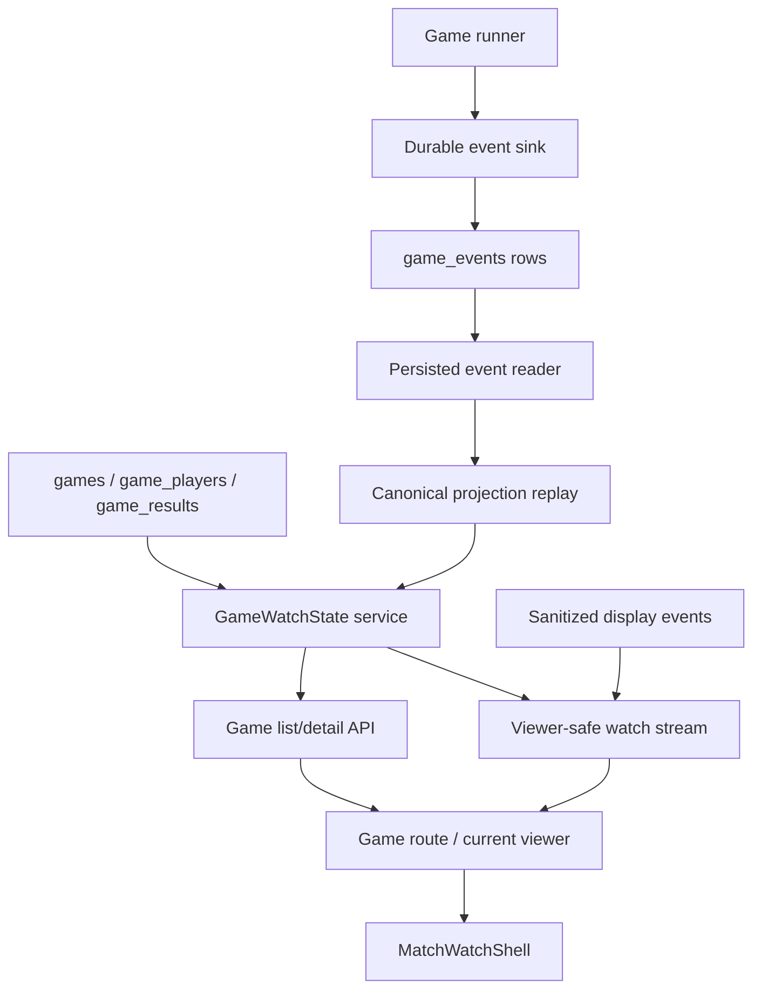
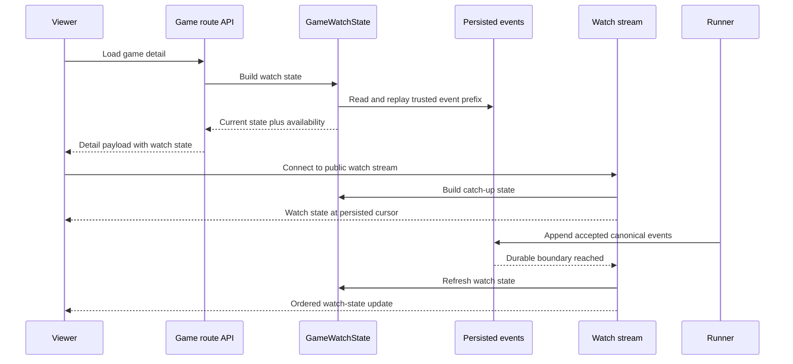
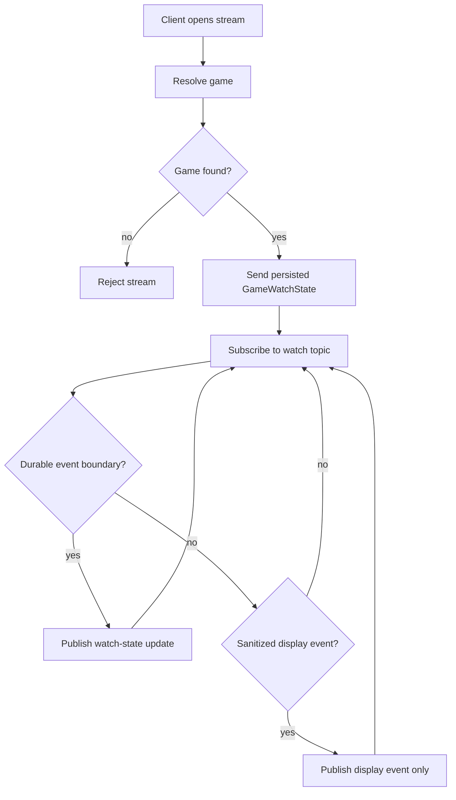

# feat: Add GameWatchState live watch model

## Summary

Add `GameWatchState` as the viewer-safe product state for live and completed game watches. The implementation derives shell-level facts from persisted canonical events and projection, updates normal game reads and live watch delivery to consume that model, and retires the admin-only raw runtime snapshot watch path.

---

## Problem Frame

The current web watch surface has two conflicting sources of truth. Normal game list/detail reads still synthesize in-progress games as round `0`, phase `INIT`, and all players alive until terminal result rows exist. Admin viewers can see more current state through a process-local websocket snapshot, but that path is admin-only and tied to the active runner's memory.

The durable kernel has already moved the system past that shape. API-backed games persist ordered canonical events during execution, and the API has services that validate those events and replay them into a canonical projection. Production Game MCP already proves the persisted projection can answer current game facts, but the browser watch path does not use it.

This plan makes the web product consume durable watch truth without claiming checkpoint hydration or crash-safe resume. It is a data-model and delivery slice, not the visual `MatchWatchShell` build.

---

## Requirements

**Watch State Contract**

- R1. The API exposes a `GameWatchState` service for in-progress and completed games.
- R2. `GameWatchState` derives round, phase, player status, shield state when known, final state, winner state, event head, and projection availability from persisted canonical events and projection whenever durable events exist.
- R3. `GameWatchState` labels its source as durable projection, best-available terminal result, pre-kernel empty state, or degraded state instead of fabricating facts.
- R4. Empty, incomplete, or invalid event logs return viewer-safe availability and diagnostics summaries without exposing raw event envelopes or private evidence.
- R5. Older completed games without durable events may fall back to terminal result data, but the response must not label that state as durable truth.

**Game Read Integration**

- R6. `GET /api/games` and `GET /api/games/:id` stop using terminal defaults for round, phase, alive/out, finalists, and winner when a durable projection is available.
- R7. In-progress game detail reads no longer present durable games as round `0`, phase `INIT`, and all players alive when projection says otherwise.
- R8. Game watch reads remain publicly accessible to anyone with the game URL; list visibility can affect discovery, but basic watch access does not require auth.
- R9. Existing waiting, joining, suspended, cancelled, and no-durable-state flows continue to return honest route state.

**Viewer-Safe Live Stream**

- R10. Any viewer can open a live watch stream for a watchable game without admin privileges or an app session.
- R11. Live stream open and reconnect start by sending persisted `GameWatchState`, not the active runner's raw `GameStateSnapshot`.
- R12. Watch-state updates carry a persisted event cursor so the client can ignore stale or duplicate updates.
- R13. Watch-state updates publish only after the underlying canonical facts are durably accepted or a projection refresh reaches the new event head.
- R14. Sanitized transcript or theater events may still drive center-stage display, but they do not define shell-level round, phase, alive/out, or winner truth.
- R15. The old admin-only live watch socket stops being the product watch interface after the replacement stream covers live viewing.

**Operational Split**

- R16. Slot-fill progress and other non-watch operational events remain supported through a separate operational channel or explicit refresh flow.
- R17. Operational/admin diagnostics do not expand the viewer watch-state contract.

**Web Consumption**

- R18. The web game route consumes `GameWatchState` for authoritative match facts.
- R19. The current viewer and future `MatchWatchShell` can both consume the same watch-state contract.
- R20. The current client stops merging raw `game_state` websocket snapshots into game detail state.
- R21. In-progress games render a public viewer experience instead of the admin-only placeholder.
- R22. Existing phase theaters may continue rendering sanitized messages and scene data while shell-level state comes from `GameWatchState`.

**Privacy and Validation**

- R23. Viewer payloads exclude raw `thinking`, `reasoningContext`, private traces, checkpoint payloads, continuity capsules, source-pointer internals, raw canonical event envelopes, and producer evidence.
- R24. Tests cover in-progress durable projection, completed durable projection, empty/pre-kernel state, invalid event logs, best-available older results, live reconnect, public watch access, privacy stripping, and operational event preservation.
- R25. Documentation states that `GameWatchState` is a watch/read model and does not imply checkpoint hydration, crash-safe resume, or complete in-run transcript persistence.

---

## Key Technical Decisions

- **Compute on read first:** The first implementation derives `GameWatchState` from current database rows and the existing persisted projection reader. A materialized watch-state table is deferred until event volume or list performance proves it is needed.
- **Projection is state authority:** Canonical projection owns shell-level game facts. Transcript prose and display stream events are explanatory theater inputs, not state.
- **Embed watch state in normal game reads:** Game detail should return the current watch state with the existing route payload so the first screen does not need a second blocking request. List rows can use a lighter summary from the same service.
- **Reuse websocket transport, replace its contract:** The plan keeps the Bun websocket/pub-sub mechanics where useful, but removes the admin-only watch gate and replaces raw snapshot catch-up plus the `game_state` payload with viewer-safe watch events.
- **Publish from durable boundaries:** The lifecycle path should publish watch-state refreshes after canonical event append succeeds. If display events arrive before the next durable state boundary, the client may render them but must not treat them as state authority.
- **Separate watch and operations:** Fill progress and admin/operator status are not part of `GameWatchState`. They get an operational channel or explicit refresh path so the viewer watch contract stays clean.
- **Sanitize by construction:** The watch-state service and stream event builder should select viewer-safe fields rather than strip private fields late from broad internal objects.
- **Keep watch public and move auth elsewhere:** Basic game watching remains public. Auth checks belong to fill/admin operations and private cognitive or producer evidence, not to the `GameWatchState` watch path.

---

## High-Level Technical Design

The diagrams show the intended authority chain: durable events feed projection, projection feeds `GameWatchState`, and both HTTP reads and live stream catch-up read the same model. The websocket remains a delivery mechanism, not a privileged state source.

---

## Implementation Units

### U1. Add the API GameWatchState service

**Goal:** Create the typed API service that derives viewer-safe watch state from persisted projection and existing game rows.

**Requirements:** R1-R5, R23, R24.

**Dependencies:** Existing durable event and projection read-model services.

**Files:**

- `packages/api/src/services/game-watch-state.ts`
- `packages/api/src/services/game-event-read-model.ts`
- `packages/api/src/services/game-projection-read-model.ts`
- `packages/api/src/__tests__/game-watch-state.test.ts`
- `packages/api/src/__tests__/durable-run-test-utils.ts`
- `packages/api/src/__tests__/test-utils.ts`

**Approach:** Build a service that resolves one game by ID, loads game identity/config, players, terminal result rows when present, persisted event rows, and projection replay. It should map projection player state onto existing player identity and avatar/persona metadata. It should return source and availability metadata for durable projection, terminal fallback, pre-kernel empty state, and degraded logs. The service should summarize diagnostics for viewer safety and avoid returning raw envelopes, source pointers, checkpoint payloads, or producer evidence.

**Execution note:** Start with service tests that fail on the current stale behavior before modifying route code.

**Patterns to follow:** `getPersistedGameEvents`, `getPersistedGameProjection`, `ProductionGameMcpReadModel.readProjection`, and the redaction style in production MCP read-model tests.

**Test scenarios:**

- Given a game with contiguous persisted events through round 2, building watch state returns round 2, the projected phase, projected alive/eliminated players, event head, and durable-projection source.
- Given a completed game with a final projection, building watch state returns terminal phase/final state and winner from projection.
- Given a game with no durable event rows, building watch state returns pre-kernel or best-available source without inventing projection facts.
- Given an invalid event log with a trusted prefix, building watch state exposes the valid prefix boundary and degraded availability without trusting the invalid suffix.
- Given player rows include agent profile avatars/persona metadata, watch state preserves display identity while using projection for status.
- Given projection diagnostics include internal metadata, watch state exposes only viewer-safe diagnostic summaries.
- Given event envelopes include source pointers or private fields, watch state does not return those fields.

**Verification:** The watch-state service can explain current game facts, source confidence, and degraded state without depending on active runner memory.

### U2. Wire watch state into public game list/detail reads

**Goal:** Make normal product reads consume `GameWatchState` so initial page load no longer shows stale live-game state.

**Requirements:** R6-R9, R18, R21, R24.

**Dependencies:** U1.

**Files:**

- `packages/api/src/routes/games.ts`
- `packages/api/src/services/game-watch-state.ts`
- `packages/api/src/__tests__/games-api.test.ts`

**Approach:** Replace list/detail route defaults for current round, current phase, alive/out counts, player status, finalists, and winner with watch-state-derived values when available. Preserve the product rule that game watch pages are public to anyone with the game URL. Keep waiting and no-durable-state behavior honest instead of forcing a watch shell state. Existing hidden/list behavior should keep affecting discovery rather than introducing an auth requirement for direct watch loads.

**Patterns to follow:** Existing `createGameRoutes` response assembly, public `GET /api/games/:id` route tests, hidden-game direct-load behavior in `games-api.test.ts`, and `publicErrorInfo` for viewer-safe failure text.

**Test scenarios:**

- Covers AE1. Given an in-progress game with persisted projection state, `GET /api/games/:id` returns current round, phase, and alive/out status from watch state.
- Given the same game appears in `GET /api/games`, the summary uses projected current phase and counts rather than terminal defaults.
- Covers AE5. Given an older completed game with no durable events and a terminal result row, detail returns best-available terminal state with non-durable source.
- Given an invalid event log, detail returns a degraded watch state and does not pretend the invalid suffix is trustworthy.
- Given an unauthenticated viewer opens an in-progress game by ID or slug, the route returns public watch state when the game exists.
- Given a hidden game is excluded from list discovery, direct ID or slug loading preserves the current public direct-watch behavior.
- Given a waiting game, route behavior remains compatible with existing join/waiting UI.

**Verification:** API route tests prove normal product reads now use durable projection when present and do not add auth friction to basic watching.

### U3. Replace live watch stream catch-up and state events

**Goal:** Replace the admin-only raw snapshot watch path with a viewer-safe live stream backed by persisted watch state.

**Requirements:** R10-R15, R20, R23, R24.

**Dependencies:** U1, U2.

**Files:**

- `packages/api/src/index.ts`
- `packages/api/src/services/ws-manager.ts`
- `packages/api/src/services/game-lifecycle.ts`
- `packages/api/src/services/viewer-event-pacer.ts`
- `packages/api/src/__tests__/websocket.test.ts`
- `packages/api/src/__tests__/viewer-event-pacer.test.ts`
- `packages/api/src/__tests__/game-lifecycle.test.ts`

**Approach:** Change websocket open for watch viewing to resolve the game and allow public watch connections when it exists. On open, send the latest persisted `GameWatchState` and cursor. Remove product use of `getGameSnapshot` and `sendSnapshot`; the active runner should not define catch-up state. Wrap the durable event append path so a watch-state refresh publishes after accepted events are stored. Continue using sanitized display events for theater continuity, but keep them separate from state updates and cursor semantics.

**Execution note:** Add characterization tests around current private-field stripping before changing the outbound event union.

**Patterns to follow:** Existing `sanitizeTranscriptEntry`, `ViewerEventPacer` pacing tests, durable append ownership semantics in `appendGameEvents`, and current websocket pub/sub topic handling.

**Test scenarios:**

- Covers AE2. An unauthenticated viewer can open the watch stream for a live game and receives persisted watch state.
- Given a stream opens for an unknown game ID or slug, the stream rejects the connection without leaking private diagnostics.
- Covers AE3. Reconnect catch-up sends persisted watch state even when an active runner exists.
- Given the active runner has a raw state snapshot, the watch stream does not send a `game_state` snapshot payload.
- Given canonical events append successfully, the stream publishes a watch-state update at the new persisted cursor.
- Given a transcript entry contains `thinking` or `reasoningContext`, the display event omits those fields.
- Given an `agent_turn` or producer-only event reaches the stream listener, the viewer stream ignores it or converts only safe display content.
- Given updates arrive out of order in a client test, the cursor lets the reducer ignore stale state.

**Verification:** Websocket tests prove live watch catch-up and updates come from persisted watch state, not process-local runner state.

### U4. Split operational events from watch events

**Goal:** Preserve fill/admin workflows without keeping the old watch socket as a catch-all event bus.

**Requirements:** R16, R17, R24.

**Dependencies:** U2, U3.

**Files:**

- `packages/api/src/index.ts`
- `packages/api/src/services/ws-manager.ts`
- `packages/api/src/routes/games.ts`
- `packages/api/src/__tests__/websocket.test.ts`
- `packages/web/src/app/admin/admin-panel.tsx`
- `packages/web/src/app/games/games-browser.tsx`
- `packages/web/src/app/games/[slug]/components/use-game-websocket.ts`
- `packages/web/src/lib/api.ts`
- `packages/web/src/__tests__/api-utils.test.ts`

**Approach:** Move `players_filled`, `players_updated`, and related fill-only events out of the viewer watch event union. The lowest-risk path is a separate operational stream or hook enabled only while filling, with the existing fill permissions and explicit refresh as fallback. The product watch stream should not carry admin diagnostics or lobby-operation progress events.

**Patterns to follow:** Current fill flow in `games.ts`, `WaitingGameCard` usage in admin and games browser, and existing fill-response fallback behavior that refreshes after accepted fill.

**Test scenarios:**

- Covers AE7. Filling a waiting game still updates the admin/games browser UI or triggers refresh after the watch stream is replaced.
- Given a user without fill permissions opens the operational path, the connection or action is denied.
- Given a watch viewer subscribes to the live watch stream, fill operational events are not delivered through the watch event union.
- Given persona generation completes after placeholder players are inserted, the operational consumer still gets an update or refreshes to see generated metadata.
- Given operational stream delivery fails, the fill response path still leaves the UI able to refresh to correct state.

**Verification:** Fill workflows remain functional while the watch stream contract contains only watch-state and sanitized display events.

### U5. Update the web client to consume GameWatchState

**Goal:** Make the current game viewer use watch state for authoritative game facts and prepare the future shell to consume the same contract.

**Requirements:** R18-R24.

**Dependencies:** U2, U3, U4.

**Files:**

- `packages/web/src/lib/api.ts`
- `packages/web/src/app/games/[slug]/game-viewer.tsx`
- `packages/web/src/app/games/[slug]/components/use-game-websocket.ts`
- `packages/web/src/app/games/[slug]/components/types.ts`
- `packages/web/src/app/games/[slug]/components/match-watch-model.ts`
- `packages/web/src/__tests__/match-watch-model.test.ts`
- `packages/web/src/__tests__/api-utils.test.ts`

**Approach:** Add web-side `GameWatchState` and watch-stream event types. Replace the current `game_state` merge path with a reducer that applies ordered watch-state updates and treats sanitized display events as message/theater input only. Remove the admin-only condition from live watch connection when the API says the viewer may watch. Keep current phase theater rendering intact; the visual shell plan can later read the same watch-state fields.

**Patterns to follow:** Existing `wsEntryToTranscriptEntry`, replay scene derivation, current `GameViewer` SSR/client-load split, and the shell-only V0 plan's local watch model seam.

**Test scenarios:**

- Given initial game detail includes watch state, the viewer displays projected round, phase, and alive/out facts before websocket events arrive.
- Covers AE4. Given a sanitized message event arrives without a state cursor advance, the theater receives the message but shell-level facts remain unchanged.
- Given a watch-state update with an older cursor arrives after a newer state, the reducer ignores the stale update.
- Given an unauthenticated viewer opens an in-progress game, the client attempts the watch stream rather than showing only the admin placeholder.
- Given a stream error says the game is missing or unavailable, the client shows a watch-safe unavailable state rather than assuming admin-only mode.
- Given a completed replay loads durable final state, the current route and future shell model receive the same final facts.
- Given a payload includes no private fields, type tests and runtime reducer tests do not add `thinking` or `reasoningContext` back into viewer state.

**Verification:** Web unit tests prove route state and live events flow through `GameWatchState`, while existing theaters continue to render sanitized messages.

### U6. Clean up legacy watch contracts and update docs

**Goal:** Remove stale contract assumptions, document the new watch/read boundary, and verify the slice across API and web.

**Requirements:** R15, R23-R25.

**Dependencies:** U1-U5.

**Files:**

- `CONCEPTS.md`
- `docs/replay-experience-spec.md`
- `docs/reasoning-transcript-observability.md`
- `docs/statefulness-plan.md`
- `DEVELOPMENT.md`
- `packages/api/src/__tests__/websocket.test.ts`
- `packages/api/src/e2e/game-flow.e2e.test.ts`
- `packages/web/src/__tests__/match-watch-model.test.ts`

**Approach:** Remove or rename tests and comments that describe `GameStateSnapshot` as the watch catch-up contract. Update docs to state that watch state is durable projection-backed when available, best-available for old completed games, and not a checkpoint/resume claim. Add or update an end-to-end path that starts a mock-runner game, observes in-progress state through the API/watch stream, and verifies terminal replay state still loads.

**Patterns to follow:** `CONCEPTS.md` entries for `GameWatchState`, `MatchWatchShell`, durable truth read model, and checkpoint capsule; existing API e2e game flow with the mock runner.

**Test scenarios:**

- Given a mock-runner API game writes durable events, an e2e or integration test observes current watch state before completion.
- Given the same game completes, the final route state comes from durable projection or correctly labeled best-available state.
- Given websocket contract tests run, no product watch test expects a raw `game_state` snapshot.
- Given docs are searched for the old admin-only watch claim, the remaining text distinguishes operational/admin diagnostics from viewer watch.
- Given docs describe checkpoints near watch state, they avoid promising resume or hydration.

**Verification:** The repo's normal checks cover the new service, routes, websocket contract, web reducer, and docs no longer point implementers back to the old watch model.

---

## Scope Boundaries

### In Scope

- Viewer-safe `GameWatchState` derived from persisted canonical events and projection.
- Game list/detail reads using watch state for shell-level facts.
- Viewer-safe live watch stream catch-up and updates.
- Public live watching without admin privileges or app-session auth.
- Separation of operational fill/admin events from watch events.
- Client consumption of watch state in the current viewer and future shell model seam.
- Privacy and degraded-state tests.
- Documentation of the watch-state boundary.

### Deferred to Follow-Up Work

- Materialized watch-state storage or projection cache table.
- Full `MatchWatchShell` visual implementation and inspector redesign.
- Relationship edges, deal receipts, promise receipts, and vote/deal receipt matrices.
- Public thought, strategy, or audience-omniscient summaries.
- Finale narrative awards and House summary layer.
- Public-only lens mode.
- Stream backpressure, replay-window compaction, or multi-viewer performance tuning beyond first-slice needs.

### Out of Scope

- Checkpoint hydration or crash-safe resume.
- Treating checkpoint payloads as viewer data.
- Raw canonical event envelope browsing in the browser.
- Producer/private trace access changes.
- Game logic, phase rules, prompt behavior, or canonical event schema changes unless a missing event field blocks accurate watch state.
- Rewriting dramatic replay theaters.

---

## System-Wide Impact

- **Public watch boundary:** Live watch access moves from admin-only to public-by-URL. Auth remains for fill/admin operations and private cognitive or producer evidence, not for basic watching.
- **Privacy boundary:** The browser receives a first-class product read model rather than sanitized internal objects. This reduces accidental leakage risk but requires tests at the service, route, and stream boundaries.
- **Runtime boundary:** Active runner memory stops being the source for product catch-up. The runner still drives execution, but persisted events define what viewers can trust.
- **Performance posture:** Computing projection on read is acceptable for this slice, but list endpoints may reveal the need for batching or materialization later.
- **Frontend contract:** Current viewer code and the planned `MatchWatchShell` converge on the same state model, reducing future UI porting risk.

---

## Risks & Mitigations

- **Ordering races between display and durable state:** Display messages may reach clients before a state boundary. Mitigate by making display events non-authoritative and gating shell facts on watch-state cursors.
- **Accidental auth regression:** Replacing the admin gate could accidentally add a new login or subject-access requirement. Mitigate with unauthenticated HTTP and websocket watch tests for in-progress and completed games.
- **Projection performance on lists:** Replaying events per listed game can become expensive. Mitigate by starting with focused filtered reads and making materialization a follow-up if tests or profiling show the list path is too slow.
- **Legacy completed games:** Older games may lack durable event logs. Mitigate with explicit best-available source labels and tests that avoid overstating durable truth.
- **Operational websocket regression:** Fill flows currently share the same hook/event union. Mitigate by preserving an operational path or refresh fallback before removing product use of the old watch event union.
- **Private field leakage through broad object reuse:** Reusing internal snapshots would risk leaking hidden fields. Mitigate by constructing viewer payloads from selected fields and retaining privacy tests for transcript/display events.

---

## Alternative Approaches Considered

- **Keep the admin socket and add a viewer socket beside it:** Rejected because it preserves two watch truths and keeps the legacy interface alive as a fallback.
- **Use raw checkpoints as the watch model:** Rejected because checkpoints contain continuity and diagnostic evidence that may cross viewer boundaries and imply resume semantics.
- **Materialize watch state before building the read model:** Deferred because the existing projection reader can prove the contract first, and materialization is an optimization with migration cost.
- **Derive live state from transcripts:** Rejected because transcripts are display prose, not canonical board facts.
- **Delay live stream replacement until after the visual shell:** Rejected because the shell would inherit the stale data model and admin-only split the user explicitly wants to remove.

---

## Documentation Notes

Update docs in the same branch as implementation:

- `CONCEPTS.md` should remain the short glossary definition, not the full spec.
- `docs/replay-experience-spec.md` should name `GameWatchState` as the watch-state source for live and completed watch surfaces.
- `docs/statefulness-plan.md` should clarify that this improves live read truth but does not make active execution crash-safe.
- `docs/reasoning-transcript-observability.md` should preserve the separation between viewer display events and private reasoning/debug evidence.
- `DEVELOPMENT.md` should point local developers at focused tests for watch state, websocket replacement, and privacy boundaries.

---

## Verification Strategy

Focused verification should cover:

- API service tests for `GameWatchState` source classification and projection-derived facts.
- API route tests for list/detail behavior and public watch access.
- Websocket tests for catch-up, cursor ordering, sanitized display events, and removal of raw `game_state` watch snapshots.
- Fill/admin tests or component tests proving operational events still update or refresh waiting-game UI.
- Web reducer/model tests proving client state uses watch-state updates and ignores stale cursors.
- A DB-backed integration or e2e path using the mock runner to observe in-progress durable state before completion.
- The repo baseline checks after implementation.

---

## Sources & Research

- `docs/brainstorms/2026-06-20-game-watch-state-requirements.md`
- `docs/plans/2026-06-20-001-feat-match-watch-shell-v0-plan.md`
- `docs/plans/2026-06-14-001-feat-durable-event-read-model-plan.md`
- `docs/solutions/architecture-patterns/agent-strategy-observability-spine.md`
- `CONCEPTS.md`
- `STRATEGY.md`
- `AGENTS.md`
- `packages/api/src/routes/games.ts`
- `packages/api/src/index.ts`
- `packages/api/src/services/game-lifecycle.ts`
- `packages/api/src/services/ws-manager.ts`
- `packages/api/src/services/game-event-read-model.ts`
- `packages/api/src/services/game-projection-read-model.ts`
- `packages/api/src/game-mcp/read-model.ts`
- `packages/api/src/game-mcp/claims.ts`
- `packages/api/src/__tests__/games-api.test.ts`
- `packages/api/src/__tests__/websocket.test.ts`
- `packages/api/src/__tests__/production-game-mcp-read-model.test.ts`
- `packages/web/src/lib/api.ts`
- `packages/web/src/app/games/[slug]/game-viewer.tsx`
- `packages/web/src/app/games/[slug]/components/use-game-websocket.ts`
- `packages/web/src/app/admin/admin-panel.tsx`
- `packages/web/src/app/games/games-browser.tsx`

External research was intentionally skipped because the load-bearing constraints are local: existing durable event/projection services, route behavior, websocket replacement, and privacy boundaries.
