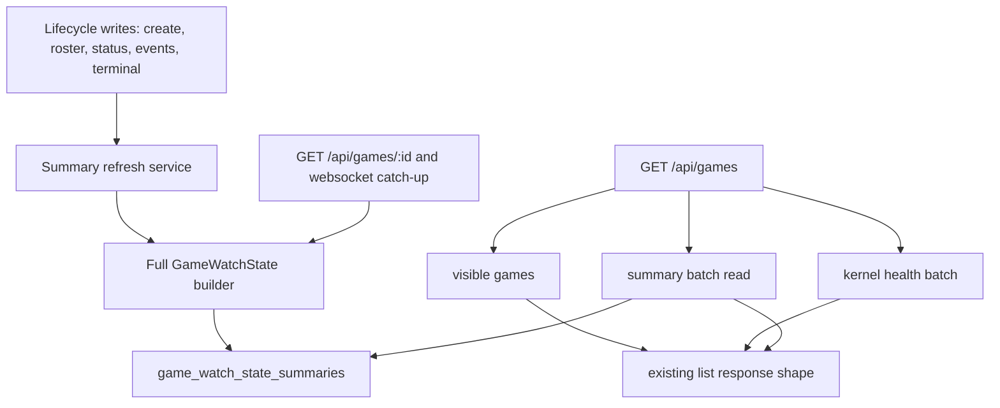
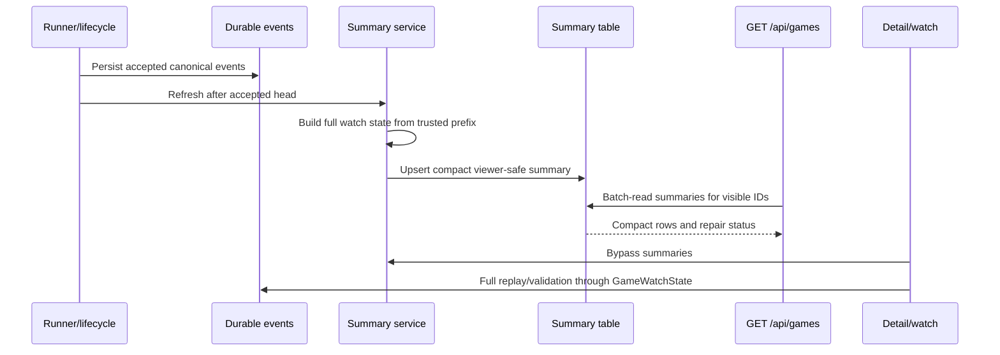

# feat: Add GameWatchState summary read model

## Summary

Add a compact `game_watch_state_summaries` read model for game-list rows. The API will refresh summaries from write-side lifecycle seams and make `GET /api/games` batch-read summary rows instead of rebuilding full `GameWatchState` for every visible game.

---

## Problem Frame

Commit `857c197` made watch state truthful by deriving `GameWatchState` from persisted canonical events and projection. That fixed correctness for live and completed watches, but it also moved the game list onto the detail-page cost curve: the list route now calls `buildGameWatchState` for every visible row, and that loads players/results, validates event integrity, hashes events, replays projection, and only then drops player details.

The list page should scale with visible games and compact read-model rows, not with the total number of events across all visible games. Detail reads and websocket catch-up still need replay validation; the optimization target is list discovery only.

---

## Requirements

**Summary Read Model**

- R1. Persist one versioned compact summary row per game for list reads. Covers origin R1-R4.
- R2. Store only viewer-safe list facts: game identity, status/source, round, phase, max rounds, counts, winner/final state, event cursor, projection availability/status/counts, valid-prefix metadata, public diagnostics, and viewer-safe refresh metadata. Covers origin R2-R4.
- R3. Exclude full player rows, raw canonical events, source pointers, event hashes, owner epochs, checkpoint payloads, private traces, `thinking`, `reasoningContext`, and producer evidence. Covers origin R3, R21, AE4.
- R4. Provide a shared API service that refreshes, reads in batch, maps rows back to the current list `watchState` summary shape, and exposes missing/stale status without making the list route a replay worker. Covers origin R5-R13.

**Write-Side Freshness**

- R5. Refresh the summary after durable canonical events are appended and after terminal completion state is committed. Covers origin R6, R7, F1.
- R6. Refresh or initialize summaries when creation, roster changes, start rollback, cancellation, suspension, free-queue creation, and admin-import creation change list-facing facts. Covers origin R5, R8.
- R7. A refresh failure must not roll back canonical event or terminal truth, but it must be logged and visible enough for later repair. Covers origin R9.

**List Route Behavior**

- R8. `GET /api/games` batch-reads summaries for returned visible game IDs and does not call `buildGameWatchState` per row when summaries exist. Covers origin R10-R13, AE1.
- R9. The list response preserves existing status filtering, hidden-game exclusion, game-number assignment, kernel-health merge, configured seat count, public access, winner/count/cursor fields, and response shape. Covers origin R11, R12, AE5.
- R10. Missing or stale summaries on normal list reads produce viewer-safe fallback/repair metadata, not request-time replay of every missing event log. Covers origin R13, R18.

**Detail, Watch, and Migration**

- R11. `GET /api/games/:id` and websocket catch-up keep using full replay-validated `GameWatchState`; summaries do not cap detail/watch correctness. Covers origin R14-R17, AE2.
- R12. Existing games get an explicit backfill/repair path before relying on the new list route. Covers origin R18, AE3, AE6.
- R13. Database cleanup and tests include the new table and prove correctness, privacy, stale-row behavior, and the no-list-replay regression. Covers origin R19, R20, AE1-AE6.

---

## Key Technical Decisions

- **Materialize summaries, not full watch state:** The new table stores the scalar and small nested facts the list route returns today. Full player rows and detail-only watch data stay in `GameWatchState`.
- **Refresh from writes first:** The normal path updates summaries after state-changing writes, so list reads stay cheap. The first implementation may build full `GameWatchState` during refresh, because that moves replay work off request-time list discovery and reuses the existing trusted mapper.
- **Keep list fallback non-replaying:** If a summary is missing or stale, the list route should return a conservative viewer-safe row and expose repair debt. It should not hide missing rows by rebuilding every visible game on demand.
- **Use one summary service:** Route code, lifecycle code, and the backfill command should share the same mapper and batch reader so the summary contract does not fork from the public watch-state contract.
- **Preserve detail authority:** Detail and websocket catch-up continue to call the full builder. A stale summary must never cause detail to miss a newly degraded event log or invalid suffix.
- **Backfill in TypeScript, not SQL projection logic:** The SQL migration creates storage; a Bun-run backfill command reuses the summary service and existing replay code for old games.
- **Keep repair metadata public-safe:** List responses may expose coarse missing/stale/repair-needed status, but detailed refresh errors belong in logs or repair tooling.
- **Do not change watch access:** Public game watching remains public by URL. This plan changes data access cost, not auth or permissions.

---

## High-Level Technical Design

The diagrams separate storage responsibility from correctness responsibility. The summary table is a compact list cache maintained by write-side flows; full replay remains the trusted watch/detail path.

---

## Implementation Units

### U1. Add the summary table and migration

**Goal:** Create durable storage for compact `GameWatchState` summaries and wire it into schema and test cleanup.

**Requirements:** R1-R3, R12, R13.

**Dependencies:** Existing Drizzle schema and migration runner.

**Files:**

- `packages/api/src/db/schema.ts`
- `packages/api/drizzle/0017_game_watch_state_summaries.sql`
- `packages/api/drizzle/meta/_journal.json`
- `packages/api/src/__tests__/test-utils.ts`
- `packages/api/src/__tests__/db.test.ts`

**Approach:** Add `gameWatchStateSummaries` keyed by `game_id` with a foreign key to `games.id`. Store current list fields in scalar columns where the list route reads directly, and store small viewer-safe nested structures for event cursor, projection diagnostics, final state, and winner. Include `schema_version`, event-head fields, refresh status fields, and timestamps so stale or missing rows can be detected and repaired. Add the table to test truncation before parent tables.

**Patterns to follow:** Existing Drizzle `pgTable` definitions in `schema.ts`, durable kernel migration naming, check constraints used by `game_events`, and the test cleanup list in `test-utils.ts`.

**Test scenarios:**

- Given migrations run on an empty test database, the summary table exists and can store one row for a game.
- Given a summary row references a game, deleting or truncating games during test cleanup does not leave orphan rows or test pollution.
- Given an invalid schema version or negative event count is inserted directly in a schema test, constraints reject the row where constraints are appropriate.
- Covers AE6. Given the test database cleanup path runs between tests, old summary rows do not leak into later route tests.

**Verification:** Schema, migration, and test cleanup support the new table without changing existing tables' public meaning.

### U2. Add the summary service and mappers

**Goal:** Centralize summary refresh, batch reads, row-to-response mapping, and missing/stale handling.

**Requirements:** R1-R4, R7, R10, R13.

**Dependencies:** U1 and the existing `GameWatchState` service.

**Files:**

- `packages/api/src/services/game-watch-state-summary.ts`
- `packages/api/src/services/game-watch-state.ts`
- `packages/api/src/__tests__/game-watch-state.test.ts`
- `packages/api/src/__tests__/game-watch-state-summary.test.ts`

**Approach:** Add a service that can build a persisted summary from full `GameWatchState`, upsert that summary for one game, read summaries for many game IDs in one query, map rows back into the list route's current `watchState` summary shape, and produce a conservative list fallback when a row is absent or stale. Keep the public diagnostic messages and privacy boundary aligned with `game-watch-state.ts`; do not duplicate raw event validation logic in the summary service.

**Execution note:** Start with service tests for row shape, privacy stripping, and stale/missing behavior before changing route code.

**Patterns to follow:** `buildGameWatchState`, `summarizeDiagnostics`, `getRedactedKernelHealthByGameId`, and the existing route-level `summarizeWatchState` behavior.

**Test scenarios:**

- Given a durable in-progress `GameWatchState`, refreshing writes a summary with the same source, round, phase, counts, event cursor, projection status, valid-prefix data, and winner fields.
- Given a completed terminal fallback `GameWatchState`, refreshing writes best-available terminal summary fields with unavailable durable projection.
- Covers AE4. Given canonical events include source pointers and private trace references, the stored summary and mapped response do not contain raw events, source pointers, owner epochs, `thinking`, `reasoningContext`, or private evidence strings.
- Given a stored summary has an older schema version, the batch reader flags it as stale without replaying the event log.
- Given no summary row exists for a game, the mapper can return a viewer-safe fallback using the game row and config, with repair status available to the route.
- Given a refresh failure recorded internal error details, public list mapping exposes only coarse repair-needed status.

**Verification:** Summary service tests prove the persisted contract matches list needs while staying smaller and safer than full watch state.

### U3. Refresh summaries from lifecycle write seams

**Goal:** Keep summaries current when durable and list-facing game state changes.

**Requirements:** R5-R7, R12, R13.

**Dependencies:** U1, U2.

**Files:**

- `packages/api/src/services/game-lifecycle.ts`
- `packages/api/src/services/game-ownership.ts`
- `packages/api/src/services/game-events.ts`
- `packages/api/src/routes/games.ts`
- `packages/api/src/routes/free-queue.ts`
- `packages/api/src/routes/admin.ts`
- `packages/api/src/__tests__/games-api.test.ts`
- `packages/api/src/__tests__/game-watch-state-summary.test.ts`

**Approach:** Refresh summaries after successful game creation, join, fill, free-queue draw, admin import, start status transition, start rollback, durable event append, terminal completion, cancellation, and suspension. Place refreshes after the state-changing write has committed whenever the write is canonical or terminal, so refresh failures cannot roll back accepted game truth. For transaction-heavy paths, keep refresh placement explicit and log failures with the affected game ID and reason.

**Patterns to follow:** `appendDurableEventsAndPublishWatchState`, `persistCompletedGame`, `markGameSuspended`, `acquireGameRunOwner`, `markOwnerStartupFailed`, and the existing route write paths.

**Test scenarios:**

- Covers F1. Given durable events are appended to an in-progress game, the summary row advances to the new trusted event cursor and updated round/phase/counts.
- Given terminal completion commits a result and updates game status, the summary row reflects final state and winner after completion.
- Given a waiting game is created, joined, or filled, the summary row reflects configured seat count and joined-player counts without durable events.
- Given start fails and rolls a game back to waiting, the summary row returns to waiting/pre-kernel facts.
- Given a running game is stopped or suspended, the summary row reflects terminal status and viewer-safe public error information.
- Given a refresh throws after durable events have been committed, event rows remain committed and the failure is observable for repair.

**Verification:** Lifecycle tests show summaries stay current across the write paths that can change list-facing facts.

### U4. Add explicit backfill and repair tooling

**Goal:** Initialize summaries for existing games without turning normal list requests into replay/backfill work.

**Requirements:** R7, R10, R12, R13.

**Dependencies:** U1, U2.

**Files:**

- `packages/api/src/scripts/backfill-game-watch-state-summaries.ts`
- `packages/api/package.json`
- `packages/api/src/services/game-watch-state-summary.ts`
- `packages/api/src/__tests__/game-watch-state-summary.test.ts`

**Approach:** Add a Bun-run backfill command that scans existing games, refreshes missing or stale summaries through the shared service, and reports counts for refreshed, skipped, and failed games. The command should be idempotent and bounded enough to run before or after deploy. Keep normal list requests out of broad repair work; missing/stale rows become observable repair debt.

**Patterns to follow:** `packages/api/src/scripts/ensure-private-content-bucket.ts`, `runMigrations`, and service-level bounded read patterns.

**Test scenarios:**

- Covers AE3. Given an older completed game with terminal result rows and no durable events, backfill writes a best-available terminal summary.
- Covers AE6. Given multiple existing games with missing summaries, the backfill helper refreshes each one and reports refreshed/skipped/failed counts.
- Given a summary already has the current schema version and event head, backfill skips it unless repair is explicitly requested.
- Given one game refresh fails, the helper records the failure and continues with other games.

**Verification:** Existing environments have an explicit path to populate summaries before relying on the optimized list route.

### U5. Move `GET /api/games` to batch summary reads

**Goal:** Replace per-visible-game full watch-state replay in the list route with one batch summary read and response mapping.

**Requirements:** R8-R11, R13.

**Dependencies:** U1-U4.

**Files:**

- `packages/api/src/routes/games.ts`
- `packages/api/src/services/game-watch-state-summary.ts`
- `packages/api/src/__tests__/games-api.test.ts`

**Approach:** Update the list route to load visible game rows as it does today, batch-load kernel health, batch-load summary rows for the returned IDs, and assemble the existing response fields from game config plus summary data. Preserve direct detail behavior and public URL access. For missing or stale summaries, return a conservative row and repair metadata instead of calling `buildGameWatchState`.

**Patterns to follow:** Existing `GET /api/games` response shape, status filtering, hidden-game tests, `getRedactedKernelHealthByGameId`, and route privacy tests.

**Test scenarios:**

- Covers AE1. Given an in-progress game has a current summary at cursor 20, `GET /api/games?status=in_progress` returns round, phase, counts, source, projection status, and cursor from the summary.
- Given the same game's durable event rows are corrupted after the summary is written, `GET /api/games` still returns the stored summary while `GET /api/games/:id` reports degraded full replay state.
- Given several visible games exist, the list route returns all rows with game numbers assigned by creation order and does not call the full watch-state builder per row.
- Covers AE5. Given a waiting game has players added through join and fill, `playerCount`, alive count, and summary watch state stay correct from summary/config data.
- Given a summary row is missing, the list route returns a viewer-safe fallback row and does not query `game_events` for that game.
- Given hidden games exist, status-filtered and unfiltered list routes still exclude them while direct detail reads still work.

**Verification:** Route tests fail if the list path replays every visible event log or changes the existing list contract.

---

## Acceptance Examples

- AE1. A current in-progress summary at event cursor 20 appears in the list with matching round, phase, counts, source, projection status, and cursor without full replay.
- AE2. A corrupted durable log after an older summary does not fool detail reads; detail still degrades through replay validation.
- AE3. An older completed game without durable events backfills to best-available terminal result state.
- AE4. Summary storage and list responses contain no private trace, producer evidence, raw event, or hidden reasoning fields.
- AE5. Waiting-game roster changes preserve configured seat count and joined-player counts without event replay.
- AE6. Migrations and test setup create and clean the new table, and existing games have a backfill path.

---

## Scope Boundaries

In scope:

- Compact persisted summaries for list reads.
- Write-side refreshes for lifecycle seams that change list-facing facts.
- Batch summary reads in `GET /api/games`.
- Backfill/repair tooling for existing games.
- DB-backed tests for performance shape, correctness, privacy, and fallback behavior.

Out of scope:

- Visual `MatchWatchShell` work.
- New watch auth, permission layers, or private game-watching gates.
- A general-purpose projection cache for all consumers.
- Truncating, capping, or replacing full event replay for detail/watch state.
- Public raw canonical event browsing.
- Private trace, cognitive artifact, checkpoint, or producer-evidence access changes.

### Deferred to Follow-Up Work

- Incremental summary updates that avoid full `GameWatchState` builds during refresh.
- Background repair scheduling for stale summaries beyond the explicit backfill command.
- Broader projection-cache infrastructure if later consumers need it.

---

## System-Wide Impact

- **Performance:** The list route becomes O(visible games) over game rows, kernel-health rows, and compact summary rows once summaries exist.
- **Durability:** Summary rows are derived read models and can be rebuilt from canonical events, terminal results, and game/player rows.
- **Privacy:** Public list responses continue to exclude private/cognitive/producer evidence.
- **Operations:** Deployment must include the SQL migration and an explicit backfill/repair run for existing games.
- **Product strategy:** This supports the replay and sharing track by keeping watch discovery fast while preserving truthful detail reads.

---

## Risks & Mitigations

- **Stale summaries:** Mitigate with schema versioning, event-head metadata, refresh status fields, route-level stale detection, and explicit backfill repair.
- **Refresh failure hiding data drift:** Mitigate by logging refresh failures with game ID/reason, keeping canonical writes authoritative, and exposing only coarse repair status publicly.
- **Privacy leakage through stored JSON:** Mitigate with mapper tests that serialize stored rows and responses and assert absent private/producer field names.
- **Migration/backfill rollout gap:** Mitigate by keeping the list fallback viewer-safe and adding an idempotent Bun-run repair command before relying on optimized production lists.
- **Route contract drift:** Mitigate with existing `games-api.test.ts` coverage plus new tests for current fields, hidden filtering, status filters, kernel health, and cursor fields.
- **Accidental detail correctness regression:** Mitigate by keeping summary reads out of `GET /api/games/:id` and websocket catch-up.

---

## Alternative Approaches Considered

- **Cache on list read:** Rejected because it still lets the list route become a hidden replay worker and preserves worst-case O(all missing events) behavior during deploys or stale rows.
- **Materialize full `GameWatchState`:** Rejected because full player rows and detail-only fields increase privacy and drift risk without helping list performance.
- **Build a broad projection cache now:** Rejected for this slice because it is useful future infrastructure but expands beyond the review finding and current list requirement.
- **Only memoize within the request:** Rejected because it reduces duplicate work only inside one request and does not change the event-volume complexity class.

---

## Operational Notes

- The migration creates the table; the backfill command populates existing data through TypeScript service logic.
- The backfill should be safe to rerun after deploy and should not require watch auth or producer privileges.
- The normal production list path should be considered optimized only after summaries are backfilled or write-maintained for returned rows.
- Validation uses Bun only, following the repo's AGENTS guidance.

---

## Sources / Research

- `docs/brainstorms/2026-06-20-game-watch-state-summary-read-model-requirements.md`
- `docs/ideation/2026-06-20-game-watch-state-summary-read-model-ideation.html`
- `docs/brainstorms/2026-06-20-game-watch-state-requirements.md`
- `docs/plans/2026-06-20-002-feat-game-watch-state-plan.md`
- `CONCEPTS.md`
- `STRATEGY.md`
- `docs/solutions/architecture-patterns/agent-strategy-observability-spine.md`
- `packages/api/src/routes/games.ts`
- `packages/api/src/routes/free-queue.ts`
- `packages/api/src/routes/admin.ts`
- `packages/api/src/services/game-watch-state.ts`
- `packages/api/src/services/game-event-read-model.ts`
- `packages/api/src/services/game-projection-read-model.ts`
- `packages/api/src/services/game-events.ts`
- `packages/api/src/services/game-lifecycle.ts`
- `packages/api/src/services/game-ownership.ts`
- `packages/api/src/db/schema.ts`
- `packages/api/src/__tests__/games-api.test.ts`
- `packages/api/src/__tests__/game-watch-state.test.ts`
- `packages/api/src/__tests__/test-utils.ts`
