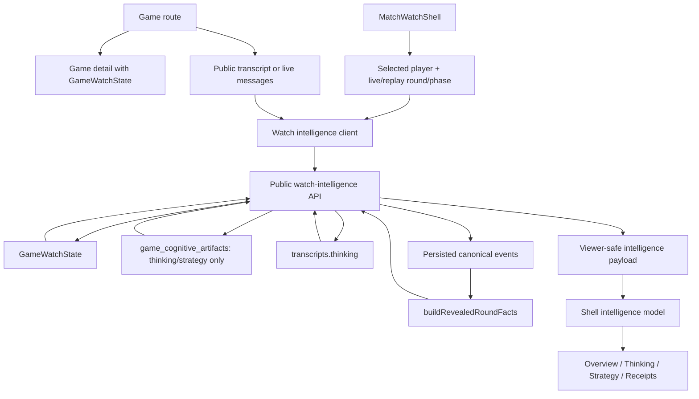
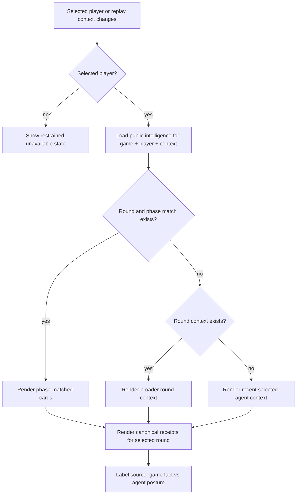

# feat: Add Public Match Watch Intelligence

## Summary

Add a public watch-intelligence layer for `MatchWatchShell` so selected-agent inspectors can show curated thinking, strategy posture, and canonical receipts in live games and completed replays. The implementation adds a web-specific public read contract that combines split cognitive artifacts, transcript thinking, `GameWatchState`, and revealed round facts without exposing reasoning traces or producer/debug plumbing.

---

## Problem Frame

`MatchWatchShell` now owns the watch route for live games and completed transcript replays, but its inspector is still a shell-only placeholder. That thin state was correct for V0 because durable facts, cognitive artifacts, and richer selected-agent context were intentionally deferred.

The data now exists in separate lanes that must stay separate. `GameWatchState` is the shell-level state authority. Revealed game facts and canonical projections prove votes, powers, Council outcomes, eliminations, shields, jury votes, and winners. Split cognitive artifacts and transcript entries explain what agents were thinking or carrying as strategy posture, but they are not gameplay truth. Producer traces, raw prompts, provider responses, storage keys, trace manifests, source-pointer internals, and `reasoningContext` remain outside the public viewer contract.

This plan turns the inspector into a useful public watch surface without changing MCP policy, adding owner auth gates, or pretending artifacts have exact event-frame alignment when the stored rows only support round, phase, action, and actor context.

---

## Requirements

**Public Intelligence Contract**

- R1. The web watch surface treats `thinking` and `strategy` as public watch intelligence for live games and completed replays.
- R2. Public watch intelligence is available to any game viewer by URL in V1, without participant or owner auth.
- R3. The public web API may expose raw allowed `thinking` and `strategy` payload fields to the web client, but only through a viewer-safe public contract.
- R4. The shell renders curated summaries, snippets, and cards as the primary experience rather than raw artifact JSON.
- R5. Future owner/participant auth for `thinking` or `strategy` remains additive and does not shape the V1 public contract.

**Inspector Behavior**

- R6. Selecting an agent filters the inspector to that agent when intelligence exists.
- R7. The inspector separates overview, thinking, strategy, and receipts as distinct concepts.
- R8. Thinking cards show relevant selected-agent thoughts from cognitive artifacts or transcript thinking.
- R9. Strategy cards show selected-agent posture from decision logs, strategic lenses, strategy packet summaries, or strategic reflection summaries when available.
- R10. Duplicate cards are avoided when transcript thinking and cognitive artifacts describe the same selected-agent moment.
- R11. Intelligence without exact event linkage is labeled as round or phase context, not frame-precise truth.
- R12. Games or phases without public intelligence show a restrained unavailable state.

**Receipts and Game Facts**

- R13. Vote, power, Council, elimination, shield, jury, and winner receipts come from revealed/canonical game facts or projections.
- R14. Cognitive artifacts never prove vote targets, power actions, eliminations, winners, shield state, or player status.
- R15. When cognitive text conflicts with canonical facts, canonical facts drive receipts and the UI does not present the cognitive claim as fact.
- R16. Receipt cards are source-labeled so viewers can distinguish game facts from agent posture.
- R17. Relationship edges, deal ledgers, promise ledgers, and House alliance hypotheses stay out of V1 unless explicit safe product data later exists.

**Live and Replay Alignment**

- R18. Live games and completed replays use the same public watch-intelligence rules.
- R19. Live views may use transcript `thinking` already delivered in sanitized websocket messages, while `reasoningContext` and debug fields stay excluded.
- R20. Completed replays use the same selected-agent, round, phase, and action matching rules as live watch.
- R21. Replay playback state filters inspector intelligence to the current replay round and phase before falling back to broader round context.
- R22. `GameWatchState` remains the authority for shell-level round, phase, player status, counts, and winner state.

**Privacy and Exclusions**

- R23. Public watch payloads never include reasoning traces, `reasoningContext`, raw prompts, raw provider responses, full tool argument blobs, storage keys, private trace manifests, trace IDs, source-pointer internals, or debug plumbing.
- R24. Producer/debug trace tooling stays out of the viewer experience.
- R25. This slice does not change MCP availability for `thinking` or `strategy`.
- R26. This slice does not infer relationships, deals, promises, or House alliance hypotheses from freeform text.

**Validation**

- R27. Tests prove a nonparticipant viewer can receive public watch intelligence for a live game and a completed replay.
- R28. Tests prove hidden reasoning/debug fields are absent from public watch-intelligence payloads.
- R29. Tests prove receipts are derived from revealed/canonical facts rather than cognitive artifacts.
- R30. Tests cover selected-agent filtering by player, round, and phase.
- R31. Tests cover fallback behavior when cognitive artifacts are absent but transcript thinking exists.
- R32. Tests cover unavailable states when neither cognitive artifacts nor transcript thinking exists.

---

## Key Technical Decisions

- **Add a public web read model instead of reusing authenticated artifact reads:** `CognitiveArtifactReadModel` correctly enforces owner/participant rules for MCP and authenticated web reads. Public match watching needs a narrower route that exposes only active player/juror `thinking` and `strategy` for watchable games, never `reasoning`, diagnostics, House/system/producer rows, or trace-adjacent fields.
- **Compose intelligence from existing product records:** The public read model should combine `GameWatchState`, `game_cognitive_artifacts`, public transcript `thinking`, and `buildRevealedRoundFacts`. It should not introduce a new storage layer or read private trace storage.
- **Let canonical facts prove and cognitive text explain:** Receipt cards are derived from persisted canonical events and projection. Thinking and strategy cards can sit beside those receipts as posture context, but conflicts are resolved in favor of canonical facts.
- **Keep live websocket payloads small and sanitized:** Websocket messages can continue carrying sanitized transcript `thinking` and `watch_state`; full public intelligence can be fetched through the public read route when selected player or playback context changes.
- **Prefer phase alignment over fake precision:** Match by selected player, round, phase, action, and optional event sequence. If exact sequence linkage is absent, card copy should say round/phase context instead of implying frame-level synchronization.
- **Curate in the shell model before rendering:** The API can return allowed structured fields, but the web model should convert them into stable card groups with source labels, statuses, and duplicate suppression before the component renders.

---

## High-Level Technical Design

The first diagram shows data authority. The second shows replay/live alignment and fallback behavior. In both flows, `GameWatchState` and revealed facts remain state/fact authority, while artifacts and transcript thinking provide public explanatory context.

---

## Implementation Units

### U1. Public Watch-Intelligence Read Model

- **Goal:** Add the API service that builds viewer-safe public intelligence from existing watch, artifact, transcript, and canonical-fact records.
- **Requirements:** R1-R5, R8-R16, R18-R24, R27-R32
- **Dependencies:** Existing cognitive artifact tables, transcript rows, `GameWatchState`, persisted canonical events, and `buildRevealedRoundFacts`.
- **Files:**
  - `packages/api/src/services/public-watch-intelligence.ts`
  - `packages/api/src/services/game-watch-state.ts`
  - `packages/api/src/__tests__/public-watch-intelligence.test.ts`
  - `packages/api/src/__tests__/durable-run-test-utils.ts`
  - `packages/api/src/__tests__/test-utils.ts`
- **Approach:** Resolve a game by ID or slug through the same public watchability assumptions as game detail. Build current shell context from `GameWatchState` unless the caller supplies replay context. Query only active player/juror `thinking` and `strategy` artifacts for the selected actor. Query transcript rows with `thinking` as fallback context. Build receipts from trusted canonical events using `buildRevealedRoundFacts`, with section statuses preserved. Return public card-ready records with source type, actor, round, phase, action, optional event sequence, text/snippet fields, and availability statuses. Whitelist fields by artifact type rather than stripping a broad object late.
- **Execution note:** Implement service tests first because this is the privacy boundary.
- **Patterns to follow:** `CognitiveArtifactReadModel` for row shape and no-trace discipline, `ProductionGameMcpReadModel.readRoundFacts` for canonical facts composition, `getGameWatchState` for public watch resolution, and `ws-manager` sanitizer for `reasoningContext` exclusion.
- **Test scenarios:**
  - Covers AE1. A live captured game with Luna `thinking` and `strategy` rows returns public thinking and strategy for a caller with no session.
  - Covers AE2. A completed replay request for round 2 Mingle returns round 2 Mingle intelligence before broader round context.
  - Covers AE3. A strategy artifact claiming one vote target does not change the receipt derived from canonical vote facts.
  - Covers AE4. Rows or transcript entries containing `reasoningContext`, prompt, raw response, storage key, trace ID, or source-pointer sentinel strings do not return those fields.
  - Covers AE5. A game with transcript thinking and no cognitive artifacts returns transcript thinking and marks strategy unavailable.
  - Covers AE6. A game with no artifact rows and no transcript thinking returns unavailable thinking and strategy states without fabricated summaries.
  - A `reasoning` artifact for the selected player is ignored by the public read model even when it exists and is active.
  - House, system, and producer cognitive artifacts are ignored in public watch intelligence.
  - Invalid or empty canonical event logs return receipt availability diagnostics without falling back to artifacts.
- **Verification:** DB-backed tests prove the service exposes public thinking/strategy, withholds hidden data, and derives receipts only from canonical facts.

### U2. Public API Route and Web Client Types

- **Goal:** Expose the read model through a public game route and add typed web client helpers for the shell.
- **Requirements:** R1-R5, R18-R24, R27-R32
- **Dependencies:** U1.
- **Files:**
  - `packages/api/src/routes/watch-intelligence.ts`
  - `packages/api/src/index.ts`
  - `packages/api/src/__tests__/watch-intelligence-api.test.ts`
  - `packages/web/src/lib/api.ts`
- **Approach:** Add a public `GET /api/games/:idOrSlug/watch-intelligence` route with selected player and optional replay context parameters. The route should return viewer-safe success and unavailable shapes, not auth-denial shapes, for ordinary public watch requests. Register the route near game routes, but keep it separate from authenticated cognitive artifact routes so the different policy is visible. Add `PublicWatchIntelligence` types and an API helper in the web client.
- **Patterns to follow:** `createGameRoutes` public game-detail behavior, `createCognitiveArtifactRoutes` parsing helpers, Hono route tests in `cognitive-artifacts-api.test.ts`, and `apiFetch` typed helpers.
- **Test scenarios:**
  - Covers AE1. An unauthenticated request for an in-progress game and selected player returns public thinking/strategy when rows exist.
  - Covers AE2. An unauthenticated request for a completed replay with round and phase parameters returns context-filtered intelligence.
  - Covers AE4. The JSON response does not include `reasoningContext`, raw prompt, raw provider response, storage pointer, source pointer, trace manifest, or diagnostic internals.
  - Unknown game ID or slug returns the same public not-found behavior as game detail.
  - Missing selected player returns a restrained unavailable payload rather than broad game-wide artifact leakage.
  - Requesting a player outside the game returns unavailable/not-found context without exposing unrelated artifacts.
- **Verification:** Route tests prove the public contract is reachable without a token and remains narrower than authenticated cognitive artifact reads.

### U3. Shell Intelligence Model and Context Filtering

- **Goal:** Convert public API payloads plus live transcript messages into curated inspector state for the selected player and playback context.
- **Requirements:** R6-R12, R18-R22, R30-R32
- **Dependencies:** U2.
- **Files:**
  - `packages/web/src/app/games/[slug]/components/match-watch-intelligence-model.ts`
  - `packages/web/src/app/games/[slug]/components/match-watch-model.ts`
  - `packages/web/src/__tests__/match-watch-intelligence-model.test.ts`
  - `packages/web/src/__tests__/match-watch-model.test.ts`
- **Approach:** Add a pure model that accepts public intelligence, selected player, current live/replay round, phase, playback messages, and transcript thinking. It should produce overview, thinking, strategy, and receipt card groups. Prioritize exact round+phase matches, then broader round context, then recent selected-agent context. Suppress duplicates when a cognitive artifact and transcript thinking have the same selected actor, round, phase, action, and normalized text. Preserve unavailable states as data, not UI copy baked into the fetch layer.
- **Patterns to follow:** Existing `buildMatchWatchModel`, replay playback state precedence in `match-watch-model.test.ts`, `findLatestPublicMessage`, and current shell source labels.
- **Test scenarios:**
  - Covers AE2. Round 2 Mingle playback context chooses round 2 Mingle cards over later selected-agent artifacts.
  - Covers AE4. Live transcript thinking appears as a thinking card while `reasoningContext` is absent from model inputs and outputs.
  - Covers AE5. Transcript thinking fills the thinking tab when no cognitive artifact is present, while strategy remains unavailable.
  - Duplicate transcript and artifact thinking collapse to one card with deterministic source priority.
  - Selected-player filtering excludes artifacts and transcript thinking from other players in the same phase.
  - Broader round fallback is labeled as round context when no phase match exists.
  - Missing intelligence produces empty card groups plus unavailable statuses without fake text.
- **Verification:** Pure model tests prove card grouping, dedupe, selected-player filtering, and replay-context fallback before UI rendering changes.

### U4. Inspector UI for Overview, Thinking, Strategy, and Receipts

- **Goal:** Replace the placeholder inspector with tabbed/carded public intelligence that remains readable in the existing shell layout.
- **Requirements:** R4, R6-R17, R21, R22, R26, R30-R32
- **Dependencies:** U3.
- **Files:**
  - `packages/web/src/app/games/[slug]/components/match-watch-shell.tsx`
  - `packages/web/src/app/games/[slug]/components/match-watch-inspector.tsx`
  - `packages/web/src/app/games/[slug]/components/match-watch-intelligence-model.ts`
  - `packages/web/src/__tests__/match-watch-shell.test.tsx`
  - `packages/web/src/__tests__/match-watch-inspector.test.tsx`
- **Approach:** Extract the inspector out of `match-watch-shell.tsx` if the current inline component becomes hard to read. Render four concepts: overview/status, thinking, strategy, and receipts. Use compact cards with source labels such as agent posture, transcript thinking, and game fact. Receipt cards should name canonical facts and section availability. Thinking and strategy cards should be snippets with context chips for round, phase, and action. Avoid raw JSON, relationship bars, deal ledgers, promise ledgers, and broad House alliance analysis.
- **Patterns to follow:** Current `InspectorBlock`, `NumberedLine`, and `ReceiptLine` visual density; `AgentAvatar` identity treatment; `MatchWatchShell` no-nested-card layout constraints; current tests that assert placeholder relationship/receipt content is absent.
- **Test scenarios:**
  - Covers AE1. Selecting Luna renders thinking and strategy cards in the public inspector.
  - Covers AE2. Replay context labels cards as round/phase context rather than exact frame truth when no event sequence exists.
  - Covers AE3. Receipt tab shows canonical vote target while strategy text stays in strategy/posture cards.
  - Covers AE5. No-strategy state renders restrained unavailable copy rather than invented strategy.
  - Covers AE6. No relationship, deal, promise, or House-alliance UI appears when the payload lacks explicit safe product data.
  - Long names and long snippets truncate or clamp without overflowing the inspector.
  - Mobile context panel keeps selected-agent identity readable and does not duplicate the full desktop inspector if space is insufficient.
- **Verification:** Component render tests cover visible tab/card behavior, hidden exclusions, source labels, and unavailable states.

### U5. Live and Replay Integration

- **Goal:** Load and refresh public watch intelligence as selected player, live state, and replay playback context change.
- **Requirements:** R6-R12, R18-R22, R27, R30-R32
- **Dependencies:** U2, U3, U4.
- **Files:**
  - `packages/web/src/app/games/[slug]/game-viewer.tsx`
  - `packages/web/src/app/games/[slug]/components/match-watch-shell.tsx`
  - `packages/web/src/app/games/[slug]/components/use-match-watch-intelligence.ts`
  - `packages/web/src/__tests__/match-watch-shell.test.tsx`
  - `packages/web/src/__tests__/match-watch-intelligence-integration.test.tsx`
  - `packages/api/src/e2e/game-flow.e2e.test.ts`
  - `e2e/smoke.spec.ts`
- **Approach:** Add a client hook that fetches public intelligence for the selected player and current context. In live mode, refresh when `watch_state` advances, selected player changes, or new sanitized transcript thinking arrives for the selected player. In replay mode, refresh or re-filter when playback round/phase changes. Keep websocket payloads as sanitized event triggers and transcript context; do not push full artifact payloads through the stream. Cache latest successful intelligence per selected-player/context enough to avoid panel flicker during routine playback changes.
- **Patterns to follow:** Existing `useGameWebSocket` lifecycle, watch-state cursor guard in `shouldApplyWatchStateUpdate`, replay playback state callback from `DramaticReplayViewer`, and route eligibility in `getMatchWatchRouteDecision`.
- **Test scenarios:**
  - Covers AE1. Live shell loads public intelligence for the selected player without an auth token.
  - Covers AE2. Completed replay playback changes re-filter the inspector to the current round and phase.
  - Covers AE4. A websocket transcript message with `thinking` can update thinking context, and no `reasoningContext` reaches the inspector.
  - Covers AE5. Older replay with transcript thinking and no artifact rows displays thinking and strategy unavailable.
  - Selected player changes cancel or ignore stale in-flight responses for the previous player.
  - Same-cursor `watch_state` terminal transitions do not trigger stale intelligence overwrite.
  - Failed intelligence fetch leaves the shell usable with an unavailable state rather than breaking the theater.
- **Verification:** Integration tests and focused e2e coverage prove live and completed replay paths use the same public rules without auth friction.

### U6. Documentation and Boundary Updates

- **Goal:** Document the public web watch-intelligence boundary and keep existing reasoning/trace guidance aligned with the new surface.
- **Requirements:** R1-R5, R13-R26
- **Dependencies:** U1-U5.
- **Files:**
  - `docs/replay-experience-spec.md`
  - `docs/reasoning-transcript-observability.md`
  - `CONCEPTS.md`
- **Approach:** Update replay/watch docs to state that public web watch intelligence may show curated `thinking` and `strategy`, while reasoning traces, prompts, provider responses, trace storage, and producer tooling stay hidden. Update reasoning/transcript docs to distinguish public watch `thinking` from owner-only `reasoning` artifacts and producer trace evidence. Only edit `CONCEPTS.md` if implementation changes the existing `Public watch intelligence` definition.
- **Patterns to follow:** Existing glossary entries for `GameWatchState`, `MatchWatchShell`, `Public watch intelligence`, `Cognitive artifact`, and `reasoningContext`.
- **Test scenarios:** Test expectation: none -- documentation-only unit, with behavior covered by U1-U5 tests.
- **Verification:** Docs use the same vocabulary as the shipped contract and preserve the no-trace/no-MCP-policy-change boundary.

---

## Key Flows

- F1. **Viewer opens a live game**
  - **Trigger:** A viewer opens a live game route.
  - **Actors:** Viewer, `MatchWatchShell`, public watch-intelligence read model.
  - **Steps:** The shell loads `GameWatchState`, selects or defaults an agent, fetches public watch intelligence for that agent, and renders thinking, strategy, and receipts.
  - **Outcome:** The inspector shows public selected-agent intelligence without participant auth and without reasoning/debug fields.
  - **Covered by:** R1-R9, R13, R18, R22-R24

- F2. **Viewer scrubs a completed replay**
  - **Trigger:** Replay playback enters a different round or phase.
  - **Actors:** Viewer, `DramaticReplayViewer`, shell intelligence model.
  - **Steps:** Playback context updates the shell, which filters selected-agent intelligence to the current replay round and phase before falling back to broader context.
  - **Outcome:** The inspector follows the replay without claiming exact event-frame precision.
  - **Covered by:** R10-R12, R18, R20, R21

- F3. **Viewer opens receipts**
  - **Trigger:** The viewer inspects receipt cards for the selected context.
  - **Actors:** Viewer, revealed facts builder, inspector.
  - **Steps:** The public read model derives vote, power, Council, elimination, shield, jury, and winner facts from canonical events and projection.
  - **Outcome:** Receipts prove what happened from game facts, while adjacent thinking/strategy remains posture context.
  - **Covered by:** R13-R17, R29

- F4. **Hidden data is present**
  - **Trigger:** Backing rows or traces contain reasoning, prompts, raw provider data, or trace internals.
  - **Actors:** Public read model, route, shell model.
  - **Steps:** The read model whitelists allowed public fields and the shell model renders only curated card data.
  - **Outcome:** Public viewers see strategy/thinking and receipts without receiving debug evidence.
  - **Covered by:** R23, R24, R28

---

## Acceptance Examples

- AE1. **Public live intelligence**
  - **Covers:** R1-R4, R18, R27
  - **Given:** A live game has public `thinking` and `strategy` artifacts for Luna.
  - **When:** Any viewer opens the live game and selects Luna.
  - **Then:** The inspector shows curated Luna thinking and strategy without requiring participant auth.

- AE2. **Replay context alignment**
  - **Covers:** R8-R12, R20, R21
  - **Given:** A completed replay is paused in round 2 Mingle and the selected agent has Mingle artifacts for that round.
  - **When:** The inspector renders.
  - **Then:** The panel prioritizes round 2 Mingle thinking and strategy and avoids claiming exact frame alignment if no event sequence link exists.

- AE3. **Canonical receipts win**
  - **Covers:** R13-R16, R29
  - **Given:** A strategy artifact says an agent intended to pressure Orion, and canonical facts show the agent voted to expose Dax.
  - **When:** The receipts tab renders.
  - **Then:** The receipt shows the Dax expose vote from revealed facts, while the strategy text appears only as posture context.

- AE4. **Reasoning stays hidden**
  - **Covers:** R19, R23, R28
  - **Given:** A live transcript message has `thinking` and `reasoningContext`.
  - **When:** The live watch panel receives display data.
  - **Then:** `thinking` may render, and `reasoningContext` is absent.

- AE5. **Transcript fallback**
  - **Covers:** R12, R31, R32
  - **Given:** An older replay has transcript thinking but no cognitive artifacts.
  - **When:** The selected-agent inspector renders.
  - **Then:** The panel can show transcript thinking and reports strategy as unavailable rather than inventing a summary.

- AE6. **No inferred ledgers**
  - **Covers:** R17, R26
  - **Given:** A game has no explicit relationship, deal, or promise data.
  - **When:** The inspector renders.
  - **Then:** The panel does not infer relationship edges or deal receipts from freeform transcript text.

---

## Scope Boundaries

### In Scope

- Public web watch access to selected-agent `thinking` and `strategy` for live games and completed replays.
- Curated selected-agent inspector cards for overview, thinking, strategy, and receipts.
- Receipt facts derived from revealed/canonical projections.
- Transcript thinking fallback when cognitive artifacts are absent.
- Live/replay context filtering by selected player, round, phase, action, and available event sequence.
- Public payload tests for hidden-field exclusion.

### Deferred to Follow-Up Work

- Owner/participant-specific auth gates for public watch `thinking` or `strategy`.
- Relationship graph, deal ledger, promise ledger, or House alliance-hypothesis UI.
- Exact event-frame synchronization for artifacts that lack event sequence links.
- Generated summaries or LLM-written watch narration over artifacts.
- Analytics for watch-intelligence card engagement.
- Public-only lens modes or viewer-configurable spoiler controls.

### Out of Scope

- MCP exposure or removal for `thinking` and `strategy`.
- Public or participant access to `reasoning` artifacts.
- Reasoning trace, prompt, provider-response, private trace, storage-key, or source-pointer display.
- Game logic, phase-rule, checkpoint hydration, or resume behavior changes.
- Inferring relationships, deals, promises, or alliance hypotheses from freeform transcript text.

---

## System-Wide Impact

- **Public visibility boundary:** This plan intentionally widens web watch visibility for `thinking` and `strategy` compared with authenticated cognitive artifact reads. The widening is web-specific and narrower than producer/admin access because it excludes `reasoning`, diagnostics, non-player actors, and trace-adjacent fields.
- **State authority remains unchanged:** `GameWatchState` still owns shell-level state. Canonical/revealed facts own receipt truth. The inspector becomes richer without making cognitive artifacts a board-state source.
- **MCP policy remains unchanged:** `/mcp` and `/mcp/producer` continue to follow their existing `scope=games` and `scope=mcp` boundaries.
- **Frontend shape becomes data-backed:** The current placeholder inspector becomes a product surface with real loading, unavailable, and context-filtered states.

---

## Risks & Dependencies

- **Privacy regression risk:** Public-by-URL watch intelligence is intentionally broader than participant artifact reads. Mitigate with service-level whitelisting, sentinel-field tests, and no reuse of raw artifact payloads without curation.
- **Data-lag risk:** Live artifacts, transcripts, and canonical events may not flush at the same moment. Mitigate by showing availability statuses and using websocket transcript thinking only as sanitized context, not receipt truth.
- **Alignment overclaim risk:** Artifacts may not carry exact event sequence links. Mitigate with round/phase labels and explicit fallback tiers.
- **UI density risk:** Adding tabs and cards to the inspector can crowd the watch shell. Mitigate with compact cards, bounded text, unavailable states, and mobile-specific restraint.
- **Test DB dependency:** API validation for public intelligence and receipts needs the DB-backed test path used by existing watch-state and cognitive-artifact suites.

---

## Documentation Notes

Update docs in the same branch as implementation because this changes a product visibility boundary. The docs should say plainly that public web watch may show curated `thinking` and `strategy`, while owner-only reasoning artifacts, producer traces, prompts, raw provider responses, storage keys, source pointers, and MCP policy remain separate.

---

## Sources & Research

- `docs/brainstorms/2026-06-20-match-watch-intelligence-requirements.md`
- `docs/brainstorms/2026-06-20-match-watch-shell-route-owner-requirements.md`
- `docs/brainstorms/2026-06-20-game-watch-state-requirements.md`
- `docs/brainstorms/2026-06-19-user-cognitive-artifacts-mcp-web-access-requirements.md`
- `docs/plans/2026-06-20-001-feat-match-watch-shell-v0-plan.md`
- `docs/plans/2026-06-20-002-feat-game-watch-state-plan.md`
- `docs/plans/2026-06-19-003-feat-user-cognitive-artifacts-plan.md`
- `docs/plans/2026-06-19-004-feat-games-mcp-round-facts-plan.md`
- `STRATEGY.md`
- `CONCEPTS.md`
- `docs/replay-experience-spec.md`
- `docs/reasoning-transcript-observability.md`
- `docs/solutions/architecture-patterns/agent-strategy-observability-spine.md`
- `packages/api/src/services/game-watch-state.ts`
- `packages/api/src/services/cognitive-artifact-read-model.ts`
- `packages/api/src/services/cognitive-artifact-policy.ts`
- `packages/api/src/services/cognitive-artifact-writer.ts`
- `packages/api/src/routes/cognitive-artifacts.ts`
- `packages/api/src/routes/games.ts`
- `packages/api/src/game-mcp/read-model.ts`
- `packages/api/src/services/ws-manager.ts`
- `packages/engine/src/revealed-round-facts.ts`
- `packages/web/src/lib/api.ts`
- `packages/web/src/app/games/[slug]/game-viewer.tsx`
- `packages/web/src/app/games/[slug]/components/match-watch-shell.tsx`
- `packages/web/src/app/games/[slug]/components/match-watch-model.ts`
- `packages/web/src/app/games/[slug]/components/use-game-websocket.ts`
- `packages/web/src/__tests__/match-watch-model.test.ts`
- `packages/web/src/__tests__/match-watch-shell.test.tsx`
- `packages/api/src/__tests__/cognitive-artifact-read-model.test.ts`
- `packages/api/src/__tests__/cognitive-artifacts-api.test.ts`
