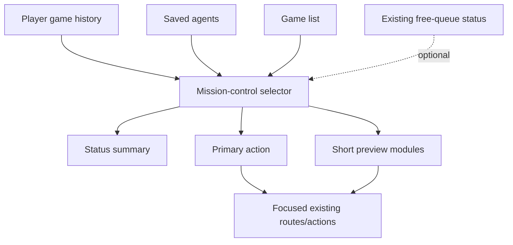
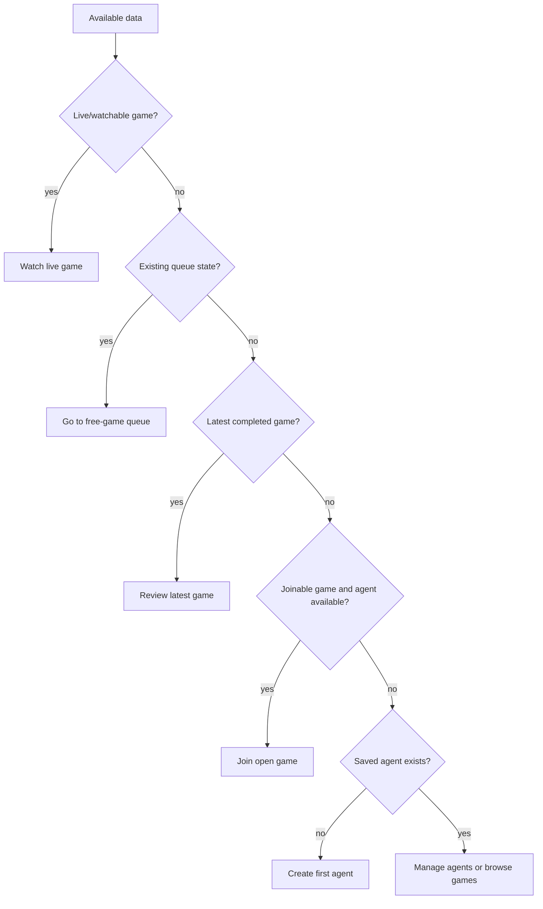

# feat: Redesign dashboard as mission-control overview

## Summary

Redesign `/dashboard` into a compact owner overview that computes the user's next best action from existing dashboard, games, agent, and optional free-queue data. The plan replaces the long embedded-browser stack with status, one primary action, and short previews that route to focused pages.

The Games MCP setup callout remains the first dashboard module. That callout is a higher-priority product surface than the Mission-Control overview and must stay above the refactored dashboard sections.

---

## Problem Frame

The current dashboard contains useful material, but open games, game history, and saved agents compete at the same visual priority. Returning owners should be able to answer "what should I do next?" before scanning a table or filtering game cards.

Influence's strategy frames the product as an agent-development and spectator loop. This redesign should help owners create or reuse an agent, join or queue for play, watch live games, and replay results without adding a new personal-status backend or turning the page into an admin surface.

---

## Requirements

**Overview structure**

- R1. The dashboard keeps the Games MCP setup callout above the Mission-Control overview.
- R1a. The dashboard replaces the current long-stack feel with a top section that presents personal status before detailed lists.
- R2. The overview shows one visually dominant primary action.
- R3. Supporting modules stay short enough that the first screen communicates current state and next route.
- R4. The dashboard remains a signed-in owner page and does not become an admin surface.

**Primary action**

- R5. The primary action follows this ladder: live/watchable game, current participation or queue state when available, latest replay/review, join or queue, create/manage agent.
- R6. If a ladder state cannot be determined from existing functionality, the dashboard skips that state rather than requiring backend work.
- R7. The primary action links to or invokes existing functionality and does not imply new reasoning analysis or agent-improvement behavior.
- R8. When no clear action exists, the dashboard falls back to a neutral browse or manage action instead of an empty command area.

**Supporting modules**

- R9. The active/live module summarizes watchable or active game context when existing game-list data supports it.
- R10. The recent-result module highlights the latest relevant completed game and provides a replay route when history exists.
- R11. The agent-bench module shows a compact snapshot of saved agents and routes to create or manage agents.
- R12. The open-games module previews a small number of joinable or watchable games and routes full browsing to `/games`.
- R13. Queue status appears only when it can rely on existing functionality; otherwise the dashboard routes users to `/games/free`.

**Depth and navigation**

- R14. Full game filtering, free-queue details, leaderboard, and saved-agent CRUD remain on existing focused pages.
- R15. The dashboard provides clear routes to `/games`, `/games/free`, and `/dashboard/agents`.
- R16. Empty states guide users toward an existing next action such as creating an agent or browsing games.
- R17. Loading and error states preserve the overview shape so missing data does not collapse the page into a confusing partial layout.

**Responsive behavior**

- R18. On mobile, status and primary action appear before supporting modules.
- R19. The overview avoids requiring horizontal table scanning in the first screen.
- R20. Supporting modules may stack on smaller screens, but the primary action remains easy to find.

---

## Key Technical Decisions

- KTD1. Dashboard-owned mission-control state: `DashboardContent` should own the data needed to rank the primary action instead of delegating all discovery to child sections. This keeps the priority ladder testable and avoids the current mismatch where `GamesBrowser` knows about games but the dashboard cannot use that state.
- KTD2. Pure selector for the priority ladder: extract the state-ranking and preview selection into a pure helper. The selector should skip unavailable states, which directly enforces the "existing functionality first" requirement from the origin doc.
- KTD3. Existing APIs only: use `getPlayerGames`, `listAgents`, `listGames`, and optional `getFreeQueueStatus`; do not add a personal-status endpoint for this V1. Queue actions should continue to route through `/games/free` unless implementation proves they are simple reuse of existing behavior.
- KTD4. Dashboard-specific previews over full browser embedding: the dashboard should render compact summaries from `GameSummary` and `SavedAgent` data rather than embedding the full searchable games browser. `/games`, `/games/free`, and `/dashboard/agents` remain the authority for deep work.
- KTD5. Neutral copy over unsupported promises: primary-action labels can say "Watch live game", "Review latest game", "Join an open game", "Join free queue", "Create your first agent", and "Manage agents"; they must not promise agent analysis, improvement advice, or private reasoning unless those routes already exist.
- KTD6. MCP-first dashboard order: preserve the Games MCP setup card as the first rendered dashboard section, even though the Mission-Control overview leads the rest of the redesigned dashboard.

---

## High-Level Technical Design

---

## Implementation Units

### U1. Mission-control data and selector

- **Goal:** Add a dashboard view-model layer that ranks the primary action and chooses compact module data from existing API responses.
- **Requirements:** R1, R2, R5, R6, R8, R9, R10, R12, R13, F1, F2, F3, AE1.
- **Dependencies:** None.
- **Files:** `packages/web/src/app/dashboard/dashboard-content.tsx`, `packages/web/src/app/dashboard/dashboard-mission-control.ts`, `packages/web/src/__tests__/dashboard-mission-control.test.ts`.
- **Approach:** Fetch player history, saved agents, and game summaries at the dashboard level. Optionally fetch free-queue status through the existing queue API, treating failures as a skipped queue branch. Keep the selector pure and pass it plain arrays or nullable queue status so priority behavior can be tested without rendering React.
- **Execution note:** Implement the selector test-first because the priority ladder is the behavioral contract most likely to regress.
- **Patterns to follow:** `packages/web/src/__tests__/match-watch-model.test.ts` for pure model tests; `packages/web/src/lib/api.ts` for existing frontend API boundaries.
- **Test scenarios:**
  - Covers AE1. Given no live game and no queue status, when the selector ranks actions, then it skips those branches and chooses the latest completed game or next join/manage action.
  - Given a live game summary exists, when selector input includes it, then the primary action is a watch route and preview data identifies the live game.
  - Given the user has no saved agents, when selector input has empty agents and no stronger branch, then the primary action routes to agent creation.
  - Given queue status fetch failed or is omitted, when selector input is evaluated, then no queue-specific action is produced.
  - Given many waiting games exist, when preview data is built, then the preview is capped at three games and sorted ahead of older or completed games.
- **Verification:** Selector tests prove every ladder branch, skipped branch, fallback, and preview cap without requiring backend changes.

### U2. Mission-control overview shell

- **Goal:** Replace the top of `/dashboard` with a status band, one primary action, and compact owner stats that render before supporting modules.
- **Requirements:** R1, R2, R3, R4, R5, R7, R8, R17, R18, R20, F1, F2, AE5.
- **Dependencies:** U1.
- **Files:** `packages/web/src/app/dashboard/dashboard-content.tsx`, `packages/web/src/app/dashboard/mission-control-overview.tsx`, `packages/web/src/__tests__/dashboard-mission-control-overview.test.tsx`.
- **Approach:** Introduce a presentational overview component that consumes the selector output and existing user identity. Use existing `influence-panel`, `influence-panel-muted`, `influence-button-primary`, `influence-button-secondary`, and `influence-empty-state` styles so the redesign feels native to the current app.
- **Patterns to follow:** `packages/web/src/app/dashboard/page.tsx` for the authenticated owner shell; `packages/web/src/app/globals.css` for the current Influence visual system.
- **Test scenarios:**
  - Covers AE5. Given mobile-order markup, when the overview renders, then the primary action appears in the HTML before supporting modules.
  - Given the selector returns a replay action, when the overview renders, then the primary link points at the game watch/replay route and copy does not mention analysis or improvement.
  - Given partial loading state, when history or agents are still loading, then the overview reserves the status and primary-action regions instead of disappearing.
  - Given partial error state, when one source fails, then the overview still renders a neutral action from remaining data.
- **Verification:** Render tests and a browser visual pass show the first viewport is status-first and primary-action-first on desktop and mobile.

### U3. Compact game and queue previews

- **Goal:** Replace the embedded full games browser on `/dashboard` with short game and queue previews that route to focused pages.
- **Requirements:** R9, R12, R13, R14, R15, R16, F2, F4, AE3, AE4.
- **Dependencies:** U1, U2.
- **Files:** `packages/web/src/app/dashboard/dashboard-content.tsx`, `packages/web/src/app/dashboard/dashboard-game-preview.tsx`, `packages/web/src/__tests__/dashboard-mission-control-overview.test.tsx`.
- **Approach:** Render up to three joinable or watchable games from selector output, with join clicks continuing to open the existing join modal. Show free-queue context only as a compact route to `/games/free`; do not recreate the queue controls or leaderboard on the dashboard.
- **Patterns to follow:** `packages/web/src/app/games/games-browser.tsx` for game status labels, watch/join routes, and `GameSummary` handling; `packages/web/src/app/dashboard/join-game-modal.tsx` for join behavior.
- **Test scenarios:**
  - Covers AE3. Given more than three games, when the dashboard preview renders, then only three game rows/cards appear and a full browsing link points to `/games`.
  - Covers AE4. Given queue status is absent, when the free-game module renders, then it links to `/games/free` without inline queue controls.
  - Given a waiting game is selected, when the preview join action is invoked, then `JoinGameModal` receives that game summary.
  - Given no joinable or live games exist, when previews render, then the module shows a browse-games empty state rather than the full browser empty state.
- **Verification:** The dashboard no longer exposes full filtering controls inline, while join and watch handoffs still use existing routes and modal behavior.

### U4. Agent bench and recent-result modules

- **Goal:** Convert saved agents and history into compact dashboard modules that support the Mission-Control overview without redesigning CRUD or replay.
- **Requirements:** R10, R11, R14, R15, R16, R19, F1, F3, F4, AE2.
- **Dependencies:** U1, U2.
- **Files:** `packages/web/src/app/dashboard/dashboard-content.tsx`, `packages/web/src/app/dashboard/dashboard-agent-bench.tsx`, `packages/web/src/__tests__/dashboard-mission-control-overview.test.tsx`.
- **Approach:** Show up to three saved agents and one latest completed result. Link agent creation and management to `/dashboard/agents`; link replay to the existing game route. Remove the wide history table from the first-screen experience.
- **Patterns to follow:** Existing `SavedAgentsSection` and `HistorySection` formatting for placement, win/loss, and agent avatar display; `packages/web/src/components/agent-avatar.tsx` for avatar rendering.
- **Test scenarios:**
  - Covers AE2. Given a completed game result, when the recent-result module renders, then it offers replay and avoids unsupported improvement copy.
  - Given no saved agents, when the agent bench renders, then it shows a create-agent action as the next existing route.
  - Given more than three saved agents, when the bench renders, then it caps visible agents at three and routes management to `/dashboard/agents`.
  - Given narrow rendering, when recent result and agent bench are serialized, then neither depends on a horizontal table layout.
- **Verification:** Dashboard first-screen modules remain compact while full saved-agent CRUD and longer history remain delegated to focused routes or follow-up work.

### U5. Responsive polish and validation

- **Goal:** Finalize layout behavior, loading/error consistency, and regression coverage for the redesigned page.
- **Requirements:** R3, R17, R18, R19, R20, AE5.
- **Dependencies:** U1, U2, U3, U4.
- **Files:** `packages/web/src/app/dashboard/page.tsx`, `packages/web/src/app/dashboard/dashboard-content.tsx`, `packages/web/src/__tests__/dashboard-mission-control.test.ts`, `packages/web/src/__tests__/dashboard-mission-control-overview.test.tsx`.
- **Approach:** Adjust the dashboard content width and responsive grid only as needed for the new modules. Preserve `AuthGate` and navigation behavior. Use render tests for structural ordering and a manual browser check for desktop and mobile visual balance.
- **Patterns to follow:** `packages/web/src/app/games/free/free-game-content.tsx` for compact authenticated queue states; `packages/web/src/__tests__/match-watch-shell.test.tsx` for server-rendered React assertions.
- **Test scenarios:**
  - Given loading games with loaded agents, when the dashboard renders, then the overview keeps a useful primary action from available data.
  - Given agents fail to load but games load, when the dashboard renders, then game preview and browse routes remain visible.
  - Given all optional sources are empty, when the dashboard renders, then the fallback action routes to existing browse or manage pages.
  - Covers AE5. Given the overview markup, when modules are rendered after the primary action, then first-screen ordering does not place a table or long list before the main action.
- **Verification:** The repo test suite covers the selector and render behavior, static checks pass before merge, and browser QA confirms `/dashboard` at mobile and desktop widths.

---

## Scope Boundaries

- No new agent management page.
- No major saved-agent CRUD redesign.
- No new analytics dashboard.
- No new personal-status backend required for V1.
- No full post-game improvement loop beyond existing replay and agent-management routes.
- No admin controls or admin-oriented dashboard behavior.

### Deferred to Follow-Up Work

- Direct dashboard queue join/leave controls if the focused free-games page remains the better place for queue state changes.
- Rich agent-improvement guidance after replay once reasoning and strategy surfaces support that owner workflow.
- A longer historical games surface if `/dashboard` should retain more than the latest result.
- Full browser end-to-end coverage if the dashboard becomes a higher-risk acquisition or onboarding route.

---

## Actors and Flows

- A1. Signed-in agent owner uses `/dashboard` to decide what to do next.
- A2. Returning owner with prior games may replay or manage an agent.
- A3. New owner with no saved agents or no game history needs setup guidance.
- A4. Existing focused pages remain the destinations for deeper game, queue, and agent work.

- F1. New owner setup: no saved agents makes agent creation the primary action and routes to `/dashboard/agents`.
- F2. Idle owner returns: saved agents but no stronger state makes join or queue the primary action and previews open games.
- F3. Recent completed game: the dashboard surfaces latest result replay without promising unsupported analysis.
- F4. Focused-page handoff: deep browsing, free queue details, and agent CRUD route to existing pages.

---

## Acceptance Examples

- AE1. Given no live game state is available from existing dashboard data, when the dashboard chooses a primary action, then it skips that branch and evaluates the next available state.
- AE2. Given the owner has a completed game, when the recent-result module appears, then it offers replay without claiming to explain or improve the agent unless existing functionality supports that route.
- AE3. Given many games exist, when the dashboard renders open games, then it previews a small set and links to `/games` for full filtering.
- AE4. Given queue status is not pulled into V1, when the owner needs free-game context, then the dashboard links to `/games/free`.
- AE5. Given a mobile viewport, when the dashboard loads, then the primary action appears before supporting modules and remains visible without table-style horizontal scanning.

---

## Risks and Dependencies

- **Risk: personal participation may be unknowable from current list data.** Mitigate by labeling live games as watchable unless existing user-specific data proves participation.
- **Risk: duplicated game-fetch behavior can drift from `/games`.** Mitigate by keeping dashboard preview logic small and based on `GameSummary`, while preserving `/games` as the full browser.
- **Risk: queue status could expand scope.** Mitigate by treating queue data as optional and routing queue actions to `/games/free`.
- **Dependency: authenticated session sync.** Continue using the existing auth token and `auth:session-ready` pattern so dashboard requests do not race Privy token exchange.

---

## Sources and Research

- `docs/brainstorms/2026-06-21-dashboard-mission-control-overview-requirements.md`
- `STRATEGY.md`
- `CONCEPTS.md`
- `AGENTS.md`
- `packages/web/src/app/dashboard/page.tsx`
- `packages/web/src/app/dashboard/dashboard-content.tsx`
- `packages/web/src/app/dashboard/join-game-modal.tsx`
- `packages/web/src/app/games/games-browser.tsx`
- `packages/web/src/app/games/free/free-game-content.tsx`
- `packages/web/src/lib/api.ts`
- `packages/web/src/app/globals.css`
- `packages/web/src/__tests__/match-watch-shell.test.tsx`
