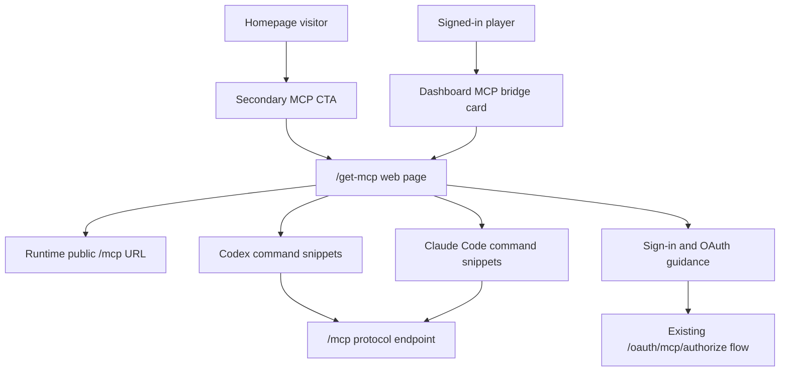

# feat: Add MCP Setup CTAs

## Summary

Add a lightweight homepage CTA, an authenticated dashboard bridge card, and a `/get-mcp` setup page that teaches players how to connect their Influence games to Codex and Claude Code through the existing player-facing `/mcp` resource. The implementation keeps `/mcp` as the protocol endpoint, keeps `/mcp/producer` internal, and makes command-line setup the normal path.

---

## Problem Frame

Influence already has a user-facing Games MCP scope, but today it is mostly discoverable through developer-facing docs. That undercuts the strategy track for AI app compatibility: the primary user is an AI/game tinkerer, and they should discover the connection from the product before reading repo docs.

The product surfaces need different jobs. The homepage should give curious visitors one clear compatibility signal without crowding the watch/play pitch. The dashboard should give signed-in players a contextual bridge near their game and agent history. The setup page should be the durable human route because `/mcp` is reserved for Streamable HTTP MCP traffic and deployment routing sends it to the API.

---

## Requirements

**Discovery Surfaces**

- R1. The homepage includes a concise CTA that links to `/get-mcp` and describes connecting Influence games to Codex or Claude Code. Covers origin R1-R4, F1, AE1.
- R2. The dashboard includes a compact authenticated bridge card that links to `/get-mcp` and frames the value as using the player's Influence games from AI tools. Covers origin R5-R8, F2, AE2.
- R3. Neither CTA links directly to `/mcp` or promotes top-nav/rules-page placement. Covers origin R2, R6, scope boundaries.

**Setup Page**

- R4. `/get-mcp` is a human-facing web route that describes `/mcp` as the player-facing MCP endpoint for the current environment. Covers origin R9, R13, AE3.
- R5. The setup page presents Codex and Claude Code as the supported setup paths and uses copyable command-line snippets as the primary instruction shape. Covers origin R10-R14, F3-F4, AE4.
- R6. The page remains useful before sign-in, but asks signed-out visitors to sign in before completing OAuth-backed setup. Covers origin R19-R21, AE6.
- R7. The page explains that the MCP client starts OAuth and browser authorization completes the grant. Covers origin R18, R21.

**Access Boundary**

- R8. Player-facing copy describes the grant as access to the signed-in user's Influence games through MCP. Covers origin R15, AE5.
- R9. Player-facing copy states that Games MCP does not grant maintainer access, producer inspection, private trace content, or internal developer evidence. Covers origin R16.
- R10. Player-facing copy does not mention `/mcp/producer`, `scope=mcp`, private trace tools, producer-only capabilities, TOML editing, or JSON config editing. Covers origin R14, R17.

**Documentation and Verification**

- R11. Internal MCP documentation keeps producer setup internal while adding a player-facing pointer to `/get-mcp`. Covers origin sources and scope boundaries.
- R12. Tests and visual verification cover CTA links, route rendering, command snippets, signed-out copy, and forbidden producer/config-file copy. Covers origin success criteria.

---

## Key Technical Decisions

- **Use `/get-mcp` as the only human setup route:** `/mcp` remains the Streamable HTTP MCP resource endpoint and should not render web UI. This follows the routing constraint in the origin document.
- **Derive the command endpoint from runtime API config:** The command snippets should use the active environment's public API origin plus `/mcp` rather than a hardcoded production host, so local, staging, preview, and production pages remain truthful.
- **Keep setup content page-local:** The setup page can own its copy, command models, and copy buttons. A broader integration-docs abstraction would be premature until more clients are product-supported.
- **Integrate homepage CTA into the existing hero:** The homepage is a full-bleed hero with primary watch/play actions, so the MCP CTA should be secondary and visually quiet instead of a new marketing section.
- **Place the dashboard bridge near player context:** The dashboard already clusters open games, history, and agents. The MCP card should live in that context rather than navigation or profile settings.
- **Treat docs alignment as guardrail work:** `docs/game-mcp-production-oauth.md` remains the internal contract, but it should point player setup readers to `/get-mcp` so user-facing instructions do not drift back into producer-oriented docs.

---

## High-Level Technical Design

The web page is a discovery and instruction surface only. It does not mint tokens, proxy MCP traffic, or replace the existing OAuth authorization page.

---

## Implementation Units

### U1. Runtime MCP Setup Model

- **Goal:** Create a small web-layer model for the public Games MCP URL and supported setup commands.
- **Requirements:** R4-R7, R10, R12.
- **Dependencies:** Existing runtime config and MCP OAuth constants.
- **Files:**
  - `packages/web/src/lib/mcp-setup.ts`
  - `packages/web/src/lib/runtime-config.ts`
  - `packages/web/src/app/runtime-config/route.ts`
  - `packages/web/src/__tests__/mcp-setup.test.ts`
- **Approach:** Add a helper that derives a public `/mcp` URL from runtime API config, falling back to the existing local API default before any same-origin fallback. Keep command definitions structured so the page can render Codex and Claude Code tabs/cards without duplicating URL logic. Include command shapes for adding the HTTP MCP server and initiating authentication where the client exposes a separate login command.
- **Patterns to follow:** `RuntimeConfigProvider`, `setApiBase`, `MCP_OAUTH_GAMES_SCOPE`, and the existing source-level tests in `mcp-oauth.test.ts`.
- **Test scenarios:**
  - Given runtime config contains an API URL with a trailing slash, the derived MCP URL is the same origin plus `/mcp` without duplicate slashes.
  - Given runtime config is unavailable in a local render, the fallback produces the existing local API default plus `/mcp`.
  - Given command models are generated for Codex, they include a streamable HTTP add command and an OAuth login command for the same server name.
  - Given command models are generated for Claude Code, they include an HTTP transport add command for the same `/mcp` URL.
  - Given generated command text is serialized, it contains `/mcp` and does not contain `/mcp/producer`, `scope=mcp`, TOML, or JSON config editing.
- **Verification:** Unit tests prove URL derivation and command text are environment-safe and boundary-safe before UI wiring uses them.

### U2. `/get-mcp` Setup Page

- **Goal:** Add the player-facing setup route with copyable Codex and Claude Code instructions, sign-in guidance, and access-boundary copy.
- **Requirements:** R4-R10, R12.
- **Dependencies:** U1 command model.
- **Files:**
  - `packages/web/src/app/get-mcp/page.tsx`
  - `packages/web/src/app/get-mcp/get-mcp-client.tsx`
  - `packages/web/src/app/get-mcp/copy-command-button.tsx`
  - `packages/web/src/__tests__/get-mcp-page.test.tsx`
- **Approach:** Render a focused setup page with the existing `Nav`, Influence visual tokens, two supported client sections, and a short sign-in/OAuth explanation. Use a client component only for runtime URL hydration, auth-aware sign-in action, and clipboard interaction; keep the page's copy and structure simple enough to server-render safely. Do not expose token copying, manual config editing, or producer/internal language.
- **Patterns to follow:** `AuthGate` sign-in language, `McpOAuthAuthorizeClient` access-boundary copy, profile clipboard behavior in `profile-content.tsx`, and `influence-panel` / `influence-button-*` styling.
- **Test scenarios:**
  - Covers AE3. Rendering `/get-mcp` shows the current environment's `/mcp` endpoint in command snippets and never shows `/mcp/producer`.
  - Covers AE4. Rendering client instructions shows copyable CLI commands for Codex and Claude Code and no TOML or JSON config editing path.
  - Covers AE5. The access copy describes access to the user's games and excludes maintainer access, producer inspection, private trace content, and developer evidence.
  - Covers AE6. A signed-out render includes sign-in guidance and explains that authorization completes in the browser after the MCP client starts OAuth.
  - Given clipboard access is unavailable, the copy control leaves the command visible and does not hide the instruction behind a failed browser API.
- **Verification:** Component tests and source-copy assertions prove the page renders supported setup paths and excludes forbidden copy.

### U3. Homepage CTA Integration

- **Goal:** Add a secondary MCP CTA to the homepage without competing with the primary watch/play actions.
- **Requirements:** R1, R3, R12.
- **Dependencies:** `/get-mcp` route exists from U2.
- **Files:**
  - `packages/web/src/components/home/homepage-hero.tsx`
  - `packages/web/src/app/globals.css`
  - `packages/web/src/__tests__/homepage-hero.test.tsx`
- **Approach:** Extend the existing hero CTA area with a visually quiet link to `/get-mcp`, likely near the current action row or status row. Keep the copy short and framed around bringing Influence games into Codex or Claude Code. Avoid adding a separate homepage section, nav item, or protocol explainer.
- **Patterns to follow:** `home-stat-pill`, current primary/secondary hero buttons, and the recent homepage header polish pattern that kept layout changes local to `homepage-hero.tsx` and `globals.css`.
- **Test scenarios:**
  - Covers AE1. Rendering the homepage hero includes a CTA linking to `/get-mcp` and mentioning Codex or Claude Code setup.
  - Given the hero renders primary actions, the MCP CTA remains secondary and the existing `Watch Live` and `Start A Game` links remain present.
  - Given the hero source is scanned, it does not link directly to `/mcp` or include `/mcp/producer`.
  - Given the page renders on narrow widths, the CTA text wraps without overlapping the primary actions or stat pills.
- **Verification:** Component/source tests prove link and copy behavior; visual verification confirms the hero still reads as the game homepage, not an integration landing page.

### U4. Dashboard Bridge Card

- **Goal:** Add an authenticated dashboard bridge card that connects player context to MCP setup.
- **Requirements:** R2-R3, R12.
- **Dependencies:** `/get-mcp` route exists from U2.
- **Files:**
  - `packages/web/src/app/dashboard/dashboard-content.tsx`
  - `packages/web/src/__tests__/dashboard-mcp-card.test.tsx`
- **Approach:** Add a compact `influence-panel` or muted panel in the dashboard content near history and agents. The copy should speak to "your Influence games" and stay useful for players with no history by encouraging setup after joining or completing a game. The card should use a normal `Link` to `/get-mcp` and should not alter auth gating.
- **Patterns to follow:** Existing dashboard section headers, `HistorySection`, `SavedAgentsSection`, empty-state copy, and compact link/button styling in the dashboard.
- **Test scenarios:**
  - Covers AE2. Rendering dashboard content with game history shows a compact bridge card linking to `/get-mcp`.
  - Covers AE2. Rendering dashboard content with no game history still shows useful setup copy and does not imply the user already has games.
  - Given the dashboard source is scanned, the card does not link directly to `/mcp` or include producer/internal language.
  - Given the dashboard header stats render, adding the card does not remove existing game count, history, open games, or agents content.
- **Verification:** Component/source tests prove the card is present and boundary-safe across history states.

### U5. Documentation Alignment

- **Goal:** Keep internal MCP docs accurate while making `/get-mcp` the player-facing setup doorway.
- **Requirements:** R10-R11.
- **Dependencies:** U2 page route and copy are settled.
- **Files:**
  - `docs/game-mcp-production-oauth.md`
- **Approach:** Update the production MCP doc's client-path section so player setup points to the web page first. Keep producer setup and internal operational checks in the doc, but make the distinction explicit: `/get-mcp` is for players; `/mcp/producer` and `scope=mcp` are internal maintainer surfaces. Do not add manual TOML/JSON editing instructions to the new player page.
- **Patterns to follow:** Current `docs/game-mcp-production-oauth.md` split between user and producer resources, plus the glossary terms in `CONCEPTS.md`.
- **Test scenarios:**
  - Given docs are searched for player setup language, the player path points to `/get-mcp`.
  - Given docs are searched for producer setup language, producer instructions remain in internal documentation and are not copied into player-facing page files.
  - Given the setup page source is searched, it does not contain TOML, JSON config editing, `/mcp/producer`, or `scope=mcp`.
- **Verification:** Documentation review confirms player setup has one public doorway and internal producer guidance remains available only in developer docs.

### U6. Visual and Browser Verification

- **Goal:** Verify that the new surfaces render cleanly and that the user flow works as a product experience.
- **Requirements:** R1-R12.
- **Dependencies:** U2-U4 implemented.
- **Files:**
  - `packages/web/src/components/home/homepage-hero.tsx`
  - `packages/web/src/app/dashboard/dashboard-content.tsx`
  - `packages/web/src/app/get-mcp/page.tsx`
  - `packages/web/src/app/get-mcp/get-mcp-client.tsx`
- **Approach:** Run focused browser checks for the homepage, dashboard, and `/get-mcp` at desktop and mobile widths. Confirm links route to `/get-mcp`, command blocks are visible, copy buttons do not resize the command layout, and no text overlaps. Use the existing local dev-server pattern for web UI verification when execution begins.
- **Patterns to follow:** Prior homepage visual QA practice for local ports and frontend design constraints in `AGENTS.md`.
- **Test scenarios:**
  - Covers F1. A visitor can move from homepage CTA to `/get-mcp`.
  - Covers F2. A signed-in player can move from dashboard card to `/get-mcp`.
  - Covers F3. The Codex setup section shows the add and login steps, and command text uses `/mcp`.
  - Covers F4. The Claude Code setup section shows the HTTP add step and browser-auth guidance, and command text uses `/mcp`.
  - Given mobile viewport widths, homepage CTA, dashboard card, setup tabs/cards, and command blocks do not overlap or overflow.
- **Verification:** Browser screenshots or equivalent visual checks show the three surfaces render non-broken at desktop and mobile sizes, with command snippets legible and CTAs reachable.

---

## Scope Boundaries

In scope:

- Homepage secondary CTA.
- Authenticated dashboard bridge card.
- `/get-mcp` player setup page.
- Codex and Claude Code command-line snippets.
- Runtime-derived player `/mcp` URL.
- Sign-in and OAuth-flow guidance.
- Internal docs pointer from player setup to `/get-mcp`.
- Focused tests and visual verification.

Out of scope:

- Advertising `/mcp/producer`, `scope=mcp`, private trace tools, or producer inspection in player-facing UI.
- Manual TOML or JSON config editing as the normal setup path.
- Rules-page, top-nav, or admin-surface promotion.
- Token display, token copying, or token management in the web app.
- Live end-to-end Codex or Claude OAuth login verification as a release gate for this UI slice.
- Adding Copilot, ChatGPT, or other clients to the player page.
- Changing Caddy routing for `/mcp`.

---

## Acceptance Examples

- AE1. A visitor opens the homepage and sees a concise CTA linking to `/get-mcp`, while the primary watch/play actions remain available.
- AE2. A signed-in player opens the dashboard and sees a compact MCP bridge card linking to `/get-mcp`, regardless of whether they have game history.
- AE3. A player opens `/get-mcp` and sees command snippets using the current environment's `/mcp` URL with no `/mcp/producer` copy.
- AE4. A player views Codex or Claude Code instructions and sees copyable CLI commands instead of manual config-file editing.
- AE5. A player reads the access explanation and understands the grant as access to their games, not maintainer/private-trace access.
- AE6. A signed-out visitor opens `/get-mcp` and sees sign-in guidance plus browser OAuth completion guidance.

---

## Risks & Dependencies

- **Runtime URL drift:** The page must not bake in production URLs at build time. Use runtime config or request/browser origin fallbacks so staging and local pages generate honest commands.
- **Producer-boundary leakage:** Existing docs and OAuth UI mention producer access because they serve maintainer workflows. Player-facing page tests should explicitly reject producer/internal strings.
- **Homepage crowding:** The current hero is already doing brand, value prop, live feed, primary actions, and stats. The MCP CTA should stay secondary and must be visually checked on mobile.
- **Auth-state ambiguity:** `/get-mcp` is useful before sign-in, but OAuth completion depends on the MCP client's auth request. The copy should avoid implying that clicking a web button alone installs the MCP server.

---

## Sources / Research

- Origin requirements: `docs/brainstorms/2026-06-21-dashboard-mcp-setup-card-requirements.md`
- Strategy context: `STRATEGY.md`
- MCP vocabulary: `CONCEPTS.md`
- Production MCP contract: `docs/game-mcp-production-oauth.md`
- Games MCP scope hardening: `docs/brainstorms/2026-06-19-games-scope-mcp-oauth-hardening-requirements.md`
- Existing OAuth plan: `docs/plans/2026-06-19-002-feat-games-scope-mcp-oauth-plan.md`
- Homepage surface: `packages/web/src/components/home/homepage-hero.tsx`
- Dashboard surface: `packages/web/src/app/dashboard/dashboard-content.tsx`
- Runtime config: `packages/web/src/lib/runtime-config.ts`
- OAuth authorize UI: `packages/web/src/app/oauth/mcp/authorize/authorize-client.tsx`
- Local CLI confirmation: `codex mcp add --help`, `codex mcp login --help`, `claude mcp add --help`, `claude mcp --help`
