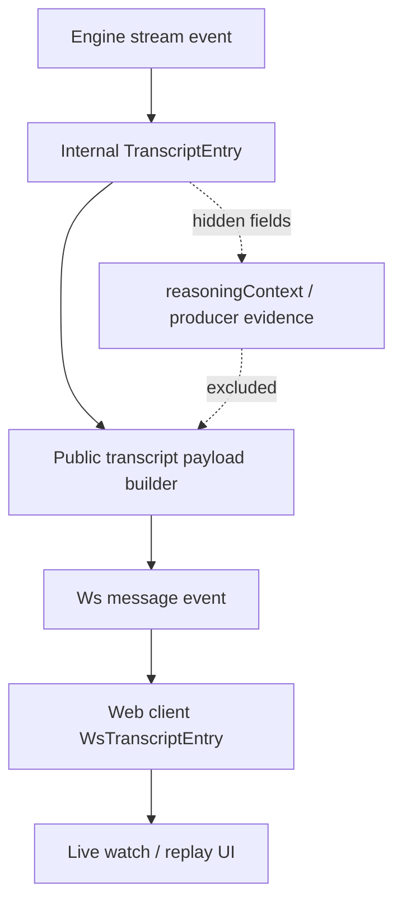

# refactor: Harden Public Websocket Transcript Boundary

## Summary

Refactor websocket transcript broadcasts so public message payloads are built from an explicit viewer-safe field set. Preserve current watch/replay behavior for visible transcript text, room metadata, and viewer-facing `thinking`, while making hidden reasoning and producer evidence impossible to carry through by broad-object copy.

---

## Problem Frame

Influence relies on public-by-URL watch and replay surfaces that stay useful without exposing producer/debug evidence. The origin requirements identify websocket transcript broadcasts as the clearest construction debt: the API currently accepts an internal `TranscriptEntry`, removes `reasoningContext`, and publishes the remaining object.

That late-redaction posture is fragile as transcript observability, public watch intelligence, and future sharing surfaces grow. The plan changes construction style rather than privacy policy: public messages keep the fields viewers already need and exclude hidden reasoning/evidence by design.

---

## Requirements

**Public Message Contract**

- R1. Websocket `message` events expose a public transcript payload selected for the viewer contract.
- R2. Public message events preserve display text, phase, round, sender, scope, recipients, room identifiers, room metadata, timestamp, and viewer-safe `thinking` when present.
- R3. Public message events preserve thinking-scope transcript entries for backward-compatible watch/replay behavior.
- R4. Public message events exclude `reasoningContext`, private trace content or metadata, source pointers, provider/raw payloads, prompts, responses, storage keys, decision logs, and producer-only evidence.
- R5. Public websocket handling continues to ignore internal agent-turn observability events.

**Type and Client Alignment**

- R6. The server-side websocket outbound type distinguishes the public message entry from the engine/internal `TranscriptEntry`.
- R7. The web client websocket transcript type remains aligned with the server's public message contract.
- R8. Raw websocket publication remains limited to already public event shapes, with watch-state behavior unchanged.

**Tests and Documentation**

- R9. Characterization tests pin current public websocket behavior before the refactor changes construction style.
- R10. Privacy sentinel tests prove allowed viewer fields survive and hidden reasoning/evidence fields stay absent.
- R11. The refactor does not change public-by-URL watch access, Games MCP policy, Producer MCP policy, or cognitive-artifact authorization.
- R12. Documentation touched by the change preserves the distinction between viewer-safe `thinking`/`strategy` and private `reasoningContext`/producer evidence.

---

## Key Technical Decisions

- **Allowed-field builder over redaction helper:** Replace the current broad-copy sanitizer with a builder that returns the public websocket transcript shape. This satisfies the origin's construction-style requirement and prevents newly added internal fields from leaking by default.
- **Server contract mirrors client contract:** The server should name the public websocket transcript entry separately from the engine `TranscriptEntry`, matching the narrower web client type. This makes the cross-package contract visible without introducing an API-wide DTO package.
- **Characterization-first refactor:** Add or tighten tests around existing visible behavior before changing the construction helper. This protects the product nuance that viewer-facing `thinking` stays visible while `reasoningContext` stays private.
- **Sentinel tests stay local and reusable only where cheap:** Use sentinel strings in websocket tests, following public watch-intelligence and watch-state tests. Do not actively refactor MCP or cognitive-artifact surfaces in this slice.
- **No transport or access change:** Keep existing websocket event kinds, topic routing, `watch_state` behavior, and public watch access unchanged. The work is contract hardening, not a watch-stream redesign.

---

## High-Level Technical Design

The builder is the public boundary. It consumes an internal transcript entry, selects only viewer-safe fields, and returns the same public shape the web client already expects.

---

## Implementation Units

### U1. Characterize the Existing Public Message Contract

- **Goal:** Lock down current websocket transcript behavior before changing construction style.
- **Requirements:** R1-R5, R9, R10
- **Dependencies:** None.
- **Files:**
  - `packages/api/src/__tests__/websocket.test.ts`
- **Approach:** Strengthen websocket tests around the public message shape by asserting the visible fields that must survive and the hidden fields that must not serialize. Keep the existing `thinking` and thinking-scope cases, and add sentinel fields for private evidence that could accidentally appear if the server copies broader objects later.
- **Execution note:** Start with characterization assertions before refactoring the service.
- **Patterns to follow:** Existing `createMockServer` and `broadcastGameEvent` tests in `packages/api/src/__tests__/websocket.test.ts`; sentinel-string privacy assertions in `packages/api/src/__tests__/public-watch-intelligence.test.ts` and `packages/api/src/__tests__/game-watch-state.test.ts`.
- **Test scenarios:**
  - Covers AE1. A transcript entry with normal message text, `thinking`, and `reasoningContext` publishes text and `thinking` but excludes `reasoningContext`.
  - Covers AE2. A thinking-scope transcript entry publishes the thinking display entry while excluding private reasoning evidence.
  - Covers AE3. An internal agent-turn event with decision evidence publishes no websocket message.
  - A transcript entry with room metadata preserves room allocation fields for Mingle display.
  - A transcript entry fixture carrying private sentinel fields such as prompt, raw response, storage key, source pointer, decision log, and private trace marker does not serialize those sentinel values.
- **Verification:** The websocket test suite defines the public message contract clearly enough that a later broad-copy regression fails.

### U2. Introduce an Explicit Public Websocket Transcript Type

- **Goal:** Make the server-side `message` event use a public transcript payload type instead of the engine/internal `TranscriptEntry`.
- **Requirements:** R1-R8
- **Dependencies:** U1.
- **Files:**
  - `packages/api/src/services/ws-manager.ts`
  - `packages/api/src/__tests__/websocket.test.ts`
  - `packages/web/src/lib/api.ts`
- **Approach:** Define a public websocket transcript entry type near `WsOutboundEvent` and use it for `message` events. Align its fields with `WsTranscriptEntry` in the web client: round, phase, sender, scope, recipients, room metadata, text, viewer-safe `thinking`, and timestamp. Keep non-message event types unchanged.
- **Patterns to follow:** Existing `WsGameEvent` / `WsTranscriptEntry` definitions in `packages/web/src/lib/api.ts`; `GameWatchState`'s selected-field DTO style in `packages/api/src/services/game-watch-state.ts`.
- **Test scenarios:**
  - A typecheck catches any attempt to assign `reasoningContext` through `message.entry`.
  - A typecheck catches any attempt to publish a full engine/internal transcript object as the public websocket message entry without passing through the public type.
  - Existing websocket tests continue to parse `message` events without client-shape drift.
  - `watch_state`, `phase_change`, `player_eliminated`, `game_over`, `game_status`, and `error` event tests remain behaviorally unchanged.
- **Verification:** Server and web client websocket transcript contracts have the same selected public field set, and no non-message event contract changes.

### U3. Replace Late Redaction With Allowed-Field Construction

- **Goal:** Build public websocket transcript messages from allowed fields rather than copying an internal transcript object and deleting `reasoningContext`.
- **Requirements:** R1-R5, R8-R10
- **Dependencies:** U1, U2.
- **Files:**
  - `packages/api/src/services/ws-manager.ts`
  - `packages/api/src/__tests__/websocket.test.ts`
- **Approach:** Replace the sanitizer with a builder whose return type is the public websocket transcript type. The builder should assign each allowed field intentionally and omit optional fields when absent. Keep `broadcastGameEvent` behavior for non-message events unchanged, and keep `agent_turn` as a no-op for public observers.
- **Patterns to follow:** Selected-field returns in `buildGameWatchState` and `buildFallbackPlayers`; public watch-intelligence field selection that extracts text from whitelisted payload fields.
- **Test scenarios:**
  - Covers AE1. A message with public text and `thinking` still reaches observers after the builder replaces the sanitizer.
  - Covers AE2. A thinking-scope message still reaches observers after the builder replaces the sanitizer.
  - Covers AE3. `agent_turn` events remain ignored after the refactor.
  - A fixture with extra internal properties serializes only the allowed public websocket fields.
  - Room metadata, room ID, recipients, sender, phase, round, timestamp, and text remain stable after the refactor.
- **Verification:** The implementation has no broad object spread from `TranscriptEntry` into the public message payload, and tests fail if a private sentinel reaches serialized websocket output.

### U4. Keep Public Watch State and Raw Publication Boundaries Intact

- **Goal:** Ensure the websocket refactor does not accidentally broaden or narrow adjacent public watch events.
- **Requirements:** R8, R10, R11
- **Dependencies:** U2, U3.
- **Files:**
  - `packages/api/src/services/ws-manager.ts`
  - `packages/api/src/__tests__/websocket.test.ts`
- **Approach:** Review `broadcastRaw`, `broadcastWatchState`, and `sendWatchState` after the message-entry refactor. Preserve existing `watch_state` tests that assert `thinking` and `reasoningContext` are absent, and avoid adding generic raw-object publication helpers that could bypass the public message builder.
- **Patterns to follow:** Existing `sendWatchState` and `broadcastWatchState` tests; GameWatchState summary tests that serialize and inspect public read-model output.
- **Test scenarios:**
  - Covers AE4. Applying the sentinel check to watch-state websocket output proves hidden reasoning/evidence fields remain absent without changing watch-state policy.
  - `sendWatchState` still sends watch state with cursor data and without `thinking` or `reasoningContext`.
  - `broadcastWatchState` still publishes watch state updates with unchanged event shape.
  - `broadcastRaw` remains limited to the `WsOutboundEvent` union and does not become a generic object escape hatch.
  - Terminal `game_status` and error events remain unchanged.
- **Verification:** Adjacent websocket event paths preserve their current public contracts and do not bypass the new message-entry boundary.

### U5. Update Boundary Documentation

- **Goal:** Keep the public/private reasoning boundary documented after the websocket contract changes.
- **Requirements:** R11, R12
- **Dependencies:** U2-U4.
- **Files:**
  - `docs/reasoning-transcript-observability.md`
  - `docs/game-mcp-production-oauth.md`
  - `CONCEPTS.md`
- **Approach:** Update only the docs whose existing wording would become incomplete or misleading after the server-side public websocket transcript type is introduced. Preserve the established product language: viewer-safe `thinking` and whitelisted `strategy` may appear in public watch/replay surfaces, while `reasoningContext`, raw prompts, provider responses, storage keys, source pointers, private trace manifests, and producer evidence remain private/debug.
- **Patterns to follow:** Existing glossary entries for `TranscriptEntry`, `reasoningContext`, `GameWatchState`, `Games MCP scope`, and private trace content; reasoning observability docs that separate simulation/debug artifacts from public player messages.
- **Test scenarios:** Test expectation: none -- documentation-only updates, with behavior covered by U1-U4.
- **Verification:** Documentation no longer implies websocket public messages are broad internal `TranscriptEntry` objects, and it still states that this slice does not change MCP or cognitive-artifact authorization policy.

---

## Scope Boundaries

### In Scope

- Websocket transcript message payload construction.
- Server/client websocket transcript type alignment.
- Focused privacy sentinel coverage for websocket public message events.
- Preservation of existing watch/replay display behavior.
- Documentation updates for the public/private transcript boundary.

### Deferred to Follow-Up Work

- A shared privacy sentinel helper across many public API suites.
- API-wide public DTO package or public response layer.
- Games MCP or cognitive-artifact response refactors.
- MatchWatchShell, replay theater, or public watch-intelligence product changes.

### Out of Scope

- Changing basic watch access from public-by-URL to auth-scoped viewing.
- Changing Games MCP, Producer MCP, or cognitive-artifact authorization.
- Removing viewer-safe `thinking` or strategy from surfaces where the product currently expects it.
- Changing websocket transport mechanics, topic naming, or live game lifecycle behavior.

---

## System-Wide Impact

This plan hardens a public data boundary without changing access policy. The main affected parties are public watchers, who should see no visible regression; web client code, which should receive the same selected message fields; and maintainers, who get a safer server-side contract that resists accidental private-field leakage.

The plan supports the replay/sharing and agent reasoning access tracks in `STRATEGY.md` by preserving legible public watch context while keeping private reasoning/debug evidence in the correct lanes.

---

## Risks & Dependencies

- **Risk: accidentally hiding viewer-facing thinking.** Mitigation: characterize `thinking` and thinking-scope behavior before refactoring, and keep those cases in sentinel coverage.
- **Risk: type mismatch between server and web client.** Mitigation: align server `message.entry` to the existing web client `WsTranscriptEntry` shape and keep client parsing tests in view.
- **Risk: scope creep into MCP or cognitive-artifact policy.** Mitigation: defer non-websocket sentinel examples unless they are trivial and do not alter authorization behavior.
- **Dependency: engine transcript fields.** The builder depends on the current engine transcript entry fields, but it should not expose future internal fields unless they are intentionally added to the public type.

---

## Sources & Research

- Origin requirements: `docs/brainstorms/2026-06-21-public-boundary-hardening-session-requirements.md`
- Ideation source: `docs/ideation/2026-06-21-refactoring-session-comments-todos-research-ideation.html`
- Websocket boundary: `packages/api/src/services/ws-manager.ts`
- Websocket tests: `packages/api/src/__tests__/websocket.test.ts`
- Web client websocket types: `packages/web/src/lib/api.ts`
- Web client websocket consumer: `packages/web/src/app/games/[slug]/game-viewer.tsx`
- Watch-state selected-field precedent: `packages/api/src/services/game-watch-state.ts`
- Public privacy sentinel precedent: `packages/api/src/__tests__/public-watch-intelligence.test.ts`
- Watch-state privacy sentinel precedent: `packages/api/src/__tests__/game-watch-state.test.ts`
- Reasoning/private evidence guidance: `docs/reasoning-transcript-observability.md`
- MCP boundary guidance: `docs/game-mcp-production-oauth.md`
- Domain vocabulary: `CONCEPTS.md`
