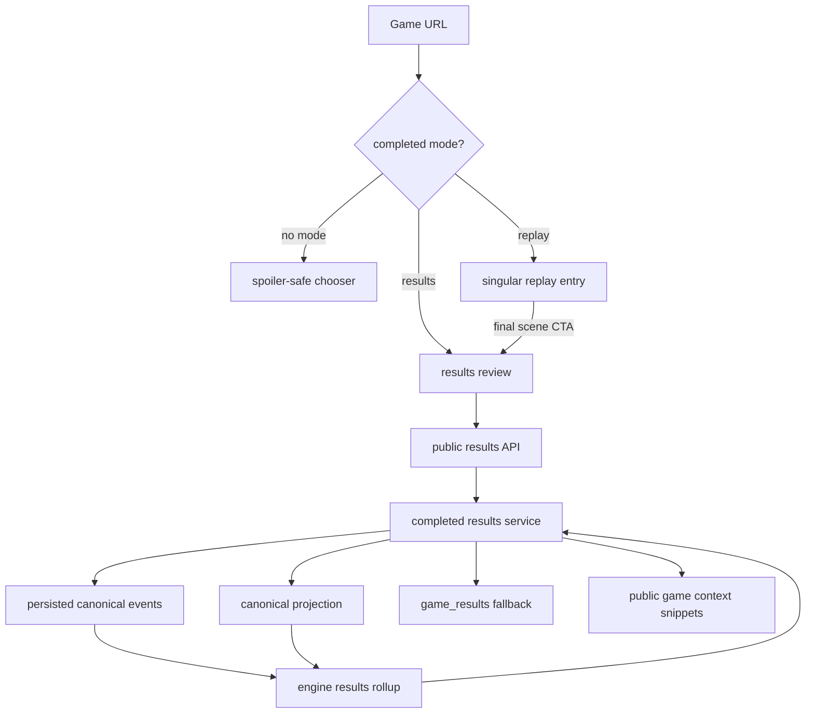
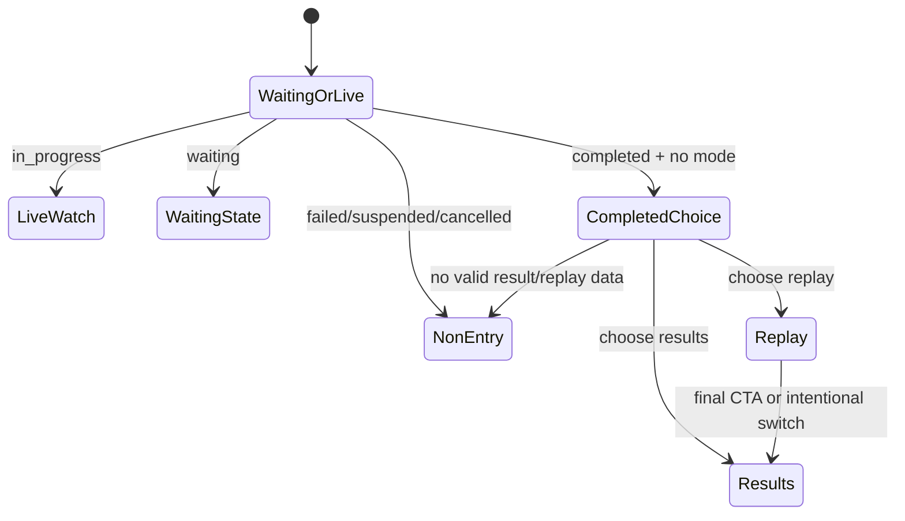

# feat: Add completed game results review

## Summary

Add a completed-game entry choice that lets viewers watch replay unspoiled or open a dedicated results review from the same game URL. The implementation will compute a public completed-results read model from canonical events and terminal results, render whole-game and per-round outcomes, and keep vote-pattern comparison lightweight without claiming formal alliances.

---

## Problem Frame

Completed games currently push viewers toward replay, and the existing result surface only exposes the winner. That makes the game hard to inspect after the fact: eliminations, votes, power decisions, Council outcomes, endgame votes, jury votes, and agent arcs are buried in a full replay.

The plan supports the Replay and sharing strategy track by making completed games easier to understand without weakening suspense for replay-first viewers. It also preserves the core source split already used in the repo: canonical game events and projections own outcome facts, while public transcript, thinking, and strategy snippets may provide context but not board-truth authority.

---

## Requirements

**Completed-Game Entry**

- R1. Completed games with replay or final-state data offer a replay/results choice before revealing winner, eliminations, votes, or result summaries.
- R2. Replay-targeted entry and default completed-game metadata remain spoiler-safe until the viewer chooses results or reaches the final replay scene.
- R3. Results-targeted entry opens the completed-game results review directly on the existing game URL.
- R4. Failed, suspended, cancelled, or otherwise invalid games do not enter the normal completed-game replay/results chooser.

**Results Data**

- R5. The results API returns winner, final method, finalists when applicable, status, rounds played, source confidence, and degradation state.
- R6. The results read model provides per-round rollups for standard votes, power outcomes, candidate resolution, Council votes, endgame elimination votes, jury votes, and eliminations where data exists.
- R7. Durable canonical event data is preferred over terminal result fallback; terminal result fallback may only supply marked best-available summary fields.
- R8. Transcript prose, public thinking, strategy cards, and House narration may explain context but must not override canonical or terminal result facts.

**Results Review UI**

- R9. The results review presents a compact overview, elimination timeline, vote-history matrix or equivalent, and per-agent result cards.
- R10. Vote pattern comparison uses color, alignment, or grouping to make similar voting records scannable without labeling confirmed alliances.
- R11. Dense vote history remains usable on mobile through horizontal scanning, per-round cards, or another mobile-appropriate equivalent.
- R12. Agent result cards expose public game-level placement, votes cast, votes received, major decision involvement, and optional public thinking/strategy snippets without adding viewer auth.

**Replay Integration**

- R13. Replay playback continues to use the existing singular replay entry path and does not introduce deep links to rounds, scenes, or messages.
- R14. The final replay scene exposes a clear full-results CTA after the winner is revealed.
- R15. Results review can link back to the singular replay entry path.

---

## Key Technical Decisions

- **KTD1. Existing game URL with mode targeting:** Use the existing game route with an explicit replay/results mode instead of introducing a separate route path. This preserves the singular game URL while satisfying intentional targeting from the origin requirements.
- **KTD2. Computed-first results read model:** Compute the completed-results read model from canonical events and terminal result rows on the results read path. Persisted summary/backfill is deferred until the response shape and access patterns prove worth caching.
- **KTD3. Engine-owned canonical rollup:** Put canonical event-to-results aggregation in the engine package so API routes, tests, and future MCP/read-model consumers share one interpretation of outcome facts.
- **KTD4. Public Games API contract:** The results API is public-by-URL and does not add viewer auth or owner-only filters. It must still avoid using producer/debug-only traces as a results source.
- **KTD5. Results outside MatchWatchShell:** Build the results review as its own surface, reusing shared visual primitives where useful but not embedding it inside the watch shell.
- **KTD6. Vote-pattern colors are explanatory only:** Color or grouping may show similar vote records, but the model and UI must not emit alliance labels or confidence claims.

---

## High-Level Technical Design

---

## Implementation Units

### U1. Engine Completed-Results Rollup

**Goal:** Create an engine-level read model that turns canonical events into whole-game and per-round completed-result facts.

**Requirements:** R5-R8, R10, origin F2, origin F3, origin AE3-AE5

**Dependencies:** None

**Files:**

- `packages/engine/src/completed-game-results.ts`
- `packages/engine/src/index.ts`
- `packages/engine/src/__tests__/completed-game-results.test.ts`
- `packages/engine/src/revealed-round-facts.ts`
- `packages/engine/src/__tests__/revealed-round-facts.test.ts`

**Approach:** Add a completed-results builder that reuses `buildRevealedRoundFacts` for standard vote, power, and Council facts, then layers whole-game elimination order, endgame elimination votes, jury votes, finalists, and winner outcome from canonical event types. The model should expose source confidence and degraded/unavailable states instead of inventing missing data.

**Patterns to follow:** `buildRevealedRoundFacts` for public canonical-fact sanitization; `summarizeCanonicalProjection` for projection summary shape; canonical event types in `packages/engine/src/canonical-events.ts`.

**Test scenarios:**

- Covers AE3. Given a complete durable event log with a resolved standard round, when the builder runs, then standard vote ledger, power outcome, Council vote ledger, elimination, and source availability are present without raw event envelopes or source pointers.
- Covers AE3. Given a game that reaches jury, when the builder runs, then finalists, jury vote ledger, jury tally, winner, method, and rounds played are returned from canonical events.
- Covers AE5. Given repeated matching vote records across rounds, when the builder returns vote-pattern fields, then it supplies stable comparison keys or grouping hints without alliance labels.
- Given endgame elimination events, when the builder runs, then endgame vote ledgers and elimination method are included in the relevant round or endgame section.
- Given an invalid or non-contiguous event prefix, when the builder runs, then availability is degraded or unavailable and no suffix facts are trusted.
- Given an older event log without a requested round, when the builder runs, then that round is marked unavailable rather than backfilled from transcript prose.

**Verification:** Engine tests cover standard, endgame, jury, degraded, and no-private-field cases, and the exported builder is available to API code without importing web or database modules.

### U2. Public Results API and Service

**Goal:** Add a public API read path that returns the completed-results model for one game by id or slug.

**Requirements:** R3-R8, R12, origin F2, origin F4, origin AE3, origin AE4, origin AE6, origin AE8

**Dependencies:** U1

**Files:**

- `packages/api/src/services/completed-game-results.ts`
- `packages/api/src/routes/games.ts`
- `packages/api/src/__tests__/completed-game-results.test.ts`
- `packages/api/src/__tests__/games-api.test.ts`
- `packages/web/src/lib/api.ts`

**Approach:** Add a service that loads game identity, players, terminal result, persisted event read, projection read, and public game-level context snippets. The route should return completed results only for valid completed games; suspended, cancelled, waiting, and in-progress games should not enter the completed-results contract. Older completed games without durable events may return best-available terminal summary with missing dimensions marked unavailable.

**Patterns to follow:** `getGameWatchState` for id/slug lookup and source classification; `getPublicWatchIntelligence` for public context snippets and private-field omission; `GET /api/games/:id/transcript` for public terminal route style.

**Test scenarios:**

- Covers AE3. Given a completed game with durable canonical events, when the results endpoint is requested without auth, then it returns winner, rounds played, elimination order, round facts, vote ledgers, and source confidence.
- Covers AE4. Given a completed older game with only a `game_results` row, when the endpoint is requested, then winner and rounds played are marked best-available and detailed vote/elimination sections are unavailable.
- Covers AE6. Given public thinking and strategy artifacts for a selected player, when results include agent context, then allowed thinking/strategy text can appear but `reasoningContext`, prompts, storage keys, source pointers, and raw payload wrappers do not.
- Covers AE8. Given suspended, cancelled, waiting, or in-progress games, when the endpoint is requested, then the route returns a non-entry error instead of a normal results payload.
- Given a missing game slug, when the endpoint is requested, then it returns the same not-found shape as existing public game reads.
- Given an invalid durable event log, when the endpoint is requested, then the payload reports degraded source state and does not trust invalid suffix facts.

**Verification:** API tests prove public-by-URL access, non-entry status handling, older-game degradation, private-field omission, and durable-event authority.

### U3. Completed-Game Entry Mode and Spoiler Guard

**Goal:** Restore the completed-game choice between replay and results while keeping the default completed-game entry spoiler-safe.

**Requirements:** R1-R4, R13, R15, origin F1, origin AE1, origin AE2, origin AE8, origin AE9

**Dependencies:** U2

**Files:**

- `packages/web/src/app/games/[slug]/page.tsx`
- `packages/web/src/app/games/[slug]/game-viewer.tsx`
- `packages/web/src/app/games/[slug]/components/completed-game-entry.tsx`
- `packages/web/src/app/games/[slug]/components/match-watch-model.ts`
- `packages/web/src/app/games/[slug]/components/types.ts`
- `packages/web/src/__tests__/match-watch-model.test.ts`
- `packages/web/src/__tests__/completed-game-entry.test.tsx`

**Approach:** Read the route mode from search params and branch completed games into chooser, replay, or results. The default completed-game view should show a spoiler-safe entry choice, not hydrate the replay at the last transcript index. The page metadata should stay generic for completed games so titles and previews do not reveal the winner.

**Patterns to follow:** Existing `GameViewer` load/error states; suspended-game non-entry UI; `getMatchWatchRouteDecision` route classification tests.

**Test scenarios:**

- Covers AE1. Given a completed game with result data and no mode, when the page renders, then it shows replay/results choices and does not render the winner or vote outcome.
- Covers AE2. Given a completed game opened in replay mode, when replay starts, then replay chrome appears without first showing the results overview.
- Covers AE8. Given a suspended or cancelled game with transcript rows, when the route decision runs, then it does not route into normal replay/results entry.
- Covers AE9. Given a completed game with a winner, when metadata is generated, then title and description remain spoiler-safe.
- Given an explicit results mode, when the page loads, then it bypasses the chooser and renders the results review.
- Given an invalid mode value, when the page loads, then it falls back to the spoiler-safe chooser.

**Verification:** Web tests cover routing decisions and server-rendered chooser text; no completed default path reveals winner text before a mode is selected.

### U4. Results Review UI, Vote Matrix, and Agent Cards

**Goal:** Build the dedicated results review screen that explains the completed game in one inspectable surface.

**Requirements:** R5-R12, R15, origin F2-F4, origin AE3-AE7

**Dependencies:** U2, U3

**Files:**

- `packages/web/src/app/games/[slug]/components/completed-results-review.tsx`
- `packages/web/src/app/games/[slug]/components/completed-results-model.ts`
- `packages/web/src/app/games/[slug]/components/completed-results-vote-matrix.tsx`
- `packages/web/src/app/games/[slug]/components/completed-results-agent-card.tsx`
- `packages/web/src/lib/api.ts`
- `packages/web/src/__tests__/completed-results-model.test.ts`
- `packages/web/src/__tests__/completed-results-review.test.tsx`

**Approach:** Fetch the results payload through the public API client and build a compact review with a summary band, elimination timeline, vote matrix, and agent cards. The vote matrix should align rows by player and columns by decision, with colors used for repeated targets or similar vote records. Mobile can use horizontal scrolling or per-round cards as long as vote information remains reachable.

**Patterns to follow:** `MatchWatchShell` dense cast/inspector layout discipline; `match-watch-intelligence-model.ts` for transforming API context into renderable cards; existing `AgentAvatar` usage.

**Test scenarios:**

- Covers AE3. Given a canonical results payload, when the model is built, then overview, per-round sections, elimination timeline, and source labels are populated from results facts.
- Covers AE5. Given multiple players with identical vote targets, when the vote matrix model is built, then their cells share visual grouping/color keys and no alliance label is emitted.
- Covers AE6. Given agent context snippets, when an agent card renders, then placement, votes cast, votes received, major decisions, and allowed snippets appear without owner-only affordances.
- Covers AE7. Given enough vote columns to exceed a phone viewport, when the review renders, then the vote matrix remains reachable through the chosen mobile layout.
- Given degraded results, when the review renders, then unavailable sections are labeled as unavailable or best-available instead of empty success states.
- Given missing public snippets, when an agent card renders, then it still shows outcome facts and omits the snippet area without breaking card layout.

**Verification:** Model tests cover grouping, degraded states, and agent-card data; render tests verify the main review sections and absence of formal alliance wording.

### U5. Replay-End Results CTA and Navigation Handoffs

**Goal:** Add a natural path from completed replay into the full results review after the result is revealed.

**Requirements:** R13-R15, origin F5, origin AE2

**Dependencies:** U3, U4

**Files:**

- `packages/web/src/app/games/[slug]/components/match-watch-shell.tsx`
- `packages/web/src/app/games/[slug]/components/dramatic-replay-viewer.tsx`
- `packages/web/src/app/games/[slug]/components/completed-results-review.tsx`
- `packages/web/src/__tests__/match-watch-shell.test.tsx`

**Approach:** Add a results CTA only when replay has reached the final revealed state. The CTA should route to the existing game URL in results mode. The results review should include a link back to the singular replay entry, not to round or scene deep links.

**Patterns to follow:** Existing replay dock controls and `MatchWatchShell` exit link patterns.

**Test scenarios:**

- Covers AE2. Given replay is not at the final scene, when the shell renders, then the full-results CTA is absent.
- Covers AE2. Given replay reaches the final revealed scene, when the shell renders, then a full-results CTA appears.
- Given the results review renders, when the replay link is present, then it targets the singular replay entry mode.
- Given a live game, when the shell renders, then no completed-results CTA appears.

**Verification:** Render tests cover CTA visibility by replay state and ensure the link target stays at replay-entry granularity.

### U6. Documentation and Contract Notes

**Goal:** Keep public result-source and replay-entry behavior discoverable for future work.

**Requirements:** R4, R7, R8, R13-R15, origin Scope Boundaries

**Dependencies:** U1-U5

**Files:**

- `CONCEPTS.md`
- `docs/reasoning-transcript-observability.md`
- `docs/solutions/architecture-patterns/agent-strategy-observability-spine.md`

**Approach:** Add or update only the durable concepts touched by the implementation, such as the completed-game results read model if it becomes a named contract. Documentation should reinforce that Games viewer results are public-by-URL, canonical events own outcome facts, public thinking/strategy may provide context, and producer/debug-only traces are not public result sources.

**Patterns to follow:** Existing `CONCEPTS.md` glossary entries for `GameWatchState`, `Revealed game facts`, and `MatchWatchShell`.

**Test scenarios:** Test expectation: none -- documentation updates do not create executable behavior.

**Verification:** Docs use current terminology, avoid adding viewer auth language, and keep deferred analytics/deep-link/formal-alliance work out of the implementation contract.

---

## Scope Boundaries

### In Scope

- Completed-game chooser between replay and results on the existing game URL.
- Public completed-results API and read model.
- Whole-game and per-round result facts from canonical events, with terminal fallback for older games.
- Dedicated results review surface outside `MatchWatchShell`.
- Vote-history comparison with color/alignment, not formal alliance detection.
- Public agent result cards from game-level facts and allowed snippets.
- Replay-end CTA to the full results review.

### Deferred to Follow-Up Work

- Persisted/cached completed-results summary and backfill.
- Analytics instrumentation for chooser, results opens, vote-matrix interaction, agent-card opens, and replay-end CTA clicks.
- Share cards or social preview generation.
- Formal alliance detection and confidence labels.
- Replay deep links to exact rounds, scenes, messages, or result sections.
- Agent-edit or improvement workflows launched from results.
- Generated House postgame essays beyond concise fact-grounded labels.

### Out of Scope

- Adding viewer auth or owner-only controls to the public Games UI/results API.
- Replacing replay playback.
- Treating transcript prose, public thinking, strategy artifacts, or producer/debug-only traces as outcome authority.
- Making active game execution crash-safe or resumable.
- Changing game mechanics, phase rules, or scoring systems.

---

## System-Wide Impact

- **Public data contract:** Results become a new public-by-URL Games API surface and should follow the same no-viewer-auth posture as public game detail, transcript, watch state, and watch intelligence.
- **Source authority:** The plan increases reliance on canonical event completeness for completed-game inspection, so degraded states must stay visible when event logs are invalid or absent.
- **Replay UX:** Completed replay is no longer the only terminal path. The default completed-game route becomes a spoiler-safe chooser.
- **Performance:** Computed-first results may replay canonical events on detail results reads. This is acceptable for the first slice, with persisted caching deferred.

---

## Risks & Dependencies

- **Older game sparsity:** Older completed games may only have `game_results` rows and transcripts. Mitigation: expose best-available winner/round summary and mark detailed dimensions unavailable.
- **Cancelled transcript loophole:** Current replay routing and transcript export allow cancelled terminal games in places. Mitigation: completed-results entry should distinguish valid completed games from cancelled/suspended/non-entry states.
- **Spoiler leakage:** Metadata, default completed route state, and navigation labels can reveal outcomes even when body content is guarded. Mitigation: test metadata and default chooser output for absence of winner/result text.
- **Vote matrix density:** A full game can produce many vote columns. Mitigation: model vote decisions uniformly and verify the mobile rendering keeps all vote facts reachable.
- **Public context confusion:** Public thinking/strategy snippets can make agent cards richer but may be mistaken for result authority. Mitigation: keep snippets visually secondary and source outcome facts from the results read model.

---

## Acceptance Examples

- AE1. Given a completed game with transcript and final result data, when a viewer opens the game URL with no mode, then the page asks whether to watch replay or see results before showing the winner.
- AE2. Given a viewer chooses replay first, when replay starts, then the screen does not reveal the winner until replay reaches the final result or the viewer switches to results.
- AE3. Given durable canonical events, when results open, then winner, per-round rollups, eliminations, votes, powers, candidates, jury result, and source confidence come from canonical results.
- AE4. Given an older completed game lacks durable canonical events, when results open, then best-available final data appears and missing vote or elimination facts are marked unavailable.
- AE5. Given several agents repeatedly voted together, when the vote-history view renders, then those agents may be visually grouped by vote pattern without confirmed-alliance language.
- AE6. Given a viewer opens an agent result card, when decision context is available, then it shows public game-level facts and snippets from the URL without owner-only controls.
- AE7. Given a completed game has many vote columns, when a mobile viewer opens results, then vote history remains reachable.
- AE8. Given a game failed, suspended, cancelled, or has no valid completed-game result, when a user follows its URL, then the normal completed-game viewer does not offer replay or results entry.
- AE9. Given a completed game has a winner, when an unspoiled replay viewer lands on the completed-game entry screen, then page titles, previews, navigation labels, and default route state avoid revealing the winner.

---

## Sources & Research

- `docs/brainstorms/2026-06-26-completed-game-results-review-requirements.md`
- `STRATEGY.md`
- `CONCEPTS.md`
- `docs/solutions/architecture-patterns/agent-strategy-observability-spine.md`
- `packages/engine/src/canonical-events.ts`
- `packages/engine/src/revealed-round-facts.ts`
- `packages/engine/src/__tests__/revealed-round-facts.test.ts`
- `packages/api/src/services/game-watch-state.ts`
- `packages/api/src/services/game-projection-read-model.ts`
- `packages/api/src/services/public-watch-intelligence.ts`
- `packages/api/src/routes/games.ts`
- `packages/api/src/__tests__/games-api.test.ts`
- `packages/api/src/__tests__/public-watch-intelligence.test.ts`
- `packages/web/src/app/games/[slug]/page.tsx`
- `packages/web/src/app/games/[slug]/game-viewer.tsx`
- `packages/web/src/app/games/[slug]/components/match-watch-model.ts`
- `packages/web/src/app/games/[slug]/components/match-watch-shell.tsx`
- `packages/web/src/__tests__/match-watch-model.test.ts`
- `packages/web/src/__tests__/match-watch-shell.test.tsx`
