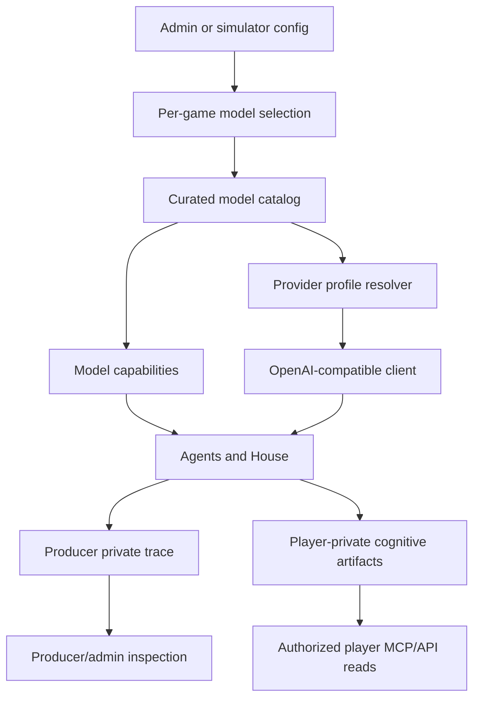
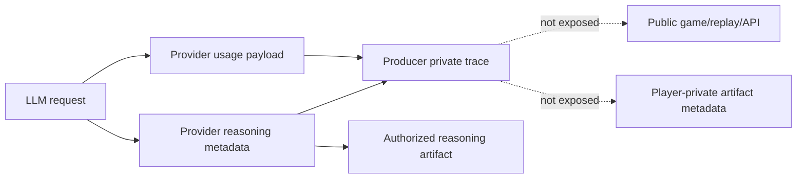

# feat: Add Katana model-router support

## Summary

Add a narrow OpenAI-compatible model-router slice for Influence. The implementation should introduce provider profiles, a curated model catalog, per-game model selection, low/medium/high reasoning support for Katana `grok-4-3`, simulator smoke/evaluation tooling, and producer-private provider observability while preserving the existing OpenAI and LM Studio development lanes.

This plan covers the full brainstorm scope as a staged developer/admin feature. It explicitly defers native xAI, per-agent model selection, broad marketplace browsing, Grok Build, Grok multi-agent endpoint integration, and API-backed simulator rewrites.

## Problem Frame

Influence currently resolves models through a small tier abstraction plus OpenAI-compatible environment variables. That has worked for hosted OpenAI and local LM Studio experiments, but it is too coarse for router-backed models because provider behavior is no longer inferable from the model name alone.

The immediate product need is practical: try Katana/IMGNAI with `grok-4-3`, compare low, medium, and high reasoning, and keep the simulator useful for model-quality work. The implementation must not treat Grok as "non-reasoning" just because the model ID does not look like `gpt-5` or `o*`, and it must not accidentally apply OpenAI-specific request choices such as Responses summaries or `max_completion_tokens` to every reasoning-capable model.

The privacy boundary also gets sharper in this slice. Player-private cognitive artifacts may include an agent's reasoning, thinking, and strategy reflections when authorized, but provider profile, model ID, full prompt request, raw response, requested reasoning effort, observed reasoning metadata, token or usage counts, and router billing fields are producer-private trace data. This plan treats that split as part of the implementation, not a documentation footnote.

## Requirements Trace

The `PR#` identifiers below are plan-local requirements derived from the origin brainstorm plus the confirmed scoping synthesis.

**Provider Profiles and Catalog**

- PR1. Add an OpenAI-compatible provider-profile layer that can represent hosted OpenAI, local LM Studio, Katana, and custom OpenAI-compatible endpoints.
- PR2. The Katana profile uses `https://kat.imgnai.com/v1` and credentials from `API_KAT_IMGNAI_KEY` plus `API_KAT_IMGNAI_SECRET`, combined for OpenAI-compatible bearer auth unless smoke validation proves a different form is required.
- PR3. Keep native xAI out of this implementation; future xAI Responses, Grok Build, and Grok multi-agent support are deferred.
- PR4. Add a curated model catalog with active `grok-4-3` and back-burner records for `grok-4-20-multi-agent`, `q-naifu-a3b`, and `glm-5-2`.
- PR5. Back-burner catalog records are visible to developers as evaluation candidates but are not selectable for games until marked game-ready.
- PR6. Exclude `grok-build-0-1` from the initial catalog.
- PR7. Catalog entries include provider profile, model ID, display name, capabilities, default reasoning policy, evaluation status, and notes.

**Per-Game Selection**

- PR8. Add explicit per-game model selection while preserving `modelTier` compatibility for existing games and default OpenAI tier behavior.
- PR9. Do not add per-agent model selection in this slice.
- PR10. Game creation validates selected catalog entries and refuses non-game-ready entries unless a future explicit developer-only override is added.
- PR11. Join/fill/start paths use the stored per-game selection for player agents and the House; already-created waiting games fall back to the existing tier behavior.
- PR12. Admin/web selection surfaces are curated, not a router marketplace or arbitrary model browser.

**Reasoning Support**

- PR13. Support requested reasoning effort values `low`, `medium`, and `high`; do not offer or store `none` for Influence agents.
- PR14. Preserve the existing action-sensitive reasoning policy as the default behavior while allowing fixed per-game low/medium/high runs for comparison.
- PR15. Replace model-name reasoning heuristics with catalog/provider capabilities so `grok-4-3` can receive reasoning effort even though it is not an OpenAI `gpt-5` or `o*` model.
- PR16. Separate "supports reasoning effort" from OpenAI-specific request behavior such as Responses API summaries, `max_completion_tokens`, temperature support, and tool-call reasoning-effort support.
- PR17. Provider-native reasoning metadata such as Katana `reasoning_content` remains eligible for player-private reasoning artifacts when authorized, but provider envelopes and operational metadata stay producer-private.

**Simulator and Smoke Validation**

- PR18. Simulator model configuration uses the same provider profile, catalog, and reasoning-policy resolution as API-backed games.
- PR19. LM Studio/local OpenAI-compatible workflows keep working without a Katana key or hosted OpenAI key.
- PR20. Add a developer smoke path that checks Katana credentials, balance or account reachability when available, model visibility, a tiny completion, optional reasoning-effort probes, and router billing metadata before long simulations.
- PR21. Smoke and simulation failures are categorized as credential, credit/balance, model unavailable, request-shape/reasoning-field, schema/tooling, rate/timeout, or provider output-quality failures.
- PR22. Evaluation artifacts capture enough provider/model/reasoning context to compare completion, latency, cost/credits, reasoning evidence, and watchability.

**Producer Trace and Privacy**

- PR23. Producer private traces include full prompt messages, raw provider response, provider profile ID, model ID, requested reasoning effort, observed reasoning metadata, token or usage counts, and router billing fields when available.
- PR24. Private trace manifest metadata may include safe operational facets and byte counts, but it must not expose full prompts, raw reasoning, emitted thinking, or provider secrets.
- PR25. Player-private cognitive artifacts expose only authorized reasoning, thinking, and strategy payloads, and do not include provider profile, model ID, full prompts, raw provider response, requested reasoning effort, usage counts, or router billing fields.
- PR26. Remove or neutralize the existing player artifact capture metadata that includes model name, because model ID belongs to producer-private trace data.
- PR27. Public game detail, public transcript, websocket, replay, and canonical-event surfaces do not gain provider profile, model ID, router billing, raw reasoning, or full prompt/request data.
- PR28. Completed-game cost/usage summaries must not silently apply OpenAI fallback pricing to router models; router billing is stored as producer-private evidence unless a later product decision creates a sanitized public cost surface.
- PR29. Malformed, absent, or provider-specific usage and reasoning metadata is captured as producer-private diagnostics without failing otherwise-valid gameplay or leaking partial provider envelopes to player/private public surfaces.

**Docs and Rollout**

- PR30. Update local model evaluation docs, reasoning/transcript observability docs, simulator JSDoc, and relevant developer docs for provider profiles, Katana smoke, reasoning policies, and privacy boundaries.
- PR31. Keep default game creation on current OpenAI tier behavior until a user or admin explicitly selects a router-backed game model.
- PR32. Validate with targeted tests, the repo baseline, Katana smoke when credentials are available, and at least one bounded `grok-4-3` simulation before marking the active catalog record game-ready.

## Key Technical Decisions

- **Add explicit model selection beside tiers:** Keep `modelTier` as a compatibility fallback, but add a per-game model selection object for provider/catalog-backed games. This avoids overloading budget/standard/premium with router-specific state.
- **Use provider capabilities instead of model-name inference:** Move reasoning, tool choice, max-token parameter, temperature, structured-output, and usage-metadata behavior into catalog/profile capabilities. Grok can support reasoning effort without inheriting OpenAI-only request semantics.
- **Keep Katana inside the OpenAI-compatible lane:** Use the existing OpenAI SDK client with a provider profile base URL and credential resolver. Do not add native xAI or a second provider SDK in this slice.
- **Default to action-policy reasoning:** Existing agent actions already choose low, medium, or high based on decision complexity. Keep that as the default and add fixed low/medium/high only for deliberate per-game or simulator comparisons.
- **Make smoke a developer tool:** Katana validation should run before expensive simulations, not during app startup or through a public API route.
- **Keep the catalog curated:** Only game-ready models are selectable. Back-burner records exist so future evaluation has a known home, not so the admin UI becomes a router marketplace.
- **Treat router billing as producer-private evidence:** Katana `usage.imgnai` and similar provider billing fields should be stored with producer traces and local evaluation summaries, not player-private cognitive artifacts or public game payloads.
- **Sanitize player-private capture metadata:** Cognitive artifacts can contain authorized reasoning/strategy, but not model/provider/request/usage metadata. The current `modelName` capture field should be removed or replaced with non-provider product metadata.
- **Avoid fake cost estimates for unknown models:** Unknown/router models should not fall back to OpenAI `gpt-5-nano` pricing in completed game summaries. Use provider-reported billing when available in producer-private data and otherwise mark cost unavailable.

## High-Level Technical Design

The catalog is the policy and capability source. The provider profile supplies endpoint/auth behavior, while the selected model entry supplies model ID, game-readiness, reasoning behavior, and request-shape capabilities.

Provider reasoning text can feed authorized reasoning artifacts, but provider envelopes, model IDs, requested reasoning effort, billing, token usage, and full request/response bodies remain producer-private.

## Implementation Units

### U1. Add Provider Profiles and Curated Model Catalog

- **Goal:** Create a shared catalog/profile layer that can resolve OpenAI, LM Studio, Katana, and custom OpenAI-compatible providers without changing default behavior.
- **Requirements:** PR1-PR7, PR19, PR31.
- **Files:**
  - `packages/engine/src/llm-client.ts`
  - `packages/engine/src/model-catalog.ts`
  - `packages/engine/src/index.ts`
  - `packages/engine/src/__tests__/llm-client.test.ts`
  - `packages/engine/src/__tests__/model-catalog.test.ts`
- **Approach:** Introduce provider profile and catalog entry types, then refactor `createLlmClientFromEnv`, `resolveModelForTier`, and `describeLlmProvider` around those types. Hosted OpenAI and LM Studio should preserve current env behavior. Katana should resolve from `API_KAT_IMGNAI_KEY` and `API_KAT_IMGNAI_SECRET`, use `https://kat.imgnai.com/v1`, and describe itself distinctly from generic OpenAI-compatible providers. Add catalog entries for active `grok-4-3` and disabled/back-burner `grok-4-20-multi-agent`, `q-naifu-a3b`, and `glm-5-2`.
- **Patterns to follow:** Existing `LlmClientConfig`, `resolveToolChoiceMode`, `resolveOpenAIReasoningSummaryMode`, and local-base-URL behavior.
- **Test scenarios:**
  - Given only `OPENAI_API_KEY`, hosted OpenAI defaults and tier models stay unchanged.
  - Given only `INFLUENCE_LLM_BASE_URL` or `LM_STUDIO_BASE_URL`, local LM Studio uses a local dummy key and local tool-choice defaults as today.
  - Given Katana key/secret env vars, the resolver returns the Katana base URL, combined credential source metadata, and Katana provider label without reading OpenAI env vars.
  - Given `grok-4-3`, the catalog reports game-ready status and reasoning efforts low/medium/high.
  - Given back-burner models, the catalog exposes them as evaluation candidates but not selectable game options.
  - Given an unknown catalog key, resolution fails closed instead of silently falling back to a tier.
- **Verification:** Engine unit tests prove the old OpenAI/LM Studio paths are compatible and the new Katana profile is resolvable without native xAI code.

### U2. Make Agent and House Reasoning Capability-Driven

- **Goal:** Route reasoning effort and request-shape behavior through capabilities, not model-name heuristics.
- **Requirements:** PR13-PR17, PR23, PR32.
- **Dependencies:** U1.
- **Files:**
  - `packages/engine/src/agent.ts`
  - `packages/engine/src/house-interviewer.ts`
  - `packages/engine/src/game-runner.types.ts`
  - `packages/engine/src/token-tracker.ts`
  - `packages/engine/src/__tests__/agent-structured-output.test.ts`
  - `packages/engine/src/__tests__/house-interviewer.test.ts`
- **Approach:** Extend agent and House options with resolved model/provider capabilities and reasoning policy. Replace `isReasoningModel`, `usesCompletionTokensParam`, `supportsToolReasoningEffort`, and related model-name checks with capability lookups. Preserve action-level low/medium/high hints and add an override path for fixed per-game reasoning effort. Record the requested effort in the private trace envelope. Extract provider-native `reasoning_content` as observed reasoning metadata without copying provider wrappers into public/player surfaces.
- **Patterns to follow:** Current per-action `reasoningEffort` hints in `InfluenceAgent`, `extractReasoningContext`, `OpenAIReasoningSummaryMode`, and the no `as any` discipline in reasoning observability code.
- **Test scenarios:**
  - Given hosted OpenAI `gpt-5-*`, existing reasoning summary and max-completion-token behavior remains correct.
  - Given Katana `grok-4-3`, chat completions include low/medium/high `reasoning_effort` when policy resolves to a fixed or action-selected effort.
  - Given Katana `grok-4-3`, request construction does not automatically use OpenAI Responses summaries or `max_completion_tokens` unless the catalog says to.
  - Given fixed `high` reasoning policy, a normally low-effort action sends high and the trace records requested high.
  - Given action-policy reasoning, introductions/votes/reflections keep their existing low/medium/high action defaults.
  - Given provider `reasoning_content`, private trace reasoning metadata is populated and player speech stays clean.
- **Verification:** Request-construction tests with fake clients prove Grok reasoning is enabled without inheriting OpenAI-specific request behavior.

### U3. Persist Per-Game Model Selection Through API Game Lifecycle

- **Goal:** Store and use one model selection per game across creation, joining, filling, starting, agent construction, and House construction.
- **Requirements:** PR8-PR12, PR31.
- **Dependencies:** U1, U2.
- **Files:**
  - `packages/api/src/routes/games.ts`
  - `packages/api/src/routes/admin.ts`
  - `packages/api/src/services/game-lifecycle.ts`
  - `packages/api/src/__tests__/games-api.test.ts`
  - `packages/api/src/__tests__/agent-profiles.test.ts`
  - `packages/api/src/__tests__/game-lifecycle.test.ts`
  - `packages/web/src/lib/api.ts`
- **Approach:** Add a validated model-selection payload to game config while keeping `modelTier` as fallback. Creation should reject non-game-ready catalog choices. Join/fill should stamp player `agentConfig` from the resolved game selection, and start-game should resolve the current game selection for both player agents and the House. Existing games with only `modelTier` should keep running. Free/persona helper calls can stay on the budget tier unless the implementation finds they materially affect the selected game model.
- **Patterns to follow:** Existing `modelTier` create/list/detail payloads, `resolveModelForTier` fallback behavior, and the current game-config JSON compatibility style.
- **Test scenarios:**
  - Given no model selection, creating and starting a game uses the existing budget tier default.
  - Given `grok-4-3` and Katana profile, create stores the selection and join/fill players get the resolved model ID.
  - Given a back-burner catalog model, game creation rejects it for normal admin creation.
  - Given a waiting game created before this feature, start-game falls back to `modelTier` without corrupting config.
  - Given selected game model is Katana but provider env is missing at start, the start path returns a provider-not-configured error without mutating game state.
  - Given the House interviewer is constructed, it receives the same model selection and reasoning policy as player agents.
- **Verification:** API tests prove per-game selection is durable and compatibility with tier-only games remains intact.

### U4. Extend Producer Trace and Usage Metadata While Sanitizing Player Artifacts

- **Goal:** Store provider/model/request/usage/billing metadata in producer-private trace lanes and keep it out of player-private artifacts and public game payloads.
- **Requirements:** PR17, PR23-PR29.
- **Dependencies:** U2, U3.
- **Files:**
  - `packages/engine/src/game-runner.types.ts`
  - `packages/engine/src/agent.ts`
  - `packages/engine/src/house-interviewer.ts`
  - `packages/engine/src/token-tracker.ts`
  - `packages/api/src/services/private-trace-writer.ts`
  - `packages/api/src/services/cognitive-artifact-writer.ts`
  - `packages/api/src/services/game-lifecycle.ts`
  - `packages/api/src/__tests__/private-trace-writer.test.ts`
  - `packages/api/src/__tests__/cognitive-artifact-writer.test.ts`
  - `packages/api/src/__tests__/games-api.test.ts`
- **Approach:** Extend `PrivateDecisionTrace` with producer-private provider profile, model ID, requested reasoning effort, observed reasoning metadata, token/usage payload, and router billing fields. Extract OpenAI token usage and Katana/IMGNAI usage fields without assuming they share one schema. Update private trace writer metadata with safe facets and byte counts only. Remove `modelName` from cognitive artifact capture metadata, or replace it with non-provider capture metadata that does not reveal model identity. Prevent router billing or usage payloads from flowing into public game detail or cognitive artifacts. For completed games, avoid OpenAI fallback pricing for router models and store cost as unavailable unless a provider-specific producer-private billing value is available.
- **Patterns to follow:** Existing private trace manifest byte-count metadata, cognitive artifact whitelist extraction, `PrivateDecisionTrace` trace envelope, and `docs/reasoning-transcript-observability.md` private/public separation.
- **Test scenarios:**
  - Given a trace from Katana includes `usage.imgnai`, the raw producer trace stores it and the manifest metadata contains only safe operational facets.
  - Given a trace includes full prompt, raw response, provider profile, model ID, requested reasoning effort, usage, and billing, cognitive artifacts contain none of those fields.
  - Given a cognitive artifact currently would include model name through capture metadata, the new payload omits model identity.
  - Given public game detail serializes token usage, router billing fields and provider usage payloads are absent.
  - Given an unknown/router model completes a game, cost estimation does not fall back to OpenAI `gpt-5-nano` pricing.
  - Given provider reasoning text is present, authorized reasoning artifacts can include the reasoning text but not provider wrapper fields.
  - Given provider usage or reasoning metadata is absent, null, or malformed, gameplay can continue and the trace records a producer-private diagnostic without leaking the malformed envelope.
- **Verification:** Sentinel tests prove provider/request/usage/billing fields stay producer-private and player-private artifacts remain limited to authorized cognitive content.

### U5. Add Simulator Profile Selection and Katana Smoke Tooling

- **Goal:** Let local evaluation run the same provider/model/reasoning configuration as API games and cheaply validate Katana before expensive simulations.
- **Requirements:** PR18-PR22, PR32.
- **Dependencies:** U1, U2, U4.
- **Files:**
  - `packages/engine/src/simulate.ts`
  - `packages/engine/src/provider-smoke.ts`
  - `packages/engine/src/__tests__/simulate-config.test.ts`
  - `packages/engine/src/__tests__/llm-client.test.ts`
  - `packages/engine/package.json`
  - `package.json`
- **Approach:** Extend simulator args to accept provider/catalog selection and reasoning policy in addition to the existing raw `--model` path. Add a smoke script that resolves the provider profile, checks Katana account/model/completion behavior using a tiny prompt, exercises low/medium/high reasoning probes when requested, and prints sanitized usage/billing observations. Smoke output can include credits charged and model availability for producer/developer use, but it must not print secrets. Simulation metadata should record provider profile, model ID, reasoning policy, and sanitized billing/usage summaries in local artifacts for evaluation.
- **Patterns to follow:** Existing simulator metadata, `--reasoning-summary`, `--chatty`, `--rich-producer`, local model evaluation docs, and Bun-only scripts.
- **Test scenarios:**
  - Given no new flags, simulator defaults to existing budget model behavior.
  - Given LM Studio env, simulator still resolves local OpenAI-compatible config and does not require Katana credentials.
  - Given Katana profile and `grok-4-3`, simulator metadata records provider/model/reasoning policy.
  - Given fixed low/medium/high reasoning policy, simulated agent calls receive the fixed effort.
  - Given smoke receives missing credentials, it reports credential failure without attempting long simulation.
  - Given smoke receives a provider response with router billing, it records sanitized billing observations and exits successfully.
  - Given smoke receives a response without expected router billing or reasoning fields, it reports a degraded-observation result rather than treating the provider as fully validated.
- **Verification:** Simulator config tests prove local/OpenAI/Katana paths are resolved consistently, and live smoke can be run under Doppler before Grok simulation work.

### U6. Add Curated Admin/Web Selection Surface

- **Goal:** Let admins create a game with a game-ready catalog model and reasoning policy without exposing a marketplace or arbitrary router browser.
- **Requirements:** PR8-PR15, PR31.
- **Dependencies:** U1, U3.
- **Files:**
  - `packages/api/src/routes/games.ts`
  - `packages/web/src/lib/api.ts`
  - `packages/web/src/app/admin/games/new/create-game-form.tsx`
  - `packages/web/src/__tests__/dashboard-mission-control.test.ts`
  - `packages/web/src/__tests__/match-watch-model.test.ts`
- **Approach:** Add an API-visible curated catalog shape for admin creation, or otherwise share the same catalog data without duplicating stale model labels in the UI. Update the create-game form from tier-only selection to a selection that preserves the current tiers and adds game-ready catalog options. Show back-burner models as disabled evaluation candidates only if that helps developer visibility; otherwise omit them from the normal form and keep them in docs/smoke output. Add a reasoning control with action-policy default plus low/medium/high fixed options. Keep copy focused on model choice, not router marketplace exploration.
- **Patterns to follow:** Existing create-game form state, `CreateGameParams`, and restrained admin UI patterns.
- **Test scenarios:**
  - Given default form state, create game submits current budget-tier behavior.
  - Given `grok-4-3` is selected, create game submits model selection and reasoning policy.
  - Given a disabled/back-burner entry is rendered, it cannot be submitted.
  - Given API catalog and web labels drift, tests catch the mismatch or the UI uses API-provided labels.
  - Given long model names, the form does not overflow on common admin viewports.
- **Verification:** Web/API tests prove the UI submits curated per-game model settings without opening arbitrary model entry.

### U7. Update Docs, Evaluation Criteria, and Rollout Guidance

- **Goal:** Make the new provider/model lane understandable and reproducible for local model work without blurring privacy boundaries.
- **Requirements:** PR22, PR30-PR32.
- **Dependencies:** U1-U6.
- **Files:**
  - `docs/local-model-evaluation.md`
  - `docs/reasoning-transcript-observability.md`
  - `DEVELOPMENT.md`
  - `README.md`
  - `CONCEPTS.md`
  - `packages/engine/src/simulate.ts`
- **Approach:** Document provider profiles, Katana credentials, Katana smoke, simulator model selection, reasoning policy, and the evaluation ladder for low/medium/high. Update reasoning observability docs to distinguish player-private cognitive lanes from producer-private trace data, including full prompts, raw responses, provider/model metadata, usage, and billing. Keep LM Studio examples current. Add a "mark game-ready" checklist that starts with smoke and bounded simulations before broad game creation.
- **Patterns to follow:** Existing local model evaluation criteria, reasoning transcript review checklist, and simulator JSDoc.
- **Test scenarios:**
  - Documentation-only updates are validated by reviewer inspection and by running linked commands when credentials are available.
  - Docs do not claim native xAI support, per-agent model selection, or marketplace/router browsing.
  - Docs clearly say Katana/router billing and full provider request evidence are producer-private.
- **Verification:** A maintainer can follow docs to smoke Katana, run low/medium/high comparisons, and inspect artifacts without leaking provider metadata to player-private or public surfaces.

## Validation Plan

- Run targeted engine tests for provider resolution, catalog status, request construction, reasoning policy, simulator parsing, and token/provider usage extraction.
- Run targeted API tests for game creation, join/fill/start compatibility, private trace writer metadata, cognitive artifact sanitization, completed-game cost handling, and public payload privacy.
- Run targeted web tests for create-game payloads and catalog/reasoning controls if the UI changes are included in the implementation branch.
- Run the repo baseline with `bun run test`; run `bun run check` before merging.
- When Katana credentials are available through Doppler, run the new Katana smoke against `grok-4-3` with low, medium, and high reasoning probes before any long simulation.
- After smoke passes, run at least one bounded 4-player simulator game for each fixed reasoning effort and one richer chatty simulation with the recommended action-policy/default reasoning behavior.
- Review resulting local artifacts for completion, latency, token/credit usage, reasoning evidence, strategy coherence, and watchability before marking `grok-4-3` broadly game-ready.

## Rollout Plan

1. Land provider/catalog plumbing and compatibility tests with default OpenAI tier behavior unchanged.
2. Land capability-driven reasoning and private trace metadata updates behind existing model defaults.
3. Land API per-game selection and admin UI with `grok-4-3` available only when Katana profile resolves.
4. Land simulator smoke/evaluation docs and run Katana smoke under Doppler.
5. Run bounded Grok simulations across low, medium, and high reasoning.
6. Keep back-burner catalog entries disabled until they have their own smoke and game-quality evidence.

## Scope Boundaries

### Deferred to Follow-Up Work

- Native xAI provider support and xAI Responses API integration.
- Grok multi-agent endpoint integration.
- Grok Build integration.
- Per-agent model selection.
- Arbitrary OpenRouter-style model browsing or user-entered router model IDs.
- Bankr, Venice, IMGNAI marketplace switching beyond the Katana OpenAI-compatible profile.
- API-backed simulator architecture changes unless the implementation naturally discovers a very small reuse seam.
- Public cost dashboards or player-facing provider/model metadata.
- Automated model-quality scoring beyond the simulation/evaluation artifacts described here.

### Explicit Non-Goals

- Do not offer `none` as a reasoning effort for Influence agents.
- Do not store provider secrets in traces, manifests, game config, simulator artifacts, or logs.
- Do not expose full prompts, raw provider responses, router billing, token usage payloads, provider profile, or model ID in player-private cognitive artifact payloads.
- Do not make back-burner catalog models selectable for normal games in this slice.
- Do not break existing OpenAI tier defaults or LM Studio local development.

## Research Notes

- Katana docs: [llms.txt](https://kat.imgnai.com/llms.txt).
- The current engine resolves `budget`, `standard`, and `premium` tiers in `llm-client.ts` and uses OpenAI-compatible env vars for LM Studio.
- The current agent already carries action-level reasoning effort hints, but the final request path gates them through model-name heuristics.
- Current private traces store prompts and raw responses, while cognitive artifacts whitelist reasoning/thinking/strategy. Cognitive artifact capture currently includes model name in capture metadata, which this plan treats as a privacy correction.
- Current public game detail can include token usage from completed game results; router billing and provider usage must not expand that public surface.
