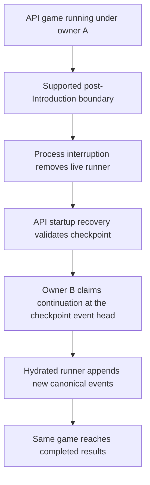
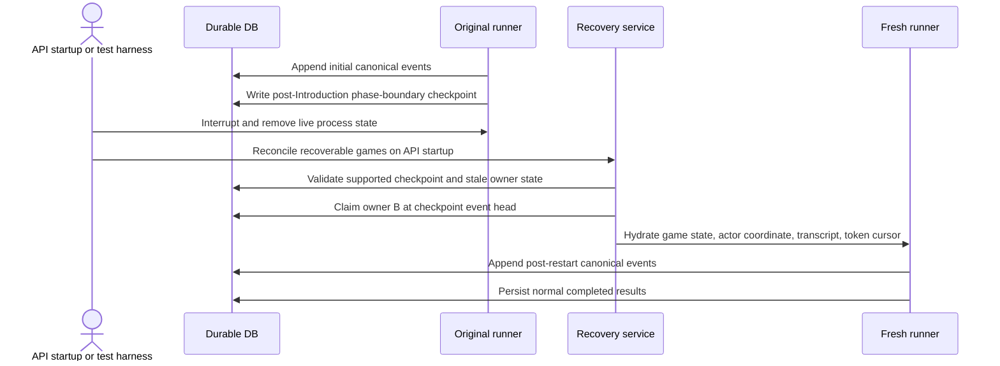

# One-Boundary Resume To Completion - Plan

## Goal Capsule

| Field | Value |
|---|---|
| Objective | Given a real API-backed game reaches one supported phase-boundary checkpoint, an interrupted API process can be replaced by startup recovery that resumes the same game, appends post-restart canonical events, and reaches completed results. |
| Product authority | The resiliency track in `STRATEGY.md`, the explicit risk language in `AGENTS.md`, and the impact bar in `docs/ideation/2026-06-29-backend-durability-scalability-ideation.html`. |
| Execution profile | Backend code work in the API and engine runtime paths. |
| Open blockers | None. The first supported boundary is the post-Introduction / pre-Round-1 Lobby checkpoint. |

---

## Product Contract

### Summary

Ship the first real resume behavior for API-backed games: one whitelisted phase-boundary checkpoint can be recovered by a fresh API process on startup and driven to normal completed results under the same game ID. The slice is done when the game outcome changes after interruption, not when another readiness proof passes.

### Problem Frame

Influence already has durable owner epochs, canonical API events, phase-boundary checkpoints, Runtime Snapshot v1, hydration passports, private evidence manifests, and durable inspection. Those pieces make interrupted runs inspectable, but they do not yet let a game continue.

The current failure mode is still player-visible product loss. If the API process dies during an active game, the live runner is gone, startup marks old runs as suspended, and durable inspection honestly says `resumeAvailable: false`. A next slice that only creates more proof vocabulary would not improve the game for the user or their friends.

The current deployment reality is a single API container and a separate web process. V1 should use that reality: the API process can act as the recovery worker on startup when recovery is enabled. Later worker fleets, spot compute, and cross-process coordination can reuse the same service once the single-container recovery path is real.

### Key Decisions

- **Completed-game outcome is the bar.** The deliverable is the same game reaching completed results after restart, with post-restart canonical events proving continuation.
- **One supported boundary beats general crash recovery.** V1 supports exactly one phase-boundary class and rejects everything else.
- **The first boundary is post-Introduction / pre-Round-1 Lobby.** Players have seen introductions, but the resumed process still owns starting Round 1 and producing post-restart canonical events.
- **Startup recovery beats manual restore.** V1 lets the API process act as its own recovery worker on startup when configured; a manual/admin trigger is only an optional backstop.
- **The acceptance test interrupts the game.** The proof path must include a real API-backed run that crosses the boundary, loses the live runner, recovers fresh, and completes.

### Actors

- A1. **Player or viewer:** Expects the same public game to finish and produce normal results.
- A2. **API startup recovery coordinator:** Finds eligible interrupted games and triggers the first supported recovery path when configured.
- A3. **Fresh API process:** Claims recoverable work, hydrates supported runtime state, and appends new events.
- A4. **Stale owner context:** May still exist in durable rows from the old API process but must not be able to append events or complete the game.
- A5. **Durable game system:** Owns canonical events, checkpoints, owner epochs, watch state, and completed results.

### Key Flow



- F1. **Supported interruption recovery**
  - **Trigger:** A real API-backed game has reached the selected supported checkpoint, the original runner is gone, and the API process starts with recovery enabled.
  - **Actors:** A2, A3, A5.
  - **Steps:** Validate the latest supported checkpoint, claim fresh ownership, hydrate enough runtime state to continue, and run forward.
  - **Outcome:** The same game ID appends post-restart canonical events and reaches completed results.

- F2. **Unsupported interruption rejection**
  - **Trigger:** Startup recovery evaluates a game whose latest checkpoint is missing, stale, unsupported, or no longer safe.
  - **Actors:** A2, A3, A5.
  - **Steps:** Evaluate the checkpoint boundary, reject continuation, and preserve the game for inspection.
  - **Outcome:** The system does not invent partial recovery or mark the game completed.

- F3. **Stale owner fencing**
  - **Trigger:** An older owner attempts to append events or complete the game after a fresh recovery owner exists.
  - **Actors:** A4, A5.
  - **Steps:** Owner checks reject stale writes before canonical event append or terminal persistence.
  - **Outcome:** The durable event stream remains single-writer and contiguous.

### Requirements

**Game outcome**

- R1. The recovered run must continue the original API game ID rather than creating a replacement game or replay-only copy.
- R2. The recovered run must append canonical events after the checkpoint boundary with contiguous event sequence.
- R3. The recovered run must reach the same normal completion path that writes completed results and refreshes watch state.
- R4. Watch and results surfaces must identify one game, not a pre-restart run and a post-restart run.
- R5. V1 must not require new player-facing recovery copy or viewer UX to count as successful.

**Supported boundary**

- R6. V1 must whitelist exactly one phase-boundary checkpoint class before execution.
- R7. The supported checkpoint must prove durable event flush completion, projection agreement, owner binding, transcript/token cursor readiness, and drained or empty phase accumulators.
- R8. Unsupported checkpoints must fail closed without attempting best-effort continuation.
- R9. Mid-phase interruption, in-flight model calls, arbitrary phase recovery, and historical game repair remain out of scope.

**Recovery operation**

- R10. V1 recovery must run from an API startup recovery coordinator when configured, not require a human to manually restore each interrupted game.
- R11. A fresh recovery owner must be able to claim a recoverable interrupted game without letting the stale owner continue.
- R12. The recovery path must leave unsupported or failed recovery attempts inspectable as suspended work.
- R13. The recovery path must not clear operational memory or private continuity inputs needed for the supported resume attempt before the attempt runs.

**Runtime continuation**

- R14. The recovered runner must restore enough game, phase, agent, House, transcript, token, and checkpoint cursor state to continue from the supported boundary.
- R15. Runtime restoration must treat canonical events and validated checkpoint payloads as resume inputs, not raw private evidence or public transcript prose as game-state truth.
- R16. The first continuation path may be narrow and purpose-built, but it must execute the game forward after restart.

**Verification**

- R17. Automated coverage must include a DB-backed API game that reaches the supported checkpoint, loses the live runner, recovers through the fresh path, and completes.
- R18. The restart proof must assert post-restart canonical events, completed game results, and unchanged game identity.
- R19. The proof may use deterministic agents for reliability, but it must exercise the durable API event/checkpoint/owner path.
- R20. Existing hydration-candidate tests should become supporting evidence, not the headline success condition.

### Acceptance Examples

- AE1. **Covers R1-R4, R10-R12, R17-R19.** Given an API-backed game reaches the supported checkpoint and the process is interrupted, when the API starts with recovery enabled, then the same game appends later canonical events and reaches completed results.
- AE2. **Covers R6-R9, R12.** Given a game has no supported checkpoint, when startup recovery evaluates it, then the game remains suspended or inspectable and no continuation owner is allowed to append events.
- AE3. **Covers R11, R18.** Given a stale owner tries to commit after recovery ownership is claimed, when it appends or completes, then owner fencing rejects the write and the canonical sequence remains contiguous.
- AE4. **Covers R5, R14-R16.** Given recovery succeeds, when a viewer or results reader opens the game, then the public surface shows a completed game without requiring new recovery explanatory UI.

### Success Criteria

- A local DB-backed restart smoke proves same-game completion after the supported interruption.
- Durable inspection can show a pre-restart checkpoint boundary and post-restart event head for the same game.
- Completed results exist through the existing completion path, not a special recovery-only materializer.
- The unsupported path is honest and fail-closed.

### Scope Boundaries

- In scope: one supported phase-boundary recovery path, API startup recovery when configured, fresh owner claim, minimal runtime hydration, post-restart event append, completed results, and a kill/restart smoke harness.
- Deferred: deploy drain automation, broader boundary coverage, model-backed soak runs, multi-worker coordination, and spot/serverless orchestration.
- Out of scope: mid-phase recovery, in-flight LLM call recovery, arbitrary event redrive, terminal-only result repair, replay-only reconstruction, and new viewer UX copy.

### Dependencies / Assumptions

- The existing durable game-run kernel remains the source of canonical event and owner truth.
- Runtime Snapshot v1 and hydration passport evidence remain the checkpoint readiness foundation, but resume support has a stricter selector than `hydration_candidate`.
- The first smoke can use deterministic test agents while still exercising the real durable API path.
- The supported boundary may add a sanitized checkpoint transcript replay payload. That payload is for runtime context continuity only; canonical events and projection replay remain game-state truth.

### Resolved Planning Inputs

- The first supported recovery target is the phase boundary immediately after Introduction has completed and the actor is ready to run Lobby.
- The boundary is identified by a `phase_boundary` checkpoint whose runtime actor witness coordinate is `lobby`, whose canonical event head is before the first `round.started` event, and whose checkpoint evidence is otherwise resume-safe.
- Existing Product Contract requirement, actor, flow, and acceptance IDs are preserved; planning resolved only the first boundary class and implementation shape.

### Sources / Research

- `STRATEGY.md`
- `AGENTS.md`
- `CONCEPTS.md`
- `docs/ideation/2026-06-29-backend-durability-scalability-ideation.html`
- `docs/statefulness-plan.md`
- `docs/refactor-queue.md`
- `docs/solutions/architecture-patterns/agent-strategy-observability-spine.md`
- `README.md`
- `packages/engine/src/game-runner.ts`
- `packages/engine/src/game-state.ts`
- `packages/engine/src/game-projection.ts`
- `packages/engine/src/phase-machine.ts`
- `packages/engine/src/phases/introduction.ts`
- `packages/engine/src/phases/lobby.ts`
- `packages/engine/src/transcript-logger.ts`
- `packages/engine/src/token-tracker.ts`
- `packages/api/src/services/game-lifecycle.ts`
- `packages/api/src/services/game-ownership.ts`
- `packages/api/src/services/game-events.ts`
- `packages/api/src/services/game-checkpoints.ts`
- `packages/api/src/services/game-durable-run.ts`
- `packages/api/src/db/schema.ts`
- `packages/api/src/__tests__/checkpoint-hydration-passport.test.ts`
- `packages/api/src/__tests__/game-durable-run.test.ts`

---

## Planning Contract

### Product Contract Preservation

The Product Contract remains the authority for scope and success. Planning preserved R1-R20, A1-A5, F1-F3, and AE1-AE4; the only resolved planning decision is the first supported boundary and the minimum implementation shape needed to prove it.

### Plan Depth

Deep. The slice crosses engine state, durable checkpoints, owner fencing, API startup lifecycle, recovery coordination, and DB-backed integration tests.

### Key Technical Decisions

- KTD1. **State truth stays canonical.** Recovered mutable runtime is built from canonical events plus validated checkpoint payloads; private evidence and transcript prose are never used to infer canonical game state.
- KTD2. **Resume support is stricter than hydration candidacy.** A checkpoint can remain a `hydration_candidate` while still not being supported for resume. `resumeAvailable` turns true only when the one-boundary selector and recovery path exist.
- KTD3. **The supported boundary is actor coordinate `lobby`.** The boundary is after Introduction completion and before Lobby mutates game state with `round.started`.
- KTD4. **Transcript continuity is checkpoint payload, not state truth.** The supported checkpoint must carry enough sanitized player-visible transcript entries to seed `TranscriptLogger` for future agent context and final transcript persistence.
- KTD5. **Recovery ownership starts at the checkpoint event head.** The fresh owner row must begin with `lastPersistedEventSequence` equal to the selected checkpoint boundary so the next append is contiguous.
- KTD6. **Recovery reuses the existing completion path.** The resumed runner must finish through `persistCompletedGame`, watch-state refresh, owner close, and normal results persistence.
- KTD7. **The API process is the first worker.** V1 adds a startup recovery coordinator in the API process when configured; manual/admin recovery is optional operator backstop, not the acceptance path.
- KTD8. **Deterministic agents are acceptable for the first proof.** The API smoke must use the real durable owner/event/checkpoint path, but it may use the test mock runner for stable completion.

### High-Level Technical Design



### Boundary Definition

The supported boundary is the phase boundary whose actor witness says the next runnable coordinate is `lobby`. For a fresh game this is after Introduction has produced public transcript entries and before Lobby calls `startRound()`. The next canonical event emitted by a correct resumed runner should be the first post-restart Lobby event, not a duplicate roster or introduction replay.

Selector requirements:

- Latest usable checkpoint has `checkpointKind = phase_boundary`.
- Hydration passport remains positive enough to prove event prefix, projection agreement, owner binding, runtime snapshot, transcript cursor, token cursor, and drained accumulators.
- Runtime actor witness coordinate is exactly `lobby`; other actor coordinates are unsupported for V1 even if they look hydrateable.
- Boundary canonical event head is trusted, and no newer canonical event invalidates the checkpoint as the continuation point.
- Checkpoint snapshot includes a sanitized transcript replay payload sufficient to seed pre-boundary public/system transcript context for resumed phases.
- Game status and owner rows allow a startup recovery claim, with no active in-memory runner for the same game.

### Runtime Hydration Shape

The recovered runtime needs only the fields required to continue from this one boundary:

- `GameState` restored by replaying canonical events through the checkpoint boundary.
- Phase actor restored or initialized at the `lobby` coordinate, with alive player IDs from the runtime witness.
- `TranscriptLogger` seeded with sanitized pre-boundary transcript entries so Lobby and later phases see Introduction context and completion persists one coherent transcript.
- `TokenTracker` seeded from the token cursor so completion cost accounting does not reset silently.
- Checkpoint cursor fields seeded so resumed checkpoints and events continue after the boundary and do not rewrite prior checkpoint keys.
- Agents reconstructed from game-player rows, bound with `onGameStart`, and optionally restored from player continuity capsules when an implementation supports it. Missing optional continuity must not block the deterministic first proof unless the supported checkpoint declares required non-empty continuity.
- House continuity restored from the checkpoint capsule only when House strategy features are enabled.

### Owner and Status Shape

The existing `acquireGameRunOwner` path only starts waiting games at event sequence zero. Recovery needs a separate claim path that:

- Locks the game and latest checkpoint in one transaction.
- Requires the game to be suspended, startup-orphaned, or otherwise explicitly marked recoverable by the startup reconciliation path.
- Inserts a new active owner epoch with `lastPersistedEventSequence` set to the checkpoint boundary.
- Keeps stale owners closed, expired, or revoked so stale appends fail through the existing owner checks.
- Moves the game back to `in_progress` for the resumed run and lets normal completion set `completed`.
- Leaves failed or unsupported attempts suspended and inspectable.

### Assumptions

- The first implementation can add fields inside existing checkpoint JSON payloads without a schema migration, because `game_checkpoints.snapshot`, `transcript_cursor`, and `token_cost_cursor` already accept structured payloads.
- The deterministic API mock runner is enough for the headline proof because it still exercises the durable owner/event/checkpoint/write path.
- Model-backed continuation after this boundary is likely close behind, but it should not expand this slice unless the deterministic proof cannot be built without the same hook.
- A manual/admin recovery route is optional. If added, it must be a backstop around the same recovery service and require a state-changing admin/game-control permission rather than read-only inspection permission.

### Risks and Mitigations

- **Risk: transcript count is mistaken for transcript state.** Mitigation: require sanitized transcript replay payload for the supported boundary and test that recovered completion includes pre-boundary Introduction entries once.
- **Risk: fresh owner starts at sequence zero.** Mitigation: recovery owner claim seeds `lastPersistedEventSequence` to the checkpoint boundary and has stale-owner tests.
- **Risk: runner starts from `init` and replays Introduction.** Mitigation: engine tests assert no duplicate Introduction transcript and the first new canonical event is post-boundary.
- **Risk: `resumeAvailable` becomes marketing before implementation.** Mitigation: durable inspection exposes availability only through the supported selector after recovery code exists.
- **Risk: recovery clears memory needed for retry.** Mitigation: unsupported or failed recovery leaves game suspended; memory cleanup remains tied to normal terminal paths.

---

## Implementation Units

### U1. Define the Supported Recovery Boundary

**Goal:** Add the one-boundary selector and checkpoint payload contract that can say "this checkpoint is recoverable now" or fail closed with a diagnostic.

**Requirements:** R6-R8, R10, R12, R15, R20; supports AE2.

**Primary files:**

- `packages/engine/src/game-runner.types.ts`
- `packages/engine/src/game-runner.ts`
- `packages/api/src/services/game-recovery.ts` (new)
- `packages/api/src/services/game-durable-run.ts`
- `packages/api/src/__tests__/game-recovery.test.ts`
- `packages/api/src/__tests__/checkpoint-hydration-passport.test.ts`

**Work:**

- Define a versioned supported-boundary descriptor for `post_intro_pre_lobby`.
- Extend phase-boundary checkpoints with sanitized transcript replay payload for public/system context needed after restart. Keep thinking, reasoningContext, raw prompts, raw responses, and private evidence out of this payload.
- Add a selector that loads persisted events, projection status, latest checkpoint, runtime snapshot, transcript/token cursors, and owner state.
- Accept only the `lobby` actor coordinate before `round.started`; reject all other coordinates for V1.
- Keep hydration passport semantics intact: `hydration_candidate` remains evidence readiness, while the new selector decides actual resume support.

**Tests:**

- `packages/api/src/__tests__/game-recovery.test.ts` accepts a checkpoint with actor coordinate `lobby`, valid boundary identity, drained accumulators, trusted event prefix, and sanitized transcript payload.
- `packages/api/src/__tests__/game-recovery.test.ts` rejects checkpoints with a non-`lobby` actor coordinate, missing transcript replay payload, invalid projection/event boundary, missing runtime snapshot, or active conflicting owner.
- `packages/api/src/__tests__/checkpoint-hydration-passport.test.ts` keeps existing hydration-candidate behavior and proves resume support is not implied by passport verdict alone.

### U2. Add Engine Resume From the Supported Boundary

**Goal:** Let the engine construct a fresh runner that continues from the supported checkpoint without rerunning Introduction or rewriting existing canonical events.

**Requirements:** R1, R2, R7, R14-R16, R18; supports AE1 and AE4.

**Primary files:**

- `packages/engine/src/game-runner.ts`
- `packages/engine/src/game-runner.types.ts`
- `packages/engine/src/game-state.ts`
- `packages/engine/src/game-projection.ts`
- `packages/engine/src/transcript-logger.ts`
- `packages/engine/src/token-tracker.ts`
- `packages/engine/src/__tests__/game-runner-resume.test.ts` (new)
- `packages/engine/src/__tests__/canonical-event-replay.test.ts`

**Work:**

- Add a narrow resume input type for the supported boundary: canonical events through the boundary, checkpoint capsule, sanitized transcript replay payload, token cursor, player rows, config, and fresh agent instances.
- Add or expose a structured `GameState` hydration path that replays canonical events through the boundary and restores mutable state without string parsing.
- Add `TranscriptLogger` seeding so recovered phases see pre-boundary public/system transcript entries and the final completed transcript remains coherent.
- Add `TokenTracker` seeding from the checkpoint token cursor.
- Add a runner construction path that starts at `lobby`, seeds `flushedCanonicalSequence`, avoids duplicate checkpoint writes for prior boundaries, and calls `onGameStart` for fresh agents without running Introduction again.
- Add optional agent/House continuity restore hooks only where checkpoint capsules provide supported data; fail closed if a capsule is declared required but cannot be applied.

**Tests:**

- `packages/engine/src/__tests__/game-runner-resume.test.ts` resumes from a post-Introduction checkpoint and verifies Introduction is not rerun.
- `packages/engine/src/__tests__/game-runner-resume.test.ts` verifies the first new canonical event sequence is checkpoint head plus one and belongs to the post-boundary Lobby path.
- `packages/engine/src/__tests__/game-runner-resume.test.ts` verifies the resumed runner reaches terminal game results with one game ID.
- `packages/engine/src/__tests__/canonical-event-replay.test.ts` covers the replay/hydration helper enough to prevent projection drift.

### U3. Add Recovery Owner Claim and Stale-Writer Fencing

**Goal:** Give the API a transactionally safe way to claim recoverable suspended work from the checkpoint event head while preserving existing stale-owner rejection.

**Requirements:** R2, R10-R13, R18; supports AE2 and AE3.

**Primary files:**

- `packages/api/src/services/game-ownership.ts`
- `packages/api/src/services/game-events.ts`
- `packages/api/src/services/game-checkpoints.ts`
- `packages/api/src/services/game-recovery.ts`
- `packages/api/src/__tests__/game-recovery.test.ts`
- `packages/api/src/__tests__/game-durable-run.test.ts`

**Work:**

- Add a recovery-specific owner claim function rather than extending the waiting-game start claim.
- Lock the game, latest supported checkpoint, and owner rows during recovery claim.
- Insert a fresh active owner with `lastPersistedEventSequence` equal to the checkpoint boundary.
- Move the game back to `in_progress` and clear recovery-only terminal fields that would block normal completion.
- Preserve stale owner rows as closed, expired, or revoked so existing append and completion checks reject them.
- Ensure failed recovery claim attempts leave the game suspended and inspectable.

**Tests:**

- `packages/api/src/__tests__/game-recovery.test.ts` proves a recovery owner can append the next contiguous event after the boundary.
- `packages/api/src/__tests__/game-recovery.test.ts` proves the stale owner cannot append after the fresh owner exists.
- `packages/api/src/__tests__/game-recovery.test.ts` proves recovery claim rejects unsupported checkpoints without changing the game to completed.
- `packages/api/src/__tests__/game-durable-run.test.ts` keeps durable inspection coherent across old owner, new owner, and event head summaries.

### U4. Wire API Startup Recovery Execution

**Goal:** Add the API startup recovery coordinator that validates, claims, hydrates, starts the recovered runner, and lets existing lifecycle completion finish the game when recovery is configured.

**Requirements:** R1-R5, R10-R16, R18; supports AE1 and AE4.

**Primary files:**

- `packages/api/src/services/game-lifecycle.ts`
- `packages/api/src/services/game-recovery.ts`
- `packages/api/src/services/game-watch-state.ts`
- `packages/api/src/services/game-watch-state-summary.ts`
- `packages/api/src/__tests__/game-recovery.test.ts`
- `packages/api/src/__tests__/game-lifecycle.test.ts`

**Work:**

- Add a `recoverGame` service path parallel to `startGame`, but backed by the recovery selector and recovery owner claim.
- Add an API startup coordinator that scans for eligible suspended/startup-orphaned games when recovery is enabled and invokes the recovery service.
- Reuse the existing player loading, deterministic test-agent construction, model-backed agent construction, private trace sink, durable event sink, durable checkpoint sink, owner heartbeat, WebSocket pacing, and completion path where possible.
- Keep any manual/admin trigger optional and secondary; if added, it must call the same service and require state-changing admin/game-control permission.
- Ensure `activeGames` blocks double recovery while a recovered runner is active.
- Ensure normal completion writes game results, transcripts, owner close, and watch-state refresh through the existing code path.

**Tests:**

- `packages/api/src/__tests__/game-recovery.test.ts` exercises the startup coordinator path with deterministic API agents.
- `packages/api/src/__tests__/game-recovery.test.ts` proves a second coordinator pass does not double-start a recovered or completed game.
- `packages/api/src/__tests__/game-lifecycle.test.ts` covers any lifecycle helper changes needed for resumed completion and memory cleanup.

### U5. Make the Restart Smoke the Headline Proof

**Goal:** Add the DB-backed test that actually interrupts the original process context, recovers through a fresh path, appends post-restart canonical events, and completes the same game.

**Requirements:** R1-R4, R11, R17-R20; supports AE1-AE4.

**Primary files:**

- `packages/api/src/__tests__/game-recovery.test.ts`
- `packages/api/src/__tests__/test-utils.ts`
- `packages/api/src/services/game-lifecycle.ts`
- `packages/api/src/services/game-durable-run.ts`
- `packages/api/src/services/game-recovery.ts`

**Work:**

- Create a test harness that starts an owner-backed API game with deterministic agents and interrupts after the supported boundary checkpoint is persisted.
- Simulate process replacement without using the admin-stop abort path: persist the supported checkpoint, drop original live runner state, mark the original owner/game recoverable through the suspended or startup-orphaned path, and run the startup coordinator with fresh agents/runner state from durable inputs.
- Run startup recovery and wait for normal completion.
- Assert post-restart canonical events belong to the new owner epoch and start after the checkpoint event head.
- Assert the game ID is unchanged, status is `completed`, results rows exist, watch state refreshes, and completed transcripts include pre-boundary and post-boundary entries once.

**Tests:**

- `packages/api/src/__tests__/game-recovery.test.ts` contains the primary same-game resume-to-completion smoke.
- The smoke asserts at least one post-restart event was appended by the recovery owner.
- The smoke asserts no duplicate Introduction transcript entries and no duplicate initial canonical event.
- The smoke asserts unsupported recovery remains suspended or inspectable, not completed.

### U6. Expose Honest Resume Availability and Update Docs

**Goal:** Make durable inspection reflect the working recovery capability and document the exact supported boundary without implying broader crash safety.

**Requirements:** R4-R10, R12, R20; supports AE2 and AE4.

**Primary files:**

- `packages/api/src/services/game-durable-run.ts`
- `docs/statefulness-plan.md`
- `docs/refactor-queue.md`
- `README.md`
- `CONCEPTS.md`
- `packages/api/src/__tests__/game-durable-run.test.ts`
- `packages/api/src/__tests__/game-recovery.test.ts`

**Work:**

- Change durable inspection `resumeAvailable` from hardcoded `false` to the recovery selector result after U1-U5 are in place.
- Include operator diagnostics for unsupported recovery without exposing private continuity payloads.
- Update docs to say exactly one boundary is supported: post-Introduction / pre-Round-1 Lobby.
- Keep docs explicit that mid-phase, in-flight model call, multi-worker fleet recovery, and arbitrary boundary recovery are still unsupported.

**Tests:**

- `packages/api/src/__tests__/game-durable-run.test.ts` proves `resumeAvailable` is true only for the supported boundary and false for hydration candidates that are not supported.
- `packages/api/src/__tests__/game-recovery.test.ts` proves unsupported recovery diagnostics are useful without leaking private strategy packets or raw reasoning.

---

## Verification Contract

### Primary Proof

The headline verification is the DB-backed same-game resume smoke in `packages/api/src/__tests__/game-recovery.test.ts`.

It must prove:

- A real API-backed owner run reaches the post-Introduction / pre-Round-1 Lobby checkpoint.
- The original live runner/API process context is interrupted and cannot continue.
- API startup recovery claims a new owner epoch at the checkpoint event head.
- The recovered runner appends canonical events after the checkpoint boundary.
- The same game reaches normal completed results through the existing completion path.
- Unsupported checkpoints remain fail-closed and inspectable.

### Commands

Run these during implementation before handoff:

```sh
cd packages/engine && bun test src/__tests__/game-runner-resume.test.ts
```

```sh
cd packages/api && DRIZZLE_MIGRATIONS_DIR=./drizzle bun test src/__tests__/game-recovery.test.ts
```

```sh
cd packages/api && DRIZZLE_MIGRATIONS_DIR=./drizzle bun test src/__tests__/checkpoint-hydration-passport.test.ts src/__tests__/game-durable-run.test.ts src/__tests__/game-lifecycle.test.ts
```

```sh
bun run test
```

```sh
bun run check
```

### Validation Notes

- DB-backed API tests expect local Postgres at `127.0.0.1:54320`.
- If sandboxed DB tests report connection refusal, rerun with the repo's normal elevated local access before concluding the database is unavailable.
- Do not substitute a pure engine test for the headline proof. Engine tests are necessary, but the acceptance proof must exercise API owners, durable event append, checkpoint persistence, recovery claim, and completed results.

---

## Definition of Done

- A supported post-Introduction / pre-Round-1 Lobby checkpoint can be selected by code, not by test-only knowledge.
- API startup recovery can discover an eligible interrupted game when recovery is configured.
- A fresh API recovery owner can claim the same game at the checkpoint event head.
- A recovered `GameRunner` can start from the supported boundary without rerunning Introduction.
- Post-restart canonical events append contiguously under the recovery owner.
- The same game reaches `completed` through the existing result persistence and watch-state refresh path.
- Stale owners cannot append events or complete the game after recovery ownership exists.
- Unsupported checkpoints fail closed and remain inspectable.
- Durable inspection reports `resumeAvailable` only for the implemented supported path.
- No player-facing recovery UX or explanatory copy is required for success.
- Docs name the exact supported boundary and continue to warn that general crash-safe active games are not done yet.
- The Verification Contract commands pass, or any failures are documented with concrete blocker details.
