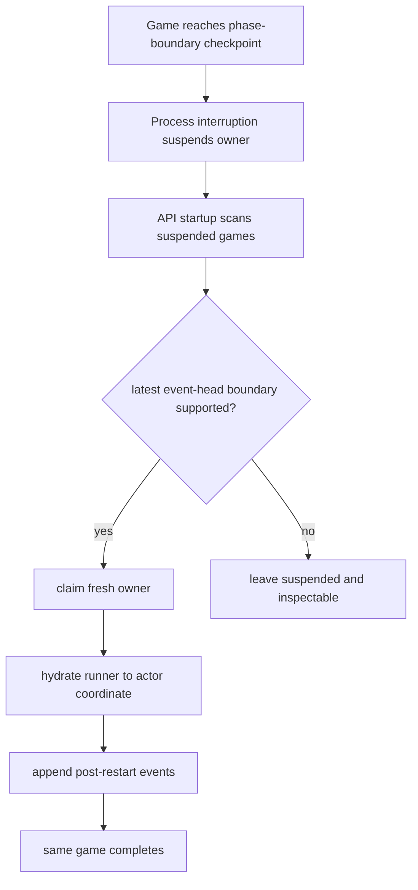
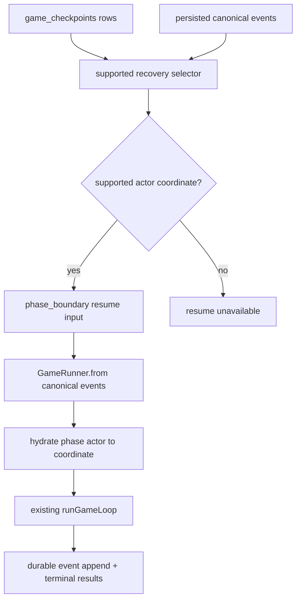

# Generic Phase-Boundary Recovery - Plan

## Goal Capsule

| Field | Value |
|---|---|
| Objective | Given an API-backed game reaches a supported completed phase-boundary checkpoint, an interrupted API process can be replaced by startup recovery that resumes the same game, appends post-restart canonical events, and reaches completed results. |
| Product authority | The resiliency track in `STRATEGY.md`, the statefulness risk in `AGENTS.md`, and the implementation recut in `docs/ideation/2026-06-29-backend-durability-scalability-ideation.html`. |
| Execution profile | Backend engine/API code work with DB-backed recovery tests. |
| Open blockers | None. V1 supports the pre-round lobby checkpoint and persisted normal-round phase actor coordinates through reveal; unsupported endgame or accumulator-heavy boundaries fail closed. |

---

## Product Contract

### Summary

Expand startup recovery from one post-Introduction checkpoint to persisted normal-round completed phase boundaries through reveal. The slice is done when a game interrupted after several real phase boundaries resumes on API startup and completes under the original game ID.

### Problem Frame

The previous recovery slice made the startup worker path real, but it only supports the earliest lobby checkpoint before any `round.started` event exists. That is too narrow to materially reduce real restart risk.

Most process interruptions will happen during or after a normal round. Influence already writes phase-boundary checkpoints after durable event flushes, including runtime snapshots, transcript replay, token cursors, and owner-bound event heads. The missing product behavior is widening execution support so those checkpoints can be used to continue the game.

### Key Decisions

- **Persisted normal-round boundaries are the first generic surface.** V1 supports the phase actor coordinates the runner actually persists with a new event head: pre-round `lobby`, then `vote`, `mingle`, `power`, and `reveal`.
- **The latest event-head checkpoint gates recovery.** Recovery should use the newest phase-boundary checkpoint at the durable event head when it is implemented-safe; it must not fall back to an older event head and ignore already-committed events.
- **Runner hydration is an engine contract.** The API selector can widen only after `GameRunner` accepts a phase-boundary resume input and hydrates the phase actor to the target coordinate.
- **Startup remains the worker in current deployments.** The API process should recover eligible games on startup when `INFLUENCE_API_STARTUP_RECOVERY=true`; no admin-controlled restore path is required for V1.
- **Unsupported boundaries stay inspectable.** A bad or unsupported checkpoint must not loop forever, append events, or mark a game completed.

### Actors

- A1. **Player or viewer:** Expects the same game URL to finish normally after a backend restart.
- A2. **API startup recovery coordinator:** Finds suspended games and attempts automatic recovery when configured.
- A3. **Recovered runner:** Hydrates from canonical events plus checkpoint payload and continues phase execution.
- A4. **Durable game system:** Owns owner epochs, canonical events, checkpoints, watch summaries, and completed results.
- A5. **Unsupported checkpoint:** Remains suspended and inspectable instead of receiving best-effort replay.

### Key Flow

### Requirements

**Game outcome**

- R1. A recovered game must continue the original API game ID and durable event stream.
- R2. Recovery must append post-restart canonical events contiguously after the selected checkpoint event head.
- R3. Recovery must reach the existing completed-results path without a recovery-only materializer.
- R4. Watch and results surfaces must show one completed game, not a replacement run.

**Supported boundary**

- R5. Recovery must evaluate the newest phase-boundary checkpoint and resume only when that checkpoint is implemented-safe and at the durable event head.
- R6. V1 must support the original pre-round `lobby` checkpoint plus persisted normal-round phase actor coordinates `vote`, `mingle`, `power`, and `reveal`.
- R7. V1 must not claim support for no-new-event boundaries such as reveal-to-council unless checkpoint storage can persist a distinct checkpoint at the same event head.
- R8. Endgame coordinates, malformed snapshots, stale event heads, missing transcript replay, missing token cursor, or blocked accumulators must fail closed.
- R9. Recovery support must not depend on public transcript prose or private evidence blobs as game-state truth.

**Recovery operation**

- R10. Startup recovery must be automatic when enabled and must not require an admin to manually resume each interrupted game.
- R11. Recovery must claim a fresh owner before post-restart events append.
- R12. A failed or unsupported recovery attempt must leave the game suspended and inspectable.
- R13. Durable inspection `resumeAvailable` must use the same implemented-support predicate as startup recovery.

**Runtime continuation**

- R14. `GameRunner` must accept a generic phase-boundary resume input with target actor coordinate, canonical event prefix, transcript replay, token cursor, and House continuity.
- R15. Runner hydration must position the phase actor at the next phase to run without re-running already completed phase logic.
- R16. The recovered runner must preserve checkpoint/event cursors so duplicate checkpoint writes do not masquerade as new progress.

**Verification**

- R17. DB-backed tests must interrupt real API durable runs at multiple supported normal-round boundaries and recover them through the fresh path.
- R18. Tests must assert unchanged game identity, post-restart event append, completed results, and `resumeAvailable` truth for supported checkpoints.
- R19. Tests must assert unsupported boundaries fail closed without appending events.

### Acceptance Examples

- AE1. **Covers R1-R4, R10-R12, R17-R18.** Given an API-backed game is suspended after a supported normal-round boundary, when startup recovery runs, then the same game appends later canonical events and reaches completed results.
- AE2. **Covers R5-R9, R13, R19.** Given the latest phase-boundary checkpoint is unsupported or not at the event head, when recovery evaluates the game, then it leaves the game suspended without appending events.
- AE3. **Covers R14-R16.** Given recovery targets `mingle`, when the recovered runner starts, then it begins with the Mingle phase and does not replay Lobby or Vote side effects.
- AE4. **Covers R6-R8, R19.** Given a checkpoint has an endgame actor coordinate or blocked accumulator entry, when inspection and startup recovery evaluate it, then `resumeAvailable` is false and no continuation owner runs.

### Success Criteria

- The focused recovery suite proves completion from at least three supported normal-round actor coordinates beyond the original intro/lobby checkpoint.
- Durable inspection and startup recovery agree on which checkpoints are resumable.
- Unsupported checkpoint tests prove fail-closed behavior.
- The implementation removes the hard `round.started` rejection from supported normal-round recovery.

### Scope Boundaries

- In scope: pre-round lobby recovery, persisted normal-round completed phase-boundary recovery through reveal, generic runner resume input, latest event-head checkpoint gating, startup recovery reuse, durable inspection alignment, and DB-backed recovery matrix tests.
- Deferred to follow-up work: reveal-to-council no-new-event checkpoints, endgame phase recovery, multi-worker leases, spot-fleet coordination, serverless workflow engines, historical repair/backfill for old interrupted games, deploy-drain automation, and model-backed soak runs.
- Out of scope: mid-phase recovery, in-flight LLM call recovery, replay-only reconstruction, public recovery UX copy, manual DB surgery tooling, and arbitrary durable workflow platform migration.

### Sources / Research

- `docs/ideation/2026-06-29-backend-durability-scalability-ideation.html`
- `docs/plans/2026-06-29-001-feat-one-boundary-resume-to-completion-plan.md`
- `docs/statefulness-plan.md`
- `docs/refactor-queue.md`
- `CONCEPTS.md`
- `packages/engine/src/game-runner.ts`
- `packages/engine/src/game-runner.types.ts`
- `packages/engine/src/phase-machine.ts`
- `packages/engine/src/game-state.ts`
- `packages/engine/src/canonical-events.ts`
- `packages/api/src/services/game-recovery.ts`
- `packages/api/src/services/game-durable-run.ts`
- `packages/api/src/__tests__/game-recovery.test.ts`

---

## Planning Contract

### Key Technical Decisions

- KTD1. **Replace the one-boundary resume kind with `phase_boundary`.** The resume input should carry `actorCoordinate` so the engine owns supported phase hydration instead of encoding one API-only boundary.
- KTD2. **Hydrate the phase actor from canonical truth.** Use the existing canonical event prefix and projection-derived facts to advance the phase machine to the target coordinate without invoking completed phase runners.
- KTD3. **Support only persisted normal-round coordinates in V1.** Reveal currently produces no canonical event, so a post-reveal `council` actor coordinate is not separately persisted under the current checkpoint uniqueness model.
- KTD4. **Share one support predicate.** `getSupportedRecovery()` and durable inspection should call the same selector/helper so `resumeAvailable` cannot drift from executable behavior.
- KTD5. **Do not fall back to older event heads.** `game_checkpoints` is unique by game, event sequence, and checkpoint kind; if the newest phase-boundary checkpoint is unsupported or stale, recovery fails closed instead of replaying from an older committed boundary.

### High-Level Technical Design

### Assumptions

- Runtime Snapshot v1 actor coordinates are reliable for completed phase-boundary checkpoints written by the current runner.
- Deterministic phase-machine hydration is enough for normal-round phase coordinates when canonical events contain the completed prior phase facts.
- The first matrix tests can use deterministic agents to keep recovery assertions stable while still exercising the real durable DB path.

### Implementation Constraints

- Use Bun only.
- Keep plan and code paths repo-relative.
- Do not add player-facing recovery strings for this backend slice.
- Do not widen support by returning `resumeAvailable: true` before the runner can execute the coordinate.

---

## Implementation Units

### U1. Add Generic Phase-Boundary Resume Types

- **Goal:** Replace the narrow `post_intro_pre_lobby` resume input with a generic phase-boundary contract that carries a supported actor coordinate.
- **Requirements:** R6, R8, R14, R16.
- **Dependencies:** None.
- **Files:** `packages/engine/src/game-runner.types.ts`, `packages/engine/src/game-runner.ts`, existing engine tests if type coverage requires it.
- **Approach:** Introduce a string-literal union for supported normal-round resume coordinates and update `GameRunnerResumeOptions` to use `kind: "phase_boundary"` plus `actorCoordinate`. Keep the existing payload fields for canonical events, transcript replay, token cursor, and House continuity.
- **Patterns to follow:** Existing `GameRunnerResumeOptions` and constructor hydration in `packages/engine/src/game-runner.ts`.
- **Test scenarios:** Type-level coverage is sufficient only if downstream recovery tests compile against the new input; otherwise add a focused engine test that constructs a runner from a `phase_boundary` resume input.
- **Verification:** Code compiles and no caller still depends on `post_intro_pre_lobby`.

### U2. Hydrate The Phase Actor To Supported Coordinates

- **Goal:** Position the phase machine at the next phase to run for supported normal-round checkpoints without replaying completed phase logic.
- **Requirements:** R6-R8, R14-R16, AE3.
- **Dependencies:** U1.
- **Files:** `packages/engine/src/game-runner.ts`, `packages/engine/src/__tests__/game-engine.test.ts` or a new focused engine test.
- **Approach:** Replace the hard-coded two-transition resume block with a helper that starts at `init`, advances through machine transitions, and injects machine events derived from canonical events when needed: empowered player for `mingle` and later, candidates/auto-eliminated state for `reveal` or later, and alive-player updates after eliminations. Do not call phase runner functions during hydration.
- **Patterns to follow:** Current special-case hydration in `runGameLoop()`, phase-machine event names in `packages/engine/src/phase-machine.ts`, canonical event payloads in `packages/engine/src/canonical-events.ts`.
- **Test scenarios:** Construct resume inputs for `lobby`, `vote`, `mingle`, `power`, and `reveal`; assert the runner starts the expected next phase by observing the first post-resume canonical event or deterministic completion path.
- **Verification:** A recovered runner can continue from multiple normal-round coordinates without duplicate `round.started`, vote, room-allocation, power, or council events from already completed phases.

### U3. Widen The Recovery Selector And Inspection Predicate

- **Goal:** Make recovery and `resumeAvailable` agree on the latest executable normal-round boundary.
- **Requirements:** R5-R13, R18-R19, AE2.
- **Dependencies:** U1.
- **Files:** `packages/api/src/services/game-recovery.ts`, `packages/api/src/services/game-durable-run.ts`, possibly a shared helper in `packages/api/src/services/game-recovery-support.ts`, `packages/api/src/__tests__/game-durable-run.test.ts`.
- **Approach:** Extract a shared support predicate that validates game status, checkpoint kind, Runtime Snapshot v1, supported actor coordinate, transcript replay cursor, token cursor, event-head sequence, and accumulator safety. Remove the blanket `round.started` rejection for supported normal-round coordinates.
- **Patterns to follow:** Existing `getSupportedRecovery()` checks in `packages/api/src/services/game-recovery.ts` and durable inspection checkpoint shaping in `packages/api/src/services/game-durable-run.ts`.
- **Test scenarios:** Supported normal-round checkpoints report `resumeAvailable: true`; unsupported actor coordinates, missing token cursor, missing transcript replay, stale event head, and blocked accumulator entries report `false`.
- **Verification:** The API cannot report `resumeAvailable: true` for a checkpoint that `getSupportedRecovery()` would reject.

### U4. Extend DB-Backed Recovery Tests Into A Boundary Matrix

- **Goal:** Prove same-game completion after interruption at several supported normal-round boundaries.
- **Requirements:** R1-R4, R10-R12, R17-R19, AE1, AE3.
- **Dependencies:** U1-U3.
- **Files:** `packages/api/src/__tests__/game-recovery.test.ts`, `packages/api/src/__tests__/durable-run-test-utils.ts` if helper support is needed.
- **Approach:** Generalize the existing one-boundary recovery test helper so it can abort after a requested actor coordinate. Parameterize at least `vote`, `mingle`, and `power` or `reveal`, plus keep the original `lobby` case. Each case should recover the same game and assert completed results and post-restart event sequences.
- **Patterns to follow:** Existing same-game completion assertions in `packages/api/src/__tests__/game-recovery.test.ts`.
- **Test scenarios:** For each supported coordinate, interrupt after checkpoint, run startup recovery, assert status completed, assert event rows after the checkpoint sequence, assert completed results, and assert unchanged game ID/slug.
- **Verification:** The focused DB-backed recovery test passes against local Postgres.

### U5. Add Fail-Closed Coverage For Unsupported Boundaries

- **Goal:** Ensure the generic selector does not turn speculative checkpoints into executable recovery.
- **Requirements:** R8, R12, R13, R19, AE2, AE4.
- **Dependencies:** U3.
- **Files:** `packages/api/src/__tests__/game-recovery.test.ts`, `packages/api/src/__tests__/game-durable-run.test.ts`.
- **Approach:** Use durable-run test utilities to create checkpoints with unsupported actor coordinates and blocked accumulators. Assert `resumeAvailable: false`, `getSupportedRecovery()` rejects with an actionable reason, and startup recovery does not append canonical events.
- **Patterns to follow:** Existing unsupported checkpoint tests in `packages/api/src/__tests__/checkpoint-hydration-passport.test.ts`.
- **Test scenarios:** Endgame coordinate rejected; blocked accumulator rejected; stale event head rejected; no post-recovery event append happens for rejected cases.
- **Verification:** Unsupported inputs remain inspectable and unchanged after recovery attempts.

### U6. Documentation And Glossary Alignment

- **Goal:** Update durable-state documentation so it no longer describes recovery as one-boundary-only.
- **Requirements:** R5-R9, R13.
- **Dependencies:** U1-U5.
- **Files:** `CONCEPTS.md`, `docs/statefulness-plan.md`, `docs/ideation/2026-06-29-backend-durability-scalability-ideation.html`.
- **Approach:** Revise the recovery concept to describe supported normal-round phase-boundary resume and keep the fail-closed boundary honest.
- **Patterns to follow:** Existing `One-boundary resume` entry in `CONCEPTS.md` and statefulness note wording.
- **Test scenarios:** Test expectation: none -- documentation only.
- **Verification:** Docs match the implemented support set and do not claim arbitrary crash safety.

---

## Verification Contract

| Gate | Command / Evidence | Proves |
|---|---|---|
| Focused recovery suite | `bun test packages/api/src/__tests__/game-recovery.test.ts` | Same-game completion from supported persisted checkpoints and fail-closed unsupported cases. |
| Durable inspection suite | `bun test packages/api/src/__tests__/game-durable-run.test.ts` | `resumeAvailable` agrees with implemented recovery support. |
| Engine phase tests | `bun test packages/engine/src/__tests__/game-engine.test.ts` or focused successor | Phase actor hydration starts from the correct next phase. |
| Repo baseline | `bun run test` | Existing behavior is not regressed. |

DB-backed API tests require local Postgres on `127.0.0.1:54320`; if sandboxed commands report connection refusal, rerun with elevated sandbox access before treating the database as unavailable.

---

## Definition of Done

- All Product Contract requirements R1-R19 are satisfied or explicitly rejected by current evidence.
- The code no longer hard-codes recovery to `post_intro_pre_lobby` or rejects every checkpoint after `round.started`.
- Startup recovery completes the same game from multiple supported persisted phase boundaries in DB-backed tests.
- Durable inspection and startup recovery use the same support predicate.
- Unsupported boundaries fail closed without event append or false completion.
- Docs describe the implemented support set without claiming arbitrary crash safety.
- Focused tests and the repo baseline pass, or any unavailable gate is reported with the exact blocker.
