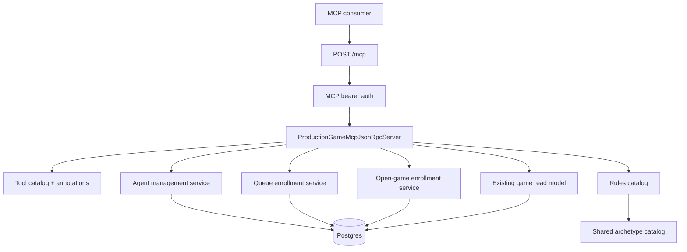

# MCP Agent Management and Queue Enrollment - Plan

## Goal Capsule

- **Objective:** Expand the user-facing production MCP so authenticated users can learn Influence rules, inspect and tune their own agents, and enroll an agent into supported pre-match queues.
- **Product authority:** The MCP is an agent-management surface for AI app providers; active gameplay remains exclusively inside the Influence client.
- **Execution profile:** Code.
- **Open blockers:** None before implementation. The plan intentionally resolves rating, archetype, queue replacement, open-game addressing, and cosmetics scope before code starts.

---

## Product Contract

### Summary

The user-facing MCP should become a safe agent-management companion for ChatGPT, Claude, and similar AI apps.
It should expose rules discovery, roster discovery, coarse agent create/update commands, and idempotent pre-match enrollment while preserving the current `/mcp` versus `/mcp/producer` security boundary.

### Problem Frame

Influence's product loop is persistent agent development followed by watching agents compete.
The current production MCP supports authenticated game inspection, but it does not yet let a user manage the roster or queue an agent from the AI surfaces where agent owners naturally write, compare, and iterate on personalities.
Adding pre-match management to MCP improves activation without letting a provider participate in a live match.

The highest trust risk is boundary confusion.
If MCP tools look like gameplay controls, provider clients may try to vote, message, or act during active matches.
The first version must make the allowed shape narrow and boring: learn rules, manage owned agents, enroll before start, stop there.

### Key Decisions

- **One v1 work chunk:** Treat rules, roster, agent create/update, queue status, daily-free join/leave, open-game discovery/join, and MCP guardrails as one coherent slice. Splitting those apart would produce a tool surface that can inspect agents but not act on the user's stated management goal.
- **Management-only boundary:** The user-facing MCP may prepare agents and enroll them before a match, but it must not expose active-match actions. That boundary is product behavior, not just an implementation detail.
- **User scope stays user scope:** Agent management belongs on `/mcp` with `scope=games`; `/mcp/producer` with `scope=mcp` remains the privileged producer/debug surface.
- **Coarse commands over tiny mutations:** The tool surface should prefer full create/update commands and rich read responses over field-level setters. LLM clients should not orchestrate a dozen low-level profile edits.
- **Rating honesty over aspirational copy:** If implementation only has account-level ELO, agent summaries should label that clearly and avoid "highest ELO agent" claims until a real per-agent rating source exists.
- **Queue shape is future-aware but not speculative:** v1 supports `daily-free` and joinable open games, with unsupported queue types rejected clearly. The API shape should admit ranked, tournament, invite, and party queues later without shipping their behavior now.

### Actors

- A1. **Authenticated agent owner:** A logged-in Influence user authorizing an MCP client to inspect and manage their own agents.
- A2. **MCP consumer:** A provider-hosted assistant such as ChatGPT or Claude calling Influence tools on the user's behalf.
- A3. **Influence backend:** The server that validates tokens, enforces ownership, performs mutations, and serializes safe responses.
- A4. **Influence client:** The web app that remains the only surface for active-match participation.

### Requirements

**Rules discovery**

- R1. The user MCP must provide a rules discovery tool that explains how Influence works, including win conditions, round phases, player counts, endgame, free games, archetypes, and basic strategy.
- R2. The user MCP must provide rules search so an MCP consumer can answer targeted gameplay questions without calling active-match tools.
- R3. Rules responses must avoid stale or misleading claims, especially around archetype count, account-level versus agent-level ELO, and any update-time rating reset behavior.
- R3a. The user MCP must provide an archetype lookup tool so MCP consumers can inspect valid agent archetypes as command vocabulary, not only as prose embedded inside rules.

**Agent discovery**

- R4. The user MCP must list only the authenticated user's own agents.
- R5. Agent summaries must include enough context for selection: display name, archetype, public biography, avatar, owner-visible prompt or safe prompt summary, games played, wins, current queue state, and active-game exclusion state.
- R6. Agent summaries must include rating information only with accurate provenance, such as account-level ELO or a verified agent-level rating source.
- R7. Agent detail and search must return rich responses so an MCP consumer can compare agents without immediately needing follow-up reads.
- R8. The active or currently queued agent state must be discoverable from roster and queue responses, not hidden behind separate game-inspection calls.

**Agent creation and update**

- R9. The user MCP must expose one coarse create-agent command that accepts display name, archetype, personality prompt, public biography, avatar reference, and optional cosmetic fields.
- R10. The user MCP must expose one coarse update-agent command for mutable fields: archetype, personality prompt, public biography, avatar reference, and cosmetics.
- R11. Agent creation and updates must rely on server-side validation for archetype, avatar handling, profile limits, content constraints, and ownership.
- R12. Immutable identifiers and ownership fields must not be accepted as editable MCP arguments.
- R13. Update responses must not train users around the current rating-reset behavior because the product direction is to remove that reset.

**Queue and open-game enrollment**

- R14. The user MCP must expose queue status, join queue, and leave queue tools using a human-readable `queueType` argument.
- R15. v1 must support `daily-free` and reject unsupported queue types with explicit, friendly errors.
- R16. Queue join must be idempotent for repeat calls with the same user and agent; it should return the existing enrollment rather than creating duplicates or surfacing a scary retry failure.
- R17. Queue leave must be idempotent for repeat calls; a user who is already absent from the queue should receive a friendly success response.
- R18. Queue responses must include the queue name, enrolled agent, waiting status, joined time when known, next draw or start estimate when known, and enough context for the assistant to summarize the result.
- R19. Open-game listing and joining must be limited to waiting games with available slots and must reject active, completed, hidden, or full games.

**Safety, authorization, and tool ergonomics**

- R20. Every user-facing MCP read or mutation must derive the acting user from the bearer token and database; client-provided ownership or user IDs must be ignored or rejected.
- R21. The user MCP must never expose voting, empower/expose, council actions, mingle messages, lobby messages, diary-room actions, ready checks, timers, phase actions, moderator actions, or any action inside an active match.
- R22. Tool descriptions must say when to call the tool, when not to call it, required authorization, and side effects.
- R23. Tool descriptors must mark read tools and mutation tools accurately; mutation tools must not inherit a blanket read-only annotation.
- R24. Error responses must be explicit enough for an MCP consumer to recover or explain the issue: unsupported queue, invalid archetype, account limit reached, queue full, agent already queued, agent already in active game, and ownership failure.
- R25. User-facing tools must not reveal producer traces, private telemetry, draft agents from other users, hidden prompts from other users, or internal matchmaking state.

**Documentation and validation**

- R26. The production MCP docs must describe the expanded user-facing tool surface and preserve the `/mcp` versus `/mcp/producer` split.
- R27. The rules source used by MCP must be kept aligned with the website-facing rules content or replaced by a shared source of truth.
- R28. Tests must assert the user-facing tool inventory, forbidden active-match omissions, ownership enforcement, idempotent queue behavior, descriptor annotations, and rich response shape for the main management flows.

### Key Flows

- F1. **Rules question**
  - **Trigger:** The MCP consumer asks how Influence works or asks about a specific rule.
  - **Actors:** A1, A2, A3
  - **Steps:** The consumer calls rules discovery, rules search, or archetype lookup; the backend returns safe game rules, valid archetype vocabulary, and strategy context; the consumer answers without requesting match-control tools.
  - **Outcome:** The user can learn gameplay from MCP, but no match state changes.
  - **Covered by:** R1, R2, R3, R3a

- F2. **Choose and queue an existing agent**
  - **Trigger:** The user asks which agent to use or asks to queue a named agent for the daily free game.
  - **Actors:** A1, A2, A3
  - **Steps:** The consumer lists or searches agents, picks the target from owned roster metadata, calls queue join with `daily-free`, and receives a rich enrollment response.
  - **Outcome:** The agent is enrolled once, and repeated calls return the same friendly queue state.
  - **Covered by:** R4, R5, R6, R7, R8, R14, R15, R16, R18

- F3. **Create or tune an agent before enrollment**
  - **Trigger:** The user asks to create a named archetype or modify an existing personality.
  - **Actors:** A1, A2, A3
  - **Steps:** The consumer calls the coarse create or update command; the backend validates mutable fields and ownership; the response returns the updated agent summary and any relevant queue status.
  - **Outcome:** The roster changes safely without exposing field-level mutation choreography.
  - **Covered by:** R9, R10, R11, R12, R13

- F4. **Leave queue**
  - **Trigger:** The user asks to remove an agent from today's queue.
  - **Actors:** A1, A2, A3
  - **Steps:** The consumer calls queue leave for `daily-free`; the backend removes the enrollment or reports the user was already absent.
  - **Outcome:** The assistant can truthfully say the user is not queued.
  - **Covered by:** R14, R15, R17, R18

- F5. **Join an open game**
  - **Trigger:** The user asks whether any open games are available or asks to join one with an owned agent.
  - **Actors:** A1, A2, A3
  - **Steps:** The consumer lists joinable waiting games, the user or assistant selects one, and the consumer joins using an owned agent.
  - **Outcome:** The agent is enrolled only if the game has not started and has capacity.
  - **Covered by:** R19, R20, R21, R24

### Acceptance Examples

- AE1. **Rules answer stays read-only.** Covers R1, R2, R21. Given a user asks "How does Influence gameplay work?", when the MCP consumer calls the rules tool, then the response explains gameplay without exposing any action that changes an active match.
- AE2. **Owned roster only.** Covers R4, R20, R25. Given a valid `scope=games` token, when the consumer lists agents, then only agents owned by the authenticated user are returned.
- AE3. **Rating is labeled honestly.** Covers R6. Given only account-level ELO is available, when an agent summary is returned, then the response labels that rating as account-level or omits agent-level ELO instead of claiming a highest-ELO agent.
- AE4. **Create agent success is rich.** Covers R9, R11. Given valid create-agent input, when the command succeeds, then the response includes the new agent summary and enough metadata to queue it without a follow-up detail call.
- AE5. **Update does not advertise reset.** Covers R10, R13. Given an agent update changes personality fields, when the command responds, then the user-facing MCP response does not highlight the current rating-reset behavior.
- AE6. **Join queue is repeat-safe.** Covers R14, R16, R18. Given the user already queued the same agent for `daily-free`, when the join command is retried, then the response reports the existing enrollment as a successful final state.
- AE7. **Leave queue is repeat-safe.** Covers R14, R17. Given the user is not in the daily-free queue, when the leave command is called, then the response reports that the user is not queued without treating it as a failure.
- AE8. **Active match action is unavailable.** Covers R21, R22, R28. Given a provider asks for a vote or mingle tool, when it lists or calls user-facing MCP tools, then no such tool is present and unknown active-match names are rejected.
- AE9. **Open-game join stops at waiting.** Covers R19. Given a game is active, completed, hidden, or full, when the consumer attempts open-game join, then the backend rejects it with a clear reason.

### Success Criteria

- The example conversations from the expansion prompt are possible through user-facing MCP except for any action after a match begins.
- MCP consumers can answer common rules and roster-selection questions from one or two tool calls, not a long chain of tiny reads.
- Queue operations are safe under provider retries and produce user-legible final-state responses.
- The production MCP tool inventory contains no active-match action tools under `scope=games`.
- Existing producer MCP access remains unchanged for private trace and developer inspection.

### Scope Boundaries

**In scope for this chunk**

- Rules discovery and rules search.
- Agent list, detail, search, and current queue-state discovery for the authenticated user.
- Agent create and update for mutable owner-managed fields.
- Daily-free queue status, join, and leave.
- Joinable open-game listing and waiting-game enrollment when the backend can provide safe metadata.
- MCP tool descriptions, annotations, tests, and docs needed to keep the surface provider-safe.

**Deferred for later**

- Ranked queues, tournaments, invitation-code queues, party queues, and spectator flows.
- A full custom MCP App UI beyond whatever metadata is needed for tool usability.
- Built-in avatar generation or image upload workflows beyond accepting an avatar reference supported by existing server validation.
- True per-agent ELO if the current implementation remains account-level.
- Post-game improvement loops that compare an agent's private reasoning across games.

**Outside this product boundary**

- Voting, empower/expose, council decisions, mingle/lobby/diary messages, ready checks, timers, phase actions, moderator controls, or any other active-match action through MCP.
- Producer private trace access, hidden prompts from other users, private telemetry, or internal matchmaking state through user-facing MCP.
- Reusing `scope=mcp` as ordinary user-scoped agent management.

### Dependencies / Assumptions

- The existing OAuth and MCP resource split remains the authority for user versus producer access.
- Existing REST behavior for agent profiles, free queue, and game join is reliable enough to share or adapt behind MCP rather than reinventing validation from scratch.
- The v1 plan may expose account-level rating provenance while leaving true per-agent ELO as deferred work.
- Unsupported future queue types should be explicit product errors, not silent no-ops.

### Resolved Planning Questions

- **Rating in v1:** Return account-level free-track rating once per response, and include each agent's own `gamesPlayed`, `wins`, and `winRate`. Do not rank agents by ELO or label any profile as "highest ELO" until a real agent-level rating source is wired. If an `agentRating` field exists in the MCP serializer, it must be `null` or explicitly `status: "not_available"`.
- **Already queued with another agent:** `join_queue` is idempotent only for the same authenticated user, same `queueType`, and same agent. If the user is queued with a different agent, return a friendly domain error naming the queued agent and telling the caller to call `leave_queue` first. Do not add a replace flow in v1.
- **Open-game addressing:** Open-game reads and joins should accept `gameIdOrSlug`, resolving by UUID or slug. Existing REST joins currently receive a path param named `id`; the shared service should support both without requiring the MCP caller to know which identifier a game surfaced.
- **Cosmetics in v1:** The only durable cosmetic profile field in scope is `avatarUrl`. MCP schemas should use `avatarUrl`, map that through existing upload URL normalization, and reject or ignore future cosmetic fields explicitly instead of pretending they were saved.
- **Archetype truth:** MCP should advertise the archetypes the API actually accepts for create/update. Current drift is real: rules copy says ten archetypes, API/profile/lifecycle validators accept thirteen, and the engine type also contains `broker`. v1 should centralize the thirteen currently server-accepted profile archetypes and document `broker` as not user-selectable until the product deliberately enables it.

## Planning Contract

### Product Contract Preservation

The Product Contract's R/A/F/AE IDs remain the authority for implementation. Planning resolved the deferred questions above, but did not widen the approved product surface into active-match participation, producer trace access, ranked queues, tournaments, custom lobbies, avatar generation/upload, or true per-agent ELO.

### Current Architecture

- `packages/api/src/routes/mcp.ts` owns the Streamable HTTP route, bearer validation, origin/body guards, audit shaping, and the `/mcp` versus `/mcp/producer` split.
- `packages/api/src/game-mcp/auth.ts` validates opaque MCP bearer tokens into `GameMcpAuthContext`.
- `packages/api/src/game-mcp/server.ts` owns JSON-RPC `initialize`, `resources/list`, `resources/read`, `tools/list`, and `tools/call`. It currently routes directly through a switch and assumes every tool descriptor is read-only.
- `packages/api/src/game-mcp/read-model.ts` is the deployed game inspection read model. It should not become the write service for agent management.
- `packages/api/src/routes/agent-profiles.ts`, `packages/api/src/routes/free-queue.ts`, and `packages/api/src/routes/games.ts` already contain useful validation and DB behavior, but much of it is embedded in Hono handlers rather than reusable services.
- `packages/api/src/db/schema.ts` already has the durable objects needed for v1: `users`, `agent_profiles`, `free_game_queue`, `games`, and `game_players`.
- Existing tests already cover MCP tool inventory/auth boundaries in `packages/api/src/__tests__/production-game-mcp-server.test.ts` and route/token behavior in `packages/api/src/__tests__/mcp-http-route.test.ts`. Agent/profile/game behavior lives in `packages/api/src/__tests__/agent-profiles.test.ts` and `packages/api/src/__tests__/games-api.test.ts`.

### High-Level Technical Design



Keep the route/auth layer unchanged in spirit: `/mcp` remains `scope=games`; `/mcp/producer` remains `scope=mcp`. The main implementation move is to add management services behind the existing authenticated MCP server, then make the MCP tool catalog able to describe both read-only and mutation tools accurately.

### New MCP Tool Surface

| Tool | Annotation | Purpose | Side effect |
| --- | --- | --- | --- |
| `get_rules` | read-only | Return complete MCP-safe rules, archetypes, free-game basics, rating provenance, and strategy guidance. | None |
| `search_rules` | read-only | Return targeted rule excerpts by query. | None |
| `list_archetypes` | read-only | Return valid user-selectable archetypes with labels, descriptions, and creation/update vocabulary. | None |
| `list_agents` | read-only | Return owned agent summaries plus account-level rating and queue/open enrollment state. | None |
| `get_agent` | read-only | Return one owned agent by `agentId`. | None |
| `search_agents` | read-only | Search owned agents by display name, archetype, biography, prompt, or strategy style. | None |
| `get_queue_status` | read-only | Return queue/enrollment status for supported `queueType`, defaulting to `daily-free`. | None |
| `list_open_games` | read-only | Return joinable waiting games with slots and ruleset metadata. | None |
| `create_agent` | mutation | Create one owned reusable agent profile from coarse authoring fields. | Inserts `agent_profiles`. |
| `update_agent` | mutation | Update mutable fields for one owned agent. | Updates `agent_profiles`; MCP response omits reset-training copy. |
| `join_queue` | mutation | Enroll an owned agent in `daily-free`, or join an `open-game` by `gameIdOrSlug`. | Inserts `free_game_queue` or `game_players`. |
| `leave_queue` | mutation | Leave `daily-free` idempotently. | Deletes `free_game_queue` if present. |

Do not add tools named after active-match actions. The existing read-only game inspection tools remain governed by the current `scope=games` contract, but this slice must not add voting, Mingle, lobby, diary room, ready-check, timer, phase, council, power, moderator, or other match-participation tools.

### Request Schemas

Use human-readable field names at the MCP boundary and map them to current DB names inside services:

```ts
type QueueType = "daily-free" | "open-game";

interface SearchRulesArgs {
  query: string;
  limit?: number;
}

interface ListArchetypesArgs {
  includeStrategyHints?: boolean;
}

interface ListAgentsArgs {
  limit?: number;
}

interface GetAgentArgs {
  agentId: string;
}

interface SearchAgentsArgs {
  query: string;
  limit?: number;
}

interface GetQueueStatusArgs {
  queueType?: "daily-free";
}

interface ListOpenGamesArgs {
  limit?: number;
}

interface CreateAgentArgs {
  displayName: string;
  archetype: string;
  personalityPrompt: string;
  publicBiography?: string | null;
  strategyStyle?: string | null;
  avatarUrl?: string | null;
}

interface UpdateAgentArgs {
  agentId: string;
  displayName?: string;
  archetype?: string | null;
  personalityPrompt?: string;
  publicBiography?: string | null;
  strategyStyle?: string | null;
  avatarUrl?: string | null;
}

interface JoinQueueArgs {
  queueType: QueueType;
  agentId: string;
  gameIdOrSlug?: string;
}

interface LeaveQueueArgs {
  queueType: "daily-free";
}
```

Queue-type support is operation-specific in v1: `daily-free` supports status, join, and leave; `open-game` supports listing with `list_open_games` and joining through `join_queue`, but not `leave_queue` or `get_queue_status`.

Field mapping:

| MCP field | Current storage/API field |
| --- | --- |
| `displayName` | `agent_profiles.name` |
| `archetype` | `agent_profiles.personaKey` |
| `personalityPrompt` | `agent_profiles.personality` |
| `publicBiography` | `agent_profiles.backstory` |
| `strategyStyle` | `agent_profiles.strategyStyle` |
| `avatarUrl` | `agent_profiles.avatarUrl` |

### Response Schemas

Rich responses should be shaped for LLM narration, not just programmatic mutation acknowledgement:

```ts
interface AgentSummary {
  id: string;
  displayName: string;
  archetype: string | null;
  publicBiography: string | null;
  personalityPrompt?: string;
  strategyStyle: string | null;
  avatarUrl: string | null;
  stats: {
    gamesPlayed: number;
    wins: number;
    winRate: number;
  };
  rating: {
    kind: "account-level-free-track";
    currentElo: number;
    peakElo: number;
    accountGamesPlayed: number;
    accountWins: number;
    agentEloAvailable: false;
  };
  queueState: {
    dailyFree: "queued" | "not-queued";
    joinedAt?: string;
  };
  activeEnrollment: null | {
    gameId: string;
    slug?: string;
    status: "waiting" | "in_progress";
    queueType: "open-game" | "daily-free";
  };
}

interface ArchetypeSummary {
  key: string;
  label: string;
  description: string;
  creationHint: string;
  strategyHint?: string;
  selectable: true;
}

interface QueueResponse {
  ok: true;
  message: string;
  queue: {
    queueType: "daily-free" | "open-game";
    displayName: string;
    status: "queued" | "already-queued" | "not-queued" | "joined-open-game";
    joinedAt?: string;
    estimatedDrawAt?: string;
    selectionMethod?: "random-draw";
  };
  agent?: AgentSummary;
}
```

Recoverable domain failures should be explicit. If JSON-RPC errors are used, extend `JsonRpcResponse.error` to allow optional `data` and include stable codes such as `unsupported_queue_type`, `invalid_archetype`, `agent_not_found`, `agent_already_queued`, `agent_already_enrolled`, `queue_full`, `game_not_joinable`, and `ownership_denied`. Avoid raw database errors or generic `Error: failed`.

### Key Technical Decisions

- **Add services before MCP mutations:** Extract reusable command/query helpers for agent profile management and enrollment instead of embedding DB writes directly in `ProductionGameMcpJsonRpcServer`.
- **Keep REST compatibility through adapters:** Shared services can return domain results while existing REST routes continue mapping those results to their current HTTP statuses where compatibility matters. MCP can map the same results to retry-friendly final states.
- **Catalog-driven MCP tools:** Refactor `tool()` in `packages/api/src/game-mcp/server.ts` or a new catalog module so descriptors accept `readOnlyHint: true | false`, richer descriptions, and side-effect wording.
- **Server-owned authorization:** Every management service receives `auth.userId` from `GameMcpAuthContext`; MCP arguments never accept `userId`, `ownerId`, or cross-user selectors.
- **Rules catalog from server truth:** Add an API-side rules/archetype catalog used by MCP rules responses and agent validation. Update `docs/rules-page-content.md` so website copy no longer says ten archetypes or per-agent ELO/reset if the implementation does not support that truth.
- **Archetypes as command vocabulary:** Add `list_archetypes` so LLM clients can discover valid `create_agent` and `update_agent` archetype values directly. `get_rules` may include archetype context for gameplay education, but MCP clients should not need to scrape rules prose to know valid mutation arguments.
- **Account rating, agent stats:** The MCP response should make account-level ELO useful without pretending it belongs to a specific agent. Agent comparison should use per-agent `gamesPlayed`, `wins`, `winRate`, archetype, prompt, queue state, and active enrollment.
- **Open-game join is pre-match enrollment:** Joining a waiting open game is allowed through `join_queue({ queueType: "open-game", gameIdOrSlug, agentId })`; any non-waiting, hidden, full, or already-started game is rejected.
- **No implicit replacement:** Switching daily-free agents requires `leave_queue` then `join_queue`. This is deliberately boring and legible.
- **No avatar generation in v1:** MCP accepts durable avatar references supported by existing server validation. Generating or uploading an image from ChatGPT is a later asset pipeline.

### Backend API Additions Required

- `packages/api/src/services/agent-archetypes.ts` or equivalent shared API catalog for user-selectable archetypes, labels, descriptions, and validation.
- `packages/api/src/services/agent-profile-management.ts` for owned agent list/search/get/create/update and response serialization.
- `packages/api/src/services/queue-enrollment.ts` for queue status, daily-free join/leave, idempotency, active-enrollment checks, and domain errors.
- `packages/api/src/services/open-game-enrollment.ts` or a clearly named helper inside the queue service for joinable game listing and `gameIdOrSlug` resolution.
- `packages/api/src/game-mcp/rules.ts` for rules content/search serialization backed by the shared archetype catalog and current rating truth.
- `packages/api/src/game-mcp/tool-catalog.ts` if keeping `server.ts` readable requires moving tool descriptors and argument parsing out of the route switch.
- No new database table is required for v1. True per-agent ELO, replace-queue semantics, avatar upload storage, ranked queues, and tournament queues require later schema/API work.

### Security Concerns

- Management mutations must never use client-provided ownership fields. All ownership checks must join or filter by `auth.userId`.
- `search_agents` must search only the authenticated user's profiles and may return owner-visible prompts only for those profiles.
- `list_open_games` must exclude hidden games and games that are not `waiting`, and should not expose internal matchmaking state beyond slots/rules/start estimate.
- `join_queue` must reject agents already in a waiting or in-progress enrollment to avoid one profile being double-booked.
- Mutation audit should record method/tool/outcome and safe identifiers such as queue type or agent ID when useful, but must not log raw `personalityPrompt`, biographies, provider prompt bodies, OAuth tokens, or authorization headers.
- Producer private trace, private telemetry, provider metadata, raw prompts from other users, and internal object-storage pointers remain unavailable under `scope=games`.
- Tool descriptions should explicitly tell LLM clients not to call these tools for active-match actions, even if the user asks to vote or send messages.

### Naming Improvements

- Use `agent` in MCP tool names and responses; keep `agentProfile` as an internal DB/API term.
- Use `archetype` at the MCP boundary; map to `personaKey` internally.
- Use `personalityPrompt` for the owner-authored private/control text; use `publicBiography` for `backstory`.
- Use `queueType: "daily-free"` and `queueType: "open-game"` rather than route-shaped names like `joinDailyQueue`.
- Keep existing read-only game tools snake_case for compatibility; do not rename them in this slice.

## Implementation Units

### U1. Shared Archetype And Rules Catalog

**Depends on:** Product Contract.

**Scope:** Create the server-side truth used by MCP rules, agent validation, and docs.

**Files:**

- Add `packages/api/src/services/agent-archetypes.ts`.
- Add `packages/api/src/game-mcp/rules.ts`.
- Update `packages/api/src/routes/agent-profiles.ts`.
- Update `packages/api/src/services/game-lifecycle.ts`.
- Update `docs/rules-page-content.md`.

**Implementation notes:**

- Move the thirteen currently server-accepted user-selectable archetypes into one exported catalog with labels/descriptions.
- Update existing route/lifecycle validators to consume the catalog.
- Keep `broker` out of the v1 catalog unless product explicitly chooses to enable it during implementation; document that as a deliberate exclusion, not an accidental omission.
- Build rules responses from structured sections so `search_rules` can search titles/body/tags without fragile string slicing.
- Build `list_archetypes` from the same catalog, including stable `key` values that match `create_agent.archetype` and `update_agent.archetype`.
- Fix rules copy around archetype count, account-level ELO, and update-time reset behavior.

**Tests:**

- Add or extend tests to assert `invalid archetype` messages use the shared catalog.
- Add a rules catalog test that catches drift between MCP rules output and the shared archetype catalog.
- Add a `list_archetypes` test proving every returned key is accepted by agent create/update validation.
- Add a doc-safe smoke assertion that `get_rules` does not mention per-agent ELO reset.

**Covers:** R1, R2, R3, R3a, R11, R24, R27.

### U2. Agent Management Service

**Depends on:** U1.

**Scope:** Provide reusable owned-agent queries and commands for MCP while keeping REST behavior stable.

**Files:**

- Add `packages/api/src/services/agent-profile-management.ts`.
- Update `packages/api/src/routes/agent-profiles.ts` to use shared validation helpers where practical.
- Extend `packages/api/src/__tests__/agent-profiles.test.ts`.
- Add `packages/api/src/__tests__/agent-profile-management.test.ts` if service-level coverage is cleaner than route-only tests.

**Implementation notes:**

- Implement list/get/search for `auth.userId` only.
- Include queue state and active enrollment by querying `free_game_queue`, `game_players`, and `games`.
- Implement create/update with server validation for display name, prompt, biography, archetype, and avatar URL normalization.
- Derive the public base URL for avatar normalization from trusted server context, preferably `new URL(auth.resource).origin` for MCP calls, rather than from user input.
- Confirm whether an account/profile cap already exists. If it does, map it to `account_limit_reached`; if it does not, keep that error code reserved and do not invent a new cap in this slice.
- Keep immutable fields out of schemas and reject unknown ownership fields if they appear in MCP arguments.
- Preserve REST response compatibility where needed, but make MCP serialization omit `statsReset` and any copy that trains users around rating reset.
- Return owner-visible `personalityPrompt` only because the authenticated user owns the agent.

**Tests:**

- Owned roster only.
- Search cannot return another user's profile, even on matching text.
- Create returns enough metadata to queue immediately.
- Update cannot modify ownership/ID and does not surface reset-training fields in MCP serialization.
- Rating object labels account-level provenance and does not claim per-agent ELO.

**Covers:** R4, R5, R6, R7, R8, R9, R10, R11, R12, R13, R20, R25.

### U3. Queue And Open-Game Enrollment Services

**Depends on:** U2.

**Scope:** Add domain services for daily-free queue status/join/leave and waiting-game enrollment.

**Files:**

- Add `packages/api/src/services/queue-enrollment.ts`.
- Add `packages/api/src/services/open-game-enrollment.ts` if open-game logic is too large for the queue service.
- Update `packages/api/src/routes/free-queue.ts` only if shared helpers can be adopted without unwanted REST compatibility churn.
- Update `packages/api/src/routes/games.ts` to share game join resolution where practical.
- Extend `packages/api/src/__tests__/games-api.test.ts` for `gameIdOrSlug` join behavior if route behavior changes.
- Add `packages/api/src/__tests__/queue-enrollment.test.ts`.

**Implementation notes:**

- `get_queue_status` defaults to `daily-free` and returns count, authenticated user's entry, joined agent summary, next draw time, selection method, and latest free game state when known.
- `join_queue({ queueType: "daily-free" })` validates agent ownership, checks active/waiting enrollment, and returns success if the same agent is already queued.
- Daily-free join must handle concurrent retries by relying on the existing unique `free_game_queue.user_id` constraint inside a transaction or by catching the unique violation and re-reading final state.
- If another agent is already queued for the user, return `agent_already_queued` with the existing agent summary.
- `leave_queue({ queueType: "daily-free" })` returns success whether or not an entry existed.
- `join_queue({ queueType: "open-game", gameIdOrSlug })` resolves by ID or slug, rejects hidden/non-waiting/full games, validates agent ownership, checks duplicate active enrollment, and inserts a `game_players` row through shared game-join logic.
- Unsupported queue types return `unsupported_queue_type` with supported values.

**Tests:**

- Daily-free join same agent twice is success and creates one row.
- Daily-free join different agent returns explicit conflict and does not replace.
- Leave twice returns success and leaves no row.
- Unsupported `ranked`/`tournament`/unknown queues are explicit failures.
- Open-game list excludes hidden, full, active, completed, cancelled, and suspended games.
- Open-game join accepts slug or ID and rejects non-owned agents.
- Agent already in a waiting or in-progress enrollment cannot be queued again.

**Covers:** R14, R15, R16, R17, R18, R19, R20, R24, R25.

### U4. MCP Tool Catalog, Routing, And Error Shape

**Depends on:** U1, U2, U3.

**Scope:** Wire the new management services into `/mcp` and keep `/mcp/producer` unchanged.

**Files:**

- Update `packages/api/src/game-mcp/server.ts`.
- Add `packages/api/src/game-mcp/tool-catalog.ts` if descriptor definitions make `server.ts` unwieldy.
- Update `packages/api/src/__tests__/production-game-mcp-server.test.ts`.
- Update `packages/api/src/__tests__/mcp-http-route.test.ts` only if JSON-RPC error shape changes at the route boundary.

**Implementation notes:**

- Inject the management/rules services into `ProductionGameMcpJsonRpcServer` alongside the existing read model.
- Keep existing read-only game tools available according to their current auth profile, but add management tools only for `scope=games`.
- Producer tools must not include agent create/update/queue tools unless the product explicitly authorizes a future admin surface.
- Refactor tool descriptors so mutation tools have `annotations.readOnlyHint: false` or omit read-only hints according to MCP expectations.
- Descriptions must include when to call, when not to call, required `scope=games`, and side effects.
- Use typed argument parsers for the read and mutation schemas in this plan, especially `SearchRulesArgs`, `ListArchetypesArgs`, `GetAgentArgs`, `SearchAgentsArgs`, `GetQueueStatusArgs`, `CreateAgentArgs`, `UpdateAgentArgs`, `JoinQueueArgs`, and `LeaveQueueArgs`.
- Preserve the existing MCP route audit posture for mutations: log method/tool/outcome without raw tool arguments or response bodies, and add tests if the audit event shape changes.
- Add structured domain error data if feasible; at minimum, use stable, explicit messages and avoid leaking internals.

**Tests:**

- `tools/list` under `scope=games` includes the new management tools, accurate read-only annotations, and no active-match action tools.
- `list_archetypes` is read-only, returns the shared catalog, and stays in sync with `create_agent`/`update_agent` schema values.
- `tools/list` under `scope=mcp` preserves producer trace tools and does not advertise the user MCP App entry metadata on producer tools.
- Calling forbidden active-match names such as `vote`, `mingle_message`, `ready_check`, or `start_game` remains unsupported.
- Management tool calls receive and use `GameMcpAuthContext.userId`.
- Mutation responses contain rich final-state context.

**Covers:** R21, R22, R23, R24, R25, R28.

### U5. Documentation And Provider-Facing Copy

**Depends on:** U4.

**Scope:** Make the expanded MCP contract discoverable without confusing it with active gameplay or producer access.

**Files:**

- Update `docs/game-mcp-production-oauth.md`.
- Update `docs/rules-page-content.md` if not completed in U1.
- Update `CONCEPTS.md` only if implementation changes the Management-only MCP definition already added for this slice.
- Update `README.md` or `DEVELOPMENT.md` only if local MCP setup or validation commands change.

**Implementation notes:**

- Replace "User-facing Game MCP exposes read-only user tools" with a management-aware description that separates read tools from mutation tools.
- Document `/mcp scope=games` versus `/mcp/producer scope=mcp` exactly; do not make `scope=mcp` sound user-scoped.
- Include the new tool list, supported queue types, idempotency behavior, and active-match non-goals.
- Document rating provenance in plain language.
- Keep setup docs pointed at `/get-mcp` for humans and `/mcp` for MCP clients.

**Tests:** Documentation-only, but final verification must include a search for banned active-match tool names in user-facing tool descriptors and docs.

**Covers:** R1, R3, R21, R22, R26, R27.

### U6. End-To-End Guardrail Verification

**Depends on:** U1, U2, U3, U4, U5.

**Scope:** Prove the one-chunk product experience works and the forbidden surface stayed forbidden.

**Files:**

- Extend `packages/api/src/__tests__/production-game-mcp-server.test.ts`.
- Extend `packages/api/src/__tests__/mcp-http-route.test.ts` if route-level auth assertions are needed.
- Add focused service tests listed in U1-U3.

**Implementation notes:**

- Add JSON-RPC tool-call tests that exercise the example conversations as far as server behavior can prove them: rules, archetype lookup, roster, create, update, join daily-free, repeat join, leave, repeat leave, list open games, join waiting open game.
- Include cross-user fixtures to prove another user's agents and prompts do not leak.
- Include a producer regression test proving `/mcp/producer` still exposes private trace tools and `/mcp` still cannot discover or call them.
- Include an annotation regression test that fails if a mutation tool is marked read-only.

**Tests:**

- Example conversation path: create "Neon Gold Rune" as `diplomat`, update to a more aggressive prompt, queue it for `daily-free`, and remove it.
- Roster comparison path: ask for highest ELO and receive account-level rating provenance, not a fake per-agent ranking.
- Forbidden tool path: active-match tool names are absent from `tools/list` and rejected by `tools/call`.
- Security path: user B cannot get/search/update/queue user A's agent, even if user B knows the agent ID.

**Covers:** R1-R28 plus R3a.

## Dependency Order

1. U1 creates shared rules/archetype truth.
2. U2 builds owned-agent services on that truth.
3. U3 builds queue/open-game services on owned-agent resolution.
4. U4 wires tools and descriptors into MCP.
5. U5 updates docs once the exact tool surface exists.
6. U6 closes the loop with integration and guardrail coverage.

## Verification Contract

Run the fastest focused tests while implementing each unit, then finish with:

```bash
bun run test
bun run check
```

For DB-backed tests, use the existing local Postgres test setup. If sandboxed commands report `ECONNREFUSED` against `127.0.0.1:54320`, rerun with elevated sandbox access before treating the DB as down.

Required verification outcomes:

- `scope=games` can initialize, list tools, call rules, list archetypes, list/get/search owned agents, create/update an agent, inspect daily-free queue status, join/leave daily-free idempotently, list open games, and join a waiting open game.
- `scope=games` cannot list or call producer trace tools or any active-match action tool.
- `scope=mcp` producer inventory and private trace behavior are unchanged.
- Agent ownership enforcement is tested for reads, writes, queue joins, and open-game joins.
- Rating copy and schemas do not claim true per-agent ELO.
- Tool annotations distinguish reads from mutations.
- Documentation matches the shipped tool list and the `/mcp` versus `/mcp/producer` boundary.

## Definition Of Done

- All Product Contract requirements R1-R28 plus R3a are implemented or explicitly deferred in code/docs exactly as scoped here.
- The user-facing MCP can complete the target flows: learn rules, inspect valid archetypes, inspect roster, create/update an agent, queue for daily-free, leave daily-free, list open games, and join a waiting open game.
- No user-facing MCP tool can vote, empower/expose, take council action, send Mingle/lobby/diary content, ready-check, control timers/phases, moderate, or otherwise participate inside an active match.
- Queue joins/leaves are retry-safe for provider duplicate calls.
- Responses are rich enough for an LLM to explain final state without immediately making extra calls.
- Account-level rating provenance is explicit; no fake per-agent ELO ranking is introduced.
- Tests cover inventory, annotations, ownership, idempotency, open-game eligibility, forbidden tools, and response shape.
- `docs/game-mcp-production-oauth.md` and `docs/rules-page-content.md` are current.
- `bun run test` and `bun run check` pass, or any failure is documented with a concrete blocker and affected unit.

## Sources / Research

- `docs/ideation/2026-06-30-mcp-agent-management-queue-enrollment-ideation.html`
- `docs/game-mcp-production-oauth.md`
- `docs/rules-page-content.md`
- `STRATEGY.md`
- `CONCEPTS.md`
- `packages/api/src/game-mcp/server.ts`
- `packages/api/src/game-mcp/auth.ts`
- `packages/api/src/game-mcp/claims.ts`
- `packages/api/src/game-mcp/read-model.ts`
- `packages/api/src/routes/mcp.ts`
- `packages/api/src/routes/agent-profiles.ts`
- `packages/api/src/routes/free-queue.ts`
- `packages/api/src/routes/games.ts`
- `packages/api/src/db/schema.ts`
- `packages/api/src/services/game-lifecycle.ts`
- `packages/api/drizzle/0003_account_level_elo.sql`
- `packages/api/src/__tests__/production-game-mcp-server.test.ts`
- `packages/api/src/__tests__/mcp-http-route.test.ts`
- `packages/api/src/__tests__/agent-profiles.test.ts`
- `packages/api/src/__tests__/games-api.test.ts`
- `packages/engine/src/agent.ts`
- `packages/engine/src/persona-generator.ts`
- `docs/solutions/runtime-errors/production-game-mcp-raw-trace-read-limit.md`
