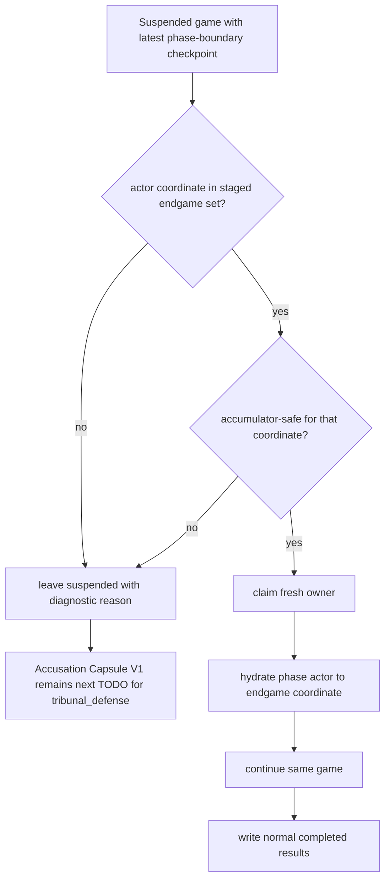
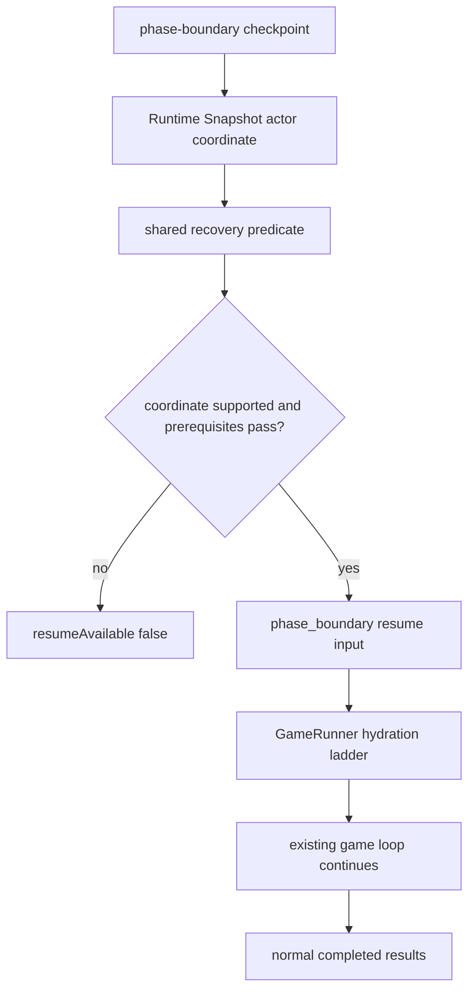
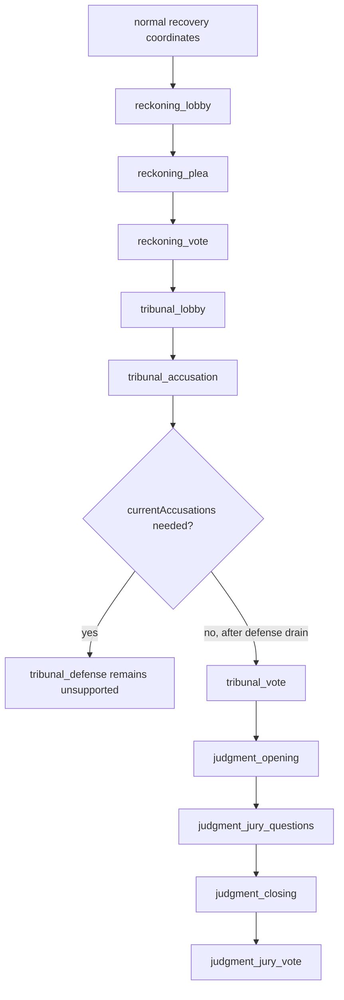

# Endgame Phase-Boundary Recovery - Plan

## Goal Capsule

| Field | Value |
|---|---|
| Objective | Expand startup recovery from `reckoning_lobby` into staged endgame phase-boundary coordinates without claiming support for accumulator-heavy defense state. |
| Product authority | The resiliency track in `STRATEGY.md`, current support and gaps in `docs/statefulness-plan.md`, and the endgame continuation ideas in `docs/ideation/2026-06-29-backend-durability-scalability-ideation.html`. |
| Execution profile | Backend engine/API code work with DB-backed same-game recovery tests. |
| Stop conditions | Stop and ask before enabling `tribunal_defense`, reconstructing `_currentAccusations` from transcript prose, changing public recovery UX, or widening recovery beyond completed phase-boundary startup resume. |
| Tail ownership | After staged endgame coverage lands, Accusation Capsule V1 / full accumulator support becomes the next durability task for `tribunal_defense`. |

---

## Product Contract

### Summary

Implement staged endgame resume coverage by extending the existing actor-coordinate recovery contract, endgame phase hydration, shared support predicate, and DB-backed recovery matrix.
The plan covers Reckoning pair, Tribunal entry, Judgment finale, and `tribunal_vote` only behind a proven post-defense accusation drain.
`tribunal_defense` remains fail-closed until Accusation Capsule V1 or equivalent full accumulator support exists.

### Problem Frame

Startup recovery now proves the important product behavior: the same API-backed game can survive a supported process restart boundary and complete normally.
The remaining user-trust gap is late-game interruption.
Crashes during Reckoning, Tribunal, or Judgment can erase the most watchable part of a match even though the durable kernel already stores canonical events, phase-boundary checkpoints, Runtime Snapshot v1 evidence, transcript replay, and token cursors.

Not every endgame boundary is equally cheap.
Most late coordinates need explicit phase-actor hydration, actor-specific prerequisites, and DB-backed recovery coverage.
`tribunal_defense` is different because its prompts depend on `_currentAccusations`, a runner-owned in-memory accumulator that is not canonical game state.
Resuming that boundary without a typed accumulator contract would turn transcript prose into authority, which is exactly the cursed shortcut this system was built to avoid.

### Key Decisions

- **Stage the endgame surface by accumulator risk.** Add coordinates that can be recovered from canonical game state plus checkpoint evidence before touching `tribunal_defense`.
- **Treat `tribunal_vote` as conditional, not assumed.** It enters the supported set only if implementation proves the accusation map is drained, cleared, or irrelevant after defense.
- **Make the accumulator slice the next named TODO.** Accusation Capsule V1 is deferred from this staged expansion, but it is not optional cleanup; it is the required follow-up to unlock `tribunal_defense` and future accumulator-heavy boundaries.
- **Keep one executable truth predicate.** Durable inspection and startup recovery must agree on supported coordinates, accumulator safety, actor prerequisites, and event-head freshness.
- **Verify by interruption, not by inspection alone.** Every newly advertised coordinate needs the same DB-backed proof: interrupt, startup-recover, append contiguous events, and complete the same game.

### Actors

- A1. **Viewer or player:** Expects a late-game match to finish at the same URL after a backend restart.
- A2. **Startup recovery coordinator:** Claims only implemented-safe suspended checkpoints on API startup.
- A3. **Recovered runner:** Hydrates canonical game state, checkpoint inputs, and the phase actor to the next endgame coordinate.
- A4. **Durable inspection reader:** Reports `resumeAvailable` only when the startup recovery path can execute the checkpoint.
- A5. **Accumulator-heavy checkpoint:** Stays suspended and inspectable until the missing runtime input has a typed contract.

### Key Flow

### Requirements

**Supported endgame coordinates**

- R1. Recovery must keep the current supported set intact: `lobby`, `vote`, `mingle`, `power`, `reveal`, and `reckoning_lobby`.
- R2. Recovery must add `reckoning_plea` and `reckoning_vote` only when the checkpoint has valid endgame-stage and alive-player prerequisites.
- R3. Recovery must add `tribunal_lobby` and `tribunal_accusation` only when the checkpoint has three alive players, the correct Tribunal stage, and an empty or proven-safe `currentAccusations` accumulator.
- R4. Recovery must add Judgment finale coordinates only when finalist, jury, and endgame-stage prerequisites are present for `judgment_opening`, `judgment_jury_questions`, `judgment_closing`, and `judgment_jury_vote`.
- R5. Recovery may add `tribunal_vote` only after the implementation proves `_currentAccusations` is drained, cleared, or irrelevant after defense; otherwise `tribunal_vote` must remain unsupported.

**Fail-closed accumulator boundary**

- R6. `tribunal_defense` must remain unsupported in this staged expansion.
- R7. Any checkpoint that needs `_currentAccusations` must fail closed unless the value is persisted or reconstructed through a structured runtime contract.
- R8. Transcript prose, private trace text, and public dialogue must not become the authority for rebuilding accusation-map state.
- R9. The docs must identify Accusation Capsule V1, or an equivalent full accumulator slice, as the next necessary durability TODO after this staged endgame expansion.

**Recovery operation**

- R10. Recovery must evaluate only the latest phase-boundary checkpoint at the durable event head.
- R11. Recovery must require Runtime Snapshot v1 evidence, transcript replay, token cursor payload, safe accumulator registry, and actor-specific prerequisites before `resumeAvailable` can be true.
- R12. Startup recovery must claim a fresh owner before appending post-restart events.
- R13. Unsupported, stale, malformed, or accumulator-unsafe checkpoints must remain suspended and inspectable without appending events.
- R14. Durable inspection and startup recovery must use the same implemented-support predicate.

**Runner hydration**

- R15. Runner hydration must position the phase actor at the target endgame coordinate without re-running completed phase effects.
- R16. Hydration prerequisites must be explicit enough that a missing endgame fact rejects the checkpoint instead of synthesizing state.
- R17. The implementation should prefer a readable endgame hydrator ladder when multiple endgame tranches land together, so supported coordinates are auditable rather than hidden in bespoke branches.

**Verification**

- R18. DB-backed recovery tests must cover every newly supported endgame coordinate with interrupt, startup recovery, contiguous post-restart events, unchanged game ID, and completed results.
- R19. Negative tests must cover `tribunal_defense`, unsafe `currentAccusations`, unsupported coordinates, stale event heads, missing transcript replay, and missing token cursor payloads.
- R20. `tribunal_vote` tests must prove either safe accumulator drain or continued fail-closed behavior.
- R21. Documentation updates must make the staged slice and the required follow-up accumulator slice visible from `docs/statefulness-plan.md` and the refactor queue.

### Acceptance Examples

- AE1. **Covers R2, R10-R18.** Given a game is suspended at `reckoning_plea` or `reckoning_vote`, when startup recovery runs, then the same game resumes from that boundary and reaches normal completed results.
- AE2. **Covers R3, R6-R8, R13-R14, R19.** Given a game is suspended at `tribunal_accusation` with a blocked `currentAccusations` entry, when inspection and startup recovery evaluate it, then `resumeAvailable` is false and no recovery owner appends events.
- AE3. **Covers R5, R20.** Given a game is suspended at `tribunal_vote`, when the implementation cannot prove the accusation map is drained or irrelevant, then the coordinate remains unsupported.
- AE4. **Covers R4, R15-R18.** Given a game is suspended at a Judgment finale boundary with valid finalist and jury prerequisites, when startup recovery runs, then the same game finishes through the normal jury-result path.
- AE5. **Covers R6-R9, R19, R21.** Given a planner reads the docs after this brainstorm, when they look for the next durability task, then Accusation Capsule V1 is named as the required follow-up to unlock `tribunal_defense`.

### Success Criteria

- The recovery matrix proves same-game completion from each newly advertised endgame coordinate.
- Durable inspection and startup recovery agree on `resumeAvailable` for every supported and unsupported coordinate in the matrix.
- `tribunal_defense` remains fail-closed with an explicit diagnostic reason until `_currentAccusations` has a structured persisted or reconstructed form.
- The statefulness plan and refactor queue both name the full accumulator slice as the next necessary TODO, not as a vague future idea.

### Scope Boundaries

#### In Scope

- Reckoning pair support, Tribunal entry support, Judgment finale support, conditional `tribunal_vote` support, actor-coordinate prerequisites, endgame phase-actor hydration, shared recovery predicate alignment, DB-backed recovery matrix expansion, and docs that point to the accumulator follow-up.

#### Deferred to Follow-Up Work

- Accusation Capsule V1 or equivalent full accumulator work for `_currentAccusations`, `tribunal_defense`, and the repeatable pattern for future accumulator-heavy boundaries.
- Any implementation that serializes accusation payloads into Runtime Snapshot v1 must be planned separately so privacy, validation, compatibility, and recovery authority are reviewed directly.

#### Out of Scope

- Mid-phase recovery, in-flight LLM recovery, transcript-prose reconstruction, historical old-game repair, multi-worker leases, spot/serverless worker orchestration, deployment drain automation, and player-facing recovery UX.

### Dependencies / Assumptions

- Existing startup recovery support through `reckoning_lobby` remains the baseline.
- Canonical `GameState` plus transcript replay can supply the social context for Reckoning and Judgment, but not the missing `tribunal_defense` accusation map.
- The accumulator registry remains authoritative for safe, drained, blocked, or unsafe runner-local state.
- Planning may split the staged endgame support into multiple PRs as long as no coordinate advertises `resumeAvailable` before it has executable support and DB-backed proof.

### Sources / Research

- `STRATEGY.md`
- `CONCEPTS.md`
- `docs/statefulness-plan.md`
- `docs/refactor-queue.md`
- `docs/solutions/runtime-errors/api-startup-recovery-resumes-interrupted-games.md`
- `docs/plans/2026-06-29-001-feat-one-boundary-resume-to-completion-plan.md`
- `docs/plans/2026-06-29-002-feat-generic-phase-boundary-recovery-plan.md`
- `docs/ideation/2026-06-29-backend-durability-scalability-ideation.html`
- `packages/engine/src/game-runner.ts`
- `packages/engine/src/game-runner.types.ts`
- `packages/engine/src/phase-machine.ts`
- `packages/engine/src/phases/endgame.ts`
- `packages/engine/src/phases/lobby.ts`
- `packages/engine/src/phases/vote.ts`
- `packages/api/src/services/game-recovery-support.ts`
- `packages/api/src/services/game-recovery.ts`
- `packages/api/src/services/game-durable-run.ts`
- `packages/api/src/__tests__/game-recovery.test.ts`

---

## Planning Contract

### Product Contract Preservation

Changed only the Product Contract summary and the now-resolved planning questions so the artifact is implementation-ready.
Requirements, acceptance examples, success criteria, and scope boundaries remain the brainstorm-approved product contract.

### Key Technical Decisions

- KTD1. **The exported coordinate union remains the support contract.** Add endgame coordinates to `PHASE_BOUNDARY_RESUME_ACTOR_COORDINATES` only when the runner, API selector, durable inspection, and recovery matrix can all execute them.
- KTD2. **Endgame hydration is a ladder over phase-machine coordinates.** Extend `hydratePhaseActorForResume` into readable coordinate steps that advance the actor with machine events derived from canonical events and rebuilt `GameState`, never by re-running completed phase runners.
- KTD3. **Prerequisites live beside the shared support predicate.** `evaluateSupportedRecovery` should reject each endgame coordinate when alive counts, endgame stage, finalist/jury state, event head, transcript replay, token cursor, or accumulator safety are missing.
- KTD4. **`tribunal_vote` is unlocked by drain proof.** Clear or mark `_currentAccusations` drained only after `runTribunalDefense` finishes, then let the existing accumulator registry prove the `tribunal_vote` boundary is safe.
- KTD5. **`tribunal_defense` stays a negative case.** Support must reject `tribunal_defense` until Accusation Capsule V1 or equivalent structured accumulator reconstruction exists.
- KTD6. **Recovery tests are the release gate.** Inspection-only proof is not enough; every new coordinate needs the existing interrupt, suspend, startup recovery, contiguous events, and completed-results assertion path.

### High-Level Technical Design

### Sequencing

1. Extend the coordinate contract and hydration shape before widening API support.
2. Add API prerequisite checks and keep unsupported coordinates fail-closed while tests are still red.
3. Add the post-defense accusation drain and decide `tribunal_vote` from evidence.
4. Expand the DB-backed recovery matrix and negative cases.
5. Update docs only after the supported coordinate list and tests match.

### Assumptions

- The existing deterministic/mock recovery fixture can reach the targeted endgame boundaries without adding a new game harness.
- Judgment can be supported in the staged plan because its runner phases depend on canonical finalist/jury state and transcript context, not on `_currentAccusations`.
- If `tribunal_vote` proves unsafe during implementation, the implementer should keep it unsupported and update the plan's affected tests/docs rather than forcing support.

### Risks & Mitigations

| Risk | Mitigation |
|---|---|
| The hydrator replays a completed phase side effect. | Keep hydration limited to phase-machine events and assert the first post-resume canonical event sequence is contiguous after the checkpoint. |
| `tribunal_vote` silently depends on accusation state through prompt context. | Add a specific audit/drain unit and require a negative path when the accumulator is still blocked. |
| Judgment support over-trusts `endgameStage`. | Validate finalists, jury, alive count, and relevant canonical events instead of relying on stage text alone. |
| Recovery and durable inspection drift. | Keep both surfaces using `evaluateSupportedRecovery` / `checkpointHasImplementedResumeSupport`. |
| DB-backed recovery tests become slow or flaky. | Use the existing focused recovery suite and deterministic fixture controls; avoid broad soak tests in this slice. |

### System-Wide Impact

- **Engine:** The phase actor hydration contract and accumulator registry determine what the runner can honestly resume.
- **API recovery:** Startup recovery, durable inspection, and owner-backed continuation must stay aligned on one support predicate.
- **Data durability:** No schema change is planned for staged coverage because accumulator payload persistence is deferred to Accusation Capsule V1.
- **Operations:** Restart recovery remains single-process startup recovery; no multi-worker lease or deploy-drain semantics change in this plan.
- **Documentation:** `docs/statefulness-plan.md` and `docs/refactor-queue.md` must clearly show staged coverage and the accumulator follow-up.

---

## Implementation Units

### U1. Extend The Supported Coordinate Contract

- **Goal:** Add the staged endgame actor coordinates that are already accumulator-safe to the exported resume-coordinate union while leaving `tribunal_defense` out and keeping `tribunal_vote` gated by U4.
- **Requirements:** R1-R6, R14, R21.
- **Dependencies:** None.
- **Files:** `packages/engine/src/game-runner.types.ts`, `packages/engine/src/index.ts`, `packages/api/src/services/game-recovery-support.ts`, `packages/api/src/__tests__/game-recovery.test.ts`.
- **Approach:** Extend `PHASE_BOUNDARY_RESUME_ACTOR_COORDINATES` with `reckoning_plea`, `reckoning_vote`, `tribunal_lobby`, `tribunal_accusation`, `judgment_opening`, `judgment_jury_questions`, `judgment_closing`, and `judgment_jury_vote`. Keep `tribunal_defense` absent, and add `tribunal_vote` only through U4 once the accusation-drain proof exists, so existing unsupported-coordinate handling remains the first guardrail.
- **Patterns to follow:** Current coordinate export from `packages/engine/src/game-runner.types.ts` and API support-set construction in `packages/api/src/services/game-recovery-support.ts`.
- **Test scenarios:**
  - Supported-coordinate type coverage accepts the new staged endgame coordinate list and still rejects `tribunal_defense`.
  - `tribunal_vote` remains rejected until U4 proves the post-defense accumulator drain.
  - The existing unsupported-coordinate test is retargeted or extended so `tribunal_defense` remains rejected with an unsupported actor coordinate reason.
  - Durable inspection reports `resumeAvailable: false` for a checkpoint whose actor coordinate is not in the exported union.
- **Verification:** The coordinate union, API support set, and negative test expectations agree.

### U2. Build The Endgame Hydrator Ladder

- **Goal:** Hydrate the phase actor to each supported endgame coordinate without replaying completed endgame phase runners.
- **Requirements:** R2-R4, R15-R17, AE1, AE4.
- **Dependencies:** U1.
- **Files:** `packages/engine/src/game-runner.ts`, `packages/engine/src/phase-machine.ts`, `packages/engine/src/__tests__/game-engine.test.ts`, `packages/api/src/__tests__/game-recovery.test.ts`.
- **Approach:** Refactor the current one-path resume hydration into named ladder steps for normal-round, Reckoning, Tribunal, and Judgment coordinates. Each step should send only phase-machine events required to reach the target coordinate, update alive players from rebuilt `GameState`, and assert the final actor state before returning.
- **Technical design:** Directional shape only: `normalRoundSteps -> reckoningSteps -> tribunalSteps -> judgmentSteps`, with each step declaring the coordinate it can stop at and the canonical facts it needs.
- **Patterns to follow:** Existing `hydratePhaseActorForResume`, `resumeEmpoweredId`, `resumeCandidateResolution`, and phase-machine transition tests in `packages/engine/src/__tests__/game-engine.test.ts`.
- **Test scenarios:**
  - Covers AE1. A recovered runner targeting `reckoning_plea` starts with Plea behavior and does not rerun Reckoning Lobby.
  - Covers AE1. A recovered runner targeting `reckoning_vote` starts with endgame elimination voting and appends post-checkpoint events contiguously.
  - Covers AE4. Recovered runners targeting each Judgment coordinate continue from that coordinate and finish through the jury-result path.
  - Hydration throws when required canonical facts are absent for a target coordinate.
- **Verification:** Endgame recovery tests fail before selector widening and pass after hydration can reach each target coordinate.

### U3. Add Endgame Prerequisite Checks To The Shared Recovery Predicate

- **Goal:** Make `resumeAvailable` and startup recovery agree on when each staged endgame checkpoint is executable.
- **Requirements:** R2-R4, R10-R14, R16, R19, AE2, AE4.
- **Dependencies:** U1, U2.
- **Files:** `packages/api/src/services/game-recovery-support.ts`, `packages/api/src/services/game-recovery.ts`, `packages/api/src/services/game-durable-run.ts`, `packages/api/src/__tests__/game-recovery.test.ts`, `packages/api/src/__tests__/game-durable-run.test.ts`.
- **Approach:** Extend `validateActorCoordinatePrerequisites` with per-coordinate endgame checks derived from canonical events and `GameState.fromCanonicalEvents`. Validate alive counts, current endgame stage, finalist/jury availability, and accumulator safety before returning a resume input.
- **Patterns to follow:** Current normal-round and `reckoning_lobby` prerequisite checks in `packages/api/src/services/game-recovery-support.ts`; durable inspection already calls `checkpointHasImplementedResumeSupport`.
- **Test scenarios:**
  - Supported endgame checkpoints at the event head return `resumeAvailable: true` only after all prerequisites pass.
  - Stale event-head checkpoints remain rejected with `checkpoint_not_at_event_head`.
  - Missing transcript replay and missing token cursor payloads remain rejected for new endgame coordinates.
  - Endgame checkpoints with mismatched alive counts or stages are rejected before owner claim.
- **Verification:** `getSupportedRecovery` and durable-run inspection return the same support truth for each positive and negative fixture.

### U4. Audit And Drain Accusations After Tribunal Defense

- **Goal:** Make `tribunal_vote` support honest by proving `_currentAccusations` is no longer needed after defense.
- **Requirements:** R5-R8, R13, R20, AE3.
- **Dependencies:** U1, U2, U3.
- **Files:** `packages/engine/src/game-runner.ts`, `packages/engine/src/game-runner.types.ts`, `packages/engine/src/phases/endgame.ts`, `packages/api/src/services/game-recovery-support.ts`, `packages/api/src/__tests__/game-recovery.test.ts`, `packages/engine/src/__tests__/game-engine.test.ts`.
- **Approach:** Confirm no post-defense runner path reads `_currentAccusations`, then clear the map after `runTribunalDefense` completes and before the phase-boundary checkpoint for `tribunal_vote` is written. Add `tribunal_vote` to the coordinate contract only with that drain proof in place. The checkpoint accumulator registry should then record `currentAccusations` as `empty`, allowing `tribunal_vote` to pass the existing accumulator-safety gate.
- **Execution note:** Add the negative blocked-accumulator test first, then make the drain path turn only the intended `tribunal_vote` case green.
- **Patterns to follow:** Existing `buildPhaseBoundaryAccumulators` empty/drained proof behavior and the `runTribunalDefense` call site in `GameRunner`.
- **Test scenarios:**
  - Covers AE3. A `tribunal_vote` checkpoint with `currentAccusations` still blocked remains unsupported.
  - Covers AE3. After defense completes and the accumulator is cleared, a `tribunal_vote` checkpoint reports `resumeAvailable: true`.
  - `tribunal_defense` remains unsupported even though `tribunal_vote` can become supported.
  - Clearing accusations does not remove public defense transcript entries or structured defense agent-turn evidence.
- **Verification:** `tribunal_vote` support is tied to accumulator proof, not to a hard-coded exception.

### U5. Expand The DB-Backed Recovery Matrix

- **Goal:** Prove every newly supported endgame coordinate resumes the same suspended game and reaches normal completed results.
- **Requirements:** R18-R20, AE1-AE4.
- **Dependencies:** U1-U4.
- **Files:** `packages/api/src/__tests__/game-recovery.test.ts`, `packages/api/src/__tests__/durable-run-test-utils.ts`, `packages/api/src/services/game-lifecycle.ts`.
- **Approach:** Extend the existing supported-coordinate matrix and the `reckoning_lobby` endgame test into a generated endgame matrix. Each positive case should interrupt at the target boundary, mark the game suspended, assert inspection support, run startup recovery, and assert one completed result under a fresh owner. Negative cases should cover `tribunal_defense`, blocked `currentAccusations`, unsupported actor coordinates, stale event heads, missing transcript replay, and missing token cursor payloads.
- **Patterns to follow:** `interruptGameAtBoundary`, `assertRecoveredGameCompleted`, and existing fail-closed tests in `packages/api/src/__tests__/game-recovery.test.ts`.
- **Test scenarios:**
  - Covers AE1. `reckoning_plea` and `reckoning_vote` recover to completed results.
  - Covers AE2. `tribunal_lobby` and `tribunal_accusation` recover only when accumulator evidence is safe.
  - Covers AE3. `tribunal_vote` recovers only in the drained-accumulator path.
  - Covers AE4. `judgment_opening`, `judgment_jury_questions`, `judgment_closing`, and `judgment_jury_vote` recover to completed results.
  - Unsupported and unsafe endgame checkpoints do not append events and remain suspended.
- **Verification:** The recovery suite proves unchanged game identity, contiguous sequence numbers, post-restart owner separation, and exactly one completed result for every supported coordinate.

### U6. Update Durable Resume Documentation

- **Goal:** Keep operational docs aligned with the implemented support set and the still-blocked accumulator work.
- **Requirements:** R9, R21, AE5.
- **Dependencies:** U1-U5.
- **Files:** `docs/statefulness-plan.md`, `docs/refactor-queue.md`, `docs/solutions/runtime-errors/api-startup-recovery-resumes-interrupted-games.md`, `docs/ideation/2026-06-29-backend-durability-scalability-ideation.html`, `CONCEPTS.md`.
- **Approach:** Update the supported actor-coordinate list, known gaps, and priority ordering after implementation. Preserve the loud Accusation Capsule V1 follow-up and add a `CONCEPTS.md` entry only if implementation introduces a new domain term beyond existing accumulator/runtime snapshot vocabulary.
- **Patterns to follow:** Current 2026-06-29 and 2026-06-30 statefulness notes, plus the solution learning's prevention checklist.
- **Test scenarios:** Test expectation: none -- this unit is documentation-only.
- **Verification:** Docs name every supported endgame coordinate, state that `tribunal_defense` remains blocked, and point to Accusation Capsule V1 as the next necessary durability task.

---

## Verification Contract

| Gate | Command | Applies To | Done Signal |
|---|---|---|---|
| Engine behavior | `bun run test:engine` | U1, U2, U4 | Phase-machine and endgame state tests pass. |
| DB-backed recovery | `bun run test:db` | U3, U5 | Recovery matrix passes against local Postgres, including positive and fail-closed endgame cases. |
| Repository checks | `bun run check` | U1-U6 | Typecheck and lint pass across workspaces. |
| Focused recovery suite | `cd packages/api && DRIZZLE_MIGRATIONS_DIR=./drizzle bun test src/__tests__/game-recovery.test.ts` | U3-U5 | Same-game resume assertions pass for all supported coordinates. |

Local DB-backed verification requires the repo's Docker Postgres on `127.0.0.1:54320`.
If a sandboxed run reports connection refusal, rerun with the proper local DB access before treating it as a product failure.

---

## Definition of Done

- `PHASE_BOUNDARY_RESUME_ACTOR_COORDINATES` includes the staged endgame coordinates and excludes `tribunal_defense`.
- `GameRunner` hydrates each supported endgame coordinate without re-running completed phase effects.
- `evaluateSupportedRecovery`, `checkpointHasImplementedResumeSupport`, durable inspection, and startup recovery agree on support truth.
- `tribunal_vote` is supported only when the accusation accumulator is proven empty or drained after defense.
- `tribunal_defense` and unsafe `currentAccusations` checkpoints remain fail-closed without appending events.
- DB-backed recovery tests prove same-game completion, contiguous event sequences, one fresh recovery owner, and one completed result for every supported coordinate.
- `docs/statefulness-plan.md`, `docs/refactor-queue.md`, and the startup-recovery solution note match the implemented support set and keep Accusation Capsule V1 as the next durability task.
- Abandoned implementation experiments and temporary test scaffolding are removed from the final diff.
