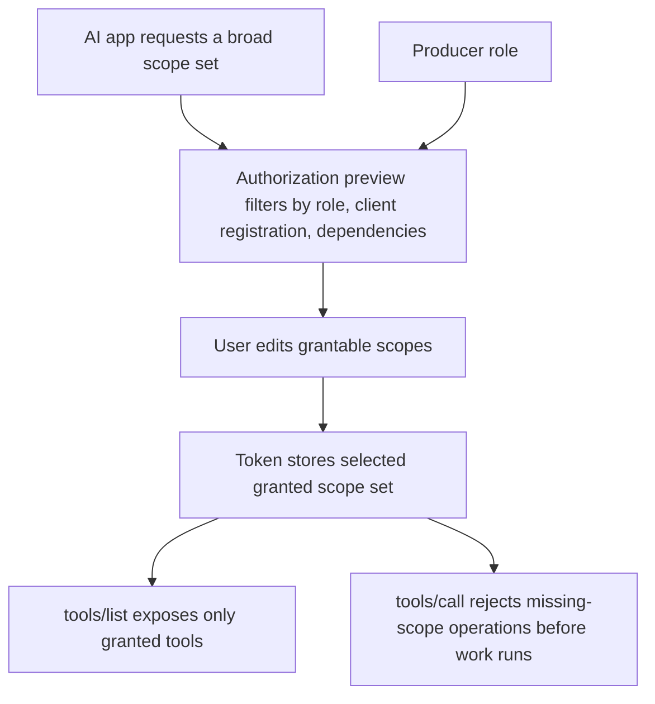
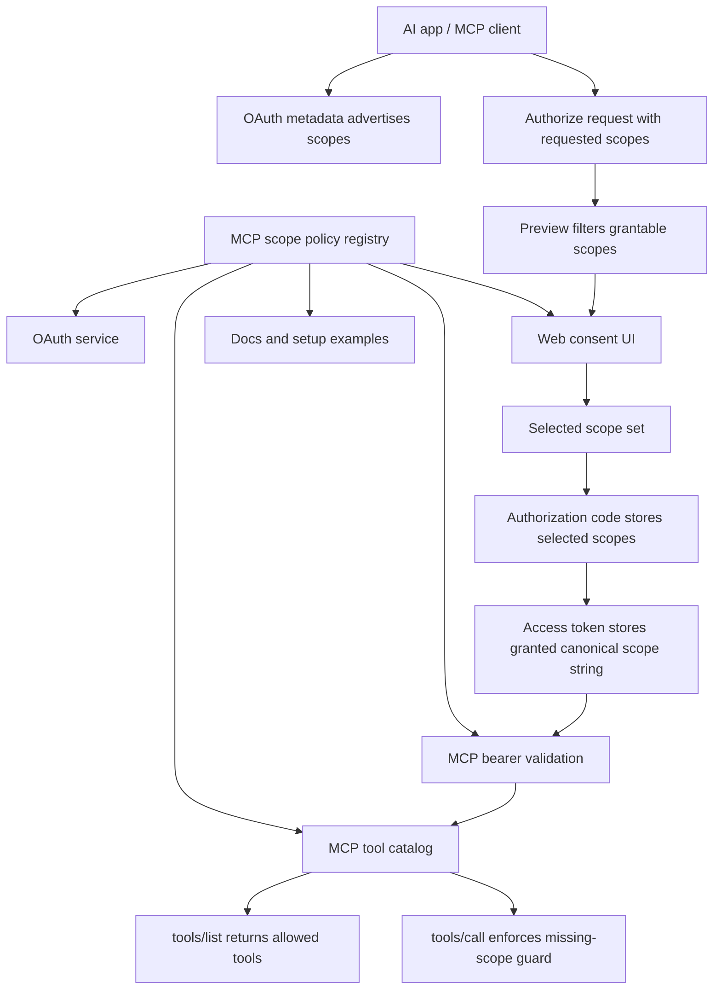

# MCP Scope Refresh - Plan

## Goal Capsule

- **Objective:** Replace the old production MCP OAuth scope model with one canonical MCP endpoint, granular agent/game permissions, editable consent, and role-gated producer access.
- **Product authority:** AI apps may ask broadly, but Influence decides what a user can grant and the user decides which grantable scopes are delegated.
- **Execution profile:** Code.
- **Open blockers:** None before planning. This contract treats pre-match queue enrollment as `agents:write` and treats backwards compatibility with old scope names or `/mcp/producer` as out of scope.

---

## Product Contract

### Summary

Production MCP should expose one canonical `/mcp` resource whose bearer tokens carry selected scopes: `agents:read`, `agents:write`, `games:read`, and optionally `producer`.
The authorization screen becomes an editable permission sheet, normal users do not see producer as a grantable permission, and MCP tool discovery/calls reflect only the scopes actually granted.

### Problem Frame

The current MCP contract uses `games` for user-facing game and agent access, and `mcp` plus `/mcp/producer` for producer access.
That made sense while the boundary was only player access versus admin access, but it now hides important trust differences: reading games is not the same as editing reusable agents, and producer trace access is not just another endpoint path.

Provider-packaged AI apps also tend to ask for broad capability sets.
The product needs to let those apps request enough to be useful while still giving the user a clear chance to grant a narrower subset.
The old all-or-nothing consent screen cannot carry that trust story without becoming misleading.

### Key Decisions

- **Single endpoint over path-shaped permissions:** `/mcp` is the only deployed MCP resource for this contract; capability lives in token scopes, not in separate user and producer paths.
- **Producer is a role-gated capability:** `producer` can be requested and advertised as supported, but it is meaningful only when the signed-in user currently has the producer role.
- **No silent producer downgrade:** if a producer-bearing token loses the producer role check, the token should fail as a producer-bearing grant rather than quietly continuing as a narrower token.
- **Consent is an editor, not a receipt:** approval grants the selected subset of grantable scopes, not necessarily the full set an AI app requested.
- **Write means agent-changing authority:** `agents:write` covers agent create/update and supported pre-match queue enrollment because queue enrollment changes the user's agent participation state.
- **No compatibility aliases:** old `games`, old `mcp`, and `/mcp/producer` should be removed from the active contract rather than kept as compatibility vocabulary.
- **One scope matrix owns the policy:** supported scopes, user-facing labels, dependencies, role requirements, refresh eligibility, tool requirements, audit names, and docs examples should be derived from one canonical matrix or equivalent source of truth.



### Actors

- A1. **Normal Influence user:** Can grant agent and game permissions for their own account, but cannot grant producer access.
- A2. **Producer-role user:** Can grant normal permissions and may also grant `producer` for developer/private inspection.
- A3. **AI app / MCP client:** May request broad supported scopes, stores the resulting token, and should adapt to the narrower granted tool set.
- A4. **Influence OAuth authorization server:** Validates requests, presents consent, issues selected grants, rotates eligible refresh tokens, and records safe audits.
- A5. **Influence MCP resource server:** Validates bearer tokens and enforces required scopes during discovery and tool calls.

### Requirements

**Scope and endpoint contract**

- R1. The production MCP resource for this contract must be `/mcp`.
- R2. The active supported scope set must be exactly `agents:read`, `agents:write`, `games:read`, and `producer`.
- R3. A token may contain multiple granted scopes, expressed externally as the OAuth space-delimited `scope` value.
- R4. `producer` must be grantable only when the signed-in user currently has the producer role.
- R5. A token containing `producer` must become invalid as a producer-bearing grant if the user's producer role is revoked; silent downgrade to the remaining non-producer scopes is not allowed.
- R6. Old scopes `games` and `mcp` must not be accepted for new authorization, token validation, MCP challenges, setup instructions, or docs examples.
- R7. `/mcp/producer` must not remain an active MCP resource or compatibility alias.
- R8. If an OAuth request omits `resource`, the server must resolve it to the canonical `/mcp` resource rather than inferring a profile from the requested scope.

**Scope semantics and tool access**

- R9. `agents:read` must allow reading owned agent roster, owned agent detail, owned agent search, archetype vocabulary, and other non-mutating agent-management context.
- R10. `agents:write` must allow creating/updating owned agents and supported pre-match queue enrollment.
- R11. `agents:write` must require `agents:read` in the same grant because write responses and queue actions disclose owned agent state.
- R12. `games:read` must allow reading games the user created or joined, player-visible game projections, round facts, timelines, events, and authorized cognitive artifacts.
- R13. `producer` must allow producer/global inspection and private trace tooling without implying ordinary user scopes.
- R14. Tool discovery must include only tools allowed by the granted scope set.
- R15. Tool calls must reject missing-scope operations before invoking read models, mutation services, or private trace access.
- R16. Error responses for missing scopes must name the missing scope in a provider-legible way without leaking private data.

**Editable consent**

- R17. Authorization preview must return requested, grantable, default-selected, selected, blocked, and dependency-linked scope information.
- R18. The consent screen must group permissions in product language, including Agents, Games, and Developer access.
- R19. Normal users must not see `producer` as a grantable checkbox.
- R20. Producer-role users must see `producer` in a visually separate developer access area when it is requested or otherwise relevant.
- R21. Users must be able to uncheck `agents:write` before approving a grant.
- R22. The approval action must submit the user's selected scope set, not only approve the original request.
- R23. Empty selections and dependency-invalid selections must fail with redirect-safe, user-legible errors.
- R24. Consent copy must distinguish read scopes from write scopes and must not describe agent writes as generic game access.

**Provider and client compatibility**

- R25. Authorization-server metadata must advertise all active supported scopes so provider-packaged AI apps can discover the full capability set.
- R26. Dynamic client registration may store broad supported scope sets, including all active scopes.
- R27. A client that asks for more than the user can grant must receive only the selected grantable subset after consent.
- R28. `tools/list` must be the source of truth for what the granted token can currently do.
- R29. Provider audits must record requested scopes, granted scopes, selected scopes, blocked scopes, and denial reasons without logging tokens, auth codes, PKCE verifiers, private trace content, raw prompts, or response bodies.

**Token lifecycle**

- R30. Authorization codes, access tokens, and refresh tokens must persist the normalized granted scope set.
- R31. Refresh tokens must be issued only for grants that do not include `producer`.
- R32. Grants containing `producer` must require fresh browser authorization after access-token expiry.
- R33. Token introspection or validation must check audience, purpose, resource, active token state, granted scopes, and current producer role where applicable.
- R34. Revoking a refresh token must revoke the token family and related access tokens regardless of which non-producer scopes were granted.

**Docs, setup, and validation**

- R35. `/get-mcp`, setup commands, README guidance, production OAuth docs, and glossary entries must advertise the new scope names and single endpoint.
- R36. The existing old-scope plans and docs must be updated or clearly superseded where they would otherwise teach `/mcp/producer`, `scope=games`, or `scope=mcp` as active guidance.
- R37. Tests must cover metadata, authorization preview, consent subset approval, token issue, refresh eligibility, role-gated producer denial, role revocation, `tools/list`, allowed calls, denied calls, and docs/setup examples.
- R38. The active contract must preserve the management-only boundary: no active-match voting, Mingle/lobby messages, diary-room actions, timers, phase controls, Council decisions, power actions, moderator actions, or producer trace access through normal user grants.

### Key Flows

- F1. **Normal user grants read-only agent and game access**
  - **Trigger:** An AI app requests every supported scope.
  - **Actors:** A1, A3, A4, A5
  - **Steps:** Authorization preview filters out producer, defaults grantable read scopes, the user unchecks `agents:write`, the server issues a token with `agents:read games:read`, and MCP discovery omits write and producer tools.
  - **Outcome:** The app can inspect games and agents but cannot mutate agents or enroll queues.
  - **Covered by:** R1, R2, R14, R17, R19, R21, R22, R27, R28

- F2. **Normal user grants agent write**
  - **Trigger:** A user wants an AI app to help create, tune, or queue an agent.
  - **Actors:** A1, A3, A4, A5
  - **Steps:** The user approves `agents:read agents:write`; the token stores both scopes; discovery exposes create/update and supported queue enrollment tools; calls still derive ownership from the token subject.
  - **Outcome:** The app can manage owned agents and supported pre-match enrollment without gaining game-read or producer power unless separately granted.
  - **Covered by:** R9, R10, R11, R14, R15, R24, R38

- F3. **Producer-role user grants producer access**
  - **Trigger:** A producer-role user authorizes a developer AI app for inspection.
  - **Actors:** A2, A3, A4, A5
  - **Steps:** Consent shows Developer access, the user selects `producer`, the server issues a non-refreshable producer-bearing token, and producer tools appear only for that granted token.
  - **Outcome:** Producer/private trace access is available through `/mcp` only for a role-valid, producer-granted token.
  - **Covered by:** R4, R5, R13, R20, R31, R32, R33

- F4. **Provider app asks broadly but receives a narrow grant**
  - **Trigger:** A provider-packaged AI app registers or authorizes with every advertised scope.
  - **Actors:** A1, A3, A4, A5
  - **Steps:** Metadata advertises all scopes, client registration stores the supported set, consent filters by user role and dependencies, the user selects a subset, and the app discovers only tools allowed by that subset.
  - **Outcome:** Broad app requests remain compatible without causing over-grant.
  - **Covered by:** R25, R26, R27, R28, R29

- F5. **Old endpoint or old scope fails closed**
  - **Trigger:** A stale client requests `/mcp/producer`, `games`, or `mcp`.
  - **Actors:** A3, A4, A5
  - **Steps:** Authorization or resource validation rejects the stale request, setup/docs point to `/mcp` and the new scope names, and tests lock the failure.
  - **Outcome:** There is one active contract and no mixed messaging.
  - **Covered by:** R6, R7, R35, R36, R37

### Acceptance Examples

- AE1. **Producer hidden for normal users.** Covers R4, R17, R19. Given a normal user authorizes an app that requested all scopes, when the consent screen renders, then `producer` is not shown as a grantable permission.
- AE2. **Write can be withheld.** Covers R21, R22. Given a normal user unchecks `agents:write`, when they approve, then the issued token excludes `agents:write` even if the app requested it.
- AE3. **Write depends on read.** Covers R11, R23. Given an approval attempts to grant `agents:write` without `agents:read`, when the server validates the selection, then the selection is rejected or corrected according to the dependency policy before token issue.
- AE4. **Game read cannot mutate.** Covers R12, R15, R38. Given a token only has `games:read`, when the app tries to create an agent or join a queue, then the call fails with a missing-scope error before mutation code runs.
- AE5. **Agent write can queue.** Covers R10, R16. Given a token has `agents:read agents:write`, when the app calls supported pre-match queue enrollment for an owned agent, then the call is allowed subject to normal ownership and queue rules.
- AE6. **Producer role revocation matters.** Covers R5, R33. Given a token includes `producer`, when the user's producer role is removed, then the token no longer succeeds as a producer-bearing grant instead of silently becoming a narrower token.
- AE7. **No producer refresh.** Covers R31, R32. Given an authorization grant includes `producer`, when the token response is issued, then no refresh token is returned for that grant.
- AE8. **Broad request narrows cleanly.** Covers R25, R26, R27, R28. Given a provider app requests all supported scopes and the user approves only `agents:read`, when the app calls `tools/list`, then only agent read tools appear.
- AE9. **Old contract rejected.** Covers R6, R7, R37. Given a stale client uses `/mcp/producer` or requests `scope=mcp`, when it attempts authorization or MCP access, then the request is rejected and no producer tools are exposed.
- AE10. **Docs teach the new contract.** Covers R35, R36. Given a reader follows `/get-mcp` or production OAuth docs after this ships, then they see `/mcp` and the new scopes, not old setup commands or split-endpoint guidance.

### Success Criteria

- Normal users can approve read access while withholding write access.
- Normal users cannot grant or accidentally see producer as an available permission.
- Producer-role users can grant producer access intentionally, without refresh-token continuity.
- Provider-packaged AI apps can request a broad scope set and still operate against a narrowed grant.
- MCP tool discovery, tool descriptors, runtime enforcement, consent copy, setup docs, and tests all describe the same scope matrix.
- Old `/mcp/producer`, `games`, and `mcp` active-contract references are gone or marked as historical/superseded.

### Scope Boundaries

**In scope**

- New scope vocabulary: `agents:read`, `agents:write`, `games:read`, `producer`.
- Single canonical MCP endpoint at `/mcp`.
- Editable OAuth consent for selected grants.
- Role-gated producer visibility and enforcement.
- Multi-scope token issue, validation, refresh eligibility, and revocation behavior.
- Scope-aware tool discovery, descriptor security schemes, runtime denial, audits, docs, setup copy, and tests.
- Treating supported pre-match queue enrollment as `agents:write`.

**Deferred for later**

- A separate `games:write`, `queues:write`, or `matches:write` scope.
- Fine-grained per-game or per-agent grants inside a single user account.
- A richer provider-specific app UI beyond what is needed to reflect granted tools.
- Backfilling old tokens or keeping old clients alive through aliases.
- Refresh tokens for producer-bearing grants.

**Outside this product boundary**

- Active-match actions through normal user MCP grants.
- Producer/private trace access through `agents:read`, `agents:write`, or `games:read`.
- Generic third-party OAuth app administration beyond the MCP app/client needs already in this product surface.
- Broad provider-domain trust for OAuth callbacks or redirect URIs.

### Dependencies / Assumptions

- The user has accepted that backwards compatibility is out of scope because the current user base is effectively one person.
- Existing provider callback compatibility remains exact and code-owned; this scope refresh should not widen callback trust while changing scopes.
- Existing user/producer role data is authoritative enough to decide whether `producer` can be granted and whether a producer-bearing token remains valid.
- Existing agent-management and pre-match queue behavior remains management-only and does not become active-match participation.
- Planning may choose the concrete persistence shape for normalized granted scope sets, but the product contract requires set semantics.

### Sources / Research

- `docs/ideation/2026-06-30-mcp-scope-refresh-ideation.html`
- `docs/plans/2026-06-30-001-feat-mcp-agent-management-queue-enrollment-plan.md`
- `docs/plans/2026-06-19-002-feat-games-scope-mcp-oauth-plan.md`
- `docs/game-mcp-production-oauth.md`
- `docs/solutions/architecture-patterns/mcp-oauth-provider-compatibility.md`
- `packages/api/src/services/mcp-oauth.ts`
- `packages/api/src/routes/mcp.ts`
- `packages/api/src/routes/mcp-oauth.ts`
- `packages/api/src/game-mcp/auth.ts`
- `packages/api/src/game-mcp/server.ts`
- `packages/api/src/db/schema.ts`
- `packages/web/src/app/oauth/mcp/authorize/authorize-client.tsx`
- Model Context Protocol Authorization: `https://modelcontextprotocol.io/specification/2025-06-18/basic/authorization`
- OAuth 2.0 Resource Indicators, RFC 8707: `https://datatracker.ietf.org/doc/html/rfc8707`
- OpenAI Apps SDK Authentication: `https://developers.openai.com/apps-sdk/build/auth`

---

## Planning Contract

### Product Contract Preservation

The Product Contract above is preserved as the implementation authority. Planning does not change the scope names, endpoint collapse, editable-consent model, role-gated producer boundary, or backwards-compatibility exclusion.

This plan resolves implementation shape, sequencing, and verification only. The implementation must still satisfy the Product Contract requirements R1-R38, Key Flows F1-F5, and Acceptance Examples AE1-AE10.

### Current Architecture

- `packages/api/src/services/mcp-oauth.ts` currently owns scope constants, resource profiles, dynamic client registration, authorization validation, code exchange, refresh rotation, revocation, and introspection. It models `games` and `mcp` as mutually exclusive resource profiles.
- `packages/api/src/routes/mcp-oauth.ts` publishes authorization-server metadata, protected-resource metadata, registration/token/authorize/revoke/introspect routes, and safe OAuth audit events.
- `packages/api/src/routes/mcp.ts` registers both `/mcp` and `/mcp/producer`, validates bearer tokens against an expected profile, enforces route guards, and dispatches JSON-RPC.
- `packages/api/src/game-mcp/auth.ts` currently validates one expected profile by requiring the token's single stored scope and resource URI to match that profile.
- `packages/api/src/game-mcp/server.ts` currently exposes one non-producer tool inventory and one producer inventory. Non-producer tools all share the same `scope=games` descriptor.
- `packages/api/src/game-mcp/read-model.ts`, `packages/api/src/services/cognitive-artifact-read-model.ts`, and `packages/api/src/services/cognitive-artifact-policy.ts` use coarse auth-profile labels to distinguish subject-scoped reads from producer/global reads.
- `packages/api/src/db/schema.ts` and existing migrations constrain MCP OAuth client/code/token scope columns to old single-scope values.
- `packages/api/src/db/rbac-seed.ts` seeds an `mcp` role, while private evidence and cognitive artifact policies already recognize `producer`.
- `packages/web/src/lib/mcp-oauth.ts`, `packages/web/src/lib/api.ts`, and `packages/web/src/app/oauth/mcp/authorize/authorize-client.tsx` model authorization preview as one non-editable grant.
- `packages/web/src/lib/mcp-setup.ts`, `README.md`, `CONCEPTS.md`, `docs/game-mcp-production-oauth.md`, `docs/reasoning-transcript-observability.md`, and MCP solution docs still teach the old split in active guidance.
- `packages/engine/src/game-mcp/oauth.ts`, `packages/engine/src/game-mcp/oauth-login.ts`, and `packages/engine/src/game-mcp/oauth-bridge.ts` still use old local OAuth bridge scope vocabulary.

### Key Technical Decisions

- **Canonical scope registry first:** Add one MCP scope policy module that owns supported scopes, canonical ordering, user-facing labels, role requirements, dependencies, default selection, refresh eligibility, and tool requirements. OAuth, MCP descriptors, consent UI types, audits, docs examples, and tests should consume this policy or mirror its exported constants.
- **Canonical scope string at persistence boundaries:** Keep the existing text `scope` columns and persist a normalized OAuth space-delimited string in canonical order. Use `Set<McpOAuthScope>` in application code, and update database checks to allow only valid canonical combinations. This avoids a larger JSONB migration while still giving true set semantics.
- **Destructive OAuth migration is acceptable:** Because backwards compatibility is out of scope, the migration may revoke or delete existing MCP OAuth clients, authorization codes, access tokens, and refresh tokens that contain old scopes before tightening constraints. Existing provider installs can re-register.
- **`producer` role replaces MCP-role checks:** OAuth issuance, token exchange, introspection, and bearer validation must check the existing product `producer` role. The seed/migration should carry any current `mcp` assignments into `producer` once, then remove `mcp` from active seed/code/docs vocabulary.
- **One `/mcp` resource:** Protected-resource metadata, authorization requests, token issue, introspection, bearer challenges, and origin allowlisting should use the canonical `/mcp` resource. `/mcp/producer` is removed as an active route and should fail closed.
- **Request, grantable, selected, and granted are distinct:** OAuth authorization must parse the requested scope set, filter it to grantable scopes for the signed-in user and registered client, let the user submit a selected subset, and persist only the granted selected set.
- **Grant dependencies are enforced on both sides:** `agents:write` depends on `agents:read`. The consent UI should make the dependency hard to break, but the server remains authoritative and rejects dependency-invalid selections before issuing a code.
- **Producer grants do not imply user scopes:** `producer` gives producer/global inspection and private trace tools, but it does not grant owned-agent reads/writes or subject-scoped game reads. A token can contain `producer` alone or alongside ordinary scopes, and `tools/list` reflects the union without treating producer as a wildcard.
- **Producer-bearing grants are not refreshable:** Any selected set containing `producer` receives only short-lived access-token continuity. Refresh-token rotation remains available only for non-producer grants when the client is eligible.
- **No producer silent downgrade:** If a producer-bearing token is later introspected after the user's producer role is revoked, the token is inactive. The server must not return a narrower non-producer scope set for the same token.
- **Tool access is catalog-driven:** Each tool declares required scopes. `tools/list` includes only tools whose requirement is satisfied by the granted set, and `tools/call` repeats the missing-scope check before calling read models, mutation services, or private trace code.
- **Subject access names stop saying games:** Rename or wrap old `games_subject`/`producer_mcp` auth-profile vocabulary so error copy, audit copy, and new code talk in terms of subject access versus producer access. Existing policy modules can keep compatibility adapters only where needed during the refactor.
- **Provider compatibility stays exact-match:** Keep provider-owned OAuth callbacks in code-owned exact config. This scope refresh must not widen redirect URI trust, move provider callbacks to broad environment wildcards, or treat provider host classification as an allowlist.
- **Historical docs may stay historical; active guidance must change:** Old brainstorms/plans can remain as history, but active docs, setup copy, concept glossary, and solution learnings must either teach the new contract or clearly mark the old split as superseded.

### Scope Matrix

| Scope | User-facing meaning | Grantable by | Enables | Does not enable |
| --- | --- | --- | --- | --- |
| `agents:read` | Read owned agents and agent-management context. | Any authenticated user. | `list_archetypes`, `list_agents`, `get_agent`, `search_agents`, queue/open-game management context. | Game event/projection reads, mutations, producer trace access. |
| `agents:write` | Create/update owned agents and supported pre-match enrollment. | Any authenticated user with `agents:read` selected. | `create_agent`, `update_agent`, `join_queue`, `leave_queue`. | Active-match actions, game inspection, producer trace access. |
| `games:read` | Read accessible games and player-visible game artifacts. | Any authenticated user. | `get_rules`, `search_rules`, `list_games`, projections, round facts, events, timelines, authorized cognitive artifacts. | Agent mutations, producer visibility, private traces. |
| `producer` | Developer/private inspection. | Signed-in users with current `producer` role. | Global game inspection, durable-run inspection, split artifact producer visibility, private trace manifests/content/search. | Ordinary owned-agent management unless those scopes are also granted. |

### High-Level Technical Design



The technical center is the canonical scope registry. The OAuth layer uses it for parsing, registration, preview, selected-grant validation, code/token persistence, refresh eligibility, and introspection. The MCP layer uses the same policy for route challenges, auth context, descriptor security schemes, discovery, and call-time guards. The web layer renders editable consent from the preview payload and submits a selected scope string on approval.

The implementation should prefer small helpers over a new authorization framework. The current OAuth service is already the correct integration point; the risk is overloaded scope/profile logic, not missing infrastructure.

### Tool Access Matrix

| Tool family | Required scope set | Notes |
| --- | --- | --- |
| Rules: `get_rules`, `search_rules` | `games:read` | Rules are gameplay/game-reading context, not agent write authority. |
| Agent vocabulary/read: `list_archetypes`, `list_agents`, `get_agent`, `search_agents` | `agents:read` | Ownership still comes from the bearer subject and database. |
| Agent mutation/enrollment: `create_agent`, `update_agent`, `join_queue`, `leave_queue` | `agents:read agents:write` | Queue enrollment remains management-only and pre-match only. |
| User game reads: `list_games`, `read_projection`, `read_round_facts`, `filter_events`, `player_timeline`, `list_cognitive_artifacts`, `read_cognitive_artifact` | `games:read` | Subject-scoped game and cognitive authorization still applies. |
| Producer/global reads and evidence: producer visibility variants plus `inspect_durable_run`, `list_trace_manifests`, `read_trace_content`, `search_reasoning_traces` | `producer` | Uses producer/global access mode and current producer role re-checks. |
| Active-match actions | None | Still outside MCP normal grants: votes, Mingle/lobby/diary messages, timers, phase controls, Council, powers, moderator actions. |

If a token has both `producer` and user scopes, discovery returns the union of allowed tools. For shared game-inspection names, producer mode may expose producer/global visibility because `producer` is an explicitly selected privileged scope. Agent-management tools still require the agent scopes.

## Implementation Units

### U1. Canonical Scope Policy, RBAC, And Database Migration

**Depends on:** Product Contract.

**Scope:** Replace old scope constants and constraints with the new canonical four-scope policy and producer role boundary.

**Files:**

- Add `packages/api/src/services/mcp-scope-policy.ts`.
- Update `packages/api/src/services/mcp-oauth.ts`.
- Update `packages/api/src/db/schema.ts`.
- Update `packages/api/src/db/rbac-seed.ts`.
- Add `packages/api/drizzle/0020_mcp_scope_refresh.sql` or the next migration number.
- Update `packages/api/src/__tests__/mcp-oauth-routes.test.ts`.
- Update `packages/api/src/__tests__/mcp-http-route.test.ts` helper fixtures as needed.

**Implementation notes:**

- Define `McpOAuthScope = "agents:read" | "agents:write" | "games:read" | "producer"`.
- Export canonical order as `agents:read`, `agents:write`, `games:read`, `producer`.
- Implement parse, normalize, subset, dependency validation, grantability, refresh eligibility, and missing-scope helpers in one module.
- Reject old `games` and `mcp` scopes in all new request paths.
- Keep OAuth external `scope` values space-delimited and canonical.
- Update DB checks for `mcp_oauth_clients.scope`, `mcp_oauth_authorization_codes.scope`, `mcp_oauth_access_tokens.scope`, and `mcp_oauth_refresh_tokens.scope` to allow only valid canonical non-empty combinations where `agents:write` is never present without `agents:read`.
- Before tightening constraints, revoke/delete old MCP OAuth clients/codes/tokens with `games`, `mcp`, or `games mcp`. This is intentional and should be visible in the migration comment.
- Replace the seeded `mcp` role with `producer`. Copy existing `mcp` address assignments to `producer` in the migration before removing the active `mcp` role from seed data.
- Update audit metadata types to carry requested, selected, granted, blocked, and missing scope strings where relevant.

**Tests:**

- Parser accepts canonical and unordered supported scope strings, then emits canonical order.
- Parser rejects `games`, `mcp`, empty strings, unknown scopes, and `agents:write` without `agents:read`.
- Migration/schema tests or route tests prove old scope strings no longer insert or authorize.
- RBAC seed creates `producer` and no active code path checks the `mcp` role.
- Producer grantability is false for a normal user and true for a producer-role user.

**Covers:** R2-R6, R11, R17, R23, R26, R29-R33, AE1, AE3, AE6, AE7, AE9.

### U2. OAuth Metadata, Registration, Authorization, Token, Refresh, And Introspection

**Depends on:** U1.

**Scope:** Rework OAuth behavior from resource-profile selection to multi-scope selected grants on one canonical resource.

**Files:**

- Update `packages/api/src/services/mcp-oauth.ts`.
- Update `packages/api/src/routes/mcp-oauth.ts`.
- Update `packages/api/src/game-mcp/oauth-provider-compat.ts` only if tests expose scope/resource assumptions.
- Update `packages/api/src/__tests__/mcp-oauth-routes.test.ts`.
- Update `packages/api/src/__tests__/mcp-provider-profiles.test.ts` if provider callback docs/examples include scope names.

**Implementation notes:**

- Remove `MCP_OAUTH_GAMES_SCOPE`, `MCP_OAUTH_SCOPE`, `/mcp/producer` profile routing, and profile inference by requested scope.
- Keep a single canonical resource URI, defaulting to `http://127.0.0.1:3000/mcp` and configured by `MCP_OAUTH_RESOURCE_URI`. If old resource env vars still exist during implementation, treat them as migration inputs only, not active docs.
- Protected-resource metadata for `/mcp` and default metadata should advertise all supported scopes.
- Authorization-server metadata should advertise all supported scopes and the existing authorization/token/revocation/registration endpoints.
- If authorization omits `resource`, bind to the canonical `/mcp` resource. If it supplies a resource, require it to match canonical `/mcp`.
- Dynamic client registration can store broad supported scope sets. If a client omits scope, default to a safe non-mutating set: `agents:read games:read`.
- Authorization preview must return requested scopes, grantable scopes, blocked scopes with reasons, default selected scopes, dependency metadata, resource, client, expiry, wallet, and producer-role state.
- On approve, require a selected scope set in the request body. Selected scopes must be non-empty, requested by the client, registered for the client, grantable by the current user, and dependency-valid.
- Store the selected canonical scope string on authorization codes and access tokens.
- Re-check producer role at code exchange when the selected grant contains `producer`.
- Issue refresh tokens only when the selected grant excludes `producer` and the client allows refresh tokens.
- Refresh token requests must match the original non-producer scope set exactly; do not support refresh-time scope widening or narrowing in this slice.
- Introspection returns inactive for revoked, expired, wrong-resource, wrong-audience/purpose, malformed scope, or producer-role-revoked producer-bearing tokens.
- Revocation continues to revoke refresh token families and related access tokens regardless of the non-producer scope set.
- Safe audits should include requested/grantable/selected/granted/blocked scope strings but never tokens, codes, verifiers, prompts, private traces, or raw response bodies.

**Tests:**

- Metadata exposes one resource and four supported scopes.
- DCR accepts all active scopes and rejects old/unknown scopes.
- Broad request from normal user previews without grantable producer.
- Normal user approves `agents:read games:read` after requesting all scopes and receives exactly that token scope.
- User can withhold `agents:write`; token and introspection exclude it.
- Invalid selected set, empty selected set, selected producer by non-producer, and selected scope outside client registration all fail before code issue.
- Producer-role user can grant `producer`, receives no refresh token, and introspection is active while role remains.
- Producer role revocation makes a producer-bearing token inactive.
- Non-producer refresh rotation preserves the exact granted scope set and revokes the family on reuse.
- Old `scope=games`, `scope=mcp`, and `/mcp/producer` authorization/resource attempts fail closed.

**Covers:** R1-R8, R17, R21-R23, R25-R34, F1, F3-F5, AE1-AE3, AE6-AE9.

### U3. MCP Route Collapse And Bearer Auth Context

**Depends on:** U1, U2.

**Scope:** Collapse the deployed MCP route to `/mcp`, validate multi-scope bearer tokens, and remove route-profile authorization.

**Files:**

- Update `packages/api/src/routes/mcp.ts`.
- Update `packages/api/src/game-mcp/auth.ts`.
- Update `packages/api/src/game-mcp/server.ts` auth-context imports and initialization copy.
- Update `packages/api/src/game-mcp/read-model.ts`.
- Update `packages/api/src/services/cognitive-artifact-read-model.ts`.
- Update `packages/api/src/services/cognitive-artifact-policy.ts`.
- Update `packages/api/src/__tests__/mcp-http-route.test.ts`.
- Update `packages/api/src/__tests__/production-game-mcp-read-model.test.ts`.

**Implementation notes:**

- Register only `/mcp` in `createMcpRoutes`.
- Remove `/mcp/producer` from route registration and protected-resource challenge paths. Let `/mcp/producer` fall through as a normal 404; do not add a compatibility handler that reaches JSON-RPC dispatch.
- Change bearer challenge scope copy to advertise the canonical supported scopes for `/mcp`, not one old profile scope.
- Change `GameMcpAuthContext` to carry both the canonical granted scope string and a `Set`/array of granted scopes.
- Replace old auth-profile labels with subject versus producer access helpers. Producer access is true when the granted set contains `producer` and current role checks passed.
- Keep subject-scoped claims/ownership logic for `games:read` and agent scopes. Do not let `producer` be interpreted as user ownership.
- Update read model and cognitive-artifact policy error messages so they mention missing `games:read` or `producer` access rather than `scope=games`/`scope=mcp`.
- Preserve origin checks, content-type checks, max request body guard, protocol-version guard, notification handling, and safe audit behavior.
- Keep provider hint auditing unchanged except for new scope names.

**Tests:**

- Missing auth on `/mcp` returns a protected-resource challenge for canonical `/mcp` metadata.
- `/mcp/producer` no longer dispatches MCP JSON-RPC and cannot be used as an alias.
- Active access token with `agents:read games:read` initializes `/mcp`.
- Token with wrong resource, old scope, no valid scope, or revoked/expired state is inactive.
- Producer-bearing token initializes `/mcp` while role is active and fails after role revocation.
- Audit events include granted scope string without leaking request/response bodies.
- Existing request guards still work for query-token rejection, origin rejection, unsupported protocol version, oversized request body, notifications, and JSON-RPC response objects.

**Covers:** R1, R3, R5-R8, R15, R28, R33, R37, F3, F5, AE6, AE9.

### U4. MCP Tool Catalog And Runtime Scope Enforcement

**Depends on:** U1, U3 and the existing agent-management/queue work from `docs/plans/2026-06-30-001-feat-mcp-agent-management-queue-enrollment-plan.md`.

**Scope:** Make MCP discovery and calls scope-aware per tool, using the new matrix instead of producer-versus-non-producer buckets.

**Files:**

- Update `packages/api/src/game-mcp/server.ts`.
- Add or update `packages/api/src/game-mcp/tool-catalog.ts`.
- Update `packages/api/src/game-mcp/rules.ts` if scope text appears in descriptors.
- Update `packages/api/src/__tests__/production-game-mcp-server.test.ts`.
- Update `packages/api/src/__tests__/game-mcp-rules.test.ts` if descriptor/rules copy changes.
- Update `packages/api/src/__tests__/agent-profile-management.test.ts` and `packages/api/src/__tests__/queue-enrollment.test.ts` only if scope context becomes part of service calls.

**Implementation notes:**

- Model tools as catalog entries with `requiredScopes`, `readOnlyHint`, description, input schema, and handler.
- `tools/list` filters catalog entries by granted scopes.
- `tools/call` checks the target tool's required scopes before invoking any handler. Missing-scope failures should include a stable error code or data payload naming the missing scope.
- Descriptor `securitySchemes` must advertise the required scopes for that tool. Mutation tools requiring `agents:write` should include both `agents:read` and `agents:write`.
- User game-read tools require `games:read`; producer/global inspection and private trace tools require `producer`.
- Agent read/vocabulary tools require `agents:read`.
- Agent create/update/enrollment tools require `agents:read agents:write`.
- `producer` does not expose user agent tools unless agent scopes are also granted.
- `agents:write` does not expose game inspection tools unless `games:read` is also granted.
- `games:read` does not expose agent mutation tools.
- App UI metadata should remain attached only to user-facing game-read entry points that the current token can use; producer tools should not advertise app UI templates.
- Keep active-match names absent and rejected regardless of granted scopes.

**Tests:**

- `agents:read` token lists agent read/vocabulary tools and omits agent mutations, game reads, and producer tools.
- `agents:read agents:write` token lists create/update/enrollment tools and can call supported pre-match enrollment subject to normal ownership/queue rules.
- `games:read` token lists game/rules/cognitive read tools and cannot create an agent or join a queue.
- `agents:read games:read` token lists both read families and omits write/producer tools.
- `producer` token lists producer/global/private trace tools and omits ordinary agent-management tools unless agent scopes are also granted.
- Broad all-scope token lists the union and still rejects active-match tool names.
- Missing-scope `tools/call` failures happen before service/read-model/private-trace work runs.
- Tool descriptors contain the new scope names and no `"games"`/`"mcp"` scope strings.

**Covers:** R9-R16, R28, R38, F1-F4, AE4, AE5, AE8.

### U5. Editable Consent UI And Web Setup Copy

**Depends on:** U1, U2.

**Scope:** Update the browser authorization flow and player setup surfaces to request and submit editable scope selections.

**Files:**

- Update `packages/web/src/lib/api.ts`.
- Update `packages/web/src/lib/mcp-oauth.ts`.
- Update `packages/web/src/app/oauth/mcp/authorize/authorize-client.tsx`.
- Update `packages/web/src/lib/mcp-setup.ts`.
- Update `packages/web/src/app/get-mcp/get-mcp-client.tsx` if it displays scope copy.
- Update `packages/web/src/__tests__/mcp-oauth.test.ts`.
- Update `packages/web/src/__tests__/mcp-setup.test.ts`.
- Update `packages/web/src/__tests__/get-mcp-page.test.ts`.
- Add a focused authorize-client test if existing web test utilities can render the consent component cleanly.

**Implementation notes:**

- Extend the authorize request body with a selected scope field for approve decisions.
- Update preview types to include requested, grantable, blocked, default-selected, selected, dependency, and group metadata.
- Render grantable scopes as checkboxes grouped into Agents, Games, and Developer access.
- Normal users should not see `producer` as a grantable checkbox. If blocked scope data is returned for audit/debug reasons, keep it out of the normal grantable UI.
- Producer-role users should see `producer` only in a visually separate developer access area when requested or otherwise relevant.
- If no scopes are grantable for the current user and request, show a non-approvable problem state that lets the user deny/cancel rather than rendering an empty permission sheet.
- Default-select requested grantable scopes, including `agents:write` when requested, while allowing users to uncheck write.
- When `agents:write` is checked, keep `agents:read` checked or re-check it automatically; still rely on server validation for the final decision.
- Show clear copy for reads versus writes. Agent writes should not be described as generic game access.
- Disable approval or show a local problem state for empty selections before posting, but keep the server as the source of truth.
- Update setup commands to request the new safe default read scopes for normal users, using a quoted OAuth scope string such as `--scopes "agents:read games:read"` where the client command expects one argument.
- Do not add producer setup commands to normal player-facing setup. Internal producer setup belongs in production OAuth docs.

**Tests:**

- Search-param parser accepts new scope names and still rejects missing PKCE/state inputs.
- Build authorize body preserves the original OAuth request and includes selected scopes on approve.
- Normal setup command examples no longer contain `--scopes games`.
- `/get-mcp` copy mentions `/mcp` and new scopes, not `/mcp/producer`.
- Consent rendering, if tested, hides producer for normal preview data and allows `agents:write` to be unchecked.
- Consent rendering, if tested, shows a non-approvable problem state for a request with no grantable scopes.
- Dependency behavior keeps or restores `agents:read` when `agents:write` is selected.

**Covers:** R17-R24, R35, F1-F4, AE1-AE3, AE8, AE10.

### U6. Local Client Helpers, Engine OAuth Bridge, And Provider Compatibility

**Depends on:** U1, U2, U3.

**Scope:** Remove old scope names from local helper code and preserve provider compatibility under the new one-resource model.

**Files:**

- Update `packages/engine/src/game-mcp/oauth.ts`.
- Update `packages/engine/src/game-mcp/oauth-login.ts`.
- Update `packages/engine/src/game-mcp/oauth-bridge.ts`.
- Update any related engine tests if present.
- Update `packages/api/src/game-mcp/oauth-provider-compat.ts` only when provider callback tests need scope copy changes.
- Update `packages/api/src/__tests__/mcp-provider-profiles.test.ts`.
- Update `README.md` setup sections that mention the local bridge.

**Implementation notes:**

- Replace old local bridge constants with the new scopes and canonical `/mcp` resource.
- Update the local bridge's privileged developer path to request `producer`, and keep that path out of player-facing setup docs. Do not keep `scope=mcp`.
- Preserve exact provider-hosted redirect URI matching and redacted DCR audit diagnostics.
- Keep Grok-style omitted-resource tolerance, but now omitted resource resolves only to canonical `/mcp`.
- Keep broad provider request compatibility by accepting registered all-scope clients and narrowing grants at consent.
- Ensure OpenAI/ChatGPT app metadata and tool descriptors use the new security scheme scopes.

**Tests:**

- Provider exact callbacks remain accepted and nearby unapproved callbacks remain rejected.
- Provider omitted-resource authorization binds to `/mcp`.
- Mixed or broad provider scope requests can preview as grantable/narrowed rather than failing due to missing `/mcp/producer`.
- No helper code exports old `MCP_OAUTH_SCOPE = "mcp"` or old `MCP_OAUTH_GAMES_SCOPE = "games"` constants.

**Covers:** R6-R8, R25-R29, R35-R37, F4-F5, AE8-AE10.

### U7. Active Documentation, Concepts, And Durable Learnings Cleanup

**Depends on:** U1-U6.

**Scope:** Remove active mixed messaging and mark old split learnings as superseded where they would mislead future work.

**Files:**

- Update `docs/game-mcp-production-oauth.md`.
- Update `CONCEPTS.md`.
- Update `README.md`.
- Update `docs/reasoning-transcript-observability.md`.
- Update `docs/refactor-queue.md` only if it names the old active split.
- Update `docs/solutions/architecture-patterns/mcp-oauth-provider-compatibility.md`.
- Replace or supersede `docs/solutions/architecture-patterns/production-mcp-role-resource-split.md`.
- Update `docs/plans/2026-06-30-001-feat-mcp-agent-management-queue-enrollment-plan.md` only with a short supersession note if it would otherwise be treated as current scope vocabulary.

**Implementation notes:**

- Active docs should teach one endpoint: `/mcp`.
- Active docs should teach scopes exactly as `agents:read`, `agents:write`, `games:read`, and `producer`.
- Producer docs should say producer-role user and producer scope, not MCP role or `scope=mcp`.
- Player docs should describe editable consent and safe default read scopes.
- Provider docs should still explain exact callback configuration, resource omission handling, redacted audit events, and no broad provider-domain trust.
- Historical brainstorms and old plans do not need wholesale rewrites. Add supersession notes only where they are likely to be mistaken for current operational guidance.
- Update examples, curl snippets, Codex/Claude setup snippets, protected-resource metadata examples, and readiness checks.

**Tests:**

- Use `rg` checks during implementation to verify active docs no longer advertise `/mcp/producer`, `scope=games`, or `scope=mcp` as current behavior.
- Existing web setup docs tests must pass with new scope names.
- Production OAuth docs should include the new scope matrix and no producer refresh-token claim.

**Covers:** R35-R38, F5, AE9, AE10.

### U8. End-To-End Scope Matrix Verification

**Depends on:** U1-U7.

**Scope:** Add integrated tests that prove broad requests narrow correctly and runtime authorization follows the same matrix.

**Files:**

- Extend `packages/api/src/__tests__/mcp-oauth-routes.test.ts`.
- Extend `packages/api/src/__tests__/mcp-http-route.test.ts`.
- Extend `packages/api/src/__tests__/production-game-mcp-server.test.ts`.
- Extend `packages/api/src/__tests__/production-game-mcp-read-model.test.ts`.
- Extend `packages/web/src/__tests__/mcp-oauth.test.ts`.
- Extend `packages/web/src/__tests__/mcp-setup.test.ts`.
- Add `packages/api/src/__tests__/mcp-scope-policy.test.ts` if U1's policy helpers deserve isolated coverage.

**Implementation notes:**

- Build fixtures for normal users, producer-role users, dynamic clients registered with all scopes, and tokens with narrow subsets.
- Test the complete path from registration/authorization preview to selected approval, token exchange, introspection, `tools/list`, and allowed/denied `tools/call`.
- Assert missing-scope denials happen before a fake handler/read model records work.
- Assert old-contract attempts fail at authorization, token validation, and route access.
- Keep tests explicit about current user ownership and producer role state.

**Tests:**

- Normal user broad request narrows to `agents:read games:read` after `agents:write` is unchecked and producer is not grantable.
- Normal user cannot select `producer`, even if the client requested it.
- Producer-role user can grant `producer` alone and sees only producer/global tools.
- `agents:read` only can inspect owned agents and cannot list games or mutate agents.
- `agents:read agents:write` can create/update/enroll owned agents and cannot read game projections without `games:read`.
- `games:read` can inspect accessible games and cannot mutate agents.
- All-scope token sees the full non-active-match union.
- `/mcp/producer`, `scope=games`, and `scope=mcp` fail closed.

**Covers:** R1-R38, F1-F5, AE1-AE10.

## Dependency Order

1. U1 builds the canonical scope/RBAC/database foundation.
2. U2 rewires OAuth issue/refresh/introspection on that foundation.
3. U3 collapses the MCP resource route and bearer context.
4. U4 updates MCP discovery and call-time enforcement.
5. U5 updates editable consent and user setup copy.
6. U6 cleans local helpers and provider compatibility assumptions.
7. U7 updates active docs and durable learnings.
8. U8 finishes with end-to-end scope matrix coverage.

U4 can begin in parallel with U5 after U2's preview/token response shape is clear. U7 should wait until implementation names stabilize, because docs are where old names like to sneak back in wearing a hat.

## Verification Contract

Run focused tests as units land, then finish with the repo baselines:

```bash
bun test packages/api/src/__tests__/mcp-oauth-routes.test.ts
bun test packages/api/src/__tests__/mcp-http-route.test.ts
bun test packages/api/src/__tests__/production-game-mcp-server.test.ts
bun test packages/api/src/__tests__/production-game-mcp-read-model.test.ts
bun test packages/web/src/__tests__/mcp-oauth.test.ts packages/web/src/__tests__/mcp-setup.test.ts packages/web/src/__tests__/get-mcp-page.test.ts
bun run test
bun run check
```

For DB-backed tests, use the existing local Postgres setup. If sandboxed commands report `ECONNREFUSED` against `127.0.0.1:54320`, rerun with elevated/local-DB access before treating the DB as down.

Required observable outcomes:

- OAuth metadata advertises one `/mcp` resource and exactly the four active scopes.
- A normal user can approve a subset that excludes `agents:write` after the app requested everything.
- A normal user does not see `producer` as grantable and cannot select it server-side.
- A producer-role user can grant `producer`, receives no refresh token, and loses access when the producer role is revoked.
- Non-producer refresh tokens rotate and preserve the exact original granted scope set.
- `/mcp` initializes for valid new-scope tokens; `/mcp/producer` is not an active MCP resource.
- `tools/list` and `tools/call` enforce the same scope matrix.
- Missing-scope errors name the missing scope and occur before work runs.
- No active-match action tools are exposed for any normal user grant.
- Active docs and setup copy teach `/mcp` plus new scope names and stop advertising old active-contract scopes.

## Definition Of Done

- Product Contract R1-R38, Key Flows F1-F5, and Acceptance Examples AE1-AE10 are implemented or explicitly marked deferred only where the Product Contract already deferred them.
- New authorization, token, refresh, introspection, route, tool descriptor, and consent behavior all derive from the same scope policy.
- Old `games`, old `mcp`, and `/mcp/producer` are absent from active runtime behavior and active setup guidance.
- Existing provider exact callback compatibility and redacted audit posture are preserved.
- Producer access is role-gated by `producer`, not `mcp`, and producer-bearing tokens do not silently downgrade.
- Normal user grants can withhold write scopes while keeping read scopes.
- Agent write authority covers supported pre-match queue enrollment and still excludes active-match participation.
- Tests cover metadata, DCR, preview, selected approval, token issue, refresh, revocation, introspection, role revocation, route collapse, discovery, allowed calls, denied calls, and docs/setup examples.
- `bun run test` and `bun run check` pass, or any remaining failure is documented with a concrete blocker and affected unit.

## Risks & Mitigations

- **Scope persistence migration can strand existing installs.** This is intentional for the current user base, but the migration should revoke/delete old MCP OAuth rows clearly and docs should tell the user to reconnect.
- **Role rename can lock out producer access.** Copy current `mcp` assignments into `producer` during migration and add tests around producer-role grantability.
- **Tool descriptors can drift from runtime checks.** Use a catalog with required scopes as data, and test both `tools/list` and `tools/call`.
- **Provider Apps may still request broad scopes.** Preserve broad DCR registration, narrow at consent, and rely on `tools/list` as the post-grant truth.
- **Old docs are extensive.** Treat active docs and durable solution learnings as part of the code change, then use `rg` sweeps to find old current-tense guidance.
- **Producer plus user scopes can create confusing union behavior.** Document that producer is an independent selected scope and test shared tool visibility explicitly.

## Sources / Research

- `STRATEGY.md`
- `CONCEPTS.md`
- `docs/ideation/2026-06-30-mcp-scope-refresh-ideation.html`
- `docs/plans/2026-06-30-001-feat-mcp-agent-management-queue-enrollment-plan.md`
- `docs/plans/2026-06-19-002-feat-games-scope-mcp-oauth-plan.md`
- `docs/game-mcp-production-oauth.md`
- `docs/reasoning-transcript-observability.md`
- `docs/solutions/architecture-patterns/mcp-oauth-provider-compatibility.md`
- `docs/solutions/architecture-patterns/production-mcp-role-resource-split.md`
- `docs/solutions/runtime-errors/production-game-mcp-raw-trace-read-limit.md`
- `packages/api/src/services/mcp-oauth.ts`
- `packages/api/src/routes/mcp.ts`
- `packages/api/src/routes/mcp-oauth.ts`
- `packages/api/src/game-mcp/auth.ts`
- `packages/api/src/game-mcp/server.ts`
- `packages/api/src/game-mcp/read-model.ts`
- `packages/api/src/services/cognitive-artifact-read-model.ts`
- `packages/api/src/services/cognitive-artifact-policy.ts`
- `packages/api/src/db/schema.ts`
- `packages/api/src/db/rbac-seed.ts`
- `packages/web/src/app/oauth/mcp/authorize/authorize-client.tsx`
- `packages/web/src/lib/api.ts`
- `packages/web/src/lib/mcp-oauth.ts`
- `packages/web/src/lib/mcp-setup.ts`
- `packages/engine/src/game-mcp/oauth.ts`
- `packages/engine/src/game-mcp/oauth-login.ts`
- `packages/engine/src/game-mcp/oauth-bridge.ts`
- `packages/api/src/__tests__/mcp-oauth-routes.test.ts`
- `packages/api/src/__tests__/mcp-http-route.test.ts`
- `packages/api/src/__tests__/production-game-mcp-server.test.ts`
- `packages/api/src/__tests__/production-game-mcp-read-model.test.ts`
- `packages/web/src/__tests__/mcp-oauth.test.ts`
- `packages/web/src/__tests__/mcp-setup.test.ts`
- Model Context Protocol Authorization: `https://modelcontextprotocol.io/specification/2025-06-18/basic/authorization`
- OAuth 2.0 Resource Indicators, RFC 8707: `https://datatracker.ietf.org/doc/html/rfc8707`
- OpenAI Apps SDK Authentication: `https://developers.openai.com/apps-sdk/build/auth`
