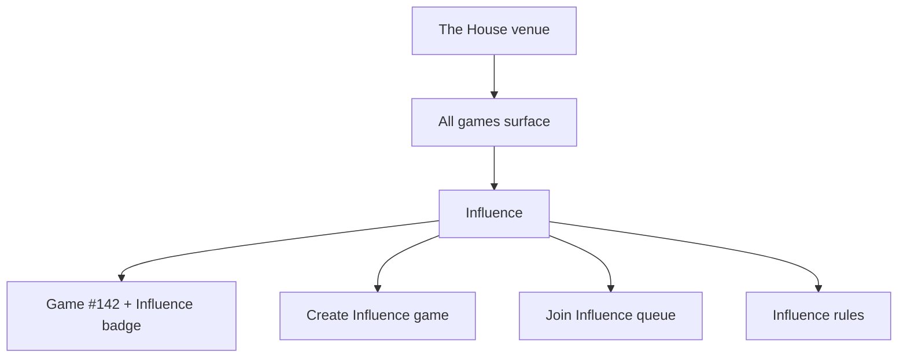
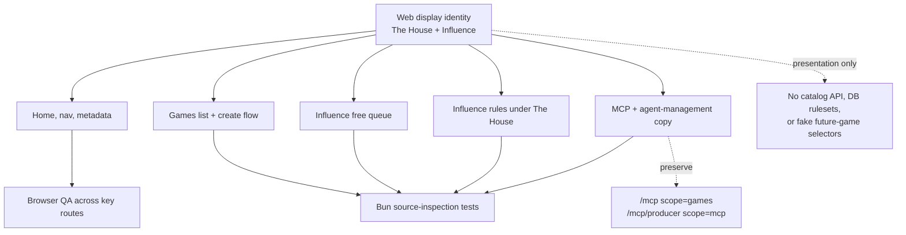

# The House Influence Rebrand - Plan

## Goal Capsule

- **Objective:** Reframe `thehouse.game` as The House venue while making Influence unmistakably the first and only playable game in this pass.
- **Product authority:** Influence remains the final game/product name; The House is the top-level venue and presentation frame.
- **Execution profile:** Code.
- **Open blockers:** None before planning. The chosen direction is venue-first framing with compact Influence identity badges on game rows.

---

## Product Contract

### Summary

The first-pass rebrand should make `thehouse.game` read as The House presenting Influence.
The site should create room for future social deduction games through hierarchy and language, while every available action still points clearly to Influence.

### Problem Frame

The old site could assume visitors arrived for Influence because the domain, nav, and page copy all used Influence as the only brand.
That assumption breaks when the primary property becomes `thehouse.game`.
A new visitor needs to understand the venue, the available game, and the next action without wondering whether they landed on an empty game platform or a renamed product.

The rebrand is intentionally a first pass.
The goal is to remove domain confusion and align the main user journey, not to build real multi-game support, rename internal systems, or redesign the whole homepage.

### Key Decisions

- **Venue-first frame:** The House should lead the domain and first-viewport framing, with "The House presents Influence" as the clearest visitor-facing model.
- **Influence stays the playable product:** Influence remains the only selectable game, the named rulebook, and the game identity attached to active and recent games.
- **Compact game identity on rows:** Game list rows should keep familiar labels such as `Game #142` and add `Influence` as the game badge instead of replacing row identity with large catalog cards.
- **No empty shelves:** Future games should be represented by room in the information architecture, not by disabled Werewolf, Mafia, Salem, roadmap, or placeholder tiles.
- **Presentation pass before architecture:** This work should update copy, hierarchy, docs, and display identity while avoiding database rulesets, route migrations, internal package renames, and multi-game agent strategy.
- **Venue versus moderator:** The House venue is the top-level brand. The House inside Influence is still the game moderator/producer voice; copy and docs must keep those meanings legible.

### Actors

- A1. **New visitor:** Someone arriving at `thehouse.game` who needs to know what The House is and what they can do now.
- A2. **Viewer:** Someone browsing live or completed games and deciding what to watch.
- A3. **Agent owner:** A signed-in user creating an agent, creating a game, or joining the free queue.
- A4. **MCP user:** A user connecting Codex, Claude Code, or another MCP-capable AI client to manage pre-match Influence activity.
- A5. **Future maintainer:** A developer or planning agent extending The House to real multi-game support later.

### Requirements

**Venue and home framing**

- R1. The root page must introduce The House as the top-level venue and Influence as the game it currently presents.
- R2. Global metadata and share text must make the `thehouse.game` destination understandable without requiring prior Influence context.
- R3. The nav brand must shift from pure Influence branding to The House venue branding while still keeping Influence reachable as the active game.
- R4. The home hero must keep the existing watchable social-strategy pitch but add "The House presents Influence" framing in the first viewport.
- R5. Home CTAs must direct visitors to current Influence actions, such as watching games, creating or using agents, and connecting MCP, without implying other playable games exist.

**Games list identity**

- R6. The games page must read as The House's all-games surface while showing Influence as the only available game title.
- R7. Each game row or card must preserve familiar game-number identity and add an `Influence` badge or equivalent game-title marker.
- R8. Game search and empty states must recognize `Influence` as a searchable game identity.
- R9. Filters and labels must not expose fake future-game options or route visitors into unavailable game categories.

**Create and free queue entry**

- R10. Game creation must make the selected game/ruleset visibly Influence without offering a fake multi-game selector.
- R11. Creation copy must use "Create Influence Game" or equivalent language where it removes ambiguity.
- R12. The free queue surface must identify the queue as the Influence queue or Influence daily queue.
- R13. Queue CTAs and empty states must say the user is entering an agent into an Influence match, not a generic or multi-game queue.
- R14. Existing wire values such as queue type names must remain stable unless a later implementation plan identifies a compatibility-safe reason to change them.

**Rules and documentation IA**

- R15. The public rules surface must group the current rules as Influence rules under The House venue.
- R16. Rules copy must clarify that The House can mean the venue brand and, inside Influence, the moderator role.
- R17. Obvious stale rules wording that visitor-facing readers will see during the rebrand should be corrected when it directly affects current Influence rules.
- R18. A full generated-rules refactor or rules-source consolidation must remain outside this first pass unless planning proves it is required to avoid visible drift.

**MCP and agent-management framing**

- R19. `/get-mcp` and related setup copy must explain that The House connects AI tools to the user's Influence games and agents.
- R20. MCP docs must preserve the existing user-facing `/mcp` with `scope=games` versus producer `/mcp/producer` with `scope=mcp` boundary.
- R21. Agent-management and queue docs must present a coherent pre-match story: manage owned agents, inspect Influence rules, and enter supported Influence queues.
- R22. Rebrand copy must not make "The House MCP" sound like a new protocol, a producer resource, or access to non-Influence game data.

**Future-game guardrails**

- R23. The pass may leave room in names and layout for future social deduction games, but no future game may appear selectable, joinable, or playable.
- R24. The pass must not add multi-game agent strategy, per-game archetype behavior, game-specific strategy configuration, or alternate game rules.
- R25. The pass must not rename engine concepts, persisted game rows, MCP scopes, OAuth resources, or public routes solely for branding.

### Key Flows

- F1. **New visitor lands on the root page**
  - **Trigger:** A visitor opens `thehouse.game`.
  - **Actors:** A1
  - **Steps:** The visitor sees The House as the venue, Influence as the presented game, and current CTAs for watching or participating.
  - **Outcome:** The visitor understands that The House is the destination and Influence is what they can use today.
  - **Covered by:** R1, R2, R3, R4, R5

- F2. **Viewer browses all games**
  - **Trigger:** A visitor or returning user opens the games list.
  - **Actors:** A2
  - **Steps:** The list presents active and recent games with compact row identity, including `Game #` and an `Influence` badge.
  - **Outcome:** The user understands every current listed game is Influence without seeing unavailable catalog inventory.
  - **Covered by:** R6, R7, R8, R9, R23

- F3. **Agent owner creates a game**
  - **Trigger:** A signed-in user opens game creation.
  - **Actors:** A3
  - **Steps:** The form communicates that the selected game is Influence, then lets the user configure the existing game parameters.
  - **Outcome:** The user creates an Influence game without expecting alternate games or future rulesets.
  - **Covered by:** R10, R11, R14, R24

- F4. **Agent owner joins the free queue**
  - **Trigger:** A signed-in user opens the free queue and chooses an agent.
  - **Actors:** A3
  - **Steps:** The page frames the queue as the Influence daily/free queue, the user selects one owned agent, and the CTA joins that Influence queue.
  - **Outcome:** The user knows which game the queued agent will enter.
  - **Covered by:** R12, R13, R14

- F5. **User reads rules or connects MCP**
  - **Trigger:** A user opens the rules page or MCP setup page.
  - **Actors:** A3, A4
  - **Steps:** Rules are framed as Influence rules under The House, and MCP setup explains pre-match Influence agent/game management without changing the resource boundary.
  - **Outcome:** The user understands the product shape while the existing MCP security model remains intact.
  - **Covered by:** R15, R16, R17, R19, R20, R21, R22

### Acceptance Examples

- AE1. **Root domain explains itself.** Covers R1, R2, R4. Given a first-time visitor opens `thehouse.game`, when the first viewport loads, then they can tell The House is the venue and Influence is the game being presented.
- AE2. **Game row keeps row identity.** Covers R6, R7. Given a game list row for game 142, when it renders, then it still reads like `Game #142` and also carries an `Influence` game badge.
- AE3. **Influence search works.** Covers R8. Given the user searches the games list for `Influence`, when current games are visible, then Influence games are included rather than filtered out by a game-title omission.
- AE4. **No future shelf appears.** Covers R9, R23. Given the games list or create flow renders, when there are no other implemented games, then Werewolf, Mafia, Salem, and other future games are not shown as disabled or selectable choices.
- AE5. **Create flow names the selected game.** Covers R10, R11. Given a user opens game creation, when they review the form, then Influence is visible as the selected game or ruleset before submission.
- AE6. **Queue entry names Influence.** Covers R12, R13. Given a user selects an agent for the free queue, when the join CTA is visible, then the page communicates that the agent is joining the Influence queue.
- AE7. **Rules distinguish venue and moderator.** Covers R15, R16. Given a user reads the rules page after the rebrand, when The House is mentioned, then the page does not blur the venue brand with the in-game moderator role.
- AE8. **MCP boundary survives copy changes.** Covers R19, R20, R22. Given a user opens MCP setup or docs, when the rebrand copy appears, then `/mcp scope=games` remains the user-facing pre-match surface and `/mcp/producer scope=mcp` remains producer-only.

### Success Criteria

- A new visitor can describe the relationship as "The House presents Influence" after landing on the home page.
- A viewer browsing games can identify every listed game as Influence without losing the useful `Game #` row affordance.
- A signed-in user creating a game or joining the free queue can tell they are creating or entering Influence.
- Rules and MCP docs use The House/Influence terminology without weakening existing moderator-role or MCP-scope boundaries.
- The implementation avoids fake future-game inventory and does not require multi-game data-model work.

### Scope Boundaries

**In scope**

- Root metadata, nav, home hero, and CTA copy needed to establish The House venue framing.
- Games list page framing, game identity badges, search support, and empty-state copy.
- Game creation and free queue copy that identifies Influence as the selected or entered game.
- Rules page and rules docs organization that groups current rules as Influence under The House.
- MCP setup and docs copy that connects The House, Influence, agents, and pre-match management without changing scopes.
- A glossary refinement for The House as venue versus moderator/producer voice.

**Deferred for later**

- Real multi-game support, including game catalog data, alternate rulesets, and route nesting.
- Agent strategies, prompts, archetypes, or saved profiles that vary by game.
- Future social deduction games such as Werewolf, Mafia, or Salem.
- Generated rules consolidation, if it requires more than visible-copy cleanup.
- A broader homepage redesign, new landing-page architecture, or brand-system overhaul.

**Outside this product pass**

- Renaming internal packages, engine types, persisted game records, MCP scopes, OAuth resources, or production endpoints for branding.
- Exposing MCP active-match actions or changing producer/private trace access.
- Pretending The House has a playable catalog before a second game exists.

### Dependencies / Assumptions

- `thehouse.game` will point visitors at the existing web app.
- Influence remains the only playable game available during this pass.
- Existing public games and watch routes remain public-by-URL.
- Existing MCP resource semantics remain correct and should be preserved.
- Planning may choose the cheapest implementation route, including a presentation-level game identity constant, as long as it does not become faux multi-game architecture.

### Sources / Research

- `STRATEGY.md` for the current Influence product loop, target user, and active tracks.
- `CONCEPTS.md` for existing House, game-watch, and MCP vocabulary.
- `packages/web/src/app/layout.tsx` for current global metadata.
- `packages/web/src/components/nav.tsx` for current nav branding.
- `packages/web/src/components/home/homepage-hero.tsx` for current root hero and CTA structure.
- `packages/web/src/app/games/page.tsx` and `packages/web/src/app/games/games-browser.tsx` for game list titles, rows, filters, and search.
- `packages/web/src/app/games/new/page.tsx` and `packages/web/src/app/admin/games/new/create-game-form.tsx` for game creation copy and current form shape.
- `packages/web/src/app/games/free/page.tsx` and `packages/web/src/app/games/free/free-game-content.tsx` for free queue copy and agent selection.
- `packages/web/src/app/rules/page.tsx` and `docs/rules-page-content.md` for Influence rules and House moderator language.
- `packages/web/src/app/get-mcp/get-mcp-client.tsx` and `docs/game-mcp-production-oauth.md` for user-facing MCP setup and scope boundaries.
- `README.md` and `DEVELOPMENT.md` for existing user-facing MCP notes about rules discovery, owned-agent management, supported pre-match enrollment, and accessible game inspection.
- `docs/solutions/architecture-patterns/production-mcp-role-resource-split.md` for the current production MCP role/resource split.
- `docs/ideation/2026-06-30-the-house-influence-rebrand-ideation.html` for ranked rebrand ideas and rejected scope.

---

## Planning Contract

### Product Contract Preservation

Product Contract unchanged. This planning pass preserves the brainstorm's venue-first direction, the selected compact `Influence` badge treatment for game rows, and the explicit exclusion of real multi-game support.

### Key Technical Decisions

- **KTD1. Display identity is web presentation, not a game registry.** Add a small web-facing identity anchor for current copy such as venue name, active game name, and "presents" phrasing. Do not introduce ruleset storage, game catalog APIs, route nesting, or selectable future games.
- **KTD2. Keep the current page architecture.** Update metadata, headings, labels, and short explanatory copy inside existing Next.js pages/components instead of redesigning the homepage or replacing the navigation model.
- **KTD3. Add game identity at the row level.** The games list should keep `Game #` as the primary row identity, then add `Influence` as a compact game-title badge near the other badges. Search should include that display game title.
- **KTD4. Make game selection explicit without adding choice.** The create flow should show Influence as the selected game/ruleset, but the control should be read-only presentation rather than a disabled multi-game selector.
- **KTD5. Rebrand queue copy without changing queue semantics.** Free queue UI should say the user is joining the Influence queue, while queue API names, track values, scheduling assumptions, and persisted values remain unchanged.
- **KTD6. Rules cleanup is visitor-facing only.** Correct visible stale `Whisper` wording in the current rules surfaces where it refers to active Influence rules, but do not mechanically rename internal historical components or replay compatibility names.
- **KTD7. MCP changes are copy/docs only.** The House framing may appear in setup copy, but `/mcp scope=games` remains the player-facing surface and `/mcp/producer scope=mcp` remains producer-only.
- **KTD8. Verification leans on existing source-inspection tests plus browser QA.** Most risk is confusing copy, route drift, fake options, and layout overlap, so tests should assert strings/routes and browser checks should confirm the pages read correctly.

### High-Level Technical Design

The implementation should add enough shared display vocabulary to prevent drift, then apply it through existing web components. The shared identity must not become a new source of backend truth. It is allowed to make strings easier to reuse; it is not allowed to imply multiple implemented games.

### System-Wide Impact

- **Web:** Root metadata, nav, home hero, games list, create game page/form, free queue, rules, get-MCP setup, and dashboard MCP bridge copy may change.
- **Docs:** Rules markdown, MCP/agent-management docs, and glossary vocabulary may change where they help future maintainers preserve the House/Influence distinction.
- **Tests:** Existing Bun source-inspection tests should be updated and new focused tests should cover game identity, no future-game inventory, and MCP boundary preservation.
- **No backend/data model impact:** Engine packages, API route contracts, OAuth resource semantics, MCP scopes, queue storage, persisted game rows, and agent strategy data remain unchanged.

### Assumptions

- `thehouse.game` is served by the existing web app; this plan does not add domain redirects or deployment routing.
- Influence is the only active game during this pass.
- Existing public watch and games surfaces remain public-by-URL.
- Existing MCP ownership and scope semantics are already the right boundary and should not be loosened by copy work.
- It is acceptable for command names and internal package names to continue using `influence-game` during this pass.

### Deferred to Follow-Up Work

- Full About, Privacy, Admin, and dashboard-wide rebrand sweeps beyond copy directly touched by the main visitor journey.
- A real game catalog, ruleset registry, or `/games/influence` route hierarchy.
- Future-game waitlists, disabled catalog shelves, or roadmap tiles.
- Multi-game agent strategy, archetypes, saved profiles, or MCP tools.
- Mechanical cleanup of historical `Whisper` names in internal replay code.

---

## Implementation Units

### U1. Establish Web Display Identity

**Purpose:** Give the web app one small, explicit vocabulary source for The House venue and the active Influence game without creating fake multi-game architecture.

**Covers:** R1, R2, R3, R6, R10, R12, R15, R19, R23, R25; F1, F2, F3, F4, F5; AE1, AE2, AE4, AE5, AE6, AE8; KTD1.

**Files:**

- `packages/web/src/lib/product-identity.ts` - add a compact display-only identity export for venue and active game copy.
- `packages/web/src/__tests__/product-identity.test.ts` - add source/unit coverage that the identity names The House and Influence and does not expose future games.

**Implementation Notes:**

- Export simple values such as venue name, active game name, active game slug, and a short "The House presents Influence" phrase.
- Keep the helper web-only. Do not thread it into API payloads, engine packages, database schemas, MCP resource names, or OAuth scopes.
- Prefer importing this helper where it reduces obvious copy drift. Do not force it into every string if a local literal is clearer.

**Test Scenarios:**

- The identity export contains The House as venue and Influence as the only active game.
- No test fixture or helper exposes Werewolf, Mafia, Salem, or a disabled future-game list.

### U2. Reframe Root Metadata, Nav, And Home Hero

**Purpose:** Make the first viewport explain the new domain model: The House is the venue, and Influence is the game currently presented.

**Covers:** R1, R2, R3, R4, R5, R23, R25; F1; AE1, AE4; KTD1, KTD2, KTD8.

**Files:**

- `packages/web/src/app/layout.tsx` - update global title, description, Open Graph/Twitter copy, and promo alt text to carry The House + Influence framing.
- `packages/web/src/components/nav.tsx` - change the nav brand from pure Influence branding to The House, while keeping existing routes stable.
- `packages/web/src/components/home/homepage-hero.tsx` - add "The House presents Influence" framing in the hero without changing the primary CTA route set.
- `packages/web/src/__tests__/homepage-hero.test.ts` - update source assertions for the new framing while preserving `/games`, `/dashboard`, and `/get-mcp`.
- `e2e/smoke.spec.ts` - update the homepage title expectation so it accepts the new The House title while still recognizing Influence.

**Implementation Notes:**

- Keep the existing hero composition, visual system, and CTA order unless a small copy change causes visible layout issues.
- Keep `Influence` visible in the hero first viewport; do not let The House branding hide the playable game.
- Keep homepage visitors away from protocol endpoints: no `/mcp`, no `/mcp/producer`, and no producer wording in the hero.

**Test Scenarios:**

- Source tests find "The House presents Influence" or equivalent venue/game framing in the hero.
- Source tests still find links to `/games`, `/dashboard`, and `/get-mcp`.
- Source tests still reject `/mcp` and `/mcp/producer` in homepage copy.
- Browser QA confirms desktop and mobile first viewports show both The House and Influence without text overlap.

### U3. Identify Influence In Games List And Create Flow

**Purpose:** Let users understand `/games` as The House's all-games surface while making every current row and creation action clearly Influence.

**Covers:** R6, R7, R8, R9, R10, R11, R14, R23, R24, R25; F2, F3; AE2, AE3, AE4, AE5; KTD1, KTD2, KTD3, KTD4, KTD8.

**Files:**

- `packages/web/src/app/games/page.tsx` - adjust page metadata and intro copy to read as The House's current games surface.
- `packages/web/src/app/games/games-browser.tsx` - add the compact `Influence` badge to each game row/card and include Influence in the search haystack.
- `packages/web/src/app/games/new/page.tsx` - update metadata, heading, and breadcrumb copy to name Influence.
- `packages/web/src/app/admin/games/new/create-game-form.tsx` - add a read-only selected-game/ruleset presentation and update submit copy to "Create Influence Game" or equivalent.
- `packages/web/src/__tests__/games-list-rebrand.test.ts` - add source coverage for row badge, search identity, and no fake future-game options.
- `packages/web/src/__tests__/create-game-rebrand.test.ts` - add source coverage for selected Influence game/ruleset copy and the absence of future-game selectors.

**Implementation Notes:**

- Place the `Influence` badge near `Game #` and status/track badges so the list stays scannable.
- Preserve `Game #` as the row title. Do not replace rows with large catalog cards.
- Search should match `Influence` even if API game summaries do not include a game title field.
- The create form should show a selected game/ruleset, not a disabled catalog. Disabled future choices still create confusion and are out of scope.

**Test Scenarios:**

- Games source includes an `Influence` badge while retaining `Game #`.
- Searching for `Influence` can match current games through the local haystack.
- Create-game source names Influence before submission and submit copy names Influence.
- Games/create source does not mention Werewolf, Mafia, Salem, or disabled future-game choices.

### U4. Rename The Free Queue Experience As The Influence Queue

**Purpose:** Make the free queue tell users exactly which game their agent is entering while preserving queue behavior.

**Covers:** R12, R13, R14, R23, R24, R25; F4; AE4, AE6; KTD1, KTD2, KTD5, KTD8.

**Files:**

- `packages/web/src/app/games/free/page.tsx` - update metadata and page heading/intro copy to identify the Influence free queue.
- `packages/web/src/app/games/free/free-game-content.tsx` - update queue states, CTA, empty state, countdown caption, today's game label, and leaderboard copy where generic wording creates ambiguity.
- `packages/web/src/__tests__/free-queue-rebrand.test.ts` - add source coverage for Influence queue copy and unchanged queue route/action semantics.

**Implementation Notes:**

- Prefer direct labels such as "Influence queue", "Join Influence Queue", and "Tonight's Influence game".
- Do not rename API methods, queue type values, track types, or scheduling logic.
- Keep the existing auth and agent-selection behavior intact.

**Test Scenarios:**

- Signed-out, no-agent, selected-agent, queued, and today's-game source states all mention Influence where the game identity matters.
- Source tests confirm the route remains `/games/free` and no future-game queue choices are introduced.
- Browser QA confirms the queue card remains legible on mobile after longer labels are added.

### U5. Reorganize Rules And Glossary Around Influence Under The House

**Purpose:** Make public rules read as Influence rules presented by The House, while clarifying the difference between venue branding and the in-game moderator voice.

**Covers:** R15, R16, R17, R18, R23, R25; F5; AE7; KTD1, KTD2, KTD6, KTD8.

**Files:**

- `packages/web/src/app/rules/page.tsx` - update title/intro/section framing and replace visible stale active-rules `Whisper` wording with current Mingle vocabulary.
- `docs/rules-page-content.md` - mirror the public rules copy changes so docs and UI do not drift.
- `CONCEPTS.md` - keep or refine the The House venue entry if implementation discovers wording that needs one more precision pass.
- `packages/web/src/__tests__/rules-page.test.ts` - extend assertions for venue/moderator distinction and visible Mingle wording.

**Implementation Notes:**

- Keep Influence as the named rulebook.
- Add a short clarification that The House is the venue brand at the domain level and the moderator inside Influence matches.
- Correct only visible active-rules drift. Historical replay compatibility names, internal component names, and old fixture vocabulary stay out of this pass unless they leak into current public rules copy.

**Test Scenarios:**

- Rules source contains the venue/moderator distinction.
- Rules source continues to name Influence as the rulebook.
- Current public rules source does not show `Whisper` as an active Influence rule label.
- Existing shield/Council wording tests continue to pass.

### U6. Reframe MCP And Agent-Management Copy Without Changing Scope Semantics

**Purpose:** Tie The House, Influence, owned agents, and pre-match MCP management into one coherent story while preserving the security/resource boundary.

**Covers:** R19, R20, R21, R22, R24, R25; F5; AE8; KTD1, KTD2, KTD7, KTD8.

**Files:**

- `packages/web/src/app/get-mcp/page.tsx` - update metadata for The House + Influence setup.
- `packages/web/src/app/get-mcp/get-mcp-client.tsx` - update hero/prose copy to say The House connects AI tools to the user's Influence games and agents.
- `packages/web/src/app/dashboard/dashboard-content.tsx` - update the MCP bridge card copy if its current wording feels disconnected from the new venue frame.
- `docs/game-mcp-production-oauth.md` - update user-facing prose and headings around Influence game management under The House without changing protocol facts.
- `README.md` and `DEVELOPMENT.md` - update the existing deployed HTTP MCP notes so the rules, owned-agent management, pre-match queue enrollment, and accessible game inspection story matches The House/Influence framing.
- `packages/web/src/__tests__/get-mcp-page.test.ts` - update setup copy assertions while preserving command, OAuth, and no-producer guardrails.
- `packages/web/src/__tests__/mcp-setup-docs.test.ts` - keep docs assertions pointed at `/get-mcp` and away from direct producer setup.
- `packages/web/src/__tests__/dashboard-mcp-card.test.ts` and `packages/web/src/__tests__/dashboard-mission-control-overview.test.tsx` - update dashboard copy expectations as needed.

**Implementation Notes:**

- Keep the setup commands' stable MCP server name unless there is a separate compatibility reason to change it.
- Do not introduce "The House MCP" as if it were a new protocol, resource, or producer scope.
- Keep Codex and Claude Code as the actionable clients on `/get-mcp`; do not reintroduce provider-planning notes for ChatGPT or Grok on the user setup page.
- Preserve the no-producer guardrails: no `/mcp/producer`, no `scope=mcp`, no private trace tools in player-facing setup copy.
- Keep README, DEVELOPMENT, and `docs/game-mcp-production-oauth.md` aligned on the same user-facing pre-match story rather than splitting agent management, queue enrollment, and rules discovery across contradictory docs.

**Test Scenarios:**

- `/get-mcp` source mentions The House/Influence framing and still includes Codex and Claude Code command snippets.
- Docs/tests continue to assert player setup goes through `/get-mcp` and `/mcp scope=games`.
- README/DEVELOPMENT/docs copy all describe `/mcp scope=games` as the user-facing path for Influence rules, owned agents, supported pre-match queue enrollment, and accessible game inspection.
- Source tests reject `/mcp/producer`, `scope=mcp`, private trace wording, and provider-planning notes on player-facing setup pages.

---

## Verification Contract

### Focused Automated Gates

| Gate | Command | Expected Result |
| --- | --- | --- |
| Web source/unit tests | `bun run --filter @influence/web test:mock` | New and updated web tests pass. |
| Repo fast baseline | `bun run test` | Existing mock/unit baseline remains green. |
| Web typecheck | `bun run --filter @influence/web typecheck` | No TypeScript regressions from new identity helper or component imports. |
| Web lint | `bun run --filter @influence/web lint` | No lint regressions in edited web files. |
| Broader merge baseline | `bun run check` | Typecheck and lint pass across the repo before merge. |

### Browser QA Gates

- Run the local app with the normal web/API dev setup and inspect:
  - `/` - first viewport says The House presents Influence and CTAs remain usable.
  - `/games` - rows keep `Game #` and show compact `Influence` badges; search for `Influence` does not hide current games.
  - `/games/new` - creation names Influence as the selected game/ruleset and shows no future-game selector.
  - `/games/free` - queue states and CTA identify the Influence queue.
  - `/rules` - rules read as Influence under The House and visible active-rule labels use Mingle vocabulary.
  - `/get-mcp` - setup copy connects The House to Influence games while preserving player-facing MCP boundaries.
- Check desktop and mobile widths for the edited pages. Longer labels must not overflow buttons, badges, cards, or hero copy.
- Run `PLAYWRIGHT_BASE_URL=http://localhost:3001 bunx playwright test e2e/smoke.spec.ts` when the local API/web stack is available. Otherwise, run the smoke suite against staging after deploy.

### Manual Regression Checks

- Verify no visible UI offers Werewolf, Mafia, Salem, or any other future game as selectable/joinable.
- Verify no copy implies multi-game agent strategy or per-game archetype settings exist today.
- Verify `/mcp` and `/mcp/producer` semantics are not renamed, linked incorrectly, or presented as equivalent.
- Verify public game browsing/watch routes remain public-by-URL; no auth gate is added by this rebrand.

---

## Definition of Done

- Root page, metadata, nav, games list, create game, free queue, rules, and MCP setup all communicate: The House presents Influence.
- Games list rows preserve `Game #` as primary identity and add a compact `Influence` game badge.
- Game creation and free queue entry make Influence visibly selected/entered without adding fake future-game choices.
- Rules and docs distinguish The House venue from The House as Influence moderator.
- MCP setup/docs preserve `/mcp scope=games` for player-facing access and `/mcp/producer scope=mcp` for producer-only access.
- No backend schemas, engine concepts, queue wire values, OAuth resources, or MCP scopes are renamed for branding.
- New/updated source-inspection tests cover the rebrand guardrails.
- Focused automated gates and browser QA pass, or any non-run gate is reported with the exact blocker.
