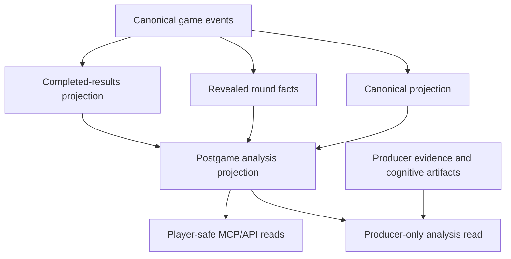
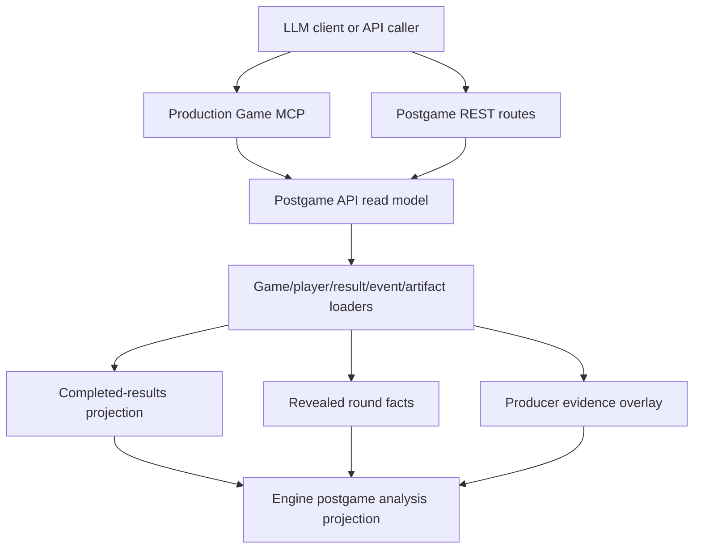

# Postgame MCP Analysis Surfaces - Plan

## Goal Capsule

- **Objective:** Add compact, LLM-native MCP/API postgame read surfaces so ChatGPT, Claude, Grok, and similar clients can analyze an Influence game in one or two calls without reconstructing the story from raw event Lego bricks.
- **Product authority:** Persisted canonical game events and canonical projections remain the source of truth. Completed-results and revealed-round-facts projections are the public fact layer this work builds on.
- **Execution profile:** Code implementation plan over the existing engine projection, API read-model, REST route, and Production Game MCP seams.
- **Stop conditions:** Stop and ask if the acceptance facts cannot be represented as canonical events, if a player-safe surface would need hidden/private evidence to satisfy a required fact, or if a migration would need to backfill facts rather than add read-path indexes.
- **Tail owner:** `ce-work`, `/goal`, or a human implementer can execute the units in dependency order. No deployment or PR creation is required by this plan unless separately requested.
- **Planning status:** No launch-blocking open questions remain. The missing `edge-smoke-dusk` row is handled as a deterministic fixture requirement, and `ratingDelta` is optional with diagnostics until a durable per-game rating-change source exists.

---

## Product Contract

### Summary

Build a small v0 family of player-safe and producer-only postgame MCP/API reads over existing canonical facts.
The core deliverable is a shared postgame analysis projection that returns compact game, round, jury, turning-point, and player-arc DTOs with stable IDs, display names, schema versions, diagnostics, and optional evidence references.

### Problem Frame

Influence already has the important truth substrate: canonical events, projections, completed game results, revealed round facts, MCP game reads, and a producer-only trace lane.
The gap is packaging.
Current tools can tell an LLM the facts, but normal postgame questions still force the model to call multiple low-level tools and reconstruct winner logic, boot order, jury votes, vote blocs, and player arcs itself.
That produces long tool sessions, higher token use, and more chances for confident but wrong analysis.

The v0 should make "Analyze `edge-smoke-dusk`" feel boring in the best way: one brief call for the spine, one drilldown call when the user asks for jury or player detail, and no raw log reconstruction unless explicitly requested.

### Key Decisions

- **Derived facts over speculative narration.** Player-safe surfaces may summarize deterministic facts and labeled hints, but they must not turn voting similarity into secret-alliance certainty or public speeches into truth.
- **One shared projection, many tools.** The MCP tools and API endpoints should read from one shared postgame analysis projection helper so each surface does not re-derive boot order, round summaries, majority alignment, jury facts, and diagnostics differently.
- **Round summaries are part of v0.** Compact round summaries should be an internal DTO returned through the brief, player summary, and turning-point reads rather than a separate public tool on day one.
- **Producer analysis is gated, not blended.** Private reasoning, strategy artifacts, trust graphs, prompt/debug notes, and hidden producer evidence belong only behind the producer surface.
- **Read-time first, materialize later.** Start with deterministic read-time derivation over one game's canonical facts. Add caches or summary tables only if measured latency or repeated calls justify the carrying cost.

### Actors

- A1. **LLM client:** ChatGPT, Claude, Grok, Codex, or another MCP/API caller trying to answer postgame analysis questions accurately with limited context.
- A2. **Agent owner:** A signed-in user asking what games their agent played and how that agent performed.
- A3. **Viewer/player-safe reader:** A public or authorized game reader who may see canonical/revealed facts but not private producer material.
- A4. **Producer:** A privileged maintainer using private traces, cognitive artifacts, and strategy/debug evidence to understand or tune the engine.
- A5. **Postgame projection helper:** The shared derived-fact layer that compacts canonical facts into stable DTOs for tools and API routes.

### Requirements

**Shared Projection and Payload Contract**

- R1. The v0 must preserve canonical game events and canonical projections as the source of truth and must not introduce a competing outcome authority.
- R2. The shared postgame analysis projection must derive game brief, compact round summaries, jury facts, player arcs, turning points, and diagnostics from canonical events, completed-results facts, revealed round facts, game/player rows, and authorized producer evidence only where allowed.
- R3. Every public payload must include `schemaVersion`, stable IDs, display names, source/availability diagnostics, and enough confidence metadata for an LLM to cite facts without guessing. For MCP tools, the same DTO shape must be declared as an `outputSchema` matching the returned `structuredContent`.
- R4. Public payloads must stay compact by default, with `detailLevel: "brief" | "standard" | "full"` where useful and `includeEvidence=true` required before returning event references or evidence pointers. MCP tool results should return typed `structuredContent` plus a compact JSON/text compatibility copy only when the host or current MCP client path still needs it.
- R5. No player-safe tool may return giant raw logs, raw canonical envelopes, source pointers, private trace metadata, prompts, raw provider responses, private reasoning, or hidden strategy artifacts by default.
- R6. Diagnostics must distinguish unavailable facts, degraded facts, and partially derived facts without exposing producer internals to player-safe callers.

**MCP/API Surfaces**

- R7. `list_agent_games(agentId | agentName, limit?, cursor?, detailLevel?)` must return games for one owned or visible agent with game id, slug, status, track type, timestamps, placement, survival/win flags, eliminated round, winner name, finalists, jury vote count when applicable, and rating delta when available.
- R8. `read_game_brief(gameIdOrSlug, detailLevel?, includeEvidence?)` must return the compact one-call postgame brief: metadata, winner, finalists, final vote, boot order, round/player counts, dominant empowered players, most exposed players, unanimous or near-unanimous votes, major eliminations, notable endgame sequence, compact round summaries, and diagnostics.
- R9. `read_jury_breakdown(gameIdOrSlug, includeEvidence?)` must return finalists, winner, vote counts, per-juror votes, juror eliminated round, derivable ally/betrayer/eliminated-by-finalist flags, and concise narrative hints that stay grounded in vote facts.
- R10. `read_player_game_summary(gameIdOrSlug, player, detailLevel?, includeEvidence?)` must return one player's placement, status, elimination round, win flag, votes cast by round, empower/expose votes received by round, Council votes cast/received, powers used, shields received, majority alignment, nomination/at-risk moments, endgame/jury facts, and a compact readable summary.
- R11. `read_game_turning_points(gameIdOrSlug, detailLevel?, includeEvidence?)` must return deterministic turning points with round, enum type, players involved, evidence fields, diagnostics, and a short generated-safe description.
- R12. `read_producer_game_analysis(gameIdOrSlug, detailLevel?, includeEvidence?, maxBytes?)` must require producer access and may include inferred alliances, private strategy pivots, public/private discrepancies, betrayal moments, threat-management analysis, jury-management analysis, strategic grades, model behavior observations, and debugging notes.
- R13. API parity should exist for the same reads where product or testing needs it, with player-safe endpoints separated from producer routes by auth and URL shape.

**Compact Round Summaries**

- R14. The shared projection must produce a compact round summary for each completed round with round number, phase/end state, empowered player, vote summary, expose pressure, power action, Council candidates, eliminated player, majority-alignment signal, key risk moments, and diagnostics.
- R15. Round summaries must be derived once per game read and reused by the game brief, player summary, and turning-point surfaces.
- R16. Round summaries may include vote-bloc or majority-cohort hints only when backed by explicit vote alignment evidence and must label those hints with confidence.

**Access Boundaries**

- R17. Player-safe `games:read` surfaces may expose only accessible games and sanitized player-visible facts.
- R18. Producer-only surfaces may use reasoning, thinking, strategy artifacts, trust/vote graphs, and private trace evidence, but they must stay absent from normal `games:read` tool listings and API responses.
- R19. Existing active-match action boundaries remain unchanged; these postgame reads must not create voting, Mingle, lobby, diary, timer, phase, moderation, or agent-mutation authority.

**Data Loading and Index Viability**

- R20. A single-game postgame read must load game identity, players, terminal result, persisted canonical events ordered by sequence, completed-results facts, revealed round facts, and authorized producer artifacts as needed without issuing per-round event queries.
- R21. Planning must add or verify indexes for the agent-centered discovery path, especially `game_players.agent_profile_id`, `game_players.user_id`, `games.created_by_id`, and any missing `game_players.game_id` lookup support.
- R22. Event-log reads do not need a new v0 index beyond the existing game/sequence path unless measurement proves otherwise.
- R23. Producer analysis must rely on the existing cognitive-artifact game/type/actor, game/phase/round, game/action, and game/event-sequence access patterns before adding more indexes.

**Acceptance Fixture**

- R24. v0 tests must add a deterministic `edge-smoke-dusk` fixture or DB-backed snapshot rather than depending on a live row.
- R25. The fixture must prove Lilith Voss has completed games, `edge-smoke-dusk` is listed for her, Lilith won, the final vote was 4-3 over Kestrel, Shadowtech was repeatedly empowered early, boot order is returned, jury breakdown is returned, Lilith's voting pattern was majority-aligned, Shadowtech/Kestrel/Nova did not vote for Lilith, and early eliminated players supplied Lilith's winning votes.
- R26. A tool-call sequence test must show that "Analyze `edge-smoke-dusk`" is answerable with `read_game_brief` plus at most one drilldown call and no raw event-log reconstruction by the LLM.

### Key Flows

- F1. **Analyze a completed game**
  - **Trigger:** An LLM client receives "Analyze `edge-smoke-dusk`."
  - **Actors:** A1, A5.
  - **Steps:** The client calls `read_game_brief`, reads winner/final vote/boot order/round summaries/turning-point hints, then calls `read_jury_breakdown` or `read_player_game_summary` only if the user asks for that detail.
  - **Outcome:** The answer cites compact structured facts rather than rebuilding the game from `filter_events`.

- F2. **List an agent's history**
  - **Trigger:** An agent owner asks which games Lilith Voss has played.
  - **Actors:** A1, A2, A5.
  - **Steps:** The client calls `list_agent_games` by agent id or name, receives compact rows with outcomes, and chooses a game slug for deeper analysis.
  - **Outcome:** The agent history is answerable without scanning all visible games.

- F3. **Explain one player's arc**
  - **Trigger:** A user asks why a player won, lost, or mattered.
  - **Actors:** A1, A3, A5.
  - **Steps:** The client calls `read_player_game_summary`, reads majority alignment, votes cast/received, power/risk moments, endgame/jury facts, and a readable summary.
  - **Outcome:** The explanation is grounded in round facts and player-specific ledgers.

- F4. **Producer reviews strategy**
  - **Trigger:** A producer asks what the model/agent behavior reveals beyond public facts.
  - **Actors:** A1, A4, A5.
  - **Steps:** The producer client calls `read_producer_game_analysis`, receives private strategy overlays and debug observations tied back to canonical anchors.
  - **Outcome:** Tuning analysis can use hidden evidence without leaking it into player-safe surfaces.

### Acceptance Examples

- AE1. **Covers R7, R24, R25.** Given an owned or visible agent named Lilith Voss and the `edge-smoke-dusk` fixture, when an MCP client calls `list_agent_games(agentName: "Lilith Voss")`, then the response includes `edge-smoke-dusk`, `status: "completed"`, `won: true`, `placement: 1`, finalists, and final jury vote count.
- AE2. **Covers R3, R8, R14, R25.** Given `edge-smoke-dusk`, when an MCP client calls `read_game_brief`, then the tool advertises an `outputSchema` matching its structured result and the response states Lilith won 4-3 over Kestrel, returns boot order, includes Shadowtech as repeatedly empowered early, and includes compact round summaries.
- AE3. **Covers R9, R25.** Given `edge-smoke-dusk`, when an MCP client calls `read_jury_breakdown`, then the response shows Shadowtech, Kestrel, and Nova did not vote for Lilith and shows early eliminated jurors supplied Lilith's winning votes.
- AE4. **Covers R10, R25.** Given `edge-smoke-dusk`, when an MCP client calls `read_player_game_summary(player: "Lilith Voss")`, then the response shows Lilith's placement, win flag, final vote facts, majority-aligned voting pattern, and relevant risk/endgame facts.
- AE5. **Covers R11, R16.** Given a game with repeated vote alignment but no private alliance evidence, when an MCP client calls `read_game_turning_points`, then the response can say a voting cohort controlled rounds with evidence and confidence, but must not label it a confirmed secret alliance.
- AE6. **Covers R17, R18.** Given the same game and a non-producer `games:read` token, when tools are listed or called, then `read_producer_game_analysis` is unavailable and player-safe responses omit private reasoning and trace evidence.
- AE7. **Covers R20-R23.** Given a completed game with canonical events, when the postgame brief is read, then the server reads the game event log once for that game and derives round summaries in memory instead of querying events round by round.

### Success Criteria

- SC1. A normal LLM answer to "Analyze `edge-smoke-dusk`" needs one or two calls, not a dozen.
- SC2. The player-safe payloads are compact enough for multiple tool results to fit comfortably inside a ChatGPT tool context.
- SC3. The acceptance fixture proves every required `edge-smoke-dusk` fact without raw event-log reconstruction by the LLM.
- SC4. Producer-only strategy analysis can be useful for tuning while remaining clearly separated from public/player-safe facts.

### Scope Boundaries

- In scope: six v0 MCP tools, API parity where useful, shared postgame projection helpers, compact DTOs, compact round summaries, access/redaction boundaries, targeted indexes for agent discovery, and `edge-smoke-dusk` fixture coverage.
- Deferred for later: materialized postgame summary tables, separate vote-bloc/alliance graph endpoints, prose-heavy generated recaps, public reasoning snippets, UI changes beyond API/MCP consumers, and broad performance tuning before measurement.
- Out of scope: replacing canonical events, using transcripts as outcome truth, widening `games:read` to producer evidence, active-match actions, agent mutation, and making hidden strategy visible in player-safe postgame analysis.

### Dependencies / Assumptions

- The completed-results builder already exposes winner, finalists, player count, elimination order, rounds, jury ledger/counts, vote patterns, and availability diagnostics from canonical events.
- The revealed-round-facts builder already exposes sanitized standard vote, power, Council, and player-status facts with availability diagnostics.
- The production MCP server already separates `games:read` and `producer` tool visibility.
- The `edge-smoke-dusk` fixture data must be created or imported before the acceptance examples can become executable tests.
- `ratingDelta` is optional in v0 until planning verifies a durable source.

### Outstanding Questions

**Deferred to Planning**

- OQ1. Should API parity use dedicated `/postgame/*` routes, fold the brief into the existing results route with a view parameter, or expose both where product surfaces already need them?
- OQ2. What is the durable rating source for `ratingDelta`, and should missing rating deltas be omitted or returned as `null` with diagnostics?
- OQ3. Which evidence reference shape is compact enough for `includeEvidence=true` while still letting an LLM cite canonical facts accurately?
- OQ4. Are the proposed agent-discovery indexes sufficient under expected data volume, or should planning include an `EXPLAIN` check once the fixture and query shape exist?

**Planning Resolution**

- OQ1 resolves to sibling postgame routes beside the existing completed-results route, rather than changing the current results response shape.
- OQ2 resolves to `ratingDelta: null` or omitted plus diagnostics in v0. The repo currently updates account-level ELO without persisting per-game delta rows.
- OQ3 resolves to compact event references only when `includeEvidence=true`, with no raw canonical envelopes, source pointers, or private evidence in player-safe responses.
- OQ4 resolves to adding targeted agent-discovery indexes and verifying the expected query shape. Existing event-log indexes are sufficient for single-game reads unless measurement proves otherwise.

### Sources / Research

- `CONCEPTS.md` defines `Completed game results review`, `Games MCP read scope`, and `Producer MCP` boundaries.
- `docs/ideation/2026-07-01-postgame-mcp-api-surfaces-ideation.html` ranked the tool family and highlighted the missing `edge-smoke-dusk` fixture.
- `docs/plans/2026-06-26-001-feat-completed-game-results-review-plan.md` established canonical-events-first completed results and public postgame boundaries.
- `docs/plans/2026-06-19-004-feat-games-mcp-round-facts-plan.md` established sanitized `read_round_facts` as the player-safe round-fact companion.
- `packages/engine/src/completed-game-results.ts` and `packages/engine/src/revealed-round-facts.ts` already expose most underlying deterministic facts.
- `packages/api/src/game-mcp/server.ts` and `packages/api/src/game-mcp/read-model.ts` show the current production MCP read surface and scope split.
- `packages/api/src/db/schema.ts` shows existing event/cognitive-artifact indexes and missing agent-discovery indexes.

## Planning Contract

### Product Contract Preservation

The Product Contract above remains the behavioral authority for this plan. Planning resolves the deferred questions into implementation decisions without changing the canonical-events-first product scope, player-safe boundary, producer-only boundary, or `edge-smoke-dusk` acceptance facts.

### Key Technical Decisions

- KTD1. **Extend the existing projection pattern.** Add a postgame analysis projection in the engine layer that composes `buildCompletedGameResults`, `buildRevealedRoundFacts`, canonical replay output, and compact DTO reducers. Do not create per-tool bespoke derivation logic.
- KTD2. **Read-time v0, materialize later.** Derive postgame analysis on demand from one loaded game event log plus game/player/result rows. Do not add summary tables or caches until latency or repeated-call measurements justify them.
- KTD3. **Compact round summaries are shared DTOs.** Generate round summaries once per game read and let the brief, player summary, and turning-point surfaces reuse them.
- KTD4. **Player-safe bloc language is evidence-limited.** Public reads may say vote cohort, majority alignment, voting bloc, or confidence-scored hint when backed by vote facts. They must not label a secret alliance as confirmed without authorized producer evidence.
- KTD5. **Producer analysis overlays private evidence.** Producer-only analysis may join cognitive artifacts and private traces to canonical anchors, but the player-safe projection must remain useful without any private evidence.
- KTD6. **MCP output schemas are first-class for new tools.** Extend the Production Game MCP tool helper so new postgame tools advertise `outputSchema`, and return typed `structuredContent` while retaining a compact text compatibility copy if the current JSON-RPC path needs it.
- KTD7. **REST parity is sibling postgame routes.** Keep `GET /api/games/:id/results` as the current public completed-results surface. Add compact postgame routes beside it for LLM/API consumers instead of reshaping the existing response.
- KTD8. **Rating delta is optional in v0.** The current backend has account-level rating updates but no persisted per-game delta row. Return `ratingDelta` only when a durable source exists; otherwise include a diagnostic rather than recomputing or inventing it.
- KTD9. **Indexes target agent discovery, not single-game event reads.** Add indexes for owned/visible agent-game lookup paths. The existing `game_events(game_id)` and unique `(game_id, sequence)` paths cover the single-game postgame load.

### High-Level Technical Design

The shared API read model should load:

- Game identity, slug, status, track type, timestamps, and terminal result.
- Game players with stable player IDs, display names from persona JSON, `userId`, and `agentProfileId`.
- Persisted canonical events once per game through the existing event read model.
- Completed-results facts and revealed round facts from engine helpers.
- Cognitive artifacts and private trace snippets only for the producer read, with byte caps and explicit diagnostics.

### Data and Index Plan

- Add indexes in `packages/api/src/db/schema.ts` and a matching `packages/api/drizzle/0022_postgame_analysis_indexes.sql` migration:
  - `games_created_by_id_idx` on `games.createdById`.
  - `game_players_game_id_idx` on `gamePlayers.gameId`.
  - `game_players_user_id_idx` on `gamePlayers.userId`.
  - `game_players_agent_profile_id_idx` on `gamePlayers.agentProfileId`.
  - `agent_profiles_user_id_idx` on `agentProfiles.userId`.
- Do not add an event-log index in v0. `game_events_game_id_idx` and `game_events_game_id_sequence_unique` already support the load shape.
- Do not add producer artifact indexes in v0 unless tests or measurements show the existing game/type/actor, game/phase/round, game/action, or game/event-sequence indexes are insufficient.

### DTO Shape Principles

- Every postgame DTO returns `schemaVersion: 1`.
- Every player reference uses `{ id, name }`.
- Every game reference includes stable `gameId` plus `slug` when available.
- Every partially unavailable fact has a diagnostic with a stable code, severity, and player-safe message.
- `detailLevel` controls optional sections and collection sizes; it must not change the meaning of core fields.
- `includeEvidence=true` returns compact evidence references such as `{ eventType, round, sequence, playerIds }`, not raw event envelopes.
- Producer-only DTOs may include private reasoning summaries and artifact references, but must keep raw content behind explicit capped producer reads unless the producer tool asks for it.

### Implementation Constraints

- Preserve the canonical event log and canonical projection as the only outcome authority.
- Keep engine DTOs free of API database/storage imports.
- Keep player-safe and producer-only methods separate at both tool inventory and read-model call boundaries.
- Avoid broad prose generation. `readableSummary` and turning-point descriptions must be deterministic or generated-safe templates over derived facts.
- Do not retrofit `outputSchema` to every existing MCP tool unless doing so is a small helper-level improvement. The acceptance bar is every new postgame MCP tool.

### Sequencing

1. Build the engine projection and `edge-smoke-dusk` fixture.
2. Add API postgame read services, loaders, and indexes.
3. Add player-safe MCP tools with output schemas and structured content.
4. Add REST parity routes over the same service.
5. Add producer-only analysis overlay.
6. Update docs and run the full verification contract.

## Implementation Units

### U1. Engine Postgame Projection and Fixture Foundation

- **Goal:** Add the shared deterministic postgame projection that all MCP/API reads consume.
- **Requirements:** R1-R6, R14-R16, R24-R25, AE2-AE5, SC1-SC3; KTD1-KTD4.
- **Files:**
  - `packages/engine/src/postgame-analysis.ts`
  - `packages/engine/src/index.ts`
  - `packages/engine/src/completed-game-results.ts`
  - `packages/engine/src/revealed-round-facts.ts`
  - `packages/engine/src/__tests__/postgame-analysis.test.ts`
  - `packages/engine/src/__tests__/fixtures/edge-smoke-dusk.ts`
- **Approach:** Define compact DTO types for game brief, round summary, jury breakdown inputs, player arc inputs, turning points, diagnostics, and evidence references. Compose the new builder from completed results and revealed round facts, adding only derivations those lower-level helpers do not already provide: dominant empowered players, exposure leaders, majority alignment by round, nomination/risk moments, and deterministic turning-point classification.
- **Test Scenarios:**
  - `edge-smoke-dusk` builds a brief where Lilith Voss wins 4-3 over Kestrel.
  - Boot order, finalists, final vote counts, and player placements match the fixture.
  - Shadowtech is identified as repeatedly empowered early.
  - Compact round summaries include empowered player, expose pressure, Council candidates, eliminations, and diagnostics.
  - Vote-cohort hints are confidence-scored and do not claim confirmed secret alliances.
  - JSON output does not include raw event envelopes, source pointers, private reasoning, or artifact payloads.
- **Verification:** `bun test packages/engine/src/__tests__/postgame-analysis.test.ts packages/engine/src/__tests__/completed-game-results.test.ts packages/engine/src/__tests__/revealed-round-facts.test.ts`
- **Dependencies:** None.

### U2. API Postgame Read Service and Data Access

- **Goal:** Load completed postgame facts from Postgres once per game and expose compact service methods for MCP and REST.
- **Requirements:** R2, R7-R11, R14-R16, R20, R24-R26, AE1-AE7; KTD1-KTD4, KTD8.
- **Files:**
  - `packages/api/src/services/postgame-analysis.ts`
  - `packages/api/src/services/completed-game-results.ts`
  - `packages/api/src/game-mcp/read-model.ts`
  - `packages/api/src/__tests__/postgame-analysis.test.ts`
  - `packages/api/src/__tests__/production-game-mcp-read-model.test.ts`
  - `packages/api/src/__tests__/durable-run-test-utils.ts`
- **Approach:** Create a DB-backed service that resolves game ID or slug, loads players and terminal result, uses `getPersistedGameEvents` once, reuses completed-results projection inputs, and passes the resulting facts into the engine postgame builder. Add service methods for agent history, brief, jury, player summary, and turning points. Keep `ratingDelta` nullable or omitted with a diagnostic until a persisted per-game source exists.
- **Test Scenarios:**
  - Subject access can list completed games for an owned/visible agent named Lilith Voss and sees `edge-smoke-dusk`.
  - An inaccessible game is rejected for subject access and available for producer access.
  - The brief uses one persisted event-log read for the game and derives round summaries in memory.
  - Missing per-game rating delta produces a diagnostic and does not block the agent-games response.
  - Degraded or invalid event logs return diagnostics rather than fabricated postgame facts.
- **Verification:** `bun test packages/api/src/__tests__/postgame-analysis.test.ts packages/api/src/__tests__/production-game-mcp-read-model.test.ts`
- **Dependencies:** U1.

### U3. Agent Discovery Index Migration

- **Goal:** Make agent-centered game discovery viable without adding unrelated summary tables.
- **Requirements:** R7, R20-R22, AE1, AE7; KTD2, KTD8, KTD9.
- **Files:**
  - `packages/api/src/db/schema.ts`
  - `packages/api/drizzle/0022_postgame_analysis_indexes.sql`
  - `packages/api/drizzle/meta/_journal.json`
  - `packages/api/src/__tests__/db.test.ts`
  - `packages/api/src/__tests__/production-game-mcp-read-model.test.ts`
- **Approach:** Add explicit indexes for the subject-claims and agent-history paths: created games by owner, game players by game, game players by direct user, game players by agent profile, and agent profiles by owner. Keep the migration narrow. Do not add a materialized postgame table.
- **Test Scenarios:**
  - Schema/migration tests assert the new indexes exist.
  - Agent-history tests exercise direct user ownership and agent-profile ownership paths.
  - Event-log reads continue using existing game/sequence paths.
- **Verification:** `cd packages/api && DRIZZLE_MIGRATIONS_DIR=./drizzle bun test src/__tests__/db.test.ts src/__tests__/production-game-mcp-read-model.test.ts`
- **Dependencies:** U2 can be developed before this unit, but this unit must land before considering the plan done.

### U4. Player-Safe MCP Tools with Output Schemas

- **Goal:** Add the five player-safe postgame MCP tools and typed output schemas.
- **Requirements:** R3-R11, R17-R19, R24-R26, AE1-AE6, SC1-SC3; KTD3, KTD4, KTD6.
- **Files:**
  - `packages/api/src/game-mcp/server.ts`
  - `packages/api/src/game-mcp/read-model.ts`
  - `packages/api/src/__tests__/production-game-mcp-server.test.ts`
  - `packages/api/src/__tests__/production-game-mcp-read-model.test.ts`
- **Approach:** Extend the MCP tool helper to accept an optional `outputSchema`. Register `list_agent_games`, `read_game_brief`, `read_jury_breakdown`, `read_player_game_summary`, and `read_game_turning_points` under `games:read` or producer access. Return `structuredContent` matching each schema, and include a compact text compatibility copy only as needed by the existing server response style.
- **Test Scenarios:**
  - `tools/list` for `games:read` includes the five player-safe postgame tools with `outputSchema` and `readOnlyHint`.
  - `tools/list` for non-producer access does not include `read_producer_game_analysis`.
  - `read_game_brief` returns Lilith won, final vote 4-3, boot order, Shadowtech's early empowerment pattern, and compact round summaries.
  - `read_jury_breakdown` returns juror votes and shows Shadowtech, Kestrel, and Nova did not vote for Lilith.
  - `read_player_game_summary` returns Lilith's majority-aligned voting pattern.
  - Player-safe tool output does not contain private reasoning, trace metadata, raw provider payloads, or raw canonical envelopes.
- **Verification:** `bun test packages/api/src/__tests__/production-game-mcp-server.test.ts packages/api/src/__tests__/production-game-mcp-read-model.test.ts`
- **Dependencies:** U1, U2.

### U5. REST API Parity Routes

- **Goal:** Expose compact postgame reads through HTTP routes backed by the same service.
- **Requirements:** R7-R13, R17-R20, R24-R26, AE1-AE7; KTD7.
- **Files:**
  - `packages/api/src/routes/games.ts`
  - `packages/api/src/routes/agent-profiles.ts`
  - `packages/api/src/__tests__/games-api.test.ts`
  - `packages/api/src/__tests__/agent-profiles.test.ts`
  - `packages/web/src/lib/api.ts`
- **Approach:** Add sibling compact postgame endpoints beside the existing completed-results route, keeping the current results route stable. These routes are player-safe only; producer analysis must not live under the same public postgame URL shape. Add an authenticated agent-game-history API path under the agent-profile route family or reuse the existing player-history pattern if that produces the cleaner current route shape. Update the web API client types only if the frontend/shared client imports these route shapes.
- **Test Scenarios:**
  - `GET /api/games/:id/postgame/brief` returns the compact brief for a completed game by ID or slug.
  - `GET /api/games/:id/postgame/jury` returns the jury breakdown.
  - `GET /api/games/:id/postgame/players/:player/summary` resolves by stable ID or display name and returns one player arc.
  - `GET /api/games/:id/postgame/turning-points` returns deterministic turning points.
  - Agent-game history returns only games visible to the authenticated user.
  - Existing `GET /api/games/:id/results` tests remain green and unchanged in response shape.
- **Verification:** `bun test packages/api/src/__tests__/games-api.test.ts packages/api/src/__tests__/agent-profiles.test.ts`
- **Dependencies:** U2, U3.

### U6. Producer-Only Game Analysis

- **Goal:** Add the privileged analysis surface that can use private strategy and reasoning artifacts without leaking them to player-safe reads.
- **Requirements:** R5-R6, R12, R17-R19, R23, AE6, SC4; KTD4, KTD5.
- **Files:**
  - `packages/api/src/services/postgame-analysis.ts`
  - `packages/api/src/game-mcp/read-model.ts`
  - `packages/api/src/game-mcp/server.ts`
  - `packages/api/src/routes/admin.ts`
  - `packages/api/src/__tests__/production-game-mcp-server.test.ts`
  - `packages/api/src/__tests__/production-game-mcp-read-model.test.ts`
  - `packages/api/src/__tests__/games-api.test.ts`
- **Approach:** Add `read_producer_game_analysis` only to producer tool inventory. If REST parity is needed for producers, put it behind the existing admin route/auth boundary rather than the player-safe postgame route family. Reuse cognitive artifact and private-trace read models with explicit byte caps and diagnostics. Summarize private strategy pivots, public/private discrepancies, betrayal moments, threat and jury management, model behavior observations, and prompt/debug notes as producer evidence overlays tied to canonical event or round references.
- **Test Scenarios:**
  - Producer tool inventory includes `read_producer_game_analysis`; `games:read` inventory and calls reject it.
  - Producer analysis can include cognitive artifact summaries and private trace references capped by `maxBytes`.
  - Player-safe brief, jury, player summary, and turning-points output remain clean when producer artifacts exist for the same game.
  - Producer diagnostics distinguish unavailable artifact capture from denied access.
- **Verification:** `bun test packages/api/src/__tests__/production-game-mcp-server.test.ts packages/api/src/__tests__/production-game-mcp-read-model.test.ts packages/api/src/__tests__/games-api.test.ts`
- **Dependencies:** U2, U4.

### U7. Documentation and Tool-Call Acceptance Coverage

- **Goal:** Document the new postgame surfaces and prove the intended LLM call pattern.
- **Requirements:** R3-R6, R13, R17-R19, R24-R26, AE1-AE7, SC1-SC4.
- **Files:**
  - `docs/game-mcp-production-oauth.md`
  - `docs/reasoning-transcript-observability.md`
  - `docs/local-model-evaluation.md`
  - `README.md`
  - `DEVELOPMENT.md`
  - `packages/api/src/__tests__/production-game-mcp-server.test.ts`
  - `packages/api/src/__tests__/production-game-mcp-read-model.test.ts`
- **Approach:** Update MCP documentation with the new tools, output-schema expectation, player-safe versus producer-only boundary, and the "brief plus one drilldown" usage pattern. Keep docs clear that canonical events remain the source of truth and that reasoning/transcript artifacts are not public outcome facts. Add an acceptance-style test or fixture narrative proving the desired `edge-smoke-dusk` call sequence.
- **Test Scenarios:**
  - A simulated MCP client can answer "Analyze `edge-smoke-dusk`" with `read_game_brief` plus no more than one drilldown call.
  - Docs do not tell clients to reconstruct postgame analysis from `filter_events` for normal analysis.
  - Docs do not imply true per-agent ELO or per-game rating delta exists before a durable source is added.
- **Verification:** `bun test packages/api/src/__tests__/production-game-mcp-server.test.ts packages/api/src/__tests__/production-game-mcp-read-model.test.ts`
- **Dependencies:** U4, U5, U6.

## Verification Contract

### Targeted Gates

- Engine postgame projection: `bun test packages/engine/src/__tests__/postgame-analysis.test.ts packages/engine/src/__tests__/completed-game-results.test.ts packages/engine/src/__tests__/revealed-round-facts.test.ts`
- API service and read model: `bun test packages/api/src/__tests__/postgame-analysis.test.ts packages/api/src/__tests__/production-game-mcp-read-model.test.ts`
- MCP tool inventory and schema behavior: `bun test packages/api/src/__tests__/production-game-mcp-server.test.ts packages/api/src/__tests__/production-game-mcp-read-model.test.ts`
- REST parity: `bun test packages/api/src/__tests__/games-api.test.ts packages/api/src/__tests__/agent-profiles.test.ts`
- Migration/index coverage: `cd packages/api && DRIZZLE_MIGRATIONS_DIR=./drizzle bun test src/__tests__/db.test.ts`

### Baseline Gates

- Fast repo baseline: `bun run test`
- Typecheck and lint baseline: `bun run check`
- DB-backed API baseline when touching migrations/read models: `bun run test:db`

DB-backed tests require local Postgres on `127.0.0.1:54320`. If a sandboxed run reports `ECONNREFUSED`, rerun with the expected local DB access before concluding Postgres is down.

### Acceptance Proof

The final verification notes must explicitly state whether the following are proven by tests:

- An MCP client can list completed games for "Lilith Voss" and see `edge-smoke-dusk`.
- `read_game_brief("edge-smoke-dusk")` returns Lilith won, final vote 4-3 over Kestrel, boot order, Shadowtech's repeated early empowerment, compact round summaries, and diagnostics.
- `read_jury_breakdown("edge-smoke-dusk")` returns the per-juror ledger and shows Shadowtech, Kestrel, and Nova did not vote for Lilith.
- `read_player_game_summary("edge-smoke-dusk", "Lilith Voss")` returns Lilith's majority-aligned voting pattern.
- Early eliminated jurors supplied Lilith's winning votes.
- The call-pattern test uses `read_game_brief` plus at most one drilldown call and no raw event-log reconstruction.

## Definition of Done

- The plan's Product Contract requirements R1-R26 are implemented or explicitly documented as deferred where the Product Contract already allows it.
- The new postgame analysis builder lives over canonical facts and does not replace canonical events, completed-results facts, or revealed-round-facts helpers.
- All six v0 MCP tools exist, with `outputSchema` for each new tool and `structuredContent` matching the advertised schema.
- Player-safe MCP and REST reads are sanitized and do not expose private traces, reasoning, raw provider payloads, source pointers, raw canonical envelopes, or producer-only diagnostics.
- Producer-only analysis is absent from normal `games:read` tool listings and rejected on player-safe calls.
- Compact round summaries are derived once and reused by game brief, player summary, and turning-point reads.
- Agent-game discovery is backed by the planned indexes or by an explicitly justified equivalent migration.
- The deterministic `edge-smoke-dusk` fixture proves all named acceptance facts.
- Existing completed-results route behavior remains compatible with current tests.
- Documentation explains the new postgame call pattern, output-schema contract, player-safe boundary, producer-only boundary, and `ratingDelta` limitation.
- `bun run test`, `bun run check`, and the targeted DB-backed gates in the Verification Contract pass, or any unable-to-run gate is reported with the exact blocker.
- Dead-end implementation attempts, temporary scripts, and unused DTOs are removed before handoff.
