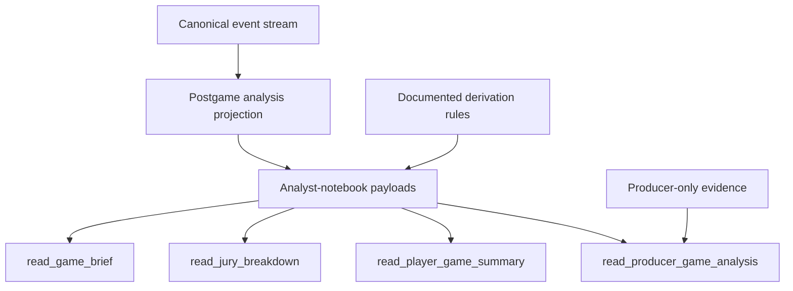
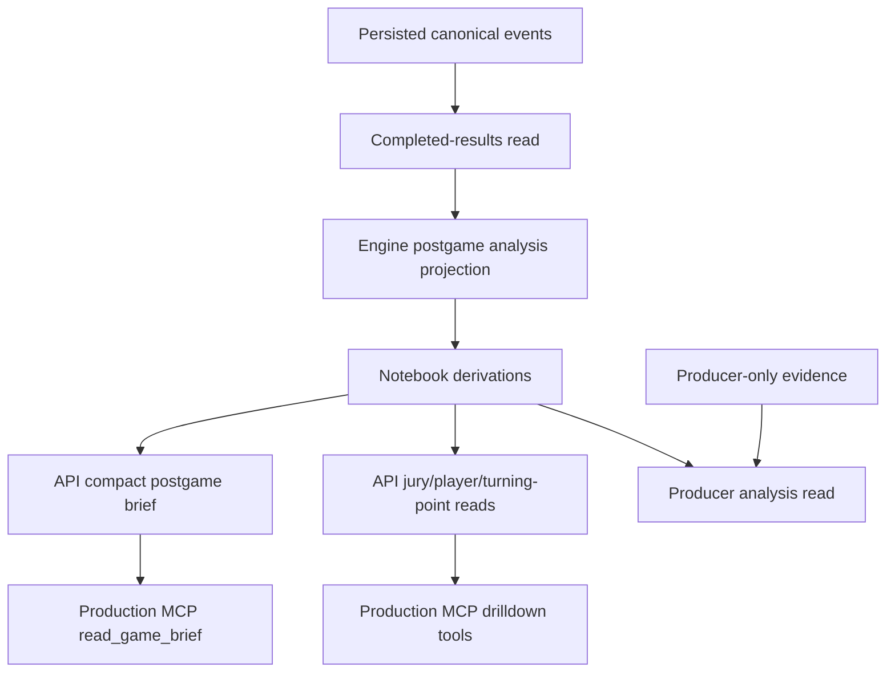
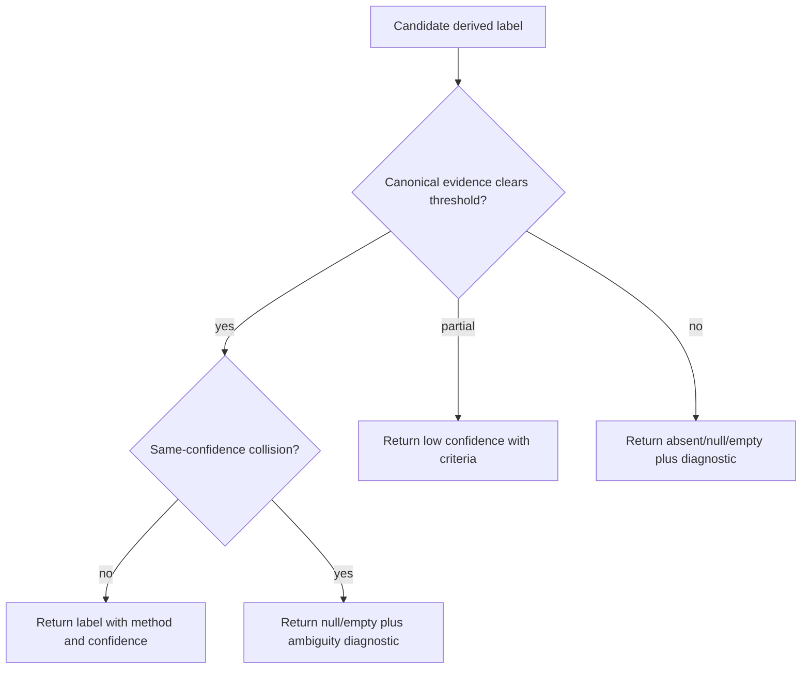

# Postgame Analysis Payload Polish - Plan

## Goal Capsule

- **Objective:** Polish existing postgame analysis payloads so ChatGPT, Claude, Grok, producer tools, and future replay UI can explain a completed Influence game from deterministic analyst-notebook projections.
- **Product authority:** The canonical event stream and canonical projections remain the source of truth. Derived payload fields may summarize, classify, or omit facts, but they must not invent social, strategic, or causal claims.
- **Execution profile:** Code implementation plan over the existing engine projection, API postgame service, REST routes, Production Game MCP read model, MCP schemas, tests, and docs.
- **Planning status:** No launch-blocking questions remain. Planning resolves rename compatibility, unsupported derivation rendering, and conservative thresholds in the Planning Contract.
- **Stop condition:** Stop if a requested field cannot be derived from canonical facts or authorized producer-only evidence without speculation.
- **Tail owner:** `ce-work`, `/goal`, or a human implementer can execute the units in dependency order and verify against the Verification Contract.

---

## Product Contract

### Summary

Add a v0.2 polish contract to the existing postgame analysis surfaces.
The payloads should read like an analyst's notebook while staying deterministic: first-read summaries, clear field names, documented heuristics, confidence on derived objects, and silence when the facts do not support a claim.

### Problem Frame

The first postgame analysis pass already created useful structured surfaces.
The remaining issue is presentation and trust.
The most explanatory facts are still spread across summary fields, round rows, jury objects, cohorts, and turning points, which makes an LLM decide what mattered before it can explain the game.

That shape tempts models and human tools into filling gaps with plausible narration.
For this product, a missing or low-confidence derivation is better than a confident false recap.
The v0.2 contract should make every analytical label auditable, compact, and safe to reuse in Discord recaps, dashboards, match history, AI commentary, and replay UI.

### Key Decisions

- **Fail closed on interpretation.** A derived field may be omitted, empty, nullable, or low-confidence when the evidence is muddy. It must not stretch the facts to fill a nice-looking recap.
- **Keep the brief as the primary read.** `read_game_brief` remains the one-call spine for LLMs, with drilldown tools adding detail instead of compensating for a thin brief.
- **Treat labels as thresholded derivations.** Momentum, player shape, vote cohorts, jury narrative, and highlighted eliminations need documented criteria and confidence because they are not raw facts.
- **Use readable deterministic templates.** Recap text should sound like a concise sports recap, not a database label or generated essay.
- **Separate public truth from producer overlays.** Producer-only analysis can use private evidence, but player-safe payloads must remain useful without it and must not leak it.

### Actors

- A1. **LLM client:** ChatGPT, Claude, Grok, Codex, or another caller trying to explain a completed game with limited tool context.
- A2. **Human producer:** A maintainer or showrunner using postgame reads for tuning, recaps, and operational review.
- A3. **Viewer or player-safe reader:** A user who may see completed-game facts but not private reasoning or producer evidence.
- A4. **Future replay UI:** A product surface that can render the same deterministic projections as headlines, chips, timelines, and drilldowns.
- A5. **Postgame projection helper:** The shared derived-fact layer that turns canonical facts into reusable payloads.

### Requirements

**Truth and Derivation Contract**

- R1. Public postgame payloads must derive from canonical events, completed/revealed projections, and player-safe game metadata only.
- R2. Producer-only payloads may add authorized private evidence, but private evidence must be separated from the public deterministic summary and absent from normal `games:read` responses.
- R3. Every derived object must expose `confidence` as `high`, `medium`, or `low`, where confidence describes the derivation and not the underlying canonical facts.
- R4. Every thresholded derived object must expose a short `derivationMethod` or equivalent machine-readable rule name unless the object is a direct canonical fact.
- R5. Unsupported derivations must fail closed through omission, an empty collection, `null`, or a diagnostic rather than a forced label.
- R6. Public prose fields must avoid strategy speculation, motive claims, secret alliance claims, and causal language that is not directly supported by canonical facts.
- R7. The documented heuristics must make clear which facts are direct canonical facts, which facts are deterministic summaries, and which facts are confidence-scored classifications.

**First-Read Analyst Notebook**

- R8. Every major postgame analysis payload must expose `executiveSummary` as the first analysis field after required schema/source metadata.
- R9. `executiveSummary` must contain at most five bullets in stable order and must be generated entirely from canonical facts or high-confidence derivations.
- R10. The summary bullet order must prefer outcome, visible control pattern, decisive elimination, jury split, and highest-confidence notable pressure or anomaly.
- R11. Summary bullets must be short factual sentences and must not include editorial judgment, unstated motive, or strategy speculation.

**Readable Recap Fields**

- R12. Turning-point descriptions must use concise deterministic templates such as "controlled power for six consecutive rounds" instead of awkward analytical phrasing.
- R13. Each round summary must include a one-sentence `headline` when canonical facts support a meaningful round-level event.
- R14. Round headline selection must use a documented precedence order so the same round facts always produce the same headline.
- R15. `majorEliminations` must be replaced by or migrated to `highlightedEliminations` with deterministic `highlightReasons`.
- R16. Highlighted elimination reasons must include documented inclusion rules such as first elimination, final pre-jury elimination, first jury member, endgame elimination, winner's final opponent, top empowered player, or top exposed player.
- R17. Highlighted eliminations must dedupe by player/round and sort in stable game order.

**Cohorts, Jury, and Social Signals**

- R18. `derivedVoteCohorts` must remain in the payload and must continue to state that vote cohesion is not confirmed alliance membership.
- R19. Each derived vote cohort must include `size`, `firstObservedRound`, `lastObservedRound`, `sharedVotes`, `cohesionScore`, `confidence`, and the not-alliance note.
- R20. `cohesionScore` must be computed from explicit shared vote outcomes with a documented numerator and denominator.
- R21. Public cohort language must not claim hidden knowledge, private relationships, secret alliances, or intentional coordination.
- R22. Jury payloads must rename `nonWinnerSupporters` to `runnerUpSupporters` and add `winnerSupporters`.
- R23. Jury payloads must include `juryNarrative` as deterministic bullets derived from final jury votes, juror elimination order, and final margin.
- R24. Jury narrative may describe early or late juror vote patterns only from elimination-order buckets, not inferred loyalty or social closeness.

**Game Flow and Player Shape**

- R25. `read_game_brief` must expose `gameMomentum` as a compact sequence of objective flow segments when a leader can be derived from documented indicators.
- R26. Momentum indicators may include empowerment streaks, majority vote control, repeated survival through danger, endgame progression, and final jury trajectory.
- R27. `gameMomentum` must omit ambiguous segments or mark them low-confidence when no leader clears the documented threshold.
- R28. Player summaries must include `overallGameShape` only when one documented classification clears threshold.
- R29. Allowed player-shape values are `power player`, `social survivor`, `under the radar`, `swing voter`, `consensus target`, and `jury favorite`.
- R30. Player-shape thresholds must be measurable from facts such as empowerment count, expose pressure, majority alignment, vote volatility, votes received, survival depth, and jury support.
- R31. When multiple player-shape thresholds collide or none clearly apply, the payload must return `null`, omit the field, or include a diagnostic rather than choosing a vibes-based label.

**Schemas, Compatibility, and Reuse**

- R32. MCP `outputSchema` definitions must explicitly declare every new or renamed field and must match the returned `structuredContent`.
- R33. Field renames must use a schema-version bump or temporary deprecated aliases with diagnostics; silent breaking renames are not acceptable.
- R34. API and MCP consumers must share the same projection objects so producer tools, Discord recaps, match history, and replay UI do not re-derive different stories.
- R35. Producer analysis payloads must begin with the same public deterministic summary before any private overlays.
- R36. The short text response attached to MCP tools must summarize the structured content without duplicating the entire JSON payload.

**Validation and Documentation**

- R37. Tests must prove `read_game_brief(edge-smoke-dusk)` can explain what happened, who visibly controlled power, where momentum shifted, the winner's path, and the jury split without additional raw-event calls.
- R38. Tests must cover at least one ambiguous or low-signal case where momentum, player shape, cohort, or jury narrative is omitted or marked low-confidence.
- R39. Tests must assert that public payloads do not expose private reasoning, raw traces, or confirmed-alliance claims from vote cohesion alone.
- R40. Documentation and code comments must describe every heuristic that can produce a derived label.

### Key Flows

- F1. **Brief-only LLM recap**
  - **Trigger:** A user asks an LLM to explain `edge-smoke-dusk`.
  - **Actors:** A1, A5.
  - **Steps:** The client calls `read_game_brief`, reads `executiveSummary`, then cites supporting round, jury, momentum, cohort, and highlighted-elimination facts from the same payload.
  - **Outcome:** The answer explains the game without raw event reconstruction or speculative analysis.

- F2. **Ambiguous derivation fails closed**
  - **Trigger:** A completed game has mixed power, split votes, or no clear player-shape threshold.
  - **Actors:** A1, A3, A5.
  - **Steps:** The projection evaluates the documented heuristic and returns no forced label, a low-confidence object, or a diagnostic.
  - **Outcome:** The client sees uncertainty as part of the payload instead of getting a polished falsehood.

- F3. **Producer review with private overlays**
  - **Trigger:** A producer opens a postgame analysis read for tuning or show review.
  - **Actors:** A2, A5.
  - **Steps:** The payload starts with the public deterministic summary, then adds private analysis blocks that are clearly separated and access-gated.
  - **Outcome:** Producer tools can use deeper evidence without changing what public readers or LLMs see.

- F4. **Replay UI renders the same story spine**
  - **Trigger:** A future replay UI needs timeline labels, jury chips, cohort badges, or recap cards.
  - **Actors:** A4, A5.
  - **Steps:** The UI consumes `headline`, `highlightedEliminations`, `gameMomentum`, `derivedVoteCohorts`, and jury supporter fields from the shared projection.
  - **Outcome:** UI labels match MCP/API recaps because the product uses one derivation contract.

### Acceptance Examples

- AE1. **Covers R8-R11, R37.** Given `edge-smoke-dusk`, when `read_game_brief` returns, then `executiveSummary` has no more than five stable-order bullets and can state the winner, final margin, visible control pattern, decisive elimination, and jury split only when those facts are supported.
- AE2. **Covers R12-R14.** Given repeated empowerment facts, when turning points and round summaries are built, then the description uses wording like "controlled power for six consecutive rounds" and round headlines use documented precedence.
- AE3. **Covers R15-R17.** Given elimination order and player metrics, when the brief returns highlighted eliminations, then each item includes reason codes and the algorithm explains why it was selected.
- AE4. **Covers R18-R21.** Given repeated shared votes, when derived cohorts are returned, then each cohort includes size, observation window, shared votes, cohesion score, confidence, and the not-confirmed-alliance note.
- AE5. **Covers R22-R24.** Given a 4-3 final jury vote, when the jury payload returns, then `winnerSupporters`, `runnerUpSupporters`, and `juryNarrative` describe supporter split and final margin without inferred loyalty.
- AE6. **Covers R25-R31, R38.** Given an ambiguous game with no clear flow leader or player-shape threshold, when the projection runs, then momentum or shape fields are omitted, nullable, diagnostic, or low-confidence rather than forced.
- AE7. **Covers R32-R36, R39.** Given a non-producer `games:read` caller, when MCP schemas and structured results are inspected, then new fields are declared, private evidence is absent, and vote cohesion is not labeled as confirmed alliance membership.

### Success Criteria

- SC1. `read_game_brief(edge-smoke-dusk)` is sufficient for a normal LLM to explain the outcome, visible control, momentum shifts, winner path, and jury split without raw event calls.
- SC2. Every analytical label in public payloads is either direct fact, documented deterministic summary, or confidence-scored derivation.
- SC3. Unsupported or ambiguous derivations are visible as absence, diagnostics, nulls, or low confidence rather than false precision.
- SC4. MCP `outputSchema` coverage and tests catch drift between declared payloads and returned `structuredContent`.
- SC5. Producer-only additions do not change the public truth contract or leak hidden evidence into player-safe reads.

### Scope Boundaries

- In scope: existing postgame analysis payloads, deterministic summary fields, readability templates, highlighted elimination rules, cohort evidence fields, jury supporter fields, momentum segments, player-shape classifications, confidence metadata, schemas, tests, and documentation.
- Deferred for later: replay UI implementation, materialized analysis tables, long-form generated recaps, richer producer-only strategy grading, dashboard redesigns, and new standalone micro-tools for each derived concept.
- Out of scope: adding new raw data sources, replacing canonical events as truth, transcript-based outcome inference, hidden social graph inference, public private-trace exposure, and LLM-authored facts.

### Dependencies / Assumptions

- The existing postgame projection already exposes enough canonical facts to derive the requested polish fields for high-signal games.
- `edge-smoke-dusk` remains the target golden fixture for proving one-call brief quality.
- JSON field order is not a schema guarantee, but builder insertion order and tests can keep the first-read analysis fields stable for real clients.
- Planning will choose whether unsupported derivations render as absent fields, `null`, empty arrays, low-confidence objects, diagnostics, or a consistent mix by field type.

### Outstanding Questions

No launch-blocking questions remain.
The Planning Contract resolves rename compatibility, unsupported derivation rendering, numeric thresholds, and player-shape cardinality.

### Sources / Research

- `docs/plans/2026-07-01-001-feat-postgame-mcp-analysis-surfaces-plan.md` established the v0 postgame analysis surface family and canonical-events-first boundary.
- `docs/ideation/2026-07-01-postgame-mcp-api-surfaces-ideation.html` captured the v0.2 polish ideas, ranking, and guardrails.
- `packages/engine/src/postgame-analysis.ts` contains the existing postgame projection, turning-point language, jury breakdown, round summaries, and elimination selection.
- `packages/api/src/services/postgame-analysis.ts` contains the compact brief, derived vote cohorts, and MCP/API-facing projection helpers.
- `packages/api/src/game-mcp/server.ts` contains Production Game MCP tool registration and output schema declarations.
- `docs/reasoning-transcript-observability.md` documents why public postgame surfaces must stay distinct from private reasoning and producer evidence.
- [Model Context Protocol Tools specification](https://modelcontextprotocol.io/specification/2025-06-18/server/tools) documents `structuredContent` and `outputSchema` expectations for tool results.
- [OpenAI Apps SDK reference](https://developers.openai.com/apps-sdk/reference/) documents transcript-visible structured content and hidden `_meta` separation for tool results.

---

## Planning Contract

### Product Contract Preservation

Product Contract requirements, flows, acceptance examples, success criteria, and scope boundaries are unchanged.
Planning resolves OQ1-OQ4 below without changing the v0.2 product scope.

### Planning Resolutions

- OQ1. Use a postgame payload schema version bump for affected postgame analysis payloads and keep temporary deprecated aliases for `majorEliminations` and `nonWinnerSupporters` with diagnostics for one compatibility window.
- OQ2. Render unsupported derivations by field shape: omit unsupported summary bullets, use empty arrays plus diagnostics for list fields, use `null` plus diagnostics for singular classifiers, and use low-confidence objects only when partial evidence exists.
- OQ3. Use conservative thresholds that require repeated objective evidence for cohorts, momentum, and player shape; a tied or one-off signal does not produce a confident label.
- OQ4. Keep `overallGameShape` singular and nullable for v0.2. Revisit multi-label player shape only if real fixtures show frequent useful collisions.

### Key Technical Decisions

- KTD1. **Engine owns canonical derivations.** Add the new derived objects and heuristics in `packages/engine/src/postgame-analysis.ts` so API, MCP, producer analysis, and future replay UI consume one projection instead of re-deriving story facts.
- KTD2. **API owns compaction and compatibility.** Keep `packages/api/src/services/postgame-analysis.ts` responsible for detail-level trimming, deprecated aliases, and route result shapes, not for deciding analytical truth.
- KTD3. **Derived prose is structured.** Represent analyst lines such as `executiveSummary`, `headline`, and `juryNarrative` as compact derived-line objects with `text`, `confidence`, and `derivationMethod`, rather than bare strings.
- KTD4. **Compatibility is explicit.** Bump the affected postgame payload schema to v2, keep deprecated aliases for renamed fields during v0.2, and emit diagnostics when an alias is present.
- KTD5. **Ambiguity fails closed by field type.** Optional list fields return empty arrays plus diagnostics; singular classifiers such as `overallGameShape` return `null` plus diagnostics; partial-but-real evidence returns low confidence with criteria.
- KTD6. **Cohort scoring stays evidence-shaped.** `cohesionScore` is shared controlled rounds divided by eligible observed majority rounds, rounded to two decimals, and cohorts require at least two shared rounds before they are surfaced.
- KTD7. **Momentum is a sparse segment list.** `gameMomentum` records only visible flow changes supported by repeated empowerment, repeated majority control, endgame survival after a prior leader is eliminated, or final jury result; it is not a round-by-round ranking.
- KTD8. **Player shape is singular and conservative.** `overallGameShape` appears only when one classification clears threshold without a same-confidence collision; otherwise it is `null` with a diagnostic.
- KTD9. **MCP schemas remain first-class.** `packages/api/src/game-mcp/server.ts` must declare the new fields in `outputSchema`, and MCP text content must stay a short summary instead of JSON duplication.
- KTD10. **Producer payloads start public, then overlay.** `read_producer_game_analysis` should include the same public deterministic summary before private-only analysis blocks, preserving the public/private boundary from `CONCEPTS.md`.

### High-Level Technical Design

### Heuristic Decisions

**Executive Summary**

- Outcome bullet appears when winner, runner-up, final vote, and margin are available.
- Visible control bullet appears when a player controls power for at least three total rounds or at least two consecutive resolved rounds.
- Decisive elimination bullet appears from the highest-priority highlighted elimination.
- Jury split bullet appears when final jury vote is available and has a margin.
- Pressure/anomaly bullet appears only when one high-confidence near miss, under-pressure finalist, or low-vote finalist fact is available.

**Round Headline Precedence**

1. Elimination in the round.
2. Endgame or Tribunal transition.
3. Repeat empowerment streak.
4. Survival through Council or endgame danger.
5. Shield or power action that changes the candidate set.
6. Majority cohort controls the vote.
7. No headline when only routine facts are available.

**Highlighted Eliminations**

- Include first elimination, final pre-jury elimination, first jury member, endgame eliminations, winner's final opponent, top-two empowered players, and top-two exposed players.
- Attach all matching reason codes and dedupe by player/round.
- Sort by elimination round, then by reason priority, then player name.

**Derived Vote Cohorts**

- Surface cohorts only when at least two players share at least two majority-control rounds.
- `sharedVotes` records each shared round, target, and basis.
- `cohesionScore` equals shared controlled rounds divided by eligible observed majority rounds for that exact player set.
- Confidence is high at `0.75` or above with at least three shared rounds, medium at `0.50` or above with at least two shared rounds, and low otherwise.

**Jury Narrative**

- `winnerSupporters` and `runnerUpSupporters` are direct juror lists from final vote ledger.
- Early/late juror bullets split jurors by elimination order midpoint.
- Final-margin bullets come from `PostgameFinalVote.margin`.
- Narrative bullets never describe loyalty, friendship, debt, or alliance unless future producer-only evidence explicitly supports it.

**Game Momentum**

- Power-control segments require at least two consecutive empowerment rounds for the same player or at least three total empowerment rounds.
- Majority-control segments require the same cohort or player-led target pattern across at least two eligible rounds.
- Endgame segments may start when the prior visible leader is eliminated and a finalist survives to final vote.
- Jury-result segments may name the winner at the final round when final vote is available.
- Segments are sparse, stable-sorted by first observed round, and omitted when indicators disagree without a clear documented winner.

**Overall Game Shape**

- `power player`: top empowered count is at least three or at least 35 percent of resolved rounds.
- `social survivor`: finalist or winner survives at least two at-risk moments while not qualifying as `power player`.
- `under the radar`: finalist or winner has no more than one expose vote received, no more than one Council vote received, and no Council nominations.
- `swing voter`: player has at least two majority-aligned and two non-aligned resolved votes.
- `consensus target`: player leads exposure or Council votes in at least two rounds, or is eliminated by a near-unanimous vote.
- `jury favorite`: finalist receives the most jury votes; confidence is medium for a one-vote margin and high for a margin of two or more.
- A same-confidence collision returns `overallGameShape: null` plus a `player_shape_ambiguous` diagnostic.

### System-Wide Impact

- Public postgame payloads become richer, so schema drift between engine, REST, and MCP becomes the main regression risk.
- The payload compatibility window protects existing consumers while making the new v2 fields discoverable.
- Producer analysis remains privileged; private evidence can enrich producer reads but cannot backfill public claims.
- Replay UI and Discord recap work should reuse the shared projection instead of creating parallel classifiers.

### Risks and Mitigations

- **Risk:** Derived text objects may feel heavier than string bullets. **Mitigation:** Keep each line object small and put long heuristic docs in this plan, docs, and code comments rather than in every payload object.
- **Risk:** Deprecated aliases can live too long. **Mitigation:** Add alias diagnostics and keep all tests asserting the preferred v2 names so new code does not normalize on old fields.
- **Risk:** Momentum and player shape can overclaim. **Mitigation:** Require repeated objective signals, add ambiguous-case tests, and prefer null/empty outputs over tie-break labels.
- **Risk:** MCP `outputSchema` can lag returned content. **Mitigation:** Add schema-string assertions for the new fields and structured-content tests for representative calls.

### Documentation Plan

- Update `CONCEPTS.md` if the new v2 postgame terms need glossary support beyond the existing `Postgame analysis projection` and `Compact round summary` entries.
- Update `docs/reasoning-transcript-observability.md` where it discusses postgame/public/private boundaries so producer-only overlays remain clear.
- Update API/MCP usage notes in `README.md` or `DEVELOPMENT.md` only if command examples or tool descriptions change.
- Add concise JSDoc or nearby comments in `packages/engine/src/postgame-analysis.ts` for every thresholded heuristic.

---

## Implementation Units

### U1. Engine Derived-Object Contract

- **Goal:** Add shared v2 postgame derived-object types and helper primitives for confidence, derivation methods, criteria, diagnostics, and compact derived lines.
- **Requirements:** R1-R7, R32-R34, SC2-SC4.
- **Dependencies:** None.
- **Files:** `packages/engine/src/postgame-analysis.ts`; `packages/engine/src/index.ts`; `packages/engine/src/__tests__/postgame-analysis.test.ts`.
- **Approach:** Keep direct canonical facts separate from thresholded derivations by adding small shared types such as derived-line, classifier, and diagnostic helpers in the engine projection module. Preserve existing direct-fact fields while preparing v2 fields to sit beside or replace v1 names through API compatibility mapping.
- **Patterns to follow:** Existing `PostgameTurningPoint.confidence`, `PostgameAnalysisDiagnostic`, and `EventReferenceIndex` patterns in `packages/engine/src/postgame-analysis.ts`.
- **Test scenarios:**
  - Construct `edge-smoke-dusk` and assert every thresholded v2 object exposes `confidence` and `derivationMethod`.
  - Assert canonical facts such as winner, finalist, boot order, and final vote remain direct facts and do not gain fake derivation confidence.
  - Assert serialized projection still omits `sourcePointers`, `payloadVersion`, `privateReasoning`, and raw provider data.
- **Verification:** Engine projection compiles with exported v2 types and existing postgame tests still pass after the type changes.

### U2. Executive Summary, Headlines, and Highlighted Eliminations

- **Goal:** Add first-read analyst lines, deterministic round headlines, better turning-point language, and `highlightedEliminations` with reason codes.
- **Requirements:** R8-R17, R37, AE1-AE3, SC1-SC3.
- **Dependencies:** U1.
- **Files:** `packages/engine/src/postgame-analysis.ts`; `packages/engine/src/__tests__/postgame-analysis.test.ts`; `packages/engine/src/fixtures/edge-smoke-dusk.ts`.
- **Approach:** Build executive-summary bullets from existing winner/final vote, dominant empowerment, highlighted elimination, jury, and pressure signals in stable priority order. Replace awkward turning-point templates with concise factual wording. Add headline precedence inside round-summary construction. Replace the opaque `majorEliminations` selector with a reason-coded highlighted elimination builder.
- **Patterns to follow:** Existing `buildTurningPoints`, `juryNarrativeHints`, `majorEliminations`, and round summary construction in `packages/engine/src/postgame-analysis.ts`.
- **Test scenarios:**
  - Covers AE1. Given `edge-smoke-dusk`, the brief-ready projection returns no more than five executive-summary lines, with outcome first and no unsupported bullets.
  - Covers AE2. Repeated empowerment text says "controlled power" and uses "consecutive" only when the supporting rounds are consecutive.
  - Covers AE2. Round headlines prefer elimination over repeat empowerment when both facts appear in the same round.
  - Covers AE3. Highlighted eliminations include reason codes for first elimination, endgame elimination, top empowered player, and winner's final opponent when those facts match.
  - Assert highlighted eliminations are deduped and sorted by game order.
- **Verification:** `edge-smoke-dusk` tests prove the payload has an analyst-readable first-read spine without changing canonical outcome facts.

### U3. Cohorts, Jury Narrative, Momentum, and Player Shape

- **Goal:** Add the conservative social-signal and flow classifiers: enriched vote cohorts, supporter arrays, jury narrative, sparse momentum segments, and nullable player shape.
- **Requirements:** R18-R31, R38, AE4-AE6, SC2-SC3.
- **Dependencies:** U1, U2.
- **Files:** `packages/engine/src/postgame-analysis.ts`; `packages/engine/src/index.ts`; `packages/engine/src/__tests__/postgame-analysis.test.ts`; `packages/engine/src/fixtures/edge-smoke-dusk.ts`; `packages/engine/src/fixtures/postgame-ambiguous.ts`.
- **Approach:** Move enriched vote-cohort derivation into the engine projection so API and MCP consume the same evidence cards. Add `winnerSupporters`, `runnerUpSupporters`, and `juryNarrative` alongside existing jury facts. Build `gameMomentum` as a sparse segment list and `overallGameShape` as a nullable classifier with ambiguity diagnostics.
- **Execution note:** Add the ambiguous fixture before changing classifier behavior so fail-closed cases are covered from the first implementation pass.
- **Patterns to follow:** Existing `buildRoundMajorityCohort`, `alignmentForPlayer`, `readablePlayerSummary`, and jury ledger helpers in `packages/engine/src/postgame-analysis.ts`.
- **Test scenarios:**
  - Covers AE4. `edge-smoke-dusk` derived cohorts include `size`, observation window, shared votes, cohesion score, confidence, and the not-confirmed-alliance note.
  - Covers AE5. Jury payload includes winner and runner-up supporter arrays and deterministic narrative lines for final margin and early/late juror split when supported.
  - Covers AE6. An ambiguous fixture with mixed vote control returns no confident momentum leader and records a diagnostic instead of picking one.
  - Covers AE6. A player with colliding shape thresholds gets `overallGameShape: null` and `player_shape_ambiguous`.
  - Assert public cohort and jury text never contains alliance, loyalty, debt, or motive claims unless it is the explicit not-alliance warning.
- **Verification:** Engine tests cover both high-signal and low-signal games, including conservative absence behavior.

### U4. API and REST Payload Compatibility

- **Goal:** Surface the v2 projection through REST and API service helpers with compatibility aliases, detail-level trimming, and producer anchoring.
- **Requirements:** R2, R5-R6, R32-R36, R39, AE7, SC4-SC5.
- **Dependencies:** U1-U3.
- **Files:** `packages/api/src/services/postgame-analysis.ts`; `packages/api/src/routes/games.ts`; `packages/api/src/__tests__/postgame-analysis.test.ts`; `packages/api/src/__tests__/games-api.test.ts`.
- **Approach:** Update `buildCompactPostgameBrief` and related service return types to expose preferred v2 names, include deprecated aliases with diagnostics, and trim detail-level payloads without dropping required confidence or method metadata. Ensure producer analysis starts with the public deterministic summary before private-only blocks.
- **Patterns to follow:** Existing `buildCompactPostgameBrief`, `buildCompactPostgameRoundSummary`, `getPostgameAnalysis`, and REST postgame routes in `packages/api/src/services/postgame-analysis.ts` and `packages/api/src/routes/games.ts`.
- **Test scenarios:**
  - REST brief returns `executiveSummary`, `highlightedEliminations`, `gameMomentum`, enriched cohorts, and v2 jury fields.
  - Deprecated aliases are present only with compatibility diagnostics and preferred fields remain the asserted path.
  - Brief detail level still trims large nested content while preserving confidence and derivation metadata.
  - Producer analysis includes the public deterministic summary and keeps private evidence fields out of normal postgame REST reads.
  - Non-completed and unavailable games keep existing error behavior.
- **Verification:** DB-backed API tests prove REST parity and no raw/private fields leak through compact responses.

### U5. Production MCP Schemas and Tool Responses

- **Goal:** Update Production Game MCP schemas, structured content, and compact text summaries for the v2 postgame payloads.
- **Requirements:** R32-R36, R39, AE7, SC1, SC4-SC5.
- **Dependencies:** U4.
- **Files:** `packages/api/src/game-mcp/server.ts`; `packages/api/src/game-mcp/read-model.ts`; `packages/api/src/__tests__/production-game-mcp-server.test.ts`; `packages/api/src/__tests__/production-game-mcp-read-model.test.ts`.
- **Approach:** Extend `postgameOutputSchema` with the v2 fields and confidence-bearing derived-line shapes. Update read-model wrappers to return v2 compact postgame objects and producer analysis. Keep `postgameContent` text short and structured-content-first.
- **Patterns to follow:** Existing `postgameOutputSchema`, `postgameContent`, tool registration, scope filtering, and postgame call routing in `packages/api/src/game-mcp/server.ts`.
- **Test scenarios:**
  - Tool listings for `games:read` include new v2 fields in `outputSchema` and do not include producer-only fields.
  - `read_game_brief(edge-smoke-dusk)` structured content exposes the one-call recap spine.
  - MCP text content mentions the winner or summary but does not pretty-print `postgame` or `summary` JSON.
  - Producer-only `read_producer_game_analysis` remains hidden from `games:read` tool listings and available for producer auth.
  - Invalid `detailLevel` handling remains unchanged.
- **Verification:** MCP server and read-model tests prove schema/content alignment and scope boundaries.

### U6. Documentation and Final Regression Coverage

- **Goal:** Document the v2 heuristics and run focused regression coverage across engine, API, and MCP seams.
- **Requirements:** R37-R40, SC1-SC5.
- **Dependencies:** U1-U5.
- **Files:** `CONCEPTS.md`; `docs/reasoning-transcript-observability.md`; `README.md`; `DEVELOPMENT.md`; `packages/engine/src/postgame-analysis.ts`; `packages/engine/src/__tests__/postgame-analysis.test.ts`; `packages/api/src/__tests__/postgame-analysis.test.ts`; `packages/api/src/__tests__/production-game-mcp-read-model.test.ts`; `packages/api/src/__tests__/production-game-mcp-server.test.ts`; `packages/api/src/__tests__/games-api.test.ts`.
- **Approach:** Keep docs focused on heuristic contracts, source-of-truth boundaries, and validation commands. Do not add replay UI docs or long-form recap guidance unless implementation changes those surfaces.
- **Test scenarios:**
  - Docs name canonical events as truth and explain that derivation confidence is not fact confidence.
  - Docs preserve the distinction between player-safe postgame analysis and producer-only private evidence.
  - Final tests assert `edge-smoke-dusk` can answer outcome, control, momentum, winner path, and jury split from `read_game_brief`.
  - Final negative tests assert ambiguous fixtures fail closed.
- **Verification:** Documentation, targeted tests, typecheck, and lint all agree with the v2 payload contract.

---

## Verification Contract

| Gate | Command | Purpose |
|---|---|---|
| Engine postgame unit tests | `cd packages/engine && bun test src/__tests__/postgame-analysis.test.ts` | Proves core derivations, text templates, highlighted eliminations, cohorts, momentum, player shape, and ambiguous fail-closed behavior. |
| API postgame service tests | `cd packages/api && DRIZZLE_MIGRATIONS_DIR=./drizzle bun test src/__tests__/postgame-analysis.test.ts` | Proves persisted canonical events load into the v2 analysis service. |
| MCP read-model tests | `cd packages/api && DRIZZLE_MIGRATIONS_DIR=./drizzle bun test src/__tests__/production-game-mcp-read-model.test.ts` | Proves `edge-smoke-dusk` and agent-history reads expose the new compact facts. |
| MCP server schema tests | `cd packages/api && DRIZZLE_MIGRATIONS_DIR=./drizzle bun test src/__tests__/production-game-mcp-server.test.ts` | Proves `outputSchema`, structured content, compact text, and scope visibility. |
| REST route tests | `cd packages/api && DRIZZLE_MIGRATIONS_DIR=./drizzle bun test src/__tests__/games-api.test.ts` | Proves REST postgame parity and public/private response boundaries. |
| Workspace typecheck | `bun run typecheck` | Proves exported engine/API/MCP types are consistent. |
| Workspace lint | `bun run lint` | Proves style and no forbidden type shortcuts. |

DB-backed API tests require the local test Postgres setup documented in `DEVELOPMENT.md`.
If sandboxed commands report `ECONNREFUSED`, rerun with the repo's normal DB access before treating the database as down.

---

## Definition of Done

- U1-U6 are complete in dependency order.
- The Product Contract requirements remain satisfied without adding new raw data sources or speculative analysis.
- `read_game_brief(edge-smoke-dusk)` exposes a first-read `executiveSummary`, visible control pattern, highlighted eliminations, momentum, winner path, and jury split.
- Ambiguous fixtures prove classifiers can return absence, `null`, diagnostics, or low confidence instead of false precision.
- Deprecated aliases for renamed fields exist only as compatibility shims with diagnostics; preferred v2 fields are the asserted contract.
- MCP `outputSchema` declarations match returned `structuredContent` for the updated postgame tools.
- Player-safe REST and MCP reads do not expose raw canonical envelopes, source pointers, private traces, private reasoning, or confirmed-alliance claims.
- Producer analysis starts with the public deterministic summary before private overlays.
- Documentation describes all thresholded heuristics and the public/private boundary.
- Targeted tests, `bun run typecheck`, and `bun run lint` pass or any inability to run them is reported with the exact blocker.
- Abandoned exploratory code, unused helpers, and stale compatibility experiments are removed before handoff.
