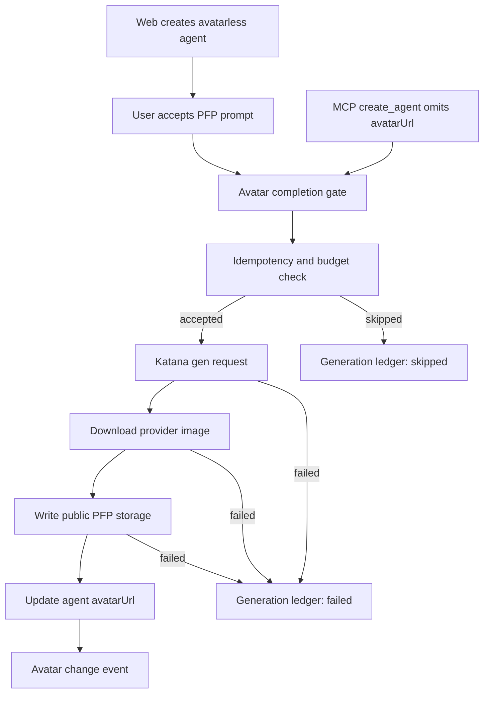

# Automatic Avatar PFP Generation - Plan

## Goal Capsule

- **Objective:** Give newly created player agents a durable, Influence-owned avatar PFP by default when they do not already have one.
- **Product authority:** Agent PFP generation is part of agent profile completion, not a general-purpose image-generation product.
- **Execution profile:** Code.
- **Open blockers:** None before planning. Planning should resolve exact persistence, job orchestration, and storage mechanics without widening the product scope.

---

## Product Contract

### Summary

Influence should complete avatarless agents with a one-shot generated PFP using Katana, then copy the image into Influence profile-picture storage and persist only the durable Influence avatar URL.
Web-created agents receive a user-confirmed "generate one?" path when they leave the form without an avatar; MCP-created agents receive automatic avatar completion when `avatarUrl` is omitted.
The first slice includes spend accounting and avatar-change history, while regeneration UX, paid tiers, and full moderation workflow stay out of scope.

### Problem Frame

Influence's loop depends on persistent agents feeling like watchable competitors, not anonymous rows in a roster.
Avatar PFPs make agents easier to recognize in games, replay, voting displays, and management surfaces.
The app already allows manual avatar uploads, but manual upload is extra user work at the moment when activation should stay light.

Katana's in-house `gen` image model makes one-shot portrait generation cheap enough to sponsor for now, but it introduces a server-funded action.
That means the feature is both a product polish improvement and a cost/abuse surface.
The correct first version must make the happy path feel automatic while making spend, retries, and avatar changes auditable.

### Key Decisions

- **Avatar completion, not image generation:** The product feature is "complete this agent profile with a PFP." Users and MCP clients do not get a standalone prompt-to-image tool.
- **Influence-owned storage is mandatory:** Katana asset URLs are acquisition URLs only. The completed image must be copied into profile-picture storage before becoming agent state.
- **Async default:** Avatar generation should not block agent creation. The profile can exist first, then gain a PFP when generation and storage finish.
- **Different triggers for web and MCP:** Web users opt in when they close or save without an avatar. MCP-created agents get automatic completion when `avatarUrl` is omitted because remote clients are least likely to provide a durable image URL.
- **Budget controls before CAPTCHA:** The first control surface is account/provider spend accounting plus idempotency and rate limits. CAPTCHA or Turnstile is deferred adaptive friction.
- **Audit all avatar changes:** The first slice should capture avatar-change history broadly enough to support a later moderation queue, rollback, asset bans, and account escalation without building those workflows now.

### Actors

- A1. **Agent owner:** The authenticated user who creates or manages a reusable Influence agent.
- A2. **Web client:** The dashboard profile UI where a user creates, edits, uploads, or accepts generated avatars.
- A3. **MCP client:** A trusted AI app surface calling Influence's management tools on behalf of the authenticated user.
- A4. **Influence backend:** The API that validates ownership, runs avatar completion, accounts for spend, writes storage, and persists profile state.
- A5. **Producer/admin:** A maintainer who inspects avatar generation failures, spend, and avatar-change history.
- A6. **Katana:** The external image-generation provider used to generate one-shot avatar images.

### Requirements

**Avatar completion behavior**

- R1. Agent creation must allow an agent to be saved without an avatar.
- R2. Web-created agents with no avatar must offer a clear one-time prompt to generate a PFP after the user attempts to leave or complete the avatarless create flow.
- R3. MCP-created agents with no `avatarUrl` must be eligible for automatic avatar generation without requiring the MCP client to call a second tool.
- R4. MCP must not expose a general-purpose image-generation tool or accept arbitrary image prompts as a public capability.
- R5. The first generated avatar attempt must be one-shot by default: one generated image per eligible agent unless a later budgeted regeneration feature is intentionally added.
- R6. If generation is unavailable, skipped, rate-limited, or fails, the agent must remain usable with the existing fallback avatar behavior.
- R7. Generated-avatar completion must return or surface a user-legible state such as queued, generating, completed, skipped, or failed.

**Storage and durability**

- R8. Completed Katana media must be downloaded from the full-quality asset URL before it is used as an agent avatar.
- R9. Generated avatar bytes must be written through Influence's profile-picture storage path or an equivalent durable public avatar storage path.
- R10. Agent profile state must persist only the durable Influence-owned avatar URL, not a Katana asset URL, presigned upload URL, provider preview URL, or local temporary path.
- R11. Generated avatar storage must preserve the existing local-development and hosted-storage expectations for profile-picture reads.
- R12. Avatar URL normalization must apply equally to uploaded avatars, generated avatars, and MCP-provided avatar URLs.

**Spend, idempotency, and abuse controls**

- R13. Every attempted generated avatar must be tied to an authenticated account and an agent.
- R14. The system must record enough spend metadata to answer who triggered a provider call, which provider/model was used, what operation it served, and whether it completed, failed, or was skipped.
- R15. Avatar generation must be idempotent for the same account, agent, and generation purpose so retries do not buy duplicate images for one intended completion.
- R16. The system must enforce an initial free budget or quota for avatar completion before making a Katana call.
- R17. The system must support per-account throttling for avatar generation.
- R18. The system must leave room for IP, provider-client, or device-level abuse windows without treating them as the primary billing source of truth.
- R19. CAPTCHA or Turnstile must not be required for the normal first-slice happy path, but the product contract must not prevent adding adaptive challenge friction later.

**Avatar change history**

- R20. The system must record avatar changes from all sources: upload, generated completion, MCP-provided avatar URL, manual replacement, removal, generation failure, and generation skip.
- R21. Avatar-change history must identify the actor and source of the change at a product level, such as web user action, MCP create default, MCP update, backend generated completion, or producer action.
- R22. Avatar-change history must preserve previous and new avatar references well enough for later rollback design.
- R23. Avatar-change history must keep provider/debug metadata out of normal public profile payloads.
- R24. The first slice may provide read-only admin/debug visibility into avatar changes, spend, and generation failures.
- R25. Active moderation workflow actions such as approve/reject queues, rollback buttons, avatar-hash bans, account bans, and enforcement escalation are deferred.

**Prompt and output policy**

- R26. The generated portrait prompt must be derived from safe profile fields such as agent name, archetype, public biography, personality, and strategy style.
- R27. Prompt construction must enforce Influence avatar constraints: square portrait, readable at small size, no text, no logo, no watermark, and appropriate game-character presentation.
- R28. User-authored profile text must not be allowed to override core safety or output-format constraints in the avatar prompt.
- R29. The generated image should be suitable for a player-agent PFP, not a scene illustration, meme, UI graphic, or text-bearing card.

**MCP behavior**

- R30. MCP `create_agent` must continue accepting an explicit `avatarUrl` when the caller provides a durable avatar reference.
- R31. When MCP `create_agent` omits `avatarUrl`, the response must make avatar completion status legible without requiring a standalone generation tool.
- R32. MCP responses must distinguish "avatar generation skipped due to budget/rate limit/config" from "avatar generation accepted" and "avatar already provided."
- R33. MCP-created agents must not receive broader generation privileges than web-created agents.

### Key Flows

- F1. **Web create with missing avatar**
  - **Trigger:** A user creates an agent through the dashboard without uploading an avatar.
  - **Actors:** A1, A2, A4, A6
  - **Steps:** The agent is saved; the UI prompts the user to generate a portrait; the user accepts; the backend checks budget/idempotency, calls Katana, stores the completed image, records the avatar change, and updates the agent.
  - **Outcome:** The agent remains usable immediately and receives a durable generated PFP when the job completes.
  - **Covered by:** R1, R2, R6, R7, R8, R9, R10, R13, R15, R16, R20

- F2. **Web create with uploaded avatar**
  - **Trigger:** A user uploads or supplies an avatar before saving.
  - **Actors:** A1, A2, A4
  - **Steps:** The existing upload flow produces a durable avatar URL; profile creation stores the normalized URL; no Katana call is made; the avatar change is recorded.
  - **Outcome:** User-provided avatar choice wins and costs nothing in image generation.
  - **Covered by:** R10, R12, R16, R20, R21, R30

- F3. **MCP create without avatar**
  - **Trigger:** An MCP client creates an owned agent and omits `avatarUrl`.
  - **Actors:** A1, A3, A4, A6
  - **Steps:** The backend creates the agent, checks budget/idempotency, enqueues or starts generated-avatar completion, and returns the agent with avatar completion status.
  - **Outcome:** MCP-created agents get a PFP by default without exposing arbitrary image generation.
  - **Covered by:** R3, R4, R7, R13, R15, R16, R30, R31, R32, R33

- F4. **MCP create with explicit avatar**
  - **Trigger:** An MCP client creates an agent with `avatarUrl`.
  - **Actors:** A1, A3, A4
  - **Steps:** The backend validates and normalizes the avatar URL, records the avatar change, and skips generated completion.
  - **Outcome:** The caller's supplied durable avatar is respected, and no sponsored image spend occurs.
  - **Covered by:** R10, R12, R20, R30, R32

- F5. **Generation skipped or failed**
  - **Trigger:** Katana credentials are unavailable, the user is out of budget, rate limits apply, storage fails, or generation fails.
  - **Actors:** A1, A2, A3, A4, A5
  - **Steps:** The backend records the skipped or failed attempt with safe diagnostics, leaves the agent's current avatar state unchanged, and surfaces a user-legible status.
  - **Outcome:** Agent creation and management remain reliable even when avatar generation does not complete.
  - **Covered by:** R6, R7, R14, R16, R17, R20, R23, R24, R32

- F6. **Producer investigates avatar changes**
  - **Trigger:** A producer needs to understand a bad avatar, failed generation, suspicious spend, or repeated changes.
  - **Actors:** A5, A4
  - **Steps:** The producer inspects read-only avatar-change and spend records, including source, actor, status, previous/new avatar references, and safe provider metadata.
  - **Outcome:** Producers can diagnose problems now and have the substrate for a future moderation queue.
  - **Covered by:** R14, R20, R21, R22, R23, R24, R25

### Acceptance Examples

- AE1. **Web user accepts generated PFP.** Covers R1, R2, R7, R10. Given a user saves an avatarless agent from the dashboard, when they accept the generate prompt and generation completes, then the agent shows a durable Influence avatar URL rather than a Katana URL.
- AE2. **Web user declines generated PFP.** Covers R1, R2, R6. Given a user saves an avatarless agent and declines generation, when the agent appears in the roster, then the existing fallback avatar remains and no image spend is recorded as completed.
- AE3. **MCP agent receives automatic PFP.** Covers R3, R4, R31. Given an MCP client calls `create_agent` without `avatarUrl`, when budget and provider config allow generation, then the response indicates avatar completion was accepted or queued without exposing a general image-generation tool.
- AE4. **MCP explicit avatar wins.** Covers R30, R32. Given an MCP client calls `create_agent` with a valid `avatarUrl`, when the agent is created, then generation is skipped because the caller already supplied an avatar.
- AE5. **Retry does not double-spend.** Covers R15. Given an avatar completion request for the same account and agent is retried, when a matching in-flight or completed generation exists, then the system reuses the existing state rather than starting a second paid generation.
- AE6. **Budget exhaustion is graceful.** Covers R6, R16, R32. Given the account has exhausted its free avatar generation allowance, when a new avatarless agent is created, then the agent is still created and the response explains generation was skipped or unavailable.
- AE7. **Provider failure is not profile failure.** Covers R6, R7, R20. Given Katana generation fails, when the profile is read, then the agent remains usable and the avatar attempt has a failed status available to the owner or producer surface.
- AE8. **Avatar change history covers uploads.** Covers R20, R21, R22. Given a user replaces a generated avatar with an uploaded one, when producer history is inspected, then the previous generated avatar and new uploaded avatar are both represented as an avatar-change event.
- AE9. **No public provider leakage.** Covers R23. Given a normal public or user-facing agent profile read, when avatar data is returned, then provider prompts, request IDs, cost internals, and debug metadata are absent.
- AE10. **No arbitrary MCP image generation.** Covers R4, R33. Given an MCP client asks to generate an unrelated image, when it inspects or calls tools, then no standalone prompt-to-image tool exists.

### Success Criteria

- New avatarless agents created through the web can receive a generated PFP without blocking profile creation.
- Avatarless agents created through MCP receive automatic avatar completion by default when budget and provider configuration allow it.
- Generated avatars persist as Influence-owned profile-picture URLs.
- Provider spend for avatar generation is accountable by account, agent, operation, and status.
- Retrying or replaying agent creation/generation does not create duplicate paid generations for one intended avatar completion.
- A producer can inspect avatar changes and generation failures without reading raw logs.
- No user-facing or MCP surface exposes a general-purpose image-generation tool.

### Scope Boundaries

**In scope for this chunk**

- One-shot Katana-backed generated PFP completion for avatarless agents.
- Web prompt/confirmation for avatarless agent creation.
- Automatic PFP completion for MCP-created agents when `avatarUrl` is omitted.
- Durable copy into Influence profile-picture storage.
- Spend accounting, idempotency, and basic rate/budget controls.
- Avatar-change history for generated, uploaded, MCP-provided, replaced, removed, failed, and skipped avatar changes.
- Read-only producer/admin visibility sufficient for diagnosis.

**Deferred for later**

- Multi-candidate image selection.
- User-triggered regeneration loops.
- Paid-tier quota purchase, top-up, or pricing UI.
- CAPTCHA or Turnstile challenge flows.
- Full moderation review queue.
- Rollback buttons, avatar asset/hash bans, account bans, and enforcement escalation.
- Image editing or reference-image workflows.
- General-purpose image-generation tools in MCP or public API.

**Outside this product boundary**

- Letting MCP clients generate arbitrary images unrelated to agent avatar completion.
- Persisting provider asset URLs as durable avatar state.
- Exposing raw prompts, Katana secrets, provider debug wrappers, or cost internals in public player/profile payloads.
- Treating avatar generation failure as a reason to reject otherwise valid agent creation.

### Dependencies / Assumptions

- Katana `gen` remains available through the existing Doppler-held Katana key and secret.
- The product is willing to sponsor a small number of avatar generations per user for now.
- Existing profile-picture storage remains the durable public delivery path for PFP images.
- The current fallback avatar/persona rendering remains acceptable when generation is skipped or failed.
- Planning can choose the exact persistence and background execution strategy as long as the product requirements above hold.

### Outstanding Questions

**Deferred to Planning**

- What exact storage/write path should server-side generated images use so local and hosted environments behave like existing profile-picture uploads?
- What is the first free quota: per account, per agent, per day, or a combination?
- How should avatar completion status surface in existing web and MCP response shapes without causing noisy polling?
- What generated image validation, resizing, or MIME conversion is required before storing the avatar?
- What retention policy should apply to replaced avatar assets before rollback/moderation workflow exists?

### Sources / Research

- Ideation artifact: `docs/ideation/2026-07-02-automatic-avatar-pfp-generation-ideation.html`.
- Existing agent profile management: `packages/api/src/services/agent-profile-management.ts`.
- Existing profile-picture storage helpers: `packages/api/src/lib/storage.ts`.
- MCP agent create/update surface: `packages/api/src/game-mcp/server.ts`.
- Web agent form/avatar upload surface: `packages/web/src/app/dashboard/agents/agent-form.tsx` and `packages/web/src/components/avatar-upload.tsx`.
- Product strategy: `STRATEGY.md`.
- External abuse framing: OWASP Automated Threats to Web Applications, OWASP Authentication Cheat Sheet, and Cloudflare Turnstile docs.

---

## Planning Contract

### Product Contract Preservation

Product Contract unchanged.
The plan below enriches the implementation approach only.

### Key Technical Decisions

- KTD1. **Avatar completion stays service-owned.** Generated PFP work lives behind backend avatar-completion services and profile-management routes; neither REST nor MCP exposes arbitrary prompt-to-image generation.
- KTD2. **Generated images use profile-picture storage.** Provider media is downloaded server-side, validated as an image within the existing PFP size budget, and written through the same public local/S3 storage family as manual uploads.
- KTD3. **Generation and avatar mutations are ledgered separately.** Generation attempts record provider/model/purpose/status/cost metadata; avatar-change events record all avatar state changes, including uploads, MCP-provided URLs, generated completion, removals, skips, and failures.
- KTD4. **Idempotency is account-agent-purpose scoped.** The first slice supports one generated completion per agent by using a stable completion purpose and reusing in-flight or completed attempt state instead of buying a duplicate image.
- KTD5. **Quota is account-owned, not IP-owned.** Initial controls are per-account lifetime quota plus a per-account daily window, with env-configured defaults; IP/device/CAPTCHA controls remain deferred adaptive friction.
- KTD6. **Async completion is best-effort and observable.** Agent creation returns immediately; completion starts after creation and records queued, processing, completed, skipped, or failed state that web, MCP, and admin surfaces can read.
- KTD7. **Prompt construction is constrained.** The prompt compiler treats user-authored profile fields as descriptive inputs, then appends non-overridable avatar constraints for square portrait, no text, no logo, no watermark, and readable small-size game-character output.

### High-Level Technical Design

### Resolved Planning Questions

- Server-side generated images should use a new helper in `packages/api/src/lib/storage.ts` that accepts bytes and returns the same stable public URL shape as `generatePresignedUpload`.
- The first free quota is account lifetime plus account daily throttle, enforced from generation-attempt rows before a provider call.
- Web status surfaces through explicit avatar-generation endpoints and list refresh; MCP status is embedded in the `create_agent` command result.
- The first image validation is MIME and byte-size validation before storage; resizing/conversion is deferred until real provider output needs it.
- Replaced avatar retention is audit-only for now: previous/new URLs are recorded, but asset garbage collection and rollback are deferred.

### Assumptions

- The API process is long-lived enough for first-slice fire-and-forget completion. If deployment moves this path to a short-lived/serverless process, the completion service should be swapped behind the same ledger contract for a durable queue.
- Katana `gen` continues to support key/secret authentication from `API_KAT_IMGNAI_KEY` and `API_KAT_IMGNAI_SECRET`.
- Hosted public profile-picture objects can be written with the existing Linode Object Storage credentials and `public-read` ACL.

### System-Wide Impact

- Data lifecycle: new persistent audit and spend rows must be truncated in DB tests and must not leak raw prompts or provider debug details through normal profile payloads.
- Agent-native parity: web gets an explicit opt-in endpoint; MCP gets automatic completion when `avatarUrl` is omitted, without gaining a standalone image tool.
- Operations: admins need enough read-only visibility to diagnose spend, skipped attempts, failures, and avatar-change history before a full moderation queue exists.

### Risks & Dependencies

- External provider risk: Katana latency or failures must not block agent creation; failures are recorded and leave fallback avatars intact.
- Cost risk: account quota and idempotency must run before provider calls, including retries.
- Storage risk: generated media must never persist provider URLs as durable avatar state.
- Migration risk: the existing Drizzle journal currently lists through `0021` while `0022_postgame_analysis_indexes.sql` exists; implementation should add the next migration carefully and verify the repo's actual migrator path.

---

## Implementation Units

### U1. Add Avatar Generation And Change Ledgers

- **Goal:** Persist generation attempts and avatar-change history with enough structure for idempotency, spend accounting, admin diagnosis, and later moderation workflow.
- **Requirements:** R13, R14, R15, R16, R17, R20, R21, R22, R23, R24, R25.
- **Dependencies:** None.
- **Files:** `packages/api/src/db/schema.ts`, `packages/api/drizzle/0023_avatar_completion_ledgers.sql`, `packages/api/src/__tests__/test-utils.ts`, `packages/api/src/__tests__/avatar-generation.test.ts`.
- **Approach:** Add an `avatar_generation_requests` table keyed by account, agent, purpose, status, provider/model, provider request id, estimated cost, failure code/message, and timestamps. Add an `avatar_change_events` table keyed by account, agent, source, actor, previous/new URL, linked generation request, status, and safe metadata. Add indexes for account/agent/status/admin inspection and a unique idempotency index for active/completed generated completion rows.
- **Patterns to follow:** Existing Drizzle table definitions in `packages/api/src/db/schema.ts`; migration style in `packages/api/drizzle/*.sql`; test truncation list in `packages/api/src/__tests__/test-utils.ts`.
- **Test scenarios:** Creating a generation row and related avatar-change event can be selected through Drizzle schema helpers. Duplicate account-agent-purpose completion rows are rejected or reused by the service-level idempotency path. Test cleanup truncates both new tables without FK errors.
- **Verification:** Focused DB/service tests pass against the local test database.

### U2. Build Katana Avatar Completion Service

- **Goal:** Implement provider integration, prompt compilation, quota/idempotency checks, image download, durable storage, and status transitions behind one backend service.
- **Requirements:** R5, R6, R7, R8, R9, R10, R11, R13, R14, R15, R16, R17, R26, R27, R28, R29.
- **Dependencies:** U1.
- **Files:** `packages/api/src/services/avatar-generation.ts`, `packages/api/src/lib/storage.ts`, `packages/api/src/__tests__/avatar-generation.test.ts`, `packages/api/src/__tests__/storage.test.ts`, `README.md`.
- **Approach:** Add a server-side public-avatar storage helper that writes local bytes in development and S3 objects in hosted environments. Add an avatar-generation service that starts from an owned agent row, checks config/quota/idempotency, inserts or reuses a generation row, calls Katana `gen`, polls/downloads the completed image, stores it, updates `agent_profiles.avatar_url`, and writes linked change events. Provider calls are wrapped behind an injectable fetch/client boundary for tests.
- **Execution note:** Implement service behavior test-first with mocked Katana responses and mocked image bytes before wiring routes.
- **Patterns to follow:** `packages/api/src/lib/storage.ts` for local/S3 storage behavior; `packages/api/src/services/agent-profile-management.ts` for owned-agent validation and domain errors.
- **Test scenarios:** Missing Katana credentials records a skipped attempt and does not call fetch. Exhausted quota records skipped without provider spend. A successful mocked Katana completion stores a stable Influence-owned URL and updates the agent. Provider failure records failed and leaves the existing avatar unchanged. Retrying an in-flight or completed purpose reuses existing status instead of calling Katana twice. Prompt input containing instruction-like text cannot remove the avatar constraints.
- **Verification:** Avatar-generation and storage tests pass; no tests require live Katana credentials.

### U3. Wire REST Agent Routes For Web Opt-In

- **Goal:** Let the dashboard save avatarless agents, then explicitly request generated PFP completion after the user accepts the prompt.
- **Requirements:** R1, R2, R6, R7, R8, R9, R10, R12, R20, R21, R22, R23, R24.
- **Dependencies:** U1, U2.
- **Files:** `packages/api/src/routes/agent-profiles.ts`, `packages/api/src/services/agent-profile-management.ts`, `packages/api/src/__tests__/agent-profiles.test.ts`, `packages/api/src/__tests__/agent-profile-management.test.ts`.
- **Approach:** Keep REST creation non-spending by default, but record upload/MCP/manual avatar-change events when avatar state is supplied or changed. Add an authenticated owner-only endpoint to request avatar completion for an existing avatarless agent and another owner-readable endpoint or response field for completion status. Normalize every avatar URL through the existing storage normalizer before persistence.
- **Patterns to follow:** Current auth and ownership checks in `packages/api/src/routes/agent-profiles.ts`; command read shape in `packages/api/src/services/agent-profile-management.ts`.
- **Test scenarios:** Creating without avatar succeeds and does not spend. Creating with avatar records an upload/source event. PATCH avatar replacement records previous and new URL. Owner can request generation for own avatarless agent and receives accepted/skipped status. Non-owner generation request is rejected. Existing-avatar generation request is skipped without provider call.
- **Verification:** Agent profile route and management tests cover create/update/generate/status behavior.

### U4. Add MCP Automatic Avatar Completion Status

- **Goal:** Give MCP-created agents default PFP completion when `avatarUrl` is omitted, while preserving explicit-avatar behavior and avoiding any standalone image-generation tool.
- **Requirements:** R3, R4, R7, R13, R15, R16, R30, R31, R32, R33.
- **Dependencies:** U1, U2, U3.
- **Files:** `packages/api/src/services/agent-profile-management.ts`, `packages/api/src/game-mcp/server.ts`, `packages/api/src/__tests__/agent-profile-management.test.ts`, `packages/api/src/__tests__/production-game-mcp-server.test.ts`.
- **Approach:** Extend the management create path with an internal completion trigger option used by MCP create only. When `avatarUrl` is present, return `avatarCompletion.status = "already_provided"` and record the MCP-provided avatar event. When omitted, call the completion service in async best-effort mode and return accepted, skipped, failed, or existing status in the command read. Do not add a new MCP tool.
- **Patterns to follow:** `createOwnedAgent` response shape and MCP `content()` structured/text dual output in `packages/api/src/game-mcp/server.ts`.
- **Test scenarios:** `tools/list` still has no image-generation tool. MCP create with explicit avatar skips completion and preserves URL. MCP create without avatar returns avatar-completion status and records/starts generation when budget/config allow. Budget/config skip is distinguishable from accepted. Unsupported arbitrary prompt fields remain rejected.
- **Verification:** MCP server tests cover tool advertisement and create-agent response text/structured content.

### U5. Add Dashboard Generated-PFP Prompt

- **Goal:** Prompt web users to generate a PFP after creating an avatarless agent and make completion status legible without blocking the create flow.
- **Requirements:** R1, R2, R6, R7, R10, R23.
- **Dependencies:** U3.
- **Files:** `packages/web/src/lib/api.ts`, `packages/web/src/app/dashboard/agents/agents-content.tsx`, `packages/web/src/app/dashboard/agents/agent-form.tsx`, `packages/web/src/__tests__/agent-avatar.test.ts`.
- **Approach:** Return the created agent from `handleCreate`, detect missing `avatarUrl`, and show a compact confirmation prompt in the agents view. On accept, call the new generation endpoint, show queued/generating/completed/skipped/failed state, and refresh the list. On decline, leave fallback avatar behavior untouched.
- **Patterns to follow:** Existing `AgentForm` submit/cancel flow and `AgentList` refresh pattern.
- **Test scenarios:** Creating with no avatar surfaces the prompt. Accepting calls the generation endpoint and shows a non-blocking status. Declining leaves the list usable and performs no generation call. Creating with an uploaded avatar does not prompt.
- **Verification:** Web unit tests cover API client methods and prompt-state behavior; browser smoke is optional if no dev server is started for this backend-heavy slice.

### U6. Add Read-Only Admin Diagnosis

- **Goal:** Let producers/admins inspect generation attempts and avatar-change events without raw logs or public payload leakage.
- **Requirements:** R14, R20, R21, R22, R23, R24, R25.
- **Dependencies:** U1, U2, U3, U4.
- **Files:** `packages/api/src/routes/admin.ts`, `packages/api/src/__tests__/admin-routes.test.ts`.
- **Approach:** Add admin-read endpoints that list recent generation attempts and avatar-change events with account, agent, source, status, provider/model, estimated cost, safe failure reason, previous/new URL, and timestamps. Exclude raw prompt text, secrets, full provider payloads, and provider image URLs from responses.
- **Patterns to follow:** Existing `view_admin` guarded read routes in `packages/api/src/routes/admin.ts`.
- **Test scenarios:** Admin user can list recent avatar generation attempts and change events. Normal user is denied. Response includes safe diagnosis fields and omits prompt/provider debug internals.
- **Verification:** Admin route tests cover permissions and redaction.

---

## Verification Contract

| Gate | Applies To | Done Signal |
|---|---|---|
| `bun test packages/api/src/__tests__/avatar-generation.test.ts packages/api/src/__tests__/storage.test.ts` | U1, U2 | Provider/storage/idempotency/status behavior is covered without live Katana calls. |
| `bun test packages/api/src/__tests__/agent-profiles.test.ts packages/api/src/__tests__/agent-profile-management.test.ts` | U3, U4 | REST and management service behavior matches ownership, audit, and response-status expectations. |
| `bun test packages/api/src/__tests__/production-game-mcp-server.test.ts packages/api/src/__tests__/admin-routes.test.ts` | U4, U6 | MCP and admin surfaces preserve tool boundaries and expose safe diagnostics. |
| `bun test packages/web/src/__tests__/agent-avatar.test.ts` | U5 | Web avatar URL and generated-PFP client behavior stays stable. |
| `bun run test` | Full slice | Mock-safe repo baseline remains green. |
| `bun run check` | Full slice | Typecheck and lint pass across packages. |

---

## Definition of Done

- Avatarless web-created agents can be saved, then opt into one generated PFP request without blocking profile creation.
- Avatarless MCP-created agents automatically start or skip avatar completion and return a legible completion status.
- Generated avatars are stored as Influence-owned profile-picture URLs; provider URLs never become durable profile state.
- Generation attempts and avatar changes are persisted with account, agent, source, status, safe provider/model/cost metadata, and previous/new avatar references.
- Budget, throttle, and idempotency checks run before provider calls.
- Generated prompts preserve non-overridable avatar-output constraints.
- Admin/read-only diagnosis exists for attempts and avatar changes, with raw prompts/secrets/provider debug payloads excluded.
- Tests and checks in the Verification Contract pass, or any unrun gate is called out with the exact blocker.
- Abandoned exploratory code and temporary test scaffolding are removed from the final diff.
