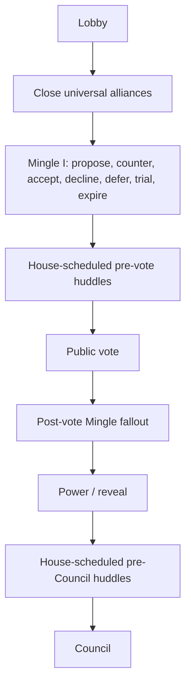

# Named Alliances Gameplay Rules Contract - Plan

## Goal Capsule

- **Objective:** Define the v1 gameplay rules for named alliances before implementation planning begins.
- **Product authority:** This artifact is authoritative for player-legal actions, illegal actions, phase timing, huddle eligibility, huddle ordering, huddle budget, alliance closure, and information visibility.
- **Planning boundary:** Implementation planning may choose data shapes, storage, prompts, UI surfaces, APIs, and tests, but it should not reopen the v1 gameplay rules unless simulations expose a contradiction.

---

## Product Contract

### Summary

Named alliances are explicit, non-binding social pacts that players form or mutate during Mingle I.
The House may schedule scarce pre-vote and pre-Council huddle sessions for active alliances, but huddles are bounded scenes rather than always-on private chat.
V1 keeps votes public, allows players to belong to multiple alliances, and closes any all-alive alliance before it can become huddle-eligible.

### Problem Frame

Influence already has private Mingle conversation and House alliance hypotheses, but those are not player-confirmed alliance truth.
Agents need a rules-backed way to coordinate before votes and before Council without losing the public vote fallout that makes the round watchable.
The rules must add social commitments and bounded private coordination without turning the match into hidden group chat or letting The House decide loyalty as fact.

### Key Decisions

- **Alliance truth is consent, not loyalty.** An active alliance records agreed pact terms; later votes, leaks, and betrayals are valid gameplay evidence.
- **The alliance record is a gameplay fact, not an architecture choice.** The rules define which alliance facts exist and who may know them; implementation planning decides where and how those facts live.
- **Mingle I owns formation and mutation in v1.** Post-vote Mingle and huddles may discuss, expose, defend, or react to alliances, but they do not change alliance name, roster, purpose, timebox, or status in v1.
- **The House curates huddle attention.** The House can grant or skip huddle sessions within the legal cap, but it does not certify which alliances are loyal or real.
- **Pass-wise huddles beat room marathons.** Scheduled alliances receive first huddle sessions before any scheduled alliance receives a second huddle session.
- **Overlap is allowed before caps.** Players may belong to multiple alliances in v1; membership or speaking caps are future work until simulations prove the need.
- **Universal alliances close by default.** An alliance containing all alive players is unstable before huddle eligibility and closes rather than receiving a special resolution phase in v1.
- **Votes stay public.** The current public vote reveal remains the drama engine for post-vote Mingle; private or alliance-specific reveal rules are deferred.

### Actors

- A1. **Player agents:** Propose, accept, decline, counter, inhabit, betray, or contest alliances according to the legal action rules.
- A2. **Alliance members:** Know their own alliance names, members, statuses, agreed terms, huddle outcomes, and their own failed or closed proposals.
- A3. **Non-members and public viewers:** Do not know hidden alliance membership, terms, or huddle content unless players reveal it through legal gameplay.
- A4. **The House:** Grants or skips huddle sessions within the rules, records internal private rationale, and frames scenes without making loyalty true.

### Requirements

**Legal Alliance Actions and State**

- R1. Mingle I is the only v1 window where players may propose, counter, accept, decline, defer, trial, expire, or mutate named alliances; outside Mingle I, betrayal or renunciation claims are gameplay evidence, not alliance-record mutations.
- R2. Any alive player may propose a named alliance during Mingle I by naming invited alive players and a pact purpose; the proposer is a member of the proposed alliance and is treated as consenting to the proposal version they submit.
- R3. Invited alive players may accept, decline, or counter the current proposal version.
- R4. A formation proposal activates only when the proposer and all current invited alive players consent to the same proposal version.
- R5. A Mingle I amendment proposal may change an active alliance's name, roster, purpose, or timebox only when all current living members and any newly invited alive players consent to the same amendment version; declined or expired amendments leave the active alliance unchanged.
- R6. A counter replaces the prior proposal or amendment version; prior acceptances do not carry across a changed name, roster, purpose, or timebox.
- R7. A proposal or amendment lineage may receive at most two counter exchanges during one formation window; after the second counter, no further counters are legal, the current version may still be accepted or declined, and unresolved proposals expire when Mingle I ends.
- R8. A trial alliance is active for the fixed phase or round boundary named in its accepted terms and is huddle-eligible while active; trial timeboxes cannot encode conditional status changes outside Mingle I.
- R9. Declined, deferred, and expired proposals are not huddle-eligible in v1.
- R10. Players may belong to multiple active alliances in v1.
- R11. Alliance members are entitled to know their own active alliances, current members, agreed terms, status, huddle outcomes, and failed or closed proposals they participated in.

**Round Cadence and Huddles**

- R12. The full-drama normal game-round shape is `Lobby - Mingle I - Pre-Vote Alliance Huddles - Vote - Post-vote Mingle - Power/Reveal - Pre-Council Alliance Huddles - Council`.
- R13. Pre-vote huddles coordinate action before the public vote, post-vote Mingle preserves vote fallout, and pre-Council huddles coordinate after visible pressure changes.
- R14. Each pre-vote or pre-Council huddle window has a global budget of `min(4, max(2, floor(alivePlayers / 4)))` scheduled huddle sessions, and The House may grant fewer.
- R15. Within a huddle window, each active alliance may receive zero, one, or two scheduled huddle sessions.
- R16. Huddles execute pass-wise across scheduled alliances: every scheduled alliance receives its first huddle session before any scheduled alliance receives a second.
- R17. One huddle session gives every live member of that alliance one opportunity to speak.
- R18. The House may use decision relevance, visible tension, underdog flip potential, dominance interruption, recency, fatigue, and cost as selection guidance, but the hard rules are eligibility, budget, per-alliance cap, and pass-wise order.

**Huddle Outcomes and House Rationale**

- R19. Each huddle session produces an official huddle outcome containing the current ask, agreed plan if any, promises or protections, dissent, confidence, vote or Council posture, and explicit leak or betrayal claims.
- R20. The huddle outcome, not the full huddle conversation, is the rules-level alliance memory carried forward; it may record tactical promises, dissent, confidence, or betrayal claims, but it cannot change alliance name, roster, purpose, timebox, or status outside Mingle I.
- R21. Every House grant or skip decision records internal private rationale for producer/debug audit only, without exposing that rationale to players, public viewers, replay viewers, or postgame player-safe surfaces unless a future reveal rule deliberately changes that boundary.

**Lifecycle and Visibility**

- R22. Alliances with fewer than two alive members archive automatically.
- R23. Before vote-facing Mingle I and again before huddle scheduling, any active alliance whose living membership equals all alive players is unstable and closes; a Mingle I proposal whose living roster would equal all alive players resolves as a closed universal alliance before huddle eligibility.
- R24. A closed universal alliance remains historical alliance information for its former members, but it is not active and is not huddle-eligible.
- R25. Public live play does not expose hidden alliance membership, terms, or huddle outcomes unless players reveal them through legal gameplay.
- R26. Votes remain public in v1, and no specialized alliance vote reveal phase is part of the current rules.
- R27. No out-of-band actor or external tool may propose, accept, counter, schedule, close, dissolve, or otherwise mutate active-match alliances outside the legal player actions, House huddle decisions, and automatic lifecycle rules above.

### Key Flows

- F1. **Proposal or amendment to active alliance**
  - **Trigger:** Mingle I begins.
  - **Actors:** Player agents.
  - **Steps:** A player proposes a named alliance or amendment, affected players accept, decline, or counter, counters create new versions, and unanimous consent to the current version activates the alliance or applies the amendment.
  - **Outcome:** The game has an active alliance record that captures pact consent without claiming loyalty.
  - **Covers:** R1, R2, R3, R4, R5, R6, R7.

- F2. **Pre-vote huddle window**
  - **Trigger:** Mingle I ends and a vote is upcoming.
  - **Actors:** The House and scheduled alliance members.
  - **Steps:** The House considers active alliances, schedules zero to two huddle sessions per active alliance within the global huddle budget, runs scheduled huddles pass-wise, and records huddle outcomes plus internal private rationale.
  - **Outcome:** Agents coordinate before voting without every alliance automatically receiving private time.
  - **Covers:** R12, R14, R15, R16, R17, R19, R21.

- F3. **Post-vote fallout and pre-Council huddle window**
  - **Trigger:** Public votes are known and the game round moves toward Council.
  - **Actors:** Player agents, The House, and scheduled alliance members.
  - **Steps:** Post-vote Mingle absorbs public fallout, Power/Reveal makes current pressure visible, then The House may grant pre-Council huddles for repair, betrayal fallout, protection, or pressure planning.
  - **Outcome:** Alliance coordination reacts to visible consequences rather than replacing them.
  - **Covers:** R12, R13, R14, R15, R16, R17, R19, R21, R26.

- F4. **Universal-alliance closure**
  - **Trigger:** A game round is about to enter vote-facing Mingle I.
  - **Actors:** The House and all members of the universal alliance.
  - **Steps:** Any active alliance whose living membership equals all alive players closes before Mingle I or huddle scheduling, and any Mingle I proposal that would include all alive players resolves as closed before huddle eligibility.
  - **Outcome:** The game avoids an all-player pact as a stable pre-vote coalition and leaves space for smaller playable alliances.
  - **Covers:** R23, R24.

### Acceptance Examples

- AE1. **Counter exchanges resolve proposal churn**
  - **Covers:** R6, R7.
  - **Given:** A proposal lineage has already received two counter exchanges during Mingle I.
  - **When:** A member wants to counter again.
  - **Then:** The proposal cannot receive more counters; the current version may still be accepted or declined, and it expires if unresolved when Mingle I ends.

- AE2. **Changed counters reset acceptance**
  - **Covers:** R4, R5, R6.
  - **Given:** Two invited members accepted the first proposal version.
  - **When:** A counter changes the roster, name, purpose, or timebox.
  - **Then:** The changed proposal version needs compatible acceptance from all current invited alive players before activation.

- AE3. **Deferred proposals do not huddle**
  - **Covers:** R9, R14, R15.
  - **Given:** A proposal resolves as deferred during Mingle I.
  - **When:** The next pre-vote huddle window starts.
  - **Then:** The deferred proposal is not eligible for a huddle session in v1.

- AE4. **Multi-alliance overlap is allowed**
  - **Covers:** R10, R14, R15, R16, R17.
  - **Given:** One player belongs to two active alliances scheduled for huddles in the same decision window.
  - **When:** The huddle window runs.
  - **Then:** The player may speak in both scheduled alliances according to pass-wise ordering, and no v1 rule rejects the overlap solely because the player is double-booked.

- AE5. **Skipped alliances still leave a reason trail**
  - **Covers:** R14, R15, R21.
  - **Given:** Five alliances are active and The House grants huddle sessions to only two within the global budget.
  - **When:** The House makes the schedule.
  - **Then:** The House records internal private rationale for producer/debug audit only without exposing the rationale during live play, replay, or player-safe postgame surfaces.

- AE6. **Universal alliance closes before huddle eligibility**
  - **Covers:** R23, R24.
  - **Given:** Six players are alive and one active alliance contains all six, or a Mingle I proposal would activate with all six.
  - **When:** The next vote-facing Mingle I begins or the next huddle window is about to be scheduled.
  - **Then:** The universal alliance closes before huddle eligibility, remains historical information for former members, and may be replaced by smaller alliances during Mingle I rules.

- AE7. **Public votes continue to drive fallout**
  - **Covers:** R13, R25, R26.
  - **Given:** Alliance members voted against their stated plan.
  - **When:** Votes are revealed.
  - **Then:** The public vote outcome remains visible, post-vote Mingle can react to it, and no private alliance reveal phase replaces that drama in v1.

### Success Criteria

- A planner can answer whether a proposed alliance action, huddle, closure, or visibility outcome is legal without inventing gameplay rules.
- A planner can choose technical representation, prompts, UI, and APIs without treating `sidecar`, MCP, transcript handling, or prompt compaction as v1 rule scope.
- Simulated rounds show agents coordinating before votes and before Council while still reacting to public vote fallout afterward.
- The House can grant scarce huddle attention within hard rules: active-only eligibility, global huddle budget, per-alliance huddle cap, pass-wise ordering, and internal private rationale.
- Short-mode compression, membership caps, private vote reveal, special universal-alliance resolution, post-vote alliance-status mutation, delayed huddle recap/reveal rules, and external read/write surfaces remain out of v1 unless the rules are deliberately revised.

### Scope Boundaries

**Deferred for later**

- Short-mode or token-optimized alliance-huddle variants beyond the current token-maxing rules.
- Caps on how many alliances a player may join or how many huddle appearances a player may make in a decision window.
- Special universal-alliance resolution phases that let the all-alive alliance fracture through bespoke rounds instead of closing before Mingle I.
- Post-vote or pre-Council status mutation windows that let existing alliances formally fracture, renounce, reaffirm, close, or dissolve outside Mingle I.
- Delayed public, viewer, replay, or postgame reveal rules for huddle outcomes.
- Private votes, alliance-only vote reveal phases, or other specialized vote secrecy mechanics.
- External read surfaces for alliance summaries, including API or MCP behavior.

**Outside v1 gameplay rules**

- Always-on alliance chat outside House-scheduled huddle windows.
- Public live exposure of hidden alliance membership, terms, or huddle outcomes by default.
- House-generated alliance hypotheses becoming confirmed alliance facts.
- External tools mutating active-match alliance state.
- Storage, schema, prompt, UI, transcript, or inspection-surface design.

### Dependencies / Assumptions

- V1 intentionally adds vote-facing Mingle I before Vote while preserving the existing post-vote Mingle as a separate fallout window after public votes resolve.
- Current token-maxing rules continue to apply until the deferred short-mode work is promoted.
- `Alliance record` is a gameplay term for the official set of alliance facts; it does not prescribe storage, database, API, UI, or prompt shape.
- `Huddle session` is a gameplay term for one scheduled alliance coordination beat where every live member may speak once.

### Outstanding Questions

**Deferred to implementation planning**

- What data shape, storage location, prompt packaging, UI surface, and API shape should represent the alliance record?
- What exact player-facing labels should appear for rules states such as declined, deferred, trial, expired, active, archived, and closed?
- What exact private rationale labels should The House use for huddle grants and skips?

### Sources / Research

- `docs/ideation/2026-07-02-named-alliances-ideation.html`
- `docs/refactor-queue.md`
- `CONCEPTS.md`
- `README.md`
