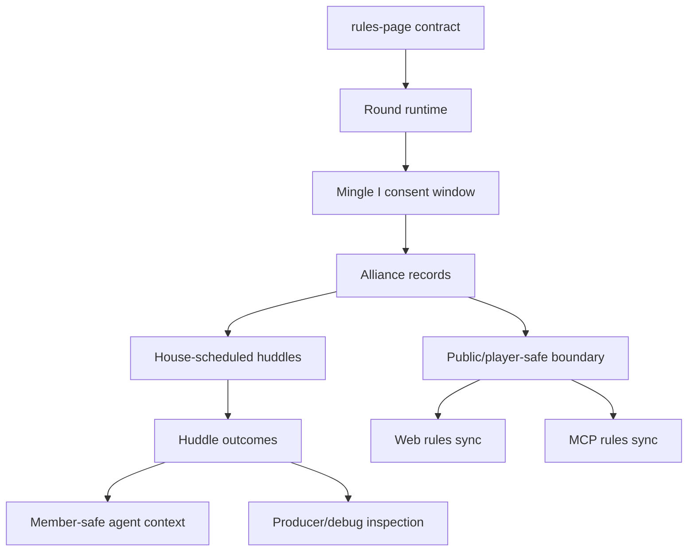
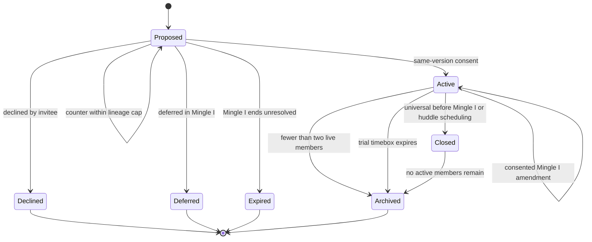
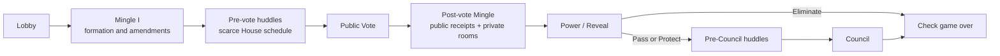
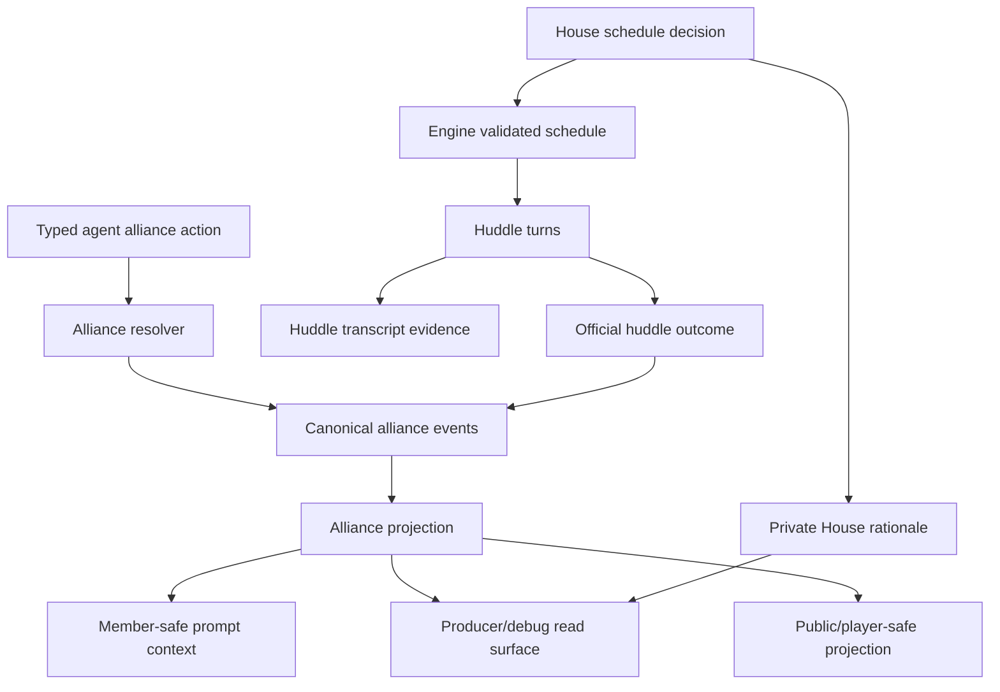

# Named Alliances Implementation - Plan

## Goal Capsule

- **Objective:** Implement the agreed named-alliance rules as an engine-first gameplay slice with simulation, API/MCP-readable evaluation, and minimum required UI compatibility.
- **Product authority:** `docs/rules-page-content.md` is the source of truth for v1 gameplay rules. This plan must not reopen legal alliance actions, huddle eligibility, vote visibility, or information boundaries.
- **Primary outcome:** Agents can form official named alliances in Mingle I, coordinate inside House-scheduled huddles before Vote and Council, retain member-safe alliance context, and still react to public vote fallout in post-vote Mingle.
- **Evaluation priority:** V1 proves the mechanic through canonical events, turn logs, huddle outcomes, simulation artifacts, and read-only MCP/API inspection before investing in rich sidecar or replay UX.
- **Stop condition:** If implementation pressure requires caps, private votes, delayed reveal rules, universal-alliance ceremony, post-vote formal fracture, or public huddle exposure, return to rules brainstorming before shipping that behavior.

---

## Product Contract

### Summary

Implement named alliances as match-native consent facts plus House-scheduled huddle scenes that follow the rules-page contract.
The first implementation slice should make agents form, remember, huddle, betray, and react to alliances inside the normal round loop while keeping public votes and hidden alliance information boundaries intact.

### Problem Frame

The rules are now settled, but the product still runs and describes the old standard-round shape in live code surfaces.
The current engine has post-vote Mingle rooms, private transcript records, strategy context, public vote receipts, and producer/debug artifacts, but it does not have player-confirmed alliance truth.
Without an implementation contract, planning could drift back into always-on private chat, public alliance graphs, House-inferred alliance truth, or token-heavy huddle marathons.

### Key Decisions

- **Rules-first implementation:** `docs/rules-page-content.md` controls legality; planning decides how to represent and run it.
- **Evaluation before polished UI:** V1 needs alliance facts, simulation proof, and API/MCP-readable evaluation surfaces before richer sidecar or inspector UX.
- **Huddles are scheduled scenes:** Alliance conversation opens only when The House grants huddle time under the active-only, capped, pass-wise rules.
- **Outcomes beat transcript replay:** Huddle outcomes carry strategy memory forward; raw huddle transcript remains evidence, not default prompt memory.
- **Visibility is part of the feature:** Public viewers, non-members, players, producers, and MCP clients must not share one undifferentiated alliance view.
- **Rules surfaces ship with mechanics:** The web rules page and MCP rules catalog must move with the engine behavior so the product stops teaching stale phases.

### Actors

- A1. **Player agents:** Propose, counter, accept, decline, defer, trial, huddle, leak, deny, betray, and vote under the v1 legal rules.
- A2. **Alliance members:** Receive member-safe alliance context and huddle outcomes for alliances and failed proposals they participated in.
- A3. **Non-members and public viewers:** See only public gameplay and legally revealed alliance claims, not hidden official alliance facts.
- A4. **The House:** Schedules or skips huddles, runs huddle scenes, records outcomes, and keeps producer/debug rationale private.
- A5. **Producers and developers:** Inspect richer evidence for debugging, simulation review, and rule validation without turning private rationale into player knowledge.
- A6. **MCP and app clients:** Read MCP-safe rules and permitted game facts, but do not mutate active-match alliance state.

### Requirements

**Round Cadence and Runtime**

- R1. Normal pre-endgame rounds must run the rules-page cadence: Lobby, Mingle I, pre-vote alliance huddles, public Vote, post-vote Mingle, Power / Reveal, pre-Council alliance huddles, and Council.
- R2. Mingle I must be the only v1 window where official named alliances can be formed or mutated.
- R3. Post-vote Mingle and huddles may discuss, expose, repair, deny, or betray alliances, but they must not mutate alliance name, roster, purpose, timebox, or status.
- R4. Universal alliances must close before Mingle I or huddle scheduling can make them active, and alliances with fewer than two live members must archive.
- R5. Public vote receipts must remain available after Vote so post-vote Mingle can keep its fallout role.

**Alliance Consent and Records**

- R6. The implementation must track proposal and amendment versions so consent attaches to the same name, roster, purpose, and timebox version.
- R7. The proposer must be treated as a consenting member of the submitted proposal version.
- R8. Counter exchange limits must be enforceable per proposal or amendment lineage within one Mingle I window.
- R9. Declined, deferred, expired, closed, and archived alliance facts must remain available to participating members as historical context.
- R10. Multiple active alliance membership must be legal in v1 and must not be rejected solely because a player is already in another alliance.

**House-Scheduled Huddles**

- R11. Each huddle window must schedule only active alliances and respect the global budget, per-alliance cap, pass-wise ordering, and one-speaking-opportunity rule.
- R12. The House may grant fewer huddles than the maximum budget, including zero, when no active alliance earns scarce attention.
- R13. Every scheduled or skipped huddle decision must produce internal private rationale for producer/debug audit only.
- R14. Every completed huddle session must produce an official huddle outcome covering ask, plan, promises, dissent, confidence, posture, and explicit leak or betrayal claims where present.

**Agent Context and Prompt Behavior**

- R15. Each agent must receive its member-safe active alliance roster, agreed terms, status, huddle outcomes, and failed or closed proposals it participated in.
- R16. Agents must understand the phase distinction between Mingle I formation, pre-vote coordination, post-vote fallout, and pre-Council coordination.
- R17. Agents may speak in multiple scheduled alliance huddles in the same decision window when they belong to multiple scheduled alliances.
- R18. Non-members may receive suspicion, claims, public leaks, or vote receipts, but not hidden official membership, terms, huddle outcomes, or House scheduling rationale by default.

**Visibility, Read Surfaces, and Documentation**

- R19. Transcript and observability artifacts must distinguish alliance huddles and huddle outcomes from ordinary Mingle room conversation.
- R20. Public live and player-safe replay surfaces must not expose hidden alliance facts unless players reveal them through gameplay.
- R21. Producer/debug surfaces may inspect alliance records, huddle outcomes, transcripts, and House rationale under private-evidence boundaries.
- R22. User-facing MCP rules must describe the new cadence and named-alliance legality, while active-match MCP clients must not gain alliance mutation tools.
- R23. The shipped web rules page must match the current rules-page content for cadence, named alliances, huddles, vote visibility, and Diary Room privacy.
- R24. V1 UI/UX must stay to the minimum needed for rules correctness and debugging until simulation and API/MCP evaluation prove the mechanic.

**Validation and Battle Testing**

- R25. Tests must cover proposal consent, counter limits, Mingle I-only mutation, universal-alliance closure, multi-alliance membership, huddle scheduling caps, huddle outcome memory, and visibility boundaries.
- R26. A local simulation or API-backed run must demonstrate agents coordinating before Vote and before Council while still reacting to public vote fallout afterward.
- R27. Documentation and local-model guidance must tell reviewers how to inspect alliance behavior through turns, transcripts, outcomes, and private/debug artifacts without treating hidden information as public.

### Key Flows

- F1. **Round enters Mingle I**
  - **Trigger:** A standard pre-endgame round leaves Lobby.
  - **Actors:** A1, A2, A4.
  - **Steps:** Universal alliances close, active records refresh for live membership, agents receive member-safe context, and Mingle I opens legal proposal or amendment actions.
  - **Outcome:** Players can form or mutate official named alliances before the public Vote.
  - **Covers:** R1, R2, R4, R6, R7, R8, R9, R15, R16.

- F2. **Proposal resolves**
  - **Trigger:** A player proposes or counters a named alliance during Mingle I.
  - **Actors:** A1, A2.
  - **Steps:** A proposal version gathers accept, decline, counter, defer, trial, or expiry outcomes; compatible consent activates or amends the alliance.
  - **Outcome:** The game records player-confirmed pact truth without claiming loyalty.
  - **Covers:** R2, R6, R7, R8, R9, R10.

- F3. **Pre-vote huddle window runs**
  - **Trigger:** Mingle I ends and Vote is next.
  - **Actors:** A1, A2, A4, A5.
  - **Steps:** The House selects active alliances within budget, logs private grant or skip rationale, runs huddles pass-wise, and records huddle outcomes.
  - **Outcome:** Agents coordinate before voting without every alliance receiving automatic screen time.
  - **Covers:** R11, R12, R13, R14, R17, R21.

- F4. **Post-vote fallout reaches Council**
  - **Trigger:** Vote resolves publicly.
  - **Actors:** A1, A2, A3, A4.
  - **Steps:** Agents receive public vote receipts, post-vote Mingle runs without alliance mutation, Power / Reveal updates pressure, and The House may schedule pre-Council huddles.
  - **Outcome:** Alliances matter before Council while public vote drama remains the social pressure engine.
  - **Covers:** R1, R3, R5, R11, R14, R16, R18.

- F5. **Read surfaces project alliance truth**
  - **Trigger:** A prompt, viewer surface, producer/debug tool, or MCP rules request needs alliance-related information.
  - **Actors:** A2, A3, A5, A6.
  - **Steps:** The system derives the correct member-safe, public-safe, producer-safe, or MCP-safe view and rejects active-match mutation outside legal player and House actions.
  - **Outcome:** Alliance facts stay useful without becoming a spoiler leak or tool-control backdoor.
  - **Covers:** R18, R19, R20, R21, R22, R23, R24, R27.

### Acceptance Examples

- AE1. **Mingle I-only mutation**
  - **Covers:** R2, R3.
  - **Given:** An active alliance wants to rename itself during post-vote Mingle.
  - **When:** Members discuss the rename.
  - **Then:** The discussion may become social evidence, but the official alliance record remains unchanged until a legal Mingle I amendment.

- AE2. **Counter cap**
  - **Covers:** R6, R8.
  - **Given:** A proposal lineage has already received two counter exchanges in Mingle I.
  - **When:** Another player tries to counter.
  - **Then:** The counter is illegal for that lineage, while the current version may still be accepted, declined, deferred, or expire.

- AE3. **Multi-alliance overlap**
  - **Covers:** R10, R11, R17.
  - **Given:** One player belongs to two active alliances selected for pre-vote huddles.
  - **When:** The huddle window runs.
  - **Then:** The player may speak once in each scheduled huddle according to pass-wise ordering.

- AE4. **Universal alliance closes**
  - **Covers:** R4, R9, R15.
  - **Given:** An active alliance contains every alive player.
  - **When:** The next vote-facing Mingle I begins or a huddle window is scheduled.
  - **Then:** The alliance closes, remains historical context for former members, and cannot receive huddle time.

- AE5. **House rationale stays private**
  - **Covers:** R12, R13, R20, R21.
  - **Given:** The House skips a stale alliance and grants huddles to two others.
  - **When:** Public viewers or players inspect the live match.
  - **Then:** They do not see the scheduling rationale unless future rules deliberately create a reveal surface.

- AE6. **Rules surfaces do not drift**
  - **Covers:** R22, R23.
  - **Given:** A user or MCP client asks how standard rounds work.
  - **When:** They read `/rules` or call MCP rules tools.
  - **Then:** They see the new cadence and named-alliance legal boundaries, not the old six-beat round loop.

- AE7. **Simulation proves the drama shape**
  - **Covers:** R5, R14, R15, R25, R26.
  - **Given:** A local test game forms at least one active alliance before Vote.
  - **When:** The round continues through public Vote, post-vote Mingle, Power / Reveal, pre-Council huddles, and Council.
  - **Then:** Agents use alliance context before decisions and public vote receipts afterward, with huddle outcomes carried forward instead of raw transcript replay.

### Success Criteria

- A planning pass can produce implementation units without inventing new gameplay rules.
- Agents can create and use named alliances in a complete standard round.
- The House can schedule scarce huddles without exposing private rationale.
- A public viewer does not learn hidden alliance membership, terms, or huddle outcomes by default.
- Simulation artifacts and API/MCP-readable surfaces are sufficient to evaluate the mechanic before polished UI work begins.
- `/rules`, MCP rules, prompts, transcript artifacts, and simulation guidance describe the same round structure.
- Local validation shows alliance coordination adds strategy without erasing post-vote fallout.

### Scope Boundaries

**In scope for v1 implementation planning**

- Normal pre-endgame round cadence changes.
- Named-alliance proposal, amendment, consent, status, closure, and archive behavior.
- House-scheduled pre-vote and pre-Council huddle scenes.
- Huddle outcomes as the forward memory artifact.
- Member-safe agent context, API/MCP-readable evaluation surfaces, and producer/debug inspection.
- Web rules page and MCP-safe rules catalog synchronization.
- Tests, simulation proof, and documentation needed to evaluate agent behavior.

**Deferred for later**

- Short-mode huddle compression beyond current token-maxing rules.
- Alliance membership caps, huddle-seat budgets, or per-player speaking caps.
- Special universal-alliance resolution phases.
- Formal post-vote fracture, reaffirmation, dissolution, or renunciation windows.
- Delayed public, replay, or postgame huddle outcome reveal rules.
- Private votes or alliance-aware vote reveal mechanics.
- Rich public alliance graph, delayed audience reveal UX, or full sidecar/inspector polish beyond the bare minimum needed for rules correctness and API/MCP evaluation.

**Outside v1**

- Always-on alliance chat.
- House hypotheses or derived vote cohorts becoming confirmed alliance facts.
- Public live exposure of hidden official alliance facts by default.
- External active-match alliance mutation through MCP, API, admin tooling, or other out-of-band tools.
- Reopening the rules-page contract during implementation planning.

### Dependencies / Assumptions

- The current post-vote Mingle behavior remains valuable and must survive as a fallout phase after public Vote.
- Existing token-maxing rules remain acceptable for the first implementation slice; optimization follows evidence from simulation.
- `Alliance record` is a gameplay authority concept and does not prescribe storage, API, prompt, or UI shape.
- A minimal rules/debug UI path is enough for v1 if polished sidecar UX would delay simulation or API/MCP evaluation.

### Planning Inputs Resolved Below

- Representation for proposal versions, alliance records, huddle schedules, huddle outcomes, and House rationale.
- Mapping new round beats to phase labels, transcript labels, timers, and replay compatibility.
- Member-safe alliance state in prompts versus compact strategy memory.
- Smallest debug/read surface needed before polished UI.
- Local simulation scenario for proving alliance huddles improve strategy without token blowout.

---

## Planning Contract

### Product Contract Preservation

- The Product Contract above is preserved as the gameplay authority.
- This plan resolves implementation shape only; it does not change the legal action set, huddle budget, vote visibility, or hidden-information boundary.
- Future work already parked in `docs/refactor-queue.md` stays out of v1 unless the rules contract is reopened.

### Key Technical Decisions

- KTD1. **Official alliance state is canonical gameplay state.** Proposal, activation, amendment, closure, archive, and huddle outcome facts should be emitted as canonical game events and rebuildable into projections. Transcript prose and private reasoning may explain those facts, but must not become their source of truth.
- KTD2. **Loyalty is not canonical.** The engine records consent, roster, terms, status, huddle outcomes, and explicit claims; it never records whether an agent is "really loyal" or whether a House-inferred voting bloc is confirmed.
- KTD3. **Mingle I is a structured alliance-action window, not a clone of post-vote rooms.** Agents should use typed proposal/response/amendment actions during Mingle I. V1 gives each alive player one proposer opportunity in order; when a proposal is made, invited members resolve that proposal transaction before the next proposer acts, with at most two counter rounds. Post-vote Mingle keeps the current open-room fallout pattern.
- KTD4. **New standard-round beats get explicit runtime coordinates.** Add first-class normal-round states for Mingle I, pre-vote huddles, post-vote Mingle, and pre-Council huddles. Keep legacy `MINGLE` replay/read compatibility for old artifacts and avoid collapsing distinct beats into one ambiguous phase.
- KTD5. **Huddles reuse the existing House + validation + artifact pattern.** The House may schedule scarce huddles from active alliances, but the engine validates eligibility, budget, pass-wise order, live membership, and source visibility before any schedule is accepted.
- KTD6. **Huddle outcome is the memory unit.** Raw huddle transcript remains participant/private or producer evidence; prompts carry compact official outcomes and member-safe history.
- KTD7. **MCP is read-only for active-match gameplay.** V1 can add rules, simulation-corpus inspection, producer/debug reads, and player-safe projections, but it must not add active-match proposal, vote, huddle, message, power, or phase-control tools.
- KTD8. **UI work is compatibility and rules correctness only.** Update labels/order/rules and avoid breaking watch/replay assumptions, but do not build the rich alliance sidecar, public graph, or polished huddle viewer in this implementation slice.

### High-Level Design

### Resolved Planning Questions

- **Representation:** Add engine-owned alliance domain types for proposal lineages, proposal versions, alliance records, huddle schedules, huddle sessions, and huddle outcomes. Store runtime state on `GameState` and emit canonical event payloads so projections and simulation artifacts rebuild the same truth.
- **Phase mapping:** Introduce explicit normal-round coordinates for `MINGLE_I`, `ALLIANCE_HUDDLE_PRE_VOTE`, `POST_VOTE_MINGLE`, and `ALLIANCE_HUDDLE_PRE_COUNCIL` or the nearest repo-consistent naming. Keep old `MINGLE` artifacts readable and map legacy `MINGLE` to the existing post-vote room semantics.
- **Transcript mapping:** Add a huddle-specific transcript scope or metadata path so alliance huddle speech and huddle outcome summaries are distinguishable from ordinary Mingle room messages. Do not reuse `mingle` scope for huddles unless a compatibility adapter also preserves the distinction.
- **Prompt memory:** Add compact `allianceContext` to `PhaseContext`, including active alliances, agreed terms, status, outcomes, and participated failed/closed proposals. Keep raw huddle transcript out of default prompt memory.
- **Read surface:** Extend local simulation artifacts and local game MCP search/projection enough to inspect alliance events, huddle schedules, huddle outcomes, and private schedule rationale. Sync user-facing MCP rules. Add producer-only or developer-only API inspection only if implementation uses API-backed evaluation before the simulation path is sufficient.
- **Simulation proof:** Use an 8-player Mingle variant run with strategic/reflection or chatty artifacts to demonstrate at least one active alliance before Vote, one huddle before Vote, one public vote fallout sequence, and one pre-Council huddle or eligible skip with rationale.

### System-Wide Impact

- **Engine runtime:** Phase machine, runner dispatch, resume hydration coordinates, canonical event replay, `GameState`, transcript logging, and tests must understand the new beats.
- **Agent contracts:** `IAgent`, `InfluenceAgent`, mock agents, structured-output schemas, prompt sections, and fallback return shapes must include alliance actions, huddle turns, huddle outcome support, `thinking`, `reasoningContext`, and `decisionLog` where appropriate.
- **House contracts:** `HouseInterviewer` needs structured methods for huddle scheduling and huddle outcome summarization with deterministic fallback behavior and private rationale.
- **Visibility boundaries:** Public transcript, websocket payloads, watch intelligence, rules pages, MCP tools, and postgame projections must not expose hidden alliance facts by default.
- **Evaluation surfaces:** Simulation JSONL artifacts, local game MCP, MCP rules catalog, and docs must make alliance behavior inspectable without parsing transcript prose as game truth.
- **Web compatibility:** Phase labels/order and rules copy need minimal updates so the app can display or tolerate new phases. Rich alliance sidecar UX remains intentionally unbuilt.

### Risks

- **Token blowout:** Huddles add agent calls. Mitigate with scarce House scheduling, pass-wise caps, compact outcomes, tests around budgets, and simulation token reporting.
- **Visibility leaks:** Alliance facts are interesting enough to accidentally leak through prompts, public watch state, websocket payloads, or MCP reads. Mitigate with explicit member/public/producer projection tests.
- **Phase drift:** Adding beats can break resume, replay ranking, watch phase rails, and pressure display logic. Mitigate by updating phase ordering and compatibility tests with the same change.
- **Deploy boundary for in-progress games:** Existing suspended or live games may have old phase coordinates. Mitigate by supporting old coordinates where practical or gating new alliance cadence to newly started games with clear diagnostics.
- **Over-inferred alliances:** House hypotheses and derived vote cohorts may be tempting to merge with official alliances. Mitigate with naming, types, and tests that require player-confirmed consent events for official alliance truth.
- **Model compliance:** Agents may ignore formal alliance actions if prompts are vague. Mitigate with typed actions, clear phase-specific rules, fallback no-op behavior, and simulation review.

---

## Implementation Units

### U1. Alliance Domain Model and Canonical Events

**Goal:** Add the core alliance state machine, canonical event family, and projection support that makes official named alliances replayable game facts.

**Primary paths:**

- `packages/engine/src/types.ts`
- `packages/engine/src/game-state.ts`
- `packages/engine/src/canonical-events.ts`
- `packages/engine/src/canonical-event-replay.ts`
- `packages/engine/src/game-runner.types.ts`
- `packages/engine/src/__tests__/canonical-events.test.ts`
- `packages/engine/src/__tests__/canonical-event-replay.test.ts`
- `packages/engine/src/__tests__/named-alliances-state.test.ts`

**Approach:**

- Define alliance IDs, proposal lineage IDs, proposal versions, alliance statuses, huddle windows, huddle session records, and huddle outcome payloads.
- Add canonical event types for proposal submitted, response recorded, counter submitted, alliance activated, amendment resolved, proposal expired, alliance closed, alliance archived, huddle scheduled/skipped, huddle completed, and huddle outcome recorded.
- Add `GameState` methods that enforce proposer consent, same-version consent, counter lineage cap, live-player membership, Mingle I-only mutation, multi-alliance membership, universal closure, and under-two-live-member archive.
- Make canonical replay rebuild alliance state without inspecting transcript entries.
- Include source pointers where an accepted event came from a private agent turn or House scheduling decision.

**Acceptance checks:**

- Proposal activates only when all current invited live players consent to the same version.
- Prior acceptances do not carry across changed name, roster, purpose, or timebox.
- A third counter in one lineage is rejected or normalized to a non-counter outcome.
- Multi-alliance membership is accepted.
- Universal alliances close before activation into a huddle-eligible state.
- Alliances with fewer than two live members archive after elimination or membership refresh.
- Replayed canonical events produce the same alliance projection as the live `GameState`.

### U2. Standard-Round Cadence and Resume Coordinates

**Goal:** Wire the new pre-endgame cadence into the phase machine and runner without breaking endgame flow, post-vote pressure, or resume boundaries.

**Primary paths:**

- `packages/engine/src/phase-machine.ts`
- `packages/engine/src/game-runner.ts`
- `packages/engine/src/game-runner.types.ts`
- `packages/engine/src/types.ts`
- `packages/engine/src/__tests__/game-engine.test.ts`
- `packages/engine/src/__tests__/named-alliances-cadence.test.ts`
- `packages/api/src/services/public-watch-intelligence.ts`
- `packages/api/src/services/game-watch-state.ts`
- `packages/web/src/lib/api.ts`
- `packages/web/src/app/games/[slug]/components/constants.ts`
- `packages/web/src/app/games/[slug]/components/match-watch-model.ts`
- `packages/web/src/app/games/[slug]/components/match-watch-intelligence-model.ts`

**Approach:**

- Add explicit normal-round runtime coordinates for Lobby -> Mingle I -> pre-vote huddles -> Vote -> post-vote Mingle -> Power / Reveal -> pre-Council huddles -> Council.
- Preserve existing endgame transitions at four alive players.
- Skip pre-Council huddles when Power eliminates and Council is skipped.
- Keep post-vote pressure visible through Vote, post-vote Mingle, Power, Reveal, and Council.
- Update resume hydration so phase-boundary resumes know which canonical heads are required before each new coordinate.
- Treat legacy or already-running games deliberately: either hydrate old `MINGLE` coordinates through the legacy path or mark them unsupported with explicit diagnostics instead of silently mis-ordering phases.
- Update phase labels, phase ranking, and replay ordering enough that new phases display or rank correctly in current watch surfaces.

**Acceptance checks:**

- A normal round enters Mingle I before Vote.
- Vote remains public and still precedes post-vote Mingle.
- Power eliminate skips pre-Council huddles and Council.
- Pass/protect Power reaches Reveal, then pre-Council huddles before Council.
- Endgame still triggers at four alive players.
- Watch/intelligence ranking treats new phases in chronological order.
- Existing legacy `MINGLE` replay fixtures still parse as post-vote Mingle.
- Existing in-progress or suspended games with old phase coordinates are either compatible or fail with a clear unsupported-resume diagnostic.

### U3. Mingle I Alliance Action Runner

**Goal:** Give agents a structured way to create and mutate official named alliances during Mingle I without parsing free-form chat as game truth.

**Primary paths:**

- `packages/engine/src/phases/alliances.ts`
- `packages/engine/src/agent.ts`
- `packages/engine/src/game-runner.types.ts`
- `packages/engine/src/context-builder.ts`
- `packages/engine/src/__tests__/agent-structured-output.test.ts`
- `packages/engine/src/__tests__/named-alliances-actions.test.ts`
- `packages/engine/src/__tests__/mock-agent.ts`

**Approach:**

- Add a Mingle I phase runner that gives each alive agent bounded structured action opportunities across resolution passes.
- Add typed agent methods and schemas for propose, accept, decline, counter, defer, trial, amend, and pass.
- Continue resolution passes until no proposal/amendment lineages can legally progress or the four-pass Mingle I cap is reached; unresolved versions expire when the window ends.
- Normalize action references to living players and known alliance/proposal IDs; keep repair notes in private agent turns.
- Resolve proposal/amendment lineages through `GameState` methods from U1 instead of direct mutation.
- Emit private `agent_turn` records for action intent, normalized action, `thinking`, `reasoningContext`, and `decisionLog`.
- Expire unresolved proposal/amendment versions when Mingle I ends.

**Acceptance checks:**

- Agents can form at least one official alliance during Mingle I.
- A proposal can proceed through propose, up to two counter exchanges, and final accept/decline paths within the four-pass Mingle I cap.
- An agent cannot mutate an alliance outside the Mingle I runner.
- Invalid player names, self-only rosters, eliminated players, stale proposal versions, and illegal counters are repaired or rejected deterministically.
- Failed, declined, deferred, and expired proposals remain available to participating members as history.
- Fallback agent behavior returns a valid pass/no-op action with reasoning fields preserved.

### U4. Alliance Context and Prompt Integration

**Goal:** Make agents understand their alliance state, huddle history, and phase-specific legal options without leaking hidden facts to non-members.

**Primary paths:**

- `packages/engine/src/context-builder.ts`
- `packages/engine/src/game-runner.types.ts`
- `packages/engine/src/agent.ts`
- `packages/engine/src/diary-room.ts`
- `packages/engine/src/__tests__/agent-structured-output.test.ts`
- `packages/engine/src/__tests__/named-alliances-context.test.ts`

**Approach:**

- Add `allianceContext` or equivalent to `PhaseContext`.
- Project member-safe active alliances, agreed terms, status, huddle outcomes, and participated failed/closed proposal history.
- Project non-member/public context only from public claims, leaks, suspicion, public votes, and transcript-visible speech.
- Update rules/stakes prompt sections so Mingle I, pre-vote huddles, post-vote Mingle, and pre-Council huddles have distinct goals.
- Keep huddle outcomes compact and raw huddle transcript out of default prompt memory.
- Ensure Strategy Thread and strategic reflection can reference alliance outcomes without treating stale or hidden data as public truth.

**Acceptance checks:**

- A member sees every active alliance they belong to, including overlapping alliances.
- A member sees failed or closed proposals they participated in.
- A non-member does not see hidden official membership, terms, huddle outcomes, or House rationale.
- Prompts describe public votes as public after Vote.
- Post-vote Mingle prompts still prioritize public vote receipts and pressure.
- No prompt section turns House hypotheses or derived vote cohorts into confirmed alliance facts.

### U5. House Huddle Scheduling and Execution

**Goal:** Run scarce, pass-wise, House-scheduled alliance huddles before Vote and before Council, with private rationale and official huddle outcomes.

**Primary paths:**

- `packages/engine/src/house-interviewer.ts`
- `packages/engine/src/phases/alliances.ts`
- `packages/engine/src/transcript-logger.ts`
- `packages/engine/src/game-runner.types.ts`
- `packages/engine/src/__tests__/house-interviewer-structured-output.test.ts`
- `packages/engine/src/__tests__/named-alliances-huddles.test.ts`

**Approach:**

- Add House structured methods for huddle scheduling and huddle outcome summarization.
- Calculate the huddle window budget as `min(4, max(2, floor(alivePlayers / 4)))`.
- Enforce active-only eligibility, no universal alliances, per-alliance max two sessions per window, pass-wise ordering, and one speaking opportunity per live member per huddle session.
- Allow an agent to speak in multiple huddles when they belong to multiple scheduled alliances.
- Emit private schedule/skip rationale for producer/debug inspection only.
- Emit huddle transcript entries with huddle-specific scope/metadata and official huddle outcome records after each completed session.
- Provide deterministic fallback scheduling and outcome summarization when House output is invalid or unavailable.

**Acceptance checks:**

- The House may grant zero huddles when no alliance earns attention.
- Every scheduled alliance is active and has at least two live members.
- No huddle window exceeds the global budget or per-alliance cap.
- Pass-wise order gives every scheduled alliance its first session before any second session.
- Each live member gets one speaking opportunity per huddle session.
- Completed huddles produce official outcomes with ask, plan, promises, dissent, confidence, posture, and explicit leak/betrayal claims where present.
- House rationale is present in producer/debug artifacts and absent from public/player-safe surfaces.

### U6. Observability, Simulation, and MCP Evaluation Surface

**Goal:** Make named-alliance behavior inspectable through structured artifacts and read-only MCP/API seams before investing in polished UX.

**Primary paths:**

- `packages/engine/src/simulate.ts`
- `packages/engine/src/game-mcp/read-model.ts`
- `packages/engine/src/game-mcp/server.ts`
- `packages/engine/src/__tests__/game-mcp.test.ts`
- `packages/engine/src/__tests__/simulation-instrumentation.test.ts`
- `packages/api/src/game-mcp/rules.ts`
- `packages/api/src/game-mcp/server.ts`
- `packages/api/src/game-mcp/read-model.ts`
- `packages/api/src/__tests__/game-mcp-rules.test.ts`
- `packages/api/src/__tests__/production-game-mcp-server.test.ts`

**Approach:**

- Ensure `game-N-events.jsonl` includes canonical alliance events and `game-N-turns.jsonl` includes alliance actions, huddle schedules, huddle turns, outcomes, House rationale, and decision logs.
- Extend local game MCP projection/search so reviewers can filter alliance events, search huddle outcomes, and follow source pointers from canonical alliance events to linked private turn records.
- Update MCP rules catalog and tool descriptions to describe the new cadence and named-alliance legality.
- Keep MCP active-match tools read-only: no proposal, counter, huddle speech, voting, power, Council, timer, or phase mutation tools.
- If API-backed evaluation is required in the implementation slice, expose alliance inspection only through player-safe game reads or producer/debug reads with explicit tests.

**Acceptance checks:**

- Local game MCP can find alliance canonical events and huddle outcome records in a simulation corpus.
- Source pointers can connect an accepted alliance fact back to private action or House records when present.
- User-facing MCP rules describe Mingle I, huddles, public votes, and hidden alliance boundaries.
- MCP descriptors do not advertise active-match alliance mutation or huddle speech tools.
- Producer-only reads cannot be discovered or called without producer scope when implemented.

### U7. Minimal Web and Public Surface Compatibility

**Goal:** Keep the shipped web app honest and stable with the new rules while deferring rich alliance sidecar UX.

**Primary paths:**

- `packages/web/src/app/rules/page.tsx`
- `packages/web/src/__tests__/rules-page.test.ts`
- `packages/web/src/lib/api.ts`
- `packages/web/src/app/games/[slug]/components/constants.ts`
- `packages/web/src/app/games/[slug]/components/match-watch-model.ts`
- `packages/web/src/app/games/[slug]/components/match-watch-shell.tsx`
- `packages/web/src/app/games/[slug]/components/dramatic-replay-viewer.tsx`
- `packages/web/src/__tests__/match-watch-model.test.ts`
- `packages/web/src/__tests__/match-watch-shell.test.tsx`
- `packages/api/src/services/ws-manager.ts`
- `packages/api/src/services/game-watch-state.ts`
- `packages/api/src/__tests__/game-watch-state.test.ts`

**Approach:**

- Update `/rules` to match `docs/rules-page-content.md` for standard-round cadence, named alliances, huddles, public votes, and visibility.
- Add new phase keys/labels/order to the web/API types used by watch surfaces.
- Ensure public websocket and watch state payloads omit hidden official alliance facts, House rationale, huddle outcomes, and raw private reasoning unless explicitly player-safe.
- Represent hidden huddle windows in public/watch surfaces with non-spoiling phase state or an intentionally empty public feed, not leaked private content.
- Display or tolerate huddle phases as ordinary phase/feed states without building a dedicated sidecar.
- Avoid public alliance graph, delayed reveal UI, replay huddle viewer, and rich inspector work in v1.

**Acceptance checks:**

- `/rules` no longer describes the old six-phase standard round.
- Phase rails and replay ordering do not drop or mis-rank new huddle phases.
- Public huddle windows do not look broken when no player-safe huddle content is available.
- Public watch state does not expose hidden alliance records or House rationale.
- Existing Mingle room display remains compatible for post-vote Mingle.
- Tests explicitly reject active Whisper wording where the current surface should say Mingle or named alliances.

### U8. Documentation and Local Evaluation Guidance

**Goal:** Teach future reviewers how to validate named alliances through the correct artifacts and boundaries.

**Primary paths:**

- `docs/rules-page-content.md`
- `docs/local-model-evaluation.md`
- `docs/reasoning-transcript-observability.md`
- `DEVELOPMENT.md`
- `CONCEPTS.md`
- `docs/refactor-queue.md`
- `packages/engine/src/simulate.ts`

**Approach:**

- Update local-model guidance with named-alliance evaluation criteria, including Mingle I formation, huddle schedule rationale, huddle outcomes, public vote fallout, and Council coordination.
- Update reasoning/transcript observability docs for new private `agent_turn` actions, huddle transcript scope, canonical alliance events, and prompt-context expectations.
- Update simulator JSDoc to list alliance event/turn artifacts and recommended search terms.
- Keep `CONCEPTS.md` vocabulary aligned if implementation names differ from the planning language.
- Keep future token optimization and richer UX work in `docs/refactor-queue.md`.

**Acceptance checks:**

- A reviewer can run or inspect a simulation and know which files prove alliance behavior.
- Docs distinguish official named alliances from House alliance hypotheses and derived vote cohorts.
- Docs explain that huddle outcomes, not full huddle transcripts, are the forward memory artifact.
- Docs repeat that MCP cannot mutate active-match alliance state.

### U9. End-to-End Validation and Battle Test

**Goal:** Prove the full mechanic through deterministic tests plus at least one local simulation or API-backed run.

**Primary paths:**

- `packages/engine/src/__tests__/named-alliances-cadence.test.ts`
- `packages/engine/src/__tests__/named-alliances-huddles.test.ts`
- `packages/engine/src/__tests__/named-alliances-context.test.ts`
- `packages/engine/docs/simulations/`
- `docs/local-model-evaluation.md`

**Approach:**

- Add a deterministic integration test with scripted/mock agents that forms at least one alliance, schedules at least one pre-vote huddle, completes public Vote, runs post-vote Mingle, reaches Power / Reveal, and either schedules pre-Council huddles or proves why they were skipped.
- Run one local simulation or API-backed evaluation with enough players for huddle selection pressure.
- Record evidence pointers to events, turns, transcripts, huddle outcomes, token use, and any failure modes.
- Judge the run on strategic clarity, not just completion.

**Acceptance checks:**

- At least one local artifact shows pre-vote coordination before a public Vote.
- At least one local artifact shows public vote receipts driving post-vote fallout.
- At least one local artifact shows pre-Council huddle coordination or a valid House skip rationale.
- Token usage is reported so future short-mode/cap work can be evidence-driven.
- Any rough UI or prompt behavior observed during validation is logged without expanding v1 scope.

---

## Verification Contract

### Focused Automated Checks

- `cd packages/engine && bun test src/__tests__/named-alliances-state.test.ts src/__tests__/named-alliances-actions.test.ts src/__tests__/named-alliances-cadence.test.ts src/__tests__/named-alliances-context.test.ts src/__tests__/named-alliances-huddles.test.ts`
- `cd packages/engine && bun test src/__tests__/canonical-events.test.ts src/__tests__/canonical-event-replay.test.ts src/__tests__/agent-structured-output.test.ts src/__tests__/house-interviewer-structured-output.test.ts src/__tests__/game-mcp.test.ts src/__tests__/simulation-instrumentation.test.ts`
- `cd packages/api && bun test src/__tests__/game-mcp-rules.test.ts src/__tests__/production-game-mcp-server.test.ts src/__tests__/game-watch-state.test.ts`
- `cd packages/web && bun test src/__tests__/rules-page.test.ts src/__tests__/match-watch-model.test.ts src/__tests__/match-watch-shell.test.tsx`

### Baseline Checks

- `bun run test`
- `bun run check`

### Simulation / Runtime Checks

- Run a bounded local simulation with the Mingle variant, chatty output, and enough players to exercise huddle scarcity.
- Inspect `game-N-events.jsonl` for alliance canonical events.
- Inspect `game-N-turns.jsonl` for Mingle I alliance actions, huddle scheduling, huddle turns, huddle outcomes, House rationale, `thinking`, `reasoningContext`, and `decisionLog`.
- Query the local game MCP corpus for alliance events, huddle outcome text, and linked records.
- Confirm public transcript/watch surfaces do not expose hidden official alliance facts unless player speech revealed them.

### Manual Product Checks

- Verify `/rules` describes the eight standard pre-endgame beats and named-alliance visibility correctly.
- Verify public Vote remains public and post-vote Mingle still has revealed vote receipts.
- Verify universal alliances close automatically before Mingle I and before huddle scheduling.
- Verify an agent in multiple scheduled alliances can speak once in each huddle session.
- Verify skipped huddles include producer/debug rationale without player/public exposure.

---

## Definition of Done

- U1 through U9 are implemented or explicitly split with user approval.
- Product Contract requirements R1-R27 and acceptance examples AE1-AE7 pass through tests, simulation evidence, or documented manual checks.
- Named alliance records are canonical and replayable; huddle transcripts and House rationale remain evidence with correct visibility boundaries.
- Agents receive member-safe alliance context and do not receive hidden non-member alliance facts by default.
- Public votes stay public, and post-vote Mingle remains a fallout phase.
- User-facing MCP rules and `/rules` describe the same named-alliance rules.
- MCP/API evaluation surfaces are read-only for active-match gameplay.
- Minimal UI compatibility is shipped; rich sidecar/inspector UX remains deferred.
- `bun run test` and `bun run check` pass, or any failures are documented with owner-approved follow-up.
- A local simulation or API-backed run demonstrates formation, huddle coordination, public vote fallout, and pre-Council coordination or valid skip rationale.
