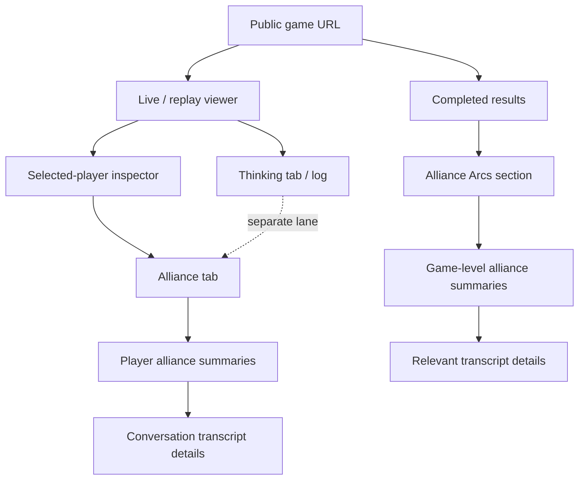
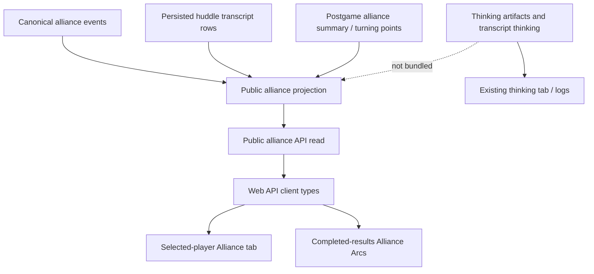

# Named Alliance Web UI - Plan

## Goal Capsule

- **Objective:** Add public-by-URL web UI for named-alliance viewing in live/replay inspection and completed-game results.
- **Product authority:** The web viewer is an audience surface, not an owner-only private-agent surface; anonymous viewers may see alliance conversation flow.
- **Primary outcome:** Viewers can inspect who was in named alliances, what those alliances discussed, and how the alliances played out without using MCP.
- **Execution profile:** Add a public alliance read projection, then wire it into the selected-player inspector and completed-results review.
- **Stop condition:** Do not implement owner-only web censorship, new alliance mechanics, private-vote behavior, loyalty interpretation, or a polished alliance sidecar in this slice.

---

## Product Contract

### Summary

Build a public named-alliance UI that combines an Alliance tab in the selected-player inspector with an Alliance Arcs section in completed results.
The UI should lead with concise alliance summaries and then expose the relevant conversation transcript details below the summary.
Agent thinking remains in the existing thinking lane rather than being bundled into alliance transcript details.

### Problem Frame

Named alliances now affect the game, and MCP/postgame reads can already explain alliance proposals, huddles, outcomes, and consequences.
The web viewer is still missing a first-class place to inspect that activity.
Without web UI, alliance gameplay remains legible through MCP and local debugging, but normal spectators cannot see the social structure that shaped votes, accusations, final statements, and jury questions.

### Key Decisions

- **Public viewer surface:** Alliance UI is public-by-URL for the web viewer.
  Anonymous viewers are allowed to inspect alliance records and alliance conversation flow.
- **Option A plus Option B:** The live/replay viewer gets player-scoped alliance inspection, and completed results gets a game-level alliance arc.
  These two surfaces cover both moment-by-moment evaluation and endgame story review.
- **Summary before transcript:** Each alliance view starts with a readable summary, then shows the public transcript details underneath.
  The summary helps scanning; the transcript details preserve the actual conversation flow.
- **Neutral semantic framing:** The UI presents alliance records as game facts without interpreting alliance loyalty.
  Rules copy owns that interpretation.
- **Thinking stays separate:** Alliance speech belongs in alliance transcript details.
  Thinking blocks may continue to appear through the agent thinking log according to the existing thinking surface.

### Actors

- A1. **Anonymous viewer:** Opens a game URL to watch a live match, replay a completed match, or inspect final results.
- A2. **Game evaluator:** Uses the web UI to check whether named alliances made strategy more legible and watchable.
- A3. **Selected player in inspector:** The player whose alliance involvement is being viewed in the live/replay inspector.

### Requirements

**Inspector Alliance Tab**

- R1. The selected-player inspector must include an Alliance tab or equivalent section for named-alliance context.
- R2. The inspector alliance view must show the selected player's involved alliances with name, participants, status, and relevant rounds.
- R3. The inspector alliance view must show a top-level summary for each alliance before any transcript detail.
- R4. The inspector alliance view must show public transcript details for alliance conversations below the summary.
- R5. The inspector alliance view must support proposal history that involved the selected player, including accepted, declined, countered, expired, closed, and archived outcomes when available.
- R6. The inspector alliance view must handle the selected player having multiple overlapping alliances without treating overlap as an error.

**Completed Results Alliance Arcs**

- R7. Completed results must include an Alliance Arcs section that summarizes named alliances across the whole game.
- R8. Alliance Arcs must show the major named alliances, participants, status, huddle count or activity level, and latest or final outcome summary when available.
- R9. Alliance Arcs must connect alliances to game consequences when deterministic public analysis supports it, such as alliance-member cuts, endgame accusations, final statements, or jury-question themes.
- R10. Alliance Arcs must allow viewers to inspect the relevant transcript details beneath each summary rather than requiring a separate raw transcript hunt.

**Audience and Visibility Shape**

- R11. The web UI must not restrict alliance visibility to only the viewer's owned agent.
- R12. The web UI must not hide alliance conversation flow from anonymous viewers solely because the conversation was private in-game.
- R13. The UI must keep agent thinking separate from alliance transcript details.
- R14. The UI must not expose raw prompts, provider debug envelopes, private trace manifests, source pointers, or House scheduling rationale as part of alliance viewing.

**Tone and Semantics**

- R15. The UI must present alliance facts neutrally and avoid interpreting alliance loyalty.
- R16. If the UI needs to explain what a named alliance means, it should link or point to rules language rather than restating rules interpretation inline.
- R17. Empty or unavailable alliance states must be legible without implying failure; older games or partial logs may simply have no alliance data.

### Key Flows

- F1. **Inspect selected player alliances**
  - **Trigger:** A viewer selects a player in live or replay view.
  - **Actors:** A1, A2, A3.
  - **Steps:** The viewer opens the Alliance tab, scans the selected player's alliance summaries, then expands or scrolls into transcript details for a specific alliance.
  - **Outcome:** The viewer understands what alliance context the selected player was involved in without leaving the match viewer.

- F2. **Review completed-game alliance arcs**
  - **Trigger:** A viewer opens completed results.
  - **Actors:** A1, A2.
  - **Steps:** The viewer scans Alliance Arcs, checks which players were involved, reads summaries of coordination or fracture, and opens transcript details for the alliances that shaped the result.
  - **Outcome:** The viewer can explain how alliances mattered in the completed game without using MCP.

- F3. **Separate alliance speech from thinking**
  - **Trigger:** A viewer inspects an alliance huddle and a player's thinking is also available elsewhere.
  - **Actors:** A1, A2.
  - **Steps:** The alliance view shows conversation transcript details, while the Thinking tab or thinking log remains the place for internal reasoning.
  - **Outcome:** Alliance UI preserves conversation flow without blending speech and internal reasoning into one surface.

### Layout Sketch

### Acceptance Examples

- AE1. **Covers R1-R6.** Given a selected player participated in three overlapping alliances, when a viewer opens the Alliance tab, then all three alliances appear with their participants, statuses, summaries, and available transcript details.
- AE2. **Covers R7-R10.** Given a completed game where an alliance shaped an endgame accusation, when a viewer opens completed results, then Alliance Arcs summarizes the alliance and provides the supporting transcript details below the summary.
- AE3. **Covers R11-R14.** Given an anonymous viewer opens a public game URL, when alliance data is available, then the viewer can inspect alliance summaries and conversation transcript details without owning any agent, while raw traces and House scheduling rationale remain absent.
- AE4. **Covers R13.** Given an alliance huddle has transcript speech and agent thinking, when the viewer opens the alliance details, then the huddle speech appears in alliance transcript details and thinking remains in the thinking surface.
- AE5. **Covers R15-R16.** Given an alliance later appears contradicted by a vote, when the UI shows that alliance, then it presents the record and consequences without interpreting alliance loyalty.
- AE6. **Covers R17.** Given an older completed game has no named-alliance records, when the viewer opens the Alliance tab or Alliance Arcs, then the UI shows a clear unavailable or empty state.

### Success Criteria

- A viewer can answer "who was in this player's alliances and what did they discuss?" from the web UI.
- A viewer can answer "which alliances mattered in this completed game?" from completed results.
- The UI exposes alliance conversation flow without exposing thinking, raw traces, source pointers, or House scheduling rationale in the alliance surface.
- The UI remains neutral about alliance truth or loyalty interpretation.

### Scope Boundaries

- Owner-only alliance drawers are rejected for this web UI slice.
- Agent-only censorship is rejected for this web UI slice.
- Always-on alliance chat or live participation UI is out of scope.
- New alliance mechanics, caps, naming rules, and huddle scheduling rules are out of scope.
- Rules interpretation belongs in the rules surface, not in the alliance UI.

### Dependencies / Assumptions

- Named-alliance proposal, huddle, outcome, and transcript facts are available from canonical events and persisted huddle transcript rows.
- The web viewer needs a public alliance read shape that differs from the owner-scoped MCP tool.
- Existing match inspector, completed results, and thinking surfaces remain the primary web grammar for this slice.

### Sources / Research

- `docs/solutions/architecture-patterns/owner-scoped-alliance-read-models.md` documents the compact/full alliance read pattern and the separation of alliance facts from raw private envelopes.
- `CONCEPTS.md` defines named alliances, alliance records, alliance huddles, alliance huddle outcomes, alliance facts projection, and completed-game results review.
- `docs/reasoning-transcript-observability.md` records the current hidden huddle transcript and thinking boundaries that this web viewer slice must update.
- `packages/api/src/routes/games.ts` currently keeps `GET /api/games/:id/transcript` public after terminal status but filters out `huddle` scope.
- `packages/api/src/services/ws-manager.ts` currently keeps huddle transcript entries out of public websocket messages.
- `packages/api/src/services/public-watch-intelligence.ts` currently excludes alliance-action and alliance-huddle cognitive artifacts from public watch intelligence.
- `packages/api/src/game-mcp/read-model.ts` already contains compact/full alliance facts logic for owner-scoped MCP reads.
- `packages/engine/src/postgame-analysis.ts` already derives compact alliance summaries, player alliance arcs, and alliance-member-cut turning points.
- `packages/web/src/app/games/[slug]/components/match-watch-shell.tsx` contains the current selected-player inspector tab structure.
- `packages/web/src/app/games/[slug]/components/completed-results-review.tsx` contains the current completed-results review structure.

---

## Planning Contract

### Product Contract Preservation

- The Product Contract above is preserved as the product authority.
- This plan resolves implementation shape only; it does not add alliance mechanics, alter proposal legality, cap overlapping alliances, or interpret loyalty.
- The only scope clarification is that public web viewer exposure is intentionally broader than owner-scoped MCP alliance reads.

### Key Technical Decisions

- KTD1. **Use a purpose-built public alliance read projection.** Do not broaden the general public transcript export or websocket feed to include all huddle messages. Add `GET /api/games/:id/alliances` as a named-alliance read surface that follows the same public-by-game-URL availability posture as game detail and results.
- KTD2. **Separate web-public from MCP-owner.** Owner-scoped MCP reads remain useful for subject-agent inspection, but the web viewer must expose game-level alliance records and conversation flow to anonymous viewers.
- KTD3. **Share projection concepts, not authorization behavior.** Reuse compact/full alliance read concepts where practical, but implement the web projection without selected-agent filtering or owner authorization gates.
- KTD4. **Transcript details omit thinking.** Alliance transcript details include spoken huddle messages, speaker names, round/window/pass metadata, and outcome summaries. Thinking stays in the existing thinking surfaces.
- KTD5. **Completed results should not duplicate postgame analysis from scratch.** Use existing postgame alliance summaries and turning points where available, then join them with the alliance transcript projection for details.
- KTD6. **UI stays neutral and utilitarian.** The UI presents records, participants, huddle activity, summaries, and consequences without claiming loyalty, sincerity, or betrayal unless those are explicit recorded claims or deterministic postgame analysis labels.
- KTD7. **Minimal UI first.** Build readable sections inside existing inspector/results surfaces. Avoid new route-level navigation, graph visualizations, delayed-reveal systems, and a rich alliance sidecar.

### High-Level Design

### Resolved Planning Questions

- **Public read surface:** Add `GET /api/games/:id/alliances` as the web-facing read for all game-level alliance facts needed by the viewer. It should be callable for public game URLs and should not require player ownership.
- **Transcript exposure:** Keep the existing general transcript export and websocket huddle filtering intact. The new alliance read is the intentional place where alliance huddle conversation details are exposed for web inspection.
- **Read shape:** Include summary counts, proposal records, alliance records, huddle outcome summaries, and huddle transcript messages. Omit thinking, prompts, raw provider payloads, source pointers, producer manifests, and House scheduling rationale.
- **Live and completed games:** Use one read shape for active/replay inspection and completed-results review where possible. Completed results can also use existing postgame summaries for consequence labels.
- **Unavailable data:** Older games and partial logs should return availability diagnostics or empty arrays that the UI can render without treating the state as a failure.

### System-Wide Impact

- **API:** Needs a public alliance projection and `GET /api/games/:id/alliances` route that deliberately differs from owner-scoped MCP reads and from generic transcript export.
- **Web API client:** Needs typed alliance read contracts, fetch helper, and error/empty-state handling.
- **Match viewer:** Needs an Alliance tab in the selected-player inspector and model helpers that filter game-level alliance facts to the selected player.
- **Completed results:** Needs an Alliance Arcs section fed by game-level alliance facts plus postgame consequence summaries.
- **Docs/tests:** Existing docs and tests that say huddle transcript is hidden from public generic transcript/watch surfaces must stay true while naming the public alliance read exception.

### Risks

- **Boundary confusion:** The repo already has owner-scoped MCP alliance reads and public transcript huddle filtering. Mitigate by naming the new read as public web alliance facts and testing that generic transcript/websocket behavior stays unchanged.
- **Payload size:** Full huddle transcript details can get large. Mitigate by summary-first rendering and collapsible or bounded detail sections in the UI.
- **Older-game sparsity:** Games from before named alliances or before huddle persistence may have no details. Mitigate with availability diagnostics and empty states.
- **Semantic overclaiming:** Alliance records are consent facts, not loyalty facts. Mitigate through neutral labels and tests that avoid truth/sincerity copy.
- **Responsive pressure:** Adding a fifth inspector tab can squeeze the current compact tab rail. Mitigate with a tab layout that remains stable on the inspector's supported widths.

---

## Implementation Units

### U1. Public Alliance Projection and API Read

**Goal:** Add a public-by-URL alliance read surface that exposes named-alliance summaries and huddle conversation details without using owner-scoped MCP authorization.

**Requirements:** R2, R3, R4, R5, R6, R7, R8, R10, R11, R12, R13, R14, R17; AE1, AE2, AE3, AE4, AE6; KTD1, KTD2, KTD3, KTD4.

**Primary paths:**

- `packages/api/src/routes/games.ts`
- `packages/api/src/services/completed-game-results.ts`
- `packages/api/src/game-mcp/read-model.ts`
- `packages/api/src/__tests__/games-api.test.ts`
- `packages/api/src/__tests__/postgame-analysis.test.ts`

**Approach:**

- Add `GET /api/games/:id/alliances` and build its response from persisted canonical alliance events plus huddle transcript rows.
- Return game-level facts rather than selected-agent facts: proposal history, alliance records, huddles, messages, outcome summaries, participant names, and availability diagnostics.
- Exclude thinking, raw envelopes, source pointers, producer trace manifests, provider payloads, and House scheduling rationale.
- Keep `GET /api/games/:id/transcript` behavior unchanged so huddle entries remain absent from the generic transcript export.
- Keep websocket huddle filtering unchanged in this slice.
- Reuse compact alliance helper concepts where it reduces drift, but do not reuse owner filtering or `yourResponse` semantics in a way that implies a selected user.

**Test scenarios:**

- Anonymous public read returns all alliances and huddles for a game with named-alliance events.
- Public read includes huddle message text and speaker names but omits `thinking`.
- Public read includes proposal history and final statuses without owner filtering.
- Public read follows the same game existence and public URL availability rules as game detail/results, not owner-scoped MCP access.
- Public read does not expose House schedule/skip rationale, raw canonical envelopes, source pointers, provider payloads, or trace manifests.
- Generic transcript export still omits `huddle` scope.
- Games without alliance data return a successful empty or unavailable alliance payload.

**Verification:**

- `bun test packages/api/src/__tests__/games-api.test.ts packages/api/src/__tests__/postgame-analysis.test.ts`
- `bun run --filter @influence/api typecheck`

### U2. Web API Types and Alliance View Model Helpers

**Goal:** Add frontend API types and model helpers so both web surfaces can consume the same public alliance read without duplicating filtering and formatting logic.

**Requirements:** R2, R3, R4, R5, R6, R7, R8, R10, R17; AE1, AE2, AE6; KTD3, KTD4, KTD5.

**Primary paths:**

- `packages/web/src/lib/api.ts`
- `packages/web/src/app/games/[slug]/components/match-watch-alliance-model.ts`
- `packages/web/src/app/games/[slug]/components/completed-results-model.ts`
- `packages/web/src/__tests__/match-watch-alliance-model.test.ts`
- `packages/web/src/__tests__/completed-results-model.test.ts`

**Approach:**

- Add public alliance response types and a `getGameAlliances` fetch helper to the web API client.
- Add model helpers that filter game-level alliance facts by selected player for the inspector.
- Add completed-results helpers that rank or group game-level alliances using existing postgame summary cues where available.
- Normalize loading, failed, missing, and availability-diagnostic states into UI-friendly model values.
- Keep huddle message models free of thinking fields.

**Test scenarios:**

- A selected player with overlapping alliances receives every involved alliance in the inspector model.
- Proposal records involving the selected player appear even when the proposal declined, expired, or archived.
- Completed-results model ranks alliances with huddle activity and latest outcomes ahead of inactive records when data is available.
- Message models contain speech text and speakers but no thinking field.
- Empty alliance payloads produce stable empty-state models.

**Verification:**

- `bun test packages/web/src/__tests__/match-watch-alliance-model.test.ts packages/web/src/__tests__/completed-results-model.test.ts`
- `bun run --filter @influence/web typecheck`

### U3. Selected-Player Inspector Alliance Tab

**Goal:** Add the Alliance tab to the live/replay selected-player inspector with summary-first cards and transcript details below each summary.

**Requirements:** R1, R2, R3, R4, R5, R6, R11, R12, R13, R14, R15, R16, R17; AE1, AE3, AE4, AE5, AE6; KTD4, KTD6, KTD7.

**Primary paths:**

- `packages/web/src/app/games/[slug]/components/match-watch-shell.tsx`
- `packages/web/src/app/games/[slug]/components/match-watch-alliance-panel.tsx`
- `packages/web/src/__tests__/match-watch-shell.test.tsx`
- `packages/web/src/__tests__/match-watch-alliance-panel.test.tsx`

**Approach:**

- Fetch public alliance facts alongside existing game/watch intelligence data in the game viewer path.
- Add an Alliance tab to the selected-player inspector.
- Render alliance cards with name, participants, status, rounds, proposal state, huddle count, and latest outcome summary before any messages.
- Render huddle transcript details underneath the relevant alliance summary, grouped by round/window/pass.
- Keep thinking out of alliance details and leave it in the existing Thinking tab.
- Treat alliance-read loading and error states as panel-local states so the rest of the inspector remains usable.
- Use neutral labels and compact text that fit the inspector rail; avoid claims about whether the alliance was true or loyal.

**Test scenarios:**

- Inspector tab list includes Alliance and remains usable with the existing tabs.
- Selecting a player shows all alliances and proposals involving that player.
- Huddle transcript details render below the summary, not before it.
- Thinking sentinel text from huddle rows does not appear in the Alliance tab.
- No owner/agent authentication state is required for alliance content to appear.
- Alliance-read loading and error states render inside the Alliance tab without replacing the rest of the inspector.
- Empty alliance state renders a clear unavailable or no-alliance message.

**Verification:**

- `bun test packages/web/src/__tests__/match-watch-shell.test.tsx packages/web/src/__tests__/match-watch-alliance-panel.test.tsx`
- `bun run --filter @influence/web typecheck`

### U4. Completed Results Alliance Arcs Section

**Goal:** Add an Alliance Arcs section to completed results that summarizes game-level alliance activity and exposes relevant transcript details below each summary.

**Requirements:** R7, R8, R9, R10, R11, R12, R13, R14, R15, R16, R17; AE2, AE3, AE4, AE5, AE6; KTD5, KTD6, KTD7.

**Primary paths:**

- `packages/web/src/app/games/[slug]/components/completed-results-review.tsx`
- `packages/web/src/app/games/[slug]/components/completed-results-alliance-arcs.tsx`
- `packages/web/src/app/games/[slug]/components/completed-results-model.ts`
- `packages/web/src/__tests__/completed-results-review.test.tsx`
- `packages/web/src/__tests__/completed-results-model.test.ts`

**Approach:**

- Load public alliance facts for completed games in the completed-results review component.
- Add an Alliance Arcs section after the top-level story summary and before or near vote history so viewers see social structure before vote math.
- Render major alliances with participants, status, huddle activity, latest outcome, and deterministic consequence labels when postgame analysis provides them.
- Render transcript detail groups below each alliance summary.
- Treat alliance-read loading and error states as section-local states so the rest of completed results remains usable.
- Keep the copy factual and concise; do not claim an alliance was sincere or fake.

**Test scenarios:**

- Completed results render Alliance Arcs when alliance data is available.
- Alliance Arcs show names, participants, status, huddle activity, and latest outcome summary.
- Deterministic alliance-member-cut or endgame consequence labels appear only when supplied by postgame analysis.
- Transcript details render under the corresponding alliance summary.
- Thinking and House scheduling rationale do not appear in Alliance Arcs.
- Alliance-read loading and error states render inside Alliance Arcs without replacing the whole results review.
- Completed games without alliance data keep the existing results review usable.

**Verification:**

- `bun test packages/web/src/__tests__/completed-results-review.test.tsx packages/web/src/__tests__/completed-results-model.test.ts`
- `bun run --filter @influence/web typecheck`

### U5. Documentation and Boundary Alignment

**Goal:** Update docs and tests so the new public web alliance read is understood as a deliberate web-viewer surface, not a generic transcript or MCP privacy regression.

**Requirements:** R11, R12, R13, R14, R15, R16, R17; AE3, AE4, AE5, AE6; KTD1, KTD2, KTD4, KTD6.

**Primary paths:**

- `docs/rules-page-content.md`
- `docs/reasoning-transcript-observability.md`
- `CONCEPTS.md`
- `docs/solutions/architecture-patterns/owner-scoped-alliance-read-models.md`
- `packages/web/src/__tests__/rules-page.test.ts`

**Approach:**

- Clarify that the web game viewer is public-by-URL and may expose alliance records and alliance conversation flow through the alliance UI.
- Preserve the distinction that generic transcript export, websocket feed, MCP owner reads, producer reads, and thinking logs have their own boundaries.
- Update terminology if needed so "public alliance read" is not confused with owner-scoped `read_agent_alliances`.
- Keep rules interpretation in the rules surface and keep the UI itself neutral.

**Test scenarios:**

- Rules/docs describe the web viewer alliance exposure without implying owner-only web access.
- Docs still say thinking belongs in thinking surfaces, not alliance transcript detail.
- Docs still distinguish alliance speech from raw traces, prompts, and House rationale.
- Existing rules page tests are updated for the public web alliance contract.

**Verification:**

- `bun test packages/web/src/__tests__/rules-page.test.ts`

### U6. Integrated Validation and Visual QA

**Goal:** Prove the public alliance UI works with realistic data and does not regress the existing watch/results flows.

**Requirements:** R1-R17; AE1-AE6; KTD1-KTD7.

**Primary paths:**

- `packages/api/src/__tests__/games-api.test.ts`
- `packages/web/src/__tests__/match-watch-shell.test.tsx`
- `packages/web/src/__tests__/completed-results-review.test.tsx`
- `packages/web/src/__tests__/match-watch-alliance-panel.test.tsx`
- `packages/web/src/__tests__/completed-results-alliance-arcs.test.tsx`

**Approach:**

- Add representative fixtures with overlapping alliances, declined/expired proposals, huddle transcript rows, huddle outcomes, and postgame consequence signals.
- Run focused API and web tests before broader typecheck/test gates.
- Start the local app and inspect the game viewer and completed-results review with seeded or existing named-alliance data.
- Check desktop widths used by the inspector; if mobile does not expose the inspector today, do not invent a new mobile inspection pattern in this slice.

**Test scenarios:**

- End-to-end fixture renders selected-player alliance involvement and completed-game Alliance Arcs from the same public alliance payload.
- Viewer does not need authentication or agent ownership to see alliance facts.
- Huddle speech appears in alliance UI while thinking remains absent from alliance detail.
- Existing transcript export and websocket filtering tests continue to pass.
- UI text does not overflow the inspector tab rail or card containers at supported widths.

**Verification:**

- `bun test packages/api/src/__tests__/games-api.test.ts`
- `bun test packages/web/src/__tests__/match-watch-shell.test.tsx packages/web/src/__tests__/completed-results-review.test.tsx packages/web/src/__tests__/match-watch-alliance-panel.test.tsx packages/web/src/__tests__/completed-results-alliance-arcs.test.tsx`
- `bun run --filter @influence/api typecheck`
- `bun run --filter @influence/web typecheck`
- `bun run check`

---

## Verification Contract

### Focused Checks

- `bun test packages/api/src/__tests__/games-api.test.ts packages/api/src/__tests__/postgame-analysis.test.ts`
- `bun test packages/web/src/__tests__/match-watch-alliance-model.test.ts packages/web/src/__tests__/match-watch-alliance-panel.test.tsx`
- `bun test packages/web/src/__tests__/completed-results-model.test.ts packages/web/src/__tests__/completed-results-review.test.tsx packages/web/src/__tests__/completed-results-alliance-arcs.test.tsx`
- `bun test packages/web/src/__tests__/match-watch-shell.test.tsx packages/web/src/__tests__/rules-page.test.ts`

### Baseline Checks

- `bun run --filter @influence/api typecheck`
- `bun run --filter @influence/web typecheck`
- `bun run check`

### Manual / Browser Checks

- Start the local web/API stack using the repo's existing dev workflow.
- Open a game with named-alliance data.
- Select at least two players with overlapping alliance memberships and inspect the Alliance tab.
- Open completed results for a named-alliance game and inspect Alliance Arcs.
- Confirm summaries appear before transcript details in both surfaces.
- Confirm huddle speech appears, thinking does not appear in alliance detail, and House rationale/source pointers/raw traces do not appear.
- Confirm an anonymous or unauthenticated web session can view alliance UI for a public game URL.

---

## Definition of Done

- U1 through U6 are implemented or explicitly split with user approval.
- The public alliance read exposes alliance summaries and huddle conversation details without requiring agent ownership.
- Generic public transcript export and websocket huddle filtering remain unchanged unless the user separately reopens that contract.
- The selected-player inspector has an Alliance tab that shows involved alliances, proposal history, summaries, and transcript details.
- Completed results include Alliance Arcs with major alliances, participants, outcomes, consequences, and transcript details.
- Thinking remains in existing thinking surfaces and is absent from alliance transcript detail.
- The UI stays neutral about alliance loyalty and does not explain rules beyond links or terse labels.
- Docs/tests distinguish public web alliance viewing from owner-scoped MCP alliance reads.
- Focused checks and baseline checks pass, or any failures are documented with owner-approved follow-up.
