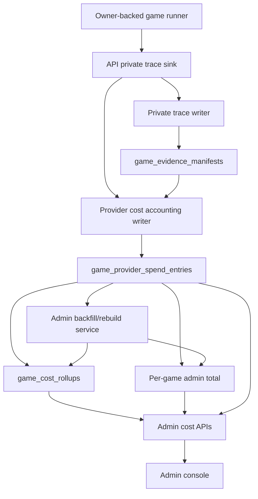

# House Cost Accounting - Plan

## Goal Capsule

| Field | Value |
|---|---|
| Objective | Give administrators precise, durable cost visibility for supported live game runs and future provider-backed game runs. |
| Product authority | Admin cost visibility is producer-private operational accounting, not public gameplay content and not player-facing billing. |
| Scope | Implement ideas 1-5 from `docs/ideation/2026-07-03-live-game-cost-tracking-ideation.html`: provider-call ledger, live game rollup, provider cost normalization, admin console visibility, single-game historical backfill, and reconciliation record hooks. |
| Deferred | Budget alerts, hard spend caps, and tokenmax ROI reporting from ideas 6-7 are deferred until the ledger is trustworthy. |
| Non-blocking assumptions | Provider responses and private trace metadata remain the earliest safe boundary for usage facts; unknown cost is explicit and never treated as zero. |

---

## Product Contract

### Summary

This plan adds a producer-private House cost ledger for every captured provider call, rebuildable game-level rollups for active and terminal runs, and an admin view that answers what a game has cost, how trustworthy the number is, and where spend concentrated.
The first implementation uses existing private trace usage metadata as the capture boundary and keeps raw prompts, responses, and reasoning out of accounting rows.

### Problem Frame

Game creation still shows early cost estimates, but tokenmaxxing has made those estimates stale enough to be operationally misleading.
Administrators need to know what current high-quality runs cost before any optimization, budgeting, or model policy work can be honest.

The current terminal `game_results.tokenUsage` snapshot only exists after completion and uses a static OpenAI price table.
Suspended, cancelled, retried, and provider-router runs can spend money without leaving a precise, admin-readable trail.

### Key Decisions

- The source of truth is a per-call provider spend ledger, not terminal results, public transcripts, or raw private trace blobs.
- Rollups are derived from ledger rows and can be rebuilt; terminal game results may snapshot rollup totals for compatibility.
- Cost values carry provenance through a confidence ladder so administrators can distinguish provider actuals, router actuals, reconciled amounts, catalog/static estimates, and unavailable values.
- Admin views expose safe accounting facts and trace links only where authorized; they do not embed raw prompt, response, thinking, or reasoning content.
- Backfill is useful but lower-confidence; historical rows must be labeled by source so they do not masquerade as native live capture.

### Actors

- A1. Administrator: an authorized operator with `view_admin` or stronger permission who needs cost totals, confidence, hotspots, and backfill state for games.
- A2. Cost accounting operator: an authorized operator with a cost-accounting mutation permission who may backfill/rebuild one game's accounting rows or record reconciliation deltas.
- A3. Producer maintainer: a developer/operator who may inspect private traces through existing audited evidence paths when debugging cost drift.
- A4. Game runner: the API-owned live run process that receives provider responses and emits private trace evidence.
- A5. Public viewer/player: a non-admin user who must not receive cost accounting payloads through public game APIs.

### Requirements

**Accounting Source of Truth**

- R1. The system records one provider spend entry per captured model/provider call attempt for owner-backed game runs.
- R2. Each spend entry stores safe metadata: game, owner epoch, event sequence when known, generated call ID, attempt ordinal, retry parent source key when known, provider response ID when safely available, actor, action, phase, round, provider profile, provider/catalog/model identifiers, API surface when known, call status, latency when known, usage counters, provider-native billing facts, normalized micro-USD fields, currency, pricing provenance, cost source, capture source, sanitized diagnostics, and an internal trace manifest reference when available.
- R3. Spend entries must not store raw prompts, raw responses, tool arguments, thinking, reasoning context, or unsanitized player-private content.
- R4. Live capture uses deterministic source keys so duplicate sink calls do not double-count while real retries remain separate billable attempts.
- R5. Accounting write failure must degrade observability without failing the game run.

**Durability and Rollups**

- R6. The system maintains durable cost rollups keyed by game and owner epoch, plus admin per-game totals across all owner epochs for active, suspended, cancelled, and completed states.
- R7. Rollups include call counts, failed/unpriced counts, prompt/cached/completion/reasoning/total tokens, actual micro-USD, estimated micro-USD, provider-native charges, and breakdowns by provider, model, actor role, actor/player/House identity, action, phase, round, and owner epoch.
- R8. Rollups are rebuildable from ledger entries and are the admin-trusted live read model.
- R9. Completion snapshots in `game_results.tokenUsage` remain public-safe token-count compatibility only and must not include cost, pricing provenance, provider-native charges, breakdowns, source keys, or trace references.

**Provider Cost Semantics**

- R10. The system normalizes OpenAI Chat Completions usage, OpenAI Responses usage from `trace.usage` or `trace.response.raw.usage`, Katana router billing such as `usage.imgnai`, and missing/local-model usage into one safe provider usage envelope.
- R11. Normalized cost values use integer micro-USD where USD is known and preserve provider-native units for credits or non-USD billing.
- R12. Every cost value carries `costSource` pricing confidence such as `provider_actual`, `router_actual`, `org_reconciled`, `catalog_estimate`, `static_estimate`, or `unavailable`.
- R13. Unknown cost is represented as unavailable with diagnostics, not as zero.
- R14. Estimated rows store rate-card provenance such as pricing source ID, rate-card version, and priced-at timestamp so historical estimates remain explainable after provider prices change.
- R15. Future providers must be classifiable without changing public game payloads.

**Admin Visibility**

- R16. `GET /api/admin/games` includes compact cost summary fields for game rows.
- R17. `GET /api/admin/games/:idOrSlug/costs` returns a per-game cost detail across owner epochs with owner-epoch drilldown, rollup totals, confidence labels, provider/model/action/player/House breakdowns, expensive calls, failed call count, retry/failure spend, pricing provenance, and backfill state.
- R18. The admin UI shows costs for running, suspended, cancelled, and completed games with confidence badges and distinct states for loading, refreshing stale data, no captured calls yet, unsupported/not backfilled, partial backfill, unpriced calls, unavailable cost, estimated-only totals, actual/reconciled totals, detail fetch errors, and empty breakdowns.
- R19. Cost data remains admin-only and must not appear in public game summaries, player dashboards, public match pages, public result payloads, or MCP game-read surfaces unless a later producer-private design explicitly adds it.

**Backfill and Reconciliation**

- R20. A cost-accounting mutation path creates labeled spend entries for one game at a time from existing `game_evidence_manifests.metadata.usage` and terminal `game_results.tokenUsage` where no live ledger row exists.
- R21. Backfilled rows preserve source precision: call-level trace manifests rank above aggregate terminal results, and malformed or total-only legacy snapshots become skipped/unavailable counts rather than invented costs.
- R22. Reconciliation v1 stores and reports manually supplied or otherwise available normalized provider/account deltas when they can be mapped to a game; it does not include provider API clients, schedulers, export parsers, admin upload UI, request tagging, or automated polling.
- R23. Provider reconciliation that cannot map a provider report to a game remains marked partial or unavailable.
- R24. Backfill, rebuild, and reconciliation mutations require a stronger cost-accounting permission than `view_admin`, are audited, and are not exposed as v1 admin-web controls.

### Key Flows

- F1. Live provider call capture
  - **Trigger:** A game runner receives a provider response and emits a private decision trace.
  - **Actors:** A4.
  - **Steps:** The trace sink assigns call identity, extracts safe usage and router billing metadata, writes a spend entry, updates the game and owner-epoch rollups, then links the private evidence manifest internally when available.
  - **Outcome:** Administrators can see cost progress before the game reaches completion.
  - **Covered by:** R1-R15.

- F2. Administrator inspects a running or suspended game
  - **Trigger:** A1 opens the admin game list or game cost detail.
  - **Actors:** A1.
  - **Steps:** The API reads per-game totals across owner epochs and safe ledger summaries, marks confidence/unavailable states, and returns only admin-authorized accounting data.
  - **Outcome:** The admin can answer current spend, model/provider concentration, and missing-cost risk.
  - **Covered by:** R6-R19.

- F3. Historical backfill and reconciliation
  - **Trigger:** A2 runs a cost-accounting mutation action for one game.
  - **Actors:** A2, A3.
  - **Steps:** The job creates idempotent backfilled rows from manifests/results, rebuilds rollups, and records normalized provider-report deltas when a usable provider report exists.
  - **Outcome:** Historical baselines become visible without pretending lower-confidence data is precise live capture.
  - **Covered by:** R20-R24.

### Acceptance Examples

- AE1. Given an owner-backed game emits an OpenAI trace with prompt, cached, completion, reasoning, and total tokens, when the trace sink runs, then a spend entry and rollup update exist with token totals, model identifiers, and a cost source label.
- AE2. Given a game suspends after several provider calls and before terminal completion, when an admin opens cost detail, then the run still shows spend totals and confidence states from ledger/rollup rows.
- AE3. Given a Katana-routed provider response includes router billing facts but no USD amount, when accounting records it, then provider-native charges are visible and normalized USD is marked unavailable or estimated according to available metadata.
- AE4. Given a public viewer loads a game or public results, when public game APIs respond, then no cost ledger, rollup, provider-native, pricing provenance, source key, or trace-reference payload is included.
- AE5. Given historical private trace manifests contain safe usage metadata, when backfill runs twice, then it creates idempotent labeled entries once and rebuilds the rollup without double-counting.
- AE6. Given only terminal `game_results.tokenUsage` exists for an old game, when backfill runs, then the entry is marked aggregate and lower-confidence than trace-level rows.
- AE7. Given a recovered game has spend under two owner epochs, when an admin opens cost detail, then the total includes both epochs and the response includes owner-epoch breakdowns.
- AE8. Given a view-admin user without cost-accounting mutation permission, when they request backfill/rebuild, then the write is denied while cost reads still work.

### Success Criteria

- Administrators can inspect cost for active, suspended, cancelled, and completed owner-backed runs without waiting for `game_results`.
- Provider/cost provenance is visible enough that unavailable, estimated, router-native, and actual/reconciled amounts are not confused.
- Accounting rows remain safe operational metadata and do not widen public, player, or MCP game-read data exposure.
- Backfill gives useful historical baselines while clearly labeling partial precision.
- Historical estimates remain explainable through stored pricing provenance.

### Scope Boundaries

#### In Scope

- Live cost capture from existing game-run private trace metadata.
- Durable per-call ledger rows and rebuildable game/owner epoch rollups.
- Admin API and admin web visibility for game cost summaries and details.
- Idempotent single-game backfill from private trace manifests and terminal result snapshots.
- Reconciliation record schema and service/API read behavior for normalized provider/account deltas when a mappable provider report is supplied.
- Documentation of the producer-private accounting boundary.

#### Deferred to Follow-Up Work

- Budget alerts, hard caps, governance warnings, and spend-based start blocking.
- Tokenmax ROI reporting that correlates spend with quality outcomes.
- Player-facing billing, chargeback, or per-user invoice surfaces.
- Public cost displays.
- Generic image/avatar cost unification beyond reusing vocabulary and confidence semantics.
- A raw private trace browser inside the admin cost console.
- Batch backfill jobs, progress tracking, retries, and batch web controls.
- Provider API clients, scheduled reconciliation, provider export parsing, admin upload UI, and request tagging.

### Dependencies / Assumptions

- Owner-backed API game runs remain the supported live accounting target for the first slice.
- Private trace metadata is safe to reuse for accounting because it already excludes raw trace bodies and is producer/admin scoped.
- Some provider responses will lack USD cost; those rows remain useful when they preserve usage, native billing units, and diagnostics.
- OpenAI organization cost APIs or exports may not map cleanly to game IDs without project/API-key separation or request tagging, so reconciliation is additive and confidence-labeled.
- Katana account-level reconciliation remains provider-specific until a real billing/reporting API is confirmed.
- Private trace manifests that predate Responses usage capture may backfill token/cost as unavailable instead of zero.

### Sources / Research

- `docs/ideation/2026-07-03-live-game-cost-tracking-ideation.html`
- `CONCEPTS.md`
- `docs/reasoning-transcript-observability.md`
- `packages/engine/src/game-runner.types.ts`
- `packages/api/src/services/private-trace-writer.ts`
- `packages/api/src/services/game-lifecycle.ts`
- `packages/engine/src/token-tracker.ts`
- `packages/api/src/db/schema.ts`
- `packages/api/src/routes/admin.ts`
- `packages/web/src/lib/api.ts`
- `packages/web/src/app/admin/admin-panel.tsx`
- `packages/web/src/app/admin/games/game-history-browser.tsx`

---

## Planning Contract

### Key Technical Decisions

- KTD1. Capture costs at the API private-trace sink boundary.
  This boundary already sees owner-backed game ID, owner epoch, event sequence, model metadata, token usage, router billing diagnostics, and producer-private trace linkage, so the first slice avoids invasive engine plumbing while still covering supported live game runs.

- KTD2. Store immutable spend entries and rebuildable rollups.
  Ledger rows are the durable facts; owner-epoch rollups and per-game admin totals are read models that can be updated on insert or rebuilt after backfill.

- KTD3. Keep accounting metadata safe by construction.
  The ledger stores model, actor, action, usage, billing provenance, sanitized diagnostics, and internal manifest references, but not prompts, responses, reasoning, tool arguments, object-storage pointers, presigned URLs, or raw trace bodies.

- KTD4. Treat estimates and unavailable costs as first-class states.
  `actualCostMicrousd`, `estimatedCostMicrousd`, provider-native amount/unit, currency, `costSource`, pricing source ID, rate-card version, and priced-at timestamp remain separate so admin UI cannot accidentally present a guess as a bill.

- KTD5. Make backfill idempotent by source key.
  Live rows use `live:${gameId}:${ownerEpoch}:${callId}`, trace-manifest backfill uses `manifest:${manifestId}`, and aggregate terminal fallback uses `terminal-result:${gameId}`; `captureSource` records live/backfill provenance and `costSource` records pricing confidence.

- KTD6. Ship reconciliation as a normalized record contract, not a provider poller.
  The implementation can store/report reconciliation attempts and deltas when normalized provider/account data is supplied; automated OpenAI/Katana polling, export parsing, admin upload UI, request tagging, and scheduled reconciliation stay outside this slice.

- KTD7. Keep public token compatibility token-only.
  `game_results.tokenUsage` may keep public-safe token counts and legacy estimated-cost fields that already exist, but new cost accounting fields, provenance, provider-native billing, trace references, and breakdowns live only behind admin cost APIs.

### High-Level Technical Design

The live path records a cost row from the enriched private decision trace and updates the rollup without depending on raw trace storage success.
When private trace storage succeeds, the ledger row links to the manifest ID; when storage fails, the ledger row still preserves safe usage and provider billing facts.
Cost APIs return safe accounting summaries and opaque trace handles only when a later evidence drill-in is explicitly authorized; they do not return manifest IDs, object keys, buckets, presigned URLs, or raw evidence content by default.

### Assumptions

- The first implementation covers owner-backed API game runs because that is the supported live execution path with game ID and owner epoch context.
- Existing simulations and legacy non-owner paths may continue to use `TokenTracker` aggregates until they opt into a safe run-level accounting sink.
- Provider-reported USD cost is not guaranteed for Katana or local OpenAI-compatible providers, so native billing units and diagnostics are required.
- The admin UI can start with game list summaries and a compact game-detail cost drawer/panel instead of a full standalone finance dashboard.
- Admin-web backfill controls are out of v1; the UI shows read-only backfill status while mutation stays API/operator controlled behind stronger permission.

### System-Wide Impact

- Data model: new ledger, rollup, and reconciliation tables plus Drizzle schema exports.
- Runtime: private trace sink gains best-effort cost accounting writes and rollup updates.
- Admin API: game list payloads gain compact admin-only cost summaries and a new cost detail endpoint.
- Admin web: admin game surfaces display cost totals, confidence/unavailable state, and provider/model/action/player/House hotspots.
- RBAC: cost reads use admin-read permission; backfill/rebuild/reconciliation writes use a stronger cost-accounting mutation permission.
- Documentation: producer-private trace docs and concepts must name cost accounting as safe metadata, not public gameplay truth.

### Risks & Mitigations

| Risk | Mitigation |
|---|---|
| Accounting write failure interrupts gameplay. | Catch and warn in the trace sink; never throw through the game runner for accounting-only failure. |
| Duplicate rows double-count spend after retries or backfill. | Use deterministic `sourceKey` uniqueness and upsert behavior; rebuild rollups from ledger entries during backfill. |
| Admin UI makes estimates look like bills. | Display source/confidence labels and separate actual, estimated, and unavailable amounts. |
| Ledger accidentally stores sensitive trace content. | Limit schema to safe scalar/json metadata, allowlist diagnostics/report fields, and add tests/assertions around prompt/response absence. |
| Backfill precision is overstated. | Label `trace_manifest_backfill` and `terminal_result_backfill` distinctly and expose aggregate/source counts. |
| Public result payloads leak admin cost details. | Keep terminal compatibility token-only and test public game/result/MCP surfaces against cost-field exposure. |

### Documentation / Operational Notes

- Update `CONCEPTS.md` with domain terms for provider spend ledger and game cost rollup.
- Update `docs/reasoning-transcript-observability.md` to explain that private trace usage can feed admin accounting while raw trace content remains private evidence.
- Production rollout requires applying the new Drizzle migration before relying on admin cost endpoints.

---

## Implementation Units

### U1. Add Cost Accounting Schema And Migration

- **Goal:** Create durable tables for provider spend entries, game rollups, and reconciliation records.
- **Requirements:** R1-R15, R20-R24.
- **Files:** `packages/api/src/db/schema.ts`, `packages/api/drizzle/0026_game_cost_accounting.sql`, `packages/api/drizzle/meta/_journal.json`.
- **Approach:** Add typed Drizzle tables with `sourceKey`, `captureSource`, `costSource`, pricing provenance, call identity, retry fields, owner-epoch indexes, per-game aggregation support, reconciliation records, audit-friendly timestamps, source-key uniqueness, and allowlisted safe JSON fields for breakdowns/diagnostics.
- **Test Scenarios:** Typecheck schema imports; migration SQL contains constraints/indexes needed for source idempotency, owner-epoch drilldown, stronger mutation permission, and admin queries.
- **Verification:** Covered by `bun run check` plus targeted API tests that insert ledger/rollup rows.

### U2. Build Provider Cost Accounting Service

- **Goal:** Normalize trace usage into safe spend entries, calculate static estimates when possible, update/rebuild rollups, and support backfill/reconciliation contracts.
- **Requirements:** R1-R15, R20-R24, AE1-AE8.
- **Files:** `packages/api/src/services/provider-cost-accounting.ts`, targeted tests under `packages/api/src`.
- **Approach:** Introduce `captureSource` and `costSource` enums, safe metadata helpers, deterministic source keys, generated call IDs, optional provider response IDs, OpenAI Chat/Responses usage normalization from trace metadata or raw response usage, static-estimate fallback with pricing provenance, Katana/native-billing extraction, rollup aggregation across owner epochs, single-game backfill from manifests/results, and normalized reconciliation record reads/writes.
- **Test Scenarios:** OpenAI Chat and Responses fixtures create token/cost fields; Katana router metadata preserves native units; missing USD is unavailable; duplicate source key is idempotent; real retries remain separate; recovered game spend sums across owner epochs; rollup rebuild is deterministic; rich, total-only, empty, malformed, and missing-model terminal-result backfills are labeled instead of inventing cost; recursive diagnostic redaction catches unsafe keys.
- **Verification:** Targeted Bun test for the service plus `bun run test`.

### U3. Wire Live Capture Into Game Lifecycle

- **Goal:** Record cost entries from private decision traces during supported live game runs without making gameplay depend on accounting.
- **Requirements:** R1-R15, R19, AE1-AE4, AE7.
- **Files:** `packages/api/src/services/game-lifecycle.ts`, `packages/api/src/services/private-trace-writer.ts` if manifest metadata return shape needs reuse.
- **Approach:** Call the cost accounting service inside `createPrivateTraceSink`, assign or preserve call identity, write/update before or alongside private trace manifest creation, attach internal manifest references when available, and catch/log accounting failures with safe identifiers only.
- **Test Scenarios:** Trace sink records spend for owner-backed run; private trace storage failure still allows cost capture; cost writer failure logs safe context and does not throw to the runner; completion does not add new admin cost fields to public `game_results.tokenUsage`.
- **Verification:** Targeted service/lifecycle test and `bun run test`.

### U4. Add Admin Cost API And Backfill Endpoint

- **Goal:** Expose admin-only cost summaries and per-game cost details with safe backfill controls.
- **Requirements:** R16-R24, AE2-AE8.
- **Files:** `packages/api/src/routes/admin.ts`, `packages/api/src/services/provider-cost-accounting.ts`, route tests if present for admin surfaces.
- **Approach:** Add compact summaries to `GET /api/admin/games`, implement `GET /api/admin/games/:idOrSlug/costs`, add a stronger-permission single-game backfill/rebuild action, and expose reconciliation status without provider polling or raw report ingestion.
- **Test Scenarios:** `view_admin` can read cost detail but cannot mutate; stronger cost-accounting permission can backfill/rebuild; non-admin cannot read or write; list summary includes compact cost state; backfill endpoint is idempotent and labels source precision; public game detail, public results, and MCP game-read surfaces do not expose costs; API responses omit manifest IDs, object keys, buckets, presigned URLs, raw trace content, and unsafe diagnostics.
- **Verification:** Targeted admin route tests plus `bun run test`.

### U5. Add Admin Web Cost Visibility

- **Goal:** Make cost visibility useful in the existing admin console without turning it into a trace browser.
- **Requirements:** R16-R19, AE2-AE4, AE7.
- **Files:** `packages/web/src/lib/api.ts`, `packages/web/src/app/admin/admin-panel.tsx`, `packages/web/src/app/admin/games/game-history-browser.tsx`, optional small component under `packages/web/src/app/admin`.
- **Approach:** Add typed client calls, show compact cost chips/columns in admin game lists, keep row click navigation to the game viewer, open the cost detail from a dedicated cost button/chip, and order the panel by total/current confidence, unavailable/failed-call warnings, provider/model/action/player/House breakdowns, expensive calls, read-only backfill status, pricing provenance, and opaque trace drill-in affordances only when authorized.
- **Test Scenarios:** Running/suspended/completed rows render cost summaries; loading, stale-refresh, no-calls, unsupported/not-backfilled, partial backfill, unpriced calls, unavailable cost, estimated-only, actual/reconciled, detail fetch error with retry, and empty breakdown states are legible; failed/retry spend has both populated and empty states; cost trigger does not break row navigation; no public game browser cost fields are introduced.
- **Verification:** `bun run check`; required browser smoke on `/admin` and `/admin/games` at desktop and narrow widths with seeded or real cost data, including keyboard focus return/Escape close, color-independent badge labels, and non-overflowing tables.

### U6. Update Documentation And Domain Terms

- **Goal:** Make the operational boundary clear for future agents and reviewers.
- **Requirements:** R3, R19, R22-R24.
- **Files:** `CONCEPTS.md`, `docs/reasoning-transcript-observability.md`.
- **Approach:** Define provider spend ledger, game cost rollup, and reconciliation as producer/admin operational accounting; note that these surfaces do not change canonical gameplay truth or public/player read models.
- **Test Scenarios:** Documentation names the privacy boundary and deferred budget/ROI work.
- **Verification:** Doc review and final diff inspection.

---

## Verification Contract

| Gate | Command | Proves |
|---|---|---|
| Targeted service tests | `bun test packages/api/src/services/provider-cost-accounting.test.ts` | Ledger normalization, idempotency, rollup rebuild, and backfill behavior. |
| Targeted admin tests | `bun test packages/api/src/routes/admin.test.ts` or the nearest existing admin route test file | Admin read/write auth split, game list summaries, cost detail, public-surface non-exposure, and single-game backfill endpoint behavior. |
| Fast baseline | `bun run test` | Repo test suite remains green after runtime and route changes. |
| Full local baseline | `bun run check` | Type, lint, and broader repo validation pass before handoff. |
| Manual admin smoke | Open `/admin` and `/admin/games` at desktop and narrow widths with seeded or real cost data. | Cost UI is legible, keyboard-accessible, color-independent, and no text/layout regression is obvious. |

DB-backed tests may need elevated sandbox access if local Postgres on `127.0.0.1:54320` reports `ECONNREFUSED` from sandboxed commands.

---

## Definition of Done

- U1. Schema and migration are in place with safe fields, constraints, indexes, and journal entry.
- U2. Provider cost accounting service records safe spend entries, handles unavailable/estimated/actual cost sources, rebuilds rollups, and backfills idempotently.
- U3. Live owner-backed game traces feed accounting best-effort and never fail gameplay because accounting degraded.
- U4. Admin APIs expose compact list summaries, per-game detail across owner epochs, and a single-game backfill/rebuild action behind separate read/write admin permissions.
- U5. Admin UI surfaces cost totals, confidence, unavailable state, failed/retry spend, pricing provenance, and provider/model/action/player/House breakdowns for active and terminal games.
- U6. Docs and concepts describe cost accounting as producer-private operational metadata.
- Public/player game APIs and MCP game-read surfaces remain free of cost payloads.
- Admin cost APIs do not return raw trace content, storage pointers, manifest IDs, presigned URLs, unsafe diagnostics, or raw provider reports.
- Tests in the Verification Contract have been run or any skipped gate is reported with the concrete blocker.
- Abandoned experimental code is removed from the diff before final handoff.
