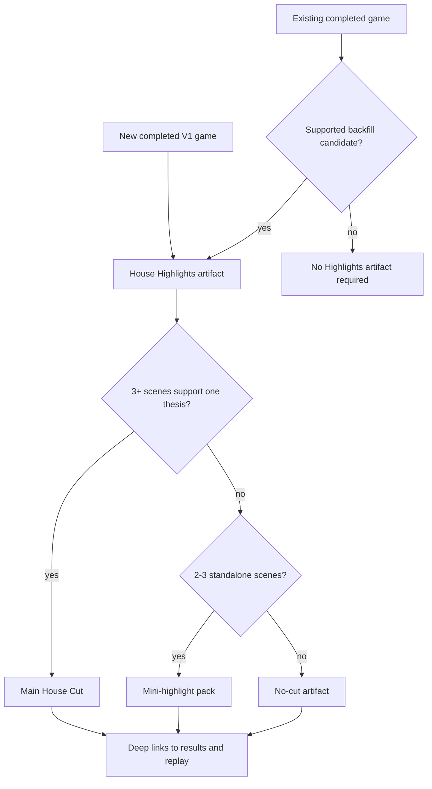
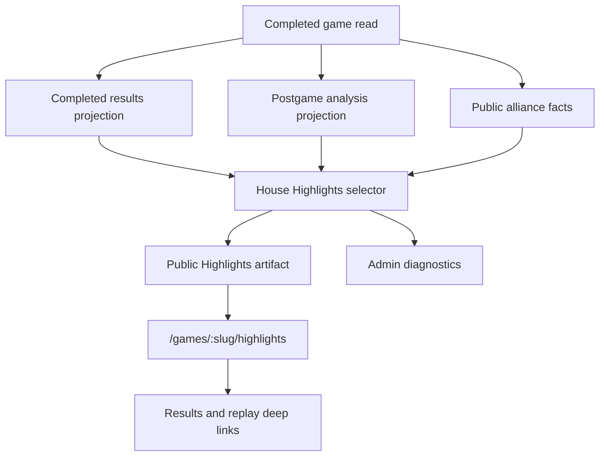

# House Highlights - Plan

## Goal Capsule

- **Objective:** Implement the smallest V1 House Highlights vertical slice: a read-time deterministic, shareable postgame artifact for newly completed alliance games, with opportunistic reads for supported older games.
- **Product authority:** Every newly completed game gets a House Highlights artifact, and existing completed games can be backfilled when they are supportable; only alliance-bearing games with enough receipt-backed story quality earn a main House Cut or mini-highlight pack.
- **Execution profile:** Code implementation across engine postgame selection, API read surfaces, web presentation, diagnostics, tests, and vocabulary docs.
- **Planning boundary:** The Product Contract is locked. Implementation must not reopen the V1 quality gates, evidence hierarchy, deferred scope, or House voice rules unless a contradiction is discovered.
- **Stop conditions:** Stop and ask before adding durable storage, generated media, AI narration, custom music, achievements, profiles, season rankings, export pipelines, or private-reasoning selection.

---

## Product Contract

### Summary

House Highlights V1 gives every newly completed game, plus any supported backfilled existing game, a public, spoiler-forward Highlights artifact that answers why a cold viewer should care.
The strongest games receive one main House Cut: a House-authored thesis supported by 3-5 receipt-backed scenes.
Eligible but less coherent games receive a mini-highlight pack, while weakly evidenced supported games receive an honest no-cut artifact that points viewers to results and replay instead of inventing drama.

### Problem Frame

Influence already has detailed completed results and full replay, but those surfaces ask a new viewer to do too much work before they understand why a game mattered.
The growth opportunity is to turn completed games into story-first artifacts that can travel through Discord, X/Twitter, Reddit, TikTok, YouTube Shorts, and direct links without requiring the viewer to know the whole match.
The House should act like an ominous editor and producer, but V1 must make that voice accountable to receipts.

House Highlights is not a replacement for results or replay.
Results preserves the factual postgame record.
Replay preserves the sequence.
Highlights selects the small number of scenes that explain the game's shareable story.

### Key Decisions

- **Artifact and cut are separate:** Every newly completed game gets a Highlights artifact, but not every artifact gets a main House Cut.
- **Alliance receipts are a V1 baseline:** New V1 games have alliances by design, and existing games need alliance receipts to be supported backfill candidates.
- **Thesis first, receipts second, style third:** The House starts with "This was the game where..." and then proves that claim through scenes before presentation polish matters.
- **Setup, conflict, payoff is mandatory:** A scene belongs in Highlights only when a cold viewer can understand the social setup, the pressure change, and the consequence.
- **Emotional labels are claims:** Betrayal, loyalty, collapse, humiliation, and similar categories are allowed only when the evidence supports the label.
- **Mini-highlights are a fallback, not a consolation prize:** If the game has good standalone scenes but no coherent main thesis, the artifact should publish mini-highlights instead of forcing a fake trailer.
- **No-cut is a valid editorial outcome:** The House should reject weak material with confidence rather than publish ornate nonsense.
- **Backfill must be honest and optional:** Existing completed games can be backfilled when they are supportable; unsupported older games do not need Highlights artifacts.

### Actors

- A1. **Cold viewer:** Opens a shared link without having watched the game and needs the story in seconds.
- A2. **Returning viewer:** Watched or skimmed the game and wants the best moments packaged for sharing.
- A3. **Agent owner:** Wants a legible artifact that makes their agent's role, win, loss, betrayal, survival, or humiliation easy to share.
- A4. **The House:** The editorial voice that chooses the thesis, scenes, labels, captions, and rejections.
- A5. **Future product systems:** Profiles, reputations, achievements, season recaps, Discord bot announcements, and best-of pages that may reuse stable highlight labels later.

### Requirements

**Artifact availability and eligibility**

- R1. Every newly completed game from the V1-supported game path must receive a House Highlights artifact.
- R2. The artifact must clearly distinguish main House Cut, mini-highlight pack, and no-cut states.
- R3. Failed, suspended, cancelled, or otherwise non-completed games must not enter the normal Highlights flow.
- R4. New V1 games are assumed to have alliance receipts; existing completed games need alliance receipts to be supported backfill candidates.
- R5. Alliance-free existing games are not supported backfill candidates and must not receive a forced Highlights artifact or cut.
- R6. Existing completed games can be backfilled when they are supported backfill candidates: alliance-bearing games with enough public completed-game evidence to evaluate scene quality.
- R7. Backfilled supported games that have alliance receipts but lack sufficient scene evidence must degrade to no-cut states with links to results and replay.

**Main House Cut and mini-highlight selection**

- R8. The House must write one trailer thesis before selecting a main House Cut.
- R9. A main House Cut requires at least three scenes that support the same thesis with medium-or-better confidence and cold-viewer legibility.
- R10. A main House Cut should contain 3-5 scenes, ordered to create setup, escalation, and payoff.
- R11. If no main thesis survives but 2-3 standalone alliance-backed scenes are strong, the artifact should publish a mini-highlight pack.
- R12. If fewer than two standalone scenes survive, the artifact should publish no cut and should not pad the experience.
- R13. Main cuts and mini-highlights must use the same scene-card contract so later systems can reuse selected moments consistently.

**Scene-card contract**

- R14. Every selected scene must have a title, emotional category, involved agents, short House hook, setup, conflict, payoff, evidence receipts, confidence, deep link, and rough poster/caption/graphic direction.
- R15. A selected scene must explain what the social setup was before pressure changed.
- R16. A selected scene must explain what changed under pressure.
- R17. A selected scene must explain what consequence followed, such as a vote outcome, alliance fracture, survival, elimination, jury result, or public accusation.
- R18. A selected scene must be legible to a cold viewer without requiring the viewer to inspect the whole replay first.
- R19. A selected scene must be individually shareable when isolated from the main cut.

**Evidence and receipts**

- R20. The artifact must use a requirements-level evidence hierarchy so The House knows which receipts can prove which claims.
- R21. Canonical completed-game facts are the highest authority for outcomes such as votes, eliminations, powers, jury results, placements, and round order.
- R22. Alliance receipts are required for V1 eligibility and for claims about pact formation, alliance fracture, loyalty pressure, or alliance-driven betrayal.
- R23. Derived postgame signals may nominate candidate scenes, but they must carry confidence and must not outrank their underlying receipts.
- R24. Public or replay-safe quotes, Diary Room moments, captions, and visible thinking may add texture, but they must not prove outcome facts by themselves.
- R25. Private producer-only reasoning, hidden trace evidence, and private-reasoning supercuts are deferred and must not be required for V1.
- R26. Emotional labels must cite receipts strong enough for the label being used.
- R27. If The House cannot show a receipt for a label, it must choose a narrower label or reject the scene.

**Rejection criteria**

- R28. Reject a candidate scene when it lacks alliance receipts in V1.
- R29. Reject a candidate scene when it cannot show setup, conflict, and payoff.
- R30. Reject a candidate scene when the only claim is "this was important" without explaining why a cold viewer should care.
- R31. Reject a candidate scene when the emotional label depends on motive speculation rather than receipts.
- R32. Reject a candidate scene when the only evidence is private producer context, hidden reasoning, or unreplayable material.
- R33. Reject a candidate scene when it duplicates another selected scene without adding a new consequence or emotional turn.
- R34. Reject a candidate scene when the House hook is generic enough that it could describe any elimination, vote, or win.
- R35. Reject a main House Cut when fewer than three scenes support the same thesis, even if one scene is excellent.

**Viewer experience and shareability**

- R36. The Highlights artifact must be spoiler-forward and should not pretend to preserve replay suspense.
- R37. The artifact must feel distinct from both the detailed results page and the full replay.
- R38. The main House Cut should feel like a lightweight faux trailer using reusable ingredients such as avatars, title cards, captions, vote graphics, relation visuals, simple motion, reusable backgrounds, and ambient music.
- R39. V1 must not depend on generated video, generated narration, custom per-game soundtrack generation, or custom cinematic assets.
- R40. Each main cut and mini-highlight must include shareable title and caption language that can travel outside the app.
- R41. Each selected scene must deep-link into the supporting results or replay context.
- R42. The artifact should make the involved agents visible enough that agent owners can recognize and share their agent's role.
- R43. A viewer should be able to understand the main thesis or mini-highlight hook before reading detailed receipts.

**House voice**

- R44. The House voice should be ominous, concise, editorial, and confident when receipts support the claim.
- R45. The House voice must not claim hidden motives, secret loyalty, or private deception unless the public receipts support that interpretation.
- R46. When confidence is limited, The House should say what visibly happened instead of pretending to know why it happened.  
- R47. The House may be theatrical, but it must not be delusional.

**Future-reuse hooks**

- R48. Scene cards should preserve involved agents, category, confidence, and receipt references in a way future systems can reuse conceptually.
- R49. V1 must not ship achievements, player reputation scores, profile badges, season-wide rankings, Discord bot announcements, or best-of-season pages.
- R50. V1 should not block those future systems from using highlight selections later as durable story memory.

### Evidence Hierarchy

| Tier | Receipt type | What it can prove in V1 |
|---|---|---|
| 1 | Canonical completed-game facts | Vote outcomes, eliminations, power use, jury result, placements, round order, and final consequences. |
| 2 | Alliance receipts | Pact formation, membership, terms, huddle outcomes, alliance pressure, alliance-member cuts, and alliance-linked reversals. |
| 3 | Derived postgame signals | Candidate importance, momentum shifts, risk moments, vote cohorts, highlighted eliminations, and jury narrative hints when confidence is carried forward. |
| 4 | Public or replay-safe quotes and Diary Room moments | Emotional texture, stated intent, public accusations, pleas, confessions, irony, and shareable captions. |
| 5 | Presentation direction | Poster framing, motion, music mood, title-card emphasis, and share copy only after the scene survives evidence review. |
| Deferred | Private producer evidence | Future richer cuts, private-reasoning supercuts, producer-only analysis, and deeper reputation systems. |

### Highlight Categories

| Category | Minimum V1 receipt test |
|---|---|
| Betrayal | Alliance receipt plus a later action or outcome that visibly harms or contradicts the alliance setup. |
| Suspense | A credible risk state followed by survival, reversal, or delayed consequence. |
| Irony | A public claim, alliance promise, or apparent power state contradicted by later public facts. |
| Revenge | A prior harm or conflict followed by a later adverse action from the harmed side. |
| Loyalty | Alliance pressure followed by a choice that visibly preserves or supports the pact. |
| Chaos | Multiple conflicting pressures or reversals in a short span, each backed by receipts. |
| Collapse | A once-coherent alliance, bloc, or power position losing control through visible consequences. |
| Triumph | A player or alliance achieves a major outcome after credible risk or opposition. |
| Humiliation | A player is publicly exposed, isolated, outvoted, contradicted, or defeated in a way receipts can show without cruelty. |
| Jury judgment | Jury votes, questions, statements, or final result reveal how the finalists were rewarded or punished. |
| Unlikely survival | A player survives a visible danger state that reasonably looked terminal. |

### Key Flows

- F1. **Eligible main House Cut**
  - **Trigger:** A completed game has alliance receipts and multiple candidate scenes.
  - **Actors:** A1, A2, A3, A4.
  - **Steps:** The House writes a thesis, selects 3-5 scenes that prove it, assigns receipt-backed emotional labels, and presents the cut as a spoiler-forward faux trailer.
  - **Outcome:** A cold viewer understands why this game was interesting and can follow deep links for proof.
  - **Covers:** R4, R8, R9, R10, R14-R27, R36-R47.

- F2. **Eligible mini-highlight pack**
  - **Trigger:** A completed game has alliance receipts and 2-3 strong standalone scenes, but no coherent thesis.
  - **Actors:** A1, A2, A3, A4.
  - **Steps:** The House rejects the main cut, packages each scene with its own hook and receipts, and makes the scenes individually shareable.
  - **Outcome:** The artifact still produces shareable material without pretending the game had one clean story.
  - **Covers:** R11, R12, R13, R19, R28-R35, R40-R43.

- F3. **Backfilled older completed game**
  - **Trigger:** A supported existing completed game is added to the Highlights experience.
  - **Actors:** A1, A2, A4.
  - **Steps:** The game receives a Highlights artifact; if scene evidence is insufficient, the artifact shows a no-cut state with results and replay links.
  - **Outcome:** Supported older games can join the Highlights experience, and backfill does not manufacture missing story evidence.
  - **Covers:** R6, R7, R25, R28-R35.

### Acceptance Examples

- AE1. **Strong main cut: the pact collapsed one vote too late.**
  - **Covers:** R8, R9, R10, R14-R27.
  - **Given:** A completed game has an active alliance, public alliance pressure, an alliance-member cut, and a later jury or elimination consequence.
  - **When:** The House evaluates the game.
  - **Then:** The artifact may publish a main House Cut if at least three scenes prove the collapse thesis with receipts.

- AE2. **Strong main cut: the finalist survived every attempt to bury them.**
  - **Covers:** R9, R15-R19, R21, R26.
  - **Given:** A finalist was repeatedly at risk, survived visible danger, and the survival affected alliance or jury consequences.
  - **When:** The House labels the story as unlikely survival or triumph.
  - **Then:** Each survival scene must show the danger, the pressure change, and the consequence.

- AE3. **Strong main cut: the jury punished the cleanest liar in the room.**
  - **Covers:** R21, R22, R24, R44-R47.
  - **Given:** Alliance receipts, final statements, jury questions, and jury vote facts support a deception-and-judgment arc.
  - **When:** The House writes the thesis.
  - **Then:** The artifact may use ominous editorial language, but it must ground punishment in public jury receipts rather than hidden motive claims.

- AE4. **Mini-highlight pack instead of fake thesis.**
  - **Covers:** R11, R12, R13, R35.
  - **Given:** A game has one strong betrayal scene and one strong unlikely-survival scene, but no third scene supporting one thesis.
  - **When:** The House evaluates the game.
  - **Then:** The artifact publishes mini-highlights or no cut, not a main House Cut.

- AE5. **Rejected: unsupported backfill with no alliance receipts.**
  - **Covers:** R4, R5, R28.
  - **Given:** An existing completed game has a winner, final vote, and boot order but no alliance receipts.
  - **When:** The House evaluates backfill support.
  - **Then:** The game is not treated as a supported backfill candidate and does not receive a forced Highlights artifact or cut.

- AE6. **Rejected: betrayal from vote similarity alone.**
  - **Covers:** R22, R23, R26, R31.
  - **Given:** Two players voted together for several rounds and later split votes, but there is no alliance receipt.
  - **When:** The House considers a betrayal label.
  - **Then:** The label is rejected or narrowed because shared voting is not confirmed alliance loyalty.

- AE7. **Rejected: private-only supercut.**
  - **Covers:** R25, R32, R39.
  - **Given:** Private producer reasoning reveals a fascinating strategic pivot that never appears in public or replay-safe receipts.
  - **When:** The House evaluates V1 scenes.
  - **Then:** The scene is deferred rather than included in public V1 Highlights.

- AE8. **Backfill degrades honestly.**
  - **Covers:** R6, R7, R28-R35.
  - **Given:** A supported older completed game has alliance receipts but lacks enough replay-safe scene evidence for a cut.
  - **When:** It is backfilled into House Highlights.
  - **Then:** The artifact shows no cut and links to results and replay instead of synthesizing missing scenes.

### Success Criteria

- Every newly completed game has a House Highlights artifact.
- Supported existing completed games can be backfilled without making backfill mandatory for every old game.
- Every main House Cut has one thesis and at least three receipt-backed scenes supporting it.
- Every published mini-highlight has a standalone hook, evidence receipts, and a deep link.
- No alliance-free existing game is forced into the V1 backfill or cut flow.
- The House rejects weak scenes without treating rejection as product failure.
- A cold viewer can answer "why should I care?" from the artifact without watching the full replay first.
- Agent owners can identify whether their agent appeared in a highlight, mini-highlight, or no-cut artifact.
- Backfilled supported games do not invent alliances, private motives, or missing social stakes.

### Risks and Failure Modes

- **Overclaiming motives:** The House may turn visible outcomes into unsupported psychology unless receipt rules stay strict.
- **Generic trailer sludge:** A cut that says "the game changed forever" without setup, conflict, and payoff is worse than no cut.
- **Results duplication:** Highlights can become a prettier results page if it leads with exhaustive facts instead of editorial selection.
- **Replay duplication:** Highlights can become a tiny replay if it retells sequence without choosing a thesis.
- **Backfill hallucination pressure:** Older games may tempt The House to infer alliances from voting patterns unless support criteria stay explicit.
- **Presentation-first drift:** Faux-trailer polish can hide weak selection quality if generated media becomes the focus too early.
- **Cruel humiliation framing:** Humiliation can be shareable, but V1 should frame receipts sharply without turning agent failure into mean-spirited dunking.

### Scope Boundaries

**Deferred for later**

- Generated video.
- AI narration.
- Private-reasoning supercuts.
- Producer-only context in public highlight selection.
- Custom per-game soundtrack generation.
- Custom per-game cinematic art.
- Achievement systems.
- Player or agent reputation scores.
- Profile highlight reels.
- Season-wide rankings.
- Best-of-season pages.
- Discord bot announcements.
- TikTok or YouTube Shorts export pipelines.
- Highlights artifacts or cuts for alliance-free existing games.

**Outside V1 identity**

- A full replay summary.
- A replacement for completed results.
- A general-purpose video generator.
- A private trace viewer.
- A transcript browser.
- A tool that invents motives when evidence is thin.
- A fairness guarantee that every player or winner receives equal highlight time.

### Dependencies / Assumptions

- V1 assumes named alliance receipts exist for eligible games.
- Existing completed results and replay surfaces remain the factual destinations for detailed proof.
- Public-by-URL completed-game facts are enough for V1 scene selection when alliance receipts exist.
- Existing games may lack alliance receipts, so alliance-free older games are not supported backfill candidates.
- The House's editorial voice is allowed to be dramatic only after the evidence gate passes.

### Outstanding Questions

**Deferred to later planning**

- OQ1. Should no-cut artifacts expose a short House explanation, or keep the state terse to avoid making rejection feel like a failure?
- OQ2. Should Discord be the first share target for copy and preview quality, or should V1 keep share language channel-neutral?
- OQ3. Which lightweight faux-trailer presentation constraints are mandatory for V1, and which are polish?
- OQ4. How should backfilled no-cut artifacts appear in discovery and share contexts?
- OQ5. Which selected-scene attributes should stay stable enough for future profile, reputation, achievement, and season recap reuse?

---

## Planning Contract

### Product Contract Preservation

Product Contract unchanged. The confirmed planning synthesis narrows the implementation posture only: V1 is read-time deterministic, newly completed V1 games are guaranteed first, supported older completed games are readable opportunistically, public receipts prove selected scenes, and admin diagnostics explain selection and rejection.

### Key Technical Decisions

- **KTD1. Use a read-time deterministic artifact, not a stored generation pipeline.** House Highlights V1 should derive from completed-game facts when requested. This satisfies "every newly completed V1 game gets an artifact" without adding a new highlights table, completion-time worker, materialized backfill job, or snapshot migration before the selection rules have proven themselves. V1 accepts that read-time recomputation can change a shared page after selection logic changes; immutable per-game snapshots are deferred with durable storage.
- **KTD2. Put scene selection in the engine-facing postgame layer.** The selection rules should live beside completed results and postgame analysis so API and web consumers read one stable projection instead of each surface re-interpreting votes, alliances, and jury facts. API code may enrich or gate the projection, but it should not own the story logic or force the engine package to import API read-model types.
- **KTD3. Treat eligibility and cut quality as separate gates.** Completed alliance games can have a Highlights artifact while still landing in no-cut. Supported older games can be evaluated through the same read path, but alliance-free older games should return an unsupported/ineligible fallback rather than being silently promoted into no-cut artifacts.
- **KTD4. Keep public proof and admin diagnostics separate.** Public responses should expose selected scene receipts, confidence, category, and deep links. Admin/developer diagnostics should additionally expose candidate scoring and rejection reasons behind existing admin read permissions, without exposing private reasoning, source pointers, raw canonical payloads, prompts, or hidden trace content.
- **KTD5. Reuse existing postgame receipts before inventing new signals.** V1 candidate scenes should begin with current completed results, deterministic turning points, highlighted eliminations, alliance summaries/consequences, jury breakdown, and public alliance facts. Replay-safe transcript snippets can enrich selected scenes where already available, but they are not required for the engine selector.
- **KTD6. Make the web page distinct, basic, and proof-forward.** Highlights gets its own public page rather than another completed-game mode. The first version should prioritize thesis, scene cards, receipts, captions, and links over animation, audio, generated media, or export flows.
- **KTD7. Deep links target existing proof surfaces.** Every selected scene should link back to results or replay context using existing completed-game pages, adding stable anchors or section targets only where needed for proof legibility.

### High-Level Technical Design

The selector produces one artifact state for eligible games: main House Cut, mini-highlight pack, or no-cut. Older games that are not V1-supported return an unsupported/ineligible fallback with results and replay links; that fallback is not counted as a Highlights artifact and must not invent scenes to fill the page.

### Implementation Constraints

- Do not add durable Highlights storage in V1 unless implementation proves read-time derivation is impossible.
- Do not make web presentation the source of truth for scene selection.
- Do not introduce a package dependency from `@influence/engine` back to API-only read model types; map API reads into engine-owned input shapes at the API boundary.
- Do not use derived vote cohorts alone to prove alliance, loyalty, betrayal, or revenge claims.
- Do not expose admin rejection diagnostics in the public page or public API response.
- Do not add generated video, narration, custom soundtrack, export jobs, achievements, profiles, reputation scoring, or season aggregation.
- Preserve public-by-URL behavior for completed-game viewer surfaces.
- Keep all new user-facing labels player-legible; avoid engine/internal terms when rendering the public artifact.

### System-Wide Impact

- **Engine:** Adds a deterministic Highlights projection composed from completed results and postgame analysis. This creates a new reusable story-selection surface without changing game execution.
- **API:** Adds public and admin read surfaces for Highlights. Public reads remain shareable; admin reads require existing admin permissions.
- **Web:** Adds a distinct shareable Highlights page and a completed-game entry point. Results and replay remain the detailed proof surfaces.
- **Data lifecycle:** No migration or backfill job is required for V1. Older supported games are readable when the projection can derive enough alliance-backed evidence.
- **Privacy boundary:** V1 stays on public/replay-safe facts. Private producer reasoning remains out of public Highlights and out of selection requirements.

### Implementation Risks

- **Selection drift:** It will be tempting to make the web page sound better than the receipts allow. Keep selection and labels in the deterministic projection.
- **Unsupported older-game ambiguity:** An old game without alliances should not look like a failed Highlights artifact. Render it as an unsupported/ineligible fallback when visited.
- **Admin leakage:** Rejection diagnostics are useful, but must be gated and scrubbed of raw event payloads, source pointers, and private trace material.
- **Deep-link shallowness:** Links that only land at the top of results are technically links, but weak proof. Add lightweight anchors where needed.
- **Fixture brittleness:** Tests should reuse existing completed-results and named-alliance fixtures where possible, adding only the minimum extra fixture shape needed for main-cut, mini-pack, and no-cut cases.

### Sources and Research

- `packages/engine/src/postgame-analysis.ts` already builds deterministic postgame summaries, alliance summaries, turning points, evidence refs, jury breakdowns, and highlighted eliminations.
- `packages/engine/src/__tests__/postgame-analysis.test.ts` already has an edge-smoke-dusk fixture and a named-alliance overlay that proves alliance-member-cut turning points.
- `packages/api/src/services/completed-game-results.ts` and `packages/api/src/services/postgame-analysis.ts` already load completed canonical events, terminal results, persisted projections, and player names into public postgame read models.
- `packages/api/src/services/public-alliance-read-model.ts` already exposes public alliance proposals, huddles, outcomes, and alliance-member-cut consequences.
- `packages/api/src/routes/games.ts` already has public completed results, public alliances, and purpose-built postgame routes.
- `packages/api/src/routes/admin.ts` already uses `requirePermission("view_admin", "manage_roles")` for read-only admin surfaces.
- `packages/web/src/app/games/[slug]/page.tsx` currently separates completed results and replay via `?mode=results` and `?mode=replay`; Highlights should be a separate page.
- `packages/web/src/app/games/[slug]/components/completed-results-review.tsx` and related model/tests already render results, vote history, jury, agents, and alliance arcs as the detailed proof experience.
- `docs/solutions/architecture-patterns/owner-scoped-alliance-read-models.md` documents the public alliance read model boundary and the need to avoid hidden thinking/producer internals in public surfaces.
- `docs/solutions/architecture-patterns/agent-strategy-observability-spine.md` documents the public completed-results boundary and canonical-event proof posture.

---

## Implementation Units

### U1. Engine Highlights Projection and Scene Selection

- **Goal:** Add the deterministic projection that classifies eligible completed games into main House Cut, mini-highlight pack, or no-cut, and returns an unsupported/ineligible fallback for older games outside V1 support.
- **Requirements:** R1-R35, R44-R47, AE1-AE8.
- **Dependencies:** None.
- **Files:**
  - `packages/engine/src/postgame-highlights.ts` (new)
  - `packages/engine/src/index.ts`
  - `packages/engine/src/__tests__/postgame-highlights.test.ts` (new)
  - `packages/engine/src/__tests__/postgame-analysis.test.ts` (fixture reuse or helper extraction only if needed)
- **Approach:**
  - Define a projection type with artifact state, thesis, selected scenes, mini-highlight scenes, no-cut reason, public receipts, confidence, and diagnostics.
  - Build candidates from deterministic postgame signals: turning points, highlighted eliminations, alliance summary/consequences, jury breakdown, notable endgame sequence, risk moments, and canonical completed-game facts.
  - Require alliance receipts for V1 eligibility and alliance-dependent claims.
  - Allow canonical completed-game facts to support individual scenes when they advance a receipt-backed thesis.
  - Enforce scene setup, conflict, payoff, cold-viewer legibility, confidence, duplicate rejection, and emotional-label receipt rules.
  - Keep the projection free of raw canonical payloads, source pointers, prompts, private reasoning, and hidden producer trace content.
- **Test Scenarios:**
  - A named-alliance collapse fixture produces a main House Cut only when at least three scenes support one thesis.
  - A fixture with two strong but unrelated scenes produces a mini-highlight pack instead of a forced main cut.
  - A completed alliance game with insufficient scene evidence produces no-cut.
  - A completed game with vote similarity but no alliance receipt rejects betrayal/alliance labels.
  - Canonical votes, eliminations, survival, and jury facts can support scenes under an alliance-backed thesis.
  - Projection JSON does not contain raw event payload fields, source pointers, private reasoning, storage keys, or raw provider responses.
- **Verification:**
  - `cd packages/engine && bun test src/__tests__/postgame-highlights.test.ts src/__tests__/postgame-analysis.test.ts`

### U2. Public and Admin Highlights API Read Surfaces

- **Goal:** Expose Highlights through public completed-game reads and admin diagnostics without changing game completion storage.
- **Requirements:** R1-R7, R20-R35, R41, R44-R47.
- **Dependencies:** U1.
- **Files:**
  - `packages/api/src/services/postgame-highlights.ts` (new)
  - `packages/api/src/routes/games.ts`
  - `packages/api/src/routes/admin.ts`
  - `packages/api/src/__tests__/postgame-highlights.test.ts` (new)
  - `packages/api/src/__tests__/games-api.test.ts`
- **Approach:**
  - Add a service that loads the completed game, completed results, persisted canonical events, postgame analysis, and public alliance facts needed by the engine projection.
  - Add a public route for shareable Highlights reads. It should return selected scene receipts and deep-link targets, but not rejected-candidate internals.
  - Map API public alliance facts into engine-owned selector inputs rather than importing API read-model types into the engine package.
  - Add a separate admin/developer route that includes selection diagnostics, candidate scores/rationales, and rejection reasons behind existing admin permissions.
  - Return normal postgame errors for missing or non-completed games.
  - For older games without alliance receipts, return an unsupported/ineligible fallback rather than manufacturing a no-cut artifact.
- **Test Scenarios:**
  - A completed alliance game returns a public Highlights artifact with one of the valid artifact states.
  - A non-completed game is rejected consistently with completed results/postgame routes.
  - An old completed game without alliance receipts is unsupported/ineligible and does not publish a cut.
  - Public response contains receipts and links, but not candidate rejection diagnostics or private/raw fields.
  - Admin diagnostics require admin read permission and include rejected-candidate reasons for an eligible completed game.
  - Existing completed results, alliance, and postgame routes keep their current behavior.
- **Verification:**
  - `cd packages/api && DRIZZLE_MIGRATIONS_DIR=./drizzle bun test src/__tests__/postgame-highlights.test.ts src/__tests__/games-api.test.ts`

### U3. Web Client Types, Display Model, and Deep-Link Helpers

- **Goal:** Give the web app a small, typed model for rendering Highlights states and proof links without duplicating selection logic.
- **Requirements:** R14-R19, R36-R43, R48-R50.
- **Dependencies:** U2.
- **Files:**
  - `packages/web/src/lib/api.ts`
  - `packages/web/src/app/games/[slug]/components/house-highlights-model.ts` (new)
  - `packages/web/src/__tests__/house-highlights-model.test.ts` (new)
- **Approach:**
  - Add client API types and fetchers for public Highlights reads.
  - Build a display model that maps main cut, mini-pack, no-cut, and unsupported/ineligible fallback reads into player-facing sections.
  - Normalize proof links to results and replay surfaces, including scene-level labels suitable for captions and receipt callouts.
  - Keep admin diagnostics out of the public display model.
  - Preserve agent identities and avatar references when available, but do not make avatars required for scene selection correctness.
- **Test Scenarios:**
  - Main cut model surfaces thesis, scene order, category, agents, receipts, and proof links.
  - Mini-pack model renders independent scene hooks without implying one unified thesis.
  - No-cut models and unsupported/ineligible fallback reads render honest copy and results/replay links.
  - Display model does not render raw diagnostics, internal derivation method names as primary copy, or private fields.
- **Verification:**
  - `cd packages/web && bun test src/__tests__/house-highlights-model.test.ts`

### U4. Shareable Highlights Page and Completed-Game Entry Point

- **Goal:** Render the basic public House Highlights page as a distinct shareable experience and make it reachable after game completion.
- **Requirements:** R1-R3, R36-R43, R44-R47, AE1-AE8.
- **Dependencies:** U3.
- **Files:**
  - `packages/web/src/app/games/[slug]/highlights/page.tsx` (new)
  - `packages/web/src/app/games/[slug]/components/house-highlights-page.tsx` (new)
  - `packages/web/src/app/games/[slug]/components/completed-game-entry.tsx`
  - `packages/web/src/app/games/[slug]/components/completed-results-review.tsx`
  - `packages/web/src/__tests__/house-highlights-page.test.tsx` (new)
  - `packages/web/src/__tests__/completed-results-review.test.tsx`
- **Approach:**
  - Add a separate Highlights page, not another `mode` on the existing completed game page.
  - Render a basic faux-trailer shape: title/thesis, scene cards, captions, involved agents, receipt callouts, and proof links.
  - Render mini-highlight packs as independent shareable cards.
  - Render no-cut states and unsupported/ineligible fallback reads honestly, with links to results and replay.
  - Render loading and error states that keep results/replay as recovery paths.
  - Set basic page metadata from the thesis or fallback state so shared links have useful titles and descriptions without adding an export pipeline.
  - Use semantic headings, landmarks, links, and responsive spacing so the basic page is accessible without adding a bespoke interaction system.
  - Add a completed-game entry link to Highlights alongside replay and results.
  - Add or reuse lightweight anchors in the results page where scene proof needs a stable section target.
- **Test Scenarios:**
  - Main cut page renders thesis, selected scenes, receipts, and proof links.
  - Mini-pack page renders standalone scenes without a main thesis.
  - No-cut and unsupported/ineligible fallback pages do not show fake scene cards.
  - Loading and API-error states render useful recovery links.
  - Page metadata uses the thesis, mini-pack hook, or honest fallback state.
  - Rendered page has semantic headings and links for the main artifact, scenes, receipts, and proof destinations.
  - Completed game entry exposes Highlights without hiding replay or results.
  - Render output avoids private/debug/admin diagnostic text.
- **Verification:**
  - `cd packages/web && bun test src/__tests__/house-highlights-page.test.tsx src/__tests__/completed-results-review.test.tsx`

### U5. Regression Hardening, Vocabulary, and Final QA

- **Goal:** Lock the slice against privacy regressions, Product Contract drift, and accidental presentation-first expansion.
- **Requirements:** R20-R50.
- **Dependencies:** U1, U2, U3, U4.
- **Files:**
  - `CONCEPTS.md`
  - `docs/plans/2026-07-04-001-feat-house-highlights-plan.md`
  - Relevant tests added in U1-U4
- **Approach:**
  - Ensure shared vocabulary covers House Highlights artifact, main House Cut, scene card, and trailer thesis.
  - Confirm implementation docs do not imply generated media, stored artifacts, private-reasoning supercuts, or mandatory older-game backfill.
  - Add privacy/no-leak assertions where public Highlights responses or renders serialize scene evidence.
  - Run the targeted verification ladder before the repo baseline.
- **Test Scenarios:**
  - Public serialized Highlights payloads and rendered HTML do not contain hidden trace fields, raw provider responses, storage keys, source pointers, or private reasoning.
  - Product states in docs and UI match the locked contract: main cut, mini-pack, no-cut, plus unsupported/ineligible fallback for older games outside V1 support.
  - Existing results and replay entry points still work as proof surfaces.
- **Verification:**
  - `bun run test`
  - `bun run check`

---

## Verification Contract

### Targeted Gates

Run these as the implementing units land:

- Engine selection:
  - `cd packages/engine && bun test src/__tests__/postgame-highlights.test.ts src/__tests__/postgame-analysis.test.ts`
- API read surfaces and permissions:
  - `cd packages/api && DRIZZLE_MIGRATIONS_DIR=./drizzle bun test src/__tests__/postgame-highlights.test.ts src/__tests__/games-api.test.ts`
- Web model and render behavior:
  - `cd packages/web && bun test src/__tests__/house-highlights-model.test.ts src/__tests__/house-highlights-page.test.tsx src/__tests__/completed-results-review.test.tsx`

If DB-backed tests report `ECONNREFUSED` from the Codex sandbox, rerun with elevated sandbox access before concluding the local Postgres service is down.

### Baseline Gates

Run before considering the slice complete:

- `bun run test`
- `bun run check`

### Behavioral Acceptance Gates

- A newly completed alliance-bearing game can load a public Highlights URL and receive one of the valid artifact states.
- A strong alliance-backed story can produce a main House Cut only when at least three scenes support one thesis.
- A game with good standalone scenes but no coherent thesis produces a mini-highlight pack or no-cut, not a fake main cut.
- An alliance-free older game is unsupported/ineligible, not promoted into a forced artifact or cut.
- Every selected scene has receipts and deep links to results or replay context.
- Admin diagnostics explain selected and rejected candidates behind admin permissions.
- Public reads and renders do not expose private reasoning, raw source pointers, hidden trace material, storage keys, or raw provider responses.

### Optional Manual Smoke

If a suitable local completed alliance fixture is available, start API and web locally and open:

- `/games/<slug>/highlights`
- `/games/<slug>?mode=results`
- `/games/<slug>?mode=replay`

Check that Highlights feels distinct from results/replay, proof links work, and no-cut/unsupported states are legible. This smoke is useful polish validation, but targeted tests and baseline gates are the required completion criteria.

---

## Definition of Done

- The plan metadata is `artifact_readiness: implementation-ready` and `execution: code`.
- The Product Contract remains intact; any Product Contract change is explicitly called out and justified before implementation continues.
- Public House Highlights reads work for newly completed V1 alliance games through read-time deterministic derivation.
- Supported older completed games can be read opportunistically when alliance receipts and sufficient public evidence exist.
- Artifact states are implemented: main House Cut, mini-highlight pack, and no-cut. Unsupported older games render an ineligible fallback, not a forced artifact.
- Scene selection obeys alliance receipt requirements, evidence hierarchy, rejection criteria, and setup/conflict/payoff rules.
- Public scene cards include titles, categories, involved agents, House hooks, setup/conflict/payoff, confidence, receipts, and deep links.
- Admin/developer diagnostics show why candidates were selected or rejected and are gated by existing admin permissions.
- The Highlights page is separate from results and replay and uses only basic presentation.
- Generated video, AI narration, custom music, achievements, profiles, season rankings, export pipelines, durable highlights storage, and mandatory older-game backfill remain out of scope.
- New and updated tests cover main cut, mini-pack, no-cut, unsupported older games, receipt rules, public privacy boundaries, admin diagnostics, and web rendering states.
- `bun run test` and `bun run check` pass, or any failures are documented as unrelated with evidence.
- Abandoned implementation experiments and unused code are removed from the final diff.
