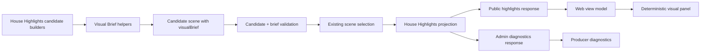

# House Highlights Visual Briefs - Plan

## Goal Capsule

- **Objective:** Replace public-facing House Highlights `posterDirection` prose with structured, truth-safe Visual Briefs that selected scenes can render now and future generated-mood assets can consume later.
- **Product authority:** A House Highlight may feel cinematic, but its factual layer must stay boringly correct: generated imagery can provide mood or backdrop only, while deterministic composition owns names, agents, vote facts, relationships, receipts, captions, and share text.
- **Implementation posture:** Extend the existing read-time House Highlights projection. Do not add durable storage, migrations, export workers, image generation, or new scene-selection logic.
- **Open blockers:** None. Planning decisions below resolve the brainstorm's open questions without reopening the core House Highlights Product Contract.

## Product Contract

### Summary

House Highlights Visual Briefs replace vague public `posterDirection` prose with a structured scene-owned visual contract. The implementation extends the current read-time House Highlights projection, adds safe public render data plus admin diagnostics, and keeps V1 page-native while preserving a path to future generated mood plates.

### Problem Frame

House Highlights V1 already chooses receipt-backed scenes and presents them as a spoiler-forward editorial artifact. The current `posterDirection` field is useful as rough internal art direction, but it leaks into the public scene card as prose that reads like a production note instead of viewer-facing copy.

That leak becomes riskier once the product wants faux-trailer visuals or generated mood assets. Loose art-direction prose can accidentally authorize invented rooms, emotions, relationships, actions, vote boards, or text. Visual Briefs solve the next layer of the problem: they make every selected scene renderable without making the visual layer a second storyteller.

The House may frame a moment theatrically, but the visual system must never imply unsupported events, relationships, emotions, settings, or outcomes. That boundary is the difference between cinematic packaging and ornate nonsense.

### Requirements

#### Required Slot Discipline

- R1. A selected scene must carry a Visual Brief with a visual type before it carries mood, backdrop, or style direction.
- R2. A Visual Brief must declare the factual slots required by its visual type and whether each slot is filled by public receipts or canonical completed-game facts.
- R3. A scene must not render a template when a required factual slot is missing unless the visual narrows to a safer fallback type.
- R4. The primary agent, eliminated agent, surviving agent, protected agent, voters, alliance members, finalists, jurors, round, vote outcome, and receipt types must come from public scene receipts or canonical completed-game facts.
- R5. A missing slot must degrade the visual to a narrower factual claim instead of being invented by copy, layout, generated imagery, or visual metaphor.

#### Deterministic Truth Layer

- R6. Agent avatars when available, names, initials, vote records, alliance lines, receipt badges, round labels, captions, and proof links must be deterministic overlays.
- R7. Vote totals, finalist status, elimination status, protection status, and jury outcomes must never be embedded inside generated imagery.
- R8. Share titles and captions must be deterministic House copy backed by the same scene card and receipts.
- R9. Public visuals must keep receipts reachable, either directly on the visual, adjacent to it, or through the scene's proof link.
- R10. If a visual uses a metaphor, the metaphor must not add a new factual claim.

#### Generated Asset Boundary

- R11. Generated imagery may be used only for reusable or non-factual background plates, mood assets, lighting, texture, or abstract atmosphere.
- R12. Safe generated-background categories include empty council chamber, jury wall, abstract vote board, fractured alliance table, spotlight stage, and surveillance-board texture.
- R13. Generated imagery must never invent agent actions, emotional states, physical scenes, vote facts, text, alliances, relationships, motives, or outcomes.
- R14. Generated imagery must not include readable names, vote counts, receipts, captions, UI labels, player identities, or text-like marks that viewers may read as facts.
- R15. If generated imagery would be ambiguous enough to imply unsupported scene action, the brief must choose a safer deterministic or abstract composition.

#### Public And Diagnostic Surfaces

- R16. Public UI must show the rendered scene visual, viewer-facing House hook, setup/conflict/payoff, receipts, and proof link; it must not show raw art-direction notes.
- R17. Public API and web types must not expose `posterDirection` as part of the selected scene card contract.
- R18. Producer/admin diagnostics may show visual type, slot fill status, unsupported-slot reasons, forbidden-invention notes, rejected background categories, and any transitional internal direction.
- R19. Producer/admin diagnostics must not turn private reasoning into public visual evidence.

#### Sharing Posture

- R20. Visual Briefs should support page-native, square, vertical, and wide compositions for Discord, X/Twitter, TikTok, and YouTube Shorts without making export pipelines part of V1.
- R21. Every share composition must preserve the deterministic truth layer even when the crop, layout density, or background plate changes.
- R22. Discord and X/Twitter previews should prioritize title, primary agents, visual type, and proof-link legibility.
- R23. TikTok and YouTube Shorts compositions should prioritize vertical safe areas, large deterministic overlays, and fast comprehension without relying on audio or generated video.
- R24. A Visual Brief should be shareable as a still frame before it is expected to work as motion.

### Actors

- A1. **Cold viewer:** Needs to understand the scene visually before reading detailed receipts.
- A2. **Returning viewer:** Wants a cinematic reminder that still matches the game they watched.
- A3. **Agent owner:** Needs their agent's role, name, avatar when available, and outcome represented accurately enough to share.
- A4. **The House:** Assigns editorial framing, template type, visual emphasis, and rejection boundaries.
- A5. **Renderer:** Turns the brief into a public card, faux-trailer frame, social preview, or short-form composition without inventing facts.
- A6. **Producer/admin:** Inspects why a visual direction was chosen or rejected, including unsupported claims and receipt gaps.

### Visual Brief Contract

A Visual Brief is product-level scene render guidance, not generated copy and not a second source of truth. Exact TypeScript names are implementation details, but the following meanings must survive:

- **Visual type:** The scene's template family, such as alliance formation, betrayal vote, vote flip, shield survival, council slate, or jury judgment.
- **Factual slots:** The required agents, groups, round, vote outcome, and receipt types the renderer must display or know are absent.
- **Visual emphasis:** Which factual slot is visually primary, secondary, or supporting.
- **Truth overlays:** Deterministic labels, avatars when available, names or initials, vote marks, alliance lines, badges, captions, round markers, and proof links.
- **Allowed backdrop:** A safe background category or `none` when atmosphere would risk overclaiming.
- **Forbidden invention:** A short list of claims the visual must avoid for this scene.
- **Share framing:** Page-native, square, vertical, and wide layout intent, without promising export pipelines in V1.
- **Diagnostics posture:** Which parts are public renderer data versus producer-only rationale.

### Visual Taxonomy

| Visual type | Required factual slots | Deterministic emphasis |
|---|---|---|
| Alliance formation | Alliance members, alliance name when public, round, receipt type | Member identities connected by a labeled alliance line and receipt badge. |
| Alliance rupture | Alliance members, harmed member, round, receipt type, consequence | Relation line fractured only where receipts prove the rupture. |
| Betrayal vote | Primary agent, eliminated agent, voters when public, round, vote outcome, alliance receipt | Vote card and alliance line, with the eliminated agent isolated by deterministic overlay. |
| Vote flip | Initial exposed or threatened agent, eliminated agent, voters when public, round, final outcome | Before-target and after-target slate with the actual eliminated agent marked. |
| Unlikely survival | Surviving agent, danger source, round, vote outcome or risk receipt | Survival marker around the agent and a receipt-backed danger indicator. |
| Shield survival | Protected agent, eliminated agent when present, power holder when public, round, shield receipt | Shield overlay on the protected identity and actual elimination outcome separately shown. |
| Power streak | Primary agent, rounds, power records, receipt types | Repeated deterministic tally marks beside the same agent identity. |
| Council slate | Slated agents, eliminated agent, surviving agent when relevant, round, vote outcome | Slate board with actual removal and survival state, not implied motive. |
| Revenge vote | Harmed agent or juror, target, prior harm receipt, later vote receipt | Two linked receipts: earlier harm and later vote consequence. |
| Jury judgment | Finalists, jurors or vote counts when public, final result | Finalist identities, juror tally, winner marker, and final vote receipt badge. |
| Endgame collapse | Primary agent or bloc, finalists or remaining agents, round, outcome | Room-narrowing composition with actual surviving or eliminated agents only. |

### Renderer Boundaries

| Element | Deterministic only | May be generated | Notes |
|---|---:|---:|---|
| Agent avatar, name, and identity | Yes | No | Use owned avatar assets when available; otherwise use deterministic names or initials. |
| Vote totals, jury totals, round labels | Yes | No | Generated text is unreliable and not authoritative. |
| Alliance membership and relationship lines | Yes | No | Lines must reflect receipts, not vibe. |
| Receipt badges and proof links | Yes | No | The proof layer is the trust layer. |
| Scene caption and House hook | Yes | No | House copy is text, not image texture. |
| Empty chamber, stage, wall, board, or texture | No | Yes | Safe only when no factual content appears in the image. |
| Agent-specific pose, expression, or action | Yes, if based on owned static avatar state | No | Do not generate agent behavior or emotion. |
| Mood lighting and abstract atmosphere | No | Yes | Must not imply unsupported setting or event. |

### Key Flows

- F1. **Public scene visual**
  - **Trigger:** A selected scene card appears in a main House Cut or mini-highlight pack.
  - **Actors:** A1, A2, A3, A4, A5.
  - **Steps:** The House assigns a visual type, fills factual slots from receipts, chooses deterministic overlays, and allows only safe backdrop categories.
  - **Outcome:** The viewer sees a cinematic scene visual whose factual claims can be checked against receipts.
  - **Covers:** R1-R17, R20-R24.

- F2. **Generated background use**
  - **Trigger:** A scene would benefit from a mood plate or reusable background.
  - **Actors:** A4, A5, A6.
  - **Steps:** The brief chooses a safe category, forbids factual content inside the image, and leaves all names, votes, avatars, receipts, and captions to deterministic overlays.
  - **Outcome:** Generated imagery can improve atmosphere later without becoming evidence.
  - **Covers:** R6-R15.

- F3. **Brief rejection or narrowing**
  - **Trigger:** A proposed visual type requires a factual slot the scene cannot prove.
  - **Actors:** A4, A5, A6.
  - **Steps:** The House records the unsupported slot, rejects the unsafe visual type, and falls back to a narrower template or no special visual treatment.
  - **Outcome:** The visual avoids forbidden invention instead of papering over weak evidence.
  - **Covers:** R2-R5, R18-R19.

### Acceptance Examples

- AE1. **Good: betrayal vote with receipts**
  - **Covers:** R1-R10, R16-R18.
  - **Given:** A scene proves that an alliance member helped eliminate another alliance member in round 5.
  - **When:** The Visual Brief uses the betrayal vote type.
  - **Then:** The public visual may show both identities, the alliance line, the round label, vote receipt badge, and eliminated-agent marker.

- AE2. **Good: shield survival**
  - **Covers:** R4, R6-R10, R20-R24.
  - **Given:** A round record proves one agent received a shield and another agent was eliminated.
  - **When:** The Visual Brief uses the shield survival type.
  - **Then:** The protected agent receives a deterministic shield overlay, while the eliminated agent and outcome are shown as separate factual overlays.

- AE3. **Good: jury judgment**
  - **Covers:** R4, R6-R10.
  - **Given:** Finalists, jurors, and final vote counts are public completed-game facts.
  - **When:** The Visual Brief uses the jury judgment type.
  - **Then:** The visual may show finalist identities and juror tally marks, with the winning result as deterministic text.

- AE4. **Rejected: generated betrayal tableau**
  - **Covers:** R11-R15.
  - **Given:** A prompt asks for an image of one agent whispering behind another agent's back.
  - **When:** No public receipt proves that physical action or emotional state.
  - **Then:** The image direction is rejected as forbidden invention.

- AE5. **Rejected: text inside generated image**
  - **Covers:** R7, R8, R14.
  - **Given:** A generated background includes names, vote counts, or a fake ballot board.
  - **When:** The renderer prepares the public visual.
  - **Then:** The generated asset is rejected because factual text must be deterministic.

- AE6. **Rejected: unsupported alliance implication**
  - **Covers:** R3-R5, R13, R15.
  - **Given:** Two agents repeatedly voted together but have no alliance receipt.
  - **When:** A proposed visual connects them with an alliance line.
  - **Then:** The line is rejected or narrowed to a vote-pattern visual that explicitly avoids alliance membership.

### Success Criteria

- Public House Highlights no longer show rough `posterDirection` prose as viewer-facing text.
- Every selected scene maps to a visual type or a safe fallback without inventing facts.
- The factual layer of a scene visual remains deterministic across public page, share preview posture, and future short-form compositions.
- Generated imagery, when later introduced, cannot carry names, vote records, agent identity, text, relationships, receipts, or outcomes.
- Producer/admin diagnostics can explain why a visual type was chosen, narrowed, or rejected.
- A future image-generation pass can consume the same Visual Brief posture without image generation being required for V1.

### Scope Boundaries

#### In Scope

- Add a structured Visual Brief to each selected House Highlights scene.
- Replace public `posterDirection` copy with structured Visual Brief data that the current UI can display deterministically.
- Keep scene selection, eligibility, House voice, evidence hierarchy, main-cut/mini-pack/no-cut decisions unchanged.
- Expose public-safe visual data through the existing public highlights surface.
- Expose visual validation and forbidden-invention diagnostics through existing admin diagnostics.
- Render a page-native deterministic visual panel in the current web House Highlights view.
- Preserve future support for square, vertical, and wide compositions as contract data, not export jobs.

#### Deferred To Follow-Up Work

- Per-game generated image production.
- Generated video.
- AI narration.
- Custom per-game soundtrack generation.
- Automated TikTok or YouTube Shorts export jobs.
- Platform-specific upload flows.
- Motion choreography beyond lightweight faux-trailer composition.
- Immutable visual snapshots.
- Full visual brand system for every highlight category.
- Producer tools for editing visual briefs by hand.
- A new avatar pipeline or avatar storage migration.
- Server-side web loading refactors called out in the refactor queue.

#### Outside This Product's Identity

- Generated images that depict agents performing scene-specific actions.
- Generated images that contain readable factual text.
- A visual layer that decides what happened.
- A share card that hides receipts because the composition looks cooler without them.
- A fairness system that guarantees every agent gets a visual moment.
- A general-purpose image generator exposed through House Highlights.

## Planning Contract

### Key Technical Decisions

- KTD1. **Replace selected-scene `posterDirection` with `visualBrief`.** The selected/public scene card should have one canonical visual contract. Any transitional rough direction belongs only in producer/admin diagnostics, if it survives at all.
- KTD2. **Build Visual Briefs inside the engine projection.** Candidate builders already know the scene family and receipts; putting brief construction beside candidate construction keeps API and web layers from inventing visual semantics.
- KTD3. **Use helper builders for template families.** Central helpers should define visual types, required slots, safe backdrop categories, deterministic overlay categories, and forbidden-invention defaults so candidate files do not drift into hand-authored mini schemas.
- KTD4. **Validate briefs before scene selection returns.** Candidate validation should reject or narrow unsafe visual briefs before they can become selected public scenes.
- KTD5. **Keep public and admin DTOs split.** Public responses need renderer-safe visual data; admin diagnostics can include slot fill status, validation warnings, unsupported-slot reasons, and rejected background categories.
- KTD6. **Ship a deterministic V1 renderer only.** The public web view should render visual panels from data already in the scene card. It should not call image generation, fetch external assets, or create share exports.
- KTD7. **Use deterministic identity fallbacks.** If selected scene player refs do not already carry avatar URLs, V1 renders names or initials. Adding avatar hydration is a separate product slice.
- KTD8. **Keep the plan scoped to existing House Highlights tests.** Add focused unit and integration coverage around projection, redaction, public rendering, and admin diagnostics; do not broaden into unrelated postgame or replay rewrites.

### Resolved Planning Questions

- OQ1. V1 uses the taxonomy needed by current candidate families, with safe fallback behavior for scenes that cannot fill required slots. No new scene-selection categories are introduced.
- OQ2. Public page visuals may show receipt badges directly, but small share postures only need proof-link legibility. Export-specific badge density is deferred.
- OQ3. Visual Brief diagnostics are admin/producer-only. Public viewers get the rendered visual, receipts, and proof link rather than raw rationale.
- OQ4. Page-native rendering ships first. Square, vertical, and wide are represented as layout intent for future renderers, not completed export outputs.
- OQ5. Generated-background approval is deferred. V1 defines safe category names and rejection rules only.

### High-Level Technical Design

The engine owns the Visual Brief vocabulary and validation because it already owns selected scene construction, candidate scoring, evidence receipts, and diagnostic rejection. API redaction trims the same projection into public-safe and admin-diagnostic forms. Web code consumes the public form and renders deterministic UI; it should not infer missing visual types from category strings or resurrect `posterDirection` copy.

### Data Boundary

- Engine selected scenes include public-safe `visualBrief` data and no public `posterDirection` field.
- Candidate diagnostics may include visual validation details, but private reasoning and raw source pointers remain behind existing admin boundaries.
- Public API responses expose only renderer-safe data: visual type, deterministic overlay intent, safe backdrop category, share posture, and filled public slots.
- Public API responses must not expose slot-debug reasons, forbidden-invention diagnostics, candidate rejection internals, confidence, private reasoning, source pointers, or event refs.
- Admin diagnostics may expose visual type, slot-fill state, validation warnings, rejected unsafe categories, and forbidden-invention notes.

### Visual Type Coverage

The implementation should map existing candidate families into this taxonomy without changing whether those candidates are eligible for the main cut or mini-pack:

| Existing scene family | Visual type direction |
|---|---|
| Alliance birth / alliance receipts | Alliance formation |
| Alliance member cut | Betrayal vote or alliance rupture, depending on proven facts |
| Power-player streaks | Power streak |
| Threat removed / endgame pivot | Council slate or endgame collapse |
| Near miss / player survival | Unlikely survival |
| Shield save | Shield survival |
| Vote flip | Vote flip |
| Vote cohort / near unanimous vote | Council slate |
| Jury judgment / payback / forgiveness | Jury judgment or revenge vote |

### Risks And Mitigations

| Risk | Mitigation |
|---|---|
| Presentation-first drift makes unsupported claims feel official. | Validate required slots, keep receipts reachable, and render only deterministic factual overlays. |
| Generated-text leakage appears in future background plates. | V1 ships no generated assets; safe categories and tests encode the text ban before generation exists. |
| Relationship lines overclaim alliances. | Render alliance lines only from alliance receipts; vote-pattern visuals must not reuse alliance styling. |
| Emotion invention sneaks in through template names or captions. | Keep forbidden-invention defaults per visual type and avoid emotional pose/expression requirements. |
| Social crops remove proof context. | Keep page-native as the first renderer and store share posture as layout intent until export work designs safe crops. |
| Template sprawl makes V1 brittle. | Cover current candidate families only, with fallback narrowing rather than new scene categories. |
| Public/admin boundary regresses. | Add API tests that assert public omission of `posterDirection`, diagnostics, source pointers, event refs, and private reasoning. |

## Implementation Units

### U1. Engine Visual Brief Contract And Validation

**Purpose:** Make Visual Briefs the engine-owned visual contract for selected House Highlights scenes.

**Requirements Covered:** R1-R15, R18-R19, AE1-AE6.

**Files / Areas:**

- `packages/engine/src/postgame-highlights/types.ts`
- `packages/engine/src/postgame-highlights/alliance-candidates.ts`
- `packages/engine/src/postgame-highlights/public-record-candidates.ts`
- `packages/engine/src/postgame-highlights/jury-candidates.ts`
- `packages/engine/src/postgame-highlights/selection.ts`
- `packages/engine/src/postgame-highlights/candidates.ts`
- `packages/engine/src/__tests__/postgame-highlights.test.ts`

**Work:**

- Define the engine Visual Brief contract, including visual type, filled factual slots, deterministic overlay intent, allowed backdrop category, share posture, and admin-only validation diagnostics.
- Add a focused Visual Brief helper module or colocated helper section so candidate builders choose from shared visual type and slot definitions.
- Replace candidate `posterDirection` assignment with Visual Brief construction for each existing candidate family.
- Remove `posterDirection` from the selected scene card type. Do not keep it in public-facing scene models.
- Add validation that detects missing required slots, unsupported alliance/relationship claims, unsafe generated-background categories, and text/fact-in-generated-image risks.
- Preserve existing scene-selection, score, confidence, and receipt behavior.

**Test Scenarios:**

- Selected main-cut and mini-pack scenes include Visual Briefs and no `posterDirection`.
- Each existing candidate family maps to a visual type or safe fallback without changing candidate eligibility.
- Betrayal, shield, vote-flip, jury, alliance, and survival scenes fill the required factual slots used by their visual types.
- Unsupported alliance-line and generated-text examples are rejected or narrowed in diagnostics.
- No-cut and unsupported projections continue to behave exactly as before.

### U2. Public And Admin Highlights API Redaction

**Purpose:** Carry Visual Briefs through existing public and admin highlights surfaces without leaking producer diagnostics.

**Requirements Covered:** R16-R19, AE4-AE6.

**Files / Areas:**

- `packages/api/src/services/postgame-highlights.ts`
- `packages/api/src/routes/games.ts`
- `packages/api/src/routes/admin.ts`
- `packages/api/src/__tests__/postgame-highlights.test.ts`
- `packages/api/src/__tests__/games-api.test.ts`

**Work:**

- Update public highlight DTO shaping so scenes include public-safe Visual Brief render data and exclude `posterDirection`.
- Keep existing public privacy redactions for confidence, diagnostics, event refs, private reasoning, source pointers, and raw payload versions.
- Extend admin diagnostics to expose Visual Brief validation state, slot fill status, rejected unsafe visual choices, and forbidden-invention notes.
- Keep route behavior, auth posture, and no-cut responses unchanged.

**Test Scenarios:**

- Public highlights responses include Visual Brief render data for selected scenes.
- Public highlights responses do not include `posterDirection`, candidate diagnostics, confidence, event refs, source pointers, private reasoning, or admin-only Visual Brief diagnostics.
- Admin diagnostics responses include Visual Brief diagnostics for selected and rejected candidates where applicable.
- Existing public and admin authorization behavior remains unchanged.

### U3. Web Public Model And Deterministic Scene Renderer

**Purpose:** Replace public `posterDirection` text with a page-native deterministic visual panel.

**Requirements Covered:** R6-R10, R16-R17, R20-R24, AE1-AE3.

**Files / Areas:**

- `packages/web/src/lib/api.ts`
- `packages/web/src/app/games/[slug]/components/house-highlights-model.ts`
- `packages/web/src/app/games/[slug]/components/house-highlights-view.tsx`
- `packages/web/src/__tests__/house-highlights-model.test.ts`
- `packages/web/src/__tests__/house-highlights-page.test.tsx`

**Work:**

- Update web API types and scene view models to consume Visual Briefs instead of `posterDirection`.
- Build a deterministic visual panel for each scene that renders visual type, primary/secondary agents, round/outcome markers, receipt badges, safe backdrop category styling, and proof-link affordance.
- Use names or initials as deterministic identity overlays when avatar URLs are absent from the current public data.
- Keep setup/conflict/payoff and existing receipt lists visible; Visual Briefs augment the scene card, not replace the proof layer.
- Keep share posture data in the model for future square/vertical/wide renderers without implementing exports.

**Test Scenarios:**

- Public House Highlights page renders a visual panel for selected scenes.
- Public page output does not contain `posterDirection` or legacy rough art-direction prose.
- Visual panel renders deterministic agent identity, visual type, round/outcome context, and receipt/proof affordances from fixture data.
- Missing optional slots degrade gracefully without blank panels or invented labels.
- Existing no-cut and mini-pack public states still render.

### U4. Admin Visual Brief Diagnostics

**Purpose:** Give producers enough visibility to understand Visual Brief selection and rejection without leaking diagnostics to viewers.

**Requirements Covered:** R18-R19, AE4-AE6.

**Files / Areas:**

- `packages/web/src/lib/api.ts`
- `packages/web/src/app/admin/admin-highlights-diagnostics.tsx`
- `packages/web/src/__tests__/admin-highlights-diagnostics.test.tsx`

**Work:**

- Extend admin view models and diagnostics UI to show visual type, required slot status, unsafe/rejected visual choices, allowed backdrop category, and forbidden-invention notes.
- Keep existing selected/rejected candidate tables and receipt inspection intact.
- Make it visually clear which information is producer diagnostic data, not public viewer copy.

**Test Scenarios:**

- Admin diagnostics render Visual Brief type and slot state for selected scenes.
- Admin diagnostics render forbidden-invention or rejected-background notes when fixtures include them.
- Public-only types and fixtures cannot accidentally render admin-only diagnostics.
- Existing admin filtering, auth-dependent rendering, selected candidate, rejected candidate, and receipt assertions still pass.

### U5. Documentation And Contract Cleanup

**Purpose:** Keep shared vocabulary and local planning docs aligned with the new contract.

**Requirements Covered:** R16-R24.

**Files / Areas:**

- `CONCEPTS.md`
- `docs/plans/2026-07-06-001-feat-house-highlights-visual-briefs-plan.md`

**Work:**

- Update shared vocabulary so Highlight scene cards no longer advertise `posterDirection` as public copy and Visual Briefs are defined as the deterministic visual contract.
- Add or adjust highlights-facing documentation only where existing wording would become inaccurate after the public scene contract changes.
- Search the repo for remaining public `posterDirection` references and remove or mark them producer-only.

**Test Scenarios:**

- Documentation distinguishes scene selection from scene visualization.
- Documentation says generated imagery is mood/backdrop only and deterministic overlays own facts.
- Repo search shows no public UI, public API, or public type reference that exposes `posterDirection`.

## Verification Contract

### Focused Gates

- `cd packages/engine && bun test src/__tests__/postgame-highlights.test.ts`
- `cd packages/api && bun test src/__tests__/postgame-highlights.test.ts src/__tests__/games-api.test.ts`
- `cd packages/web && bun test src/__tests__/house-highlights-model.test.ts src/__tests__/house-highlights-page.test.tsx src/__tests__/admin-highlights-diagnostics.test.tsx`

### Full Repo Gates

- `bun run test`
- `bun run check`

### Manual Review Checks

- Public House Highlights scene cards render a visual panel instead of rough art-direction copy.
- Public response fixtures and rendered HTML do not include `posterDirection`.
- Admin diagnostics explain Visual Brief validation without exposing private reasoning or raw source pointers.
- No generated images, exports, workers, migrations, or new persistence are introduced.

## Definition Of Done

- Engine selected scenes include Visual Briefs and no selected-scene `posterDirection` field.
- Existing House Highlights selection behavior, cut/no-cut status, receipts, ranking, and diagnostics remain behaviorally stable.
- Public API exposes only public-safe Visual Brief render data and continues to redact diagnostics, confidence, event refs, private reasoning, and source pointers.
- Public web replaces `posterDirection` text with deterministic visual panels backed by receipts.
- Admin diagnostics show Visual Brief validation and rejection context.
- Tests cover engine projection, API redaction, public rendering, and admin diagnostics.
- Relevant docs and vocabulary are updated.
- Focused gates and full repo gates pass, or any failure is explained with a concrete blocker.

## Sources And Research

- `docs/plans/2026-07-04-001-feat-house-highlights-plan.md` locks the core House Highlights V1 product contract, including scene-card fields, evidence hierarchy, main-cut and mini-pack gates, shareability, and deferred generated media.
- `docs/ideation/2026-07-04-house-highlights-scene-identification-ideation.html` recommends thesis-led House Highlights, receipt-backed scene cards, emotional taxonomy, share packets, and public-first V1.
- `docs/refactor-queue.md` records House Highlights as an active public read/presentation surface and notes the need for deliberate server-side public projection patterns later.
- `CONCEPTS.md` defines completed-game results review, postgame analysis projections, House Highlights, Highlight scene cards, and Visual Briefs as shared vocabulary.
- `packages/engine/src/postgame-highlights/types.ts` currently includes `posterDirection` on selected scene cards.
- `packages/engine/src/postgame-highlights/alliance-candidates.ts`, `packages/engine/src/postgame-highlights/public-record-candidates.ts`, and `packages/engine/src/postgame-highlights/jury-candidates.ts` currently populate `posterDirection` as rough internal art direction.
- `packages/engine/src/postgame-highlights/build.ts` and `packages/engine/src/postgame-highlights/selection.ts` own projection assembly, candidate validation, selected scenes, and diagnostics.
- `packages/api/src/services/postgame-highlights.ts` currently redacts public highlights data but inherits `posterDirection` from selected scenes.
- `packages/web/src/app/games/[slug]/components/house-highlights-view.tsx` currently renders `posterDirection` in public scene cards.
- `packages/web/src/app/games/[slug]/components/house-highlights-model.ts` currently maps `posterDirection` into the public scene view model.
- `packages/web/src/app/admin/admin-highlights-diagnostics.tsx` is the existing producer surface for selected and rejected highlight diagnostics.
