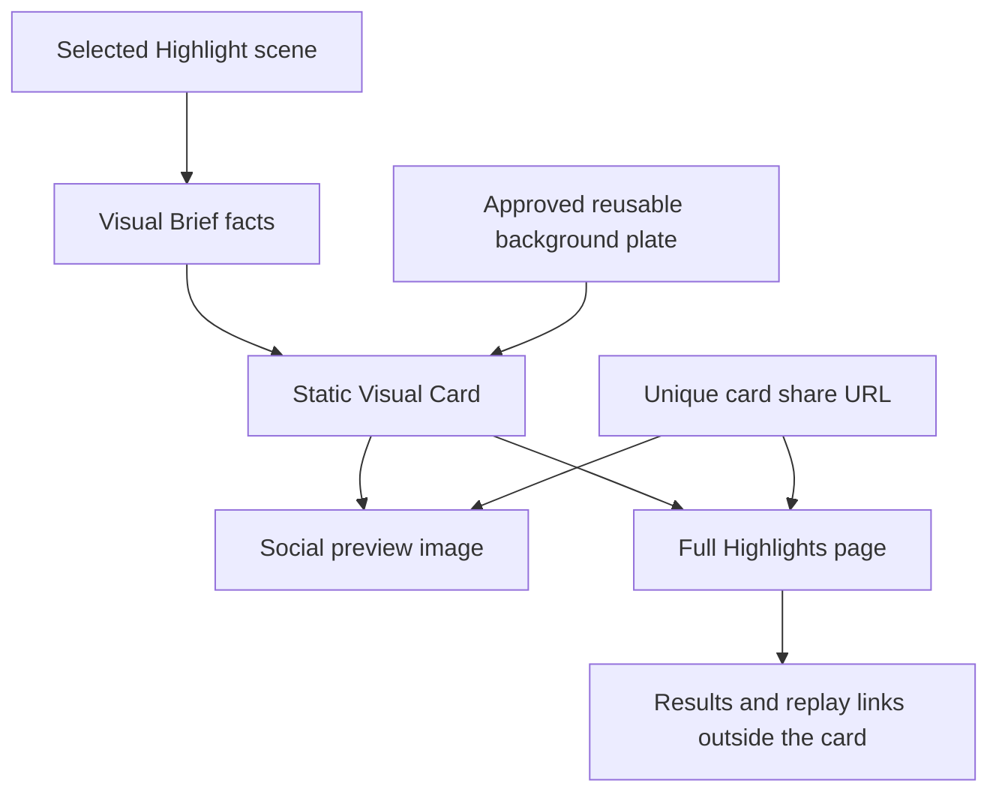
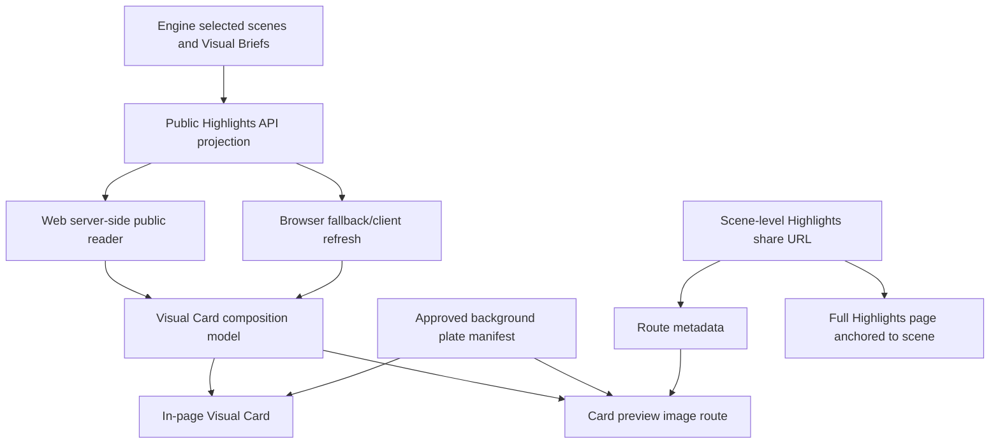
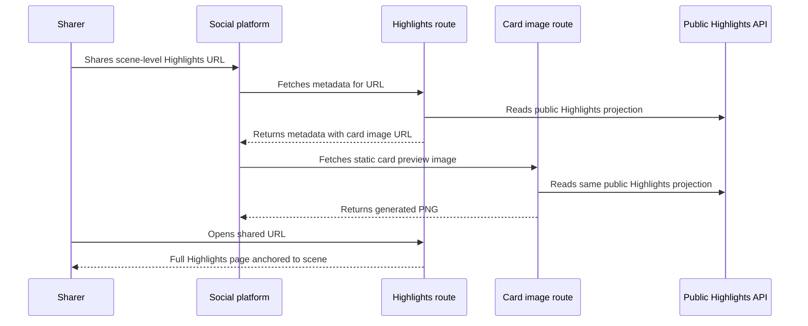

# House Highlights Visual Cards - Plan

## Goal Capsule

- **Objective:** Turn selected House Highlights scenes into polished static Visual Cards that render in-page, have scene-level share URLs, and produce social preview images from the same public facts.
- **Authority order:** Product Contract facts-over-proofs rules first; existing House Highlights selection and Visual Brief contracts second; current web/API implementation patterns third.
- **Execution profile:** Implement the end-to-end hero-card pipeline first, prove share preview and click-through behavior, then apply the card grammar to remaining selected scene types with truthful fallback cards where bespoke templates are not ready.
- **Stop conditions:** Stop before database migrations, durable visual snapshot storage, per-scene image generation, animated trailers, export/download UI, or any change to main-cut/mini-pack/no-cut eligibility.
- **Product Contract preservation:** Product Contract unchanged. The deferred planning questions are resolved in the Planning Contract; no launch-blocking open product question remains.

---

## Product Contract

### Summary

House Highlights Visual Cards are the next public presentation layer on top of Visual Briefs. Each selected scene should get one polished static card, a unique share URL, and a social preview image that reflects the card. The viewer who opens that share should land on the full House Highlights artifact anchored to the shared scene, with surrounding results and replay context nearby.

### Problem Frame

House Highlights now has a truth-safe Visual Brief contract and a deterministic public panel, but the current panel still reads like structured metadata. It explains the intended visual direction, but it is not yet a card someone would naturally share.

The next product step is not an animated trailer. The next step is a static card pipeline that proves the visual grammar, background-plate boundary, share URL behavior, and fact rendering before motion adds more moving parts.

The key correction from the visual probe is that visible proof language is the wrong product surface. A card should not say "proof link", "receipt", "vote record", or "alliance receipt". It should show the underlying facts those records prove: who voted for whom, who was eliminated, who was protected, who was in a named alliance, who reached the final, and what round or outcome made the scene matter.

### Key Decisions

- **Facts over proofs:** Visual Cards show receipted facts and outcomes, not meta-labels about evidence. Evidence links remain outside the card on the surrounding Highlights page.
- **One shareable card per selected scene:** Main House Cuts and mini-highlight packs both use the same Visual Card concept so every selected moment can travel on its own.
- **Share links return to context:** A card share URL produces a card-image social preview, but click-through lands on the full Highlights page anchored to the scene instead of an isolated image or standalone card page.
- **Reusable approved background plates:** Generated imagery is allowed for curated non-factual background plates by category or template. Per-scene live image generation is out of scope.
- **Hero card first, full template coverage after signoff:** The product target is all selected scene types. The delivery sequence may prove one hero card, background, and render path before applying the signed-off grammar to the remaining templates.
- **Trailer-frame direction, layout TBD:** The visual probe made the trailer-frame direction closest, but the final static layout should be decided from actual rendered cards rather than a disposable sketch.

### Actors

- A1. **Cold viewer:** Encounters a shared card link and needs the scene to make sense before reading the full artifact.
- A2. **Returning viewer:** Recognizes the moment and wants a polished shareable artifact that still matches the game record.
- A3. **Agent owner:** Wants their agent's role, action, survival, elimination, win, or loss represented accurately enough to share.
- A4. **The House:** Supplies the editorial framing, title, caption, visual emphasis, and refusal to invent.
- A5. **Card renderer:** Turns Visual Brief facts into a deterministic static card and social preview image.
- A6. **Producer/admin:** Reviews background plates and diagnoses card-generation failures without changing public truth.

### Requirements

**Card experience**

- R1. Every selected House Highlights scene must be eligible for one polished static Visual Card.
- R2. A Visual Card must be understandable as a standalone scene artifact without requiring the viewer to read raw diagnostics.
- R3. A Visual Card must preserve the scene title or House hook, primary involved agents, relevant action or outcome, round context when material, and the scene's emotional category or template family.
- R4. The card must not display "proof link", "receipt", "vote record", "alliance receipt", or similar evidence-meta copy.
- R5. The card may display facts proven by records, such as "Nova voted Ember in Round 5", "Ember was eliminated in Round 5", or "Ember, Nova, and Vale were in Smoke Vote".
- R6. The card must distinguish actual game facts from atmospheric framing. The House may be cinematic, but the factual layer must stay boringly correct.

**Fact rendering**

- R7. Agent names, avatars or initials, vote actions, alliance membership, protection state, elimination state, finalist status, jury outcome, round labels, and outcome captions must be deterministic overlays.
- R8. Generated background imagery must never contain readable names, tallies, ballots, captions, UI labels, or text-like marks that could be mistaken for facts.
- R9. Alliance lines or alliance grouping visuals may appear only when the scene has alliance facts that support them.
- R10. Vote visuals must show actual vote actions or outcomes instead of evidence-tier labels.
- R11. If a fact cannot be rendered clearly and safely, the card must narrow to a simpler truthful statement instead of substituting proof-meta copy.

**Background plates**

- R12. V1 background imagery must come from a reusable approved asset set, not from per-scene live generation.
- R13. Approved background plates must be non-factual mood assets such as empty council chamber, jury wall, abstract vote board, fractured alliance table, spotlight stage, or surveillance-board texture.
- R14. A background plate is public-eligible only after human approval confirms it contains no agent identity, readable factual text, invented physical action, unsupported emotion, or implied relationship.
- R15. Card rendering must work when a generated plate is unavailable by falling back to deterministic styling or an approved non-generated plate.

**Sharing**

- R16. Each Visual Card must have a unique share URL addressable at the scene level.
- R17. Sharing a card URL must produce a static card image preview for social platforms that consume preview metadata.
- R18. Opening a shared card URL must land on the full House Highlights page anchored to the selected scene.
- R19. The full Highlights page must keep results and replay navigation outside the card so evidence remains reachable without cluttering the card image.
- R20. The card image should be useful in common social previews before any downloadable export or upload flow exists.

**Template coverage and rollout**

- R21. The product target is card coverage for all selected scene types currently produced by House Highlights.
- R22. The first implementation may prove one hero template end-to-end before expanding to the remaining templates.
- R23. Templates that are not yet visually specialized must still degrade to a truthful static card instead of keeping the old Visual Brief metadata panel as the public end state.
- R24. Template expansion must reuse the same facts-over-proofs rule across betrayal, vote flip, shield survival, unlikely survival, council slate, jury judgment, alliance formation, alliance rupture, power streak, revenge vote, and endgame collapse.

### Card Content Rules

| Do show | Do not show |
|---|---|
| "Nova voted Ember in Round 5" | "Vote record" |
| "Ember was eliminated" | "Proof link" |
| "Ember, Nova, and Vale were in Smoke Vote" | "Alliance receipt" |
| "Charlie was protected" | "Receipt badge" |
| "Final vote: Alice 4, Bob 3" | Generated vote-board text |
| "Round 5" | Source pointer or diagnostics copy |

### Key Flows

- F1. **Scene card share**
  - **Trigger:** A selected House Highlights scene appears in a main House Cut or mini-highlight pack.
  - **Actors:** A1, A2, A3, A5.
  - **Steps:** The renderer builds a static Visual Card from the scene's Visual Brief and facts, assigns the card a unique share URL, and provides a social preview image for that URL.
  - **Outcome:** A viewer can share one scene without separating it from the full Highlights artifact.
  - **Covers:** R1-R6, R16-R20.

- F2. **Full Highlights click-through**
  - **Trigger:** A cold viewer opens a shared card URL from a social preview.
  - **Actors:** A1, A4, A5.
  - **Steps:** The viewer lands on the full Highlights page at the selected scene. The card is visible in context, and results/replay navigation remains nearby.
  - **Outcome:** The card travels as the hook, while the full artifact preserves supporting results and replay context.
  - **Covers:** R16-R20.

- F3. **Approved background plate use**
  - **Trigger:** A card template calls for a mood or backdrop asset.
  - **Actors:** A4, A5, A6.
  - **Steps:** The card uses an approved reusable plate for its category, keeps all factual text and identity deterministic, and falls back safely if the plate is unavailable.
  - **Outcome:** Generated imagery adds atmosphere without becoming a source of truth.
  - **Covers:** R7-R15.



### Acceptance Examples

- AE1. **Good betrayal card**
  - **Covers:** R3-R11, R16-R20.
  - **Given:** A scene proves that Nova voted Ember out while they shared a named alliance.
  - **When:** The card renders the betrayal scene.
  - **Then:** It may show Ember, Nova, the named alliance, the round, Nova's vote action, and Ember's elimination outcome.

- AE2. **Rejected proof-meta card**
  - **Covers:** R4-R6, R10-R11.
  - **Given:** A card has enough data to show who voted for whom.
  - **When:** The visual copy says "Vote record" or "Proof link" instead of the actual vote fact.
  - **Then:** The card fails the product contract because it exposes proof scaffolding instead of what happened.

- AE3. **Good share preview**
  - **Covers:** R16-R20.
  - **Given:** A selected scene has a unique card share URL.
  - **When:** The URL is shared into a platform that supports preview images.
  - **Then:** The preview image is the static Visual Card, and click-through opens the full Highlights page anchored to that scene.

- AE4. **Rejected generated plate**
  - **Covers:** R8, R12-R15.
  - **Given:** A generated background includes readable names, fake ballots, or people acting out a betrayal.
  - **When:** The plate is reviewed for public use.
  - **Then:** The plate is rejected because it invents or embeds factual content.

- AE5. **Hero-first delivery without product narrowing**
  - **Covers:** R21-R24.
  - **Given:** The first implementation proves one betrayal or vote hero template end-to-end.
  - **When:** Planning sequences the work.
  - **Then:** The Product Contract still expects all selected scene types to receive cards once the signed-off grammar is applied.

### Success Criteria

- The public Highlights experience shows polished static Visual Cards instead of Visual Brief metadata panels as the final card presentation.
- A shared scene link produces a static card image preview and returns viewers to the full Highlights artifact.
- Card copy reads as scene facts and outcomes, not evidence labels or diagnostics.
- Reusable background plates improve atmosphere without carrying facts.
- A first hero card can be reviewed for real visual quality before the remaining templates are expanded.
- Planning can distinguish product requirements from implementation sequencing.

### Scope Boundaries

#### In Scope

- Static Visual Cards for selected House Highlights scenes.
- Unique card share URLs that resolve back to the full Highlights page anchored to the scene.
- Static social preview images for card share URLs.
- Reusable human-approved background plates for safe non-factual atmosphere.
- Continued iteration on which facts belong on-card for each Visual Brief template.
- A hero-card-first delivery path before full template rollout.

#### Deferred For Later

- Animated trailers.
- Generated video.
- AI narration.
- Custom music or soundtrack generation.
- TikTok, YouTube Shorts, X/Twitter, or Discord upload automation.
- Download/export UI for users to save card image files.
- Per-scene live image generation.
- Dedicated standalone card-detail pages.
- Immutable visual snapshot storage if planning can satisfy share previews without it.

#### Outside This Product's Identity

- Cards that show proof scaffolding instead of scene facts.
- Generated images that depict agents performing scene-specific actions.
- Generated images with readable names, vote totals, ballots, captions, or labels.
- Share experiences that strand viewers on an image without the full Highlights context.
- A visual layer that decides what happened.

### Dependencies And Assumptions

- Visual Briefs already provide the scene-owned visual contract and deterministic fact slots that Visual Cards should consume.
- The current public Highlights route is public by URL and currently client-loads public highlight data.
- Share-preview work depends on a deliberate public web metadata/read boundary for Highlights so social cards can be generated from the same public projection.
- Existing avatar availability may be incomplete; cards should work with deterministic initials or names.
- The first approved background plate set can be small if every template has a safe fallback.

### Planning Resolutions

- The first end-to-end hero card should be the betrayal/vote-action template because it exercises the hardest V1 tension: a cinematic scene that must show vote action, elimination outcome, named alliance context, and round context without proof-meta labels.
- The first share preview target is the common wide social-card shape. Square and vertical crops remain design-compatible goals, but the implementation does not need platform upload/export variants in this slice.
- Share preview images should be generated on demand from the public projection and cacheable by URL. Durable visual snapshot storage remains deferred.
- Shared card URLs should keep the user on the full Highlights route by using scene-level query and anchor state, not a standalone card-detail page.
- Background approval starts as repo-owned static assets plus a manifest/review checklist. Producer tooling remains deferred.

### Sources And Research

- `docs/plans/2026-07-04-001-feat-house-highlights-plan.md` defines the locked V1 Highlights artifact, selected scene contract, shareability requirement, and deferred generated media/export boundaries.
- `docs/plans/2026-07-06-001-feat-house-highlights-visual-briefs-plan.md` defines Visual Briefs, deterministic overlays, safe generated-background categories, and the generated-image boundary this plan extends.
- `docs/ideation/2026-07-04-house-highlights-scene-identification-ideation.html` grounds the thesis-led House Highlights and scene-identification work this card layer presents.
- `CONCEPTS.md` defines House Highlights artifacts, Highlight scene cards, Visual Briefs, and Visual Cards as shared vocabulary.
- `docs/refactor-queue.md` identifies the server-side web data loading boundary needed for Highlights share metadata and future OG cards.
- `docs/solutions/architecture-patterns/agent-strategy-observability-spine.md` reinforces that public postgame presentation must derive board facts from canonical projections rather than private transcript or producer evidence.
- `docs/solutions/architecture-patterns/owner-scoped-alliance-read-models.md` reinforces that named alliance facts can be public postgame material only through explicit read-model boundaries, not by leaking private huddle/debug state.
- `packages/engine/src/postgame-highlights/types.ts` currently exposes Visual Briefs on selected scene cards and no longer exposes public `posterDirection` scene copy.
- `packages/api/src/services/postgame-highlights.ts` currently returns public-safe Highlights data and redacts Visual Brief diagnostics.
- `packages/web/src/app/games/[slug]/components/house-highlights-view.tsx` currently renders the interim deterministic Visual Brief panel that Visual Cards should replace as the final visual presentation.

---

## Planning Contract

### Key Technical Decisions

- KTD1. **Add card-facing composition data without reopening scene selection.** The implementation should derive Visual Card facts from selected scene cards, Visual Brief slots, and existing public-safe receipts; it must not alter candidate selection, cut eligibility, or main-cut/mini-pack/no-cut logic.
- KTD2. **Translate evidence vocabulary before public card rendering.** Engine/API data may still carry receipt tiers and Visual Brief overlays for diagnostics and validation, but the card-facing model must convert them into what-happened fact lines and omit evidence-meta labels from the rendered card.
- KTD3. **Use one shared card model with two renderers.** Browser cards and social preview images should consume the same card composition model. The browser renderer may use the existing React/Tailwind page stack, while the preview-image renderer should use the same facts in an `ImageResponse`-compatible layout.
- KTD4. **Create a server-side public Highlights reader for web routes.** Route metadata and preview images cannot depend on the current client-only `HouseHighlightsClient`; they need a server helper that fetches the same public API projection without browser auth or `localStorage`.
- KTD5. **Use the full Highlights route as the share destination.** The canonical card share URL should be a scene-addressed Highlights URL, such as the route plus a scene query and anchor. Metadata can point to a separate image endpoint, but user click-through stays in the full artifact.
- KTD6. **Generate share images on demand with bounded public-route behavior.** V1 should not persist snapshots unless implementation proves the platform cannot serve cacheable route-generated images reliably. The image route must use only the public projection, set cache behavior appropriate for completed-game artifacts, and fail to a safe fallback rather than leaking diagnostics.
- KTD7. **Treat background plates as static approved assets.** The first slice should ship a tiny manifest-backed plate set and deterministic fallbacks. Per-scene generation, upload tooling, and runtime moderation are out of scope.
- KTD8. **Keep public diagnostics separate from card language.** Public pages may provide results/replay links and fact rows outside the card; admin diagnostics may continue to show Visual Brief warnings, rejected backdrops, and receipt tiers.

### High-Level Technical Design





### Output Structure

The exact file names can shift during implementation, but the planned shape is:

```text
packages/web/public/house-highlights/plates/
packages/web/src/app/games/[slug]/highlights/card-image/[sceneId]/route.tsx
packages/web/src/app/games/[slug]/components/house-highlights-card.tsx
packages/web/src/app/games/[slug]/components/house-highlights-card-image.tsx
packages/web/src/app/games/[slug]/components/house-highlights-card-model.ts
packages/web/src/app/games/[slug]/components/house-highlights-backgrounds.ts
packages/web/src/lib/server-api.ts
```

### Sequencing

1. Build the card fact/composition model first so browser and image renderers do not fork truth.
2. Add the server-side public reader before metadata/image routes so share previews are not wired to client hydration.
3. Replace the in-page Visual Brief panel with the first polished hero card and fallback cards.
4. Add scene-level share URLs and metadata once the page has stable anchors.
5. Add the image route and validate that it renders the same card facts.
6. Expand approved background plates and tighten card language after the first real card review.

### Assumptions

- Existing public API redaction is the right privacy boundary; this work should not move admin diagnostics into public routes.
- The first useful share preview is a wide social image. Square and vertical variants can be prepared in model naming but do not need separate rendered images in this slice.
- Current selected scene IDs are stable enough for scene-level links within a completed game; if implementation finds instability, the fix should be a deterministic scene share slug derived from existing selected-scene facts, not a database migration.
- If current Visual Brief slots lack a precise fact line for the hero card, the smallest acceptable addition is a deterministic card fact on the selected scene, sourced from canonical facts already used by the candidate builder.

### Risks And Mitigations

| Risk | Mitigation |
|---|---|
| Card copy drifts back to evidence labels because receipt tiers are already in public DTOs. | Add card-specific tests that inspect rendered card regions for banned evidence-meta terms while allowing admin diagnostics to keep technical labels. |
| Browser card and preview image diverge visually or factually. | Share the composition model and test both renderers against the same fixture scene. |
| Server-side web reads accidentally use browser-only auth/runtime helpers. | Add a dedicated server reader and keep it out of client modules. |
| Social crawlers see generic metadata because the selected scene is only in the hash. | Put the selected scene in query/path state that `generateMetadata` can read, with the hash used only for browser anchoring. |
| Generated or curated plates imply unsupported action or identities. | Keep plates empty/non-factual, require manifest notes, and provide deterministic fallback styling for missing or rejected plates. |
| The first hero card overfits betrayal scenes. | Require generic fallback card coverage for every selected scene and track follow-up template expansion as active plan scope. |

---

## Implementation Units

### U1. Card Composition Facts

- **Goal:** Create a card-facing composition model that turns selected scenes and Visual Briefs into deterministic display facts, roles, emphasis, and safe fallback copy.
- **Requirements:** R1-R11, R21-R24; supports F1 and AE1-AE2.
- **Dependencies:** None.
- **Files:**
  - `packages/engine/src/postgame-highlights/types.ts`
  - `packages/engine/src/postgame-highlights/visual-briefs.ts`
  - `packages/engine/src/postgame-highlights/alliance-candidates.ts`
  - `packages/engine/src/postgame-highlights/public-record-candidates.ts`
  - `packages/engine/src/postgame-highlights/jury-candidates.ts`
  - `packages/engine/src/__tests__/postgame-highlights.test.ts`
  - `packages/api/src/services/postgame-highlights.ts`
  - `packages/api/src/__tests__/postgame-highlights.test.ts`
  - `packages/web/src/lib/api.ts`
  - `packages/web/src/__tests__/house-highlights-fixtures.ts`
- **Approach:** Extend the selected-scene public projection with card-facing facts or composition fields that are safe for browser and image rendering. Keep Visual Brief slots as source direction, but do not ask the card renderer to infer exact fact sentences from receipt tier labels. Preserve public redaction of diagnostics, confidence, event refs, source pointers, private reasoning, and `posterDirection`.
- **Execution note:** Start with characterization coverage around the current betrayal/vote fixture so the new card facts are proven before UI work depends on them.
- **Patterns to follow:** `redactHouseHighlightsDiagnostics(...)` for public/admin separation; `visualBrief(...)` for engine-owned template vocabulary; current postgame projection tests for private-field exclusions.
- **Test scenarios:**
  - Covers AE1. Given a betrayal scene with an eliminated player, an allied voter, a named alliance, and round context, the public scene exposes card facts that can render the vote action/outcome without exposing proof-meta labels.
  - Covers AE2. Given a public Highlights response, serialized public data still excludes `posterDirection`, Visual Brief diagnostics, confidence, event refs, source pointers, and private reasoning.
  - Given a scene whose Visual Brief lacks an optional fact slot, the card composition narrows to the available truthful fact instead of filling with an evidence-tier label.
  - Given admin diagnostics, technical Visual Brief diagnostics and receipt tiers remain available only on the admin route.
- **Verification:** Engine/API tests prove the public projection has enough deterministic card facts for the hero template and does not leak diagnostics or proof scaffolding as card copy.

### U2. Server-Side Highlights Reader

- **Goal:** Add a web server-side public Highlights read path so route metadata and card image routes can load the same public projection before client hydration.
- **Requirements:** R16-R20; supports F1-F2 and AE3.
- **Dependencies:** U1.
- **Files:**
  - `packages/web/src/lib/server-api.ts`
  - `packages/web/src/lib/server-runtime-config.ts`
  - `packages/web/src/lib/api.ts`
  - `packages/web/src/app/games/[slug]/highlights/page.tsx`
  - `packages/web/src/app/games/[slug]/highlights/house-highlights-client.tsx`
  - `packages/web/src/__tests__/house-highlights-page.test.tsx`
  - `packages/web/src/__tests__/house-highlights-server-api.test.ts`
- **Approach:** Introduce a server-only helper for public API reads that uses server runtime configuration and avoids browser token/localStorage behavior. The Highlights page should accept server-loaded initial data when available and keep the client loader as refresh/fallback behavior for local and transient failures.
- **Patterns to follow:** Existing SSR fetch-and-fallback pattern in `packages/web/src/app/games/[slug]/page.tsx`, `results/page.tsx`, and `replay/page.tsx`; `packages/web/next.config.ts` environment split for `API_BACKEND_URL`.
- **Test scenarios:**
  - Given server fetch succeeds, the Highlights page renders with initial data and no loading-only shell is required for the first paint.
  - Given server fetch fails, the page still renders the client loading/error path without crashing route metadata or the page.
  - Given the server helper runs in a non-browser environment, it does not call `getAuthToken`, `localStorage`, or the client runtime config provider.
  - Given the public API returns a non-ok Highlights response, the server page and metadata degrade to generic Highlights copy rather than throwing unhandled errors.
- **Verification:** Web tests prove server-loaded Highlights can render the page and failure states remain legible.

### U3. Scene-Level Share URLs And Metadata

- **Goal:** Make every selected scene addressable by a unique share URL whose metadata points to that scene's static card image while click-through opens the full Highlights page anchored to the card.
- **Requirements:** R16-R20; supports F1-F2 and AE3.
- **Dependencies:** U1, U2.
- **Files:**
  - `packages/web/src/lib/game-links.ts`
  - `packages/web/src/app/games/[slug]/highlights/page.tsx`
  - `packages/web/src/app/games/[slug]/highlights/house-highlights-client.tsx`
  - `packages/web/src/app/games/[slug]/components/house-highlights-view.tsx`
  - `packages/web/src/app/games/[slug]/components/house-highlights-model.ts`
  - `packages/web/src/__tests__/house-highlights-model.test.ts`
  - `packages/web/src/__tests__/house-highlights-page.test.tsx`
- **Approach:** Add a canonical card share href that includes scene-identifying query state plus an anchor. Use route metadata to validate the selected scene and set scene-specific Open Graph/Twitter image URLs and alt text. The visible page should scroll or anchor to the selected card and keep results/replay navigation outside the card.
- **Technical design:** Directional URL shape: `/games/:slug/highlights?scene=:sceneId#scene-:sceneId`. The query makes metadata scene-aware; the hash handles browser anchoring.
- **Patterns to follow:** Existing `gameHighlightsHref(...)`, `gameResultsHref(...)`, and slug encoding helpers in `packages/web/src/lib/game-links.ts`.
- **Test scenarios:**
  - Covers AE3. Given a selected scene, the model exposes a share URL that includes the encoded scene ID and anchors to the card.
  - Given a scene ID with characters that require encoding, the generated share URL remains valid and does not double-encode the game slug.
  - Given route metadata receives a valid selected scene, metadata title/description and image URL are scene-specific.
  - Given route metadata receives a valid selected scene, social image metadata includes alt text derived from the card title or House hook.
  - Given route metadata receives a missing or invalid selected scene, metadata falls back to generic Highlights copy and does not leak errors.
  - Given the page renders with a selected scene, the matching card has a stable DOM anchor and visible selected-state affordance.
- **Verification:** Web tests prove share URL generation, route metadata behavior, and anchored page rendering.

### U4. In-Page Visual Card Renderer

- **Goal:** Replace the public Visual Brief metadata panel with a polished static card renderer for the first hero template plus truthful fallback cards for all selected scenes.
- **Requirements:** R1-R11, R19, R21-R24; supports F1-F2 and AE1-AE2, AE5.
- **Dependencies:** U1, U3.
- **Files:**
  - `packages/web/src/app/games/[slug]/components/house-highlights-card-model.ts`
  - `packages/web/src/app/games/[slug]/components/house-highlights-card.tsx`
  - `packages/web/src/app/games/[slug]/components/house-highlights-backgrounds.ts`
  - `packages/web/src/app/games/[slug]/components/house-highlights-model.ts`
  - `packages/web/src/app/games/[slug]/components/house-highlights-view.tsx`
  - `packages/web/src/__tests__/house-highlights-model.test.ts`
  - `packages/web/src/__tests__/house-highlights-page.test.tsx`
- **Approach:** Build a fixed-format card surface with deterministic agent identity, title/hook, round/outcome, and fact boxes. The betrayal/vote-action hero template gets the most polished layout first; every other selected scene renders through a generic card that uses the same safe fact model. Move evidence/navigation affordances outside the card, keep accessible text equivalents for card facts, and rename public context around facts so the card does not show proof scaffolding.
- **Execution note:** Verify actual screenshots in implementation before expanding templates; static layout quality is the reason this slice exists.
- **Patterns to follow:** Existing House Highlights page composition and completed-results agent card patterns; frontend guidance on stable dimensions, no nested cards, and no explanatory feature text inside the UI.
- **Test scenarios:**
  - Covers AE1. Given the betrayal fixture, the rendered card shows the involved agents, round/outcome facts, and alliance context as what-happened copy.
  - Covers AE2. The rendered card region does not contain evidence-meta strings such as "Proof link", "Receipts", "Vote record", "Alliance receipt", "Receipt badge", or "Deterministic overlays".
  - Given a non-betrayal scene, the fallback card renders title, House hook, involved agents, and at least one truthful fact without showing the old Visual Brief panel.
  - Given missing avatar imagery, the card uses deterministic initials/name fallback without layout shift.
  - Given mobile and desktop widths, card text stays inside its containers and the share/action controls remain outside the card.
  - Given a screen-reader user reaches a card, the title, agents, fact lines, and supporting navigation are exposed as text rather than background-image-only content.
- **Verification:** Web render tests and browser visual QA prove the page now presents Visual Cards rather than Visual Brief metadata.

### U5. Static Card Preview Image Route

- **Goal:** Generate a static social preview image for each card share URL from the same composition model used by the browser card.
- **Requirements:** R7-R8, R12-R20; supports F1-F3 and AE3-AE4.
- **Dependencies:** U1, U2, U4.
- **Files:**
  - `packages/web/src/app/games/[slug]/highlights/card-image/[sceneId]/route.tsx`
  - `packages/web/src/app/games/[slug]/components/house-highlights-card-image.tsx`
  - `packages/web/src/app/games/[slug]/components/house-highlights-card-model.ts`
  - `packages/web/src/app/games/[slug]/components/house-highlights-backgrounds.ts`
  - `packages/web/src/__tests__/house-highlights-card-image.test.tsx`
  - `packages/web/src/__tests__/house-highlights-page.test.tsx`
- **Approach:** Use Next's App Router image response path to render a 1200x630 PNG for valid scene IDs. Keep the image layout Satori/ImageResponse-compatible by using explicit inline styles and the shared card composition data rather than Tailwind-only browser markup. Invalid scenes return a safe fallback image or not-found behavior that does not expose diagnostics, and successful image responses should be cacheable for completed-game card URLs.
- **Patterns to follow:** Next App Router route handler conventions; `next/og` `ImageResponse` guidance for dynamic OG images; explicit font/layout handling rather than relying on browser CSS.
- **Test scenarios:**
  - Covers AE3. Given a valid scene ID, the image route returns a PNG response for the matching card.
  - Given an invalid scene ID, the image route does not throw an unhandled error or expose private diagnostics.
  - Given the betrayal fixture, the image renderer receives the same card title, agents, and fact lines as the browser card model.
  - Given a background plate is unavailable, the image route uses deterministic fallback styling.
  - Given banned evidence-meta terms, the image component's serialized text content excludes them from card copy.
  - Given a successful card image response, the route sets cache behavior appropriate for public completed-game artifacts.
- **Verification:** Route/component tests plus local browser or HTTP inspection prove metadata image URLs resolve to card images.

### U6. Approved Background Plate Set

- **Goal:** Ship the smallest approved reusable background plate set and manifest needed to make the hero card feel cinematic without making generated imagery responsible for facts.
- **Requirements:** R8, R12-R15; supports F3 and AE4.
- **Dependencies:** U4, U5.
- **Files:**
  - `packages/web/public/house-highlights/plates/`
  - `packages/web/src/app/games/[slug]/components/house-highlights-backgrounds.ts`
  - `packages/web/src/__tests__/house-highlights-model.test.ts`
- **Approach:** Add a manifest that maps Visual Brief backdrop categories to approved static assets and fallback styles. Start with the hero-card plate category plus at least one neutral fallback. Each asset must be reviewed as empty/non-factual: no names, no readable text, no ballots, no agents, no physical betrayal scene, no emotion claims.
- **Execution note:** If image generation is used to create the initial plate, treat the generated output as a candidate asset that must be manually approved before landing in `public`.
- **Patterns to follow:** Existing `packages/web/public` static asset placement; Visual Brief backdrop categories in `packages/engine/src/postgame-highlights/visual-briefs.ts`.
- **Test scenarios:**
  - Covers AE4. Given a backdrop category with an approved asset, the manifest returns that asset and its public path.
  - Given a backdrop category without an approved asset, the renderer uses deterministic fallback styling.
  - Given a generated asset candidate is rejected during review, no renderer path references it.
  - Given a category maps to an asset, browser and image renderers use the same manifest entry.
- **Verification:** Asset manifest tests and visual QA prove background plates are reusable mood assets and cards remain truthful without them.

### U7. Public Context, Diagnostics, And Documentation Cleanup

- **Goal:** Keep evidence access and producer diagnostics useful while preventing proof-scaffold copy from becoming the public card language.
- **Requirements:** R4-R6, R19, R23-R24; supports AE2 and AE5.
- **Dependencies:** U1-U6.
- **Files:**
  - `packages/web/src/app/games/[slug]/components/house-highlights-view.tsx`
  - `packages/web/src/app/admin/admin-highlights-diagnostics.tsx`
  - `packages/web/src/__tests__/house-highlights-page.test.tsx`
  - `packages/web/src/__tests__/admin-highlights-diagnostics.test.tsx`
  - `CONCEPTS.md`
  - `docs/refactor-queue.md`
- **Approach:** Adjust public Highlights context so viewer-facing side panels use fact language and navigation labels, while admin diagnostics retain technical Visual Brief and receipt vocabulary where it helps producers debug. Update docs only where behavior or vocabulary changed during implementation; avoid reworking older brainstorms.
- **Patterns to follow:** Existing public/admin separation in `packages/api/src/services/postgame-highlights.ts` and admin diagnostics tests.
- **Test scenarios:**
  - Given the public Highlights page, card regions and immediate card context do not show evidence-meta copy as visual language.
  - Given the page still provides results/replay navigation, viewers can reach supporting context without the card itself becoming a proof panel.
  - Given admin diagnostics render selected cards and rejected candidates, producer-facing labels for Visual Brief diagnostics remain available.
  - Given docs mention Visual Card, `CONCEPTS.md` remains a glossary entry rather than a duplicate spec.
- **Verification:** Public web tests and admin diagnostics tests prove the audience split survived the visual-card refactor.

---

## Verification Contract

| Gate | Applies to | Done signal |
|---|---|---|
| `bun run test` | U1-U7 | Mock/unit test suite passes across workspaces. |
| `bun run check` | U1-U7 | Typecheck and lint pass for the monorepo. |
| Focused engine/API tests | U1 | House Highlights projection and public redaction tests prove card facts and privacy boundaries. |
| Focused web tests | U2-U7 | House Highlights model/page/card/image tests prove share URLs, metadata, card copy, and fallback rendering. |
| Browser visual QA | U4-U6 | Desktop and mobile screenshots show a polished hero card, truthful fallback cards, no text overlap, and no proof-meta copy in card regions. |
| Share preview smoke | U3, U5 | A scene-level share URL has scene-specific metadata and its image URL returns the static card image. |

Manual verification should include one main House Cut and one mini-highlight pack fixture or local completed game. The card must still be useful if the background plate fails to load.

---

## Definition of Done

- Every selected scene has a scene-level Visual Card model, a rendered in-page card, and a unique share URL.
- The first betrayal/vote-action hero card is polished enough for product review, and non-hero templates render truthful fallback cards rather than Visual Brief metadata panels.
- Card regions show facts and outcomes, not "proof link", "receipt", "vote record", "alliance receipt", "receipt badge", deterministic-overlay labels, diagnostics, source pointers, or confidence/debug language.
- Share URL metadata resolves a static card image, and opening the URL lands on the full Highlights page anchored to the selected scene.
- Browser card and preview image are driven by the same composition facts.
- Approved background plates are static reusable mood assets with deterministic fallbacks.
- Public API/web redaction still excludes admin diagnostics, event refs, source pointers, private reasoning, confidence, and `posterDirection`.
- Admin diagnostics remain useful for Visual Brief and card-generation troubleshooting.
- `CONCEPTS.md` and any touched docs match the implemented vocabulary.
- Dead-end experimental code, unused assets, and obsolete Visual Brief panel branches are removed from the diff before completion.
